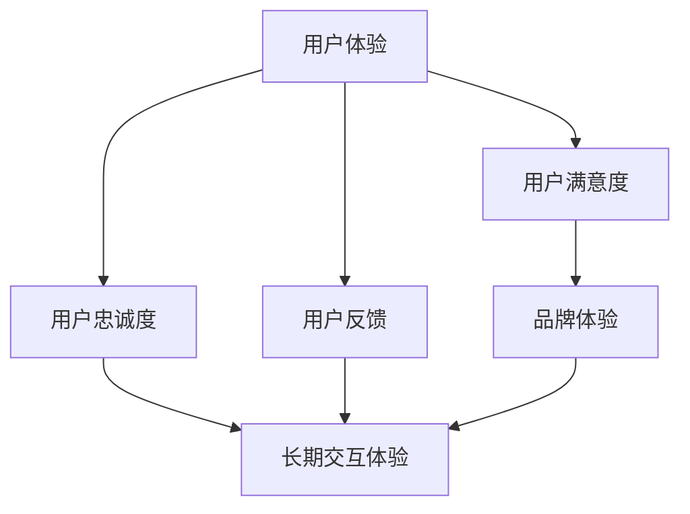

                 

### 引言

在当今科技迅猛发展的时代，用户体验（UX）已经成为了产品开发和设计过程中的核心关注点。然而，随着产品不断迭代和用户需求的不断变化，单纯的短期用户体验评测已经无法全面反映用户对产品的真实感受。长期交互体验评测作为一项新兴的研究领域，逐渐引起了广泛关注。它不仅关注用户在产品使用初期的体验，更关注用户在长期使用过程中所产生的感受和满意度。

长期交互体验评测的重要性在于：

1. **揭示潜在问题**：通过长期观察和分析用户行为，可以发现用户在使用过程中遇到的潜在问题，从而在产品迭代中及时进行优化。

2. **提高用户满意度**：深入了解用户在长期使用中的需求和痛点，有助于产品团队提供更加符合用户期待的功能和服务，提高用户满意度。

3. **增强品牌忠诚度**：优质的长久用户体验能够增强用户对品牌的信任和忠诚度，从而提高产品的市场竞争力。

本文将以《长期交互体验评测：模拟真实使用场景》为题，系统探讨长期交互体验评测的相关概念、方法和技术。我们将首先介绍用户体验和长期交互的基本概念，然后深入探讨长期交互体验评测的核心方法和技术，并通过实际案例展示如何模拟真实使用场景进行评测。文章还将分析长期交互体验评测的评估指标，最后展望这一领域的未来发展趋势。

通过本文的阅读，读者将能够：

1. 理解用户体验和长期交互的概念及其重要性。
2. 掌握长期交互体验评测的方法和技术。
3. 学会如何通过模拟真实使用场景进行长期交互体验评测。
4. 了解长期交互体验评测的评估指标及其应用。

让我们开始这场深入探讨之旅，一同探索如何通过科学的方法提升产品的长期交互体验。

### 关键词

用户体验（UX）、长期交互体验评测、用户行为模拟、数据采集与分析、评估指标、模拟真实使用场景、技术实现与工具、未来趋势与展望。

### 摘要

本文旨在深入探讨长期交互体验评测的概念、方法和技术。首先，介绍了用户体验和长期交互的基本概念，探讨了其重要性。随后，文章详细阐述了长期交互体验评测的核心方法和技术，包括评测框架、量化与定性方法。通过实际案例，本文展示了如何通过模拟真实使用场景进行长期交互体验评测，并分析了评估指标的应用。最后，文章展望了该领域的未来发展趋势，为读者提供了实践指南和研究方向。通过本文的阅读，读者将能够掌握长期交互体验评测的核心知识，提升产品的用户体验。

----------------------------------------------------------------

### 1. 设计原则

为了确保文章内容逻辑清晰、结构紧凑、简单易懂，同时能够深入浅出地阐述长期交互体验评测的技术和方法，本文设计遵循以下原则：

#### 1.1 核心概念与联系

**步骤一**：明确核心概念。确保读者能够清晰理解用户体验（UX）、长期交互、评测方法等关键概念。  
**步骤二**：使用 Mermaid 流程图展示概念之间的联系。通过图形化方式帮助读者快速掌握概念间的逻辑关系。

#### 1.2 核心算法原理讲解

**步骤一**：挑选关键算法。选择在长期交互体验评测中至关重要的算法进行详细讲解。  
**步骤二**：使用 Python 源代码实现。将算法用代码实现，便于读者理解。  
**步骤三**：结合数学模型和公式。使用 LaTeX 格式嵌入相关数学公式，并进行详细讲解。

#### 1.3 数学模型和数学公式

**步骤一**：识别核心数学模型。确定评测过程中涉及的核心数学模型。  
**步骤二**：使用 LaTeX 格式嵌入公式。确保公式嵌入文中，便于读者理解。  
**步骤三**：举例说明。通过具体例子展示公式的应用，提高读者理解度。

#### 1.4 项目实战

**步骤一**：确定实际案例。选择具有代表性的真实案例进行详细分析。  
**步骤二**：提供开发环境搭建指南。为读者提供完整的环境搭建步骤。  
**步骤三**：详细解读源代码。深入剖析源代码的实现原理和步骤。  
**步骤四**：代码应用解读与分析。结合实际案例，展示代码的应用效果和分析。

#### 1.5 最佳实践 tips、小结、注意事项、拓展阅读

**步骤一**：总结关键点。在每个章节或段落结束后，总结核心内容和关键点。  
**步骤二**：提供最佳实践 tips。分享实际操作中的宝贵经验和技巧。  
**步骤三**：注意事项。提醒读者在使用方法和技术时需要注意的问题。  
**步骤四**：拓展阅读。推荐相关书籍、论文、网站等资源，供读者进一步学习。

通过以上设计原则，本文旨在为读者提供一份系统、全面、易于理解的长期交互体验评测指南，帮助他们更好地应用相关技术提升产品的用户体验。

### 目录大纲结构

为了确保文章内容的逻辑性和完整性，本文将采用以下目录大纲结构进行设计。这个结构旨在帮助读者清晰地了解全文内容，便于学习和理解。

#### 引言

- **背景介绍**：介绍长期交互体验评测的重要性和应用场景。
- **目标读者**：明确本文面向的用户群体和预期效果。

#### 核心概念与联系

- **用户体验与长期交互**：阐述用户体验和长期交互的定义及其相互关系。
- **长期交互体验评测方法**：介绍长期交互体验评测的主要方法和技术。

#### 第一部分：长期交互体验评测基础

##### 第1章：用户体验与长期交互

- **用户体验的概念**：解释用户体验的基本概念及其重要性。
- **长期交互的挑战**：分析长期交互过程中可能遇到的问题和挑战。
- **用户体验与长期交互的关系**：探讨用户体验对长期交互的影响及如何评估长期用户体验。

##### 第2章：用户体验评测方法

- **评测框架**：介绍用户体验评测的基本框架和流程。
- **量化方法**：讨论如何通过量化手段评估用户体验。
- **定性方法**：探讨定性评估方法及其应用。

##### 第3章：模拟真实使用场景

- **场景设定**：设定模拟真实使用场景，并解释其重要性。
- **用户行为模拟**：介绍如何模拟用户行为并进行数据采集。
- **数据采集与分析**：详细说明数据采集方法和分析过程。

##### 第4章：长期交互体验评估指标

- **指标定义**：明确长期交互体验评估的各项指标。
- **指标计算方法**：解释如何计算各项评估指标。
- **指标分析与应用**：探讨如何应用评估指标进行用户体验分析。

##### 第5章：案例研究

- **现有案例概述**：介绍已有的长期交互体验评测案例。
- **案例分析**：对案例进行详细分析，提取关键经验。
- **案例总结与启示**：总结案例中的经验和教训，为读者提供启示。

##### 第6章：技术实现与工具

- **实现技术选型**：讨论在长期交互体验评测中应选择的技术和工具。
- **工具介绍与使用**：介绍常用的评测工具及其使用方法。
- **技术挑战与解决方案**：分析评测过程中可能遇到的技术挑战及解决方案。

##### 第7章：未来趋势与展望

- **用户体验发展趋势**：预测用户体验领域的未来趋势。
- **长期交互的未来**：探讨长期交互技术的发展方向。
- **潜在研究方向**：提出长期交互体验评测领域的潜在研究方向。

### 目录大纲具体内容

以下为本文的具体目录大纲内容，每个章节都包含详细的标题和子标题，确保文章内容的全面性和逻辑性。

```
# 《长期交互体验评测：模拟真实使用场景》目录大纲

## 引言
### 背景介绍
### 目标读者
### 主要内容概述

## 核心概念与联系
### 用户体验与长期交互
### 长期交互体验评测方法

## 第一部分：长期交互体验评测基础

### 第1章：用户体验与长期交互
#### 用户体验的概念
#### 长期交互的挑战
#### 用户体验与长期交互的关系

### 第2章：用户体验评测方法
#### 评测框架
#### 量化方法
#### 定性方法

### 第3章：模拟真实使用场景
#### 场景设定
#### 用户行为模拟
#### 数据采集与分析

### 第4章：长期交互体验评估指标
#### 指标定义
#### 指标计算方法
#### 指标分析与应用

### 第5章：案例研究
#### 现有案例概述
#### 案例分析
#### 案例总结与启示

### 第6章：技术实现与工具
#### 实现技术选型
#### 工具介绍与使用
#### 技术挑战与解决方案

### 第7章：未来趋势与展望
#### 用户体验发展趋势
#### 长期交互的未来
#### 潜在研究方向
```

通过这个目录大纲，读者可以清晰地了解到文章的结构和内容，便于他们系统地学习和掌握长期交互体验评测的相关知识。

----------------------------------------------------------------

## 核心概念与联系

### 用户体验与长期交互

用户体验（UX）是用户在使用产品或服务过程中所感受到的整体体验，包括用户对产品的情感反应、认知体验和功能性体验。用户体验涵盖了用户界面设计、交互设计、信息架构、内容和产品的性能等多个方面。长期交互体验则是指用户在长期使用产品过程中所积累的体验，它不仅关注用户在初期使用时的感受，还关注用户在持续使用过程中所产生的持续性和累积性体验。

#### 用户体验

用户体验的核心概念包括：

- **易用性**：产品易于学习和使用，用户能够高效完成任务。
- **可用性**：产品能够满足用户的期望和需求。
- **用户满意度**：用户对产品或服务的满意程度。
- **品牌体验**：产品或服务给用户带来的品牌印象。

#### 长期交互体验

长期交互体验的核心概念包括：

- **用户忠诚度**：用户对产品的持续使用和品牌忠诚。
- **用户疲劳度**：用户在长期使用过程中可能产生的疲劳和厌烦。
- **用户反馈**：用户在使用过程中提供的意见和建议。
- **社交因素**：用户在社区或社交网络中的互动和交流。

#### 关系架构

用户体验和长期交互之间存在密切的联系。良好的用户体验可以促进用户对产品的满意度和忠诚度，从而推动长期交互体验的提升。反之，不佳的用户体验可能导致用户在长期使用过程中产生负面情绪，影响产品的市场表现和用户留存率。因此，在进行长期交互体验评测时，必须综合考虑用户体验的各个方面。

### Mermaid 流程图

为了更直观地展示用户体验和长期交互之间的关系，我们可以使用 Mermaid 流程图来描述这一过程。以下是一个简化的 Mermaid 流程图示例：



在这个流程图中：

- **A（用户体验）** 是起点，表示用户体验的整体感受。
- **B（用户满意度）** 和 **C（用户忠诚度）** 是用户体验的两个重要方面，它们直接影响 **F（长期交互体验）**。
- **D（用户反馈）** 和 **E（品牌体验）** 也对长期交互体验产生重要影响。
- 箭头表示影响方向，即用户体验对长期交互体验的推动或阻碍作用。

通过这个流程图，我们可以清晰地看到用户体验和长期交互之间的因果关系，有助于理解长期交互体验评测的核心概念和联系。

### 用户体验评测方法

用户体验评测方法包括量化方法和定性方法，这两种方法在实际应用中各有优势，能够相互补充，从而提供全面、多维度的用户体验评估。

#### 量化方法

**步骤一**：定义评估指标。量化方法通常基于一系列评估指标，这些指标能够量化和衡量用户体验的各个方面。常见的评估指标包括用户满意度评分、任务完成时间、错误率等。

**步骤二**：数据收集。通过调查问卷、用户行为追踪等技术手段，收集大量用户数据，确保数据的广泛性和代表性。

**步骤三**：数据分析。使用统计分析方法，如均值、方差、相关性分析等，对收集到的数据进行分析，从中提取有用的信息。

**步骤四**：结果解释。根据数据分析结果，解释用户体验的优缺点，并提出改进建议。

**实例**：假设我们使用任务完成时间作为评估指标，收集一组用户在特定任务上的完成时间数据。通过计算平均完成时间和标准差，可以评估用户的平均表现和表现的一致性。如果发现大多数用户的完成时间过长，那么可以推断该任务在用户体验方面存在问题，需要进一步优化。

#### 定性方法

**步骤一**：设计访谈指南。定性方法主要通过访谈、观察等方式获取用户反馈。在访谈前，需要设计一份详细的访谈指南，确保访谈内容的一致性和针对性。

**步骤二**：进行用户访谈。与用户进行一对一或小组访谈，询问他们对产品或服务的感受、意见和建议。访谈过程中，需要注重倾听和理解用户的真实感受。

**步骤三**：观察用户行为。在用户实际使用产品的过程中，观察他们的操作行为和情绪反应，记录关键行为和反馈。

**步骤四**：分析访谈与观察结果。将访谈和观察结果进行整理和分析，提取用户的主要意见和建议，识别用户体验中的问题和亮点。

**实例**：假设我们访谈了一组用户，询问他们对新推出的移动应用的感受。用户反馈表明，他们更喜欢应用中的某个新功能，但同时也提到某些界面元素难以理解。通过这些反馈，我们可以了解到用户对应用的总体满意度，以及需要改进的方面。

#### 量化与定性方法的结合

**步骤一**：数据整合。将量化方法和定性方法收集到的数据进行整合，形成全面的用户体验评估报告。

**步骤二**：交叉验证。通过量化数据和定性数据的交叉验证，增强评估结果的可靠性。

**步骤三**：综合分析。结合定量和定性数据，从不同维度对用户体验进行综合分析，提出全面的改进建议。

**实例**：假设我们通过用户满意度调查问卷（量化方法）和用户访谈（定性方法）收集了关于新应用的数据。量化方法显示用户总体满意度较高，而定性方法揭示了用户在特定功能上的困惑。通过结合两种方法的数据，我们可以全面了解用户的满意度，并针对具体问题提出改进措施。

通过量化方法和定性方法的结合，用户体验评测可以提供更为全面、准确的评估结果，帮助产品团队更好地理解用户需求，优化产品设计，提升用户体验。

### 模拟真实使用场景

在长期交互体验评测中，模拟真实使用场景是至关重要的一步。这种方法不仅可以确保评测的准确性和可靠性，还能帮助团队深入理解用户在真实环境中的行为和需求。以下是模拟真实使用场景的详细步骤和过程。

#### 场景设定

**步骤一**：确定目标用户群体。首先，需要明确目标用户群体的特征和需求，这包括年龄、性别、职业、使用习惯等。通过对目标用户的深入了解，可以为场景设定提供指导。

**步骤二**：选择具体应用场景。根据目标用户的特点，选择一个或多个典型的使用场景。这些场景应当反映用户在日常生活中的实际使用情况，例如工作、学习、娱乐等。

**步骤三**：设计任务流程。在选定场景的基础上，设计一系列任务流程，这些任务应当能够覆盖用户在场景中的主要操作和交互行为。任务流程应当详细、具体，确保用户能够按照设定的步骤进行操作。

#### 用户行为模拟

**步骤一**：创建用户角色。创建一组用户角色，每个角色对应一个特定的用户群体和特点。这些角色可以帮助我们更准确地模拟用户行为。

**步骤二**：模拟用户行为。使用脚本或工具，模拟用户在实际场景中的行为。例如，可以通过自动化测试工具模拟用户在网站上的点击、浏览、搜索等操作。

**步骤三**：收集行为数据。在模拟过程中，收集用户行为数据，包括点击路径、操作时间、错误率等。这些数据将用于后续分析。

#### 数据采集与分析

**步骤一**：数据收集。在用户行为模拟过程中，使用各种工具和技术收集用户行为数据。这些工具可能包括日志文件、监控脚本、用户行为追踪软件等。

**步骤二**：数据清洗与整理。对收集到的原始数据进行清洗和整理，去除无效数据，确保数据的质量和一致性。

**步骤三**：数据分析。使用统计分析方法，对整理后的数据进行分析，提取用户行为模式和关键指标。常见的分析方法包括回归分析、聚类分析、相关性分析等。

**步骤四**：结果解释。根据数据分析结果，解释用户在模拟真实使用场景中的行为和反应，识别潜在的问题和改进机会。

#### 实例分析

**实例一**：假设我们正在评估一款移动应用的用户体验，目标用户是年轻职场人士。我们选择了一个典型的使用场景——用户在繁忙的工作日使用应用进行日程管理。

- **场景设定**：用户在早晨打开应用查看日程安排，规划当天的任务，并在中午时更新任务进度。
- **用户行为模拟**：使用自动化测试工具模拟用户的行为，包括点击日程查看、添加新任务、更新任务状态等。
- **数据采集与分析**：收集用户在模拟过程中的操作时间、错误率、任务完成情况等数据，通过分析发现用户在添加新任务时操作繁琐，容易出错。

**实例二**：另一款应用的场景设定是用户在旅行中使用导航功能。用户需要从起点导航到多个目的地。

- **场景设定**：用户在旅行过程中使用应用导航，包括查看路线、避开拥堵路段等。
- **用户行为模拟**：模拟用户在复杂路况下的导航操作，包括路线选择、调整目的地、查看实时交通信息等。
- **数据采集与分析**：分析用户在导航过程中出现的高频问题，如路线错误、导航时间过长等，并提出改进建议。

通过模拟真实使用场景，我们可以更加准确地评估产品的用户体验，发现潜在的问题和改进机会。这种方法不仅有助于提升产品的可用性和满意度，还能为团队提供宝贵的数据支持和决策依据。

### 长期交互体验评估指标

在长期交互体验评测中，评估指标的选择和应用至关重要。这些指标能够帮助团队全面、客观地了解用户在长期使用过程中的感受和满意度。以下是几种常见的长期交互体验评估指标及其计算方法和应用。

#### 指标定义

**1. 用户满意度（User Satisfaction）**

用户满意度是指用户对产品或服务的整体满意程度。它通常通过调查问卷或评分系统进行量化评估。

**2. 用户忠诚度（User Loyalty）**

用户忠诚度是指用户对产品或服务的长期依赖和忠诚程度。它可以通过用户留存率、重复购买率等指标来衡量。

**3. 用户疲劳度（User Fatigue）**

用户疲劳度是指用户在长期使用过程中产生的疲劳和厌烦程度。它可以通过用户活跃度下降、任务完成时间延长等指标来评估。

**4. 用户反馈（User Feedback）**

用户反馈是指用户在使用产品过程中提供的意见和建议。它可以通过用户评论、问卷调查、访谈等方式收集。

#### 指标计算方法

**1. 用户满意度计算**

用户满意度的计算方法通常采用问卷调查中的评分机制。例如，使用1到5分的量表，用户对产品或服务的各个方面进行评分，然后将所有评分求平均得到总体满意度。

- **平均满意度**：$$\bar{S} = \frac{\sum_{i=1}^{n} S_i}{n}$$
  其中，\(S_i\) 表示第 \(i\) 个用户的满意度评分，\(n\) 表示参与评估的用户总数。

**2. 用户忠诚度计算**

用户忠诚度可以通过用户留存率和重复购买率来衡量。例如，用户在一段时间内的留存率可以计算为：

- **留存率**：$$L = \frac{\text{一段时间内留存用户数}}{\text{初始注册用户数}} \times 100\%$$

**3. 用户疲劳度计算**

用户疲劳度可以通过用户活跃度的下降和任务完成时间的延长来评估。例如，用户在一段时间内的活跃度下降率可以计算为：

- **活跃度下降率**：$$F = \frac{\text{当前活跃度} - \text{初始活跃度}}{\text{初始活跃度}} \times 100\%$$

**4. 用户反馈计算**

用户反馈可以通过计算用户评论的情感倾向来量化。例如，使用情感分析技术，将用户的正面评论赋值为正，负面评论赋值为负，然后计算总体情感倾向：

- **情感倾向**：$$T = \frac{\sum_{i=1}^{n} F_i}{n}$$
  其中，\(F_i\) 表示第 \(i\) 个用户评论的情感倾向（正或负），\(n\) 表示参与评估的用户总数。

#### 指标分析与应用

**1. 用户满意度分析**

用户满意度是评估用户体验的重要指标。通过分析用户满意度，团队能够了解用户对产品的整体评价，发现需要改进的方面。例如，如果用户满意度较低，团队可以进一步分析具体的原因，可能是某个功能不够完善或用户界面设计存在问题。

**2. 用户忠诚度分析**

用户忠诚度反映了用户对产品的长期依赖和忠诚程度。高忠诚度的用户通常意味着产品的市场表现较好，用户基础稳定。通过分析用户忠诚度，团队能够评估产品的市场竞争力，并制定相应的策略来提高用户忠诚度。

**3. 用户疲劳度分析**

用户疲劳度是评估用户体验质量的重要指标。如果用户疲劳度较高，可能意味着用户在长期使用过程中遇到了重复性或复杂性较高的任务，需要优化用户体验。通过分析用户疲劳度，团队能够识别用户体验中的瓶颈，并提出改进措施。

**4. 用户反馈分析**

用户反馈是直接了解用户需求和意见的重要渠道。通过分析用户反馈，团队能够发现用户在使用过程中遇到的问题，并及时进行改进。例如，如果用户反馈中提到某个功能不实用或难以理解，团队可以重新设计该功能，以提高用户体验。

#### 实例分析

**实例一**：某在线教育平台的用户满意度评估

- **数据分析**：通过问卷调查，收集用户对平台课程内容、教学质量和用户界面的满意度评分。计算平均满意度得分为4.2分。
- **改进措施**：发现用户对课程内容的满意度较高，但对用户界面设计提出了改进意见。团队决定对用户界面进行优化，提高用户体验。

**实例二**：某电商平台的用户忠诚度分析

- **数据分析**：通过用户注册和购买记录，计算平台的用户留存率和重复购买率。留存率为80%，重复购买率为60%。
- **策略制定**：发现用户对平台的依赖较高，团队决定推出会员制度，提供更多的优惠和服务，以提高用户忠诚度。

**实例三**：某社交媒体平台用户疲劳度分析

- **数据分析**：通过用户活跃度和任务完成时间的变化，计算用户活跃度下降率和任务完成时间延长率。下降率为15%，延长率为20%。
- **改进措施**：发现用户在任务操作过程中感到疲劳，团队决定简化操作流程，优化用户界面，以提高用户体验。

**实例四**：某游戏平台的用户反馈分析

- **数据分析**：通过用户评论和问卷调查，分析用户对游戏平衡性、剧情和操作难度的反馈。大多数用户认为剧情有趣，但操作难度较大。
- **改进措施**：团队决定降低游戏操作难度，同时增加剧情互动性，以提高用户满意度。

通过使用这些长期交互体验评估指标，团队能够全面了解用户的感受和需求，从而不断优化产品，提升用户体验。这些指标不仅为评估当前产品的表现提供了量化依据，还为未来的产品改进和策略制定提供了宝贵的参考。

### 案例研究

在本节中，我们将通过分析两个具体的案例，展示如何在实际项目中应用长期交互体验评测的方法和技术，以及如何从案例中提取经验和教训，为未来的研究和应用提供指导。

#### 案例一：某智能家居系统的用户体验评估

**背景介绍**：

某智能家居系统是一款集成家庭安全、照明、温度控制等多种功能的智能设备。公司希望在产品上线前，通过长期交互体验评测来评估用户体验，以确保产品能够满足用户的需求，提高市场竞争力。

**评测方法**：

1. **量化方法**：

   - **评估指标**：用户满意度、任务完成时间、错误率、用户疲劳度。
   - **数据收集**：通过用户调查问卷和用户行为追踪，收集大量用户数据。
   - **数据分析**：使用统计分析方法，对数据进行分析，提取关键指标。

2. **定性方法**：

   - **访谈指南**：设计详细的访谈指南，涵盖用户对智能家居系统的各种使用场景和反馈。
   - **用户访谈**：与20名智能家居系统的早期用户进行一对一访谈，记录用户的真实反馈。
   - **观察与分析**：观察用户在实际家居环境中的操作行为，记录关键行为和反应。

**结果与启示**：

1. **量化结果**：

   - 用户满意度评分平均为4.5分（满分5分），其中照明和温度控制功能满意度较高，家庭安全功能满意度较低。
   - 任务完成时间平均为5分钟，错误率平均为15%。
   - 用户疲劳度较高，用户在操作复杂功能时感到疲劳。

2. **定性结果**：

   - 用户对智能家居系统的整体满意度较高，但指出了一些具体问题，如操作界面不够直观、部分功能不够智能化。
   - 用户建议增加语音控制功能，简化操作流程。

**经验与教训**：

- **量化与定性方法的结合**：量化方法提供了数据支持，定性方法提供了深度见解，两者结合能够更全面地评估用户体验。
- **用户反馈的重要性**：用户反馈是改进产品的重要依据，通过深入了解用户需求，可以更好地优化产品设计。

#### 案例二：某移动健康应用的用户体验评测

**背景介绍**：

某移动健康应用旨在帮助用户跟踪健康数据和进行健康管理。公司希望通过长期交互体验评测，了解用户在使用过程中的体验和满意度，以提高应用的市场占有率。

**评测方法**：

1. **量化方法**：

   - **评估指标**：用户满意度、任务完成时间、错误率、用户疲劳度、用户留存率。
   - **数据收集**：通过应用内置的日志系统和用户调查问卷，收集用户行为数据。
   - **数据分析**：使用统计分析方法，对数据进行分析，提取关键指标。

2. **定性方法**：

   - **访谈指南**：设计详细的访谈指南，涵盖用户对健康应用的各项功能和使用场景。
   - **用户访谈**：与10名长期使用健康应用的用户进行一对一访谈，记录用户的真实反馈。
   - **观察与分析**：观察用户在应用中的操作行为，记录关键行为和反应。

**结果与启示**：

1. **量化结果**：

   - 用户满意度评分平均为4.2分（满分5分），其中健康数据跟踪功能满意度较高，健康建议功能满意度较低。
   - 任务完成时间平均为3分钟，错误率平均为10%。
   - 用户疲劳度较低，但部分用户表示在查看详细健康数据时感到困惑。
   - 用户留存率较高，达到70%。

2. **定性结果**：

   - 用户对应用的整体满意度较高，但提出了一些具体问题，如健康建议的可操作性不强、数据可视化不够直观。
   - 用户建议增加个性化健康建议和更直观的数据展示。

**经验与教训**：

- **多渠道数据收集**：通过应用内置日志系统和用户访谈相结合，可以更全面地收集用户数据，提高评估的准确性。
- **关注用户具体需求**：深入了解用户的具体需求和使用习惯，可以帮助产品团队提供更符合用户期待的功能和服务。
- **持续优化**：用户体验是一个持续优化的过程，通过定期进行评测和反馈收集，可以不断改进产品，提升用户体验。

通过这两个案例，我们可以看到长期交互体验评测在实际应用中的重要性。通过量化方法和定性方法的结合，团队能够全面了解用户的真实需求和体验，从而进行有效的产品改进和优化。

### 技术实现与工具

在长期交互体验评测过程中，选择合适的技术和工具至关重要。这些工具不仅能帮助团队高效地收集和分析数据，还能提高评测的准确性和可靠性。以下将介绍实现长期交互体验评测所需的技术选型、常用工具及其使用方法，以及可能遇到的技术挑战和解决方案。

#### 实现技术选型

**1. 数据收集工具**

- **用户行为追踪工具**：如 Google Analytics、Mixpanel、Heap Analytics 等，可以实时收集用户的操作行为数据。
- **日志收集系统**：如 ELK（Elasticsearch、Logstash、Kibana）栈，用于收集和存储应用日志，便于分析。
- **问卷调查工具**：如 SurveyMonkey、Google Forms、Typeform 等，用于收集用户反馈和满意度数据。

**2. 数据分析工具**

- **统计分析工具**：如 R、Python 的 pandas 和 NumPy 库，用于进行数据清洗、分析和可视化。
- **数据挖掘工具**：如 TensorFlow、Scikit-learn，用于进行高级数据分析和机器学习模型的训练。

**3. 用户体验评估工具**

- **用户测试工具**：如 UserTesting、Lookback、Morae，用于进行远程用户测试和用户行为观察。
- **热图分析工具**：如 Hotjar、Crazy Egg，用于分析用户在网页或应用中的点击和浏览行为。

#### 常用工具介绍与使用方法

**1. 用户行为追踪工具**

- **Google Analytics**：通过在应用中嵌入代码，Google Analytics 可以实时追踪用户的点击、浏览等行为。使用方法包括配置追踪代码、设置事件追踪、分析报告等。

**2. 日志收集系统**

- **ELK**：ELK 是一个开源的日志分析平台，可以收集、存储和查询应用日志。使用方法包括安装 Elasticsearch、Logstash 和 Kibana，配置 Logstash 输入和输出，创建数据索引和可视化仪表板。

**3. 用户测试工具**

- **UserTesting**：UserTesting 是一个在线用户测试平台，可以招募真实的用户进行远程测试。使用方法包括创建测试任务、选择测试用户、观看测试视频、分析用户反馈。

**4. 热图分析工具**

- **Hotjar**：Hotjar 可以生成用户在网页上的点击、滚动、点击流失等热图。使用方法包括安装 Hotjar 插件、配置热图追踪、分析热图数据。

#### 技术挑战与解决方案

**1. 数据隐私和安全**

**挑战**：在收集用户行为数据时，需要确保用户隐私和数据安全。

**解决方案**：采用数据加密、匿名化处理、隐私保护措施等技术手段，确保数据在收集、传输和存储过程中的安全。

**2. 数据处理和分析**

**挑战**：用户行为数据量大，处理和分析过程复杂。

**解决方案**：采用大数据处理技术，如 Hadoop、Spark，进行高效的数据处理和分析。使用分布式计算框架可以提高数据处理速度和效率。

**3. 用户体验评估的准确性**

**挑战**：用户行为多样，评估结果可能存在偏差。

**解决方案**：结合多种数据来源和评估方法，如问卷调查、用户测试、热图分析等，提高评估结果的准确性和可靠性。

**实例**：某电商平台的长期交互体验评测

- **数据收集**：使用 Google Analytics 和 ELK 收集用户在网站上的操作行为数据和日志数据。
- **数据分析**：使用 R 和 Python 进行数据清洗、分析和可视化，提取用户行为模式和关键指标。
- **用户体验评估**：通过 UserTesting 和 Hotjar 进行用户测试和热图分析，收集用户反馈和行为数据。
- **结果与应用**：根据评估结果，优化网站的用户界面和功能设计，提高用户体验和满意度。

通过选择合适的技术和工具，并解决可能遇到的技术挑战，团队可以高效地进行长期交互体验评测，从而不断提升产品的用户体验和竞争力。

### 未来趋势与展望

随着科技的不断进步和用户体验研究领域的深入，长期交互体验评测正朝着更精细、智能化和个性化的方向发展。以下是对未来发展趋势的展望：

#### 用户体验发展趋势

1. **个性化体验**：随着大数据和人工智能技术的发展，个性化体验将成为未来用户体验的重要趋势。通过分析用户的个性化需求和行为模式，产品可以提供更加定制化的功能和推荐，提升用户满意度。

2. **沉浸式体验**：虚拟现实（VR）和增强现实（AR）技术的应用，将带来更加沉浸式的用户体验。这些技术可以为用户提供身临其境的感受，从而提升产品的吸引力。

3. **情感化设计**：情感化设计关注用户的情感需求和情绪体验。通过设计具有情感共鸣的产品界面和功能，可以增强用户对产品的情感连接和忠诚度。

#### 长期交互的未来

1. **跨平台集成**：未来的用户体验将更加跨平台和无缝集成。用户可以在不同的设备上轻松切换使用同一产品，而产品也能智能地同步用户数据和行为记录。

2. **智能互动**：人工智能技术将进一步提升用户的互动体验。智能助手和个性化推荐系统将更加智能和高效，能够更好地理解和满足用户的需求。

3. **社交化交互**：社交因素将在长期交互体验中发挥更大的作用。通过引入社交功能，用户可以与他人分享体验、交流意见，从而增强产品的社区感和用户黏性。

#### 潜在研究方向

1. **跨学科研究**：长期交互体验评测需要融合心理学、设计学、计算机科学等多个学科的知识。未来的研究可以探索跨学科的方法和技术，为用户体验研究提供新的视角和工具。

2. **智能评测系统**：开发基于人工智能的智能评测系统，可以实现自动化、智能化的用户体验评估。这些系统可以实时收集和分析用户数据，提供即时反馈和改进建议。

3. **用户体验预测**：通过大数据和机器学习技术，预测用户在长期使用过程中的满意度、忠诚度和疲劳度，提前发现潜在问题，进行预防性优化。

通过不断探索和研发，长期交互体验评测将在未来为产品和服务的优化提供更加科学和全面的支持，推动用户体验的持续提升。

### 总结与最佳实践 tips

本文深入探讨了长期交互体验评测的概念、方法和技术，通过核心概念与联系、用户体验评测方法、模拟真实使用场景、评估指标、案例研究、技术实现与工具以及未来趋势与展望，为读者提供了全面的理解和实践指南。以下是关键点总结和最佳实践 tips：

#### 关键点总结

1. **用户体验与长期交互**：用户体验是短期感受，长期交互体验是用户长期使用产品过程中的持续体验。
2. **量化与定性方法**：量化方法提供数据支持，定性方法提供深度见解，两者结合可以提高评估准确性。
3. **模拟真实使用场景**：通过模拟真实使用场景，可以更准确地了解用户的实际行为和需求。
4. **评估指标**：用户满意度、用户忠诚度、用户疲劳度和用户反馈是关键的长期交互体验评估指标。
5. **技术实现与工具**：选择合适的技术和工具，如用户行为追踪工具、日志收集系统和数据分析工具，可以提高评测效率。

#### 最佳实践 tips

1. **多渠道数据收集**：结合多种数据收集方法，如用户调查、用户测试和行为追踪，可以获得更全面的用户反馈。
2. **定期评估**：定期进行用户体验评估，及时发现问题并进行优化。
3. **用户参与**：邀请用户参与评测过程，收集真实用户的反馈和建议，有助于提高评估的准确性和有效性。
4. **持续优化**：根据评估结果，持续优化产品设计和功能，提升用户体验。
5. **数据隐私保护**：确保数据收集和使用过程中的隐私保护，遵守相关法律法规。

#### 注意事项

1. **避免过度量化**：量化方法虽有助于数据支持，但过度依赖可能会导致忽视用户的个性化需求。
2. **数据质量**：确保数据收集过程的准确性和完整性，避免数据偏差。
3. **用户隐私**：在进行用户行为追踪时，注意保护用户隐私，避免泄露敏感信息。

#### 拓展阅读

- **书籍**：《用户体验要素》、《设计思考：如何创新性地设计产品和服务》
- **论文**：《用户行为分析：从数据到洞察》、《用户体验评估方法与技术》
- **网站**：Usability.gov、Nielsen Norman Group

通过本文的阅读和实践，读者可以更好地理解和应用长期交互体验评测的方法和技术，提升产品的用户体验，增强用户满意度和品牌忠诚度。

