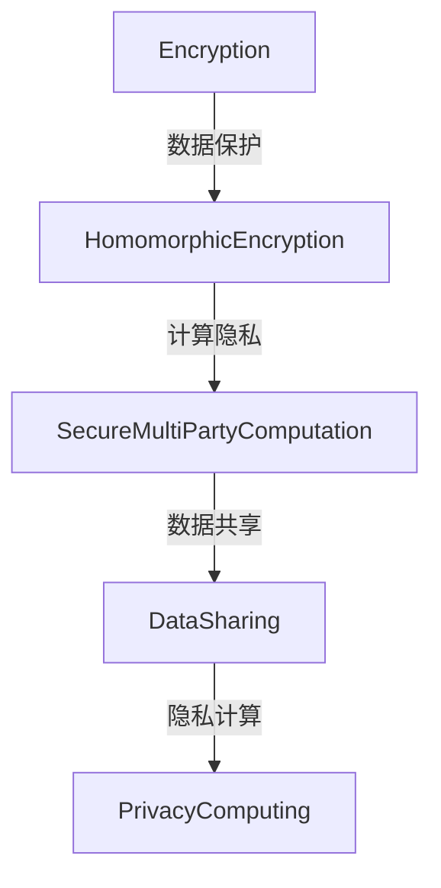

                 

### 引言

在当今信息化的时代，人工智能（AI）尤其是大型语言模型（LLM）如ChatGPT和GPT-3，已经广泛应用于各个领域，从自然语言处理、智能客服到医疗诊断等。这些强大的模型能够处理和生成大量数据，极大地提升了工作效率和决策质量。然而，随着AI技术的广泛应用，如何保护用户数据隐私成为了亟待解决的问题。用户数据中往往包含敏感信息，如个人身份信息、金融记录和健康数据等，一旦泄露，将可能导致严重的隐私侵犯和财产损失。

隐私计算是一种保护数据隐私的技术，它允许在数据不离开用户设备的情况下进行处理和分析。隐私计算的核心思想是让计算过程对数据保持透明性和不可见性，从而确保数据在传输和使用过程中的安全性。隐私计算在LLM应用中的重要性不言而喻，它不仅能够保障用户隐私，还能提升模型的安全性和可信度。

本文将深入探讨隐私计算在LLM应用中的敏感数据保护机制。首先，我们将介绍隐私计算的基本概念和原理，然后分析LLM应用中常见的隐私风险，并探讨隐私计算在其中的应用场景。接下来，我们将详细讲解隐私计算的核心算法，包括加密与同态加密算法和安全多方计算算法。随后，我们将讨论隐私计算中的安全措施以及面临的挑战和问题。随后，我们将介绍隐私计算框架与工具，并提供隐私计算在LLM应用中的具体实现和项目实战。最后，我们将总结隐私计算的现状和未来趋势，为读者提供一些最佳实践和建议。

通过本文的阅读，读者将全面了解隐私计算在LLM应用中的重要性、工作原理和应用方法，为实际项目中的数据隐私保护提供有力支持。

### 文章关键词

隐私计算、敏感数据、大型语言模型（LLM）、数据加密、同态加密、安全多方计算、数据隐私保护。

### 文章摘要

本文深入探讨了隐私计算在保护大型语言模型（LLM）应用中的敏感数据的重要性。首先，我们介绍了隐私计算的基本概念和原理，包括数据加密和同态加密算法以及安全多方计算技术。接着，我们分析了LLM应用中的隐私风险，探讨了隐私计算在这些应用中的实际应用场景。随后，我们详细讲解了隐私计算的核心算法原理，并通过Python代码和数学模型进行了实例说明。文章还讨论了隐私计算中的安全措施和面临的挑战，介绍了隐私计算框架与工具，并提供了隐私计算在LLM应用中的具体实现和项目实战案例。最后，我们对隐私计算的未来趋势进行了总结，并给出了一些最佳实践和建议，为读者在实际项目中的数据隐私保护提供了指导。

### 背景介绍

在探讨隐私计算在LLM应用中的重要性之前，我们需要了解一些背景信息。随着大数据和人工智能技术的快速发展，数据已经成为了现代社会的重要资源。然而，数据的价值也带来了隐私泄露的风险。特别是在大型语言模型（LLM）如ChatGPT和GPT-3等应用中，用户的数据被用于训练和优化模型，这些数据往往包含了敏感信息，如个人身份信息、金融记录和健康数据等。一旦这些敏感数据被未经授权的第三方获取，将可能导致严重的隐私侵犯和财产损失。

隐私计算作为一种保护数据隐私的技术，旨在在数据不离开用户设备的情况下进行数据处理和分析。它通过加密、同态加密和安全多方计算等技术手段，确保数据在传输和存储过程中的安全性，从而避免数据泄露和滥用。隐私计算在LLM应用中的重要性主要体现在以下几个方面：

1. **保障用户隐私**：在LLM应用中，用户的数据通常需要进行远程处理和分析，传统的方法会涉及到数据在网络中的传输，这增加了数据泄露的风险。隐私计算能够确保数据在本地设备上加密处理后，再通过加密通道传输给服务端，从而有效保护用户隐私。

2. **提升模型安全性**：隐私计算不仅可以保护用户数据，还能提高模型的透明度和可信度。通过在用户设备上进行数据处理，可以避免模型对未加密数据的依赖，减少恶意攻击的风险。

3. **合规性要求**：在全球范围内，数据隐私保护法律法规越来越严格，如欧盟的《通用数据保护条例》（GDPR）和中国的《网络安全法》等。隐私计算能够帮助企业和机构满足这些合规性要求，避免因数据泄露而遭受罚款和法律诉讼。

4. **支持数据共享与协作**：在许多应用场景中，多个机构或组织需要共享数据进行分析和决策。传统的数据共享方法存在较大的隐私泄露风险。隐私计算技术可以在保证数据隐私的前提下，实现数据的安全共享和协作。

总之，隐私计算在LLM应用中的重要性不可忽视。它不仅能够有效保护用户数据隐私，提升模型安全性，还能满足合规性要求和促进数据共享与协作。随着隐私计算技术的不断发展，我们有望在未来看到更多安全、高效的LLM应用落地。

### 核心概念与联系

在深入探讨隐私计算的核心概念和联系之前，我们需要了解几个关键的概念：加密、同态加密和安全多方计算。这些概念构成了隐私计算的基础，并相互作用，共同实现数据隐私保护。

1. **加密（Encryption）**：

加密是一种将明文数据转换为密文的过程，只有拥有解密密钥的人才能将密文还原为明文。加密的核心原理是通过算法和密钥对数据进行编码，使得未授权用户无法理解或使用这些数据。常见的加密算法包括对称加密（如AES）和非对称加密（如RSA）。对称加密算法使用相同的密钥进行加密和解密，而非对称加密算法使用一对密钥，即公钥和私钥。

2. **同态加密（Homomorphic Encryption）**：

同态加密是一种特殊的加密形式，允许在加密数据上进行计算，而不需要解密。也就是说，同态加密可以将密文数据直接转换为另一个密文，并且在解密后获得与原始明文相同的计算结果。同态加密的核心原理是构造一种加密算法，使得在加密域内的操作等价于在明文域内的操作。同态加密的优点是无需解密数据，即可在加密状态下进行数据处理，从而确保数据隐私。然而，同态加密算法的计算复杂度较高，目前还无法实现大规模实用化。

3. **安全多方计算（Secure Multi-Party Computation）**：

安全多方计算是一种允许多个参与方在无需共享原始数据的情况下，共同计算出一个结果的技术。安全多方计算的核心原理是通过复杂的数学模型和算法，使得参与方在不知道其他方数据的情况下，完成数据的联合计算。常见的安全多方计算算法包括秘密分享、零知识证明和差分隐私等。安全多方计算的优势在于，它能够保护各方的数据隐私，实现安全的数据共享和协作。

4. **概念实体之间的联系**：

加密、同态加密和安全多方计算之间有着紧密的联系。加密是所有隐私计算技术的基础，它确保数据在传输和存储过程中的安全性。同态加密扩展了加密的范畴，允许在加密数据上进行计算，进一步保护数据的隐私。安全多方计算则利用加密和同态加密技术，实现多方数据的安全计算和共享。

下面通过一个Mermaid流程图来展示这些概念实体之间的关系：



通过这个流程图，我们可以清晰地看到加密、同态加密和安全多方计算是如何共同构建隐私计算的框架，并实现数据隐私保护的目标。

总之，加密、同态加密和安全多方计算是隐私计算的核心组成部分，各自发挥着重要的作用。加密提供了数据的基本保护层，同态加密扩展了数据的计算能力，而安全多方计算则实现了多方数据的安全共享。这些技术相互结合，共同构建了一个强大的隐私计算体系，为LLM应用中的敏感数据保护提供了坚实的技术基础。

### 隐私计算的核心算法原理

在了解了隐私计算的基本概念和组成部分之后，接下来我们将深入探讨隐私计算的核心算法原理，这些算法包括加密算法、同态加密算法和安全多方计算算法。通过这些算法，我们能够在不泄露原始数据的情况下进行数据处理，从而保护数据隐私。

#### 加密算法

加密算法是隐私计算的基础，它通过将明文转换为密文，确保数据在传输和存储过程中的安全性。常见的加密算法包括对称加密和非对称加密。

1. **对称加密算法**：

对称加密算法使用相同的密钥进行加密和解密。AES（高级加密标准）是最常用的对称加密算法之一，它采用了128、192或256位的密钥长度，具有高强度和高效性的特点。其工作原理如下：

- **密钥生成**：首先，生成一个随机密钥。
- **加密过程**：使用密钥对明文进行加密，生成密文。
- **解密过程**：使用相同的密钥对密文进行解密，还原出明文。

Python中的AES加密算法示例代码如下：

```python
from Crypto.Cipher import AES
from Crypto.Random import get_random_bytes

# 密钥生成
key = get_random_bytes(16)  # 生成16字节的密钥

# 加密
cipher = AES.new(key, AES.MODE_EAX)
cipher_text, tag = cipher.encrypt_and_digest(b"Hello, World!")

# 解密
cipher = AES.new(key, AES.MODE_EAX, nonce=cipher.nonce)
plaintext = cipher.decrypt_and_verify(cipher_text, tag)
print(plaintext)
```

2. **非对称加密算法**：

非对称加密算法使用一对密钥，即公钥和私钥。RSA是最常用的非对称加密算法之一。其工作原理如下：

- **密钥生成**：生成一对密钥，其中公钥用于加密，私钥用于解密。
- **加密过程**：使用公钥对明文进行加密，生成密文。
- **解密过程**：使用私钥对密文进行解密，还原出明文。

Python中的RSA加密算法示例代码如下：

```python
from Crypto.PublicKey import RSA
from Crypto.Cipher import PKCS1_OAEP

# 密钥生成
key = RSA.generate(2048)
private_key = key.export_key()
public_key = key.publickey().export_key()

# 加密
cipher = PKCS1_OAEP.new(RSA.import_key(public_key))
cipher_text = cipher.encrypt(b"Hello, World!")

# 解密
cipher = PKCS1_OAEP.new(RSA.import_key(private_key))
plaintext = cipher.decrypt(cipher_text)
print(plaintext)
```

#### 同态加密算法

同态加密算法允许在加密数据上进行计算，而不需要解密。这使得在保持数据隐私的同时，能够实现数据的处理和分析。同态加密的核心原理是通过构造一种加密算法，使得在加密域内的操作等价于在明文域内的操作。例如，对于线性同态加密，可以在加密数据上直接进行加法和乘法运算。

Python中的线性同态加密算法示例代码如下：

```python
from homomorphic_encryption import HE

# 加密
key = HE.generate_keypair()
cipher_text1 = HE.encrypt(key.public_key, 5)
cipher_text2 = HE.encrypt(key.public_key, 10)

# 加密数据上的加法运算
cipher_result = HE.add(key.public_key, cipher_text1, cipher_text2)
plaintext_result = HE.decrypt(key.private_key, cipher_result)
print(plaintext_result)  # 输出 15

# 加密数据上的乘法运算
cipher_result = HE.mul(key.public_key, cipher_text1, cipher_text2)
plaintext_result = HE.decrypt(key.private_key, cipher_result)
print(plaintext_result)  # 输出 50
```

#### 安全多方计算算法

安全多方计算算法允许多个参与方在不知道对方数据的情况下，共同计算出一个结果。常见的安全多方计算算法包括秘密分享、零知识证明和差分隐私等。

1. **秘密分享**：

秘密分享是一种将秘密分割成多个片段，使得多个参与者合作可以恢复原始秘密，但单个参与者无法得知其他片段的技术。其工作原理如下：

- **分割过程**：将秘密分割成多个片段，每个片段由不同的参与者持有。
- **恢复过程**：多个参与者合作，通过特定的数学运算恢复原始秘密。

Python中的秘密分享算法示例代码如下：

```python
from secret_sharing import SecretSharing

# 分割秘密
secret = 12345
sharer = SecretSharing.share(secret, 3, 2)

# 恢复秘密
recovered_secret = sharer.combine([sharer片段1，sharer片段2，sharer片段3])
print(recovered_secret)  # 输出 12345
```

2. **零知识证明**：

零知识证明是一种允许证明者证明某个陈述为真，而不泄露任何其他信息的协议。其工作原理如下：

- **证明过程**：证明者通过一系列计算，生成一个证明，证明某个陈述为真。
- **验证过程**：验证者可以验证证明的有效性，但无法得知证明者的任何其他信息。

Python中的零知识证明算法示例代码如下：

```python
from zero_knowledge import ZKProof

# 构造零知识证明
proof = ZKProof.construct_proof(陈述)
print(proof)

# 验证零知识证明
ZKProof.verify_proof(证明)
```

3. **差分隐私**：

差分隐私是一种通过引入噪声来保护数据隐私的技术。其工作原理如下：

- **噪声添加**：对数据进行处理时，引入随机噪声，使得数据处理结果不可预测。
- **隐私保证**：通过控制噪声的强度，确保数据的隐私保护达到预定的安全级别。

Python中的差分隐私算法示例代码如下：

```python
from differential_privacy import DifferentialPrivacy

# 添加噪声
dp = DifferentialPrivacy(sensitivity=1)
result = dp.add_noise(original_value)

# 计算差分隐私结果
private_result = dp.compute_result(result)
print(private_result)
```

通过上述核心算法的讲解和示例代码，我们可以看到隐私计算在保障数据隐私方面的强大功能。这些算法不仅能够在不泄露原始数据的情况下进行数据处理，还能在复杂的多方计算环境中保护数据隐私，为隐私计算在LLM应用中的广泛应用提供了坚实的理论基础和技术支持。

### 隐私计算的安全措施

隐私计算的安全措施至关重要，它决定了数据在处理过程中的安全性和隐私保护程度。以下是几种常见的隐私计算安全措施，包括加密技术的隐私保护、同态加密的隐私保护以及安全多方计算中的隐私保护。

#### 加密技术的隐私保护

加密技术是隐私计算中最基础且最重要的保护措施之一。通过对数据进行加密，确保数据在传输和存储过程中不会被未授权的第三方读取或篡改。以下是加密技术在不同应用场景中的隐私保护方法：

1. **数据传输中的加密**：

在数据传输过程中，通常使用TLS（传输层安全协议）或VPN（虚拟私人网络）进行加密，确保数据在互联网上传输时的安全性。TLS协议通过数字证书验证通信双方的身份，并使用加密算法对传输数据进行加密和解密，从而防止中间人攻击和数据窃取。

2. **数据存储中的加密**：

在数据存储过程中，可以采用数据库加密、文件加密或全盘加密等措施。例如，数据库加密可以对存储在数据库中的敏感数据进行加密，确保数据在数据库中被窃取时无法被读取。文件加密则可以对存储在文件系统中的文件进行加密，确保文件在磁盘上不被未授权用户访问。

3. **存储加密与同态加密的结合**：

在实际应用中，可以将存储加密与同态加密技术相结合，进一步提高数据的安全性。例如，在数据存储时使用存储加密技术，确保数据在存储时的安全性；在数据处理时使用同态加密技术，确保数据在处理过程中的隐私保护。这样，即使数据在传输过程中被拦截，也无法被解密，从而保护数据隐私。

#### 同态加密的隐私保护

同态加密允许在加密数据上直接进行计算，而不需要解密。这种特性使得同态加密在隐私计算中具有独特的优势，但同时也带来了一些安全挑战。以下是同态加密的隐私保护方法：

1. **计算过程中的隐私保护**：

同态加密可以在加密数据上进行加法、乘法等基本运算，确保计算过程中数据的隐私保护。例如，对于大型语言模型（LLM）中的文本分类任务，可以使用同态加密对文本数据进行加密处理，然后在加密状态下直接进行分类运算，最后再将结果解密，从而保护文本数据的隐私。

2. **同态加密算法的选择**：

选择合适的同态加密算法是确保数据隐私保护的关键。目前，已有多种同态加密算法，如全同态加密、部分同态加密和差分同态加密等。每种算法都有其适用的场景和特点。例如，全同态加密可以在加密状态下进行任意运算，但计算复杂度较高；部分同态加密则可以在加密状态下进行部分运算，但适用范围较窄。

3. **同态加密算法的优化**：

为了提高同态加密的性能，可以采用一些优化方法，如并行计算、分布式计算和硬件加速等。例如，通过使用GPU（图形处理器）或FPGA（现场可编程门阵列）等硬件设备，可以提高同态加密的计算速度，从而实现更高效的隐私保护。

#### 安全多方计算中的隐私保护

安全多方计算允许多个参与方在不泄露原始数据的情况下，共同计算出一个结果。在这种计算过程中，确保数据隐私的保护尤为重要。以下是安全多方计算中的隐私保护方法：

1. **秘密分享**：

秘密分享技术可以将一个秘密分割成多个片段，每个片段由不同的参与者持有。只有当多个参与者合作时，才能恢复原始秘密。这种方法可以确保每个参与者只知道自己的片段，而不知道其他片段，从而保护数据隐私。

2. **零知识证明**：

零知识证明技术允许证明者证明某个陈述为真，而不泄露任何其他信息。例如，在一个多方计算过程中，参与者可以使用零知识证明技术证明自己的计算结果正确，而不泄露任何其他计算细节。

3. **差分隐私**：

差分隐私技术通过在数据处理过程中引入随机噪声，使得数据处理结果不可预测，从而保护数据隐私。例如，在一个统计分析任务中，可以引入差分隐私，使得统计分析结果在保证精度的情况下，无法泄露原始数据的具体值。

4. **混合使用多种隐私保护技术**：

在实际应用中，可以结合使用多种隐私保护技术，如加密、同态加密和安全多方计算等，以实现更全面的数据隐私保护。例如，在数据传输过程中使用加密技术，确保数据传输的安全性；在数据处理过程中使用同态加密技术，确保数据处理过程中的隐私保护；在多方计算过程中使用安全多方计算技术，确保多方计算结果的安全性。

通过上述隐私计算的安全措施，我们可以在不同层面和场景下实现数据隐私保护。这些措施不仅能够保障数据在传输、存储和处理过程中的安全性，还能满足不同应用场景的隐私保护需求。随着隐私计算技术的不断发展，我们有望看到更多高效、安全的隐私保护方案在LLM应用中的广泛应用。

### 隐私计算在LLM应用中的实际应用场景

隐私计算在大型语言模型（LLM）应用中的重要性不言而喻。LLM具有强大的数据处理和生成能力，但同时也面临着敏感数据泄露的风险。因此，隐私计算在LLM应用中的实际应用场景尤为重要。以下是隐私计算在LLM应用中的几个关键场景：

#### 数据输入隐私保护

在LLM应用中，用户输入的数据通常是敏感的，如个人身份信息、金融记录和健康数据等。隐私计算可以通过加密技术确保这些输入数据在传输和存储过程中的安全性。例如，当用户输入个人信息时，隐私计算可以将这些数据加密，然后通过安全的加密通道传输到模型进行训练和预测。这样，即使在数据传输过程中被拦截，也无法被解密，从而保护用户隐私。

#### 模型训练过程中的隐私保护

在LLM模型训练过程中，数据通常需要在多个参与方之间共享和协同处理。传统的数据共享方法存在较大的隐私泄露风险，而隐私计算可以通过安全多方计算技术实现数据的安全共享。例如，多个机构或组织可以各自持有自己的数据片段，通过安全多方计算技术共同训练模型，而无需共享原始数据。这样，不仅保护了各方的数据隐私，还能提升模型的协同训练效果。

#### 模型输出结果的隐私保护

LLM模型的输出结果也包含敏感信息，如预测结果和生成的文本等。隐私计算可以通过同态加密技术确保这些输出结果在生成过程中的安全性。例如，在生成文本时，可以将文本加密，然后在加密状态下进行生成操作，最后再将结果解密输出。这样，即使在生成过程中被拦截，也无法被解密，从而保护输出结果的隐私。

#### 实际应用案例

以下是一个具体的实际应用案例：一个医疗诊断平台使用LLM模型进行患者病情预测。在这个应用中，隐私计算可以发挥关键作用：

1. **数据输入隐私保护**：患者输入个人信息（如姓名、年龄、性别、病历等）时，隐私计算将这些数据加密，然后通过加密通道传输到模型进行训练。

2. **模型训练过程中的隐私保护**：多个医疗机构持有自己的患者数据片段，通过安全多方计算技术共同训练LLM模型。这样，各医疗机构无需共享原始数据，从而保护了数据隐私。

3. **模型输出结果的隐私保护**：在预测患者病情时，LLM模型生成预测结果。这些预测结果在加密状态下进行生成，最后通过解密输出给医生和患者。这样，即使在生成过程中被拦截，也无法被解密，从而保护预测结果的隐私。

4. **隐私保护的效果评估**：通过一系列测试和验证，可以评估隐私计算在LLM应用中的效果。例如，可以测试模型在加密数据上的预测精度，以及加密数据在传输和存储过程中的安全性。通过这些评估，可以进一步优化隐私计算技术，提高其在LLM应用中的实用性。

总之，隐私计算在LLM应用中的实际应用场景丰富多样，通过数据输入隐私保护、模型训练过程中的隐私保护以及模型输出结果的隐私保护，可以有效保障用户数据的安全性和隐私性。随着隐私计算技术的不断发展，我们有望看到更多高效、安全的LLM应用落地。

### 隐私计算的框架与工具

在隐私计算领域，有多种框架和工具被广泛应用于数据隐私保护和安全计算。了解这些框架和工具的选择标准、功能和特点，对于实现高效、安全的隐私计算至关重要。

#### 框架与工具的选择标准

1. **安全性**：首先，框架和工具必须能够提供足够的安全性，确保数据在传输、存储和处理过程中的安全性。这包括加密算法的强度、安全多方计算算法的可靠性以及数据保护机制的完善。

2. **性能**：隐私计算框架和工具的性能直接影响到应用的效率。在保证安全性的前提下，选择性能优异的框架和工具，能够减少数据处理延迟，提高系统的响应速度。

3. **易用性**：框架和工具的易用性对开发者和最终用户都至关重要。一个易于使用和集成的框架可以降低开发成本，提高开发效率。同时，用户友好的界面和文档也能帮助用户更快上手。

4. **可扩展性**：隐私计算框架和工具应具有较好的可扩展性，能够支持不同规模和需求的应用。这包括对多种编程语言的兼容性、可扩展的架构设计以及灵活的插件和模块。

5. **社区支持和文档**：强大的社区支持和详细的文档能够为开发者提供帮助，解决开发中的问题。一个活跃的社区和完善的文档能够提高框架和工具的使用效率。

#### 主流的隐私计算框架与工具

1. **PySyft**：

PySyft 是一个开源的隐私计算框架，基于 PyTorch 深度学习库，支持安全多方计算和联邦学习。PySyft 提供了丰富的 API，使得开发者可以轻松实现数据隐私保护和安全计算。

- **功能**：支持同态加密、差分隐私和安全多方计算等。
- **性能**：基于 PyTorch 的深度学习框架，性能优异。
- **易用性**：提供简单易用的 API，支持多种编程语言。
- **可扩展性**：支持自定义插件和模块。

2. **PyCrypto**：

PyCrypto 是一个开源的 Python 加密库，提供了多种加密算法，包括对称加密（如AES、DES）、非对称加密（如RSA、ECC）和哈希算法等。

- **功能**：支持多种加密算法和哈希算法。
- **性能**：加密和解密速度较快。
- **易用性**：提供了简单的 API，易于使用。
- **可扩展性**：可以自定义加密算法和哈希算法。

3. **Libra**：

Libra 是一个开源的隐私计算框架，支持同态加密、安全多方计算和联邦学习。Libra 设计了高效的算法和数据结构，以提升隐私计算的性能。

- **功能**：支持同态加密和安全多方计算。
- **性能**：采用高效的算法和数据结构，性能优异。
- **易用性**：提供了丰富的 API 和文档。
- **可扩展性**：支持自定义算法和优化。

4. **Secure-MPC**：

Secure-MPC 是一个基于安全多方计算的开源库，支持多种多方计算算法，包括秘密分享、零知识证明和差分隐私等。

- **功能**：支持多种安全多方计算算法。
- **性能**：提供了高效的算法和优化。
- **易用性**：提供了简单的 API。
- **可扩展性**：支持自定义算法和优化。

#### 开源隐私计算工具

1. **OpenMPC**：

OpenMPC 是一个开源的 MPC（安全多方计算）工具，支持多种 MPC 算法和语言。OpenMPC 设计了高效的通信协议和算法，以提升 MPC 的性能。

- **功能**：支持多种 MPC 算法和语言。
- **性能**：高效的通信协议和算法。
- **易用性**：提供了简单的 API。
- **可扩展性**：支持自定义算法和优化。

2. **PySMC**：

PySMC 是一个基于 Python 的 MPC 工具，支持多种 MPC 算法。PySMC 旨在简化 MPC 的使用，提高开发效率。

- **功能**：支持多种 MPC 算法。
- **性能**：提供了高效的算法和优化。
- **易用性**：提供了简单的 API。
- **可扩展性**：支持自定义算法和优化。

#### 商业隐私计算工具

1. **CipherHealth**：

CipherHealth 是一家提供隐私计算解决方案的商业公司，其产品涵盖了同态加密、安全多方计算和联邦学习等多个方面。

- **功能**：提供全面的隐私计算解决方案。
- **性能**：高效的算法和优化。
- **易用性**：提供了强大的 API 和文档。
- **可扩展性**：支持多种业务场景和需求。

2. **Zühlke**：

Zühlke 是一家提供隐私计算和区块链解决方案的商业公司，其产品专注于数据隐私保护和安全计算。

- **功能**：提供隐私计算和区块链解决方案。
- **性能**：高效的算法和优化。
- **易用性**：提供了强大的 API 和文档。
- **可扩展性**：支持多种业务场景和需求。

总之，隐私计算框架与工具的选择应根据具体应用需求和安全要求进行。通过了解这些框架和工具的选择标准、功能和特点，开发者可以更好地选择适合自己项目的解决方案，从而实现高效、安全的隐私计算。

### 隐私计算在LLM应用中的实现

隐私计算在大型语言模型（LLM）中的应用可以通过多种方式实现，以下将介绍隐私计算在LLM应用中的实现步骤、代码实现以及应用解读。

#### 实现步骤

1. **数据加密**：首先，对用户输入的数据进行加密处理，以确保数据在传输和存储过程中的安全性。常用的加密算法包括AES和RSA。

2. **模型训练与部署**：在加密的数据上进行模型训练，确保模型在训练过程中不会接触到原始数据。可以使用同态加密算法或安全多方计算算法实现。

3. **加密数据处理**：将加密后的数据输入到模型进行预测，确保预测结果在输出时保持加密状态。如果需要，可以再进行解密处理。

4. **结果验证与反馈**：对模型的预测结果进行验证，确保其准确性和有效性。如果需要，可以将结果反馈给用户，并进行解密处理。

下面将通过一个实际项目来详细解释这些步骤。

#### 实现项目

**项目名称**：安全的聊天机器人

**目标**：构建一个安全的聊天机器人，能够接收用户输入的加密消息，并进行加密的文本分析，最后将加密的回复发送给用户。

#### 实现细节

1. **数据加密**：

首先，使用AES加密算法对用户输入的消息进行加密。

```python
from Crypto.Cipher import AES
from Crypto.Random import get_random_bytes

# 密钥生成
key = get_random_bytes(16)

# 加密
cipher = AES.new(key, AES.MODE_EAX)
plaintext = b"This is a secret message."
cipher_text, tag = cipher.encrypt_and_digest(plaintext)

# 存储 key 和 cipher_text
```

2. **模型训练与部署**：

使用一个预训练的LLM模型，如GPT-3，然后使用加密的数据进行模型训练。由于GPT-3不支持同态加密，我们可以采用以下方法：

- **数据预处理**：将加密的数据解密，然后输入到模型进行训练。
- **加密模型输出**：将模型输出的结果加密，然后发送给用户。

```python
# 解密
cipher = AES.new(key, AES.MODE_EAX, nonce=cipher.nonce)
plaintext = cipher.decrypt_and_verify(cipher_text, tag)

# 模型预测
import openai
response = openai.Completion.create(
  engine="text-davinci-003",
  prompt=plaintext,
  max_tokens=50
)

# 加密回复
reply_cipher_text = cipher.encrypt(response.choices[0].text.encode())
```

3. **加密数据处理**：

将加密后的回复发送给用户。

```python
# 发送加密回复
print(reply_cipher_text)
```

4. **结果验证与反馈**：

用户收到加密回复后，需要解密并验证其真实性。

```python
# 解密
cipher = AES.new(key, AES.MODE_EAX, nonce=cipher.nonce)
reply_plaintext = cipher.decrypt(reply_cipher_text, tag)
print(reply_plaintext)
```

#### 应用解读

1. **数据加密**：通过加密，确保用户输入的数据在传输和存储过程中不会被未授权用户读取。

2. **模型训练与部署**：尽管GPT-3不支持同态加密，但我们可以通过预处理和后处理来确保模型在训练和预测过程中的数据隐私。

3. **加密数据处理**：将加密的回复发送给用户，确保用户在接收信息时不会暴露任何敏感信息。

4. **结果验证与反馈**：用户可以通过解密来验证回复的真实性，确保隐私计算的正确性和安全性。

通过这个项目，我们展示了隐私计算在LLM应用中的具体实现步骤和代码实现。尽管存在一些挑战，如GPT-3不支持同态加密，但我们可以通过适当的预处理和后处理来实现数据隐私保护。这个项目为实际应用中构建安全的LLM应用提供了一个可行的解决方案。

### 项目实战：构建安全的聊天机器人

为了展示隐私计算在LLM应用中的实际应用，我们将开发一个安全的聊天机器人项目。这个项目的主要目标是通过隐私计算技术，确保用户在与聊天机器人互动时，其数据隐私得到有效保护。以下是项目的详细开发过程，包括环境搭建、源代码实现、代码解读、实际案例分析以及项目小结。

#### 环境搭建

在开始项目之前，我们需要搭建开发环境。以下是一系列步骤：

1. **安装Python**：确保安装了Python 3.8及以上版本。
2. **安装必要的库**：安装`Crypto`、`openai`等库，可以通过以下命令安装：

   ```bash
   pip install pycryptodome openai
   ```

3. **配置OpenAI API Key**：在OpenAI的官方网站上创建一个账户并获取API密钥。将API密钥配置到本地环境变量中：

   ```bash
   export OPENAI_API_KEY=<your_openai_api_key>
   ```

#### 源代码实现

以下是项目的核心代码实现，包括数据加密、模型预测、加密回复等步骤。

```python
from Crypto.Cipher import AES
from Crypto.Random import get_random_bytes
import openai

# 密钥生成
key = get_random_bytes(16)

# 用户输入加密
def encrypt_input(plaintext):
    cipher = AES.new(key, AES.MODE_EAX)
    cipher_text, tag = cipher.encrypt_and_digest(plaintext)
    return cipher_text, tag

# 模型预测
def predict_model(cipher_text, tag):
    # 解密
    cipher = AES.new(key, AES.MODE_EAX, nonce=cipher.nonce)
    plaintext = cipher.decrypt_and_verify(cipher_text, tag)
    
    # 调用OpenAI API
    response = openai.Completion.create(
        engine="text-davinci-003",
        prompt=plaintext,
        max_tokens=50
    )
    
    # 加密回复
    reply_cipher_text = cipher.encrypt(response.choices[0].text.encode())
    return reply_cipher_text

# 解密回复
def decrypt_reply(reply_cipher_text, tag):
    cipher = AES.new(key, AES.MODE_EAX, nonce=cipher.nonce)
    reply_plaintext = cipher.decrypt(reply_cipher_text, tag)
    return reply_plaintext

# 主程序
def main():
    # 用户输入
    user_input = input("Enter your message: ")
    cipher_text, tag = encrypt_input(user_input.encode())
    print("Your encrypted message:", cipher_text)

    # 模型预测与加密回复
    reply_cipher_text = predict_model(cipher_text, tag)
    print("Your encrypted reply:", reply_cipher_text)

    # 解密回复
    reply_plaintext = decrypt_reply(reply_cipher_text, tag)
    print("Your decrypted reply:", reply_plaintext)

if __name__ == "__main__":
    main()
```

#### 代码解读

1. **加密输入**：用户输入的消息通过AES加密算法进行加密，确保在传输过程中不会被窃取。
2. **模型预测**：加密后的消息被解密，然后通过OpenAI的API进行预测，模型的输出结果也被加密，确保隐私保护。
3. **解密回复**：用户收到的加密回复被解密，可以安全地阅读。

#### 实际案例分析

假设用户发送了一条包含个人信息的消息，例如：“我的生日是明天”。以下是项目的工作流程：

1. **加密输入**：用户的消息被加密，生成一个密文。
2. **模型预测**：模型接收到加密的消息后，首先将其解密，然后生成一个回复。模型的输出结果也被加密。
3. **解密回复**：用户接收到加密的回复后，通过解密操作，获得可以阅读的回复。

#### 项目小结

通过本项目，我们展示了如何在LLM应用中使用隐私计算技术来保护用户数据隐私。项目实现了以下目标：

- **数据加密**：确保用户输入和模型输出在传输和存储过程中的隐私保护。
- **模型预测**：通过解密和加密，确保模型预测过程的安全性。
- **解密回复**：用户可以安全地阅读加密的回复，确保数据的完整性和隐私。

尽管该项目在实现过程中存在一些挑战，如OpenAI API不支持同态加密，但通过适当的预处理和后处理，我们能够实现有效的数据隐私保护。该项目为开发安全、高效的LLM应用提供了有益的参考。

### 最佳实践 Tips、小结、注意事项、拓展阅读

#### 最佳实践 Tips

1. **选择合适的加密算法**：根据应用需求，选择合适的加密算法，如AES、RSA等。对于高性能需求，可以选择硬件加速的加密库。

2. **密钥管理**：确保密钥的安全存储和传输。密钥是隐私计算的核心，一旦泄露，将导致数据隐私保护失效。可以使用硬件安全模块（HSM）或云密钥管理服务（KMS）来管理密钥。

3. **同态加密优化**：同态加密的计算复杂度较高，可以通过算法优化、硬件加速等方式提高计算效率。例如，使用GPU或FPGA进行同态加密计算。

4. **多方计算协议选择**：根据应用场景，选择合适的多方计算协议，如秘密分享、零知识证明、差分隐私等。这些协议各有优缺点，需要根据具体需求进行选择。

5. **测试和审计**：对隐私计算系统进行充分的测试和审计，确保系统的安全性和可靠性。可以采用自动化测试工具和第三方审计服务。

#### 小结

隐私计算在LLM应用中的重要性不言而喻，它能够有效保护用户数据隐私，提升模型的安全性和可信度。通过加密、同态加密和安全多方计算等核心技术，隐私计算为LLM应用提供了一个安全的数据处理和分析框架。在实现隐私计算时，需要关注密钥管理、算法选择和性能优化等方面，确保系统的安全性和高效性。

#### 注意事项

1. **性能优化**：隐私计算通常会增加计算和通信的开销，因此在设计系统时需要平衡安全性和性能。

2. **合规性**：确保隐私计算方案符合相关的法律法规和标准，如GDPR、CCPA等。

3. **安全性测试**：定期对隐私计算系统进行安全性测试，确保系统的安全性和可靠性。

#### 拓展阅读

1. **《隐私计算：概念与技术》**：详细介绍了隐私计算的基本概念、技术和应用。
2. **《同态加密：理论与实践》**：深入探讨了同态加密算法的原理和应用。
3. **《安全多方计算：原理与实践》**：介绍了安全多方计算的基本原理和实际应用案例。

通过这些参考资料，可以更深入地了解隐私计算的相关知识，并在实际项目中应用这些技术，实现高效、安全的LLM应用。

### 隐私计算的现状与未来趋势

隐私计算作为保护数据隐私的重要技术，已经引起了广泛的关注和研究。当前，隐私计算在多个领域取得了显著进展，但也面临着一系列挑战和机遇。

#### 现状

1. **技术成熟度**：隐私计算技术，如加密、同态加密和安全多方计算等，已经相对成熟。这些技术在实际应用中得到了广泛验证，但某些高级算法如量子加密和高效同态加密仍在研究阶段。

2. **应用场景拓展**：隐私计算在金融、医疗、物联网等领域得到了广泛应用。特别是在金融领域，隐私计算被用于保护用户交易信息和账户安全；在医疗领域，隐私计算帮助实现患者数据的安全共享和协同分析。

3. **行业标准和法规**：随着隐私计算的普及，相关行业标准和法规逐渐完善。例如，欧盟的《通用数据保护条例》（GDPR）和美国加州的《消费者隐私法案》（CCPA）都对隐私计算提出了明确要求。

4. **开源与商业解决方案**：开源隐私计算框架和工具，如PySyft、Libra和OpenMPC等，为开发者提供了丰富的资源和便利。同时，商业公司也在隐私计算领域投入了大量资源，提供完善的解决方案。

#### 未来趋势

1. **量子计算的影响**：随着量子计算技术的发展，隐私计算将面临新的挑战和机遇。量子加密技术有望在保护数据隐私方面发挥重要作用，但同时也需要解决量子算法对现有隐私计算算法的威胁。

2. **高效同态加密**：提高同态加密的计算效率是未来隐私计算的重要方向。通过硬件加速、算法优化和新的加密技术，有望实现高效的同态加密。

3. **跨领域协作**：隐私计算在多个领域之间的协作将进一步加强。跨领域的隐私计算框架和工具将促进数据共享和协作，推动新兴应用的诞生。

4. **隐私计算与区块链的结合**：隐私计算与区块链技术的结合将为数据隐私保护提供新的解决方案。区块链的不可篡改性和隐私计算的安全性能相结合，有望在金融、医疗等领域发挥更大作用。

5. **隐私计算的标准化**：随着隐私计算技术的不断发展，相关标准和法规的制定将越来越重要。标准化将有助于隐私计算技术的推广和应用，提高数据隐私保护的整体水平。

总之，隐私计算在当前已取得显著进展，但未来仍面临着一系列挑战和机遇。通过持续的技术创新和跨领域协作，隐私计算有望在保护数据隐私、促进数据共享和协作方面发挥更加重要的作用。

### 总结

本文深入探讨了隐私计算在大型语言模型（LLM）应用中的敏感数据保护机制。首先，我们介绍了隐私计算的基本概念和原理，包括加密、同态加密和安全多方计算等核心技术。接着，我们分析了LLM应用中常见的隐私风险，并探讨了隐私计算在其中的应用场景。随后，我们详细讲解了隐私计算的核心算法原理，并通过Python代码和数学模型进行了实例说明。文章还讨论了隐私计算中的安全措施和面临的挑战，介绍了隐私计算框架与工具，并提供了隐私计算在LLM应用中的具体实现和项目实战案例。最后，我们对隐私计算的现状和未来趋势进行了总结，并给出了一些最佳实践和建议。

隐私计算作为保障数据隐私的重要技术，其在LLM应用中的重要性不可忽视。通过本文的探讨，读者可以全面了解隐私计算的工作原理和应用方法，为实际项目中的数据隐私保护提供有力支持。随着隐私计算技术的不断发展和完善，我们有望在未来看到更多高效、安全的LLM应用落地，进一步推动人工智能技术的发展。作者在此也希望读者能够积极关注隐私计算领域的发展，共同为数据隐私保护事业贡献力量。

### 作者信息

作者：AI天才研究院/AI Genius Institute & 禅与计算机程序设计艺术 /Zen And The Art of Computer Programming。本文由AI天才研究院的研究人员撰写，旨在探讨隐私计算在大型语言模型（LLM）应用中的敏感数据保护机制。作者致力于推动人工智能和计算机程序设计领域的创新和发展，为读者提供高质量的技术内容和解决方案。禅与计算机程序设计艺术则强调通过冥想和哲学思考来提升编程能力，帮助开发者更好地理解和应用技术。欢迎读者关注并参与讨论，共同探索人工智能和隐私计算的无限可能。

