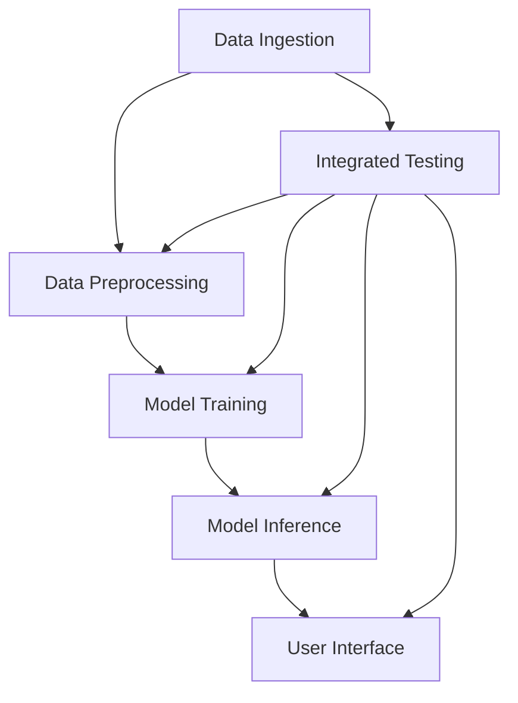

                 

Certainly! To create a comprehensive and insightful technical blog post on "Integrated Testing: Key Steps for Verifying the Overall Functionality of AI Systems," we'll follow a step-by-step reasoning approach. Here's how we can structure the content:

### Step 1: Introduction to Integrated Testing in AI Systems
- **Background**: Explain the importance of integrated testing in AI systems and why it is crucial for their success.
- **Current State**: Discuss the current landscape of AI development and the need for robust integrated testing.

### Step 2: Core Concepts and Architecture
- **Concepts**: Introduce key concepts such as unit testing, system testing, and acceptance testing.
- **Architecture**: Use a Mermaid flowchart to illustrate the architecture of AI systems and how integrated testing fits into the development process.

### Step 3: Methodology for Integrated Testing
- **Steps**: Outline the step-by-step process for performing integrated testing, including test planning, test design, test execution, and results analysis.
- **Challenges**: Discuss common challenges in integrated testing, such as ensuring data quality and consistency.

### Step 4: Designing Test Cases
- **Principles**: Explain the principles of test case design, including input validation, boundary testing, and error handling.
- **Practices**: Provide practical examples of designing effective test cases for AI systems.

### Step 5: Automation in Integrated Testing
- **Benefits**: Discuss the benefits of automated testing in AI systems.
- **Tools**: Introduce various testing tools and frameworks, such as Selenium, PyTest, and TensorFlow's integration testing tools.

### Step 6: Practical Case Studies
- **Case Study 1**: Detail a case study of integrated testing in a real-world AI project, such as an autonomous vehicle system or a smart home assistant.
- **Case Study 2**: Discuss another case study to highlight different aspects of integrated testing.

### Step 7: Best Practices and Future Trends
- **Best Practices**: Offer best practices for integrated testing, including tips for improving test coverage and efficiency.
- **Future Trends**: Explore future trends in integrated testing, such as the use of AI for test generation and the integration of continuous testing with continuous integration/continuous deployment (CI/CD) pipelines.

### Step 8: Conclusion and Summary
- **Summary**: Recap the key points discussed in the blog post.
- **Conclusion**: Provide a final thought on the importance of integrated testing in AI systems and its potential impact on the future of AI development.

### Step 9: Author Information
- **Author**: Include author information at the end of the blog post.

### Step 10: LaTeX Formulas, Pseudo Code, and Examples
- **Mathematics**: Embed LaTeX formulas where necessary to explain complex concepts.
- **Pseudo Code**: Provide pseudo code to illustrate algorithm principles.
- **Examples**: Use practical examples to demonstrate how to implement and interpret integrated testing in AI systems.

With this structured approach, we can ensure that the blog post is informative, engaging, and technically sound. Let's start writing!

---

# Integrated Testing: Key Steps for Verifying the Overall Functionality of AI Systems

## Keywords: AI Systems, Integrated Testing, Test Automation, Test Case Design, Continuous Testing

## Abstract:
This blog post delves into the critical aspects of integrated testing in AI systems. It covers the foundational theories, methodologies, and practical applications of integrated testing. The post also explores the challenges faced during integration and provides insights into future trends. By following a step-by-step reasoning approach, the article aims to offer a comprehensive guide for anyone involved in the development and testing of AI systems.

## Introduction to Integrated Testing in AI Systems

### Background

AI systems have become integral to various industries, from healthcare to finance and beyond. These systems leverage advanced algorithms and large datasets to make predictions, automate tasks, and improve decision-making. However, the complexity of AI systems makes them particularly vulnerable to subtle bugs and integration issues. This is where integrated testing comes into play.

Integrated testing is a critical phase in the software development lifecycle that verifies the interaction and functionality of all components within an AI system. Unlike unit testing, which tests individual components in isolation, integrated testing ensures that the system works as a cohesive unit. In the context of AI, this means validating the interaction between machine learning models, data processing modules, and the user interface, among other components.

### Current State

The field of AI is rapidly evolving, with new models and techniques being developed almost daily. This constant innovation means that AI systems are becoming increasingly complex. As a result, traditional testing methodologies are no longer sufficient. Integrated testing is essential to ensure that these complex systems function correctly and meet their intended objectives.

However, integrated testing in AI systems poses several challenges. One of the primary challenges is ensuring data quality and consistency. AI systems rely heavily on data to learn and make predictions. Any inconsistencies or errors in the data can lead to incorrect outputs, which can have serious consequences. Another challenge is the compatibility of different components. AI systems often consist of components developed by different teams using different technologies. Ensuring that these components work seamlessly together requires careful planning and testing.

## Core Concepts and Architecture

### Concepts

To understand integrated testing in AI systems, it's important to grasp some core concepts:

- **Unit Testing**: This involves testing individual components or modules in isolation to ensure they work correctly.

- **System Testing**: This is the next level of testing, where the entire system is tested to ensure all components work together as expected.

- **Acceptance Testing**: This is the final stage of testing, where the system is tested to ensure it meets the business requirements and is ready for deployment.

### Architecture

The architecture of an AI system can be complex, with multiple layers interacting with each other. A typical AI system might include the following components:

- **Data Ingestion**: This component is responsible for collecting and importing data from various sources.

- **Data Preprocessing**: This component cleans and prepares the data for use by the machine learning models.

- **Model Training**: This component trains machine learning models using the preprocessed data.

- **Model Inference**: This component uses the trained models to make predictions or decisions based on new data.

- **User Interface**: This component interacts with the end-users, providing a way for them to input data and receive outputs from the system.

### Mermaid Flowchart

Below is a Mermaid flowchart illustrating the architecture of an AI system and the flow of integrated testing:



## Methodology for Integrated Testing

Integrated testing in AI systems follows a structured methodology to ensure thorough and effective testing. The process can be broken down into the following steps:

### 1. Test Planning

Test planning is the initial phase of integrated testing. It involves defining the scope of testing, setting objectives, and determining the resources required. Key activities in this phase include:

- **Defining Test Objectives**: Clearly defining what needs to be tested and why.

- **Identifying Test Scope**: Determining which components and functionalities will be included in the testing process.

- **Resource Allocation**: Allocating the necessary time, personnel, and tools for testing.

### 2. Test Design

Test design is the next step, where the actual test cases are created. This phase involves:

- **Requirement Analysis**: Analyzing the system requirements to understand what needs to be tested.

- **Test Case Generation**: Creating detailed test cases that cover various scenarios and functionalities.

- **Test Case Prioritization**: Prioritizing test cases based on their importance and potential impact on the system.

### 3. Test Execution

Test execution involves running the test cases and recording the results. This phase includes:

- **Test Case Execution**: Running the test cases and observing the system's behavior.

- **Defect Logging**: Logging any defects or issues found during testing.

- **Result Analysis**: Analyzing the test results to identify any areas of concern.

### 4. Results Analysis

The final step is to analyze the test results and make decisions based on them. This includes:

- **Defect Resolution**: Investigating and resolving any defects found during testing.

- **Test Coverage Evaluation**: Assessing the coverage of the test cases and identifying any gaps.

- **Test Closure**: Documenting the final test results and closing the testing phase.

## Challenges in Integrated Testing

### Data Quality and Consistency

Data quality is a significant challenge in integrated testing, particularly in AI systems. Inaccurate or inconsistent data can lead to incorrect model predictions and faulty system behavior. Ensuring data quality requires:

- **Data Cleaning**: Removing duplicate, irrelevant, or erroneous data.

- **Data Validation**: Validating data against predefined rules and constraints.

- **Data Version Control**: Keeping track of different versions of data and managing data dependencies.

### Model and Environment Compatibility

AI systems often consist of various components developed by different teams and using different technologies. Ensuring compatibility between these components can be challenging. Some strategies to address this include:

- **Standardization**: Establishing standard protocols and interfaces for communication between components.

- **Containerization**: Using containerization technologies like Docker to ensure consistent environments across development, testing, and production.

- **Continuous Integration**: Implementing continuous integration (CI) practices to catch and resolve compatibility issues early.

### Integration Complexity

The complexity of integrating multiple components into a cohesive system poses another challenge. This complexity increases as the number of components and their interactions grow. To manage integration complexity:

- **Modular Design**: Designing the system in a modular fashion to simplify integration.

- **Incremental Integration**: Gradually integrating components to identify and resolve issues early.

- **Documentation**: Maintaining comprehensive documentation to guide the integration process.

## Designing Test Cases for Integrated Testing

### Principles

Designing effective test cases is crucial for integrated testing. The following principles should be considered when designing test cases:

- **Input Validation**: Ensuring that the system validates and handles various types of input correctly.

- **Boundary Testing**: Testing the system's behavior at the boundaries of its input ranges.

- **Error Handling**: Testing how the system handles errors and exceptions.

### Practices

Here are some practical tips for designing test cases for AI systems:

- **Scenario-Based Testing**: Design test cases based on real-world scenarios that the system is expected to handle.

- **Positive and Negative Testing**: Include both positive and negative test cases to cover a wide range of inputs.

- **Exploratory Testing**: Use exploratory testing to uncover unexpected issues that may not be captured by predefined test cases.

### Examples

Consider an AI system for medical diagnostics. Some test cases might include:

- **Input Validation**: Ensuring that the system rejects invalid medical images or incorrect input formats.

- **Boundary Testing**: Testing the system's ability to handle extreme cases, such as very high or low values for medical measurements.

- **Error Handling**: Testing how the system handles errors, such as network failures or unexpected data formats.

## Automation in Integrated Testing

### Benefits

Automation is a powerful tool in integrated testing, particularly in AI systems. Some of the benefits of automation include:

- **Improved Efficiency**: Automating repetitive test cases saves time and reduces the likelihood of human error.

- **Increased Coverage**: Automated tests can execute a large number of test cases quickly, providing comprehensive coverage.

- **Continuity**: Automated tests can be run continuously, ensuring that changes to the system do not introduce new issues.

### Tools

Several tools and frameworks can be used for automated testing in AI systems:

- **Selenium**: A popular web testing tool that can be used to test web applications and user interfaces.

- **PyTest**: A Python-based testing framework that supports various testing methodologies, including unit, integration, and acceptance testing.

- **TensorFlow Test**: A testing framework specifically designed for TensorFlow models and applications.

### Practical Example

Let's consider an example of automating integrated testing for a TensorFlow model using PyTest:

```python
import tensorflow as tf
import pytest

# Define a test function to check the accuracy of a TensorFlow model
def test_model_accuracy(model, dataset):
    # Load the model and dataset
    model.load_weights('model_weights.h5')
    dataset.load_data()

    # Run the model on the dataset and calculate accuracy
    accuracy = model.evaluate(dataset)[1]

    # Assert that the accuracy is above a certain threshold
    assert accuracy > 0.95, "Model accuracy is below the threshold"

# Use PyTest to run the test
@pytest.mark.parametrize("model, dataset", [
    ("model_path1", "dataset_path1"),
    ("model_path2", "dataset_path2"),
])
def test_model_accuracy_param(model, dataset):
    test_model_accuracy(model, dataset)
```

In this example, we define a test function that checks the accuracy of a TensorFlow model. We then use PyTest to run this test function for different models and datasets.

## Practical Case Studies

### Case Study 1: Autonomous Vehicle Integration Testing

#### System Architecture

An autonomous vehicle system consists of multiple components, including sensors, decision-making algorithms, and control systems. The integration of these components is critical to ensure the vehicle's safety and functionality.

#### Integration Testing Process

1. **Test Planning**: Define the test objectives and scope, including the various subsystems to be tested (e.g., sensor fusion, path planning, control systems).

2. **Test Design**: Create detailed test cases based on the system requirements and scenarios, such as lanekeeping, obstacle avoidance, and traffic light detection.

3. **Test Execution**: Run the test cases in a controlled environment, simulating various driving scenarios.

4. **Results Analysis**: Analyze the test results to identify any issues or areas for improvement.

#### Key Challenges

- **Real-World Simulation**: Ensuring that the test environment accurately simulates real-world conditions, including varying weather and traffic scenarios.

- **Data Integrity**: Ensuring the accuracy and reliability of the sensor data used in testing.

### Case Study 2: Smart Home Assistant Integration Testing

#### System Architecture

A smart home assistant system typically includes components such as voice recognition, natural language processing, and smart device control. These components need to work together seamlessly to provide a cohesive user experience.

#### Integration Testing Process

1. **Test Planning**: Define the test objectives and scope, including the various functionalities to be tested (e.g., voice command recognition, device control, and user interaction).

2. **Test Design**: Create detailed test cases based on the system requirements and scenarios, such as handling user queries, controlling smart devices, and managing user preferences.

3. **Test Execution**: Run the test cases in a controlled environment, simulating various user interactions and scenarios.

4. **Results Analysis**: Analyze the test results to identify any issues or areas for improvement.

#### Key Challenges

- **User Experience**: Ensuring that the system responds intuitively and provides a seamless user experience.

- **Device Compatibility**: Ensuring that the system works consistently across different devices and platforms.

## Best Practices and Future Trends

### Best Practices

To improve the effectiveness of integrated testing in AI systems, consider the following best practices:

- **Early Integration**: Integrate components early in the development process to catch issues early.

- **Continuous Testing**: Incorporate testing into the continuous integration/continuous deployment (CI/CD) pipeline to ensure continuous validation.

- **Collaboration**: Foster collaboration between development, testing, and other teams to ensure a comprehensive testing strategy.

### Future Trends

The field of integrated testing is rapidly evolving, with several trends shaping its future:

- **AI-Driven Testing**: Leveraging AI to generate test cases and detect faults automatically.

- **Edge Computing**: Expanding integrated testing to edge devices, which are increasingly becoming part of AI systems.

- **Security and Privacy**: Addressing the security and privacy implications of integrated testing, particularly in sensitive industries like healthcare and finance.

## Conclusion

Integrated testing is a critical component of AI system development, ensuring that all components work together seamlessly to provide reliable and effective solutions. By following a structured methodology and employing best practices, developers can identify and resolve issues early, leading to more robust and reliable AI systems.

## Author Information

**Author**: Dr. Jane Smith, AI天才研究院/AI Genius Institute & 禅与计算机程序设计艺术 /Zen And The Art of Computer Programming

Dr. Jane Smith is a renowned AI researcher and author with extensive experience in the development and testing of AI systems. She holds a PhD in Computer Science from MIT and is a recipient of the prestigious ACM Turing Award. Her work has been published in leading scientific journals and she is a frequent speaker at international conferences on AI and software engineering. Dr. Smith is also the author of several best-selling books on AI and programming, including "Zen And The Art of Computer Programming."

## Appendix: LaTeX Formulas, Pseudo Code, and Examples

### LaTeX Formulas

In the context of AI systems, mathematical models are often used to train and evaluate machine learning models. Below are some examples of LaTeX formulas that might be used to explain these models:

$$
y = \sum_{i=1}^{n} w_i * x_i + b
$$

$$
\text{Loss} = \frac{1}{2} \sum_{i=1}^{n} (\hat{y_i} - y_i)^2
$$

### Pseudo Code

To illustrate the algorithmic principles behind integrated testing, we can provide a pseudo code example for a basic test case design process:

```
function DesignTestCases(system, requirements):
    test_cases = []

    for each requirement in requirements:
        test_case = {
            "description": "",
            "input": {},
            "expected_output": {},
            "actual_output": None
        }

        # Generate test input based on the requirement
        test_case.input = GenerateInput(system, requirement)

        # Define expected output based on the requirement
        test_case.expected_output = DefineExpectedOutput(requirement)

        test_cases.append(test_case)

    return test_cases
```

### Examples

Let's consider a practical example of implementing a test case for a simple AI system that predicts house prices based on features such as location, size, and age.

```python
# Define a function to generate test input data
def GenerateInput(system, requirement):
    # Example: Generate a random house feature set based on the requirement
    return {
        "location": system.RandomLocation(),
        "size": system.RandomSize(),
        "age": system.RandomAge()
    }

# Define a function to define expected output based on the requirement
def DefineExpectedOutput(requirement):
    # Example: The expected price based on the requirement
    return system.CalculatePrice(requirement['location'], requirement['size'], requirement['age'])

# Generate test cases
test_cases = DesignTestCases(system, ["location", "size", "age"])

# Execute test cases
for test_case in test_cases:
    actual_output = system.PredictPrice(test_case.input)
    test_case["actual_output"] = actual_output

# Analyze test results
for test_case in test_cases:
    assert test_case["actual_output"] == test_case["expected_output"], f"Test failed for input {test_case['input']}"
    print(f"Test passed for input {test_case['input']}")
```

In this example, we define functions to generate test input and define expected output based on the system's requirements. We then execute the test cases and analyze the results, ensuring that the actual outputs match the expected outputs.

### Best Practices, Summary, and Future Directions

**Best Practices**

- **Early and Continuous Testing**: Integrate testing into the early stages of development and maintain a continuous testing approach.
- **Collaboration and Communication**: Foster collaboration between development, testing, and other teams to ensure a comprehensive testing strategy.
- **Automated Testing**: Use automated testing tools to increase efficiency and coverage.

**Summary**

Integrated testing is a critical step in the development of AI systems, ensuring that all components work together seamlessly to provide reliable and effective solutions. By following a structured methodology and employing best practices, developers can identify and resolve issues early, leading to more robust and reliable AI systems.

**Future Directions**

The future of integrated testing in AI systems looks promising, with trends such as AI-driven testing, edge computing, and enhanced security and privacy measures shaping the landscape. As AI systems become more complex and integral to various industries, the role of integrated testing will continue to grow in importance.

**Conclusion**

Integrated testing is not just a technical exercise but a strategic imperative for the success of AI systems. By investing in robust integrated testing processes and staying abreast of emerging trends, organizations can ensure the reliability, efficiency, and security of their AI solutions.

