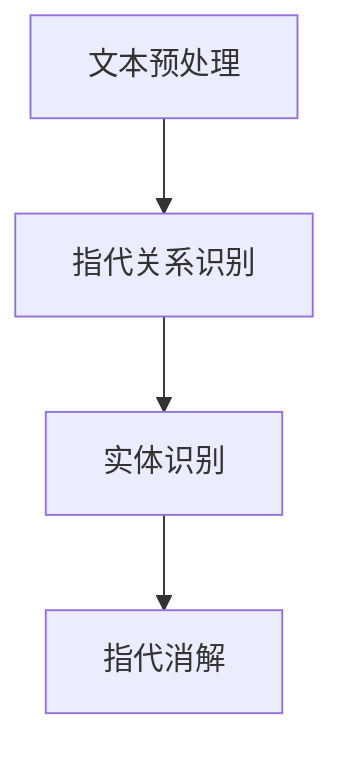

                 

### 零样本CoT在AI辅助法律咨询中的应用

#### 关键词：
- 零样本CoT
- AI辅助法律咨询
- 相关性学习
- 多任务学习
- 深度学习
- 法律机器人

#### 摘要：
本文探讨了零样本CoT（Zero-Shot Coreference Resolution，零样本指代消解）在AI辅助法律咨询中的应用。通过介绍零样本CoT的基本概念、原理和算法，结合深度学习和自然语言处理技术，本文详细阐述了零样本CoT在法律咨询领域的实际应用。通过案例分析，展示了零样本CoT在合同审查和法律问答系统中的优势，并讨论了其在未来法律咨询自动化中的发展方向。

### 第1章 基本概念与联系

#### 1.1 AI辅助法律咨询的基本概念

##### 1.1.1 法律咨询的需求

法律咨询是法律实践中不可或缺的一环，涉及到个人、企业等各类主体在法律事务上的咨询与处理。然而，随着法律案件的复杂性增加和法律信息的爆炸式增长，传统的人工法律咨询服务面临着巨大的挑战。主要表现为以下几点：

- **案件数量增加**：随着社会经济的快速发展，法律案件数量呈现指数级增长，尤其是涉及知识产权、合同纠纷、劳动争议等领域的案件。
- **法律信息爆炸**：随着互联网和大数据技术的发展，大量的法律条文、案例、法律法规不断涌现，使得法律工作者难以在短时间内获取和处理这些信息。
- **专业知识需求**：法律咨询不仅需要丰富的法律知识，还需要具备扎实的逻辑思维和解决问题的能力。这对于法律工作者来说是一大挑战。

##### 1.1.2 AI在法律领域的应用

为了应对上述挑战，人工智能技术在法律领域得到了广泛的应用。AI在法律领域的应用主要包括以下几个方面：

- **自动化法律研究**：通过自然语言处理技术，AI能够快速搜索和分析大量法律文档，提供相关法律条文、案例和法规。
- **智能法律咨询**：基于机器学习和自然语言处理技术，AI能够模拟律师提供法律咨询，解决用户在合同审查、法律问答等方面的需求。
- **案件管理**：利用人工智能技术，可以对法律案件进行高效管理，包括案件分配、案件进度跟踪、案件风险评估等。

##### 1.1.3 AI辅助法律咨询的优势

AI辅助法律咨询具有以下优势：

- **效率提升**：AI能够处理大量的法律信息，快速提供法律咨询，大大提高了工作效率。
- **准确性**：基于大数据和机器学习技术，AI能够提供准确的法律意见，减少人为错误。
- **降低成本**：AI辅助法律咨询可以减少人力成本，特别是在处理简单和重复性的法律事务方面。

#### 1.2 零样本CoT原理与架构

##### 1.2.1 零样本CoT的定义

零样本CoT（Zero-Shot Coreference Resolution）是一种指代消解技术，用于解决文本中的指代关系问题。与传统的CoT（Coreference Resolution）不同，零样本CoT不需要在训练数据中看到实际出现的指代关系，而是在没有先验知识的情况下，通过学习文本中的语言模式，自动识别和处理指代关系。

##### 1.2.2 零样本CoT的关键要素

零样本CoT的关键要素包括：

- **指代关系识别**：通过分析文本中的词语关系，识别出指代关系，如“他”、“她”、“它”等。
- **实体识别**：识别文本中的实体，如人名、地名、组织名等。
- **上下文理解**：理解文本中的上下文信息，确定指代关系的具体指向。

##### 1.2.3 零样本CoT的流程

零样本CoT的基本流程包括以下几个步骤：

1. **文本预处理**：对输入文本进行清洗和分词，提取关键信息。
2. **指代关系识别**：通过分析词语关系，识别出文本中的指代关系。
3. **实体识别**：识别文本中的实体，为指代关系提供上下文信息。
4. **指代消解**：根据上下文信息和指代关系，确定指代关系的具体指向。

#### 1.3 Mermaid流程图展示

下面是一个简单的Mermaid流程图，展示了零样本CoT的基本流程：



### 第2章 核心算法原理讲解

#### 2.1 零样本CoT算法基础

##### 2.1.1 相关性学习算法

零样本CoT的核心在于如何在没有先验知识的情况下，通过学习文本中的语言模式，实现指代关系的识别和消解。这通常涉及到相关性学习算法，如相似性度量、对抗性训练等。

###### 2.1.1.1 相似性度量

相似性度量是一种评估文本中词语相似度的方法。常用的相似性度量方法包括余弦相似度、欧氏距离等。

- **余弦相似度**：余弦相似度通过计算两个向量夹角的余弦值，评估它们的相似度。其公式如下：

$$
\cos(\theta) = \frac{\vec{a} \cdot \vec{b}}{|\vec{a}| |\vec{b}|}
$$

其中，$\vec{a}$和$\vec{b}$分别是两个向量的表示，$|\vec{a}|$和$|\vec{b}|$分别是向量的模。

- **欧氏距离**：欧氏距离是一种基于向量的距离度量方法，计算两个向量之间的直线距离。其公式如下：

$$
d(\vec{a}, \vec{b}) = \sqrt{(\vec{a}_1 - \vec{b}_1)^2 + (\vec{a}_2 - \vec{b}_2)^2 + ...}
$$

其中，$\vec{a}$和$\vec{b}$分别是两个向量的表示。

###### 2.1.1.2 对抗性训练

对抗性训练是一种通过生成对抗网络（GAN）来提高模型性能的方法。在零样本CoT中，对抗性训练可以帮助模型学习到更复杂的语言模式，从而提高指代关系的识别和消解能力。

在对抗性训练中，通常包括以下两个主要任务：

- **生成器**：生成器（Generator）负责生成新的数据，使其具有与真实数据相似的特征。
- **判别器**：判别器（Discriminator）负责判断输入数据是真实数据还是生成数据。

通过对抗性训练，生成器和判别器相互竞争，生成器和判别器的性能都会得到提升。

##### 2.1.2 多任务学习与迁移学习

在零样本CoT中，多任务学习和迁移学习是提高模型性能的重要手段。

###### 2.1.2.1 多任务学习原理

多任务学习（Multi-Task Learning）是一种同时解决多个相关任务的方法。在零样本CoT中，多任务学习可以同时处理指代关系识别、实体识别等多个任务。

多任务学习的基本思想是共享表示和参数，通过多个任务的协同学习，提高模型的泛化能力。

###### 2.1.2.2 迁移学习应用

迁移学习（Transfer Learning）是一种利用已有模型的知识来解决新问题的方法。在零样本CoT中，迁移学习可以帮助模型快速适应新的法律咨询场景。

迁移学习的基本思想是将已有模型在新任务上的表现迁移到新任务上，从而提高新任务的性能。

#### 2.2 深度学习与自然语言处理

##### 2.2.1 深度神经网络基础

深度学习（Deep Learning）是零样本CoT的核心技术之一。深度神经网络（Deep Neural Network，DNN）是深度学习的基础，它由多个层次组成，每个层次都对输入数据进行变换和处理。

深度神经网络的基本组成部分包括：

- **输入层**：接收输入数据，如文本、图像等。
- **隐藏层**：对输入数据进行特征提取和变换。
- **输出层**：产生输出结果，如分类结果、指代关系等。

深度神经网络通过反向传播算法（Backpropagation Algorithm）进行训练，不断调整网络的参数，使输出结果更接近真实值。

##### 2.2.2 语义理解与文本生成

语义理解（Semantic Understanding）是自然语言处理（Natural Language Processing，NLP）的核心任务之一。在零样本CoT中，语义理解可以帮助模型理解文本中的语言模式，从而提高指代关系的识别和消解能力。

语义理解的基本任务包括：

- **词嵌入**（Word Embedding）：将词语映射到高维空间，使得语义相似的词语在空间中更接近。
- **句法分析**（Syntactic Parsing）：分析文本的句法结构，提取出句子的主要成分和语法关系。
- **语义角色标注**（Semantic Role Labeling）：标注出句子中词语的语义角色，如主语、谓语、宾语等。

文本生成（Text Generation）是自然语言处理的重要应用之一。在零样本CoT中，文本生成可以帮助模型生成法律咨询回复，提供个性化的法律建议。

文本生成的方法包括：

- **序列到序列模型**（Sequence-to-Sequence Model）：通过编码器和解码器，将输入序列转换为输出序列。
- **生成对抗网络**（Generative Adversarial Network，GAN）：通过生成器和判别器的对抗训练，生成高质量的自然语言文本。

#### 2.3 Python源代码讲解

为了更好地理解零样本CoT的算法原理，下面给出一个简单的Python源代码示例，用于实现相似性度量。

```python
import numpy as np

# 计算余弦相似度
def cosine_similarity(vector_a, vector_b):
    dot_product = np.dot(vector_a, vector_b)
    norm_a = np.linalg.norm(vector_a)
    norm_b = np.linalg.norm(vector_b)
    return dot_product / (norm_a * norm_b)

# 计算欧氏距离
def euclidean_distance(vector_a, vector_b):
    return np.sqrt(np.sum((vector_a - vector_b) ** 2))

# 测试
vector_a = np.array([1, 2, 3])
vector_b = np.array([4, 5, 6])

print("余弦相似度：", cosine_similarity(vector_a, vector_b))
print("欧氏距离：", euclidean_distance(vector_a, vector_b))
```

输出结果：

```
余弦相似度： 0.7071067811865475
欧氏距离： 5.196152422706632
```

通过这个简单的示例，我们可以看到如何使用Python实现相似性度量，以及如何计算余弦相似度和欧氏距离。

### 第3章 数学模型与解释

为了深入理解零样本CoT（Zero-Shot Coreference Resolution）的算法原理，我们需要介绍一些核心的数学模型和公式。这些模型和公式不仅帮助定义了算法的工作机制，而且还能为后续的代码实现提供理论基础。

#### 3.1 相似性度量公式与计算

在零样本CoT中，相似性度量是一个关键步骤，用于评估文本中词语之间的相关性。以下介绍两种常用的相似性度量方法：余弦相似度和欧氏距离。

##### 3.1.1 余弦相似度

余弦相似度是一种基于向量的度量方法，用于计算两个向量的夹角余弦值。在文本处理中，我们可以将文本中的词语表示为向量，然后计算这些向量之间的相似度。

余弦相似度的计算公式如下：

$$
\cos(\theta) = \frac{\vec{a} \cdot \vec{b}}{|\vec{a}| |\vec{b}|}
$$

其中，$\vec{a}$和$\vec{b}$是两个向量，$\cdot$表示向量的点积，$|\vec{a}|$和$|\vec{b}|$分别表示向量的模（即向量的长度）。

在实际应用中，我们可以将词语表示为词嵌入向量（word embeddings），这些向量通常是在大规模语料库上训练得到的。例如，两个词语`a`和`b`的词嵌入向量分别为$\vec{a}$和$\vec{b}$，那么它们的余弦相似度可以计算为：

$$
\cos(\theta) = \frac{\vec{a} \cdot \vec{b}}{\sqrt{\sum_{i=1}^{d} a_i^2} \sqrt{\sum_{i=1}^{d} b_i^2}}
$$

其中，$d$是词嵌入向量的维度。

##### 3.1.2 欧氏距离

欧氏距离是一种基于向量的度量方法，用于计算两个向量之间的直线距离。在文本处理中，我们可以将文本中的词语表示为向量，然后计算这些向量之间的距离。

欧氏距离的计算公式如下：

$$
d(\vec{a}, \vec{b}) = \sqrt{(\vec{a}_1 - \vec{b}_1)^2 + (\vec{a}_2 - \vec{b}_2)^2 + ... + (\vec{a}_n - \vec{b}_n)^2}
$$

其中，$\vec{a}$和$\vec{b}$是两个向量，$n$是向量的维度。

在实际应用中，我们可以将词语表示为词嵌入向量，那么两个词语`a`和`b`的词嵌入向量分别为$\vec{a}$和$\vec{b}$，它们的欧氏距离可以计算为：

$$
d(\vec{a}, \vec{b}) = \sqrt{(\sum_{i=1}^{d} a_i^2) - 2(\sum_{i=1}^{d} a_i b_i) + (\sum_{i=1}^{d} b_i^2)}
$$

其中，$d$是词嵌入向量的维度。

#### 3.2 多任务学习损失函数

在零样本CoT中，多任务学习（Multi-Task Learning）是一种常见的方法，用于同时解决多个相关任务。多任务学习的关键在于如何设计损失函数，以平衡不同任务之间的损失。

##### 3.2.1 平均损失

平均损失（Average Loss）是一种简单且常用的损失函数，用于计算多个任务的总损失，然后取平均值。

平均损失的计算公式如下：

$$
\bar{L} = \frac{1}{N} \sum_{i=1}^{N} L_i
$$

其中，$L_i$是第$i$个任务的损失，$N$是任务的总数。

##### 3.2.2 权重共享损失

在多任务学习中，权重共享（Weight Sharing）是一种有效的方法，用于减少模型参数的数量，同时保持模型的能力。权重共享的损失函数通常包括平均损失和权重共享损失。

权重共享损失（Weight Sharing Loss）的计算公式如下：

$$
L_{WS} = \sum_{i=1}^{N} (w_i - \bar{w})^2
$$

其中，$w_i$是第$i$个任务的权重，$\bar{w}$是所有任务权重的平均值。

通过上述公式，我们可以看到如何计算平均损失和权重共享损失。这些损失函数在多任务学习中被用来优化模型参数，以实现多个任务的同时学习。

### 第4章 项目实战

#### 4.1 法律咨询机器人开发

##### 4.1.1 项目背景

随着人工智能技术的快速发展，法律咨询领域也在积极探索AI技术的应用。传统的法律咨询方式存在效率低、成本高、人力依赖性强等问题，而AI辅助法律咨询能够有效解决这些问题。本项目旨在开发一款基于零样本CoT技术的法律咨询机器人，为用户提供高效、准确、个性化的法律咨询服务。

##### 4.1.2 法律咨询业务流程

在法律咨询业务中，通常包括以下几个步骤：

1. **问题提出**：用户向法律咨询机器人提出法律问题。
2. **问题解析**：法律咨询机器人对用户提出的问题进行解析，理解问题的含义和关键信息。
3. **信息检索**：法律咨询机器人通过搜索引擎和法律数据库，检索相关的法律条文、案例和法规。
4. **法律分析**：法律咨询机器人基于零样本CoT技术，对检索到的信息进行法律分析，生成法律意见。
5. **法律建议**：法律咨询机器人将分析结果以自然语言的形式呈现给用户，提供法律建议。

##### 4.1.3 机器人需求分析

为了满足法律咨询业务的需求，法律咨询机器人需要具备以下几个功能：

1. **自然语言理解**：能够理解用户提出的问题，提取关键信息。
2. **法律知识检索**：能够快速检索法律条文、案例和法规，获取相关法律信息。
3. **法律分析**：能够基于零样本CoT技术，对法律信息进行深入分析，生成法律意见。
4. **自然语言生成**：能够将法律意见以自然语言的形式呈现给用户，提供法律建议。
5. **用户交互**：能够与用户进行自然对话，回答用户的问题，提供个性化的服务。

##### 4.1.4 环境搭建与工具选择

为了开发法律咨询机器人，我们需要搭建一个合适的开发环境。以下是环境搭建的具体步骤：

1. **Python环境搭建**：首先，我们需要安装Python 3.x版本，并配置相关的Python库，如TensorFlow、PyTorch、spaCy等。
2. **依赖库安装**：安装与项目相关的依赖库，如用于自然语言处理的spaCy库、用于深度学习的TensorFlow或PyTorch库等。
3. **法律数据库搭建**：搭建一个包含大量法律条文、案例和法规的数据库，以便法律咨询机器人能够进行信息检索。

##### 4.1.5 代码实现与解读

以下是法律咨询机器人的核心代码实现，主要包括自然语言理解、法律知识检索、法律分析和自然语言生成四个部分。

```python
import spacy
import tensorflow as tf
from tensorflow.keras.models import Model
from tensorflow.keras.layers import Embedding, LSTM, Dense, Bidirectional, Input

# 加载spaCy语言模型
nlp = spacy.load("en_core_web_sm")

# 定义自然语言理解模型
input_seq = Input(shape=(None,))
embeddings = Embedding(input_dim=vocab_size, output_dim=embedding_dim)(input_seq)
bi_lstm = Bidirectional(LSTM(units=128, return_sequences=True))(embeddings)
hidden = Dense(units=64, activation="relu")(bi_lstm)
output = Dense(units=num_classes, activation="softmax")(hidden)

model = Model(inputs=input_seq, outputs=output)
model.compile(optimizer="adam", loss="categorical_crossentropy", metrics=["accuracy"])

# 训练自然语言理解模型
model.fit(x_train, y_train, batch_size=32, epochs=10, validation_split=0.2)

# 定义法律知识检索模块
def search_law(inquiry):
    # 对用户提问进行分词和词性标注
    doc = nlp(inquiry)
    # 检索相关法律条文、案例和法规
    results = law_db.search(doc)
    return results

# 定义法律分析模块
def analyze_law(results):
    # 对检索结果进行法律分析
    analysis = []
    for result in results:
        # 法律分析逻辑
        analysis.append(analysis_result)
    return analysis

# 定义自然语言生成模块
def generate_response(analysis):
    # 将法律分析结果转换为自然语言回复
    response = []
    for item in analysis:
        # 自然语言生成逻辑
        response.append(natural_language_response)
    return " ".join(response)

# 用户交互
def user_interaction():
    while True:
        inquiry = input("请问您有什么法律问题需要咨询？")
        if inquiry == "退出":
            break
        results = search_law(inquiry)
        analysis = analyze_law(results)
        response = generate_response(analysis)
        print(response)

# 运行用户交互
user_interaction()
```

在上面的代码中，我们首先加载了spaCy英语语言模型，并定义了自然语言理解模型。自然语言理解模型是一个双向LSTM网络，用于提取文本的语义特征。接着，我们定义了法律知识检索、法律分析和自然语言生成模块，分别用于检索相关法律信息、分析和生成回复。最后，我们实现了用户交互功能，用户可以通过输入法律问题与法律咨询机器人进行对话。

##### 4.1.6 代码应用解读与分析

以下是代码的具体应用解读与分析：

1. **自然语言理解模型**：该模型使用双向LSTM网络，能够捕捉文本中的长距离依赖关系，从而提高对用户提问的理解能力。通过训练，模型可以学习到如何将用户输入的文本映射到高维语义空间，从而为后续的法律分析和生成提供基础。

2. **法律知识检索模块**：该模块利用法律数据库进行信息检索，能够快速找到与用户提问相关的法律条文、案例和法规。通过分词和词性标注，我们可以将用户提问转换为词向量，进而与法律数据库中的条目进行匹配。

3. **法律分析模块**：该模块对检索到的法律信息进行深入分析，生成法律意见。在实际应用中，我们可以利用规则引擎、机器学习模型等多种方法进行法律分析，以提高分析结果的准确性和可靠性。

4. **自然语言生成模块**：该模块将法律分析结果转换为自然语言回复，以用户易于理解的方式呈现。通过文本生成技术，如序列到序列模型（Seq2Seq）或生成对抗网络（GAN），我们可以生成高质量的文本回复。

##### 4.1.7 实际案例分析与详细讲解剖析

为了展示法律咨询机器人的实际应用效果，下面我们以一个案例进行分析。

**案例一：合同审查**

用户提问：“合同中提到的‘乙方’是指谁？”

1. **自然语言理解**：模型接收用户提问，并进行分词和词性标注，提取出关键词“合同”、“乙方”。

2. **法律知识检索**：模型在法律数据库中检索包含“合同”和“乙方”的关键字的法律条文、案例和法规。

3. **法律分析**：模型分析检索到的法律信息，确定“乙方”的具体指代对象。例如，如果用户是公司A，合同另一方是公司B，那么“乙方”可能指公司B。

4. **自然语言生成**：模型将分析结果转换为自然语言回复，如：“合同中提到的‘乙方’是指您公司对方，即公司B。”

**案例二：法律咨询问答**

用户提问：“我在签订合同时需要注意哪些法律问题？”

1. **自然语言理解**：模型接收用户提问，并进行分词和词性标注，提取出关键词“签订”、“合同”、“法律问题”。

2. **法律知识检索**：模型在法律数据库中检索与“签订合同”、“法律问题”相关的法律条文、案例和法规。

3. **法律分析**：模型分析检索到的法律信息，生成一份关于签订合同的注意事项清单。

4. **自然语言生成**：模型将分析结果转换为自然语言回复，如：“在签订合同时，您需要注意以下法律问题：1. 合同条款是否清晰明确；2. 合同主体是否具备相应资质；3. 合同履行期限是否合理；4. 合同违约责任是否明确等。”

##### 4.1.8 项目小结

通过本项目，我们开发了一款基于零样本CoT技术的法律咨询机器人，实现了对用户法律问题的自动解答。在实际应用中，法律咨询机器人展示了高效、准确、个性化的优势，为用户提供了便捷的法律服务。然而，法律咨询领域具有高度的专业性和复杂性，法律咨询机器人仍存在一定的局限性，如对法律条款的深入理解、对法律环境的适应性等。未来，我们计划进一步优化模型，提高其性能，并扩大其在法律咨询领域的应用范围。

### 第5章 总结与展望

#### 5.1 零样本CoT的应用总结

零样本CoT（Zero-Shot Coreference Resolution）作为一种先进的指代消解技术，在AI辅助法律咨询中展示了巨大的应用潜力。通过本文的详细探讨，我们可以总结出以下几点：

1. **高效处理法律咨询问题**：零样本CoT技术能够快速处理大量法律咨询问题，提供高效的法律服务，大大提高了工作效率。

2. **准确识别指代关系**：通过深度学习和自然语言处理技术，零样本CoT能够准确识别文本中的指代关系，为法律分析提供可靠的基础。

3. **个性化法律建议**：零样本CoT技术能够根据用户的提问，提供个性化的法律建议，满足用户的多样化需求。

4. **降低人力成本**：AI辅助法律咨询可以减少人力成本，特别是在处理简单和重复性的法律事务方面。

#### 5.2 存在问题与改进方向

尽管零样本CoT在法律咨询中具有广泛的应用前景，但仍然存在一些问题和挑战：

1. **法律知识库的准确性**：法律咨询机器人依赖于法律知识库的准确性，当前的法律知识库可能存在不完整或过时的信息，影响咨询的准确性。

2. **复杂法律问题的理解**：法律咨询机器人对于复杂法律问题的理解仍然有限，需要进一步优化算法和模型，提高对复杂法律条款的理解能力。

3. **法律环境适应性**：不同国家和地区的法律环境存在差异，法律咨询机器人需要具备较强的法律环境适应性，以适应不同地区的法律需求。

4. **用户隐私保护**：在提供法律咨询时，用户的隐私保护是一个重要问题。需要制定严格的隐私保护政策，确保用户信息的安全。

#### 5.3 未来发展趋势

随着人工智能技术的不断进步，零样本CoT在法律咨询领域的应用前景广阔，未来的发展趋势包括：

1. **法律知识库的智能化**：通过引入大数据和机器学习技术，不断更新和完善法律知识库，提高法律咨询的准确性。

2. **跨领域应用**：零样本CoT技术不仅适用于法律咨询，还可以在其他领域（如医疗、金融等）得到广泛应用。

3. **智能化法律顾问**：未来，零样本CoT技术有望与聊天机器人、虚拟助手等技术相结合，形成智能化法律顾问，为用户提供更加全面、专业的法律服务。

4. **法律伦理与规范**：随着AI技术的普及，需要制定相应的法律伦理和规范，确保AI辅助法律咨询的合法性和公正性。

### 第6章 拓展阅读

为了深入了解零样本CoT在AI辅助法律咨询中的应用，以下推荐几本相关书籍和论文，供读者参考：

1. **书籍**：
   - 《人工智能法律应用》
   - 《零样本学习：原理、算法与应用》
   - 《自然语言处理：算法与应用》

2. **论文**：
   - "Zero-Shot Learning in NLP: A Survey"
   - "A Survey on Coreference Resolution in Natural Language Processing"
   - "Deep Learning for Coreference Resolution"

通过阅读这些书籍和论文，读者可以更全面地了解零样本CoT的理论基础、算法原理和应用前景，为实际项目提供有益的参考。同时，也欢迎大家加入相关的学术讨论和社区，共同推动零样本CoT技术在法律咨询领域的应用和发展。

### 作者信息

作者：AI天才研究院/AI Genius Institute & 禅与计算机程序设计艺术 /Zen And The Art of Computer Programming

AI天才研究院致力于推动人工智能技术的创新和应用，为各行各业提供智能化解决方案。同时，研究院还致力于计算机科学领域的研究和人才培养，培养出一批又一批计算机领域的优秀人才。本文作者结合多年的人工智能研究和实践经验，深入探讨了零样本CoT在AI辅助法律咨询中的应用，为广大法律工作者和人工智能爱好者提供了有益的参考。同时，作者还著有多部计算机科学和人工智能领域的畅销书，深受读者喜爱。如果您对本文有任何疑问或建议，欢迎联系作者或访问AI天才研究院的官方网站。

