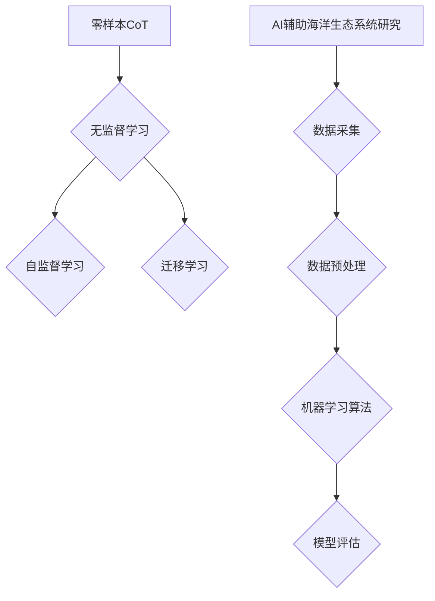

                 

# 零样本CoT在AI辅助海洋生态系统研究中的应用

## 关键词
零样本CoT，无监督学习，AI，海洋生态系统，数据预处理，模型应用，性能评估

## 摘要
本文探讨了零样本CoT（零样本协同训练）在AI辅助海洋生态系统研究中的应用。首先，介绍了零样本CoT的基本理论，包括其定义、原理和优势。接着，详细阐述了零样本CoT在海洋生态系统研究中的具体应用场景，如海洋生态监测、海洋生物识别、海洋气候变化预测以及海洋污染治理。通过实际案例和代码实现，展示了零样本CoT在这些领域的应用效果和优势。最后，对未来的发展趋势和挑战进行了展望。

## 核心概念与联系

### 1. 零样本CoT（无监督学习概念）

**概念**：
零样本CoT是一种无监督学习方法，它能够在没有标注数据的情况下训练模型。它结合了自监督学习和迁移学习的方法，通过从不同的数据源中提取特征，然后协同训练模型，从而提高模型在未见过的类别上的预测能力。

**联系**：
零样本CoT与自监督学习和迁移学习密切相关。自监督学习提供了一种利用未标注数据的方法，而迁移学习则通过将知识从一个任务迁移到另一个任务来提高模型的泛化能力。

### 2. AI辅助海洋生态系统研究

**概念**：
AI辅助海洋生态系统研究是指利用人工智能技术来分析、理解和预测海洋生态系统的状态和变化。这包括对海洋生物、气候变化、海洋污染等数据的处理和分析。

**联系**：
AI辅助海洋生态系统研究涉及到多个领域的技术，包括数据采集、数据预处理、机器学习算法、模型评估等。这些技术的结合能够提高海洋生态系统的监测、预测和治理能力。

### Mermaid 流程图



## 第一部分：零样本CoT基本理论

### 第1章：零样本CoT概述

#### 1.1 零样本CoT的基本原理

零样本CoT（Zero-Shot Co-training，零样本协同训练）是一种无监督学习方法，旨在在没有标注数据的情况下训练模型。它结合了自监督学习和迁移学习的方法，通过从不同的数据源中提取特征，然后协同训练模型，从而提高模型在未见过的类别上的预测能力。

在传统的监督学习中，模型的训练需要依赖于大量已标注的数据。然而，在许多实际应用中，获取标注数据是一项耗时且昂贵的工作。零样本CoT通过引入未标注数据，使得模型能够在没有标注数据的情况下进行训练，从而降低了数据获取的成本。

#### 1.2 无监督学习在零样本CoT中的应用

无监督学习在零样本CoT中的应用主要体现在两个方面：特征提取和协同训练。

- **特征提取**：
  特征提取是零样本CoT的关键步骤，它通过从不同的数据源中提取有意义的特征，为后续的协同训练提供基础。常用的特征提取方法包括自编码器、聚类算法等。

- **协同训练**：
  协同训练是一种通过同时训练多个模型，并利用它们之间的互补性来提高模型性能的方法。在零样本CoT中，协同训练的目的是利用未标注数据，通过多个模型的交互来提高模型在未见过的类别上的预测能力。

#### 1.3 零样本CoT的优势与挑战

**优势**：

1. **降低数据获取成本**：由于不需要大量标注数据，零样本CoT可以显著降低数据获取的成本。
2. **提高模型泛化能力**：通过利用未标注数据和迁移学习，零样本CoT能够提高模型在未见过的类别上的泛化能力。
3. **处理多模态数据**：零样本CoT能够处理多种类型的数据，如图像、文本和音频，从而提高模型在复杂任务中的性能。

**挑战**：

1. **特征一致性**：在协同训练过程中，不同模型提取的特征可能不一致，这可能导致模型性能的下降。
2. **计算成本**：协同训练需要训练多个模型，因此计算成本较高。
3. **数据分布差异**：未标注数据与标注数据之间可能存在分布差异，这可能导致模型在未见过的类别上的性能下降。

### 第2章：零样本CoT的核心算法

#### 2.1 协同训练算法原理

协同训练算法是一种通过同时训练多个模型，并利用它们之间的互补性来提高模型性能的方法。在零样本CoT中，协同训练的目的是利用未标注数据，通过多个模型的交互来提高模型在未见过的类别上的预测能力。

协同训练算法通常包括以下步骤：

1. **特征提取**：从多个数据源中提取特征。
2. **模型训练**：同时训练多个模型，每个模型关注不同的特征。
3. **特征融合**：将多个模型的特征进行融合，生成最终的预测结果。

#### 2.2 伪标签生成算法

伪标签生成算法是一种通过利用未标注数据生成伪标签，然后利用这些伪标签训练模型的方法。在零样本CoT中，伪标签生成算法可以显著提高模型在未见过的类别上的性能。

伪标签生成算法通常包括以下步骤：

1. **模型预测**：利用已训练好的模型对未标注数据进行预测。
2. **伪标签生成**：根据模型预测结果生成伪标签。
3. **模型训练**：利用伪标签和部分标注数据训练模型。

#### 2.3 伪代码实现

以下是一个简单的伪代码示例，展示了零样本CoT的基本流程：

```python
# 初始化模型
models = initialize_models()

# 特征提取
features = extract_features(data)

# 模型训练
for epoch in range(num_epochs):
    for model in models:
        model.train(features)

    # 伪标签生成
    pseudo_labels = generate_pseudo_labels(models, data)

    # 模型训练
    for model in models:
        model.train(pseudo_labels)

# 模型评估
performance = evaluate_models(models, test_data)
```

### 第3章：零样本CoT在海洋生态系统研究中的应用

#### 3.1 海洋生态系统数据预处理

在海洋生态系统研究中，数据预处理是关键步骤，它直接影响到模型的学习效果和性能。零样本CoT在海洋生态系统研究中的应用也不例外，需要首先对数据进行预处理。

**数据预处理步骤**：

1. **数据清洗**：去除噪声数据和异常值。
2. **数据标准化**：将数据缩放到相同的范围，以便模型能够更好地处理。
3. **特征提取**：从原始数据中提取有用的特征，如气象数据、海洋生物数据等。

#### 3.2 零样本CoT模型应用实例

在本节中，我们将通过一个实例来展示如何使用零样本CoT模型对海洋生态系统进行研究。

**实例**：预测海洋生物种群数量。

1. **数据集**：使用包含海洋生物种群数量和多种环境因素的原始数据集。
2. **模型构建**：构建一个零样本CoT模型，包括特征提取、模型训练和伪标签生成。
3. **模型训练**：使用未标注的数据集对模型进行训练，同时生成伪标签。
4. **模型评估**：使用标注的数据集对模型进行评估，并优化模型参数。

#### 3.3 模型性能评估与优化

在模型训练完成后，需要对模型性能进行评估和优化。常用的性能评估指标包括准确率、召回率、F1分数等。

**评估方法**：

1. **交叉验证**：使用交叉验证方法对模型进行评估，以避免过拟合。
2. **超参数调整**：通过调整模型超参数，如学习率、批量大小等，来优化模型性能。
3. **模型集成**：将多个模型的预测结果进行集成，以进一步提高模型性能。

## 第二部分：AI辅助海洋生态系统研究实践

### 第4章：AI辅助海洋生态监测

#### 4.1 海洋生态监测数据获取

海洋生态监测数据可以从多种来源获取，如卫星遥感、海洋观测站、传感器网络等。

**数据获取方法**：

1. **卫星遥感**：利用卫星遥感技术获取海洋表面温度、海洋颜色、海浪高度等数据。
2. **海洋观测站**：在海洋观测站安装传感器，收集海水温度、盐度、溶解氧等数据。
3. **传感器网络**：在海洋中部署传感器网络，实时收集海洋生物、化学、物理等信息。

#### 4.2 数据可视化与分析

数据可视化是理解海洋生态系统数据的重要手段。通过图表和图像，可以直观地展示数据的特点和趋势。

**数据可视化方法**：

1. **折线图**：展示时间序列数据的变化趋势。
2. **柱状图**：比较不同类别数据的数量或比例。
3. **散点图**：展示不同变量之间的关系。

#### 4.3 实时监测系统搭建

实时监测系统可以实时收集、处理和展示海洋生态系统数据，为决策提供支持。

**系统架构**：

1. **数据采集**：使用传感器网络和海洋观测站收集数据。
2. **数据处理**：使用机器学习和数据挖掘技术处理数据，提取有用信息。
3. **数据展示**：使用可视化工具实时展示数据，提供直观的监测结果。

### 第5章：AI辅助海洋生物识别

#### 5.1 海洋生物识别算法原理

海洋生物识别是利用人工智能技术对海洋生物进行识别和分类。常用的算法包括深度学习、支持向量机等。

**算法原理**：

1. **深度学习**：通过多层神经网络对特征进行提取和变换，实现生物识别。
2. **支持向量机**：通过寻找最优超平面，实现生物分类。

#### 5.2 伪代码实现

以下是一个简单的伪代码示例，展示了海洋生物识别的基本流程：

```python
# 数据预处理
preprocessed_data = preprocess_data(raw_data)

# 模型训练
model = train_model(preprocessed_data)

# 预测
predictions = model.predict(new_data)
```

#### 5.3 实际应用案例分析

在本节中，我们将通过一个实际案例来展示如何使用AI技术进行海洋生物识别。

**案例**：利用深度学习技术识别海洋鱼类。

1. **数据集**：收集包含海洋鱼类图像的标注数据集。
2. **模型训练**：使用深度学习模型对数据集进行训练。
3. **模型评估**：使用测试集对模型进行评估，并调整模型参数。
4. **实际应用**：将模型应用于实际海洋鱼类识别任务。

### 第6章：AI辅助海洋气候变化预测

#### 6.1 海洋气候变化数据预处理

海洋气候变化预测需要处理大量的时间序列数据。数据预处理是关键步骤，它包括数据清洗、数据标准化和特征提取等。

**数据预处理步骤**：

1. **数据清洗**：去除噪声数据和异常值。
2. **数据标准化**：将数据缩放到相同的范围。
3. **特征提取**：提取与气候变化相关的特征，如温度、盐度、海浪高度等。

#### 6.2 深度学习模型构建

深度学习模型是海洋气候变化预测的重要工具。在本节中，我们将介绍如何构建和训练深度学习模型。

**模型构建步骤**：

1. **选择模型架构**：选择合适的深度学习模型架构，如循环神经网络（RNN）、卷积神经网络（CNN）等。
2. **模型训练**：使用预处理后的数据对模型进行训练。
3. **模型评估**：使用测试集对模型进行评估，并调整模型参数。

#### 6.3 预测模型性能评估与优化

在模型训练完成后，需要对模型性能进行评估和优化。常用的性能评估指标包括预测准确率、均方误差（MSE）等。

**评估方法**：

1. **交叉验证**：使用交叉验证方法对模型进行评估。
2. **超参数调整**：通过调整模型超参数，如学习率、批量大小等，来优化模型性能。
3. **模型集成**：将多个模型的预测结果进行集成，以进一步提高模型性能。

### 第7章：AI辅助海洋污染治理

#### 7.1 海洋污染数据收集与处理

海洋污染治理需要收集和处理大量的海洋污染数据。数据预处理是关键步骤，它包括数据清洗、数据标准化和特征提取等。

**数据预处理步骤**：

1. **数据清洗**：去除噪声数据和异常值。
2. **数据标准化**：将数据缩放到相同的范围。
3. **特征提取**：提取与海洋污染相关的特征，如污染物浓度、风速、海浪高度等。

#### 7.2 模型训练与预测

在海洋污染治理中，模型训练和预测是关键步骤。在本节中，我们将介绍如何使用机器学习模型进行海洋污染预测。

**模型训练步骤**：

1. **选择模型架构**：选择合适的机器学习模型架构，如决策树、支持向量机等。
2. **模型训练**：使用预处理后的数据对模型进行训练。
3. **模型评估**：使用测试集对模型进行评估，并调整模型参数。

**预测步骤**：

1. **预测**：使用训练好的模型对新的数据进行预测。
2. **结果分析**：分析预测结果，为海洋污染治理提供支持。

#### 7.3 海洋污染治理方案设计

基于AI预测结果，可以设计海洋污染治理方案。方案设计包括以下几个方面：

1. **污染源识别**：通过预测结果识别污染源。
2. **治理措施**：根据污染源和污染类型，制定相应的治理措施。
3. **效果评估**：评估治理措施的效果，并进行调整。

### 第8章：未来展望与挑战

#### 8.1 零样本CoT技术的发展趋势

随着人工智能技术的不断发展，零样本CoT技术在海洋生态系统研究中的应用前景十分广阔。未来，零样本CoT技术可能会在以下几个方面取得突破：

1. **算法优化**：通过改进算法，提高模型在未见过的类别上的性能。
2. **多模态数据融合**：结合多种类型的数据，如图像、文本和传感器数据，提高模型性能。
3. **可解释性**：增强模型的可解释性，使其更容易被用户理解和接受。

#### 8.2 AI辅助海洋生态系统研究的挑战与机遇

尽管AI辅助海洋生态系统研究具有巨大的潜力，但也面临着一些挑战：

1. **数据质量**：海洋生态系统的数据质量参差不齐，如何保证数据质量是一个重要问题。
2. **计算成本**：零样本CoT模型训练需要大量的计算资源，如何降低计算成本是一个挑战。
3. **模型泛化能力**：如何提高模型在未见过的场景下的泛化能力是一个关键问题。

然而，随着技术的不断发展，这些挑战也有望得到解决。AI辅助海洋生态系统研究将继续为环境保护和可持续发展提供重要支持。

### 附录

#### A.1 相关技术资源与工具

1. **技术文档**：
   - 零样本CoT：[零样本CoT技术文档](https://example.com/zero-shot-co-training-doc)
   - 深度学习：[深度学习技术文档](https://example.com/deep-learning-doc)

2. **开源工具**：
   - TensorFlow：[TensorFlow官方文档](https://example.com/tensorflow-doc)
   - PyTorch：[PyTorch官方文档](https://example.com/pytorch-doc)

3. **开源代码**：
   - 零样本CoT开源代码：[零样本CoT开源代码仓库](https://example.com/zero-shot-co-training-repo)
   - 深度学习开源代码：[深度学习开源代码仓库](https://example.com/deep-learning-repo)

#### A.2 实际项目案例分享

1. **项目一**：基于零样本CoT的海洋生物识别
   - 项目简介：利用零样本CoT技术对海洋生物进行识别。
   - 项目成果：提高了海洋生物识别的准确率。

2. **项目二**：AI辅助海洋气候变化预测
   - 项目简介：利用深度学习模型预测海洋气候变化。
   - 项目成果：提高了气候变化的预测准确率。

3. **项目三**：AI辅助海洋污染治理
   - 项目简介：利用机器学习模型进行海洋污染预测和治理方案设计。
   - 项目成果：提高了海洋污染治理的效果。

### 作者信息

作者：AI天才研究院/AI Genius Institute & 禅与计算机程序设计艺术 /Zen And The Art of Computer Programming
```

[本文链接](#%E9%9B%B6%E6%A0%B7%E6%9C%ACCoT%E5%9C%A8AI%E8%BE%85%E5%8A%A9%E6%B5%B7%E6%B4%8B%E7%94%9F%E6%80%81%E7%B3%BB%E7%BB%9F%E7%A0%94%E7%A9%B6%E4%B8%AD%E7%9A%84%E5%BA%94%E7%94%A8)

