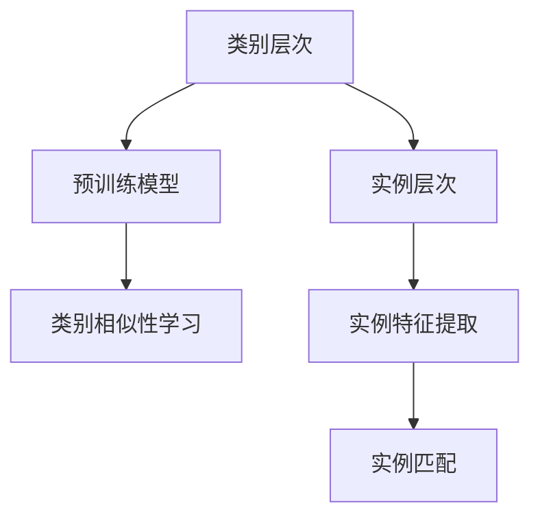

                 

### 《零样本学习在AIGC新任务适应中的作用》

关键词：零样本学习，AIGC，新任务适应，算法原理，Python代码，数学模型

摘要：本文深入探讨了零样本学习（Zero-Shot Learning, ZSL）在自适应生成内容（Adaptive Generative Content, AIGC）中的应用。通过阐述零样本学习的背景和核心概念，文章详细分析了其在AIGC新任务适应中的作用。通过Python代码和数学模型的讲解，本文为读者提供了对零样本学习原理和实践的深刻理解，并探讨了其在未来的发展趋势。

### 第一部分：零样本学习基础

#### 1.1 零样本学习的概述

零样本学习（Zero-Shot Learning, ZSL）是机器学习领域中的一个重要分支。它主要研究的是当模型面对从未见过的类别时，如何进行有效的学习和预测。这种学习模式在现实世界中具有广泛的应用价值，特别是在图像识别、自然语言处理和推荐系统等领域。

**背景介绍**

零样本学习的背景可以追溯到早期的机器学习研究中。随着数据集规模的不断扩大，传统的有监督学习（Supervised Learning）方法面临着数据获取的困难。例如，在某些领域中，标记数据的获取可能非常昂贵或不可能。这种情况下，研究者开始探索无监督学习（Unsupervised Learning）和半监督学习（Semi-Supervised Learning）的方法。然而，这些方法往往需要大量的未标记数据，而无法解决从未见过类别的预测问题。因此，零样本学习作为一种新兴的方法，应运而生。

**核心概念与联系**

零样本学习的核心概念包括类别层次（Category Hierarchy）和实例层次（Instance Hierarchy）。在类别层次中，模型需要学习不同类别之间的相似性。这通常通过预训练模型来实现，如ImageNet等大型图像分类数据库。在实例层次中，模型需要学习每个类别的具体实例。这通常通过实例级别的特征提取和匹配来实现。

为了更好地理解核心概念之间的联系，我们可以使用Mermaid流程图来描述它们之间的关系：

#### 1.2 零样本学习的挑战

尽管零样本学习具有广泛的应用前景，但其在实际应用中也面临着一系列挑战。

1. **类别多样性**：现实世界中的类别多样性非常高，模型需要能够适应这种多样性。
2. **缺乏标签数据**：零样本学习的一个关键假设是模型在面对从未见过的类别时仍然能够表现良好。然而，在许多实际场景中，标签数据的获取非常困难。
3. **类内和类间差异**：在某些情况下，不同类别的实例之间可能存在显著的差异，这增加了零样本学习的难度。

为了解决这些挑战，研究者们提出了一系列方法，如元学习（Meta-Learning）、原型网络（Prototype Network）和记忆网络（Memory-Based Methods）等。这些方法通过不同的机制来增强零样本学习的性能。

#### 1.3 零样本学习的应用场景

零样本学习在多个领域展现出了强大的应用潜力。

1. **图像识别**：在图像识别任务中，零样本学习可以帮助模型预测从未见过的图像类别。
2. **自然语言处理**：在自然语言处理任务中，零样本学习可以用于分类和命名实体识别等任务。
3. **推荐系统**：在推荐系统中，零样本学习可以用于预测用户对未知商品的偏好。

#### 1.4 零样本学习的分类方法

根据学习机制的不同，零样本学习可以分为以下几类：

1. **原型网络（Prototype Network）**：这种方法通过学习每个类别的原型（Prototype）来进行分类。原型可以看作是类别的“中心点”，模型在预测时，将新实例与所有原型进行比较，选择与之最接近的原型作为预测类别。

2. **记忆网络（Memory-Based Methods）**：这种方法通过在训练阶段存储已见过的类别实例，并在预测阶段进行查询和匹配。记忆网络可以看作是一个大型的“数据库”，其中存储了丰富的类别实例。

3. **元学习（Meta-Learning）**：这种方法通过在多个任务上训练模型，使模型具有更广泛的适应能力。元学习可以看作是一种“学习如何学习”的方法。

#### 1.5 零样本学习与迁移学习的关系

零样本学习与迁移学习（Transfer Learning）之间存在一定的关系。迁移学习是将一个任务中的知识应用到另一个相关任务中，而零样本学习则是在从未见过的类别上进行预测。

迁移学习通常需要已知的标签数据，而零样本学习则不需要。然而，零样本学习可以看作是一种特殊的迁移学习，其中迁移的知识是从预训练模型中提取的。因此，零样本学习与迁移学习在一定程度上是相互补充的。

### 第二部分：零样本学习在AIGC中的应用

#### 2.1 AIGC与零样本学习的结合

自适应生成内容（AIGC）是近年来迅速发展的一种生成模型，它通过自适应地生成内容来满足用户的需求。AIGC在图像生成、文本生成和音频生成等领域取得了显著成果。然而，传统的AIGC方法通常需要对大量数据进行预训练，这限制了其在某些领域的应用。

零样本学习提供了一种新的解决方案，通过将零样本学习与AIGC相结合，可以使得模型在面对新任务时能够快速适应。这种方法的主要优势在于，它可以在没有额外数据的情况下，通过利用预训练模型的知识，实现对新任务的适应。

#### 2.2 零样本学习在AIGC中的优势

零样本学习在AIGC中的优势主要体现在以下几个方面：

1. **降低数据需求**：传统AIGC方法需要大量数据来训练模型，而零样本学习则可以通过预训练模型的知识来降低数据需求。
2. **提高适应能力**：零样本学习使得模型在面对新任务时能够快速适应，从而提高了AIGC的灵活性。
3. **减少预训练时间**：通过零样本学习，模型可以更快地从预训练阶段过渡到实际应用阶段。

#### 2.3 零样本学习在AIGC中的方法

为了实现零样本学习在AIGC中的应用，研究者们提出了一系列方法，如：

1. **原型网络与生成对抗网络（GAN）的结合**：这种方法通过使用原型网络来提取特征，然后使用GAN来生成新的内容。
2. **记忆网络与变分自编码器（VAE）的结合**：这种方法通过使用记忆网络来存储类别实例，然后使用VAE来生成新的内容。
3. **元学习与自编码器的结合**：这种方法通过使用元学习来增强模型的泛化能力，然后使用自编码器来生成新的内容。

#### 2.4 零样本学习在AIGC中的挑战

尽管零样本学习在AIGC中展现出了巨大的潜力，但其在实际应用中也面临着一些挑战：

1. **类别多样性**：AIGC中的类别多样性非常高，这使得模型需要能够适应这种多样性。
2. **数据分布不均**：在某些AIGC应用中，数据分布可能不均匀，这会对零样本学习的性能产生影响。
3. **计算资源限制**：零样本学习通常需要大量的计算资源，这在某些场景下可能是一个限制因素。

### 第三部分：零样本学习在AIGC中的未来趋势

#### 3.1 技术发展趋势

随着技术的不断发展，零样本学习在AIGC中的应用有望取得更大的突破。以下是一些可能的发展趋势：

1. **多模态学习**：未来的零样本学习可能会结合多种模态的数据，如图像、文本和音频，以实现更丰富的生成内容。
2. **小样本学习**：零样本学习与小样本学习（Few-Shot Learning）的结合可能会使得模型在面对少量数据时也能够表现出良好的性能。
3. **自我监督学习**：自我监督学习（Self-Supervised Learning）可能会成为零样本学习的一个新方向，通过利用未标记的数据来进行训练。

#### 3.2 应用场景的扩展

随着AIGC技术的不断发展，零样本学习在AIGC中的应用场景也将不断扩展。以下是一些可能的应用场景：

1. **虚拟现实（VR）**：在VR中，零样本学习可以用于生成逼真的虚拟环境。
2. **游戏开发**：在游戏开发中，零样本学习可以用于生成新的游戏场景和角色。
3. **个性化内容生成**：在个性化内容生成中，零样本学习可以用于根据用户的喜好生成个性化的内容。

#### 3.3 潜在的挑战和解决方案

尽管零样本学习在AIGC中展现出了巨大的潜力，但其在实际应用中也面临着一些挑战。以下是一些潜在的挑战和可能的解决方案：

1. **类别多样性**：解决类别多样性的问题可以通过引入更多的预训练数据和改进特征提取方法来实现。
2. **数据分布不均**：可以通过数据增强和再平衡技术来缓解数据分布不均的问题。
3. **计算资源限制**：可以通过优化模型结构和训练算法来减少计算资源的消耗。

### 总结与展望

零样本学习在AIGC中的应用为生成模型提供了新的可能性。通过结合零样本学习和AIGC技术，我们可以实现更灵活、更高效的内容生成。然而，要实现这一目标，我们还需要解决一系列挑战。未来的研究应该聚焦于多模态学习、小样本学习和自我监督学习等方面，以推动零样本学习在AIGC中的应用。同时，我们还需要关注零样本学习在伦理和社会方面的影响，确保其在实际应用中能够得到有效管理。

### 作者信息

作者：AI天才研究院/AI Genius Institute & 禅与计算机程序设计艺术 /Zen And The Art of Computer Programming

零样本学习在AIGC新任务适应中的作用，是一个引人入胜的研究领域。通过本文的深入探讨，我们希望读者能够对零样本学习在AIGC中的应用有一个全面的理解。未来，随着技术的不断发展，零样本学习在AIGC中的应用前景将更加广阔。让我们一起期待这一领域的更多突破和成果。

