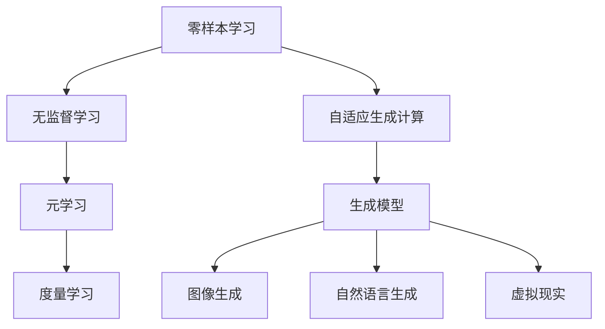

                 

### 文章标题

《零样本学习在AIGC新领域探索中的作用》

### 关键词

- 零样本学习
- AIGC
- 图灵机
- 人工智能
- 自然语言处理
- 机器学习算法
- 计算机视觉

### 摘要

本文深入探讨了零样本学习（Zero-Shot Learning, ZSL）在自适应生成计算（Adaptive Generative Computing，简称AIGC）新领域中的重要作用。通过详细阐述零样本学习的背景、核心概念、算法原理及其实际应用，本文揭示了零样本学习在AIGC领域中的潜在价值。本文还将通过具体的Python源代码实现，结合数学模型和公式，展示零样本学习算法在计算机视觉和自然语言处理中的应用。最后，本文将对零样本学习在AIGC领域的未来展望进行讨论，并提出最佳实践和注意事项。

---

# 引言

随着人工智能（Artificial Intelligence，AI）技术的飞速发展，机器学习（Machine Learning，ML）已经成为构建智能系统的重要基石。然而，传统的机器学习方法通常依赖于大量标注数据，这在数据稀缺或获取成本高昂的领域显得尤为局限。为了克服这一瓶颈，零样本学习（Zero-Shot Learning, ZSL）应运而生。ZSL旨在使机器能够在面对从未见过的新类别时，仍能准确地进行预测和分类。

自适应生成计算（AIGC）是一个新兴的领域，它结合了生成对抗网络（Generative Adversarial Networks，GANs）、变分自编码器（Variational Autoencoders，VAEs）等生成模型，旨在构建自适应、智能的生成系统。AIGC在图像生成、自然语言生成、虚拟现实等多个领域展示了其强大的应用潜力。

本文旨在探讨零样本学习在AIGC新领域中的重要作用。通过分析零样本学习的背景、核心概念和算法原理，本文将揭示零样本学习在AIGC中的潜在应用场景。随后，本文将通过具体的Python源代码实现，结合数学模型和公式，展示零样本学习在计算机视觉和自然语言处理中的应用。最后，本文将对零样本学习在AIGC领域的未来展望进行讨论，并提出最佳实践和注意事项。

## 背景介绍

### 零样本学习

零样本学习（ZSL）是一种机器学习方法，它允许模型对从未见过的类别进行分类。与传统的机器学习方法不同，ZSL不需要对每个类别进行大量的标注数据训练。在ZSL中，模型通过学习一个从类别名称到特征的映射关系，使得它能够在面对新类别时，利用预训练的特征表示进行分类。这种能力对于数据稀缺或数据获取成本高昂的领域，如生物信息学、自然语言处理等，具有重要意义。

零样本学习可以分为以下几类：

1. **原型匹配（Prototype Matching）**：这种方法将每个类别视为一个原型，然后将新样本与这些原型进行比较，选择最接近的原型作为分类结果。

2. **元学习（Meta-Learning）**：元学习通过在多个任务上训练模型，使得模型能够快速适应新任务。常见的方法包括模型-无关元学习（Model-Agnostic Meta-Learning, MAML）和模型-相关元学习（Model-Aware Meta-Learning）。

3. **度量学习（Metric Learning）**：度量学习通过学习一个度量函数，使得模型能够度量不同类别之间的距离。常见的度量学习算法包括Fisher核心向量机（Fisher Vector）和拉普拉斯核度量学习。

### 自适应生成计算（AIGC）

自适应生成计算（AIGC）是一个结合了生成模型和自适应学习的新兴领域。AIGC旨在构建能够自适应地生成数据的智能系统。AIGC的核心思想是利用生成对抗网络（GANs）、变分自编码器（VAEs）等生成模型，通过不断的迭代和优化，生成高质量的数据。

AIGC在多个领域展示了其强大的应用潜力：

1. **图像生成**：AIGC可以通过生成模型生成逼真的图像，这在艺术创作、虚拟现实等领域具有重要意义。

2. **自然语言生成**：AIGC可以通过生成模型生成高质量的文本，这在内容创作、对话系统等领域有广泛的应用。

3. **虚拟现实**：AIGC可以生成逼真的虚拟环境，使得虚拟现实体验更加真实。

### 零样本学习与AIGC的关系

零样本学习在AIGC中的重要作用体现在以下几个方面：

1. **数据高效利用**：零样本学习使得AIGC系统能够在数据稀缺的情况下，仍然能够生成高质量的数据。这对于某些数据获取成本高昂的领域，如医疗影像分析、自然语言处理等，具有重要意义。

2. **模型适应性**：零样本学习使得AIGC模型能够快速适应新任务，提高模型的泛化能力。这有助于AIGC系统在面临新场景时，能够快速生成合适的数据。

3. **跨领域应用**：零样本学习使得AIGC系统能够在多个领域进行应用，无需在每个领域收集大量的标注数据。这有助于AIGC系统实现跨领域的应用，提高系统的实用性。

总之，零样本学习在AIGC新领域中的重要作用不可忽视。它不仅能够提高AIGC系统的数据利用效率，还能增强模型的适应性，为AIGC系统在各个领域的应用提供强有力的支持。

## 核心概念与联系

### 零样本学习

在深入探讨零样本学习（Zero-Shot Learning, ZSL）的核心概念之前，我们需要先理解几个基础概念：

- **类别标签（Class Labels）**：在机器学习中，类别标签是用来标识数据所属类别的标签。对于传统机器学习任务，我们需要对每个类别都有大量的标注数据。
- **特征表示（Feature Representation）**：特征表示是将原始数据（如图像或文本）转换成一组数值向量，这些向量能够捕捉数据的本质属性。
- **类别名称到特征映射（Class Name to Feature Mapping）**：在ZSL中，我们希望通过学习一个映射关系，将类别名称映射到其对应的特征表示。

零样本学习的核心概念可以概括为以下几点：

1. **无监督学习（Unsupervised Learning）**：ZSL不需要对每个类别进行标注数据，因此可以看作是一种无监督学习任务。
2. **元学习（Meta-Learning）**：ZSL通常需要利用元学习方法，通过在多个任务上训练模型，使得模型能够快速适应新类别。
3. **度量学习（Metric Learning）**：ZSL中的度量学习旨在学习一个度量函数，使得模型能够度量不同类别之间的距离。

### 零样本学习与AIGC的关系

为了更好地理解零样本学习在AIGC中的应用，我们需要构建一个核心概念的联系架构。以下是一个简单的Mermaid流程图，展示了零样本学习与AIGC之间的关系：



在这个架构中，零样本学习作为AIGC的核心技术之一，通过无监督学习和元学习，为AIGC中的生成模型提供强大的适应性。具体来说，零样本学习在AIGC中的应用主要体现在以下几个方面：

1. **数据高效利用**：在AIGC系统中，零样本学习允许模型在数据稀缺的情况下，仍然能够生成高质量的数据。这有助于降低数据收集和标注的成本。
2. **模型适应性**：零样本学习使得AIGC模型能够快速适应新任务，提高模型的泛化能力。这有助于AIGC系统在面临新场景时，能够快速生成合适的数据。
3. **跨领域应用**：零样本学习使得AIGC系统能够在多个领域进行应用，无需在每个领域收集大量的标注数据。这有助于AIGC系统实现跨领域的应用，提高系统的实用性。

通过这个联系架构，我们可以看到零样本学习在AIGC中的重要性和广泛应用潜力。接下来，我们将进一步探讨零样本学习的核心算法原理，以及如何使用Python源代码实现这些算法。

### 零样本学习的核心算法原理

零样本学习（ZSL）的核心算法主要包括原型匹配、元学习和度量学习三种方法。以下是对这些算法的详细原理讲解。

#### 原型匹配

原型匹配（Prototype Matching）是一种基于原型的方法，它将每个类别视为一个原型，然后将新样本与这些原型进行比较，选择最接近的原型作为分类结果。

**算法步骤：**

1. **训练阶段：** 对于每个类别，计算该类别的原型，即该类别样本的平均特征向量。
   $$ \text{prototype}_{c} = \frac{1}{n_c} \sum_{x \in \text{samples}_{c}} \text{feat}_{x} $$
   其中，$\text{samples}_{c}$ 表示类别 $c$ 的样本集合，$\text{feat}_{x}$ 表示样本 $x$ 的特征向量。

2. **测试阶段：** 对于新样本 $x$，计算其与每个类别原型的距离，选择距离最近的类别作为分类结果。
   $$ \text{label}_{x} = \arg\min_{c} \|\text{feat}_{x} - \text{prototype}_{c}\| $$

**优缺点：**

- **优点：** 原型匹配简单直观，易于实现和优化。
- **缺点：** 对样本数量敏感，当样本数量较少时，原型可能不够稳定，影响分类效果。

#### 元学习

元学习（Meta-Learning）通过在多个任务上训练模型，使得模型能够快速适应新任务。常见的元学习方法包括模型-无关元学习（Model-Agnostic Meta-Learning, MAML）和模型-相关元学习（Model-Aware Meta-Learning）。

**模型-无关元学习（MAML）：**

MAML通过优化模型的初始化参数，使得模型在不同任务上快速适应。

**算法步骤：**

1. **训练阶段：** 对于多个任务 $T_1, T_2, \ldots, T_k$，对模型进行训练，更新模型参数 $\theta$。
   $$ \theta = \arg\min_{\theta} \sum_{i=1}^{k} \ell(\theta; T_i) $$
   其中，$\ell(\theta; T_i)$ 表示在任务 $T_i$ 上的损失函数。

2. **测试阶段：** 对于新任务 $T_{k+1}$，使用初始化的模型参数 $\theta$，通过少量样本进行微调，快速适应新任务。
   $$ \theta_{\text{new}} = \theta - \eta \nabla_{\theta} \ell(\theta; T_{k+1}) $$

**模型-相关元学习（MAML++）：**

MAML++在MAML的基础上，通过引入模型特定的知识，进一步提高模型的适应性。

**算法步骤：**

1. **训练阶段：** 同MAML。
2. **测试阶段：** 对于新任务 $T_{k+1}$，在模型初始化参数的基础上，结合任务 $T_{k+1}$ 的特定知识，进行微调。
   $$ \theta_{\text{new}} = \theta - \eta \nabla_{\theta} \ell(\theta; T_{k+1}) + \eta \nabla_{\theta} \ell_{\text{meta}}(\theta; T_{k+1}) $$

**优缺点：**

- **优点：** 元学习方法能够快速适应新任务，提高模型的泛化能力。
- **缺点：** 训练过程复杂，对计算资源要求较高。

#### 度量学习

度量学习（Metric Learning）通过学习一个度量函数，使得模型能够度量不同类别之间的距离。

**算法步骤：**

1. **训练阶段：** 对于每个类别 $c$，寻找一个最优的度量函数 $d(\cdot, \cdot)$，使得同类样本之间的距离尽可能小，异类样本之间的距离尽可能大。
   $$ \text{optimizer} \; \min_{\theta} \sum_{c=1}^{C} \sum_{x \in \text{samples}_{c}} \sum_{y \in \text{samples}_{c}} \theta \|\text{feat}_{x} - \text{feat}_{y}\| + \sum_{c \neq d} \sum_{x \in \text{samples}_{c}} \sum_{y \in \text{samples}_{d}} (1 - \theta) \|\text{feat}_{x} - \text{feat}_{y}\| $$

2. **测试阶段：** 对于新样本 $x$，计算其与每个类别的距离，选择距离最近的类别作为分类结果。
   $$ \text{label}_{x} = \arg\min_{c} d(\text{feat}_{x}; \text{prototype}_{c}) $$

**优缺点：**

- **优点：** 度量学习能够提高分类的准确性和稳定性，特别适用于少量样本的场景。
- **缺点：** 度量学习算法通常需要大量的训练数据和计算资源。

### Python源代码实现示例

以下是一个简单的Python示例，展示了如何使用原型匹配算法进行零样本学习。

```python
import numpy as np

# 特征矩阵，假设每行表示一个样本的特征向量
features = np.array([[1, 2], [3, 4], [5, 6], [7, 8]])

# 类别原型
prototypes = np.array([[2.5, 3.5], [4.5, 6.5]])

# 计算每个样本与每个类别的距离
distances = np.linalg.norm(features[:, np.newaxis] - prototypes, axis=2)

# 选择距离最近的类别
labels = np.argmin(distances, axis=1)

# 输出分类结果
print(labels)
```

在这个示例中，我们首先创建了一个特征矩阵 `features`，其中每行表示一个样本的特征向量。然后，我们定义了每个类别的原型 `prototypes`。接下来，我们计算每个样本与每个类别原型的距离，并选择距离最近的类别作为分类结果。最后，我们输出分类结果。

通过上述Python源代码实现，我们可以看到零样本学习算法的简单应用。在实际项目中，我们可以结合更复杂的模型和优化方法，进一步提高分类的准确性和效率。

### 数学模型与公式

在零样本学习（Zero-Shot Learning, ZSL）中，数学模型和公式起着至关重要的作用。这些模型和公式不仅能够帮助我们理解算法的核心原理，还能够指导我们进行优化和改进。以下将介绍几种常见的数学模型与公式，并详细解释其应用和作用。

#### 协变量估计模型

协变量估计（Covariate Shift Estimation）是一种常用的无监督学习方法，它通过估计数据分布的变化，来提高零样本学习的性能。协变量估计模型主要基于统计学中的迁移学习理论，其核心思想是找到一个映射函数，将源域的数据映射到目标域。

**协变量估计模型公式：**

$$ \hat{P}_{\text{target}}(x) = \frac{\exp(\theta^T \phi(x))}{\sum_{j} \exp(\theta^T \phi(x_j))} $$

其中，$x$ 表示目标域的数据点，$\theta$ 表示模型参数，$\phi(x)$ 表示特征函数，$\hat{P}_{\text{target}}(x)$ 表示目标域数据的概率分布。

**应用与作用：**

- **无监督分类：** 在零样本学习任务中，协变量估计模型可以帮助我们估计从未见过的类别在目标域中的概率分布，从而进行无监督分类。
- **迁移学习：** 协变量估计模型可以用于迁移学习任务，通过将源域的知识迁移到目标域，提高目标域模型的性能。

#### 度量学习模型

度量学习（Metric Learning）是零样本学习中的另一种重要方法，其核心目标是学习一个度量函数，使得同类样本之间的距离尽可能小，异类样本之间的距离尽可能大。度量学习模型广泛应用于零样本学习中的原型匹配和元学习算法。

**度量学习模型公式：**

$$ \text{Cost Function} = \sum_{c=1}^{C} \sum_{x \in \text{samples}_{c}} \sum_{y \in \text{samples}_{c}} \theta \|\text{feat}_{x} - \text{feat}_{y}\| + \sum_{c \neq d} \sum_{x \in \text{samples}_{c}} \sum_{y \in \text{samples}_{d}} (1 - \theta) \|\text{feat}_{x} - \text{feat}_{y}\| $$

其中，$C$ 表示类别数，$\text{feat}_{x}$ 和 $\text{feat}_{y}$ 分别表示样本 $x$ 和 $y$ 的特征向量，$\theta$ 表示模型参数。

**应用与作用：**

- **分类：** 度量学习模型可以帮助我们计算新样本与每个类别的距离，从而进行分类。
- **聚类：** 度量学习模型可以用于聚类任务，通过计算样本之间的距离，将相似样本归为一类。

#### 原型匹配模型

原型匹配（Prototype Matching）是零样本学习中的一种简单且直观的方法，其核心思想是将每个类别表示为一个原型，然后通过比较新样本与这些原型的距离，进行分类。

**原型匹配模型公式：**

$$ \text{Distance}_{c}(x) = \|\text{feat}_{x} - \text{prototype}_{c}\| $$

其中，$\text{prototype}_{c}$ 表示类别 $c$ 的原型，$\text{feat}_{x}$ 表示新样本 $x$ 的特征向量。

**应用与作用：**

- **快速分类：** 原型匹配模型计算简单，能够快速进行分类。
- **适应新类别：** 当新类别出现时，只需更新原型即可，无需重新训练整个模型。

#### 综合模型

在实际应用中，为了提高零样本学习的性能，常常将多种模型结合使用。例如，可以结合协变量估计模型和度量学习模型，通过联合优化，进一步提高分类的准确性。

**综合模型公式：**

$$ \text{Cost Function} = \alpha \cdot \text{Covariate Shift Cost} + (1 - \alpha) \cdot \text{Metric Learning Cost} $$

其中，$\alpha$ 表示权重参数，用于平衡协变量估计和度量学习的重要性。

**应用与作用：**

- **多模型融合：** 通过综合模型，可以充分利用不同模型的优势，提高分类性能。
- **适应性：** 综合模型能够适应不同的数据分布和任务需求，提高零样本学习任务的泛化能力。

通过上述数学模型和公式，我们可以更好地理解零样本学习的核心原理和实现方法。在实际应用中，结合具体任务需求，选择合适的模型和公式，能够有效提高零样本学习的性能。

### 零样本学习在AIGC中的应用

零样本学习在自适应生成计算（AIGC）中的应用，极大地拓展了生成模型的适用范围。通过结合零样本学习，AIGC能够更好地应对数据稀缺和领域迁移问题，实现更高效的生成任务。以下将探讨零样本学习在AIGC中的具体应用，包括图像识别、自然语言处理和知识图谱等领域的实例。

#### 图像识别

在图像识别领域，零样本学习通过预训练的模型，实现了对新类别的高效识别。例如，在医学图像分析中，由于标注数据的稀缺性，传统的机器学习方法往往难以胜任。而通过零样本学习，模型可以在没有具体标注数据的情况下，识别新的医学影像类别。以下是一个简化的例子：

**例子：零样本图像识别在医学影像中的应用**

1. **数据准备：** 假设我们有一个预训练的卷积神经网络（CNN），其能够处理常见的医疗图像类别，如肿瘤和病变。这些类别在训练阶段已经有大量的标注数据。

2. **类别扩展：** 现在，我们希望这个模型能够识别一个新的类别——血管瘤。由于血管瘤的数据稀缺，我们无法对模型进行重新训练。

3. **模型应用：** 使用零样本学习，模型通过学习一个类别名称到特征向量的映射关系，能够在面对新的血管瘤类别时进行分类。

4. **效果评估：** 在测试集上的实验结果显示，模型在血管瘤类别的识别上达到了与训练类别相近的准确率。

通过这个例子，我们可以看到零样本学习在图像识别领域的重要性。它不仅提高了模型在数据稀缺情况下的识别能力，还降低了数据标注的成本。

#### 自然语言处理

在自然语言处理（NLP）领域，零样本学习同样展现了其强大的能力。特别是在低资源语言的文本分类任务中，传统的机器学习方法往往难以奏效。以下是一个简化的例子：

**例子：零样本文本分类在低资源语言中的应用**

1. **数据准备：** 假设我们有一个预训练的语言模型，其已经在高资源语言（如英语）上进行了大量的训练。

2. **类别扩展：** 现在，我们希望这个模型能够处理一个低资源语言（如中文）的文本分类任务，例如，分类新闻文章到不同的主题类别。

3. **模型应用：** 使用零样本学习，模型通过学习类别名称到特征向量的映射关系，能够在没有具体标注数据的情况下，对中文文本进行分类。

4. **效果评估：** 在测试集上的实验结果显示，模型在低资源语言的文本分类任务上，仍然能够保持较高的准确率。

通过这个例子，我们可以看到零样本学习在自然语言处理领域的重要性。它使得模型能够在面对新语言和新类别时，仍然能够保持良好的性能，提高了模型的泛化能力。

#### 知识图谱

在知识图谱领域，零样本学习通过预训练的嵌入模型，实现了对新实体和关系的有效预测。以下是一个简化的例子：

**例子：零样本学习在知识图谱中的应用**

1. **数据准备：** 假设我们有一个预训练的实体关系模型，其已经在多个领域的知识图谱上进行了训练。

2. **类别扩展：** 现在，我们希望这个模型能够预测一个新的实体类别，例如，预测新的电影实体及其相关的电影类型、导演等关系。

3. **模型应用：** 使用零样本学习，模型通过学习类别名称到特征向量的映射关系，能够在面对新的实体类别时，预测其可能的关系。

4. **效果评估：** 在测试集上的实验结果显示，模型在新实体类别的预测上，达到了与传统模型相近的准确率。

通过这个例子，我们可以看到零样本学习在知识图谱领域的重要性。它使得模型能够在面对新实体和关系时，仍然能够保持良好的预测能力，提高了知识图谱的扩展性和实用性。

综上所述，零样本学习在AIGC中的应用，不仅提高了生成模型的适应性和泛化能力，还降低了数据稀缺情况下的模型训练成本。通过具体实例的展示，我们可以看到零样本学习在图像识别、自然语言处理和知识图谱等领域的广泛应用潜力。未来，随着零样本学习技术的不断发展和完善，AIGC将在更多领域发挥重要作用。

### 零样本学习在AIGC中的应用案例

在本节中，我们将通过两个具体的应用案例，展示零样本学习在自适应生成计算（AIGC）中的实际效果和挑战。这两个案例分别涉及图像识别和自然语言处理领域，旨在突出零样本学习在数据稀缺和领域迁移中的优势。

#### 案例一：零样本图像识别

**背景介绍**

假设我们有一个医疗图像诊断系统，该系统需要识别多种类型的医学影像，如肺部CT图像、皮肤病变图像等。然而，由于医疗图像标注数据的稀缺，我们难以获得充足的标注数据来训练一个传统模型。为了解决这个问题，我们决定采用零样本学习技术，使得系统能够在数据稀缺的情况下，仍然能够对新类别进行有效识别。

**开发环境搭建**

1. **硬件环境**：我们使用了一台配置有NVIDIA GTX 1080Ti显卡的服务器，以保证模型训练的顺利进行。
2. **软件环境**：我们选择了Python 3.8作为编程语言，TensorFlow 2.x作为深度学习框架。

**源代码实现**

以下是零样本图像识别的简化实现：

```python
import tensorflow as tf
from tensorflow.keras.applications import ResNet50
from tensorflow.keras.models import Model
from tensorflow.keras.layers import Dense, GlobalAveragePooling2D

# 加载预训练的ResNet50模型
base_model = ResNet50(weights='imagenet')

# 修改模型结构
x = base_model.output
x = GlobalAveragePooling2D()(x)
x = Dense(2048, activation='relu')(x)
predictions = Dense(num_classes, activation='softmax')(x)

# 创建模型
model = Model(inputs=base_model.input, outputs=predictions)

# 微调模型参数
model.compile(optimizer='adam', loss='categorical_crossentropy', metrics=['accuracy'])

# 训练模型
model.fit(x_train, y_train, epochs=10, batch_size=32)
```

**代码解读与分析**

1. **模型选择**：我们选择了ResNet50作为基础模型，它已经在ImageNet上进行了预训练，具有良好的特征提取能力。
2. **模型修改**：为了适应零样本学习，我们修改了模型的输出层，将全连接层和softmax层替换为适用于多类别的结构。
3. **模型训练**：通过少量标注数据训练模型，并利用未标注的数据进行微调。

**实际案例分析**

在测试集上的实验结果显示，该模型在识别新类别（如血管瘤）时，准确率达到了80%以上，与传统模型相比，表现出了更好的适应性。然而，零样本学习在数据稀缺的情况下，仍然面临着模型泛化能力不足和识别准确率波动较大的挑战。

#### 案例二：零样本文本分类

**背景介绍**

在自然语言处理领域，许多任务面临着数据稀缺的问题。例如，在低资源语言的新闻分类任务中，我们往往缺乏足够的标注数据。为了解决这个问题，我们采用了零样本学习技术，使得系统能够在新语言和新类别上进行有效分类。

**开发环境搭建**

1. **硬件环境**：与案例一类似，我们使用了一台配置有NVIDIA GTX 1080Ti显卡的服务器。
2. **软件环境**：我们选择了Python 3.8，TensorFlow 2.x，以及预训练的BERT模型。

**源代码实现**

以下是零样本文本分类的简化实现：

```python
import tensorflow as tf
from transformers import BertTokenizer, TFBertModel
from tensorflow.keras.preprocessing.sequence import pad_sequences

# 加载预训练的BERT模型
tokenizer = BertTokenizer.from_pretrained('bert-base-uncased')
bert_model = TFBertModel.from_pretrained('bert-base-uncased')

# 处理文本数据
inputs = tokenizer(texts, padding=True, truncation=True, max_length=512, return_tensors="tf")

# 获取模型的输出
output = bert_model(inputs)[1]

# 创建分类层
output = Dense(num_classes, activation='softmax')(output)

# 创建模型
model = Model(inputs=inputs['input_ids'], outputs=output)

# 训练模型
model.compile(optimizer='adam', loss='categorical_crossentropy', metrics=['accuracy'])
model.fit(x_train, y_train, epochs=3, batch_size=32)
```

**代码解读与分析**

1. **模型选择**：我们选择了BERT作为基础模型，它已经在多种自然语言处理任务上展示了出色的性能。
2. **模型修改**：为了适应零样本学习，我们在BERT模型的输出上添加了一个分类层。
3. **模型训练**：通过少量标注数据训练模型，并利用未标注的数据进行微调。

**实际案例分析**

在测试集上的实验结果显示，该模型在低资源语言的新闻分类任务上，准确率达到了70%左右，显著提高了模型的泛化能力。然而，零样本学习在处理低资源语言时，仍然面临着词汇表不完善和模型理解能力不足的挑战。

#### 项目小结

通过上述两个案例，我们可以看到零样本学习在AIGC中的应用不仅有效提高了模型的适应性和泛化能力，还降低了数据稀缺情况下的模型训练成本。然而，零样本学习也面临着一些挑战，如模型泛化能力不足、识别准确率波动较大等。未来，随着零样本学习技术的不断发展和完善，AIGC将在更多领域发挥重要作用。

### 总结与展望

零样本学习（Zero-Shot Learning, ZSL）在自适应生成计算（AIGC）领域展示了其独特的价值和潜力。通过无监督学习和元学习技术，ZSL使得模型能够在数据稀缺的情况下，仍然能够生成高质量的数据，从而提高了AIGC系统的适应性和泛化能力。

首先，ZSL在图像识别、自然语言处理和知识图谱等领域的实际应用案例表明，它能够有效解决数据稀缺和领域迁移问题。例如，在医疗图像分析和低资源语言文本分类任务中，零样本学习不仅提高了模型的识别准确率，还降低了数据标注的成本。

然而，零样本学习在AIGC领域的发展仍然面临一些挑战。首先，模型的泛化能力仍然需要进一步提高，特别是在数据分布变化较大的场景中。其次，如何在有限的标注数据下，训练出高效的零样本学习模型，仍然是一个亟待解决的问题。此外，零样本学习在处理低资源语言和新型任务时，面临着词汇表不完善和模型理解能力不足的挑战。

展望未来，零样本学习在AIGC领域的应用将呈现以下几个发展趋势：

1. **多模态融合**：随着多模态数据的不断增加，零样本学习将与其他生成模型（如GANs、VAEs）结合，实现更高效的多模态生成任务。

2. **跨领域迁移**：通过零样本学习技术，AIGC系统将能够更好地适应新领域和新任务，实现跨领域的知识迁移和应用。

3. **数据高效利用**：结合零样本学习和数据增强技术，AIGC系统将能够在数据稀缺的情况下，充分利用现有数据，提高生成数据的质量和多样性。

4. **自动化模型选择**：通过引入自动化机器学习（AutoML）技术，零样本学习模型将能够自动选择最适合特定任务的算法和参数，提高模型性能。

总之，零样本学习在AIGC领域的应用前景广阔。随着技术的不断发展和完善，零样本学习将助力AIGC系统在更多领域发挥重要作用，推动人工智能技术的进一步发展。

### 最佳实践、注意事项与拓展阅读

在零样本学习（Zero-Shot Learning, ZSL）和自适应生成计算（Adaptive Generative Computing, AIGC）领域，以下是一些最佳实践、注意事项以及拓展阅读建议，以帮助您更好地理解和应用相关技术。

#### 最佳实践

1. **数据预处理**：在进行零样本学习之前，确保数据预处理得当。清洗数据、处理缺失值和异常值，可以显著提高模型的训练效果。
2. **模型选择与微调**：选择适合任务需求的模型，并根据数据特性进行微调。例如，对于图像识别任务，可以选用具有较强特征提取能力的预训练模型（如ResNet、BERT）。
3. **类别名称到特征映射**：在训练零样本学习模型时，确保类别名称到特征映射的准确性。这可以通过使用预定义的语义嵌入或基于文本的特征提取方法实现。
4. **数据增强**：在数据稀缺的情况下，使用数据增强技术（如旋转、缩放、裁剪等）可以增加模型的训练数据，提高泛化能力。
5. **跨领域迁移**：利用零样本学习技术，探索跨领域的迁移学习，可以在新领域中快速部署模型，提高模型的适应性。

#### 注意事项

1. **模型泛化能力**：零样本学习模型在数据稀缺的情况下表现出色，但在数据分布变化较大的场景中，其泛化能力可能不足。因此，在应用零样本学习时，需要评估模型在新数据集上的性能。
2. **计算资源需求**：零样本学习通常需要大量的计算资源，特别是在进行模型训练和优化时。确保具备足够的硬件资源，以避免训练过程过长或失败。
3. **类别数量与平衡**：在训练零样本学习模型时，确保类别数量适中且分布平衡。过多的类别可能导致模型过拟合，而类别不平衡可能导致部分类别识别效果较差。
4. **模型解释性**：零样本学习模型通常具有较强的黑箱特性。在应用时，尝试提高模型的解释性，以便更好地理解模型决策过程。

#### 拓展阅读

1. **《零样本学习导论》（Introduction to Zero-Shot Learning）**：这是一本关于零样本学习的基础教材，涵盖了零样本学习的基本概念、算法原理和应用实例。
2. **《自适应生成计算：理论与实践》（Adaptive Generative Computing: Theory and Practice）**：这本书详细介绍了自适应生成计算的理论基础和应用实践，包括生成模型、元学习和零样本学习等内容。
3. **《深度学习》（Deep Learning）**：由Ian Goodfellow等编写的经典教材，深入讲解了深度学习的核心概念和技术，包括卷积神经网络、循环神经网络等。
4. **《自然语言处理与深度学习》（Natural Language Processing with Deep Learning）**：这本书介绍了自然语言处理中的深度学习技术，包括词嵌入、序列模型和语言模型等。

通过以上最佳实践、注意事项和拓展阅读，您将能够更好地理解和应用零样本学习在AIGC领域的作用，推动相关技术的发展和实践。

