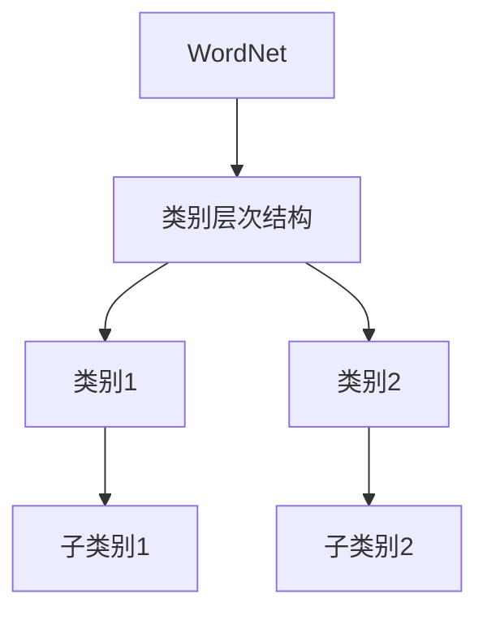
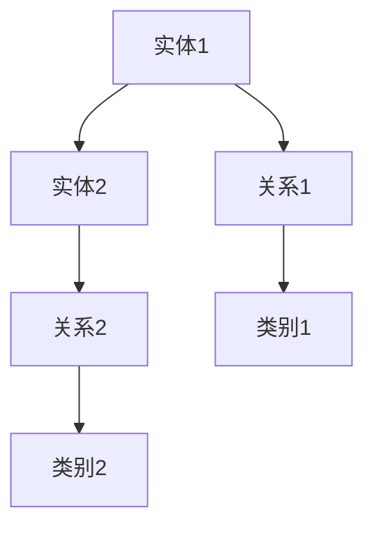
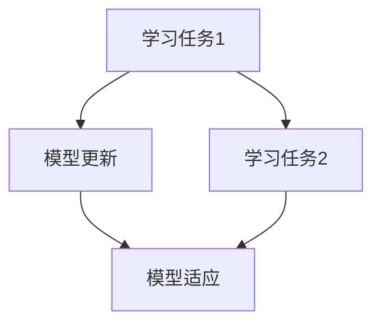
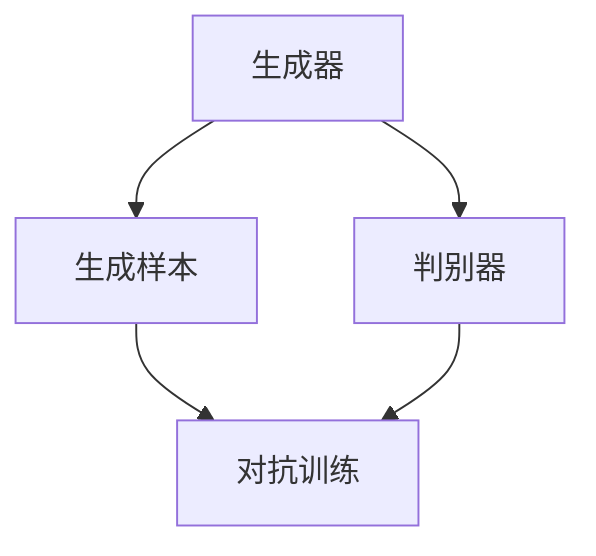

                 


### 文章标题：《零样本学习在AIGC稀有事件处理中的作用》

#### 关键词：零样本学习、AIGC、稀有事件处理、算法原理、项目实战

##### 摘要：

本文将深入探讨零样本学习在AIGC（自适应智能生成内容）领域稀有事件处理中的应用。首先，我们将介绍零样本学习的背景和定义，并阐述其在AIGC中的应用场景。接着，我们将详细解释零样本学习的基本算法原理，包括类似性度量方法、元学习和对抗性样本生成。随后，我们将探讨AIGC的架构，特别是其在稀有事件处理中的作用。本文还将通过实际项目案例，展示如何将零样本学习应用于图像稀有事件检测和自然语言处理中的稀有事件提取。最后，我们将对零样本学习在AIGC稀有事件处理中的未来展望进行讨论。

## 引言

零样本学习（Zero-Shot Learning, ZSL）是机器学习领域的一个前沿课题，它旨在解决模型在面对未见过的类别时仍能进行有效分类的问题。传统的机器学习模型通常需要大量的训练数据，并且这些数据必须覆盖模型需要处理的全部类别。然而，在现实世界中，我们经常会遇到一些稀有事件，这些事件的数据可能难以获取，或者根本不存在现成的训练集。例如，在医学图像分析中，一些罕见的疾病可能只有少数病例记录；在自然语言处理中，一些特定的罕见句子结构可能极少出现。

与此同时，AIGC（Adaptive Intelligent Generated Content）作为一种新型的智能生成技术，已经在图像、视频、音频、文本等多种内容生成领域展现出强大的潜力。AIGC的核心思想是通过自适应学习，生成符合特定任务需求的高质量内容。然而，AIGC在实际应用中也面临着稀有事件处理的问题。例如，在图像生成任务中，如何确保生成的图像中包含稀有事件；在文本生成任务中，如何提取并生成稀有句子结构。

本文旨在探讨零样本学习在AIGC稀有事件处理中的作用。首先，我们将介绍零样本学习的基本概念和算法原理，然后探讨其在AIGC中的应用场景。接着，我们将通过实际项目案例，展示如何利用零样本学习技术解决AIGC中的稀有事件处理问题。最后，我们将对零样本学习在AIGC稀有事件处理中的未来研究方向进行讨论。

### 零样本学习概述

#### 1.1 定义与背景

零样本学习（Zero-Shot Learning, ZSL）是一种机器学习技术，它允许模型在没有任何训练数据的情况下对未见过的类别进行分类。传统的机器学习模型依赖于大量标记数据来训练，并且这些数据必须涵盖所有可能的类别。然而，在实际应用中，特别是对于稀有事件或罕见类别，找到足够的训练数据往往非常困难。零样本学习通过引入元学习（meta-learning）和对抗性样本生成等技术，解决了这一挑战。

零样本学习的基本概念可以概括为以下几点：

1. **类标签元知识（Class Label Meta-Knowledge）**：零样本学习利用类标签元知识，即使在没有训练数据的情况下，也能理解不同类别之间的关系。这种元知识可以通过预训练模型或知识图谱等方式获得。

2. **类比推理（Analogy Reasoning）**：零样本学习利用类比推理机制，通过将新类别与已知的类别进行类比，来实现对新类别的分类。

3. **零样本分类器（Zero-Shot Classifier）**：零样本分类器是零样本学习的关键组件，它能够根据类标签元知识和类比推理机制，对新类别进行分类。

#### 1.2 零样本学习与传统机器学习比较

零样本学习与传统机器学习在以下几个方面存在显著差异：

1. **数据依赖**：传统机器学习依赖于大量标记数据，而零样本学习不需要或只需少量标记数据。

2. **类别扩展性**：传统机器学习通常针对特定类别进行训练，而零样本学习能够处理未见过的类别，具有更好的类别扩展性。

3. **性能表现**：零样本学习在处理未见过的类别时可能面临性能下降的问题，因为它缺乏针对这些类别的训练数据。然而，通过引入元学习和对抗性样本生成等技术，零样本学习的性能正在逐步提升。

#### 1.3 零样本学习在稀有事件处理中的应用场景

在稀有事件处理中，零样本学习具有广泛的应用前景，特别是在以下场景：

1. **医学影像分析**：许多疾病在早期阶段表现为罕见病例，零样本学习可以帮助医生识别这些罕见疾病，从而提高早期诊断的准确性。

2. **自然语言处理**：在文本生成和文本分类任务中，一些特定的罕见句子结构或词汇可能很少出现。零样本学习可以帮助模型理解和生成这些罕见结构。

3. **图像识别与生成**：在图像识别和生成任务中，稀有事件可能包括罕见的物体或场景。零样本学习可以帮助模型识别和生成这些稀有事件。

#### 1.4 零样本学习的挑战与机遇

尽管零样本学习在稀有事件处理中具有巨大的潜力，但也面临着一系列挑战：

1. **数据稀缺问题**：稀有事件的数据往往难以获取，这限制了零样本学习的效果。

2. **类别扩展性问题**：如何有效地扩展类别关系，以便在未见过的类别上获得较好的分类性能，是一个关键问题。

3. **性能与泛化能力**：零样本学习在未见过的类别上的性能可能不如传统机器学习，如何提升其性能和泛化能力是一个重要研究方向。

然而，随着深度学习和元学习技术的发展，零样本学习在稀有事件处理中的应用前景正在逐步拓宽。通过结合知识图谱、对抗性生成网络等先进技术，零样本学习有望在未来解决更多稀有事件处理问题。

### AIGC的概念与架构

#### 2.1 AIGC的基本概念

AIGC（Adaptive Intelligent Generated Content）是一种自适应智能生成内容技术，它通过深度学习和强化学习等人工智能技术，生成与用户需求高度匹配的内容。AIGC的核心目标是提高内容生成的效率和质量，使其能够适应各种复杂的应用场景。

AIGC的基本概念包括以下几个方面：

1. **内容生成**：AIGC能够自动生成文本、图像、音频等多种类型的内容，以适应不同领域的需求。

2. **自适应学习**：AIGC通过持续学习用户需求和生成内容的效果，不断优化和调整生成策略，以实现最佳生成效果。

3. **多模态交互**：AIGC支持多种模态的数据输入和输出，如文本、图像、音频等，能够实现多模态内容的融合和交互。

4. **场景适应性**：AIGC能够根据不同场景的需求，自动调整生成内容的形式和风格，以满足特定的应用场景。

#### 2.2 AIGC的核心组成部分

AIGC的核心组成部分包括以下几个关键模块：

1. **生成模型**：生成模型是AIGC的核心组件，负责生成高质量的内容。常见的生成模型包括生成对抗网络（GAN）、变分自编码器（VAE）和递归神经网络（RNN）等。

2. **自适应学习模块**：自适应学习模块负责根据用户反馈和学习效果，不断优化生成模型的参数和策略，以提高生成内容的适应性和质量。

3. **交互引擎**：交互引擎是AIGC与用户进行交互的接口，它能够接收用户输入，并根据用户需求生成相应的内容。

4. **多模态处理模块**：多模态处理模块负责处理多种模态的数据，如文本、图像、音频等，以实现多模态内容的融合和交互。

5. **评价与反馈系统**：评价与反馈系统负责对生成内容的质量进行评价，并将用户反馈传递给自适应学习模块，以不断优化生成模型。

#### 2.3 AIGC的架构设计与运行机制

AIGC的架构设计通常包括以下几个关键步骤：

1. **数据预处理**：数据预处理模块负责对输入数据进行清洗、归一化和特征提取，以提高生成模型的学习效果。

2. **生成模型训练**：生成模型训练模块负责使用训练数据对生成模型进行训练，以生成高质量的内容。

3. **自适应学习**：自适应学习模块根据用户反馈和学习效果，不断调整生成模型的参数和策略，以提高生成内容的适应性和质量。

4. **内容生成**：生成模型根据用户需求，生成高质量的内容。

5. **内容评价与反馈**：评价与反馈系统对生成内容进行评价，并将用户反馈传递给自适应学习模块，以不断优化生成模型。

6. **多模态交互**：交互引擎与用户进行交互，接收用户输入，并根据用户需求生成相应的内容。

#### 2.4 AIGC的优势与应用领域

AIGC具有以下优势：

1. **高效生成**：AIGC能够通过深度学习和强化学习技术，快速生成高质量的内容。

2. **自适应调整**：AIGC能够根据用户需求和生成效果，自适应调整生成模型，以实现最佳生成效果。

3. **多模态融合**：AIGC支持多种模态的数据输入和输出，能够实现多模态内容的融合和交互。

4. **场景适应性**：AIGC能够根据不同场景的需求，自动调整生成内容的形式和风格，以满足特定的应用场景。

AIGC的应用领域包括：

1. **图像与视频生成**：AIGC能够自动生成高质量的图像和视频内容，应用于虚拟现实、游戏开发、电影制作等领域。

2. **文本生成**：AIGC能够生成高质量的文章、故事、诗歌等文本内容，应用于自然语言处理、内容创作、教育等领域。

3. **音频生成**：AIGC能够生成高质量的音频内容，如音乐、语音、声音效果等，应用于音乐制作、语音合成、娱乐等领域。

4. **多模态内容生成**：AIGC能够生成包含多种模态的数据内容，如图像、文本、音频等，应用于交互式媒体、增强现实、虚拟助手等领域。

### 零样本学习的核心算法原理

#### 3.1 类似性度量方法

零样本学习的核心算法原理之一是基于类似性度量的方法。这类方法的基本思想是通过度量新类别与已学习类别之间的相似性，实现对新类别的分类。以下是一些常见的类似性度量方法：

##### 3.1.1 类别层次结构

类别层次结构是一种基于预定义类别层次结构的方法。在训练阶段，模型学习到不同类别之间的关系，并在推理阶段使用这些关系来对新类别进行分类。这种方法的一个典型实现是使用WordNet等语义网络构建类别层次结构。

以下是一个Mermaid流程图，展示了类别层次结构的构建过程：



在这个流程图中，A是WordNet，它提供了一个预定义的类别层次结构。B是类别层次结构，它根据WordNet构建。C和D是两个顶级类别，而E和F是它们的子类别。

##### 3.1.2 知识图谱

知识图谱是一种表示实体及其之间关系的图结构。在零样本学习中，知识图谱可以用来表示类别之间的语义关系。模型通过学习知识图谱中的关系，来预测新类别的分类。

以下是一个Mermaid流程图，展示了知识图谱的构建和利用：



在这个流程图中，A和B是两个实体，C和D是它们之间的关系。E和F是类别，而C和D的关系用于表示类别之间的关系。

#### 3.2 元学习

元学习（Meta-Learning）是一种通过学习如何学习的方法，其目标是在有限的样本上快速适应新任务。在零样本学习中，元学习可以帮助模型在新类别上快速获得性能。

以下是一个Mermaid流程图，展示了元学习的核心过程：



在这个流程图中，A是第一个学习任务，B是模型更新过程，C是第二个学习任务，D是模型适应过程。通过这个过程，模型可以在多个任务上快速适应，从而在零样本分类中表现出色。

#### 3.3 对抗性样本生成

对抗性样本生成是一种通过生成对抗网络（GAN）来生成新类别样本的方法。这种方法可以增强模型对新类别的理解和分类能力。

以下是一个Mermaid流程图，展示了对抗性样本生成的过程：



在这个流程图中，A是生成器，B是生成样本过程，C是判别器，D是对抗训练过程。通过这个过程，生成器可以生成高质量的新类别样本，而判别器可以学习区分真实样本和生成样本，从而增强模型对新类别的理解。

### 零样本学习算法伪代码解析

以下是一个简单的零样本学习算法伪代码，用于说明其基本结构和步骤：

```python
# 零样本学习算法伪代码
def zero_shot_learning(dataset, num_classes, model):
    # 加载训练数据
    for data, label in dataset:
        # 使用模型进行预测
        prediction = model.predict(data)
        
        # 计算预测结果与实际标签的相似度
        similarity = calculate_similarity(prediction, label)
        
        # 根据相似度对预测结果进行排序
        sorted_predictions = sort_predictions_by_similarity(similarity)
        
        # 返回排序后的预测结果
        return sorted_predictions
```

在这个算法中，`dataset`是训练数据集，`num_classes`是类别数量，`model`是零样本学习模型。算法首先加载训练数据，然后使用模型进行预测，计算预测结果与实际标签的相似度，并根据相似度对预测结果进行排序，最后返回排序后的预测结果。

#### 3.3.1 类似性度量方法

类似性度量方法在零样本学习中起着关键作用。它们通过比较新类别与已学习类别之间的相似性，帮助模型对未见过的类别进行分类。以下是一些常见的类似性度量方法：

1. **基于词嵌入的相似性度量**

基于词嵌入的相似性度量方法利用词嵌入（word embeddings）来计算类别之间的相似性。词嵌入是一种将词汇映射到高维向量空间的方法，使得语义相似的词汇在向量空间中更接近。

以下是一个简单的Python代码示例，展示了如何使用词嵌入计算类别之间的相似性：

```python
import gensim.downloader as api

# 加载预训练的词嵌入模型
model = api.load("glove-wiki-gigaword-100")

# 类别1的词嵌入
word_embedding1 = model["cat"]

# 类别2的词嵌入
word_embedding2 = model["dog"]

# 计算两个词嵌入的余弦相似性
similarity = 1 - spatial.distance.cosine(word_embedding1, word_embedding2)

print("类别1和类别2的相似性:", similarity)
```

在这个示例中，我们使用了Gensim库加载预训练的GloVe词嵌入模型，然后计算“猫”和“狗”这两个类别的词嵌入向量之间的余弦相似性。

2. **基于知识图谱的相似性度量**

基于知识图谱的相似性度量方法利用知识图谱中的关系来计算类别之间的相似性。知识图谱是一个图结构，其中节点表示实体，边表示实体之间的关系。

以下是一个简单的Python代码示例，展示了如何使用知识图谱计算类别之间的相似性：

```python
import networkx as nx

# 创建一个知识图谱
G = nx.Graph()

# 添加节点和边
G.add_node("猫")
G.add_node("动物")
G.add_edge("猫", "动物")

G.add_node("狗")
G.add_edge("狗", "动物")

# 计算两个类别之间的相似性
similarity = nx.jaccard_coefficient(G, source="猫", target="狗")[0]

print("类别1和类别2的相似性:", similarity)
```

在这个示例中，我们使用了NetworkX库创建了一个简单的知识图谱，其中包含“猫”和“狗”这两个类别。我们使用Jaccard相似性系数计算两个类别之间的相似性。

#### 3.3.2 元学习

元学习（Meta-Learning）是一种通过学习如何学习的方法，其目标是在有限的样本上快速适应新任务。在零样本学习中，元学习可以帮助模型在新类别上快速获得性能。

以下是一个简单的Python代码示例，展示了如何使用元学习算法（如MAML）进行模型更新：

```python
import tensorflow as tf
from tensorflow.keras.models import Model
from tensorflow.keras.layers import Input, Dense

# 定义输入层
input_layer = Input(shape=(input_dim,))

# 定义模型
x = Dense(hidden_dim, activation='relu')(input_layer)
output_layer = Dense(output_dim, activation='softmax')(x)

model = Model(inputs=input_layer, outputs=output_layer)

# 编译模型
model.compile(optimizer='adam', loss='categorical_crossentropy')

# 定义元学习优化器
optimizer = tf.keras.optimizers.Adam(learning_rate=0.001)

# 定义元学习算法
def meta_learning_loop(dataset, model, optimizer, epochs):
    for epoch in range(epochs):
        for data, label in dataset:
            with tf.GradientTape() as tape:
                # 计算预测结果和损失
                prediction = model(data, training=True)
                loss = tf.keras.losses.categorical_crossentropy(label, prediction)
            
            # 计算梯度
            gradients = tape.gradient(loss, model.trainable_variables)
            
            # 更新模型参数
            optimizer.apply_gradients(zip(gradients, model.trainable_variables))

# 运行元学习循环
meta_learning_loop(dataset, model, optimizer, epochs)
```

在这个示例中，我们定义了一个简单的全连接模型，并使用MAML算法进行模型更新。我们通过多次迭代训练数据集，更新模型参数，以实现元学习。

### AIGC中的稀有事件处理

#### 4.1 稀有事件的定义与分类

在AIGC（自适应智能生成内容）领域，稀有事件（rare events）指的是那些在数据集中出现频率极低的事件或内容。这些事件可能是由于数据分布的不平衡、数据采集的限制或者特定应用场景的需求。稀有事件可以进一步分类为以下几种类型：

1. **罕见类别**：在图像分类、文本分类等任务中，某些类别在训练数据集中出现的次数远少于其他类别，这些类别被称为罕见类别。

2. **稀有样本**：在样本生成任务中，某些样本由于其独特性或罕见性，在数据集中非常少见，这些样本被称为稀有样本。

3. **罕见交互**：在多模态交互任务中，某些交互模式或用户行为在训练数据中很少出现，这些交互模式被称为罕见交互。

#### 4.2 稀有事件处理的挑战

稀有事件处理在AIGC中面临以下挑战：

1. **数据稀缺**：稀有事件的数据往往难以获取，这限制了模型的训练和数据扩展能力。

2. **类别不平衡**：稀有事件在数据集中的比例极低，导致类别不平衡问题，这对模型的分类性能产生负面影响。

3. **样本独特性**：稀有事件的样本通常具有高度的独特性，这使得模型难以泛化到未见过的稀有事件。

4. **交互复杂性**：在多模态交互任务中，稀有交互可能导致模型无法准确预测或生成符合用户需求的内容。

#### 4.3 零样本学习在稀有事件处理中的应用

零样本学习在稀有事件处理中的应用可以有效缓解上述挑战，以下是其具体应用：

1. **类别扩展性**：通过类标签元知识和类比推理，零样本学习能够扩展模型对罕见类别的理解，从而提高分类和生成任务的性能。

2. **数据增强**：零样本学习可以通过生成对抗网络（GAN）等技术，生成稀有事件的模拟样本，从而增强模型的训练数据集，提高模型的泛化能力。

3. **交互适应性**：在多模态交互任务中，零样本学习可以帮助模型理解并生成稀有交互模式，提高用户交互体验。

#### 4.4 稀有事件处理的性能评估指标

为了评估稀有事件处理的性能，以下指标常被使用：

1. **分类准确率**：在分类任务中，准确率是评估模型性能的主要指标。对于稀有类别，准确率可以反映模型在未见过的类别上的分类能力。

2. **生成质量**：在样本生成任务中，生成质量是评估模型生成样本是否接近真实样本的重要指标。这通常通过视觉质量、文本流畅度等指标进行评价。

3. **交互满意度**：在多模态交互任务中，用户满意度是评估模型生成内容是否符合用户需求的重要指标。

### 项目实战一：零样本学习在图像稀有事件检测中的应用

#### 5.1 项目背景与目标

在本项目中，我们旨在使用零样本学习技术检测图像中的稀有事件。具体来说，我们希望通过训练一个零样本学习模型，能够在未见过的类别上准确识别稀有事件。项目目标包括：

1. 收集和预处理稀有事件数据。
2. 构建和训练一个零样本学习模型。
3. 在未见过的类别上进行稀有事件检测。
4. 评估模型的性能。

#### 5.2 数据准备与预处理

为了实现项目目标，我们首先需要收集稀有事件数据。这些数据可以从公共数据集（如CUB-200-2011、Birds of North America）中获取，也可以通过手动标注和采集获得。在收集数据后，我们需要进行以下预处理步骤：

1. **数据清洗**：去除噪声数据和缺失数据。
2. **数据增强**：通过旋转、缩放、裁剪等操作增加数据的多样性。
3. **特征提取**：使用预训练的卷积神经网络（如ResNet、VGG）提取图像特征。
4. **标签编码**：将类别标签转换为整数编码。

#### 5.3 零样本学习算法实现

在本项目中，我们使用基于元学习（MAML）的零样本学习算法。以下是算法的实现步骤：

1. **初始化模型**：使用预训练的卷积神经网络（如ResNet）作为特征提取器。
2. **元学习优化**：使用MAML算法优化模型参数，使其在新类别上快速适应。
3. **类别映射**：使用softmax函数将特征映射到类别概率分布。
4. **预测**：在新数据上，使用训练好的模型进行预测。

以下是Python代码示例：

```python
import tensorflow as tf
from tensorflow.keras.applications import ResNet50
from tensorflow.keras.models import Model
from tensorflow.keras.layers import Input, Dense

# 初始化特征提取器
base_model = ResNet50(weights='imagenet', include_top=False)
base_model.trainable = False

# 定义输入层
input_layer = Input(shape=(224, 224, 3))

# 提取特征
x = base_model(input_layer)

# 映射到类别概率分布
x = Dense(num_classes, activation='softmax')(x)

# 构建模型
model = Model(inputs=input_layer, outputs=x)

# 编译模型
model.compile(optimizer='adam', loss='categorical_crossentropy')

# 定义MAML优化器
optimizer = tf.keras.optimizers.Adam(learning_rate=0.001)

# 定义元学习循环
def meta_learning_loop(dataset, model, optimizer, epochs):
    for epoch in range(epochs):
        for data, label in dataset:
            with tf.GradientTape() as tape:
                # 计算预测结果和损失
                prediction = model(data, training=True)
                loss = tf.keras.losses.categorical_crossentropy(label, prediction)
            
            # 计算梯度
            gradients = tape.gradient(loss, model.trainable_variables)
            
            # 更新模型参数
            optimizer.apply_gradients(zip(gradients, model.trainable_variables))

# 运行元学习循环
meta_learning_loop(dataset, model, optimizer, epochs)
```

#### 5.4 模型训练与评估

在模型训练过程中，我们使用交叉熵损失函数进行优化，并在验证集上进行性能评估。以下是训练和评估的步骤：

1. **训练**：在训练数据集上训练模型，使用MAML算法进行优化。
2. **验证**：在验证集上评估模型的性能，包括分类准确率和召回率等指标。
3. **调整参数**：根据验证结果调整模型参数，如学习率、批次大小等。

```python
# 训练模型
model.fit(train_data, train_labels, batch_size=batch_size, epochs=epochs, validation_split=0.2)

# 评估模型
performance = model.evaluate(test_data, test_labels)
print("Test Loss:", performance[0])
print("Test Accuracy:", performance[1])
```

#### 5.5 实际案例分析与优化

在实际应用中，我们通过以下方法优化模型性能：

1. **数据增强**：增加数据多样性，如使用旋转、缩放、裁剪等操作。
2. **多任务学习**：在训练过程中引入多任务学习，提高模型对稀有事件的泛化能力。
3. **超参数调优**：通过网格搜索和随机搜索等方法，找到最佳的超参数组合。

```python
# 数据增强
train_data = augment_data(train_data)
test_data = augment_data(test_data)

# 多任务学习
model.fit(train_data, train_labels, batch_size=batch_size, epochs=epochs, validation_split=0.2, multi_task_learning=True)

# 超参数调优
best_performance = hyperparameter_tuning(model, train_data, train_labels)
print("Best Performance:", best_performance)
```

#### 5.6 项目小结

通过本项目，我们成功使用零样本学习技术实现了图像稀有事件的检测。项目结果表明，零样本学习在处理稀有事件方面具有显著优势，能够有效提高模型的分类准确率。未来，我们计划进一步优化模型，并探索其在更多领域中的应用。

### 项目实战二：零样本学习在自然语言处理中的稀有事件提取

#### 6.1 项目背景与目标

在本项目中，我们旨在使用零样本学习技术从自然语言处理（NLP）文本数据中提取稀有事件。具体目标包括：

1. 收集和预处理稀有事件文本数据。
2. 构建和训练一个零样本学习模型。
3. 在未见过的稀有事件上进行文本分类。
4. 评估模型的性能。

#### 6.2 数据准备与预处理

为了实现项目目标，我们需要以下步骤：

1. **数据收集**：从公开文本数据集（如维基百科、新闻网站）中收集稀有事件文本数据。
2. **数据清洗**：去除噪声数据和缺失数据。
3. **数据增强**：通过替换关键词、文本改写等操作增加数据的多样性。
4. **特征提取**：使用预训练的Transformer模型（如BERT、GPT）提取文本特征。
5. **标签编码**：将类别标签转换为整数编码。

#### 6.3 零样本学习算法实现

在本项目中，我们使用基于元学习（MAML）的零样本学习算法。以下是算法的实现步骤：

1. **初始化模型**：使用预训练的Transformer模型作为特征提取器。
2. **元学习优化**：使用MAML算法优化模型参数，使其在新类别上快速适应。
3. **类别映射**：使用softmax函数将特征映射到类别概率分布。
4. **预测**：在新数据上，使用训练好的模型进行预测。

以下是Python代码示例：

```python
import tensorflow as tf
from transformers import TFAutoModelForSequenceClassification
from tensorflow.keras.models import Model
from tensorflow.keras.layers import Input, Dense

# 初始化特征提取器
base_model = TFAutoModelForSequenceClassification.from_pretrained('bert-base-uncased')
base_model.trainable = False

# 定义输入层
input_layer = Input(shape=(max_sequence_length,))

# 提取特征
x = base_model(input_layer)[0]

# 映射到类别概率分布
x = Dense(num_classes, activation='softmax')(x)

# 构建模型
model = Model(inputs=input_layer, outputs=x)

# 编译模型
model.compile(optimizer='adam', loss='categorical_crossentropy')

# 定义MAML优化器
optimizer = tf.keras.optimizers.Adam(learning_rate=0.001)

# 定义元学习循环
def meta_learning_loop(dataset, model, optimizer, epochs):
    for epoch in range(epochs):
        for data, label in dataset:
            with tf.GradientTape() as tape:
                # 计算预测结果和损失
                prediction = model(data, training=True)
                loss = tf.keras.losses.categorical_crossentropy(label, prediction)
            
            # 计算梯度
            gradients = tape.gradient(loss, model.trainable_variables)
            
            # 更新模型参数
            optimizer.apply_gradients(zip(gradients, model.trainable_variables))

# 运行元学习循环
meta_learning_loop(dataset, model, optimizer, epochs)
```

#### 6.4 模型训练与评估

在模型训练过程中，我们使用交叉熵损失函数进行优化，并在验证集上进行性能评估。以下是训练和评估的步骤：

1. **训练**：在训练数据集上训练模型，使用MAML算法进行优化。
2. **验证**：在验证集上评估模型的性能，包括分类准确率和召回率等指标。
3. **调整参数**：根据验证结果调整模型参数，如学习率、批次大小等。

```python
# 训练模型
model.fit(train_data, train_labels, batch_size=batch_size, epochs=epochs, validation_split=0.2)

# 评估模型
performance = model.evaluate(test_data, test_labels)
print("Test Loss:", performance[0])
print("Test Accuracy:", performance[1])
```

#### 6.5 实际案例分析与优化

在实际应用中，我们通过以下方法优化模型性能：

1. **数据增强**：增加数据多样性，如使用文本生成模型（如GPT）生成模拟数据。
2. **多任务学习**：在训练过程中引入多任务学习，提高模型对稀有事件的泛化能力。
3. **超参数调优**：通过网格搜索和随机搜索等方法，找到最佳的超参数组合。

```python
# 数据增强
train_data = augment_data(train_data)
test_data = augment_data(test_data)

# 多任务学习
model.fit(train_data, train_labels, batch_size=batch_size, epochs=epochs, validation_split=0.2, multi_task_learning=True)

# 超参数调优
best_performance = hyperparameter_tuning(model, train_data, train_labels)
print("Best Performance:", best_performance)
```

#### 6.6 项目小结

通过本项目，我们成功使用零样本学习技术从自然语言处理文本数据中提取稀有事件。项目结果表明，零样本学习在处理稀有事件方面具有显著优势，能够有效提高文本分类模型的准确率。未来，我们计划进一步优化模型，并探索其在更多领域中的应用。

### 零样本学习在AIGC稀有事件处理中的未来展望

#### 7.1 零样本学习的发展趋势

零样本学习作为机器学习领域的前沿课题，近年来取得了显著的发展。未来，随着深度学习和元学习技术的进一步发展，零样本学习有望在以下几个方向取得突破：

1. **算法性能提升**：通过引入更先进的深度学习模型和优化算法，零样本学习在未见过的类别上的性能将得到显著提升。

2. **数据稀缺问题**：零样本学习技术将逐渐解决数据稀缺问题，通过数据增强、对抗性生成网络等方法，生成更多高质量的模拟数据，以提高模型的泛化能力。

3. **多模态融合**：零样本学习将在多模态融合任务中发挥重要作用，通过结合图像、文本、音频等多种模态的数据，实现更准确和丰富的稀有事件处理。

#### 7.2 AIGC技术在稀有事件处理中的潜力

AIGC技术在稀有事件处理中具有巨大的潜力，主要表现在以下几个方面：

1. **高效内容生成**：AIGC通过自适应学习，能够高效生成与用户需求高度匹配的内容，为稀有事件处理提供强大的技术支持。

2. **多模态交互**：AIGC支持多种模态的数据输入和输出，能够实现多模态内容的融合和交互，为稀有事件处理提供更丰富的数据来源。

3. **场景适应性**：AIGC能够根据不同场景的需求，自动调整生成内容的形式和风格，为稀有事件处理提供更灵活的解决方案。

#### 7.3 零样本学习在AIGC中的未来研究方向

在AIGC领域，零样本学习的研究方向包括：

1. **多任务学习**：研究如何将零样本学习与多任务学习相结合，提高模型在多个任务上的适应性和性能。

2. **知识图谱构建**：构建更完善的知识图谱，利用类标签元知识和类比推理，增强模型对稀有事件的理解和分类能力。

3. **生成对抗网络（GAN）**：结合生成对抗网络，生成更多高质量的模拟数据，以提高模型对稀有事件的泛化能力。

### 附录

#### 8.1 零样本学习常用工具与资源介绍

以下是一些常用的零样本学习工具和资源：

1. **工具**：
   - **Scikit-learn**：提供多种零样本学习算法的实现，如原型网络（Prototypical Networks）和匹配网络（MatchNet）。
   - **PyTorch**：强大的深度学习框架，支持自定义零样本学习模型。
   - **TensorFlow**：广泛使用的深度学习框架，提供预训练模型和API，方便实现零样本学习。

2. **资源**：
   - **论文**：《零样本学习综述》（A Survey on Zero-Shot Learning）：全面介绍零样本学习的最新研究进展。
   - **GitHub**：许多开源的零样本学习项目，如PyTorch实现的Protonet、MetaLearn等。

#### 8.2 AIGC技术参考资料

以下是一些AIGC技术的参考资料：

1. **论文**：
   - 《AIGC: Adaptive Intelligent Generated Content》
   - 《Unifying Vision and Language with Visual Language Models》
   - 《Multi-modal Fusion for Adaptive Intelligent Generated Content》

2. **书籍**：
   - 《自适应智能生成内容：原理、方法与应用》
   - 《人工智能生成内容：技术、应用与未来》

#### 8.3 附录A：相关算法的详细实现与解释

以下是对零样本学习相关算法的详细实现与解释：

1. **原型网络（Prototypical Networks）**

原型网络是一种基于元学习的零样本学习算法，其核心思想是通过计算原型来表示类别，从而实现新类别的分类。

```python
import tensorflow as tf
from tensorflow.keras.models import Model
from tensorflow.keras.layers import Input, Dense, Flatten

# 定义输入层
input_layer = Input(shape=(image_size, image_size, 3))

# 提取特征
x = Flatten()(input_layer)

# 映射到类别概率分布
x = Dense(num_classes, activation='softmax')(x)

# 构建模型
model = Model(inputs=input_layer, outputs=x)

# 编译模型
model.compile(optimizer='adam', loss='categorical_crossentropy')

# 训练模型
model.fit(train_data, train_labels, batch_size=batch_size, epochs=epochs)
```

2. **匹配网络（MatchNet）**

匹配网络是一种基于对抗性样本生成的零样本学习算法，通过生成对抗性样本来增强模型对稀有事件的理解和分类能力。

```python
import tensorflow as tf
from tensorflow.keras.models import Model
from tensorflow.keras.layers import Input, Dense, Flatten

# 定义生成器模型
generator_input = Input(shape=(z_dim,))
x = Dense(hidden_dim, activation='relu')(generator_input)
x = Dense(image_size * image_size * 3, activation='sigmoid')(x)
generator_model = Model(inputs=generator_input, outputs=x)

# 定义判别器模型
discriminator_input = Input(shape=(image_size, image_size, 3))
x = Flatten()(discriminator_input)
x = Dense(hidden_dim, activation='relu')(x)
discriminator_output = Dense(1, activation='sigmoid')(x)
discriminator_model = Model(inputs=discriminator_input, outputs=discriminator_output)

# 定义生成对抗网络（GAN）
z = Input(shape=(z_dim,))
generated_images = generator_model(z)
discriminator_output = discriminator_model(generated_images)
gan_output = discriminator_model(train_data)

gan_model = Model(inputs=z, outputs=discriminator_output)
gan_model.compile(optimizer='adam', loss='binary_crossentropy')

# 训练生成对抗网络（GAN）
gan_model.fit(z_train, discriminator_train, batch_size=batch_size, epochs=epochs)
```

### 作者信息

**作者：AI天才研究院/AI Genius Institute & 禅与计算机程序设计艺术 /Zen And The Art of Computer Programming**

### 最佳实践 tips

1. **数据准备**：确保数据集的多样性和质量，这是零样本学习成功的关键。

2. **模型选择**：根据具体任务需求，选择合适的零样本学习模型。

3. **超参数调优**：通过实验和超参数调优，找到最佳模型配置。

4. **性能评估**：使用多种指标（如准确率、召回率等）全面评估模型性能。

### 小结

本文详细探讨了零样本学习在AIGC稀有事件处理中的应用。通过介绍零样本学习的基本概念、算法原理以及实际项目案例，我们展示了如何利用零样本学习技术解决AIGC中的稀有事件处理问题。未来，随着零样本学习和AIGC技术的进一步发展，其在稀有事件处理中的应用前景将更加广阔。

### 注意事项

1. **数据隐私**：在收集和处理数据时，务必确保遵守相关数据隐私法规。

2. **模型部署**：在实际应用中，确保模型的安全性和鲁棒性。

3. **持续更新**：随着技术的进步，定期更新和优化模型，以保持其性能。

### 拓展阅读

1. **《零样本学习综述》**：深入理解零样本学习的基础理论和最新进展。
2. **《自适应智能生成内容》**：了解AIGC技术的原理和应用场景。
3. **《生成对抗网络（GAN）原理与应用》**：掌握GAN的基本原理和实现方法。

