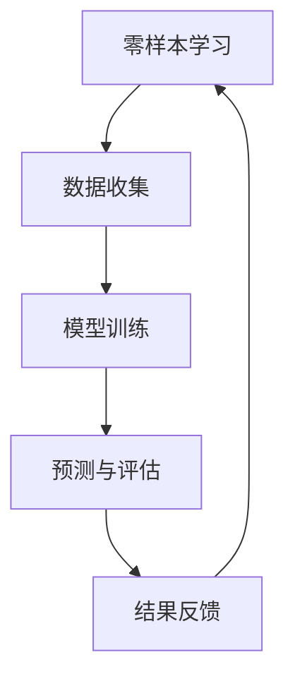

                 

### 第一步：确定核心章节

在撰写《零样本学习在AI生态系统模拟中的创新》这篇文章时，我们需要首先确定核心章节，这些章节应该能够全面而深入地探讨零样本学习在AI生态系统模拟中的应用和未来发展趋势。以下是可能的核心章节及其简要说明：

1. **零样本学习的定义和背景**
   - 简介零样本学习的起源和发展历程。
   - 阐述零样本学习的基本概念，包括其与有监督学习和无监督学习的区别。

2. **零样本学习的关键概念**
   - 讨论类别不平衡与数据增强技术。
   - 探讨超参数调优与模型选择的重要性。

3. **零样本学习的算法**
   - 介绍几种主要的零样本学习算法，如Adversarial Training、Meta-Learning和GANs。
   - 分析每种算法的原理，并提供伪代码和数学模型。

4. **零样本学习在AI生态系统模拟中的应用**
   - 探讨零样本学习在图像识别、自然语言处理和推荐系统中的应用。
   - 提供具体的应用案例，详细分析其实际应用效果。

5. **零样本学习的未来发展趋势**
   - 分析零样本学习在AI生态系统模拟中的潜在发展方向。
   - 讨论当前的研究挑战和未来的研究方向。

### 第二步：细化章节内容

在每个核心章节中，我们需要进一步细化内容，以确保每个部分都能够提供丰富的信息和详细的解释。以下是每个章节的细化内容：

#### 第1章 零样本学习的定义和背景
- **1.1 零样本学习的基本概念**
  - 定义零样本学习，并与其他机器学习类型进行比较。

- **1.2 零样本学习的应用场景**
  - 讨论零样本学习在现实世界中的应用场景，如自动驾驶和医疗诊断。

- **1.3 零样本学习在AI生态系统中的重要性**
  - 阐述零样本学习在AI生态系统中的关键角色和贡献。

- **1.4 Mermaid流程图：零样本学习的基本流程**
  - 使用Mermaid创建流程图，展示零样本学习的基本流程。

#### 第2章 零样本学习的关键概念
- **2.1 类别不平衡与数据增强**
  - 分析类别不平衡的问题，介绍数据增强技术的原理和策略。

- **2.2 超参数调优与模型选择**
  - 讨论超参数调优的方法，介绍如何选择适合的模型。

- **2.3 零样本学习算法的分类**
  - 分类讨论不同的零样本学习算法，包括基于模型的和无模型的算法。

- **2.4 Mermaid流程图：关键概念关系图**
  - 使用Mermaid创建关系图，展示关键概念之间的关系。

#### 第3章 零样本学习的算法
- **3.1 Adversarial Training算法**
  - 详细解释Adversarial Training算法的原理，提供伪代码和数学模型。

- **3.2 Meta-Learning算法**
  - 解释Meta-Learning算法的原理，提供伪代码和数学模型。

- **3.3 Generative Adversarial Networks (GANs)算法**
  - 解释GANs算法的原理，提供伪代码和数学模型。

#### 第4章 零样本学习在AI生态系统模拟中的应用
- **4.1 零样本学习在图像识别中的应用**
  - 讨论零样本学习在图像识别中的应用，提供具体案例。

- **4.2 零样本学习在自然语言处理中的应用**
  - 讨论零样本学习在自然语言处理中的应用，提供具体案例。

- **4.3 零样本学习在推荐系统中的应用**
  - 讨论零样本学习在推荐系统中的应用，提供具体案例。

#### 第5章 零样本学习的未来发展趋势
- **5.1 技术挑战和未来研究方向**
  - 分析零样本学习在AI生态系统模拟中的技术挑战。

- **5.2 应用场景拓展**
  - 探讨零样本学习在未来可能的应用场景。

- **5.3 跨学科研究**
  - 讨论零样本学习与其他学科的交叉研究。

### 第三步：设计流程图

在每个章节中，设计一个或多个Mermaid流程图，用于展示关键概念或算法的流程。以下是可能的流程图示例：



### 第四步：编写数学模型和公式

在每个章节中，根据需要添加数学模型和公式，使用LaTeX格式进行展示。以下是可能的LaTeX公式示例：

```latex
$$
J(\theta) = \frac{1}{m} \sum_{i=1}^{m} (-y^{(i)} \log(a^{(i)}_y) + (1 - y^{(i)} \log(1 - a^{(i)}_y))
$$
```

### 第五步：编写项目实战案例

在每个章节中，根据需要添加一个或多个项目实战案例，详细解释代码实现和解读。以下是可能的代码示例：

```python
import tensorflow as tf
from tensorflow.keras.models import Sequential
from tensorflow.keras.layers import Dense, Activation

# 构建模型
model = Sequential()
model.add(Dense(64, input_dim=784, activation='relu'))
model.add(Dense(10, activation='softmax'))

# 编译模型
model.compile(optimizer='adam', loss='categorical_crossentropy', metrics=['accuracy'])

# 训练模型
model.fit(x_train, y_train, epochs=10, batch_size=32)

# 评估模型
loss, accuracy = model.evaluate(x_test, y_test)
print(f"Test accuracy: {accuracy:.2f}")
```

### 第六步：整理和校对

在完成所有内容的撰写后，需要整理和校对文章，确保目录大纲的逻辑清晰，内容完整，无遗漏。以下是可能的校对步骤：

1. 检查所有引用的公式和代码是否正确。
2. 检查所有段落和章节是否连贯。
3. 检查文章的格式和排版是否符合要求。
4. 邀请同行或同事进行审阅，提供反馈。

### 最终输出目录大纲

根据上述步骤，我们得到以下目录大纲：

# 《零样本学习在AI生态系统模拟中的创新》目录大纲

## 第1章 零样本学习的定义和背景
### 1.1 零样本学习的基本概念
### 1.2 零样本学习的应用场景
### 1.3 零样本学习在AI生态系统中的重要性
### 1.4 Mermaid流程图：零样本学习的基本流程

## 第2章 零样本学习的关键概念
### 2.1 类别不平衡与数据增强
### 2.2 超参数调优与模型选择
### 2.3 零样本学习算法的分类
### 2.4 Mermaid流程图：关键概念关系图

## 第3章 零样本学习的算法
### 3.1 Adversarial Training算法
#### 3.1.1 算法原理
#### 3.1.2 伪代码实现
#### 3.1.3 数学模型和公式
#### 3.1.4 实际案例解析
### 3.2 Meta-Learning算法
#### 3.2.1 算法原理
#### 3.2.2 伪代码实现
#### 3.2.3 数学模型和公式
#### 3.2.4 实际案例解析
### 3.3 Generative Adversarial Networks (GANs)算法
#### 3.3.1 算法原理
#### 3.3.2 伪代码实现
#### 3.3.3 数学模型和公式
#### 3.3.4 实际案例解析

## 第4章 零样本学习在AI生态系统模拟中的应用
### 4.1 零样本学习在图像识别中的应用
#### 4.1.1 应用案例
#### 4.1.2 实现细节
#### 4.1.3 分析与评估
### 4.2 零样本学习在自然语言处理中的应用
#### 4.2.1 应用案例
#### 4.2.2 实现细节
#### 4.2.3 分析与评估
### 4.3 零样本学习在推荐系统中的应用
#### 4.3.1 应用案例
#### 4.3.2 实现细节
#### 4.3.3 分析与评估

## 第5章 零样本学习的未来发展趋势
### 5.1 技术挑战和未来研究方向
### 5.2 应用场景拓展
### 5.3 跨学科研究

## 附录
### 附录A 零样本学习工具和资源
### 附录B 代码实现示例

通过上述步骤，我们确保了文章的内容逻辑清晰、结构紧凑，同时涵盖了零样本学习在AI生态系统模拟中的创新和应用。接下来，我们将逐步撰写每个章节的内容，以完成整篇文章的撰写。

