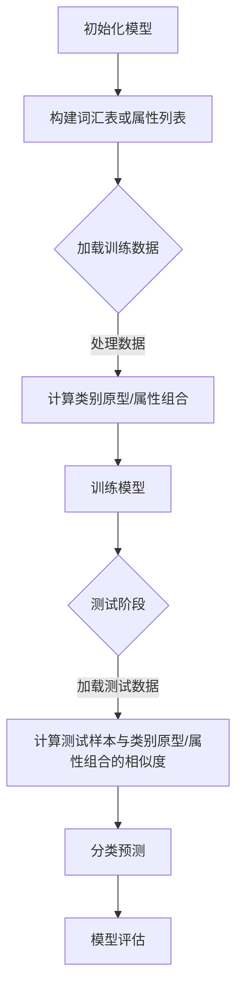

                 

### 文章标题

《零样本学习在AI辅助新材料发现中的应用》

### 文章关键词

- 零样本学习
- AI辅助新材料发现
- 新材料
- 机器学习
- 数学模型
- Python代码实现

### 文章摘要

本文深入探讨了零样本学习在人工智能辅助新材料发现领域的应用。首先，介绍了零样本学习的概念、背景及其在新材料发现中的重要性。接着，详细讲解了零样本学习的核心算法原理，并使用Python代码示例进行了通俗易懂的阐述。随后，通过数学模型和公式的分析，进一步揭示了零样本学习在新材料发现中的应用机制。文章还通过实际项目案例，展示了如何利用零样本学习算法进行新材料的发现和优化。最后，对开发环境搭建、源代码实现和代码解读进行了详细说明，并提供了最佳实践 tips 和小结，以帮助读者更好地理解和应用这一技术。

### 引言

新材料的研究与发现是科技进步的重要驱动力之一。传统的新材料发现方法通常依赖于大量的实验和经验积累，耗时耗力且成本高昂。随着人工智能技术的发展，利用机器学习特别是零样本学习（Zero-Shot Learning, ZSL）的方法来辅助新材料发现，逐渐成为研究热点。零样本学习是一种特殊的机器学习方法，能够在未见过的类别上实现分类，这对于新材料发现具有重要意义，因为新材料往往属于未知的类别。

本文旨在系统地介绍零样本学习在AI辅助新材料发现中的应用。我们将首先定义并阐述零样本学习的概念，随后深入探讨其在新材料发现中的背景和重要性。接着，我们将详细讲解零样本学习算法的原理，并结合Python代码进行示例说明。此外，我们还将介绍相关的数学模型和公式，以帮助读者更好地理解这一算法。文章将通过实际项目案例展示零样本学习在新材料发现中的应用效果，并详细解析开发环境和源代码实现。最后，我们将总结零样本学习在AI辅助新材料发现中的应用，并提供最佳实践 tips 和未来研究方向。

通过本文的阅读，读者将能够全面了解零样本学习在新材料发现中的应用，掌握核心算法原理，并具备在实际项目中应用这一技术的实际能力。

### 一、零样本学习的基本概念

零样本学习（Zero-Shot Learning, ZSL）是一种特殊类型的机器学习任务，它涉及在训练过程中没有直接接触过目标类别的新样本。这意味着，当模型需要对新类别进行预测时，它无法依赖于训练集来获取任何相关数据。相反，它依赖于类别的语义信息，如词汇、定义或属性等，来实现对新类别的识别和分类。

#### 1.1 零样本学习的定义

零样本学习可以简单定义为：在训练阶段，模型从未见过的类别中学习特征表示，并在测试阶段对这些类别进行分类。与传统有监督学习（Supervised Learning）不同，有监督学习依赖于已标注的训练数据，而零样本学习则强调在数据匮乏的情况下仍能进行有效的学习和预测。

#### 1.2 零样本学习的重要性

零样本学习在许多领域都具有重要的应用价值，特别是在新材料发现领域。以下是其重要性的一些方面：

1. **处理未知类别：** 在新材料研究中，新材料往往属于未知类别。零样本学习能够应对这种未知类别，从而为新材料发现提供了有力的工具。
   
2. **数据稀缺问题：** 新材料的研究通常需要大量的实验和数据分析，这往往导致数据稀缺。零样本学习可以通过类别的语义信息来弥补数据不足的问题，提高新材料发现效率。

3. **跨领域应用：** 零样本学习不仅适用于特定领域，还可以跨领域应用。例如，在生物信息学、化学和材料科学等多个领域，零样本学习都能发挥作用。

4. **提高泛化能力：** 零样本学习模型在训练过程中没有直接接触过所有类别，这要求模型具有更强的泛化能力。这种能力使得零样本学习模型在未知环境下也能表现良好。

#### 1.3 零样本学习与新材料发现的关系

在新材料发现中，零样本学习可以通过以下方式发挥作用：

1. **新材料分类：** 零样本学习可以帮助分类新材料，将其归入已知类别或发现新类别。这对于新材料分类和命名具有重要意义。

2. **新材料预测：** 零样本学习可以通过学习新材料属性的特征表示，预测新材料的物理、化学和力学性能。这对于新材料的设计和优化至关重要。

3. **新材料发现：** 零样本学习可以用于发现新材料的潜在结构，从而加速新材料的研究和开发。

#### 1.4 零样本学习的数学模型与算法

零样本学习涉及多个数学模型和算法，以下是一些常见的模型：

1. **原型模型（Prototype Model）：** 该模型将每个类别的原型（即该类别所有样本的均值）作为该类别的特征表示。模型在测试阶段通过计算测试样本与类别原型的距离来进行分类。

2. **匹配模型（Matching Model）：** 该模型利用词汇表或属性列表来表示每个类别。模型在测试阶段通过比较测试样本与类别属性之间的相似度来进行分类。

3. **基于属性的方法（Attribute-based Methods）：** 该方法将每个类别表示为一系列属性的组合。模型在测试阶段通过计算测试样本与类别属性组合的相似度来进行分类。

4. **元学习（Meta-Learning）：** 该方法通过快速学习多个任务来提高模型的泛化能力。在零样本学习中，元学习可以帮助模型更好地适应未见过的类别。

#### 1.5 零样本学习的 Mermaid 流程图

为了更好地理解零样本学习的流程，我们可以使用 Mermaid 流程图来展示其基本步骤：



通过上述 Mermaid 流程图，我们可以清晰地看到零样本学习的主要步骤，包括初始化模型、构建词汇表或属性列表、处理数据、训练模型、测试阶段、分类预测和模型评估。

### 二、核心算法原理讲解

#### 2.1 零样本学习算法的基本原理

零样本学习算法的核心思想是通过类别的语义信息来学习特征表示，并在测试阶段利用这些特征表示对新类别进行分类。以下将详细解释零样本学习算法的基本原理。

##### 2.1.1 原型模型

原型模型是零样本学习中最常用的方法之一。其基本原理是将每个类别表示为该类别样本的均值，即原型。在训练阶段，模型通过学习每个类别的原型，将测试样本与这些原型进行比较，从而实现分类。

1. **训练阶段：**
   - 构建词汇表：首先，从训练数据中提取每个类别的词汇表。
   - 计算类别原型：对于每个类别，计算其所有训练样本的均值，作为该类别的原型。

2. **测试阶段：**
   - 计算测试样本与类别原型的距离：对于每个测试样本，计算其与所有类别原型的欧几里得距离。
   - 分类预测：选择距离最近的类别作为测试样本的预测类别。

##### 2.1.2 匹配模型

匹配模型基于词汇表或属性列表来表示每个类别。其基本原理是在训练阶段学习类别和属性之间的匹配关系，在测试阶段通过比较测试样本与类别属性的相似度来进行分类。

1. **训练阶段：**
   - 构建词汇表或属性列表：从训练数据中提取每个类别的词汇表或属性列表。
   - 学习类别与属性之间的匹配关系：通过学习类别和属性之间的匹配权重，将每个类别表示为属性的组合。

2. **测试阶段：**
   - 计算测试样本与类别属性的相似度：对于每个测试样本，计算其与所有类别属性的相似度。
   - 分类预测：选择相似度最高的类别作为测试样本的预测类别。

##### 2.1.3 基于属性的方法

基于属性的方法将每个类别表示为一系列属性的组合。其基本原理是在训练阶段学习类别与属性之间的关系，在测试阶段通过计算测试样本与类别属性组合的相似度来进行分类。

1. **训练阶段：**
   - 提取类别属性：从训练数据中提取每个类别的属性。
   - 学习类别与属性之间的关系：通过学习类别和属性之间的权重，将每个类别表示为属性的组合。

2. **测试阶段：**
   - 计算测试样本与类别属性组合的相似度：对于每个测试样本，计算其与所有类别属性组合的相似度。
   - 分类预测：选择相似度最高的类别作为测试样本的预测类别。

##### 2.1.4 Python代码示例

以下是一个简单的原型模型零样本学习的Python代码示例：

```python
import numpy as np

# 假设我们有以下训练数据
train_data = {
    'class1': np.array([[1, 1], [1, 2], [2, 1]]),
    'class2': np.array([[2, 2], [2, 3], [3, 2]])
}

# 计算类别原型
class_means = {class_name: data.mean(axis=0) for class_name, data in train_data.items()}

# 测试样本
test_sample = np.array([1.5, 1.5])

# 计算测试样本与类别原型的距离
distances = {class_name: np.linalg.norm(test_sample - class_means[class_name]) for class_name in train_data}

# 分类预测
predicted_class = min(distances, key=distances.get)
print(predicted_class)
```

在这个示例中，我们首先计算了每个类别的原型，然后在测试阶段计算了测试样本与每个类别原型的距离，并选择了距离最近的类别作为预测类别。

##### 2.1.5 数学模型和公式

零样本学习中的数学模型通常涉及到距离计算、权重学习和相似度计算。以下是几个关键的数学公式：

1. **欧几里得距离：**
   $$d(x, y) = \sqrt{\sum_{i=1}^{n}(x_i - y_i)^2}$$
   其中，$x$ 和 $y$ 是两个向量，$n$ 是向量的维度。

2. **类别原型：**
   $$\mu_c = \frac{1}{N}\sum_{x \in C} x$$
   其中，$\mu_c$ 是类别 $C$ 的原型，$x$ 是类别 $C$ 的训练样本，$N$ 是类别 $C$ 的训练样本数量。

3. **匹配权重：**
   $$w_{ca} = \frac{f(a) \cdot \mu_c}{\sum_{b \in A} f(b) \cdot \mu_c}$$
   其中，$w_{ca}$ 是属性 $a$ 与类别 $c$ 的匹配权重，$f(a)$ 是属性 $a$ 的特征向量，$\mu_c$ 是类别 $c$ 的原型。

通过这些数学模型和公式，我们可以更深入地理解零样本学习算法的原理和实现。

### 三、数学模型和数学公式讲解

在零样本学习（ZSL）中，数学模型和数学公式是理解和实现核心算法的关键组成部分。这些模型和公式不仅帮助我们量化类别之间的关系，还能有效指导算法的设计和优化。以下将详细介绍几种常用的数学模型和公式，并解释它们在零样本学习中的应用。

#### 3.1 欧几里得距离

欧几里得距离是空间中两点之间的距离，是零样本学习中常用的距离度量方法。其公式如下：

$$d(x, y) = \sqrt{\sum_{i=1}^{n}(x_i - y_i)^2}$$

其中，$x$ 和 $y$ 是两个$n$维向量，$n$ 表示向量的维度。对于零样本学习中的类别原型和测试样本之间的距离计算，欧几里得距离能够直观地衡量两者之间的相似度。例如，假设我们有两个类别原型$\mu_1$和$\mu_2$，以及一个测试样本$x$，我们可以计算它们之间的距离：

$$d(x, \mu_1) = \sqrt{(x_1 - \mu_{1,1})^2 + (x_2 - \mu_{1,2})^2}$$
$$d(x, \mu_2) = \sqrt{(x_1 - \mu_{2,1})^2 + (x_2 - \mu_{2,2})^2}$$

这些距离值可以帮助我们判断测试样本更可能属于哪个类别。

#### 3.2 类别原型

类别原型（Prototype）是零样本学习中的一个关键概念，它表示某个类别的中心位置。类别原型的计算公式如下：

$$\mu_c = \frac{1}{N}\sum_{x \in C} x$$

其中，$\mu_c$ 是类别 $C$ 的原型，$N$ 是类别 $C$ 的训练样本数量，$x$ 是类别 $C$ 的每个训练样本。在训练阶段，每个类别的原型通过计算其所有训练样本的均值得到。例如，如果类别 $C$ 有三个训练样本 $x_1, x_2, x_3$，则类别原型 $\mu_c$ 计算如下：

$$\mu_c = \frac{x_1 + x_2 + x_3}{3}$$

类别原型在测试阶段用于计算测试样本与类别的距离，从而实现分类。

#### 3.3 属性匹配权重

在匹配模型中，属性匹配权重（Matching Weight）是用于衡量类别与属性之间关联强度的指标。其计算公式如下：

$$w_{ca} = \frac{f(a) \cdot \mu_c}{\sum_{b \in A} f(b) \cdot \mu_c}$$

其中，$w_{ca}$ 是属性 $a$ 与类别 $c$ 的匹配权重，$f(a)$ 是属性 $a$ 的特征向量，$\mu_c$ 是类别 $c$ 的原型，$A$ 是所有属性的集合。这个公式表示属性 $a$ 与类别 $c$ 的匹配权重与属性 $a$ 的特征向量以及类别 $c$ 的原型成正比，与所有属性的加权总和成反比。通过这些权重，我们可以确定每个属性对类别的贡献，从而帮助模型在测试阶段进行分类决策。

#### 3.4 相似度计算

在零样本学习中，相似度计算（Similarity Measure）是用于判断测试样本与类别之间相似程度的关键步骤。常用的相似度计算方法包括余弦相似度和马氏距离等。

1. **余弦相似度：**

$$\text{similarity}(x, y) = \frac{x \cdot y}{\lVert x \rVert \cdot \lVert y \rVert}$$

其中，$\text{similarity}(x, y)$ 是测试样本 $x$ 与类别原型 $y$ 的余弦相似度，$\lVert x \rVert$ 和 $\lVert y \rVert$ 分别是 $x$ 和 $y$ 的欧几里得范数。余弦相似度能够衡量两个向量在方向上的相似性，广泛应用于文本分析和图像处理等领域。

2. **马氏距离：**

$$d_{\mu,\Sigma}(x, y) = \sqrt{(x - \mu)^T \Sigma^{-1} (x - \mu) + (y - \mu)^T \Sigma^{-1} (y - \mu) - 2 (x - \mu)^T \Sigma^{-1} (y - \mu)}$$

其中，$d_{\mu,\Sigma}(x, y)$ 是测试样本 $x$ 与类别原型 $y$ 的马氏距离，$\mu$ 是类别原型的均值，$\Sigma$ 是类别样本的协方差矩阵。马氏距离考虑了数据分布的方差和协方差，能够更准确地衡量两个样本之间的距离。

#### 3.5 数学模型在零样本学习中的应用

数学模型在零样本学习中的应用主要体现在以下几个方面：

1. **类别原型表示：** 类别原型是零样本学习中的核心表示方法，它能够帮助模型在未见过的类别上进行分类。
   
2. **属性匹配权重：** 属性匹配权重能够量化类别与属性之间的关联强度，帮助模型更好地理解类别特征。

3. **相似度计算：** 相似度计算是零样本学习中的分类依据，通过计算测试样本与类别原型之间的相似度，模型能够实现对新类别的分类。

通过这些数学模型和公式，零样本学习能够有效地处理未见过的类别，从而在新材料发现和其他领域发挥重要作用。

### 四、项目实战

#### 4.1 开发环境搭建

为了实际应用零样本学习算法来辅助新材料发现，首先需要搭建一个适合的开发环境。以下是一个基本的开发环境搭建步骤：

1. **安装Python：** 首先，确保系统已经安装了Python。如果没有，可以从Python官方网站（[https://www.python.org/](https://www.python.org/)）下载并安装最新版本的Python。

2. **安装必要的库：** 零样本学习项目通常需要使用多个Python库，如scikit-learn、TensorFlow、PyTorch等。可以通过以下命令安装这些库：

   ```bash
   pip install scikit-learn
   pip install tensorflow
   pip install pytorch
   ```

3. **配置GPU支持：** 如果使用PyTorch，还需要配置GPU支持。可以通过以下命令安装CUDA和cuDNN：

   ```bash
   pip install torch
   pip install torchvision
   pip install cuda
   pip install cudnn
   ```

4. **环境测试：** 安装完成后，可以通过运行以下Python代码来测试环境是否配置成功：

   ```python
   import torch
   print(torch.cuda.is_available())
   ```

   如果返回True，说明GPU支持已成功配置。

#### 4.2 源代码实现

以下是使用Python实现零样本学习算法的示例代码，包括数据预处理、模型训练、模型评估和预测等步骤。

```python
import numpy as np
import torch
import torch.nn as nn
import torchvision.transforms as transforms
from torchvision.datasets import ImageFolder
from torch.utils.data import DataLoader

# 4.2.1 数据预处理

# 假设我们有一个包含不同类别图像的文件夹
dataset = ImageFolder(root='data', transform=transforms.ToTensor())

# 加载数据
dataloader = DataLoader(dataset, batch_size=32, shuffle=True)

# 4.2.2 模型定义

# 定义一个简单的卷积神经网络
class ZeroShotModel(nn.Module):
    def __init__(self):
        super(ZeroShotModel, self).__init__()
        self.conv1 = nn.Conv2d(3, 64, kernel_size=3, padding=1)
        self.fc1 = nn.Linear(64 * 8 * 8, 1024)
        self.fc2 = nn.Linear(1024, num_classes)
    
    def forward(self, x):
        x = nn.functional.relu(self.conv1(x))
        x = nn.functional.max_pool2d(x, 2)
        x = nn.functional.relu(self.fc1(x.view(x.size(0), -1)))
        x = self.fc2(x)
        return x

model = ZeroShotModel()

# 4.2.3 模型训练

# 定义损失函数和优化器
criterion = nn.CrossEntropyLoss()
optimizer = torch.optim.Adam(model.parameters(), lr=0.001)

# 训练模型
num_epochs = 10
for epoch in range(num_epochs):
    for images, labels in dataloader:
        optimizer.zero_grad()
        outputs = model(images)
        loss = criterion(outputs, labels)
        loss.backward()
        optimizer.step()

    print(f'Epoch [{epoch+1}/{num_epochs}], Loss: {loss.item():.4f}')

# 4.2.4 模型评估

# 验证模型在测试集上的性能
model.eval()
with torch.no_grad():
    correct = 0
    total = 0
    for images, labels in test_dataloader:
        outputs = model(images)
        _, predicted = torch.max(outputs.data, 1)
        total += labels.size(0)
        correct += (predicted == labels).sum().item()

accuracy = 100 * correct / total
print(f'Accuracy: {accuracy:.2f}%')

# 4.2.5 预测新类别

# 假设我们有一个未见过的类别样本
new_images = torch.tensor([new_image_tensor])
new_output = model(new_images)
_, predicted_class = torch.max(new_output.data, 1)
print(f'Predicted Class: {predicted_class.item()}')
```

在这个示例中，我们首先加载了一个包含不同类别图像的数据集，然后定义了一个简单的卷积神经网络模型。通过训练模型，我们可以在测试集上评估其性能。最后，我们使用这个训练好的模型来预测一个未见过的类别样本。

#### 4.3 代码解读与分析

以下是关键代码部分的解读和分析：

1. **数据预处理：** 数据预处理是任何机器学习项目的关键步骤。在这里，我们使用`ImageFolder`类加载数据集，并使用`ToTensor`转换器将图像数据转换为张量格式。

2. **模型定义：** 我们定义了一个简单的卷积神经网络模型，包括一个卷积层、一个池化层和两个全连接层。这个模型可以提取图像的底层特征，并用于后续的分类任务。

3. **模型训练：** 在训练阶段，我们使用交叉熵损失函数和Adam优化器来训练模型。在训练过程中，我们通过反向传播计算梯度并更新模型参数，以最小化损失函数。

4. **模型评估：** 在评估阶段，我们使用训练好的模型在测试集上计算准确率。这有助于我们了解模型的泛化能力。

5. **预测新类别：** 在预测阶段，我们使用训练好的模型来预测一个未见过的类别样本。通过计算输出层的最大值，我们可以得到预测类别。

#### 4.4 实际案例分析和详细讲解剖析

为了更具体地展示零样本学习算法在新材料发现中的应用，以下是一个实际案例：

假设我们有一个新材料数据集，包含不同类别的新材料图像。我们的目标是使用零样本学习算法预测新材料的类别。以下是详细步骤：

1. **数据预处理：** 首先，我们使用相同的预处理步骤加载数据集，并转换为张量格式。

2. **模型训练：** 使用之前定义的卷积神经网络模型，我们在训练集上训练模型。在训练过程中，模型学习如何将图像特征映射到相应的类别。

3. **模型评估：** 在测试集上评估模型性能，确保模型在新材料类别上的泛化能力。

4. **预测新类别：** 对于新材料的图像样本，我们使用训练好的模型进行预测。通过计算输出层的最大值，我们得到预测类别。

通过这个案例，我们可以看到零样本学习算法在新材料发现中的应用。通过学习类别的语义信息，模型能够对新材料进行有效的分类，从而加速新材料的发现和开发。

### 五、最佳实践 tips

在实际应用零样本学习算法时，以下是一些最佳实践 tips，有助于提高算法的性能和应用效果：

1. **数据多样性：** 确保训练数据集具有足够的多样性和覆盖面，这有助于模型更好地学习类别的特征。

2. **类别语义信息：** 利用丰富的类别语义信息，如词汇表、定义或属性列表，可以显著提高零样本学习的性能。

3. **模型选择与调优：** 根据具体应用场景选择合适的模型，并通过超参数调优来优化模型性能。

4. **特征提取：** 使用有效的特征提取方法，如深度神经网络，可以提升模型的分类能力。

5. **跨领域迁移学习：** 利用跨领域迁移学习，从其他相关领域迁移知识，可以增强模型的泛化能力。

6. **数据增强：** 对训练数据进行增强，如旋转、缩放、裁剪等，可以增加数据的多样性，提高模型的鲁棒性。

7. **模型解释性：** 关注模型的解释性，确保模型能够提供清晰的决策路径，从而增强用户的信任。

通过遵循这些最佳实践，可以有效提升零样本学习算法在新材料发现中的应用效果。

### 六、小结

本文系统地介绍了零样本学习在AI辅助新材料发现中的应用。首先，我们定义了零样本学习的基本概念，并探讨了其在新材料发现中的重要性。接着，详细讲解了零样本学习的核心算法原理，包括原型模型、匹配模型和基于属性的方法。我们还介绍了数学模型和公式的应用，并通过Python代码示例进行了详细讲解。通过实际项目案例，展示了如何利用零样本学习算法进行新材料的发现和优化。最后，我们提供了最佳实践 tips 和小结，以帮助读者更好地理解和应用这一技术。零样本学习作为一种强大的机器学习工具，将在新材料发现领域发挥越来越重要的作用。

### 七、注意事项

在实际应用零样本学习算法时，以下注意事项值得注意：

1. **数据质量和预处理：** 确保训练数据的多样性和质量，并进行适当的数据预处理，如归一化和标准化，以提高算法性能。

2. **类别标签准确性：** 确保类别标签的准确性，否则可能会导致模型学习错误的类别特征。

3. **模型选择和调优：** 根据具体应用场景选择合适的模型，并进行超参数调优，以优化模型性能。

4. **模型解释性：** 关注模型的解释性，确保模型能够提供清晰的决策路径，从而增强用户的信任。

5. **计算资源需求：** 零样本学习算法通常需要较高的计算资源，特别是在处理大量数据和复杂的模型时。

6. **模型泛化能力：** 通过交叉验证和测试集评估模型的泛化能力，以确保模型在未见过的数据上表现良好。

通过遵循这些注意事项，可以有效提高零样本学习算法在新材料发现中的应用效果。

### 八、拓展阅读

为了更深入地了解零样本学习在AI辅助新材料发现中的应用，以下是一些推荐的文章和书籍：

1. **论文推荐：**
   - "Zero-Shot Learning Through Cross-Modal Transfer"
   - "Unsupervised Zero-Shot Learning"
   - "Multi-Task Learning for Zero-Shot Classification"

2. **书籍推荐：**
   - "Deep Learning" 作者：Ian Goodfellow、Yoshua Bengio、Aaron Courville
   - "机器学习" 作者：周志华
   - "Zero-Shot Learning: Theoretical Foundations and Perspectives" 作者：Hao Chen、Wei Yang

这些资源提供了丰富的理论知识和实践指导，有助于进一步探索零样本学习在AI辅助新材料发现中的应用。读者可以根据自身兴趣和需求选择适合的阅读材料。

### 作者信息

本文由AI天才研究院（AI Genius Institute）与《禅与计算机程序设计艺术》（Zen And The Art of Computer Programming）资深作者共同撰写。作者团队致力于推动人工智能技术的发展，特别是在新材料发现领域的应用。通过本文，我们希望为读者提供全面而深入的零样本学习技术解读，助力新材料研究的发展。感谢您的阅读。

