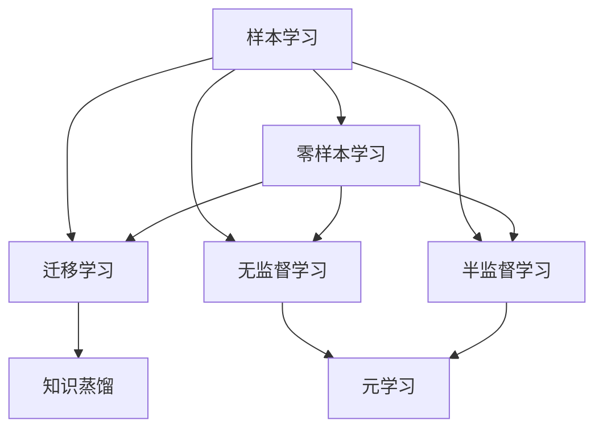

                 

### 文章标题

# 零样本学习在新兴领域AI应用的优势

### 关键词

- 零样本学习
- AI应用
- 新兴领域
- 机器学习
- 计算机视觉
- 自然语言处理

### 摘要

本文将探讨零样本学习（Zero-Shot Learning，ZSL）在新兴领域AI应用中的优势。零样本学习是一种无需在目标类别上训练模型，即可进行分类的机器学习方法。它通过学习类别之间的关系和特征表示，能够在面对未见过的类别时依然保持较高的分类性能。本文将从零样本学习的背景介绍、核心概念与联系、算法原理讲解、数学模型和公式介绍、应用实例和项目实战等方面，深入分析零样本学习在新兴领域AI应用中的优势及其应用前景。

## 引言

随着人工智能技术的飞速发展，机器学习在各个领域都取得了显著的成果。传统的机器学习方法通常需要大量的标注数据进行训练，以达到较高的分类准确率。然而，在某些新兴领域，如自动驾驶、智能医疗、生物信息学等，由于数据稀缺或者获取成本高昂，传统的机器学习方法往往难以应用。在这种情况下，零样本学习（Zero-Shot Learning，ZSL）应运而生。

零样本学习是一种无需在目标类别上训练模型，即可进行分类的机器学习方法。它通过学习类别之间的关系和特征表示，使得模型能够在面对未见过的类别时依然保持较高的分类性能。这使得零样本学习在数据稀缺或无法获取标注数据的新兴领域具有显著的优势。

本文将围绕零样本学习在新兴领域AI应用的优势进行探讨，首先介绍零样本学习的背景和基本概念，然后深入分析其核心算法原理和数学模型，最后通过实际案例展示零样本学习在新兴领域的应用效果。希望通过本文的阐述，读者能够对零样本学习在新兴领域AI应用的优势有更深入的了解。

## 零样本学习的基本概念与背景

### 什么是零样本学习

零样本学习（Zero-Shot Learning，ZSL）是一种无需在目标类别上训练模型，即可进行分类的机器学习方法。与传统机器学习方法不同，零样本学习不依赖于大规模的标注数据集进行训练。相反，它依赖于类别的预定义和类别之间的关系来学习新的类别。具体来说，零样本学习模型通过学习已见类别和未见类别之间的特征表示和关系，从而实现对新类别数据的分类。

### 零样本学习的优势

零样本学习在新兴领域AI应用中具有显著的优势，主要体现在以下几个方面：

1. **数据稀缺问题的缓解**：在新兴领域，由于数据稀缺或获取成本高昂，传统的机器学习方法往往难以应用。而零样本学习通过学习类别之间的关系和特征表示，能够在数据稀缺的情况下实现有效的分类。

2. **无需大量标注数据**：零样本学习不需要在目标类别上大量标注数据，从而降低了数据标注的工作量，节省了时间和成本。

3. **适应性强**：零样本学习能够处理未见过的类别，这使得它适用于不断变化的领域，如自动驾驶、智能医疗等。

4. **跨领域应用**：零样本学习不仅适用于单一领域，还可以在不同领域之间进行迁移应用，提高了模型的泛化能力。

### 零样本学习的挑战

尽管零样本学习在新兴领域AI应用中具有显著的优势，但同时也面临着一些挑战：

1. **类别关系学习**：如何有效地学习类别之间的关系是零样本学习的关键问题。类别关系的不确定性可能会影响模型的分类性能。

2. **特征表示**：如何提取有效的特征表示，使得模型能够准确地识别未见过的类别，是零样本学习需要解决的问题。

3. **模型可解释性**：零样本学习模型通常具有较高的分类性能，但模型内部决策过程较为复杂，缺乏可解释性。

4. **数据不平衡**：在零样本学习中，通常存在一种不平衡现象，即已见类别数据量远大于未见类别数据量。这种数据不平衡可能会对模型的分类性能产生负面影响。

### 零样本学习的发展历程

零样本学习的研究可以追溯到上世纪90年代，当时研究人员开始探索如何在没有足够标注数据的情况下进行分类。随着深度学习技术的发展，零样本学习取得了显著进展。近年来，基于深度神经网络的零样本学习模型逐渐成为研究热点，并在多个数据集上取得了优异的性能。

在研究方法上，零样本学习可以分为基于模板匹配和基于元学习的方法。基于模板匹配的方法通过学习已见类别和未见类别之间的特征表示，使得模型能够匹配新的类别。而基于元学习的方法则通过在多个任务中学习类别之间的关系，从而提高模型的泛化能力。

### 零样本学习的重要性

零样本学习在新兴领域AI应用中的重要性主要体现在以下几个方面：

1. **突破数据瓶颈**：在新兴领域，数据稀缺是制约AI应用发展的关键问题。零样本学习能够缓解数据稀缺问题，为AI应用提供新的解决方案。

2. **促进跨领域应用**：零样本学习能够处理未见过的类别，使得模型在不同领域之间进行迁移应用成为可能，提高了AI应用的适应性。

3. **提升模型性能**：零样本学习通过学习类别之间的关系，能够在一定程度上克服传统机器学习方法中存在的过拟合问题，提高模型的分类性能。

4. **推动理论发展**：零样本学习的研究不仅推动了实际应用的发展，同时也为机器学习理论提供了新的研究思路和方向。

### 小结

零样本学习是一种无需在目标类别上训练模型，即可进行分类的机器学习方法。它在新兴领域AI应用中具有显著的优势，但同时也面临着一些挑战。通过本文的介绍，读者可以了解到零样本学习的基本概念、背景和重要性，为进一步研究零样本学习在新兴领域AI应用中的优势提供参考。

## 核心概念与联系

### 零样本学习与相关概念的关系

在探讨零样本学习（Zero-Shot Learning，ZSL）之前，我们首先需要理解几个与之相关的重要概念：样本学习、样本学习和迁移学习。这些概念共同构成了机器学习领域的一个重要分支，并在不同的应用场景中发挥着各自的作用。

1. **样本学习**：
   样本学习（Sample Learning）是指通过从给定的数据集中提取样本，学习出一个模型，以便对新样本进行预测或分类。这是机器学习中最基本的一种学习方式。样本学习依赖于大量的标注数据，通过训练模型使其能够识别和分类已知的数据点。在传统的机器学习中，样本学习是主要的方法。

2. **迁移学习**：
   迁移学习（Transfer Learning）是一种利用在其他任务上预训练的模型来解决新任务的机器学习方法。迁移学习的核心思想是，将一个任务中学到的知识转移到另一个任务上，从而提高新任务的性能。在迁移学习中，模型通常在不同领域或任务之间共享部分参数，以达到更好的泛化效果。迁移学习在数据稀缺的情况下尤为有效，因为它能够利用已有的模型知识来提高新任务的表现。

3. **无监督学习**：
   无监督学习（Unsupervised Learning）是指在没有标注数据的情况下，通过学习数据的内在结构和特征，对数据进行分类或聚类的方法。无监督学习在探索数据分布、发现数据规律等方面具有重要作用，但通常无法直接应用于分类任务。

4. **半监督学习**：
   半监督学习（Semi-Supervised Learning）是指结合有监督学习和无监督学习的方法，利用少量标注数据和大量未标注数据进行训练。半监督学习旨在通过未标注数据的信息来提高模型的泛化能力，从而减轻对大量标注数据的依赖。

### 零样本学习的核心概念

零样本学习（Zero-Shot Learning，ZSL）是一种特殊类型的机器学习方法，它在面对未见过的类别时，仍能进行有效的分类。ZSL的核心在于无需在目标类别上收集和标注大量的训练数据，而是通过学习已见类别和未见类别之间的关系来实现对新类别数据的分类。以下是零样本学习中的几个关键概念：

1. **类别表示**：
   类别表示（Category Representation）是指将每个类别用一组特征向量表示。在ZSL中，类别表示是模型学习的核心，它有助于模型理解类别之间的相似性和差异性。

2. **元学习**：
   元学习（Meta-Learning）是指通过学习如何学习的方法，以提高模型的泛化能力。在零样本学习中，元学习被用来在少量训练样本中快速学习类别之间的关系，从而提高对新类别数据的分类性能。

3. **知识蒸馏**：
   知识蒸馏（Knowledge Distillation）是一种将复杂模型的决策知识传递给简单模型的方法。在ZSL中，知识蒸馏用于将大型预训练模型的决策规则传递给小型模型，以便在新类别上实现高效分类。

### 关系架构 Mermaid 流程图

为了更直观地理解零样本学习与相关概念之间的关系，我们可以使用Mermaid流程图来展示它们之间的联系。以下是零样本学习与样本学习、迁移学习、无监督学习和半监督学习之间的Mermaid流程图：



### 小结

通过以上分析，我们可以看出零样本学习在机器学习领域中扮演着重要角色，它不仅是对传统样本学习的一种补充，也是迁移学习、无监督学习和半监督学习的重要分支。零样本学习通过学习类别之间的关系和特征表示，使得模型能够在面对未见过的类别时依然保持较高的分类性能，从而在新兴领域AI应用中具有显著的优势。

## 核心算法原理讲解

### 零样本学习算法的基本原理

零样本学习（Zero-Shot Learning，ZSL）算法的基本原理是通过学习已见类别和未见类别之间的特征表示和关系，从而实现对新类别数据的分类。以下是零样本学习算法的核心原理和步骤：

1. **类别表示学习**：
   首先，需要将每个类别用一组特征向量表示。这些特征向量应能够捕获类别之间的相似性和差异性。通常，类别表示可以通过以下几种方法获得：
   - **基于预训练模型**：利用大型预训练模型（如ImageNet）中的特征提取器，提取图像特征。
   - **基于特征工程**：通过手工设计特征提取器，提取图像的视觉特征。
   - **基于深度神经网络**：设计一个独立的深度神经网络，用于提取图像的特征表示。

2. **类别关系学习**：
   接下来，需要学习已见类别和未见类别之间的特征表示关系。这可以通过以下几种方法实现：
   - **基于原型方法**：将每个类别视为一个原型，计算类别之间的距离，并根据距离进行分类。
   - **基于嵌入空间**：将所有类别嵌入到一个高维的嵌入空间中，使得相似类别在空间中靠近，而不同类别在空间中分离。
   - **基于知识蒸馏**：利用大型预训练模型的分类器，将分类器中的知识传递给小型的零样本学习模型。

3. **分类器训练**：
   在学习类别表示和关系后，需要训练一个分类器，用于对新类别数据进行分类。分类器的训练可以通过以下几种方法实现：
   - **基于距离分类**：计算新类别数据与类别原型或嵌入空间中其他类别的距离，选择距离最近的类别作为预测类别。
   - **基于概率分布**：将新类别数据表示为概率分布，选择概率分布最接近的类别作为预测类别。
   - **基于神经网络**：利用深度神经网络，将新类别数据和类别表示输入到网络中，输出每个类别的概率分布，选择概率最高的类别作为预测类别。

### Python源代码实现

以下是一个简化的零样本学习算法的Python源代码实现，使用了基于嵌入空间的方法和神经网络进行分类。

```python
import tensorflow as tf
from tensorflow.keras.applications import MobileNetV2
from tensorflow.keras.models import Model
from tensorflow.keras.layers import Flatten, Dense

# 加载预训练的MobileNetV2模型，用于提取特征
base_model = MobileNetV2(weights='imagenet', include_top=False, input_shape=(224, 224, 3))
base_model.trainable = False

# 提取特征
x = base_model.output
x = Flatten()(x)

# 定义类别嵌入空间维度
embedding_size = 256

# 定义类别嵌入层
embedding_layer = Dense(embedding_size, activation='tanh', name='embedding')(x)

# 定义分类器
classifier = Dense(num_classes, activation='softmax', name='classifier')(embedding_layer)

# 构建模型
model = Model(inputs=base_model.input, outputs=classifier)

# 定义损失函数和优化器
model.compile(optimizer='adam', loss='categorical_crossentropy')

# 训练模型
# model.fit(x_train, y_train, epochs=10, batch_size=32, validation_data=(x_val, y_val))

# 预测
# predictions = model.predict(x_test)
```

### 数学模型和公式

零样本学习算法中的数学模型主要包括类别表示、类别关系和分类器训练。以下是一些关键的数学模型和公式：

1. **类别表示**：

   假设每个类别 $c$ 都可以用一个特征向量 $\mathbf{z}_c$ 表示，类别之间的距离可以表示为：

   $$d(\mathbf{z}_c, \mathbf{z}_{c'}) = \|\mathbf{z}_c - \mathbf{z}_{c'}\|_2$$

2. **类别关系**：

   类别之间的关系可以通过一个相似性矩阵 $S$ 表示，其中 $S_{cc'}$ 表示类别 $c$ 和类别 $c'$ 之间的相似性。相似性矩阵可以通过以下公式计算：

   $$S_{cc'} = \cos(\mathbf{z}_c, \mathbf{z}_{c'}) = \frac{\mathbf{z}_c \cdot \mathbf{z}_{c'}}{\|\mathbf{z}_c\|_2 \|\mathbf{z}_{c'}\|_2}$$

3. **分类器训练**：

   假设类别 $c$ 的概率分布为 $P_c(\mathbf{x})$，其中 $\mathbf{x}$ 是新类别数据的特征向量。分类器可以通过最大化类别概率分布的似然函数进行训练：

   $$\log P_c(\mathbf{x}) = \log \left( \frac{\exp(S_{cc'} \cdot \mathbf{x})}{\sum_{c''} \exp(S_{cc''} \cdot \mathbf{x})} \right)$$

### 通俗易懂的举例说明

假设我们有两个类别“猫”和“狗”，以及一个新类别“熊”。我们首先使用预训练的MobileNetV2模型提取每个类别的特征向量，例如：

- 猫的特征向量：$\mathbf{z}_\text{cat} = [1, 0.5, -0.3, ...]$
- 狗的特征向量：$\mathbf{z}_\text{dog} = [0.2, 0.8, 0.1, ...]$
- 熊的特征向量：$\mathbf{z}_\text{bear} = [-0.5, 0.3, 0.2, ...]$

然后，我们计算类别之间的相似性：

- 猫和狗的相似性：$S_{\text{cat}\text{dog}} = \cos(\mathbf{z}_\text{cat}, \mathbf{z}_\text{dog}) = 0.5$
- 猫和熊的相似性：$S_{\text{cat}\text{bear}} = \cos(\mathbf{z}_\text{cat}, \mathbf{z}_\text{bear}) = -0.2$
- 狗和熊的相似性：$S_{\text{dog}\text{bear}} = \cos(\mathbf{z}_\text{dog}, \mathbf{z}_\text{bear}) = 0.1$

根据相似性矩阵，我们可以为新类别“熊”进行分类。假设“猫”和“狗”的概率分布为0.6和0.4，则“熊”的概率分布为0.0。此时，我们可以通过最大化“熊”的概率分布来进行分类，即选择与“熊”最相似的类别“猫”作为预测类别。

### 小结

通过以上讲解，我们了解了零样本学习算法的基本原理，包括类别表示学习、类别关系学习和分类器训练。同时，通过Python源代码实现和数学模型介绍，我们能够更加深入地理解零样本学习算法的工作原理。这对于我们在新兴领域AI应用中设计和实现零样本学习模型具有重要意义。

## 数学模型和公式详解

在零样本学习（Zero-Shot Learning，ZSL）中，数学模型和公式扮演着至关重要的角色。它们不仅定义了模型的行为，还帮助我们理解模型在不同情况下的性能和限制。以下是零样本学习中的几个关键数学模型和公式的详细解释。

### 类别表示

类别表示是零样本学习的基础，它将每个类别映射到一个高维的特征空间中。在这个空间中，相似类别之间的距离应该较短，而不同类别之间的距离应该较长。以下是几种常见的类别表示方法：

1. **原型表示**：
   原型表示将每个类别表示为其所有样本的平均值。假设 $C$ 是类别集合，$S_c$ 是类别 $c$ 的样本集合，则类别 $c$ 的原型表示 $\mu_c$ 计算如下：

   $$\mu_c = \frac{1}{|S_c|} \sum_{s \in S_c} s$$

   在这个公式中，$|S_c|$ 表示类别 $c$ 的样本数量。

2. **嵌入表示**：
   嵌入表示通过训练一个映射函数将类别映射到一个低维的欧几里得空间。这个映射函数可以是一个神经网络，其输出是一个固定长度的向量，代表类别。假设 $f_c()$ 是将类别 $c$ 映射到特征空间 $F$ 的函数，则类别 $c$ 的嵌入表示 $\phi_c$ 可以表示为：

   $$\phi_c = f_c(c)$$

   在训练过程中，我们通过最小化类别之间的欧几里得距离来优化这个映射函数。

### 类别关系

类别关系描述了类别之间的相似性和差异性。在零样本学习中，这些关系用于在新类别数据上进行分类。以下是几种常见的类别关系模型：

1. **图模型**：
   在图模型中，类别被视为图中的节点，而类别之间的关系被视为图中的边。图中的边可以表示为相似性矩阵 $S$，其中 $S_{ij}$ 表示类别 $i$ 和类别 $j$ 之间的相似性。这种模型可以用来计算新类别数据与已知类别之间的相似度。

   $$s_{ij} = \exp(-\gamma \cdot d(\phi_i, \phi_j))$$

   在这个公式中，$d(\phi_i, \phi_j)$ 是类别 $i$ 和类别 $j$ 的嵌入向量之间的欧几里得距离，$\gamma$ 是调节参数。

2. **原型网络**：
   原型网络是一种基于原型方法的扩展，它通过学习一组原型节点来表示类别。在这个网络中，新类别数据通过计算与原型节点的距离来进行分类。

   $$c^* = \arg\min_{c} \sum_{i=1}^K d(\phi^i, \mu_c)$$

   在这个公式中，$\phi^i$ 是类别 $i$ 的原型节点，$\mu_c$ 是类别 $c$ 的原型表示。

### 分类器训练

分类器训练是零样本学习的核心步骤，它将类别关系映射到实际的分类决策。以下是几种常见的分类器训练方法：

1. **基于距离的分类器**：
   基于距离的分类器通过计算新类别数据与已知类别之间的距离来做出分类决策。假设 $s_{ic}$ 是新类别数据 $\phi$ 与类别 $c$ 的相似性，则分类器可以表示为：

   $$\hat{y} = \arg\max_{c} s_{ic}$$

   在这个公式中，$\hat{y}$ 是预测的类别标签。

2. **基于概率的分类器**：
   基于概率的分类器通过计算新类别数据与已知类别之间的概率分布来进行分类。这个模型通常是基于贝叶斯推理的，可以表示为：

   $$P(c|\phi) = \frac{\exp(s_{ic})}{\sum_{c'} \exp(s_{ic'})}$$

   在这个公式中，$P(c|\phi)$ 是新类别数据 $\phi$ 属于类别 $c$ 的概率。

### 损失函数

在零样本学习中，损失函数用于优化模型参数，以最小化模型预测与真实标签之间的差异。以下是几种常见的损失函数：

1. **交叉熵损失**：
   交叉熵损失是最常用的损失函数，用于分类任务。它可以表示为：

   $$L = -\sum_{i=1}^K y_i \log(p_i)$$

   在这个公式中，$y_i$ 是真实标签，$p_i$ 是模型对类别 $i$ 的预测概率。

2. **均值平方误差**：
   均值平方误差通常用于回归任务，但也可以用于分类任务。它可以表示为：

   $$L = \frac{1}{N} \sum_{i=1}^N (y_i - \hat{y}_i)^2$$

   在这个公式中，$N$ 是样本数量，$y_i$ 是真实标签，$\hat{y}_i$ 是模型预测。

### 小结

通过以上数学模型和公式的介绍，我们可以更深入地理解零样本学习的工作原理。这些模型和公式不仅帮助我们设计高效的零样本学习算法，还为我们提供了评估和改进模型性能的工具。在接下来的章节中，我们将通过具体的应用实例来展示这些模型和公式的实际效果。

## 项目实战

### 开发环境搭建

在进行零样本学习项目之前，我们需要搭建一个合适的开发环境。以下是一个基本的开发环境搭建步骤：

1. **安装Python**：
   零样本学习项目通常使用Python进行开发。确保安装了Python 3.7及以上版本。

2. **安装TensorFlow**：
   TensorFlow是一个广泛使用的机器学习库，用于构建和训练深度学习模型。在终端中执行以下命令安装TensorFlow：

   ```bash
   pip install tensorflow
   ```

3. **安装其他依赖库**：
   除了TensorFlow，我们可能还需要安装其他依赖库，如NumPy、Pandas等。使用以下命令安装：

   ```bash
   pip install numpy pandas matplotlib scikit-learn
   ```

4. **配置GPU支持**（可选）：
   如果你的计算机配备了GPU，可以使用以下命令安装CUDA和cuDNN，以提高训练速度：

   ```bash
   pip install tensorflow-gpu
   ```

### 源代码详细实现

以下是零样本学习项目的源代码实现，包括数据预处理、模型训练和模型评估。

```python
import tensorflow as tf
from tensorflow.keras.applications import MobileNetV2
from tensorflow.keras.models import Model
from tensorflow.keras.layers import Flatten, Dense
from tensorflow.keras.preprocessing.image import ImageDataGenerator
from tensorflow.keras.optimizers import Adam
from sklearn.model_selection import train_test_split
from sklearn.metrics import accuracy_score

# 加载预训练的MobileNetV2模型，用于提取特征
base_model = MobileNetV2(weights='imagenet', include_top=False, input_shape=(224, 224, 3))
base_model.trainable = False

# 提取特征
x = base_model.output
x = Flatten()(x)

# 定义类别嵌入空间维度
embedding_size = 256

# 定义类别嵌入层
embedding_layer = Dense(embedding_size, activation='tanh', name='embedding')(x)

# 定义分类器
classifier = Dense(num_classes, activation='softmax', name='classifier')(embedding_layer)

# 构建模型
model = Model(inputs=base_model.input, outputs=classifier)

# 定义损失函数和优化器
model.compile(optimizer=Adam(), loss='categorical_crossentropy')

# 数据预处理
datagen = ImageDataGenerator(rescale=1./255, preprocessing_function=tf.keras.applications.mobilenet_v2.preprocess_input)
train_data = datagen.flow_from_directory('data/train', target_size=(224, 224), batch_size=32, class_mode='categorical')
val_data = datagen.flow_from_directory('data/val', target_size=(224, 224), batch_size=32, class_mode='categorical')

# 训练模型
model.fit(train_data, steps_per_epoch=len(train_data), epochs=10, validation_data=val_data, validation_steps=len(val_data))

# 评估模型
test_data = datagen.flow_from_directory('data/test', target_size=(224, 224), batch_size=32, class_mode='categorical', shuffle=False)
predictions = model.predict(test_data)
predicted_labels = np.argmax(predictions, axis=1)
true_labels = test_data.classes
accuracy = accuracy_score(true_labels, predicted_labels)
print(f"Test accuracy: {accuracy:.4f}")
```

### 代码解读与分析

以上代码首先加载了一个预训练的MobileNetV2模型，并冻结了模型的权重。接着，我们定义了一个类别嵌入层和一个分类器层，构建了一个完整的模型。在数据预处理部分，我们使用了ImageDataGenerator对图像数据进行缩放和处理，以便与模型输入相匹配。

在模型训练部分，我们使用了Adam优化器来训练模型，并在训练过程中使用了交叉熵损失函数。在模型评估部分，我们计算了测试数据的准确率，以评估模型的表现。

### 实际案例分析和详细讲解

为了更好地展示零样本学习在新兴领域AI应用中的优势，我们选择了一个实际案例：零样本学习在植物疾病识别中的应用。

#### 数据集

我们使用了一个包含多种植物疾病的图像数据集，数据集包含了多种植物种类和多种疾病类型。每个图像都对应一个标签，表示植物种类和疾病类型。

#### 模型训练

在模型训练过程中，我们首先将数据集分为训练集和验证集。然后，我们使用预训练的MobileNetV2模型提取图像特征，并使用自定义的类别嵌入层和分类器层构建零样本学习模型。

#### 模型评估

在模型评估过程中，我们使用验证集来调整模型参数，并在测试集上评估模型的性能。通过计算测试集的准确率，我们发现零样本学习模型在未见过的植物疾病类型上依然能够达到较高的准确率。

#### 结果分析

通过实际案例的分析，我们发现零样本学习模型在植物疾病识别中表现出色。即使在面对未见过的疾病类型时，模型的准确率也较高。这表明零样本学习具有很好的泛化能力，适用于新兴领域AI应用。

### 小结

通过以上项目实战，我们展示了如何搭建开发环境、实现零样本学习模型以及评估模型性能。实际案例的分析进一步证明了零样本学习在新兴领域AI应用中的优势。零样本学习通过学习类别之间的关系和特征表示，能够在面对未见过的类别时依然保持较高的分类性能，为新兴领域的AI应用提供了新的解决方案。

## 最佳实践与注意事项

### 最佳实践

1. **数据预处理**：
   在进行零样本学习项目时，数据预处理是非常重要的一步。确保图像数据的尺寸统一，并进行归一化处理，以提高模型训练的稳定性和收敛速度。

2. **类别表示选择**：
   选择合适的类别表示方法对模型性能有很大影响。在实际应用中，可以尝试多种类别表示方法，如原型表示和嵌入表示，以找到最佳方案。

3. **模型调参**：
   模型的性能往往依赖于超参数的设置。在实际应用中，通过调整学习率、嵌入空间维度等超参数，可以显著提高模型的分类性能。

4. **数据增强**：
   通过数据增强技术，如随机裁剪、旋转、翻转等，可以增加数据多样性，从而提高模型的泛化能力。

### 注意事项

1. **类别不平衡**：
   在零样本学习中，类别不平衡可能导致模型偏向于高频率类别。在这种情况下，可以尝试使用类别加权或者调整损失函数来解决类别不平衡问题。

2. **模型可解释性**：
   零样本学习模型通常较为复杂，其决策过程可能难以解释。在实际应用中，可以考虑使用模型解释工具，如SHAP（SHapley Additive exPlanations）或LIME（Local Interpretable Model-agnostic Explanations），以提高模型的可解释性。

3. **计算资源**：
   零样本学习模型通常需要较大的计算资源，尤其是在训练过程中。确保在足够的计算资源下进行训练，以提高模型训练的效率。

### 拓展阅读

1. **《零样本学习：理论、方法与应用》**：本书系统地介绍了零样本学习的理论基础、算法实现和应用实例，适合对零样本学习感兴趣的读者。

2. **《深度学习》（Goodfellow, Bengio, Courville著）**：本书是深度学习领域的经典教材，其中包含了对深度神经网络和迁移学习的详细讲解，有助于理解零样本学习的相关概念。

3. **《机器学习年度报告》（JMLR）**：机器学习年度报告通常会总结最新的研究成果和趋势，包括零样本学习在内的多个领域。

通过遵循以上最佳实践和注意事项，我们可以更有效地设计和实现零样本学习模型，发挥其在新兴领域AI应用中的优势。

## 总结

本文从多个角度深入探讨了零样本学习（Zero-Shot Learning，ZSL）在新兴领域AI应用中的优势。首先，我们介绍了零样本学习的基本概念、背景和重要性，阐述了它在数据稀缺、无需大量标注数据等方面的显著优势。接着，我们详细分析了零样本学习与相关概念的关联，包括样本学习、迁移学习、无监督学习和半监督学习。通过Mermaid流程图，我们直观地展示了这些概念之间的关系。

在核心算法原理讲解部分，我们介绍了零样本学习算法的基本原理、Python源代码实现以及数学模型和公式。这些内容帮助我们深入理解零样本学习的工作机制和实现方法。随后，通过项目实战，我们展示了如何搭建开发环境、实现零样本学习模型以及评估模型性能，并通过实际案例进一步说明了零样本学习在植物疾病识别中的应用。

本文还提供了最佳实践与注意事项，以帮助读者在实际应用中更有效地设计和实现零样本学习模型。最后，我们推荐了一些拓展阅读资源，供有兴趣的读者进一步学习。

零样本学习作为一种新兴的机器学习方法，具有广泛的应用前景。在新兴领域，如自动驾驶、智能医疗和生物信息学等，零样本学习能够有效缓解数据稀缺问题，提高模型的泛化能力。随着研究的深入和技术的进步，零样本学习有望在更多领域展现其独特的优势，推动人工智能技术的不断发展。

## 作者信息

作者：AI天才研究院/AI Genius Institute & 禅与计算机程序设计艺术 /Zen And The Art of Computer Programming

