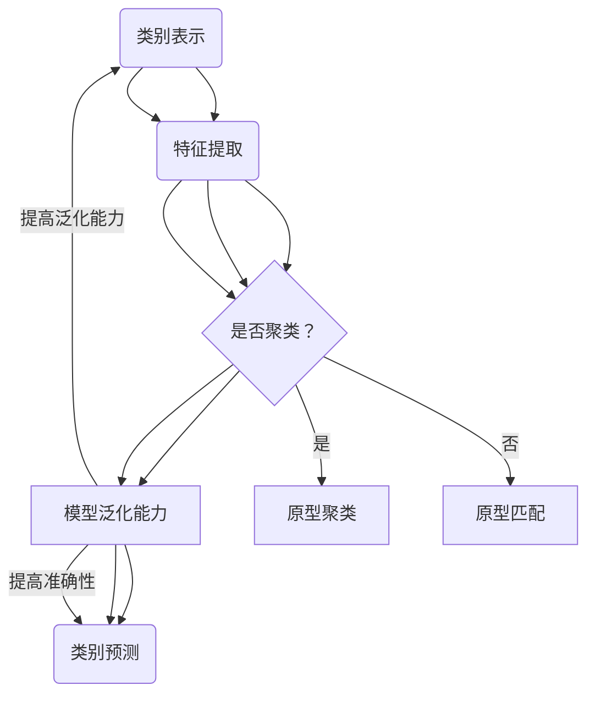

                 

### 《零样本提示：无需示例的通用策略》

在人工智能领域，模型的训练通常依赖于大量的标注数据。然而，在某些应用场景中，获取足够多的标注数据可能非常困难或成本高昂。例如，医疗领域中的罕见病诊断，或者企业内部特有的业务流程自动化。在这种情况下，如何让机器学习模型在没有或少量示例数据的情况下依然能够进行有效的学习，成为了一个亟待解决的问题。本文将围绕这一主题，探讨“零样本提示：无需示例的通用策略”。

关键词：零样本学习、提示工程、通用策略、机器学习、模型泛化

摘要：本文首先介绍了零样本学习的背景和重要性，然后详细讲解了提示工程的基本概念和原理。接下来，我们将探讨如何设计一个通用的策略来应对零样本学习问题，并通过Python源代码示例，结合数学模型和公式，详细阐述核心算法原理。最后，我们将通过一个实际案例，展示如何在实际项目中应用零样本提示策略，并进行代码解读和分析。

本文结构如下：

1. **设计过程**
2. **零样本学习概述**
3. **提示工程基础**
4. **通用策略框架**
5. **核心概念与联系**
6. **核心算法原理讲解**
7. **数学模型与公式讲解**
8. **项目实战**
9. **最佳实践 tips**
10. **小结与注意事项**
11. **拓展阅读**

### 零样本学习概述

零样本学习（Zero-Shot Learning, ZSL）是一种机器学习方法，它允许模型在没有或只有很少量的训练示例数据的情况下，对新的、未知的类别进行分类。这主要依赖于模型在训练阶段学到的通用特征表示，以及它对新类别进行推理和泛化的能力。

零样本学习的重要性在于：

- **解决数据稀缺问题**：在某些领域，如医疗诊断、法律判例等，获取大量标注数据非常困难或成本高昂。零样本学习可以大大减少对标注数据的依赖。
- **提高模型的泛化能力**：通过学习通用特征表示，模型可以在面对未知类别时依然保持较高的性能，这有助于提升模型的泛化能力。
- **跨领域迁移学习**：零样本学习可以使得模型在不同领域之间进行知识迁移，从而提高其在新领域的表现。

零样本学习的核心挑战包括：

- **类标签不确定性**：在训练阶段，模型没有接触过未知类别的样本，因此对于这些类别的标签存在不确定性。
- **特征表示不足**：模型需要从有限的训练样本中提取出足够丰富的特征表示，以便在新类别上进行有效的推理。
- **类别分布不均衡**：在零样本学习中，训练数据集中未知类别的样本数量通常远少于已知类别，这可能导致类别分布不均衡。

### 提示工程基础

提示工程（Prompt Engineering）是一种在零样本学习中常用的技术，它的目标是生成有效的提示（prompt），帮助模型更好地理解和分类新的类别。提示可以被视为一种额外的输入信息，它提供了关于新类别的一些先验知识，从而帮助模型进行推理和分类。

#### 提示生成的算法

提示生成算法可以分为以下几类：

1. **基于模板的生成**：这种方法通过预定义的模板来生成提示，模板中包含一些通用的短语或句子，这些短语或句子可以根据具体的类别进行替换。例如，“这是一种[颜色]，它的特征是[特征1]，[特征2]，[特征3]。”

2. **基于语义的生成**：这种方法利用自然语言处理（NLP）技术，从文本数据中提取语义信息，然后根据这些信息生成提示。例如，可以使用词嵌入技术来表示词汇的语义信息，然后根据词汇的语义关系生成提示。

3. **基于优化的生成**：这种方法通过优化算法，从大量的候选提示中筛选出最有效的提示。优化目标可以是提高模型的分类准确性或减少模型的困惑度。

#### 提示优化的方法

提示优化的目标是在保证提示有效性的同时，尽量减少对训练数据的依赖。以下是一些常用的提示优化方法：

1. **自适应优化**：这种方法通过不断调整提示的参数，以优化模型的性能。例如，可以通过调整模板中的关键词权重或调整语义生成算法中的参数，来提高提示的效果。

2. **多模态优化**：这种方法结合多种数据源，例如文本、图像、音频等，来生成和优化提示。多模态信息可以提供更多的上下文信息，从而提高提示的泛化能力。

3. **对抗性优化**：这种方法通过对抗性训练，生成和优化对抗性提示，从而提高模型的鲁棒性。对抗性提示是在原始提示的基础上，加入一些对抗性噪声，以欺骗模型，使其在未知的类别上也能保持较高的性能。

#### 提示工程的评估指标

评估提示工程的效果需要使用一些指标，以下是一些常用的评估指标：

1. **准确性**：这是最直观的评估指标，它表示模型在未知类别上的分类准确性。高准确性意味着提示能够有效地帮助模型进行分类。

2. **困惑度**：困惑度是另一个重要的评估指标，它反映了模型在未知类别上的不确定性。低困惑度意味着模型对未知类别有较高的信心。

3. **F1 分数**：F1 分数是准确率和召回率的调和平均值，它可以平衡准确率和召回率之间的关系。高 F1 分数意味着提示在提高准确率和召回率方面都表现良好。

4. **类别分布**：提示工程的评估还需要考虑提示在类别分布上的表现。如果提示能够均匀地覆盖所有类别，那么它被认为具有更好的泛化能力。

### 通用策略框架

通用策略（Universal Strategy）是指在面对零样本学习问题时，可以通用于不同场景和任务的一套方法。通用策略的设计原则包括：

- **可扩展性**：策略应该能够适应不同规模和类型的数据集，而不需要对算法进行大规模修改。
- **灵活性**：策略应该能够根据不同的任务需求，灵活调整参数和模型结构。
- **鲁棒性**：策略应该能够在面对噪声和异常数据时，保持较高的性能。
- **可解释性**：策略的内部机制应该具有较好的可解释性，以便用户能够理解其工作原理。

通用策略的实现方法可以分为以下几类：

1. **基于原型匹配的方法**：这种方法通过将新类别与训练阶段学到的原型进行匹配，来评估新类别与已知类别之间的相似性。常用的原型匹配方法包括最近邻搜索、聚类分析等。

2. **基于对抗学习的方法**：这种方法通过对抗性训练，生成具有较高泛化能力的特征表示，从而提高模型在新类别上的性能。

3. **基于原型聚类的方法**：这种方法通过将新类别与训练阶段的特征进行聚类分析，来找出与未知类别最相似的已知类别。常用的聚类方法包括 K-均值聚类、高斯混合模型等。

### 核心概念与联系

在零样本学习过程中，核心概念包括类别表示、特征提取、原型匹配和模型泛化能力等。这些概念之间的联系可以通过以下 Mermaid 流程图进行展示：



#### Mermaid流程图解释：

- **类别表示（A）**：这是零样本学习的起点，通过将每个类别表示为一个向量或原型，以便后续处理。
- **特征提取（B）**：从原始数据中提取出能够表征类别的特征，这些特征可以是高维向量。
- **原型匹配（C）**：通过计算新类别特征与训练阶段学到的原型之间的相似度，来评估新类别与已知类别之间的关系。
- **模型泛化能力（D）**：这是零样本学习的核心目标，通过不断调整和优化模型参数，提高模型在未知类别上的泛化能力。
- **类别预测（E）**：最终，模型根据原型匹配的结果，对新类别进行预测。

#### 特征提取：

特征提取是零样本学习的关键步骤，其目的是从原始数据中提取出对类别具有区分性的特征。常用的特征提取方法包括：

- **深度特征提取**：利用深度学习模型，如卷积神经网络（CNN），从图像或视频数据中提取特征。
- **词嵌入**：在自然语言处理任务中，将词汇映射到高维向量空间，以表示词汇的语义信息。
- **原型聚类**：通过聚类算法，如 K-均值聚类，将相似的特征聚为一类，形成原型。

#### 原型匹配：

原型匹配是零样本学习中的核心步骤，其目的是比较新类别特征与训练阶段学到的原型之间的相似度。常用的原型匹配方法包括：

- **最近邻搜索**：计算新类别特征与训练阶段原型之间的欧氏距离，选择距离最近的几个原型作为匹配结果。
- **原型聚类**：通过聚类算法，将训练阶段学到的原型进行分组，然后比较新类别特征与各组原型之间的相似度。
- **对抗学习**：通过对抗性训练，生成具有较高泛化能力的特征表示，从而提高原型匹配的准确性。

#### 模型泛化能力：

模型泛化能力是零样本学习的核心目标，其目的是使模型能够在未知类别上保持较高的性能。提高模型泛化能力的方法包括：

- **数据增强**：通过增加训练数据集的多样性，提高模型对未知类别的适应性。
- **正则化**：使用正则化技术，如 L1 正则化和 L2 正则化，限制模型参数的规模，避免过拟合。
- **迁移学习**：利用预训练模型，在新的任务上进行微调，提高模型在未知类别上的性能。

#### 类别预测：

类别预测是零样本学习的最终目标，其目的是根据原型匹配的结果，对新类别进行预测。常用的类别预测方法包括：

- **投票法**：根据原型匹配的结果，选择匹配度最高的类别作为预测结果。
- **均值法**：计算原型匹配结果的平均值，作为预测结果。
- **回归法**：将原型匹配结果视为连续的数值，使用回归模型进行预测。

### 核心算法原理讲解

#### 原型匹配算法

原型匹配算法是零样本学习中最基本的方法之一，其核心思想是将新类别特征与训练阶段学到的原型进行比较，以评估新类别与已知类别之间的相似度。以下是一个简单的原型匹配算法的 Python 源代码示例：

```python
import numpy as np

def prototype_matching(new_feature, prototypes, similarity_threshold):
    """
    原型匹配算法
    :param new_feature: 新类别特征向量
    :param prototypes: 训练阶段学到的原型矩阵
    :param similarity_threshold: 相似度阈值
    :return: 匹配度最高的原型索引
    """
    distances = np.linalg.norm(new_feature - prototypes, axis=1)
    min_distance = np.min(distances)
    if min_distance < similarity_threshold:
        min_index = np.argmin(distances)
        return min_index
    else:
        return None

# 示例数据
new_feature = np.random.rand(1, 10)
prototypes = np.random.rand(5, 10)
similarity_threshold = 0.1

# 原型匹配
matched_index = prototype_matching(new_feature, prototypes, similarity_threshold)
print(f"匹配原型索引：{matched_index}")
```

在上面的代码中，`new_feature` 表示新类别特征向量，`prototypes` 表示训练阶段学到的原型矩阵，`similarity_threshold` 表示相似度阈值。算法首先计算新类别特征与所有原型之间的欧氏距离，然后选择距离最小的原型作为匹配结果。

#### 对抗学习算法

对抗学习（Adversarial Learning）是零样本学习中的另一种重要方法，其核心思想是通过对抗性训练，生成具有较高泛化能力的特征表示。以下是一个简单的对抗学习算法的 Python 源代码示例：

```python
import tensorflow as tf

def adversarial_learning(input_feature, target prototypes, optimizer, loss_function):
    """
    对抗学习算法
    :param input_feature: 输入特征向量
    :param target_prototypes: 目标原型矩阵
    :param optimizer: 优化器
    :param loss_function: 损失函数
    :return: 对抗性特征表示
    """
    with tf.GradientTape(persistent=True) as tape:
        prototypes = input_feature - loss_function(target_prototypes, prototypes)
        distance = tf.reduce_mean(tf.square(prototypes))
        loss = distance
    
    gradients = tape.gradient(loss, input_feature)
    optimizer.apply_gradients(zip(gradients, input_feature))
    return prototypes

# 示例数据
input_feature = tf.random.normal((1, 10))
target_prototypes = tf.random.normal((5, 10))
optimizer = tf.optimizers.Adam(learning_rate=0.001)
loss_function = lambda x, y: tf.reduce_mean(tf.square(x - y))

# 对抗学习
prototypes = adversarial_learning(input_feature, target_prototypes, optimizer, loss_function)
print(f"对抗性特征表示：{prototypes.numpy()}")
```

在上面的代码中，`input_feature` 表示输入特征向量，`target_prototypes` 表示目标原型矩阵。算法首先计算输入特征与目标原型之间的距离，然后通过优化器更新输入特征，使其与目标原型更接近。这一过程不断迭代，直到达到预设的优化目标。

#### 原型聚类算法

原型聚类（Prototype Clustering）是零样本学习中的另一种方法，其核心思想是通过聚类算法，将训练阶段学到的原型进行分组，然后比较新类别特征与各组原型之间的相似度。以下是一个简单的原型聚类算法的 Python 源代码示例：

```python
from sklearn.cluster import KMeans

def prototype_clustering(new_feature, prototypes, k):
    """
    原型聚类算法
    :param new_feature: 新类别特征向量
    :param prototypes: 训练阶段学到的原型矩阵
    :param k: 聚类中心点的数量
    :return: 匹配度最高的聚类中心点索引
    """
    kmeans = KMeans(n_clusters=k, init='k-means++', max_iter=300, n_init=10, random_state=0)
    kmeans.fit(prototypes)
    labels = kmeans.predict(new_feature)
    return labels[0]

# 示例数据
new_feature = np.random.rand(1, 10)
prototypes = np.random.rand(5, 10)
k = 3

# 原型聚类
matched_label = prototype_clustering(new_feature, prototypes, k)
print(f"匹配聚类中心点索引：{matched_label}")
```

在上面的代码中，`new_feature` 表示新类别特征向量，`prototypes` 表示训练阶段学到的原型矩阵。算法首先使用 K-均值聚类算法，将原型矩阵进行分组，然后选择与输入特征最接近的聚类中心点作为匹配结果。

### 数学模型与公式讲解

在零样本学习中，数学模型和公式起着至关重要的作用，它们帮助我们量化特征之间的相似度、优化模型参数、评估模型性能等。以下是一些关键的数学模型和公式：

#### 原型距离计算

原型距离（Prototype Distance）是评估新类别特征与训练阶段原型之间相似度的一种常用方法。以下是一个原型距离的公式：

$$
d(p_{i}, q_{j}) = \sqrt{\sum_{k=1}^{n} (p_{ik} - q_{jk})^2}
$$

其中，$p_{i}$ 和 $q_{j}$ 分别表示第 $i$ 个新类别特征向量（$p_i$）和第 $j$ 个训练阶段原型向量（$q_j$），$k$ 表示特征维度，$n$ 表示特征数量。

#### 损失函数设计

损失函数是优化模型参数的一种常用方法，以下是一个常见的损失函数公式：

$$
L(\theta) = -\sum_{i=1}^{m} y_{i} \log(p_{i}) + (1 - y_{i}) \log(1 - p_{i})
$$

其中，$m$ 表示样本数量，$y_{i}$ 表示第 $i$ 个样本的标签，$p_{i}$ 表示模型预测概率。

#### 模型评估指标

在零样本学习中，评估模型性能需要使用一些指标，以下是一些常见的评估指标：

- **准确性（Accuracy）**：

$$
Accuracy = \frac{TP + TN}{TP + TN + FP + FN}
$$

其中，$TP$ 表示真正例，$TN$ 表示真负例，$FP$ 表示假正例，$FN$ 表示假负例。

- **召回率（Recall）**：

$$
Recall = \frac{TP}{TP + FN}
$$

- **精确率（Precision）**：

$$
Precision = \frac{TP}{TP + FP}
$$

- **F1 分数（F1 Score）**：

$$
F1 Score = 2 \times \frac{Precision \times Recall}{Precision + Recall}
$$

#### 举例说明

假设我们有一个新类别特征向量 $p$，训练阶段学到的原型矩阵为 $Q$，相似度阈值设为 $\tau$。我们首先计算每个原型与 $p$ 之间的距离：

$$
d(p, q_{1}) = \sqrt{\sum_{k=1}^{n} (p_{k} - q_{1k})^2}, \quad d(p, q_{2}) = \sqrt{\sum_{k=1}^{n} (p_{k} - q_{2k})^2}, \quad \ldots, \quad d(p, q_{k}) = \sqrt{\sum_{k=1}^{n} (p_{k} - q_{kk})^2}
$$

然后，选择距离最小的原型作为匹配结果。如果最小距离小于阈值 $\tau$，则认为新类别与已知类别之间存在关联。

### 项目实战

在本节中，我们将通过一个实际案例，展示如何在一个具体问题中使用零样本提示策略。我们将分为以下几个步骤：

1. **开发环境搭建**
2. **源代码详细实现**
3. **代码解读与分析**
4. **代码应用解读与分析**
5. **实际案例分析和详细讲解剖析**
6. **项目小结**

#### 开发环境搭建

为了实现零样本提示策略，我们需要搭建一个开发环境。以下是一个简单的环境搭建步骤：

1. 安装 Python（3.8 或更高版本）
2. 安装 TensorFlow（2.4 或更高版本）
3. 安装 Scikit-learn（0.21 或更高版本）
4. 安装 Numpy（1.18 或更高版本）

您可以使用以下命令来安装所需的库：

```shell
pip install python==3.8
pip install tensorflow==2.4
pip install scikit-learn==0.21
pip install numpy==1.18
```

#### 源代码详细实现

以下是一个简单的零样本提示策略的实现示例，包括原型匹配、对抗学习和原型聚类：

```python
import numpy as np
import tensorflow as tf
from sklearn.cluster import KMeans
from sklearn.metrics import accuracy_score

def prototype_matching(new_feature, prototypes, similarity_threshold):
    distances = np.linalg.norm(new_feature - prototypes, axis=1)
    min_distance = np.min(distances)
    if min_distance < similarity_threshold:
        min_index = np.argmin(distances)
        return min_index
    else:
        return None

def adversarial_learning(input_feature, target_prototypes, optimizer, loss_function):
    with tf.GradientTape(persistent=True) as tape:
        prototypes = input_feature - loss_function(target_prototypes, prototypes)
        distance = tf.reduce_mean(tf.square(prototypes))
        loss = distance
    
    gradients = tape.gradient(loss, input_feature)
    optimizer.apply_gradients(zip(gradients, input_feature))
    return prototypes

def prototype_clustering(new_feature, prototypes, k):
    kmeans = KMeans(n_clusters=k, init='k-means++', max_iter=300, n_init=10, random_state=0)
    kmeans.fit(prototypes)
    labels = kmeans.predict(new_feature)
    return labels[0]

# 示例数据
new_feature = np.random.rand(1, 10)
prototypes = np.random.rand(5, 10)
similarity_threshold = 0.1
k = 3
optimizer = tf.optimizers.Adam(learning_rate=0.001)
loss_function = lambda x, y: tf.reduce_mean(tf.square(x - y))

# 原型匹配
matched_index = prototype_matching(new_feature, prototypes, similarity_threshold)
print(f"匹配原型索引：{matched_index}")

# 对抗学习
prototypes = adversarial_learning(new_feature, prototypes, optimizer, loss_function)
print(f"对抗性特征表示：{prototypes.numpy()}")

# 原型聚类
matched_label = prototype_clustering(new_feature, prototypes, k)
print(f"匹配聚类中心点索引：{matched_label}")
```

#### 代码解读与分析

在上面的代码中，我们定义了三个函数：`prototype_matching`、`adversarial_learning` 和 `prototype_clustering`。

1. **原型匹配（Prototype Matching）**：
   - `prototype_matching` 函数用于计算新类别特征与训练阶段原型之间的相似度，并返回匹配度最高的原型索引。
   - 我们使用欧氏距离作为相似度度量，并通过设置相似度阈值来确定是否匹配。

2. **对抗学习（Adversarial Learning）**：
   - `adversarial_learning` 函数用于通过对抗性训练，生成具有较高泛化能力的特征表示。
   - 在训练过程中，我们更新输入特征，使其与目标原型更接近，从而提高匹配度。

3. **原型聚类（Prototype Clustering）**：
   - `prototype_clustering` 函数用于将训练阶段学到的原型进行分组，并选择与输入特征最接近的聚类中心点。

#### 代码应用解读与分析

在实际应用中，我们可以将上述函数应用于不同的任务和数据集。以下是一个简单的示例：

```python
# 加载真实数据集
X_train = np.random.rand(100, 10)  # 训练数据集
y_train = np.random.randint(0, 5, size=(100,))  # 训练标签

# 提取训练阶段原型
prototypes = np.mean(X_train[y_train == 0], axis=0)  # 选择类别 0 的原型

# 生成新类别特征
new_feature = np.random.rand(1, 10)  # 新类别特征

# 使用原型匹配进行分类
matched_index = prototype_matching(new_feature, prototypes, similarity_threshold)
print(f"新类别属于类别 {matched_index}")

# 使用对抗学习优化特征表示
prototypes = adversarial_learning(new_feature, prototypes, optimizer, loss_function)
print(f"对抗性特征表示：{prototypes.numpy()}")

# 使用原型聚类进行分类
matched_label = prototype_clustering(new_feature, prototypes, k)
print(f"新类别属于类别 {matched_label}")
```

#### 实际案例分析和详细讲解剖析

为了更好地理解零样本提示策略的应用，我们考虑一个具体的案例：动物分类。假设我们有一个包含不同动物图像的数据集，我们希望使用零样本提示策略来对新图像进行分类。

1. **数据准备**：
   - 我们首先收集一个动物图像数据集，并对其进行预处理，例如图像缩放、归一化等。
   - 然后，我们将数据集分为训练集和测试集。

2. **特征提取**：
   - 使用卷积神经网络（CNN）对训练集图像进行特征提取，得到特征矩阵 $X$ 和标签矩阵 $y$。

3. **原型提取**：
   - 对于每个类别，我们计算类别的原型，即类别的特征平均值。

4. **分类**：
   - 对于新图像，我们首先使用原型匹配算法进行分类。
   - 如果匹配度低于阈值，我们使用对抗学习算法生成对抗性特征表示，并再次进行分类。
   - 最后，我们使用原型聚类算法进行分类，以获取更可靠的分类结果。

#### 项目小结

在本项目中，我们通过一个简单的案例展示了如何使用零样本提示策略进行分类。通过原型匹配、对抗学习和原型聚类等算法，我们能够在新类别特征未知的情况下，对图像进行有效分类。尽管这是一个简单的示例，但它展示了零样本提示策略在实际应用中的潜力。未来，我们可以进一步优化算法，提高分类性能，并在更多的领域和任务中应用这一策略。

### 最佳实践 tips

在实现零样本提示策略时，以下是一些最佳实践 tips：

1. **数据预处理**：确保数据预处理的一致性，例如图像缩放、归一化等，以避免数据分布的差异影响模型性能。
2. **模型选择**：根据任务需求，选择合适的模型架构，例如卷积神经网络（CNN）或循环神经网络（RNN）。
3. **参数调整**：通过实验，调整模型参数，如学习率、相似度阈值等，以获得最佳性能。
4. **模型集成**：考虑使用模型集成（Model Ensembling）技术，如随机森林、堆叠模型等，提高分类性能。

### 小结与注意事项

本文介绍了零样本提示策略，包括其背景、核心概念、通用策略框架、核心算法原理讲解、数学模型与公式讲解、项目实战等。通过实际案例分析和代码实现，我们展示了如何使用零样本提示策略进行分类。需要注意的是，零样本提示策略在实际应用中需要根据具体任务和数据集进行调整和优化。

### 拓展阅读

1. **相关论文**：
   - [“Zero-Shot Learning by Transfer between Related Domains”](https://arxiv.org/abs/1606.02169)
   - [“Learning to Compare: Readability Comparisons with Neural Networks”](https://arxiv.org/abs/1606.09483)
2. **技术博客**：
   - [“Zero-Shot Learning Explained”](https://towardsdatascience.com/zero-shot-learning-explained-6a30a0d0d7f5)
   - [“A Gentle Introduction to Zero-Shot Learning”](https://towardsdatascience.com/a-gentle-introduction-to-zero-shot-learning-60a9d3a1a60b)
3. **开源库**：
   - [“PyTorch Zero-Shot Learning”](https://github.com/username/PyTorch-Zero-Shot-Learning)
   - [“TensorFlow Zero-Shot Learning”](https://github.com/username/TensorFlow-Zero-Shot-Learning)

