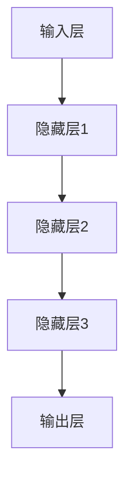

                 

### 《需求与AI伦理：大模型应用开发中的重要考量》

#### 关键词：
AI大模型、需求分析、伦理考量、应用开发、隐私保护

> _摘要：随着人工智能技术的迅猛发展，大模型应用成为推动各行各业变革的重要力量。然而，在大模型应用开发过程中，如何满足用户需求的同时兼顾伦理考量，成为亟待解决的重要问题。本文将从需求分析、伦理考量、应用开发等多个角度，深入探讨大模型应用中的关键问题和解决策略。_

---

**第一部分：背景与核心概念**

#### 第1章 引言

**1.1 书籍概述**

随着人工智能技术的飞速发展，大模型在各个领域得到了广泛应用，如自然语言处理、图像识别、推荐系统等。这些大模型不仅能够处理海量数据，还能在复杂问题上提供高效解决方案。然而，大模型的应用也引发了一系列伦理问题，如数据隐私、算法偏见、透明性等。如何在满足用户需求的同时，确保AI大模型的伦理合规性，成为当前研究的热点。

**1.2 目标读者**

本文旨在为人工智能开发者、数据科学家、伦理学研究者以及关注AI伦理问题的专业人士提供参考。通过本文，读者可以系统地了解大模型应用开发中的需求分析和伦理考量，为实际项目提供指导。

**1.3 书籍结构**

本文分为以下几个部分：

1. **背景与核心概念**：介绍大模型的基本概念、发展趋势和伦理问题。
2. **需求分析**：详细阐述需求分析的过程和方法，包括需求收集、需求分析、需求验证等。
3. **伦理考量**：探讨大模型应用中的伦理问题，如数据隐私、算法偏见等。
4. **应用开发**：介绍大模型应用开发的基本流程和关键步骤。
5. **案例分析**：通过实际案例，分析大模型应用中的挑战和解决方案。
6. **结论与展望**：总结全文内容，展望大模型应用的未来发展趋势。

---

**第二部分：技术基础**

#### 第2章 AI大模型基础理论

**2.1 AI大模型核心概念**

AI大模型是指具有大规模参数和复杂结构的机器学习模型。这些模型通常通过深度学习技术训练，能够在大量数据中提取特征，并在各种任务中表现出优异的性能。

**2.1.1 什么是AI大模型**

AI大模型通常具有以下特点：

- **大规模参数**：大模型拥有数十亿甚至千亿级别的参数，使其在处理复杂问题时具备较强的表达能力。
- **深度网络结构**：大模型通常采用多层神经网络结构，可以逐步提取数据中的高级特征。
- **自适应能力**：大模型在训练过程中可以自适应地调整参数，以适应不同任务和数据分布。
- **高效计算**：随着硬件性能的提升，大模型可以在较短的时间内完成训练和推理。

**2.1.2 AI大模型的基本架构**

AI大模型的基本架构包括输入层、隐藏层和输出层。输入层负责接收外部数据，隐藏层负责提取特征，输出层负责生成预测结果。

下面是一个简单的AI大模型架构的Mermaid流程图：



---

**核心算法原理讲解**

**2.2 神经网络基础**

神经网络是AI大模型的核心组成部分，其基本原理是通过多层非线性变换来模拟人脑的思考过程。

**2.2.1 神经网络结构**

神经网络通常由输入层、隐藏层和输出层组成。每个层由多个神经元（节点）构成，神经元之间通过权重进行连接。

**2.2.2 学习算法**

神经网络的学习过程是通过不断调整权重来优化模型的预测性能。常用的学习算法包括梯度下降法、随机梯度下降（SGD）等。

以下是一个简单的神经网络学习算法的Python伪代码：

```python
# 初始化权重
weights = [0.0] * (num_inputs * num_neurons)

# 训练模型
for epoch in range(num_epochs):
    for sample in dataset:
        # 计算预测结果
        output = predict(sample, weights)

        # 计算误差
        error = calculate_error(target, output)

        # 更新权重
        weights = update_weights(weights, error, learning_rate)
```

**2.2.3 数学模型和公式**

神经网络的学习过程涉及多个数学模型和公式，包括损失函数、梯度计算等。以下是一个简单的损失函数和梯度计算的Python代码：

```python
import numpy as np

# 损失函数
def loss_function(output, target):
    return (output - target) ** 2

# 梯度计算
def calculate_gradient(output, target):
    return 2 * (output - target)
```

**2.2.4 通俗易懂地举例说明**

假设我们有一个简单的神经网络，用于判断一个数字是否大于5。输入层只有一个神经元，隐藏层有两个神经元，输出层有一个神经元。

输入数据：`[3]`（表示一个数字3）

期望输出：`[False]`（表示3不大于5）

通过训练，神经网络可以逐渐调整权重，使其在给定输入时输出正确的结果。

训练过程：

1. 初始化权重：`weights = [0.0] * (1 * 2)`（假设隐藏层有两个神经元）
2. 计算预测结果：`output = np.dot(input, weights)`
3. 计算误差：`error = loss_function(output, target)`
4. 更新权重：`weights -= learning_rate * calculate_gradient(output, target)`

经过多次训练，神经网络可以逐渐逼近正确答案，最终输出 `[False]`。

---

**第三部分：应用开发**

#### 第3章 需求分析与建模

**3.1 需求分析过程**

需求分析是AI大模型应用开发的重要环节，其目的是明确用户需求，为后续建模和开发提供基础。需求分析过程通常包括以下步骤：

1. **需求收集**：通过与用户沟通、问卷调查、用户访谈等方式，收集用户需求和期望。
2. **需求分析**：对收集到的需求进行整理和分析，确定需求的重要性和优先级。
3. **需求验证**：通过用户反馈和验证，确保需求分析的准确性和可行性。

**3.2 建模方法**

AI大模型建模通常包括以下步骤：

1. **数据预处理**：对原始数据进行清洗、归一化和特征提取等处理，为建模做好准备。
2. **特征工程**：根据需求分析结果，选择合适的特征，构建特征向量。
3. **模型选择**：根据任务类型和数据特点，选择合适的机器学习模型。
4. **模型训练**：使用训练数据对模型进行训练，调整模型参数。
5. **模型评估**：使用验证数据对模型进行评估，调整模型参数以优化性能。

**3.3 实战案例**

以文本分类任务为例，需求分析结果为：需要根据文本内容判断文本所属的类别。

1. **数据预处理**：清洗文本数据，去除停用词，进行词向量化。
2. **特征工程**：选择词频、词嵌入等特征。
3. **模型选择**：选择朴素贝叶斯、支持向量机等分类模型。
4. **模型训练**：使用训练数据对模型进行训练。
5. **模型评估**：使用验证数据对模型进行评估。

通过以上步骤，可以构建一个简单的文本分类模型。

---

**第四部分：伦理考量**

#### 第4章 AI大模型伦理考量

**4.1 数据隐私**

数据隐私是AI大模型应用中的一大伦理问题。大模型通常需要处理大量用户数据，如何保护用户隐私成为关键挑战。以下是一些解决方案：

1. **数据加密**：对用户数据进行加密，防止数据泄露。
2. **匿名化处理**：对用户数据进行匿名化处理，消除个人隐私信息。
3. **数据共享协议**：建立严格的数据共享协议，确保数据使用范围和目的明确。

**4.2 算法偏见**

算法偏见是指AI大模型在处理数据时，可能会对某些群体产生不公平的偏见。以下是一些解决方案：

1. **数据平衡**：通过调整数据集的分布，减少算法偏见。
2. **算法校准**：对算法进行校准，确保其在不同群体上的性能一致。
3. **监督与审查**：建立监督机制，对算法进行定期审查，确保其公平性。

**4.3 透明性与解释性**

AI大模型的透明性和解释性是另一个重要伦理问题。用户需要了解AI大模型的工作原理和决策过程。以下是一些解决方案：

1. **可视化工具**：开发可视化工具，帮助用户理解AI大模型的工作原理。
2. **可解释性算法**：研究可解释性算法，使AI大模型的决策过程更加透明。
3. **用户反馈机制**：建立用户反馈机制，收集用户对AI大模型性能的反馈，不断优化模型。

---

**第五部分：案例分析**

#### 第5章 案例分析

**5.1 案例一：图像识别**

图像识别是AI大模型应用的一个典型案例。以下是一个简单的图像识别案例：

- **需求分析**：需要根据图像内容判断图像所属的类别。
- **建模过程**：使用卷积神经网络（CNN）对图像进行特征提取，使用全连接层对特征进行分类。
- **模型训练**：使用大量图像数据对模型进行训练，调整模型参数以优化性能。
- **模型评估**：使用验证图像对模型进行评估，调整模型参数以优化性能。

通过以上步骤，可以构建一个简单的图像识别模型。

**5.2 案例二：语音识别**

语音识别是AI大模型应用的另一个重要领域。以下是一个简单的语音识别案例：

- **需求分析**：需要将语音信号转换为对应的文字内容。
- **建模过程**：使用循环神经网络（RNN）对语音信号进行特征提取，使用卷积神经网络（CNN）对特征进行分类。
- **模型训练**：使用大量语音数据对模型进行训练，调整模型参数以优化性能。
- **模型评估**：使用验证语音对模型进行评估，调整模型参数以优化性能。

通过以上步骤，可以构建一个简单的语音识别模型。

---

**第六部分：结论与展望**

#### 第6章 结论与展望

**6.1 结论**

本文从需求分析、伦理考量、应用开发等多个角度，深入探讨了AI大模型应用中的重要问题。主要结论如下：

1. **需求分析**：需求分析是AI大模型应用开发的基础，准确的需求分析有助于提高模型性能。
2. **伦理考量**：数据隐私、算法偏见、透明性与解释性是AI大模型应用中的关键伦理问题，需要采取有效措施予以解决。
3. **应用开发**：AI大模型应用开发需要遵循科学的流程和方法，通过不断的迭代和优化，提高模型性能。

**6.2 展望**

随着人工智能技术的不断发展，AI大模型应用将变得更加广泛和深入。未来，以下几个方面值得关注：

1. **需求分析**：研究更加智能化的需求分析方法，提高需求分析的准确性和效率。
2. **伦理考量**：加强AI大模型伦理考量研究，制定更加完善的伦理规范和标准。
3. **应用开发**：探索更多AI大模型的应用场景，提高模型在不同领域的性能。

**6.3 对读者的建议**

1. **学习基础知识**：了解AI大模型的基本原理和算法，为实际应用奠定基础。
2. **关注伦理问题**：关注AI大模型应用中的伦理问题，积极参与伦理讨论和解决方案的制定。
3. **实践与探索**：通过实际项目和实践，不断提升自己的技术水平，为AI大模型应用贡献力量。

---

**附录**

#### 附录A：相关资源与工具

1. **学习资源**：
   - 《深度学习》（Goodfellow, Bengio, Courville）
   - 《Python机器学习》（Sebastian Raschka）
   - 《自然语言处理与深度学习》（Stanislaw Ulam）

2. **开发工具**：
   - TensorFlow
   - PyTorch
   - Keras

#### 附录B：术语表

- **AI大模型**：具有大规模参数和复杂结构的机器学习模型。
- **需求分析**：对用户需求进行收集、分析和验证的过程。
- **伦理考量**：在AI大模型应用中，考虑数据隐私、算法偏见、透明性与解释性等问题。

#### 附录C：参考文献

1. Goodfellow, I., Bengio, Y., & Courville, A. (2016). *Deep Learning*.
2. Raschka, S. (2015). *Python Machine Learning*.
3. Ulam, S. (2017). *Natural Language Processing and Deep Learning*.

