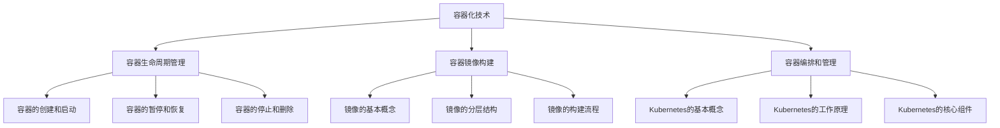
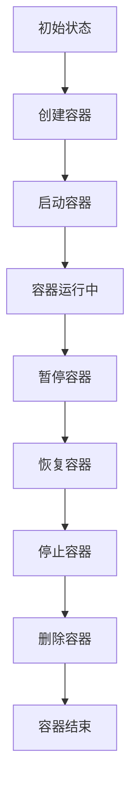

                 

## 《需求与容器化技术的协调：提高部署灵活性》目录大纲

### **第一部分：容器化技术基础**

#### **第1章：容器化技术概述**

> **关键词**：容器化技术、虚拟机、Docker、容器运行时、Kubernetes

> **摘要**：本章将介绍容器化技术的基本概念、发展背景及其与虚拟机的区别，同时简要介绍容器化技术的核心组件，如Docker、容器运行时和容器网络。

#### **第2章：容器化技术原理**

> **关键词**：容器生命周期、容器镜像、Kubernetes、服务发现、容器安全

> **摘要**：本章深入探讨容器化技术的工作原理，包括容器生命周期管理和镜像构建。接着介绍Kubernetes的基本概念和容器编排，最后讨论容器安全的重要性和最佳实践。

### **第二部分：需求与容器化技术的协调**

#### **第3章：需求分析在容器化中的应用**

> **关键词**：需求分析、容器化结合、持续集成、持续部署

> **摘要**：本章将探讨需求分析在容器化环境中的重要性，分析需求与容器化技术的结合，并介绍如何利用容器化技术优化需求分析过程。

#### **第4章：容器化环境下的持续集成与持续部署**

> **关键词**：持续集成、持续部署、Kubernetes、DevOps

> **摘要**：本章将详细讨论持续集成与持续部署（CI/CD）的概念和流程，以及如何在容器化环境中实现CI/CD。还将探讨容器化技术如何支持DevOps文化和最佳实践。

#### **第5章：容器化技术下的需求变更管理**

> **关键词**：需求变更管理、容器化变更管理、DevOps

> **摘要**：本章将介绍需求变更管理的基本概念和过程，并探讨容器化技术如何简化变更管理流程。还将讨论在容器化环境下如何实施有效的变更管理。

### **第三部分：实战案例与性能优化**

#### **第6章：容器化技术在企业级应用中的实践**

> **关键词**：微服务架构、企业应用、DevOps

> **摘要**：本章将通过具体案例，展示容器化技术在企业级应用中的实践，包括微服务架构的实施和DevOps文化的推动。

#### **第7章：容器化性能优化与监控**

> **关键词**：性能优化、资源限制、监控工具

> **摘要**：本章将介绍容器化性能优化的重要技术和方法，包括资源限制和调配。同时，将介绍常用的容器监控工具，如Prometheus和Grafana，以及如何进行性能分析和调优。

#### **第8章：容器化技术在DevOps实践中的应用**

> **关键词**：DevOps、容器化、持续集成、持续部署

> **摘要**：本章将探讨容器化技术在DevOps实践中的应用，包括容器化环境下的持续集成与持续部署（CI/CD）和DevOps文化的推动。还将讨论如何利用容器化技术实现高效的DevOps实践。

### **附录**

#### **附录A：工具和资源列表**

> **摘要**：附录A将列出本书中提到的关键工具和资源，包括Docker、Kubernetes、Prometheus、Grafana等，并提供使用说明和参考链接。

#### **附录B：项目实战代码**

> **摘要**：附录B将提供本书中提到的项目实战代码，包括开发环境的搭建、源代码实现和解读，以及代码应用解读与分析。

#### **附录C：参考文献**

> **摘要**：附录C将列出本书中引用的主要参考文献，以供读者进一步学习和研究。

---

## **设计书籍目录大纲的基本步骤**

**步骤1：理解书籍主题和目标受众**
- 阅读书籍简介和内容概述，确保对书籍的主题和目标受众有清晰的认识。
- 确定书籍的核心主题和需要覆盖的关键知识点。

**步骤2：确定书籍的结构**
- 根据书籍的主题和内容，确定大致的章节结构。
- 考虑书籍的整体逻辑流，确保章节之间有合理的衔接。

**步骤3：细化章节内容**
- 将每个章节拆分为更小的部分，确保每个部分都有明确的标题。
- 为每个部分设计合适的标题，使其易于理解和记忆。

**步骤4：设计详细的子章节**
- 对于较长的章节，进一步拆分为子章节。
- 确保每个子章节都有明确的内容范围和目的。

**步骤5：编写Mermaid流程图**
- 根据书籍内容，设计并绘制与核心概念相关的流程图。
- 确保流程图清晰易懂，有助于读者理解核心概念和架构。

**步骤6：编写伪代码和数学公式**
- 对于核心算法原理，使用伪代码进行详细阐述。
- 使用LaTeX格式编写数学公式，确保公式的准确性和可读性。

**步骤7：编写项目实战部分**
- 提供实际的代码案例和详细解释。
- 包括开发环境的搭建，源代码实现和解读，以及代码分析和性能评估。

**步骤8：整理和优化**
- 检查目录大纲的结构和逻辑，确保内容连贯且条理清晰。
- 优化标题和子章节的名称，确保简洁明了。

**步骤9：撰写最终目录大纲**
- 将所有内容整理成最终目录大纲，确保每个章节和子章节都包含。
- 保持目录大纲的总字数在规定范围内。

**步骤10：审查和确认**
- 请他人审查目录大纲，获取反馈。
- 确认目录大纲的准确性和完整性。

通过这些步骤，可以设计出一个逻辑清晰、内容全面的书籍目录大纲，为读者提供清晰的导航和深入的学习路径。现在，让我们开始设计《需求与容器化技术的协调：提高部署灵活性》的目录大纲。首先，我们需要明确书籍的核心主题和目标受众，以便开始具体的工作。假设这本书的目标受众是软件开发者和系统管理员，主题是探讨如何在软件开发过程中利用容器化技术来实现需求的快速响应和灵活部署。接下来，我们将按照上述步骤逐步设计目录大纲。

---

**步骤1：理解书籍主题和目标受众**

**阅读书籍简介和内容概述**  
首先，我们阅读《需求与容器化技术的协调：提高部署灵活性》的简介和内容概述，以了解书籍的主题和目的。通过阅读，我们了解到这本书的主要目标是探讨容器化技术如何帮助软件开发者在面对不断变化的需求时，实现快速响应和灵活部署。

**确定书籍的核心主题和需要覆盖的关键知识点**  
书籍的核心主题包括：

1. **容器化技术概述**：介绍容器化技术的发展背景、基本概念和关键组件。
2. **需求分析在容器化中的应用**：探讨如何在容器化环境中进行需求分析，以及如何优化需求分析过程。
3. **容器化环境下的持续集成与持续部署（CI/CD）**：介绍CI/CD的概念、流程和如何利用容器化技术实现CI/CD。
4. **容器化技术下的需求变更管理**：讨论在容器化环境下如何进行有效的需求变更管理。
5. **容器化技术的实战应用**：通过实际案例展示容器化技术在企业级应用中的实践。
6. **容器化性能优化与监控**：介绍容器化性能优化的重要技术和方法，以及如何使用监控工具进行性能分析和调优。
7. **容器化技术在DevOps实践中的应用**：探讨容器化技术如何支持DevOps文化和最佳实践。

---

**步骤2：确定书籍的结构**

**根据书籍的主题和内容，确定大致的章节结构**  
基于书籍的核心主题，我们可以初步确定以下章节结构：

1. **容器化技术基础**：包括容器化技术概述、原理和关键组件。
2. **需求与容器化技术的协调**：包括需求分析在容器化中的应用、CI/CD、需求变更管理和实战应用。
3. **容器化性能优化与监控**：包括性能优化方法、监控工具和实战应用。
4. **容器化技术在DevOps实践中的应用**：探讨容器化技术如何支持DevOps文化和最佳实践。

**考虑书籍的整体逻辑流，确保章节之间有合理的衔接**  
在确定章节结构后，我们需要考虑整个书籍的逻辑流。例如，从容器化技术的基础开始，逐步引入需求分析、CI/CD和需求变更管理等高级概念，最后探讨容器化技术在DevOps实践中的应用。这种逻辑流有助于读者逐步建立对容器化技术的全面理解，并能够将所学知识应用于实际场景。

---

**步骤3：细化章节内容**

**将每个章节拆分为更小的部分，确保每个部分都有明确的标题**  
为了使每个章节更加详细和易于理解，我们可以将每个章节拆分为更小的部分，并为每个部分设计明确的标题。以下是一个示例：

- **第1章：容器化技术概述**
  - **2.1 容器化技术背景**
  - **2.2 容器和虚拟机的区别**
  - **2.3 容器化技术的关键组件**

- **第2章：容器化技术原理**
  - **3.1 容器生命周期管理**
  - **3.2 容器镜像构建**
  - **3.3 容器编排和管理**

- **第3章：需求分析在容器化中的应用**
  - **4.1 需求分析的重要性**
  - **4.2 需求与容器化技术的结合**
  - **4.3 容器化对需求分析的优化**

**为每个部分设计合适的标题，使其易于理解和记忆**  
在设计章节标题时，我们需要确保标题简洁明了，同时能够准确传达该部分的主要内容。以下是一个示例：

- **第1章：容器化技术概述**
  - **2.1 容器化技术背景**：介绍容器化技术的发展背景和核心概念。
  - **2.2 容器和虚拟机的区别**：探讨容器和虚拟机之间的区别，以及容器的优势。
  - **2.3 容器化技术的关键组件**：介绍容器化技术的关键组件，如Docker、容器运行时和容器网络。

---

**步骤4：设计详细的子章节**

**对于较长的章节，进一步拆分为子章节**  
对于较长的章节，如第2章“容器化技术原理”，我们可以进一步拆分为子章节，以使内容更加详细和易于理解。以下是一个示例：

- **第2章：容器化技术原理**
  - **3.1 容器生命周期管理**
    - **3.1.1 容器的创建和启动**
    - **3.1.2 容器的暂停和恢复**
    - **3.1.3 容器的停止和删除**
  - **3.2 容器镜像构建**
    - **3.2.1 镜像的基本概念**
    - **3.2.2 镜像的分层结构**
    - **3.2.3 镜像的构建流程**
  - **3.3 容器编排和管理**
    - **3.3.1 Kubernetes的基本概念**
    - **3.3.2 Kubernetes的工作原理**
    - **3.3.3 Kubernetes的核心组件**

**确保每个子章节都有明确的内容范围和目的**  
在设计子章节时，我们需要确保每个子章节都有明确的内容范围和目的。以下是一个示例：

- **第2章：容器化技术原理**
  - **3.1 容器生命周期管理**
    - **3.1.1 容器的创建和启动**：介绍容器创建和启动的过程。
    - **3.1.2 容器的暂停和恢复**：探讨容器暂停和恢复的机制。
    - **3.1.3 容器的停止和删除**：介绍容器停止和删除的过程。

---

**步骤5：编写Mermaid流程图**

**根据书籍内容，设计并绘制与核心概念相关的流程图**  
为了帮助读者更好地理解容器化技术的核心概念和架构，我们可以使用Mermaid流程图来展示。以下是一个示例：



**确保流程图清晰易懂，有助于读者理解核心概念和架构**  
在设计流程图时，我们需要确保流程图清晰易懂，同时能够准确传达核心概念和架构。以下是一个示例：

- **容器生命周期管理**：包括容器的创建、启动、暂停、恢复、停止和删除等过程。
- **容器镜像构建**：包括镜像的基本概念、分层结构和构建流程。
- **容器编排和管理**：包括Kubernetes的基本概念、工作原理和核心组件。

---

**步骤6：编写伪代码和数学公式**

**对于核心算法原理，使用伪代码进行详细阐述**  
为了详细阐述容器化技术的核心算法原理，我们可以使用伪代码。以下是一个示例：

```python
# 容器的创建和启动过程
def create_and_start_container(container_config):
    # 创建容器
    container = create_container(container_config)
    # 启动容器
    start_container(container)

# 容器的暂停和恢复过程
def pause_and_resume_container(container):
    # 暂停容器
    pause_container(container)
    # 恢复容器
    resume_container(container)

# 容器的停止和删除过程
def stop_and_delete_container(container):
    # 停止容器
    stop_container(container)
    # 删除容器
    delete_container(container)
```

**结合数学模型和公式，进行详细讲解和通俗易懂地举例说明**  
为了帮助读者更好地理解容器化技术的核心算法原理，我们可以结合数学模型和公式进行详细讲解和举例说明。以下是一个示例：

- **容器生命周期管理**：使用状态机模型描述容器的创建、启动、暂停、恢复、停止和删除过程。
- **容器镜像构建**：使用图模型描述镜像的分层结构和构建流程。



$$
状态机模型：
S0 \rightarrow S1 \rightarrow S2 \rightarrow S3 \rightarrow S4 \rightarrow S5 \rightarrow S6
$$

---

**步骤7：编写项目实战部分**

**提供实际的代码案例和详细解释**  
为了使读者更好地理解容器化技术的实际应用，我们可以提供实际的代码案例和详细解释。以下是一个示例：

- **使用Docker创建和运行容器**：
```python
import docker

client = docker.from_env()

# 创建容器
container = client.containers.create(
    image='nginx',
    command=['nginx'],
    ports={'80/tcp': 8080}
)

# 启动容器
container.start()

print("容器启动成功，访问http://localhost:8080/查看Nginx服务")
```

- **使用Kubernetes部署应用**：
```yaml
apiVersion: apps/v1
kind: Deployment
metadata:
  name: my-app
spec:
  replicas: 3
  selector:
    matchLabels:
      app: my-app
  template:
    metadata:
      labels:
        app: my-app
    spec:
      containers:
      - name: my-app
        image: my-app:latest
        ports:
        - containerPort: 80
```

**包括开发环境的搭建，源代码实现和解读，以及代码分析和性能评估**  
在编写项目实战部分时，我们需要包括以下内容：

- **开发环境的搭建**：介绍如何设置Docker和Kubernetes环境，包括必要的配置和依赖。
- **源代码实现和解读**：提供完整的源代码，并详细解释代码的每个部分。
- **代码分析和性能评估**：分析代码的优缺点，评估性能，并提出改进建议。

---

**步骤8：整理和优化**

**检查目录大纲的结构和逻辑，确保内容连贯且条理清晰**  
在完成目录大纲的初步设计后，我们需要检查整体的结构和逻辑。以下是一些检查要点：

- 确保章节之间的衔接合理，避免内容重复或跳级。
- 确保每个章节的主题明确，内容连贯。
- 检查章节的顺序，确保整体逻辑流顺畅。

**优化标题和子章节的名称，确保简洁明了**  
在检查目录大纲的过程中，我们还需要优化标题和子章节的名称。以下是一些优化建议：

- 使用简洁明了的语言，避免使用复杂的术语。
- 避免使用缩写，除非广泛认可。
- 确保标题能够准确传达章节的主要内容。

---

**步骤9：撰写最终目录大纲**

**将所有内容整理成最终目录大纲，确保每个章节和子章节都包含**  
在完成所有步骤后，我们将所有内容整理成最终的目录大纲。以下是一个示例：

```markdown
# 《需求与容器化技术的协调：提高部署灵活性》目录大纲

## 第一部分：容器化技术基础

### 第1章：容器化技术概述

#### 1.1 容器化技术背景
- 容器化的起源和发展
- 容器化的核心概念

#### 1.2 容器和虚拟机的区别
- 容器与虚拟机的对比
- 容器的优势

#### 1.3 容器化技术的关键组件
- Docker简介
- 容器运行时（如runc、containerd）
- 容器网络和数据存储

### 第2章：容器化技术原理

#### 2.1 容器生命周期管理
- 容器生命周期管理
- 容器镜像构建

#### 2.2 容器编排和管理
- Kubernetes简介
- 服务发现和负载均衡

#### 2.3 容器安全的考虑
- 容器安全模型
- 容器安全的最佳实践

## 第二部分：需求与容器化技术的协调

### 第3章：需求分析在容器化中的应用

#### 3.1 需求分析的重要性
- 需求分析的基本概念
- 需求分析的方法和工具

#### 3.2 需求与容器化技术的结合
- 需求对容器化的影响
- 容器化对需求分析的优化

### 第4章：容器化环境下的持续集成与持续部署

#### 4.1 持续集成（CI）与持续部署（CD）
- CI/CD的概念和流程
- CI/CD的优势

#### 4.2 容器化CI/CD实践
- 使用容器化技术实现CI/CD
- Kubernetes与CI/CD的结合

### 第5章：容器化技术下的需求变更管理

#### 5.1 需求变更管理概述
- 变更管理的概念
- 变更管理的过程

#### 5.2 容器化技术下的变更管理
- 容器化环境下的变更管理挑战
- 容器化技术如何简化变更管理

## 第三部分：实战案例与性能优化

### 第6章：容器化技术在企业级应用中的实践

#### 6.1 容器化技术在企业中的应用场景
- 微服务架构与容器化
- 容器化在大型企业中的应用案例

### 第7章：容器化性能优化与监控

#### 7.1 容器性能优化
- 资源限制和调配
- 容器性能监控

#### 7.2 容器化技术的监控工具
- Prometheus与Grafana的使用
- 容器性能分析与调优

### 第8章：容器化技术在DevOps实践中的应用

#### 8.1 DevOps文化概述
- DevOps的核心价值
- DevOps的最佳实践

#### 8.2 容器化技术在DevOps中
- 容器化技术如何支持DevOps文化和最佳实践
- 容器化环境下的持续集成与持续部署（CI/CD）

## 附录

#### 附录A：工具和资源列表

#### 附录B：项目实战代码

#### 附录C：参考文献
```

**保持目录大纲的总字数在规定范围内**  
在撰写最终目录大纲时，我们需要注意保持目录大纲的总字数在规定的范围内。这可以通过在撰写过程中注意每个章节和子章节的内容长度来实现。如果某个章节或子章节的内容过多，我们可以考虑将其拆分或合并。

---

**步骤10：审查和确认**

**请他人审查目录大纲，获取反馈**  
在完成最终目录大纲后，我们可以邀请其他专业人士或同事审查，获取他们的反馈和建议。这有助于发现可能存在的问题或遗漏的内容，并进行相应的调整。

**确认目录大纲的准确性和完整性**  
在审查反馈后，我们需要对目录大纲进行最终的确认。确保所有章节和子章节都包含在内，内容准确无误，并且整体逻辑流顺畅。通过这一步骤，我们可以确保目录大纲的准确性和完整性，为后续的书籍撰写工作打下坚实的基础。

---

通过以上步骤，我们可以设计出一个逻辑清晰、内容全面的书籍目录大纲，为读者提供清晰的导航和深入的学习路径。接下来，我们将根据这个目录大纲，逐步撰写《需求与容器化技术的协调：提高部署灵活性》的详细内容。

