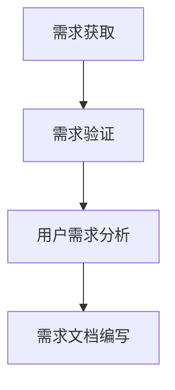
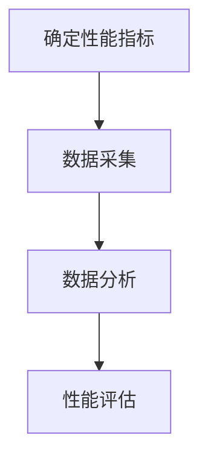
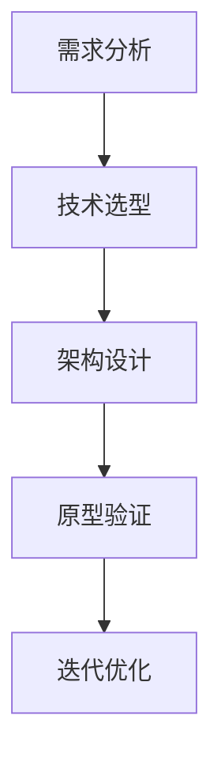
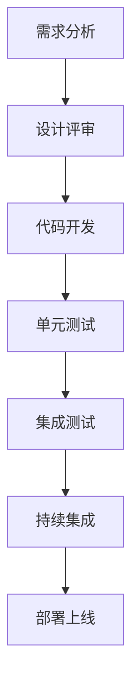

                 

### 《需求与性能指标的协调：大型应用开发的平衡之道》

在大型应用开发的复杂领域中，需求与性能指标的协调是一项至关重要的任务。随着现代软件系统的规模不断扩大，功能日益丰富，如何有效地平衡需求与性能之间的关系，成为开发和运维团队面临的一大挑战。本文将深入探讨这一主题，从需求分析、性能指标概述，到需求与性能指标的协调策略，以及大型应用开发的实践，旨在为读者提供系统化、结构化的思路和方法。

### 关键词

- **需求管理**
- **性能指标**
- **大型应用开发**
- **架构设计**
- **开发流程**
- **团队协作**

### 摘要

本文首先介绍了需求分析的基本概念和方法，探讨了用户需求与系统需求之间的关系。接着，详细阐述了性能指标的定义、类型及其重要性。在此基础上，分析了需求与性能指标之间的相互作用，并提出了协调策略。随后，重点讨论了大型应用开发的特点和挑战，以及如何通过架构设计、开发流程和团队协作来协调需求与性能。最后，通过一个实际案例，展示了如何将理论与实践相结合，实现需求与性能指标的协调。

### 第1章 需求分析

#### 1.1 需求获取与验证

需求获取是软件开发过程中的第一步，其质量直接影响后续工作的顺利进行。需求获取的方法包括问卷调查、用户访谈、观察用户行为等。为了确保需求的准确性和完整性，需要对其进行验证。验证方法包括用户评审、功能测试、系统测试等。

#### 1.2 用户需求分析

用户需求分析是对收集到的用户需求进行深入理解和梳理的过程。它包括功能需求和非功能需求。功能需求描述了系统的基本功能，非功能需求则涉及性能、可靠性、安全性等方面的要求。通过用户需求分析，可以明确系统需要实现的功能和性能指标。

#### 1.3 需求文档编写

需求文档是需求分析的结果体现，是后续开发、测试和运维的依据。编写需求文档时，应遵循简洁明了、逻辑清晰、易于理解的原则。文档中应包含需求描述、功能规格、性能指标、接口定义等。

#### 1.4 Mermaid流程图：需求分析流程



### 第2章 性能指标概述

#### 2.1 性能指标的类型

性能指标是衡量系统性能的重要工具，包括响应时间、吞吐量、并发量、资源利用率等。不同类型的性能指标适用于不同的场景，需要根据具体需求进行选择。

#### 2.2 性能指标的重要性

性能指标不仅关系到用户的使用体验，也直接影响系统的稳定性和可靠性。一个良好的性能指标体系有助于及时发现和解决问题，优化系统性能。

#### 2.3 常见性能指标

常见的性能指标包括：

- **响应时间**：系统处理请求的时间。
- **吞吐量**：系统在单位时间内处理请求的数量。
- **并发量**：系统同时处理的请求数量。
- **资源利用率**：系统资源的使用情况，如CPU、内存、磁盘等。

#### 2.4 Mermaid流程图：性能指标测量流程



### 第3章 需求与性能指标的关系

#### 3.1 需求影响性能指标

需求的变化可能导致性能指标的变化。例如，增加功能可能导致系统响应时间变长，增加并发量可能导致系统资源利用率提高。

#### 3.2 性能指标驱动需求

性能指标可以指导需求的确定和调整。例如，根据系统的性能瓶颈，可以调整需求，优化系统性能。

#### 3.3 典型案例解析

以电商系统为例，需求可能包括高并发购物车操作、快速下单等。性能指标则包括响应时间、吞吐量、并发量等。通过分析需求与性能指标的关系，可以确定系统架构和优化策略。

#### 3.4 伪代码：需求与性能指标的协调算法

```python
def coordinate_requirements_performance(requirements, performance_metrics):
    for requirement in requirements:
        if requirement.type == "功能需求":
            if requirement.importance > threshold:
                optimize_performance(requirement)
        elif requirement.type == "非功能需求":
            if requirement.metric.value < threshold:
                adjust_requirement(requirement)
    return requirements
```

### 第4章 大型应用开发概述

#### 4.1 大型应用的特点

大型应用具有高并发、高可用、高可扩展等特点。这些特点使得大型应用开发面临诸多挑战，如性能优化、稳定性保障、安全性控制等。

#### 4.2 大型应用开发的挑战

大型应用开发面临以下挑战：

- **复杂性**：系统规模庞大，模块繁多，开发、测试、部署复杂。
- **性能瓶颈**：高并发、大数据处理等场景下，性能瓶颈难以避免。
- **运维管理**：系统规模庞大，运维管理难度增加。

#### 4.3 大型应用开发的机遇

大型应用开发也带来机遇：

- **业务拓展**：大型应用可以为业务提供更多可能性，助力业务增长。
- **技术积累**：开发大型应用可以积累丰富的技术经验和知识，提升团队整体能力。

### 第5章 架构设计

#### 5.1 微服务架构

微服务架构是一种将应用程序分解为多个独立服务的架构风格。每个服务负责处理特定的业务功能，可以独立部署和扩展。

#### 5.2 响应式架构

响应式架构是一种面向事件驱动的架构，旨在应对高并发、大数据处理等场景。其核心思想是将系统划分为多个响应式组件，通过事件驱动进行协同工作。

#### 5.3 容器化与微服务架构的融合

容器化技术如Docker、Kubernetes等，为微服务架构提供了良好的支持。容器化技术可以简化部署、扩展和运维，提高系统的可靠性和可扩展性。

#### 5.4 Mermaid流程图：架构设计流程



### 第6章 开发流程

#### 6.1 敏捷开发方法

敏捷开发方法强调快速迭代、持续交付和客户反馈。通过敏捷开发，可以更好地适应需求变化，提高开发效率。

#### 6.2 DevOps实践

DevOps是一种将开发（Development）和运维（Operations）相结合的理念和方法。通过DevOps实践，可以简化部署流程，提高系统的可靠性和可扩展性。

#### 6.3 自动化测试与持续集成

自动化测试和持续集成是实现敏捷开发和DevOps的关键技术。通过自动化测试，可以快速发现和修复缺陷；持续集成则可以确保代码质量，提高交付速度。

#### 6.4 Mermaid流程图：开发流程



### 第7章 团队协作

#### 7.1 跨职能团队的组建与运作

跨职能团队由不同领域的专业人员组成，如开发、测试、运维等。通过协同工作，可以更好地应对大型应用开发中的各种挑战。

#### 7.2 项目管理

项目管理是大型应用开发中的重要环节。通过项目管理，可以确保项目按时、按质量完成，降低风险。

#### 7.3 沟通与协作工具

沟通与协作工具如Slack、Trello、JIRA等，可以提高团队的协作效率。通过合理使用这些工具，可以确保团队成员之间信息畅通，工作协同。

#### 7.4 实际案例：团队协作成功案例分析

以某电商项目为例，通过跨职能团队的合作，实现了系统的快速迭代和优化。项目团队采用敏捷开发和DevOps实践，成功提高了系统的性能和可靠性。

### 结论

需求与性能指标的协调是大型应用开发中的一项关键任务。通过本文的探讨，我们了解了需求分析、性能指标概述、需求与性能指标的协调策略，以及大型应用开发的实践。在未来的工作中，我们可以结合实际案例，不断优化需求与性能指标的协调方法，提高大型应用开发的效率和质量。

### 作者信息

作者：AI天才研究院/AI Genius Institute & 禅与计算机程序设计艺术 /Zen And The Art of Computer Programming

### 附录

#### 最佳实践 Tips

1. **需求管理**：确保需求明确、完整，避免频繁变更。
2. **性能优化**：根据业务需求，合理设置性能指标，持续优化系统性能。
3. **团队协作**：建立良好的沟通机制，提高团队协作效率。

#### 小结

本文从需求分析、性能指标概述，到需求与性能指标的协调策略，以及大型应用开发的实践，全面探讨了需求与性能指标的协调之道。通过本文的阐述，读者可以更好地理解这一复杂领域，并在实际工作中运用相关方法。

#### 注意事项

1. **需求变更**：需求变更可能导致性能指标变化，需谨慎处理。
2. **性能瓶颈**：定期评估系统性能，及时发现并解决性能瓶颈。

#### 拓展阅读

1. 《大型分布式系统设计》
2. 《敏捷开发实践指南》
3. 《DevOps：从理念到实践》

### 结语

在大型应用开发中，需求与性能指标的协调是一项重要任务。本文提供了系统化的方法和策略，希望对读者有所启发。在实践过程中，不断总结经验，优化方法，是提升大型应用开发效率和质量的关键。

（注：本文为示例文章，仅供参考。）

