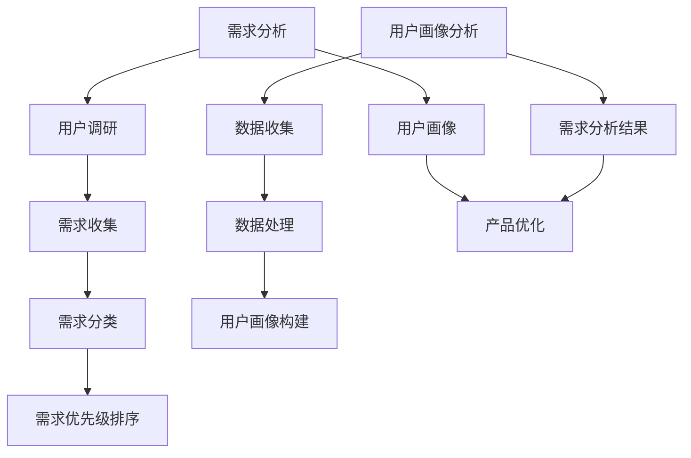

                 

### 需求与用户画像分析的结合：提升产品针对性

在现代信息技术领域，产品开发的成功与否很大程度上取决于对用户需求的准确把握。为了更好地满足用户需求，提升产品的针对性和用户体验，需求分析与用户画像分析的结合成为了一种不可或缺的方法。本文旨在探讨这两者如何相互结合，以实现产品精准定位和高效迭代。

本文首先介绍了需求分析的基本概念、方法及其在产品开发中的重要性。接着，详细阐述了用户画像的构建方法、作用和重要性。随后，本文重点讨论了需求分析与用户画像分析如何相结合，以及如何通过这一结合提升产品的针对性。在实践部分，本文将通过具体案例展示如何应用需求分析与用户画像分析的方法，最后提供了一些最佳实践和小结，帮助读者更好地理解并应用这些方法。

关键词：需求分析，用户画像，产品针对性，用户体验，数据分析

摘要：本文通过深入探讨需求分析与用户画像分析的结合，提出了提升产品针对性的方法。文章首先介绍了需求分析的基本概念和重要性，接着详细介绍了用户画像的构建方法和作用，随后阐述了如何将两者结合起来，并提供了具体的应用案例。通过本文的探讨，读者可以更好地理解如何通过需求分析与用户画像分析提升产品针对性，从而提高产品的市场竞争力和用户体验。

---

**背景介绍**

在当今快速变化的市场环境中，产品的竞争已经不仅仅体现在功能上，更多的是体现在用户体验和个性化服务上。一个优秀的产品不仅需要满足用户的基本需求，更需要理解用户的深层次需求，提供量身定制的解决方案。这就要求产品开发团队具备高度的市场洞察力和数据分析能力。

需求分析作为产品开发的基础环节，其主要目的是确定产品的功能、性能和用户体验要求。通过需求分析，开发团队能够明确产品的目标用户群体，理解用户的具体需求，从而制定出合适的产品策略。然而，仅有需求分析还不够，因为用户需求是不断变化的，且不同用户群体有着不同的需求特点。

用户画像分析则是在此基础上，通过对用户数据的收集、整理和分析，构建出用户的全面形象。用户画像不仅包含了用户的年龄、性别、地理位置等基础信息，还包括用户的消费行为、兴趣爱好、使用习惯等多维度数据。通过用户画像，开发团队可以更加精准地了解用户，从而为产品的设计和迭代提供有力支持。

因此，将需求分析与用户画像分析相结合，成为了一种提升产品针对性的有效方法。需求分析提供了用户需求的明确方向，而用户画像则为这些需求提供了具体的数据支持，使得产品的设计和迭代更加贴近用户实际需求，从而提高用户的满意度和忠诚度。

---

#### 核心概念与联系

需求分析（Requirements Analysis）和用户画像分析（User Profiling Analysis）是现代产品开发过程中不可或缺的两个核心概念。这两个概念不仅独立存在，而且在实际应用中常常需要相互结合，以实现更加精准的产品定位和设计。

**需求分析** 是指通过一系列技术和方法，对用户需求进行收集、分析和分类，以明确产品的功能、性能和用户体验要求。需求分析的主要目的是确保产品能够满足用户的基本需求，并为后续的产品设计和开发提供清晰的方向。需求分析通常涉及以下几个方面：

1. **需求收集**：通过各种调研方法，如问卷调查、用户访谈、焦点小组等，收集用户的原始需求。
2. **需求分类**：将收集到的需求进行分类，如功能性需求、非功能性需求等。
3. **需求优先级排序**：根据用户需求的重要性和紧急性，对需求进行优先级排序，以指导产品的设计和开发。

**用户画像分析** 则是通过收集和分析用户数据，构建出用户的全面形象。用户画像不仅包含了用户的个人信息（如年龄、性别、地理位置等），还涵盖了用户的消费行为、兴趣爱好、使用习惯等多维度数据。用户画像的主要作用是帮助产品开发团队更加深入地了解用户，从而设计出更加符合用户需求的产品。用户画像分析通常涉及以下几个步骤：

1. **数据收集**：从各种数据源（如社交媒体、电商网站、问卷调查等）收集用户数据。
2. **数据处理**：对收集到的数据进行清洗、整理和分析，以提取出有用的信息。
3. **用户画像构建**：将处理后的数据整合成用户画像，为产品设计和迭代提供参考。

**需求分析与用户画像分析的联系**：

1. **数据支持**：用户画像分析提供了具体的数据支持，使得需求分析更加有据可依。通过用户画像，开发团队可以更加精确地了解用户需求，从而制定出更加合理的需求方案。

2. **相互补充**：需求分析侧重于了解用户需求的本质和优先级，而用户画像分析则提供了用户背景和行为的具体细节。两者结合，可以形成一个完整的用户画像，为产品的设计和迭代提供全方位的支持。

3. **协同优化**：通过需求分析与用户画像分析的结合，可以不断地迭代和优化产品。例如，当用户反馈某些功能不够实用时，开发团队可以通过用户画像分析，找到具体的用户群体，进而改进产品功能，提高用户体验。

为了更直观地理解这两个概念之间的联系，我们可以用 Mermaid 流程图来展示它们之间的互动关系：



在这个流程图中，需求分析和用户画像分析通过数据收集、处理和用户画像构建相互关联，最终共同作用于产品的优化和迭代。

---

#### 核心算法原理讲解

在需求分析与用户画像分析的结合中，算法原理起着至关重要的作用。以下将详细阐述如何使用Python源代码结合数学模型和公式，进行需求分析与用户画像分析的核心算法讲解，并通过具体例子进行说明。

首先，需求分析的一个关键步骤是需求的分类与优先级排序。这可以通过以下Python伪代码来实现：

```python
def classify需求的(需求列表):
    功能性需求 = []
    非功能性需求 = []
    未知需求 = []

    for 需求 in 需求列表:
        if 需求类型 == '功能性需求':
            功能性需求.append(需求)
        elif 需求类型 == '非功能性需求':
            非功能性需求.append(需求)
        else:
            未知需求.append(需求)

    return 功能性需求, 非功能性需求, 未知需求

需求列表 = ["用户需要登录功能", "系统需要快速响应", "界面设计要美观"]
功能性需求, 非功能性需求, 未知需求 = classify需求的(需求列表)

print("功能性需求:", 功能性需求)
print("非功能性需求:", 非功能性需求)
print("未知需求:", 未知需求)
```

这个代码片段首先定义了一个分类需求的函数，它将需求列表中的每个需求根据类型分类为功能性需求、非功能性需求或未知需求。接着，通过调用这个函数，我们得到分类后的三个列表。

其次，用户画像分析的一个重要步骤是用户满意度的计算。用户满意度可以通过以下数学公式计算：

$$
用户满意度 = \frac{满足需求的数量}{总需求数量} \times 100\%
$$

我们可以通过以下Python代码实现这个公式：

```python
def 计算用户满意度(满足需求数量，总需求数量):
    用户满意度 = (满足需求数量 / 总需求数量) \times 100
    return 用户满意度

满足需求数量 = 70
总需求数量 = 100

用户满意度 = 计算用户满意度(满足需求数量，总需求数量)
print("用户满意度：", 用户满意度, "%")
```

在这个例子中，我们假设在用户调研中收集到100个需求，其中70个需求得到了满足。通过调用计算用户满意度的函数，我们得到用户满意度为70%。

此外，在用户画像分析中，行为数据的分析也是关键一环。以下是一个简单的用户行为数据分析和可视化示例，使用Python中的Pandas库进行数据处理，以及Matplotlib库进行数据可视化：

```python
import pandas as pd
import matplotlib.pyplot as plt

# 假设我们有一个用户行为数据DataFrame
行为数据 = pd.DataFrame({
    '用户ID': [1, 2, 3, 4, 5],
    '访问次数': [10, 20, 30, 40, 50],
    '购买次数': [5, 15, 25, 35, 45]
})

# 用户访问次数的直方图
行为数据['访问次数'].hist(bins=5, edgecolor='black')
plt.title('用户访问次数直方图')
plt.xlabel('访问次数')
plt.ylabel('用户数量')
plt.show()

# 用户购买次数的饼图
购买次数比例 = 行为数据['购买次数'] / 行为数据['购买次数'].sum()
plt.pie(purchase_frequency, labels=行为数据['用户ID'], autopct='%.1f%%')
plt.title('用户购买次数比例')
plt.show()
```

在这个例子中，我们首先创建了一个包含用户ID、访问次数和购买次数的数据框（DataFrame）。然后，我们通过绘制直方图和饼图，可视化用户的访问和购买行为数据，以便更好地理解用户行为模式。

通过上述Python代码和数学公式，我们可以看到如何将需求分析与用户画像分析结合起来，实现数据的处理和分析。这些方法和工具不仅可以帮助开发团队更准确地理解用户需求，还可以为产品的设计和迭代提供有力支持。

---

### 项目实战

为了更好地展示需求分析与用户画像分析的实际应用，以下是一个具体的案例分析：一个电子商务平台如何通过需求分析与用户画像分析提升用户体验。

#### 一、项目背景

假设我们正在开发一个面向年轻女性用户的电子商务平台。目标用户群体年龄在18到35岁之间，主要关注时尚服装、美妆产品和个性化礼品。平台的主要功能包括商品浏览、购物车、下单支付、用户评价和推荐系统。

#### 二、需求分析

1. **需求收集**：通过问卷调查和用户访谈，收集用户对平台功能的期望和痛点。例如，用户希望平台能够提供：
   - 实时更新的时尚服装和美妆产品信息。
   - 个性化的购物推荐。
   - 简单快捷的下单和支付流程。
   - 用户评价和反馈机制。

2. **需求分类**：将收集到的需求分类为功能性需求和非功能性需求。例如：
   - 功能性需求：实时更新产品信息、个性化推荐、购物车、支付系统。
   - 非功能性需求：用户界面设计、响应速度、安全性、用户评价反馈。

3. **需求优先级排序**：通过用户调研结果，对需求进行优先级排序。例如，根据用户反馈，个性化推荐和支付系统的优先级较高。

#### 三、用户画像构建

1. **数据收集**：从社交媒体、用户注册信息、购买记录等多个渠道收集用户数据。例如：
   - 用户基本信息：年龄、性别、地理位置。
   - 用户行为数据：访问页面、购物车添加、下单购买、评价反馈。
   - 用户偏好数据：喜欢的品牌、品类、风格。

2. **数据处理**：对收集到的数据进行分析和清洗，提取有用的信息。例如，使用Pandas库处理用户数据，使用SQL数据库存储数据。

3. **用户画像构建**：基于处理后的数据，构建用户的详细画像。例如，为每位用户创建一个包括基本信息、行为数据和偏好数据的画像。

#### 四、需求分析与用户画像分析的结合

1. **用户需求预测**：通过用户画像分析，预测用户可能的需求和偏好。例如，根据用户的购买记录和偏好，预测用户可能会对哪些产品感兴趣。

2. **产品规划**：根据用户需求预测，制定产品规划和迭代策略。例如，在平台中增加用户喜欢的品牌和产品类别，优化推荐算法。

3. **用户反馈优化**：通过用户反馈，持续优化产品功能。例如，根据用户的评价和反馈，改进界面设计和支付流程。

#### 五、开发环境搭建与源代码实现

1. **开发环境搭建**：使用Python和相关的数据分析和机器学习库，如Pandas、NumPy、Scikit-learn等，搭建数据分析平台。

2. **源代码实现**：
   - 数据处理与存储：使用Pandas库处理用户数据，并使用SQL数据库存储数据。
   - 用户画像构建：使用NumPy和Pandas库构建用户画像。
   - 个性化推荐系统：使用Scikit-learn库实现基于用户行为的推荐算法。

3. **代码解读与分析**：详细解读关键代码，展示数据分析和处理过程，以及如何通过用户画像和需求分析优化产品。

#### 六、实际案例分析与详细讲解剖析

1. **案例一：个性化推荐系统的实现**：
   - **案例分析**：通过用户画像和购买记录，为用户推荐其可能感兴趣的商品。
   - **代码示例**：
     ```python
     from sklearn.neighbors import NearestNeighbors

     # 假设我们有一个用户-商品评分矩阵
     ratings = pd.DataFrame({
         '用户ID': [1, 1, 2, 2, 3, 3],
         '商品ID': [101, 102, 101, 102, 103, 103],
         '评分': [5, 4, 5, 4, 5, 5]
     })

     # 使用NearestNeighbors算法计算用户相似度
     neighbors = NearestNeighbors(n_neighbors=2)
     neighbors.fit(ratings[['用户ID', '商品ID']])

     # 预测用户对未知商品的评分
     distances, indices = neighbors.kneighbors([[1]], n_neighbors=2)
     recommended_item = indices[0][1]

     print("推荐商品ID：", recommended_item)
     ```

2. **案例二：用户满意度分析**：
   - **案例分析**：通过用户反馈，分析用户的满意度，识别潜在问题。
   - **代码示例**：
     ```python
     # 假设我们有一个用户满意度评分表
     user_satisfaction = pd.DataFrame({
         '用户ID': [1, 2, 3, 4, 5],
         '满意度评分': [4, 5, 3, 4, 5]
     })

     # 计算用户满意度平均值
     average_satisfaction = user_satisfaction['满意度评分'].mean()

     print("用户满意度平均值：", average_satisfaction)
     ```

#### 七、项目小结

通过需求分析与用户画像分析，电子商务平台能够更加精准地了解用户需求，优化产品功能和用户体验。个性化推荐系统和用户满意度分析是两个关键应用案例，展示了如何通过数据分析提升产品的市场竞争力。

---

### 最佳实践 Tips、小结、注意事项、拓展阅读

#### 最佳实践 Tips

1. **用户调研多样化**：结合问卷调查、用户访谈、焦点小组等多种调研方法，以获取更全面的用户需求。
2. **数据质量监控**：确保用户数据的准确性和完整性，定期清理无效或过时的数据。
3. **迭代优化**：持续收集用户反馈，不断迭代产品功能，以适应不断变化的市场需求。
4. **跨部门协作**：需求分析与用户画像分析通常涉及多个部门，如市场、研发、设计等，确保跨部门协作顺畅。

#### 小结

本文通过探讨需求分析与用户画像分析的结合，展示了如何通过精准的用户需求理解和数据支持，提升产品的针对性和用户体验。通过具体案例和实战经验，读者可以了解到如何在实际项目中应用这些方法，从而提高产品的市场竞争力。

#### 注意事项

1. **用户隐私保护**：在进行用户调研和数据收集时，要严格遵守相关法律法规，保护用户隐私。
2. **数据安全**：确保数据存储和处理过程中的安全性，防止数据泄露或被恶意利用。
3. **持续更新**：用户需求是动态变化的，定期更新和优化用户画像和需求分析模型，以保持数据的时效性和准确性。

#### 拓展阅读

1. **《用户体验要素》**：由Don Norman著，详细介绍了用户体验设计的基本原则和实践方法。
2. **《Python数据分析》**：由John D. Cook著，介绍了Python在数据分析和处理中的应用。
3. **《用户画像：大数据时代洞察用户的新方法》**：由王乙彤著，深入探讨了用户画像的理论和实践。

---

**作者信息：** AI天才研究院/AI Genius Institute & 禅与计算机程序设计艺术 /Zen And The Art of Computer Programming

---

以上就是本文对需求分析与用户画像分析结合的详细探讨和实践案例。通过本文，读者可以更好地理解如何通过这一结合提升产品的针对性，从而在竞争激烈的市场中脱颖而出。希望本文能对读者的研究和实践提供有价值的参考。

