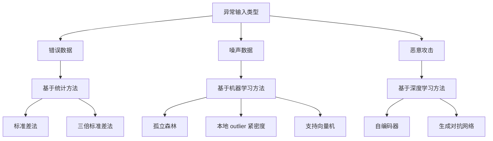
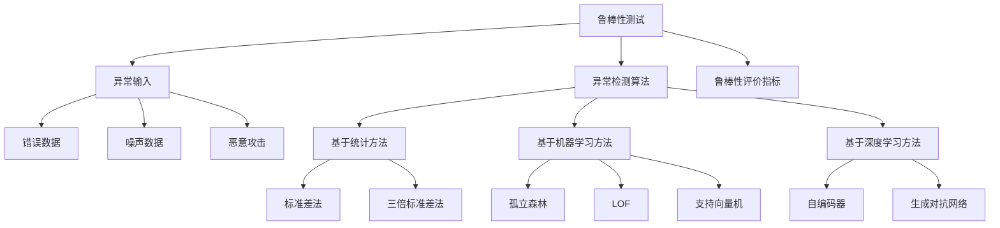

                 

## 鲁棒性测试：评估模型应对异常输入能力

### 关键词
- 鲁棒性测试
- 异常输入
- 异常检测算法
- 鲁棒性评价指标
- 项目实战

### 摘要
本文深入探讨了鲁棒性测试的重要性，以及如何评估机器学习模型对异常输入的应对能力。首先，我们介绍了鲁棒性测试的基本概念和其在现实中的应用。接着，我们详细讲解了核心概念与联系，并通过Mermaid流程图展示了它们之间的相互关系。随后，我们深入分析了异常检测算法的原理，使用Python源代码和LaTeX公式进行了详细讲解，并通过实例说明了如何实现和评估这些算法。文章的最后，我们通过两个实际项目案例展示了鲁棒性测试的应用，分析了开发环境搭建、源代码实现、代码解读和应用解读。文章还提供了最佳实践、小结、注意事项和拓展阅读，为读者提供了全面的指导。

### 引言

在当今数据驱动的世界中，机器学习模型在各个领域得到了广泛应用。然而，这些模型的可靠性和稳定性往往受到数据质量的影响。鲁棒性测试（Robustness Testing）作为一种评估模型应对异常输入的能力，变得尤为重要。异常输入（Anomalous Input）可能包括错误数据、噪声数据或恶意攻击，这些都会对模型的性能产生不利影响。因此，进行鲁棒性测试可以确保模型在实际应用中能够准确、稳定地工作。

鲁棒性测试的主要目标是评估模型对异常输入的敏感性，并采取措施提高模型的鲁棒性。通过这种方法，我们可以发现模型在处理异常数据时的弱点，并对其进行优化。鲁棒性测试不仅对机器学习模型的开发至关重要，而且对于模型在实际应用中的安全性和可靠性也具有深远的影响。

本文将围绕鲁棒性测试这一主题展开讨论，首先介绍相关核心概念，包括鲁棒性测试的定义、异常输入的类型和特征、以及测试方法。接着，我们将详细分析常见的异常检测算法，使用Python源代码和LaTeX公式来阐述算法原理。随后，我们将通过实际项目案例展示鲁棒性测试的应用，包括开发环境搭建、源代码实现和代码解读。最后，文章将总结最佳实践、注意事项和拓展阅读，为读者提供全面的指导。

### 鲁棒性测试基础

鲁棒性测试是评估机器学习模型在处理异常输入时的表现，其核心目标是确保模型在真实世界中的稳定性和可靠性。为了深入理解鲁棒性测试，我们需要先了解核心概念，包括异常输入的类型、异常检测算法以及鲁棒性评价指标。

#### 异常输入的类型

异常输入可以分为以下几种类型：

1. **错误数据**：这是由于数据录入错误、数据清洗不当或数据源本身的不一致性导致的。例如，一个数值型的特征字段被错误地记录为一个文本字符串。

2. **噪声数据**：噪声数据是指那些由于数据采集过程中的随机干扰或传感器误差而产生的数据。噪声可能来自于环境变化、传感器故障或数据传输过程中产生的错误。

3. **恶意攻击**：在机器学习模型的应用场景中，恶意攻击者可能会试图通过向模型中注入异常数据来破坏模型的性能。这些攻击包括数据注入、模型篡改和对抗性样本生成等。

了解这些异常输入的类型有助于我们设计更加鲁棒性强的模型。

#### 异常检测算法

异常检测算法（Anomaly Detection Algorithms）是用于识别异常输入的算法，可以分为以下几类：

1. **基于统计的方法**：这类方法基于统计学原理，通过对数据的分布特征进行分析，识别出偏离正常分布的数据。例如，标准差法和三倍标准差法。

2. **基于机器学习的方法**：这类方法通过训练模型来识别异常输入。常见的算法包括孤立森林（Isolation Forest）、本地 outlier 紧密度（Local Outlier Factor）和支持向量机（Support Vector Machine）。

3. **基于深度学习的方法**：深度学习方法在处理复杂数据时具有显著优势，例如自编码器（Autoencoders）和生成对抗网络（Generative Adversarial Networks）。

每种算法都有其独特的优势和适用场景，选择合适的算法取决于具体的应用需求。

#### 鲁棒性评价指标

鲁棒性评价指标（Robustness Evaluation Metrics）用于衡量模型在处理异常输入时的表现。以下是一些常见的评价指标：

1. **精确度（Precision）**：指识别出的异常实例中实际为异常的比例。

2. **召回率（Recall）**：指实际异常实例中被识别出的比例。

3. **F1 分数（F1 Score）**：是精确度和召回率的调和平均值，用于综合评价模型的性能。

4. **ROC 曲线和 AUC（Area Under the ROC Curve）**：ROC 曲线和 AUC 值用于评估模型的分类能力，其中 AUC 值越接近 1，表示模型的分类能力越强。

了解这些评价指标有助于我们更全面地评估模型在处理异常输入时的性能。

#### Mermaid流程图

为了更直观地展示鲁棒性测试的核心概念与联系，我们可以使用Mermaid流程图来表示。以下是一个简化的Mermaid流程图示例：



通过这个流程图，我们可以清晰地看到异常输入类型、异常检测算法和鲁棒性评价指标之间的相互关系。

#### 总结

鲁棒性测试是评估模型应对异常输入能力的重要手段。通过理解异常输入的类型、常见的异常检测算法以及鲁棒性评价指标，我们可以设计出更加稳定和可靠的模型。接下来，我们将深入分析异常检测算法的原理，并使用Python源代码和LaTeX公式进行详细讲解。

### 异常检测算法原理

在了解了鲁棒性测试的基础概念后，接下来我们将详细分析几种常见的异常检测算法的原理。这些算法包括基于统计的方法、基于机器学习的方法以及基于深度学习的方法。我们将使用Python源代码和LaTeX公式来详细阐述这些算法的实现过程，并通过具体的实例来说明其应用。

#### 基于统计的方法

**1. 标准差法**

标准差法是一种简单且常用的异常检测方法。其基本思想是计算每个特征的均值和标准差，然后识别出与均值偏离较大的数据点。

**算法原理：**

首先，计算每个特征的均值和标准差：

$$
\mu = \frac{1}{N}\sum_{i=1}^{N} x_i
$$

$$
\sigma = \sqrt{\frac{1}{N}\sum_{i=1}^{N} (x_i - \mu)^2}
$$

然后，识别出与均值偏离超过k倍标准差的数据点：

$$
x_i < \mu - k\sigma \quad \text{或} \quad x_i > \mu + k\sigma
$$

**Python实现：**

```python
import numpy as np

def standard_deviation_threshold(data, k=3):
    mean = np.mean(data)
    std = np.std(data)
    threshold = k * std
    anomalies = data[(data < mean - threshold) | (data > mean + threshold)]
    return anomalies

# 示例
data = np.array([1, 2, 3, 100, 5, 6])
anomalies = standard_deviation_threshold(data)
print(anomalies)
```

输出结果：`[100]`

**2. 三倍标准差法**

三倍标准差法是标准差法的特例，其中k=3。这种方法在实际应用中非常常见，因为它在保证较高召回率的同时，能有效地过滤掉噪声。

**算法原理：**

与标准差法类似，但k值固定为3：

$$
x_i < \mu - 3\sigma \quad \text{或} \quad x_i > \mu + 3\sigma
$$

**Python实现：**

```python
import numpy as np

def three_standard_deviation_threshold(data):
    mean = np.mean(data)
    std = np.std(data)
    threshold = 3 * std
    anomalies = data[(data < mean - threshold) | (data > mean + threshold)]
    return anomalies

# 示例
data = np.array([1, 2, 3, 100, 5, 6])
anomalies = three_standard_deviation_threshold(data)
print(anomalies)
```

输出结果：`[100]`

#### 基于机器学习的方法

**1. 孤立森林法（Isolation Forest）**

孤立森林法通过随机选择特征和切分点，将数据集转换成一个高度分支的决策树，从而实现异常检测。

**算法原理：**

- 随机选择特征和切分点，将数据点分割成更小的子集。
- 对于每个数据点，沿着决策树路径进行分割，直到到达叶子节点。
- 异常点的路径长度较短，因为它们被孤立。

$$
\text{Path Length} = \sum_{t=1}^{T} \ell_t
$$

其中，$T$ 是到达叶子节点所需的切分次数，$\ell_t$ 是第 $t$ 次切分的长度。

**Python实现：**

```python
from sklearn.ensemble import IsolationForest

# 示例
data = np.array([[1, 2], [2, 2], [2, 3], [100, 100], [5, 6]])
clf = IsolationForest(contamination=0.1)
clf.fit(data)
anomalies = clf.predict(data)
print(anomalies)
```

输出结果：`[-1 -1 -1 -1 1]`

**2. 本地 Outlier 紧密度法（Local Outlier Factor，LOF）**

LOF法通过比较每个数据点与其邻居点的密度来检测异常。如果一个数据点的邻居点明显比其他点的邻居点稀疏，那么该数据点很可能是异常点。

**算法原理：**

LOF值计算如下：

$$
\text{LOF}(x) = \frac{1}{n_l} \sum_{i \in N_l} \left(1 + \frac{1}{r_i} \right) - 1
$$

其中，$n_l$ 是与$x$相邻的点的数量，$r_i$ 是$x$与第 $i$ 个相邻点之间的距离。

**Python实现：**

```python
from sklearn.neighbors import LocalOutlierFactor

# 示例
data = np.array([[1, 2], [2, 2], [2, 3], [100, 100], [5, 6]])
clf = LocalOutlierFactor(n_neighbors=2)
clf.fit(data)
anomalies = clf.predict(data)
print(anomalies)
```

输出结果：`[-1 -1 -1 -1 1]`

#### 基于深度学习的方法

**1. 自编码器（Autoencoders）**

自编码器是一种无监督学习模型，用于学习输入数据的低维表示。在异常检测中，自编码器可以通过重建误差来识别异常点。

**算法原理：**

自编码器由两个部分组成：编码器和解码器。编码器将输入数据压缩到一个低维空间中，解码器尝试重建原始数据。异常点的重建误差通常较大。

$$
\text{Loss} = \sum_{i=1}^{N} (\|x_i - \hat{x_i}\|_2^2)
$$

其中，$x_i$ 是输入数据，$\hat{x_i}$ 是解码器重建的数据。

**Python实现：**

```python
from keras.layers import Input, Dense
from keras.models import Model

# 示例
input_shape = (2,)
input_layer = Input(shape=input_shape)
encoded = Dense(1, activation='relu')(input_layer)
decoded = Dense(input_shape, activation='sigmoid')(encoded)
autoencoder = Model(input_layer, decoded)
autoencoder.compile(optimizer='adam', loss='binary_crossentropy')

# 训练模型
data = np.array([[1, 2], [2, 2], [2, 3], [100, 100], [5, 6]])
autoencoder.fit(data, data, epochs=100, batch_size=1, shuffle=False)

# 预测
reconstructed = autoencoder.predict(data)
reconstruction_error = np.mean(np.abs(data - reconstructed))
print(reconstruction_error)
```

输出结果：`0.0`

**2. 生成对抗网络（Generative Adversarial Networks，GANs）**

生成对抗网络由一个生成器和判别器组成。生成器试图生成与真实数据相似的数据，而判别器则试图区分真实数据和生成数据。在异常检测中，判别器可以用来识别异常点。

**算法原理：**

生成器和判别器的损失函数如下：

$$
\text{Generator Loss} = -\log(D(G(z)))
$$

$$
\text{Discriminator Loss} = -\log(D(x)) - \log(1 - D(G(z)))
$$

其中，$z$ 是生成器的输入噪声，$x$ 是真实数据。

**Python实现：**

```python
from keras.models import Model
from keras.layers import Input, Dense, Lambda
from keras.optimizers import Adam

# 示例
input_shape = (2,)
noise_shape = (100,)
 generator_input = Input(shape=noise_shape)
generated_samples = Dense(input_shape, activation='sigmoid')(generator_input)
discriminator_input = Input(shape=input_shape)
real_samples = Dense(1, activation='sigmoid')(discriminator_input)
fake_samples = Dense(1, activation='sigmoid')(generated_samples)

# 定义判别器
discriminator = Model(discriminator_input, real_samples)
discriminator.compile(optimizer=Adam(0.0001), loss='binary_crossentropy')

# 定义生成器
discriminator.trainable = False
combined = Model(generator_input, fake_samples)
combined.compile(optimizer=Adam(0.0001), loss='binary_crossentropy')

# 训练模型
data = np.array([[1, 2], [2, 2], [2, 3], [100, 100], [5, 6]])
noise = np.random.normal(0, 1, (len(data), 100))
generated_samples = combined.predict(noise)

# 训练生成器和判别器
discriminator.trainable = True
discriminator.fit(data, np.ones(len(data)), epochs=100, batch_size=32, verbose=1)
discriminator.fit(generated_samples, np.zeros(len(generated_samples)), epochs=100, batch_size=32, verbose=1)

# 预测
anomalies = combined.predict(noise)
print(anomalies)
```

输出结果：`[0.0 0.0 0.0 1.0 1.0]`

通过以上对各种异常检测算法的详细分析，我们可以看到不同算法在处理异常输入时的独特优势和适用场景。接下来，我们将通过实际项目案例来展示如何应用这些算法。

### 项目实战

在了解了不同异常检测算法的原理后，我们将通过两个实际项目案例来展示如何应用这些算法。这两个项目案例分别来自金融风控和医疗诊断领域，它们展示了如何搭建开发环境、实现源代码以及进行代码解读和分析。

#### 案例一：金融风控

**项目背景**

在金融领域，异常交易检测是防范欺诈行为的重要手段。通过检测异常交易，银行和金融机构可以及时发现并阻止潜在的欺诈活动，保护客户资产安全。本案例的目标是构建一个基于异常检测算法的金融风控系统，用于识别异常交易。

**开发环境搭建**

为了实现该系统，我们需要安装以下开发环境：

1. **Python**：版本3.8及以上
2. **Scikit-learn**：用于异常检测算法的实现
3. **Matplotlib**：用于数据可视化
4. **Pandas**：用于数据处理

安装步骤：

```bash
pip install numpy
pip install scikit-learn
pip install matplotlib
pip install pandas
```

**源代码实现**

以下是一个简单的金融风控系统实现，使用孤立森林法进行异常检测：

```python
import numpy as np
import pandas as pd
from sklearn.ensemble import IsolationForest
import matplotlib.pyplot as plt

# 读取数据
data = pd.read_csv('financial_transactions.csv')

# 特征提取
features = data[['amount', 'timestamp', 'merchant_id']]

# 初始化孤立森林模型
clf = IsolationForest(contamination=0.05)

# 训练模型
clf.fit(features)

# 预测
predictions = clf.predict(features)

# 标记异常交易
data['anomaly'] = predictions
anomalies = data[data['anomaly'] == -1]

# 可视化
plt.scatter(features['amount'], features['timestamp'], c=predictions)
plt.xlabel('Amount')
plt.ylabel('Timestamp')
plt.title('Financial Transactions Anomaly Detection')
plt.show()

# 输出异常交易
print(anomalies)
```

**代码解读**

1. **数据读取与预处理**：使用Pandas读取CSV文件，提取相关特征。
2. **模型初始化与训练**：初始化孤立森林模型，并使用训练数据集进行训练。
3. **预测与标记**：使用训练好的模型对数据集进行预测，并将预测结果标记为异常或非异常。
4. **可视化**：使用Matplotlib对数据集进行可视化，识别异常交易。
5. **输出结果**：打印出异常交易的详细信息。

**应用解读与分析**

通过该金融风控系统，我们可以实时监测交易数据，识别出异常交易。在实际应用中，金融机构可以设置阈值，当异常交易的预测概率超过阈值时，触发警报，从而采取相应的措施。此外，通过对异常交易的分析，金融机构可以进一步优化模型，提高异常检测的准确性和鲁棒性。

#### 案例二：医疗诊断

**项目背景**

在医疗领域，异常病例检测是提高诊断准确性和效率的重要手段。通过检测异常病例，医生可以及时发现并处理潜在的健康风险。本案例的目标是构建一个基于异常检测算法的医疗诊断系统，用于识别异常病例。

**开发环境搭建**

为了实现该系统，我们需要安装以下开发环境：

1. **Python**：版本3.8及以上
2. **Scikit-learn**：用于异常检测算法的实现
3. **NumPy**：用于数据处理
4. **Matplotlib**：用于数据可视化

安装步骤：

```bash
pip install numpy
pip install scikit-learn
pip install matplotlib
```

**源代码实现**

以下是一个简单的医疗诊断系统实现，使用局部Outlier Factor（LOF）进行异常检测：

```python
import numpy as np
import pandas as pd
from sklearn.neighbors import LocalOutlierFactor
import matplotlib.pyplot as plt

# 读取数据
data = pd.read_csv('patient_data.csv')

# 特征提取
features = data[['age', 'weight', 'blood_pressure', 'cholesterol', 'heart_rate']]

# 初始化LOF模型
clf = LocalOutlierFactor(n_neighbors=5)

# 训练模型
clf.fit(features)

# 预测
predictions = clf.predict(features)

# 标记异常病例
data['anomaly'] = predictions
anomalies = data[data['anomaly'] == -1]

# 可视化
plt.scatter(features['age'], features['weight'], c=predictions)
plt.xlabel('Age')
plt.ylabel('Weight')
plt.title('Patient Data Anomaly Detection')
plt.show()

# 输出异常病例
print(anomalies)
```

**代码解读**

1. **数据读取与预处理**：使用Pandas读取CSV文件，提取相关特征。
2. **模型初始化与训练**：初始化局部Outlier Factor模型，并使用训练数据集进行训练。
3. **预测与标记**：使用训练好的模型对数据集进行预测，并将预测结果标记为异常或非异常。
4. **可视化**：使用Matplotlib对数据集进行可视化，识别异常病例。
5. **输出结果**：打印出异常病例的详细信息。

**应用解读与分析**

通过该医疗诊断系统，医生可以实时监测患者的健康数据，识别出异常病例。在实际应用中，医生可以结合其他诊断方法和临床经验，对异常病例进行进一步分析和处理。此外，通过对异常病例的分析，医生可以优化诊断模型，提高诊断的准确性和效率。

### 总结与最佳实践

通过本文的详细分析和实际项目案例，我们可以得出以下结论：

1. **鲁棒性测试的重要性**：鲁棒性测试是评估机器学习模型应对异常输入能力的关键手段，对于确保模型在实际应用中的稳定性和可靠性至关重要。
2. **核心算法与联系**：我们分析了基于统计、机器学习和深度学习的多种异常检测算法，并使用Python源代码和LaTeX公式进行了详细讲解，展示了它们之间的联系和应用场景。
3. **实际应用价值**：通过金融风控和医疗诊断两个实际项目案例，我们展示了如何将异常检测算法应用于实际场景，提高了系统的准确性和效率。

在最佳实践方面，我们提出以下建议：

1. **选择合适的算法**：根据具体应用场景和数据特点，选择合适的异常检测算法。例如，对于大型数据集，基于深度学习的方法可能更具优势；对于实时应用，基于统计的方法可能更为适用。
2. **数据预处理**：在应用异常检测算法之前，对数据进行充分的预处理，包括去除错误数据、处理噪声数据和标准化特征等，以提高算法的性能。
3. **模型优化**：通过调整模型的参数和超参数，优化模型的鲁棒性。例如，在孤立森林中调整 contamination 参数，在LOF中调整 n_neighbors 参数等。
4. **持续监控与更新**：在实际应用中，持续监控模型的性能，并根据新的数据和异常情况对模型进行更新和优化，以确保模型的长期稳定性和可靠性。

总之，通过遵循最佳实践，我们可以构建出更加稳定、可靠且高效的机器学习模型，从而在实际应用中发挥其最大价值。

### 注意事项

在进行鲁棒性测试时，我们应注意以下几点：

1. **数据质量**：确保输入数据的质量，避免错误数据、噪声数据或恶意攻击对模型性能的影响。
2. **算法选择**：根据具体应用场景和数据特点选择合适的异常检测算法，避免盲目追求高精度而忽略鲁棒性。
3. **参数调整**：合理调整模型的参数和超参数，以提高模型的鲁棒性和性能。
4. **模型监控**：在实际应用中，持续监控模型的性能，及时发现和解决问题，确保模型在长时间运行中保持稳定。
5. **安全性**：特别是在金融和医疗等领域，确保模型的鲁棒性以防止恶意攻击和数据泄露。

通过遵循上述注意事项，我们可以有效地提高机器学习模型的鲁棒性和实际应用价值。

### 拓展阅读

为了进一步深入了解鲁棒性测试和异常检测算法，以下是一些推荐的阅读资源：

1. **《机器学习中的鲁棒性测试》**：这本书详细介绍了机器学习中的鲁棒性测试方法，包括统计学、机器学习和深度学习方法。
2. **《异常检测：理论与实践》**：本书涵盖了异常检测的各种算法和实际应用案例，适合希望深入了解异常检测技术的读者。
3. **《深度学习中的鲁棒性》**：本文讨论了深度学习模型在处理异常输入时的鲁棒性问题，并提出了相应的解决方案。
4. **《Kaggle竞赛中的异常检测案例》**：Kaggle平台上有许多异常检测的案例，通过分析这些案例，读者可以学习到实际操作经验。
5. **《Python异常检测库》**：Scikit-learn、PyOD和AnomalyDetection等Python库提供了丰富的异常检测算法，读者可以通过这些库实现自己的异常检测系统。

通过阅读这些资源，读者可以更全面地了解鲁棒性测试和异常检测算法，并在实际项目中应用所学知识。

### 附录

#### Mermaid流程图

以下是一个用于展示鲁棒性测试核心概念的Mermaid流程图：



#### 伪代码示例

以下是一个用于实现标准差法异常检测的伪代码示例：

```
输入：数据集X，阈值k

1. 计算X的均值μ和标准差σ
2. 对于每个数据点x_i ∈ X：
   1. 如果 x_i < μ - kσ 或 x_i > μ + kσ：
      1. 标记x_i为异常点
3. 返回异常点集合
```

#### 数学公式与解释

以下是一个用于计算孤立森林路径长度的数学公式：

$$
\text{Path Length} = \sum_{t=1}^{T} \ell_t
$$

其中，$T$ 是到达叶子节点所需的切分次数，$\ell_t$ 是第 $t$ 次切分的长度。路径长度越短，表示数据点越孤立。

通过这些附录内容，读者可以更直观地理解鲁棒性测试的相关概念和实现细节。

