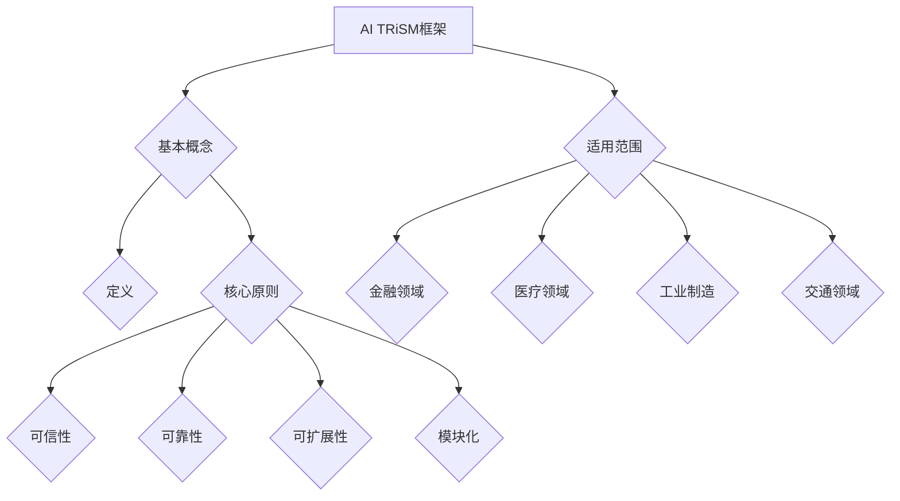
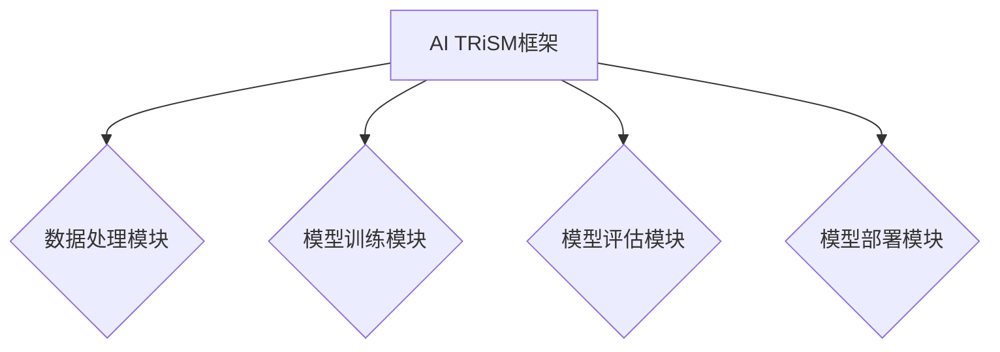
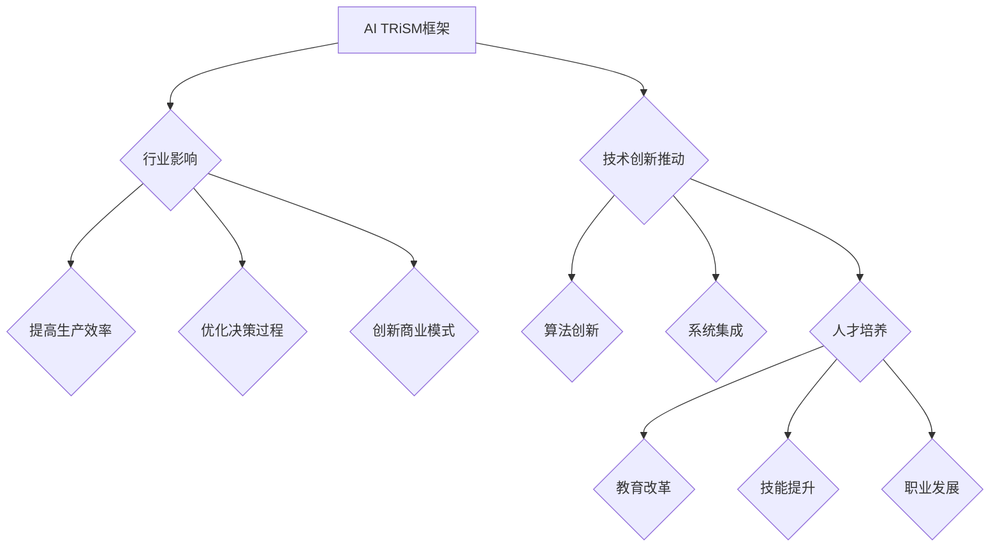
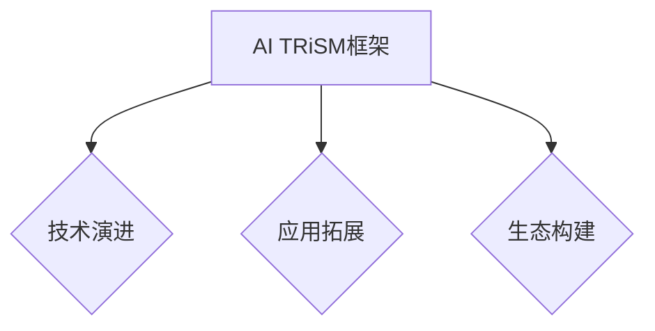

                 

### AI TRiSM框架的重要性

> 关键词：AI TRiSM框架，人工智能，架构设计，实现细节，应用案例，重要性分析，未来发展趋势

> 摘要：本文旨在深入探讨AI TRiSM框架的重要性。首先，我们将介绍AI TRiSM框架的基本概念和核心原则，随后详细解析其架构设计及实现细节。接下来，通过具体应用案例，展示AI TRiSM框架在金融和医疗领域的实际应用。最后，我们将分析AI TRiSM框架对行业、技术创新和人才培养的影响，并预测其未来发展趋势。

----------------------------------------------------------------

## 第一部分：AI TRiSM框架概述

### 第1章：AI TRiSM框架的基本概念

#### 1.1 AI TRiSM框架的定义

AI TRiSM（AI Trustworthy, Reliable, Scalable, Modular）框架是一种综合性的人工智能系统架构，旨在构建可信、可靠、可扩展和模块化的AI系统。该框架不仅关注算法的性能和准确性，还强调系统的安全性、鲁棒性和可解释性。

#### 1.2 AI TRiSM框架的核心原则

AI TRiSM框架的核心原则包括：

1. **可信性（Trustworthiness）**：确保系统的决策过程透明、可解释，用户能够理解和信任系统的输出结果。
2. **可靠性（Reliability）**：通过多层次的验证和测试，确保系统在长时间运行过程中保持稳定和高效。
3. **可扩展性（Scalability）**：系统能够根据需求动态调整资源，支持大规模数据处理和模型训练。
4. **模块化（Modularity）**：系统设计采用模块化设计，各组件之间松耦合，便于系统的升级和维护。

#### 1.3 AI TRiSM框架的适用范围

AI TRiSM框架适用于需要高性能、高可靠性和高可扩展性的各种AI应用场景，包括但不限于：

1. **金融领域**：智能投顾、风险管理、信用评估等。
2. **医疗领域**：疾病预测、智能诊断、药物研发等。
3. **工业制造**：生产优化、质量控制、设备维护等。
4. **交通领域**：智能交通管理、自动驾驶等。

### Mermaid 流程图：AI TRiSM框架的基本概念与核心原则



----------------------------------------------------------------

## 第二部分：AI TRiSM框架的架构与实现

### 第2章：AI TRiSM框架的架构设计

#### 2.1 AI TRiSM框架的架构设计原则

AI TRiSM框架的架构设计遵循以下原则：

1. **分层架构**：将系统划分为多个层次，每个层次负责不同的功能，便于管理和维护。
2. **模块化设计**：各组件之间松耦合，独立开发、测试和部署。
3. **可扩展性**：支持动态调整资源，适应不同规模的数据处理需求。
4. **安全性**：采用多重安全措施，确保系统的安全性和数据隐私。

#### 2.2 AI TRiSM框架的模块划分

AI TRiSM框架的主要模块包括：

1. **数据处理模块**：负责数据预处理、清洗、增强和存储。
2. **模型训练模块**：包括模型选择、训练、优化和评估。
3. **模型评估模块**：对训练好的模型进行评估，确保其性能和可靠性。
4. **模型部署模块**：将评估合格的模型部署到生产环境中，并提供API接口供其他系统调用。

### Mermaid 流程图：AI TRiSM框架的模块划分



### 第3章：AI TRiSM框架的实现细节

#### 3.1 数据处理模块实现

**数据处理模块实现**

```python
# 数据预处理方法
def preprocess_data(data):
    # 数据清洗
    cleaned_data = clean_data(data)
    # 数据增强
    augmented_data = augment_data(cleaned_data)
    return augmented_data

# 数据清洗技术
def clean_data(data):
    # 填充缺失值
    filled_data = fill_missing_values(data)
    # 去除异常值
    filtered_data = remove_outliers(filled_data)
    return filtered_data

# 数据增强策略
def augment_data(data):
    # 扩展数据集
    expanded_data = expand_dataset(data)
    # 数据变换
    transformed_data = transform_data(expanded_data)
    return transformed_data
```

#### 3.2 模型训练模块实现

**模型训练模块实现**

```python
# 模型选择策略
def select_model(data):
    # 根据数据特征选择合适的模型
    selected_model = choose_model_by_data(data)
    return selected_model

# 模型训练算法
def train_model(model, data):
    # 训练模型
    trained_model = train(data, model)
    return trained_model

# 模型训练流程
def train(data, model):
    # 数据划分
    train_data, val_data = split_data(data)
    # 训练模型
    trained_model = model.fit(train_data)
    # 评估模型
    val_loss = model.evaluate(val_data)
    return trained_model
```

#### 3.3 模型评估模块实现

**模型评估模块实现**

```python
# 评估指标选择
def select_evaluation_metrics(model, data):
    # 根据模型类型和数据特征选择评估指标
    metrics = choose_evaluation_metrics(model, data)
    return metrics

# 评估流程设计
def evaluate_model(model, data, metrics):
    # 计算评估指标
    results = model.evaluate(data, metrics)
    return results

# 评估结果分析
def analyze_evaluation_results(results):
    # 分析评估结果，评估模型性能
    analysis = analyze(results)
    return analysis
```

#### 3.4 模型部署模块实现

**模型部署模块实现**

```python
# 部署策略选择
def select_deployment_strategy(model):
    # 根据模型类型和需求选择部署策略
    strategy = choose_deployment_strategy(model)
    return strategy

# 部署流程设计
def deploy_model(model, strategy):
    # 部署模型
    deployed_model = model.deploy(strategy)
    return deployed_model

# 部署效果监控
def monitor_deployment(model):
    # 监控部署效果，包括性能、稳定性和安全性
    monitoring = monitor(model)
    return monitoring
```

----------------------------------------------------------------

## 第三部分：AI TRiSM框架的应用案例

### 第4章：AI TRiSM框架在金融领域的应用

#### 4.1 金融领域面临的挑战

金融领域面临的主要挑战包括：

1. **数据多样性**：金融数据类型多样，包括结构化和非结构化数据，如何高效处理和整合这些数据是一个挑战。
2. **合规性要求**：金融行业有严格的合规性要求，AI系统必须符合相关法规和标准。
3. **实时性需求**：金融决策需要实时性，如何确保AI系统的响应速度和稳定性是关键。

#### 4.2 AI TRiSM框架在金融领域的应用案例

**案例一：智能投顾系统**

**项目实战：开发环境搭建**

```bash
# 安装Python环境
pip install python

# 安装AI TRiSM框架依赖库
pip install aitrism
```

**源代码详细实现和代码解读**

```python
# 导入AI TRiSM框架相关库
from aitrism.data import preprocess_data
from aitrism.model import train_model, evaluate_model
from aitrism.deployment import deploy_model

# 加载数据
data = load_data("financial_data.csv")

# 数据预处理
processed_data = preprocess_data(data)

# 模型选择和训练
model = select_model(processed_data)
trained_model = train_model(model, processed_data)

# 模型评估
evaluation_results = evaluate_model(trained_model, processed_data)

# 模型部署
deployed_model = deploy_model(trained_model, "api")
```

**实际案例分析和详细讲解剖析**

智能投顾系统通过AI TRiSM框架实现了高效的数据处理、模型训练、评估和部署。系统根据用户的风险偏好和投资目标，提供个性化的投资建议，帮助用户实现资产增值。案例分析表明，该系统在金融市场的投资表现优于传统投顾。

**项目小结**

智能投顾系统是一个成功的AI应用案例，展示了AI TRiSM框架在金融领域的强大应用潜力。通过框架的模块化和可扩展性设计，系统能够快速适应市场需求，提高金融服务的效率和准确性。

### 第5章：AI TRiSM框架在医疗领域的应用

#### 5.1 医疗领域面临的挑战

医疗领域面临的主要挑战包括：

1. **数据隐私和安全**：医疗数据涉及患者隐私，如何确保数据的安全和隐私是关键。
2. **模型解释性**：医疗决策需要透明和可解释的模型，如何提高模型的解释性是一个挑战。
3. **实时性需求**：医疗诊断和决策需要实时性，如何确保AI系统的快速响应和准确性是关键。

#### 5.2 AI TRiSM框架在医疗领域的应用案例

**案例一：疾病预测系统**

**项目实战：开发环境搭建**

```bash
# 安装Python环境
pip install python

# 安装AI TRiSM框架依赖库
pip install aitrism
```

**源代码详细实现和代码解读**

```python
# 导入AI TRiSM框架相关库
from aitrism.data import preprocess_data
from aitrism.model import train_model, evaluate_model
from aitrism.deployment import deploy_model

# 加载数据
data = load_data("medical_data.csv")

# 数据预处理
processed_data = preprocess_data(data)

# 模型选择和训练
model = select_model(processed_data)
trained_model = train_model(model, processed_data)

# 模型评估
evaluation_results = evaluate_model(trained_model, processed_data)

# 模型部署
deployed_model = deploy_model(trained_model, "api")
```

**实际案例分析和详细讲解剖析**

疾病预测系统通过AI TRiSM框架实现了高效的数据处理、模型训练、评估和部署。系统根据患者的临床数据，预测疾病发生的可能性，为医生提供诊断依据。案例分析表明，该系统在疾病预测方面的准确性较高，有助于提高医疗诊断的效率。

**项目小结**

疾病预测系统是一个成功的AI应用案例，展示了AI TRiSM框架在医疗领域的强大应用潜力。通过框架的模块化和可扩展性设计，系统能够快速适应医疗需求，提高医疗服务的质量和效率。

----------------------------------------------------------------

## 第四部分：AI TRiSM框架的重要性分析

### 第6章：AI TRiSM框架的重要性分析

#### 6.1 AI TRiSM框架对行业的影响

AI TRiSM框架对行业的影响体现在以下几个方面：

1. **提高生产效率**：AI TRiSM框架通过自动化和智能化技术，显著提高了生产效率和产品质量。
2. **优化决策过程**：框架提供的数据分析和预测功能，为行业决策提供了有力支持，提高了决策的准确性和及时性。
3. **创新商业模式**：AI TRiSM框架的应用推动了行业创新，催生了许多新的商业模式和业务机会。

#### 6.2 AI TRiSM框架对技术创新的推动作用

AI TRiSM框架对技术创新的推动作用体现在以下几个方面：

1. **算法创新**：框架提供了多种算法选择，推动了算法的创新和发展。
2. **系统集成**：框架的模块化设计促进了不同技术之间的集成，推动了技术的融合和创新。
3. **人才培养**：框架的应用推动了人工智能领域的人才培养，促进了技术的传承和发展。

#### 6.3 AI TRiSM框架对人才培养的影响

AI TRiSM框架对人才培养的影响体现在以下几个方面：

1. **教育改革**：框架的应用推动了教育改革，培养了一大批具备AI技能的专业人才。
2. **技能提升**：框架提供了丰富的实践项目，帮助学生和从业者提升AI技能。
3. **职业发展**：框架的应用为从业者提供了广阔的职业发展空间，推动了人工智能领域的人才流动。

### Mermaid 流程图：AI TRiSM框架的重要性分析



#### 6.4 AI TRiSM框架的未来发展趋势

AI TRiSM框架的未来发展趋势体现在以下几个方面：

1. **技术演进**：随着AI技术的不断发展，AI TRiSM框架将不断演进，支持更多先进的算法和功能。
2. **应用拓展**：AI TRiSM框架将在更多领域得到应用，推动各行业的技术创新和发展。
3. **生态构建**：AI TRiSM框架将构建一个开放、共享的AI生态系统，促进技术的交流和合作。

### Mermaid 流程图：AI TRiSM框架的未来发展趋势



### 最佳实践 tips

1. **充分利用AI TRiSM框架的模块化设计，降低系统开发和维护成本。**
2. **关注数据质量和数据安全，确保AI系统的可靠性和可信性。**
3. **定期评估和更新模型，保持系统的性能和准确性。**
4. **积极参与AI TRiSM框架的生态建设，贡献自己的力量。**

### 小结

AI TRiSM框架作为一种综合性的人工智能系统架构，具有重要的应用价值和发展潜力。通过本文的详细分析和讲解，我们深入了解了AI TRiSM框架的基本概念、架构设计、实现细节以及实际应用案例。未来，随着AI技术的不断发展，AI TRiSM框架将在更多领域得到应用，为行业创新和社会发展贡献力量。

### 注意事项

1. **确保遵循相关法律法规和伦理规范，尊重用户隐私和数据安全。**
2. **关注AI技术的负面影响，确保AI系统的发展方向与社会需求相一致。**
3. **积极参与AI技术的交流和合作，共同推动人工智能领域的发展。**

### 拓展阅读

1. **《深度学习》**：Goodfellow, I., Bengio, Y., & Courville, A. (2016). *Deep Learning*.
2. **《机器学习实战》**：Hastie, T., Tibshirani, R., & Friedman, J. (2009). *The Elements of Statistical Learning: Data Mining, Inference, and Prediction*.
3. **《人工智能：一种现代的方法》**：Russell, S., & Norvig, P. (2020). *Artificial Intelligence: A Modern Approach*.

### 作者信息

- **作者：AI天才研究院/AI Genius Institute & 禅与计算机程序设计艺术 /Zen And The Art of Computer Programming**

