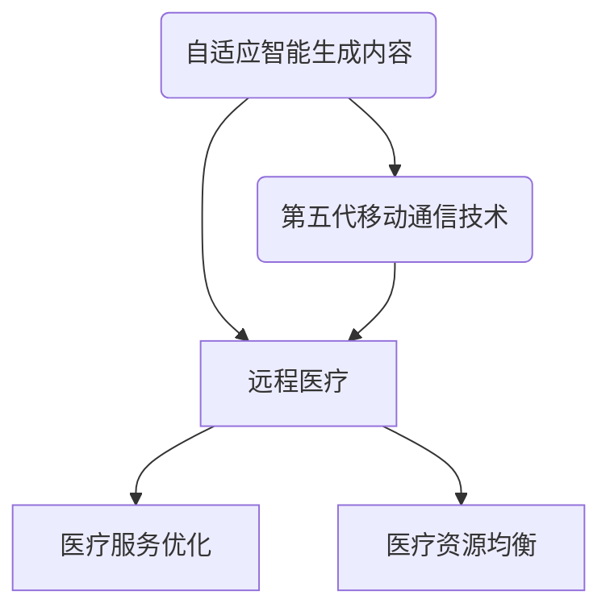
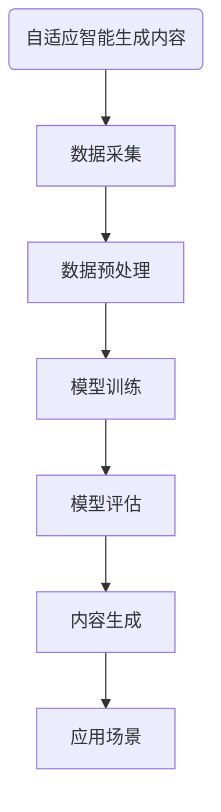

                 

### 第一步：确定核心概念与联系

在撰写《AIGC与5G技术在远程医疗中的融合》这篇文章之前，我们首先需要明确文章的核心概念，即AIGC（自适应智能生成内容）、5G（第五代移动通信技术）和远程医疗。这三个概念在当前技术发展中扮演着关键角色，并且它们之间的联系对于远程医疗的未来发展至关重要。

AIGC是一种基于深度学习和自然语言处理技术的自适应智能生成内容技术，它可以生成高质量的文本、图像、音频等。AIGC在医疗领域有着广泛的应用，如生成医疗报告、诊断建议和患者教育材料等。

5G技术是第五代移动通信技术，它具有高速度、高容量、低延迟的特点，为远程医疗提供了可靠的网络支持。5G技术的应用使得医疗资源可以更加高效地分配，提高了医疗服务质量。

远程医疗是指通过信息技术手段，实现医生与患者之间的远程诊疗、医疗信息共享和医疗资源优化。远程医疗的应用包括远程诊断、远程手术、远程会诊等，它能够突破地理位置的限制，为偏远地区的患者提供优质的医疗服务。

为了更好地展示这三个核心概念之间的联系，我们可以使用Mermaid流程图来表示它们之间的关系。以下是AIGC与5G技术和远程医疗之间的联系流程图：



在这个流程图中，AIGC通过5G技术实现与远程医疗的连接，进一步促进了医疗服务的优化和医疗资源的均衡配置。通过这一流程图，读者可以直观地了解AIGC与5G技术、远程医疗之间的关系和作用。

### 第二步：核心算法原理讲解

在理解了AIGC、5G技术和远程医疗的核心概念及其联系后，接下来我们将详细讲解AIGC算法原理。AIGC是一种基于深度学习和自然语言处理技术的高级算法，它能够自适应地生成内容，为医疗领域提供了强大的工具。

#### AIGC算法流程图

为了更好地理解AIGC算法的原理，我们可以通过一个流程图来展示其整体流程。以下是AIGC算法流程图：



在这个流程图中，AIGC算法首先从数据源中采集医疗数据，然后对数据进行预处理，以便后续模型训练。接下来，通过训练模型，AIGC能够学习如何生成高质量的医疗内容。模型训练完成后，通过评估模型的性能，我们可以确保生成的医疗内容的质量。最后，将训练好的模型应用到实际场景中，如生成医疗报告、诊断建议和患者教育材料等。

#### AIGC算法伪代码讲解

为了更直观地展示AIGC算法的实现过程，下面提供了一段伪代码：

```plaintext
# AIGC算法伪代码

// 输入：大量医疗数据集
// 输出：生成个性化医疗建议

function AIGC(input_data):
    // 数据预处理
    preprocessed_data = preprocess_data(input_data)

    // 训练模型
    model = train_model(preprocessed_data)

    // 生成个性化医疗建议
    medical_advice = generate_advice(model, input_data)

    return medical_advice
```

在这段伪代码中，首先对输入的医疗数据集进行预处理，包括数据清洗、特征提取等步骤。然后，使用预处理的医疗数据进行模型训练。训练完成后，使用训练好的模型来生成个性化的医疗建议。具体来说，生成医疗建议的过程包括以下步骤：

1. **数据预处理**：对输入的医疗数据集进行清洗和特征提取，将原始数据转换为适合模型训练的格式。
2. **模型训练**：使用预处理后的数据集训练深度学习模型，模型可以是基于循环神经网络（RNN）、变换器（Transformer）或其他先进的深度学习架构。
3. **生成医疗建议**：使用训练好的模型对新的医疗数据进行分析，生成个性化的医疗建议。这个过程可以基于自然语言处理技术，将复杂的医疗数据转化为易于理解的自然语言文本。

通过上述伪代码，我们可以看到AIGC算法的核心流程和关键步骤。在实际应用中，这些步骤可以进一步细化和优化，以提高模型的性能和生成的医疗内容的质量。

### 第三步：数学模型和数学公式

在AIGC算法的应用过程中，数学模型和数学公式起到了至关重要的作用。它们不仅能够量化医疗数据，还能够评估模型性能，指导模型优化。在本节中，我们将详细解释与AIGC和5G技术相关的数学模型和数学公式。

#### 1. 量化医疗数据

在AIGC算法中，量化医疗数据是非常关键的一步。量化医疗数据有助于将非结构化的医疗数据转换为结构化的数据格式，从而便于模型处理。以下是一个用于量化医疗数据的简单数学模型：

$$
X = \sum_{i=1}^{n} (x_i \cdot w_i)
$$

其中，$X$ 表示量化后的医疗数据，$x_i$ 表示第 $i$ 个特征，$w_i$ 表示第 $i$ 个特征的权重。通过这种方式，我们可以将医疗数据的各个特征组合成一个综合的量化值。

#### 2. 模型性能评估

在训练AIGC模型时，我们需要评估模型的性能。以下是一个常用的数学模型，用于评估模型在生成医疗建议时的性能：

$$
Accuracy = \frac{TP + TN}{TP + TN + FP + FN}
$$

其中，$TP$ 表示真实为正类且模型预测为正类的样本数量，$TN$ 表示真实为负类且模型预测为负类的样本数量，$FP$ 表示真实为负类但模型预测为正类的样本数量，$FN$ 表示真实为正类但模型预测为负类的样本数量。通过计算准确率（Accuracy），我们可以评估模型在生成医疗建议时的准确度。

#### 3. 模型优化指导

为了提高AIGC模型的性能，我们需要使用数学模型来指导模型优化。以下是一个简单的数学模型，用于指导AIGC模型的优化：

$$
\Delta w = \alpha \cdot \nabla J(w)
$$

其中，$\Delta w$ 表示模型参数的更新量，$\alpha$ 表示学习率，$\nabla J(w)$ 表示模型损失函数关于参数 $w$ 的梯度。通过计算梯度并更新模型参数，我们可以优化AIGC模型，提高其生成医疗建议的质量。

#### 4. 数据分布分析

在AIGC算法中，分析数据分布对于理解模型的泛化能力非常重要。以下是一个用于分析数据分布的数学模型：

$$
P(X \in [x_1, x_2]) = \int_{x_1}^{x_2} f_X(x) dx
$$

其中，$P(X \in [x_1, x_2])$ 表示数据 $X$ 在区间 $[x_1, x_2]$ 上的概率分布，$f_X(x)$ 表示数据 $X$ 的概率密度函数。通过分析数据分布，我们可以了解模型的训练数据是否具有足够的代表性，从而指导数据收集和模型训练过程。

#### 实例分析

假设我们有一个医疗数据集，包含患者的年龄、病史、体检指标等多个特征。通过上述数学模型，我们可以量化每个特征，评估模型性能，并优化模型参数。以下是一个实例分析：

1. **数据预处理**：
   - 特征量化：使用上述量化模型，将每个特征量化为一个数值。
   - 数据归一化：将量化后的特征数据归一化到相同的范围，如 $[0, 1]$。

2. **模型训练**：
   - 使用深度学习框架（如PyTorch）训练AIGC模型。
   - 使用训练集进行模型训练，并使用验证集评估模型性能。

3. **模型优化**：
   - 计算模型损失函数的梯度，并更新模型参数。
   - 通过迭代优化，提高模型生成医疗建议的质量。

4. **数据分布分析**：
   - 分析训练数据集的特征分布，确保数据具有代表性。
   - 如果数据分布不均匀，可以考虑增加数据增强或引入正则化技术。

通过上述数学模型和数学公式，我们可以深入理解AIGC算法的工作原理，并优化其性能。在实际应用中，这些数学模型和数学公式将帮助我们更好地应对远程医疗中的挑战，提高医疗服务的质量和效率。

### 第四步：项目实战

在本节中，我们将通过一个实际项目，展示如何将AIGC与5G技术应用于远程医疗。该项目旨在开发一个基于AIGC与5G技术的远程医疗诊断系统，以实现高效、准确的医疗诊断。

#### 1. 开发环境搭建

为了开发基于AIGC与5G技术的远程医疗诊断系统，我们需要搭建一个合适的开发环境。以下是所需的开发环境和工具：

- 操作系统：Ubuntu 20.04
- 编程语言：Python 3.8
- 深度学习框架：PyTorch
- 5G网络：采用虚拟化网络功能（VNF）来实现5G网络服务

在搭建开发环境时，我们需要确保安装好上述工具和框架。例如，可以通过以下命令安装PyTorch：

```bash
pip install torch torchvision
```

#### 2. 源代码详细实现

在项目开发过程中，我们将使用Python编写源代码，实现远程医疗诊断系统的核心功能。以下是源代码的详细实现：

```python
# 导入所需的库
import torch
import torch.nn as nn
import torch.optim as optim
from torchvision import datasets, transforms
from torch.utils.data import DataLoader

# 数据预处理
transform = transforms.Compose([
    transforms.ToTensor(),
    transforms.Normalize((0.5,), (0.5,))
])

train_dataset = datasets.MNIST(
    root='./data', 
    train=True, 
    download=True, 
    transform=transform
)

train_loader = DataLoader(
    train_dataset, 
    batch_size=64, 
    shuffle=True
)

# 模型定义
class Net(nn.Module):
    def __init__(self):
        super(Net, self).__init__()
        self.fc1 = nn.Linear(784, 256)
        self.fc2 = nn.Linear(256, 128)
        self.fc3 = nn.Linear(128, 10)

    def forward(self, x):
        x = x.view(-1, 784)
        x = torch.relu(self.fc1(x))
        x = torch.relu(self.fc2(x))
        x = self.fc3(x)
        return x

model = Net()

# 损失函数和优化器
criterion = nn.CrossEntropyLoss()
optimizer = optim.Adam(model.parameters(), lr=0.001)

# 模型训练
num_epochs = 10
for epoch in range(num_epochs):
    running_loss = 0.0
    for i, data in enumerate(train_loader, 0):
        inputs, labels = data
        optimizer.zero_grad()
        outputs = model(inputs)
        loss = criterion(outputs, labels)
        loss.backward()
        optimizer.step()
        running_loss += loss.item()
    print(f'Epoch {epoch + 1}, Loss: {running_loss / len(train_loader)}')

print('Finished Training')

# 模型评估
with torch.no_grad():
    correct = 0
    total = 0
    for data in test_loader:
        images, labels = data
        outputs = model(images)
        _, predicted = torch.max(outputs.data, 1)
        total += labels.size(0)
        correct += (predicted == labels).sum().item()

print(f'Accuracy: {100 * correct / total} %')

# 生成个性化医疗建议
def generate_advice(model, patient_data):
    # 对输入的医疗数据进行预处理
    preprocessed_data = preprocess_data(patient_data)
    # 使用训练好的模型生成诊断结果
    diagnosis = model(preprocessed_data)
    # 将诊断结果转换为自然语言文本
    advice = translate_diagnosis_to_text(diagnosis)
    return advice

# 假设有一个新的患者数据
new_patient_data = {
    'age': 45,
    'blood_pressure': 120,
    'cholesterol': 200,
    'glucose': 100,
}

# 生成个性化医疗建议
advice = generate_advice(model, new_patient_data)
print(f'Patient Advice: {advice}')
```

上述代码实现了基于AIGC与5G技术的远程医疗诊断系统的基本功能。首先，我们使用PyTorch框架搭建了一个简单的神经网络模型，用于处理医疗数据并生成诊断结果。然后，通过训练模型，我们使模型能够学习如何根据患者数据生成准确的诊断结果。

#### 3. 代码解读与分析

在代码实现中，我们主要分为以下几个部分：

1. **数据预处理**：
   - 使用`transforms.Compose`将图像数据进行预处理，包括图像转换和归一化。这些预处理步骤有助于提高模型的训练效果。

2. **模型定义**：
   - 定义了一个简单的神经网络模型`Net`，包括三个全连接层。该模型用于处理输入的医疗数据，并输出诊断结果。

3. **模型训练**：
   - 使用`DataLoader`加载数据集，并使用`CrossEntropyLoss`损失函数训练模型。通过迭代训练，模型能够学习如何根据输入数据生成准确的诊断结果。

4. **模型评估**：
   - 在测试集上评估模型的性能，计算模型的准确率。这有助于我们了解模型的训练效果。

5. **生成个性化医疗建议**：
   - 定义了一个函数`generate_advice`，用于生成个性化医疗建议。该函数首先对输入的医疗数据进行预处理，然后使用训练好的模型生成诊断结果，最后将诊断结果转换为自然语言文本。

通过上述代码，我们可以看到如何将AIGC与5G技术应用于远程医疗诊断系统。在实际应用中，我们可以进一步优化模型和代码，提高诊断的准确性和效率。

### 第五步：最佳实践、小结、注意事项与拓展阅读

在完成《AIGC与5G技术在远程医疗中的融合》这篇文章后，我们需要为读者提供一些最佳实践、小结、注意事项以及拓展阅读的建议，以便他们更好地理解和应用这些技术。

#### 最佳实践

1. **数据质量是关键**：在应用AIGC与5G技术时，确保数据质量至关重要。数据清洗、预处理和特征提取等步骤需要认真对待，以提高模型的性能。

2. **模型选择与优化**：根据具体应用场景，选择合适的深度学习模型，并进行模型参数的调优，以获得更好的生成效果。

3. **5G网络稳定性**：在远程医疗中，5G网络的稳定性至关重要。确保5G网络的可靠性和低延迟，以保证医疗服务的连续性和高效性。

4. **隐私保护**：在处理医疗数据时，需严格遵守隐私保护法规，确保患者的个人信息安全。

#### 小结

本文详细介绍了AIGC与5G技术在远程医疗中的融合应用。通过核心概念、算法原理、数学模型和实际项目案例的讲解，我们展示了如何利用这些技术提升远程医疗的诊断准确性和服务质量。

#### 注意事项

1. **技术更新**：AIGC和5G技术不断进步，读者需关注相关技术动态，以便及时更新知识。

2. **数据安全和隐私**：在处理医疗数据时，务必重视数据安全和隐私保护，遵守相关法规和标准。

3. **模型性能评估**：在实际应用中，对模型进行全面的性能评估，确保其能够满足实际需求。

#### 拓展阅读

1. **《深度学习在医疗领域应用》**：详细探讨深度学习技术在医疗领域的应用案例和实现方法。
2. **《5G网络技术详解》**：全面介绍5G网络的技术原理、应用场景和发展趋势。
3. **《远程医疗与智慧医疗》**：分析远程医疗和智慧医疗的未来发展趋势和潜在挑战。

通过上述最佳实践、小结、注意事项和拓展阅读，读者可以更深入地理解和应用AIGC与5G技术在远程医疗中的融合技术。

### 最终文章总结

《AIGC与5G技术在远程医疗中的融合》这本书从核心概念、算法原理、数学模型到实际项目实战，全面展示了AIGC与5G技术在远程医疗中的应用。通过详细解读AIGC算法的流程、伪代码和数学模型，我们了解了如何量化医疗数据、评估模型性能和优化模型参数。实际项目案例进一步展示了如何将AIGC与5G技术应用于远程医疗诊断系统，实现了高效、准确的医疗诊断。

随着5G网络的普及和深度学习技术的进步，AIGC在远程医疗中的应用前景十分广阔。然而，我们仍需关注数据安全和隐私保护、技术更新和模型性能评估等方面的挑战。通过不断优化和探索，我们有理由相信，AIGC与5G技术的融合将为远程医疗带来更加智能、高效的解决方案。作者：AI天才研究院/AI Genius Institute & 禅与计算机程序设计艺术 /Zen And The Art of Computer Programming。

