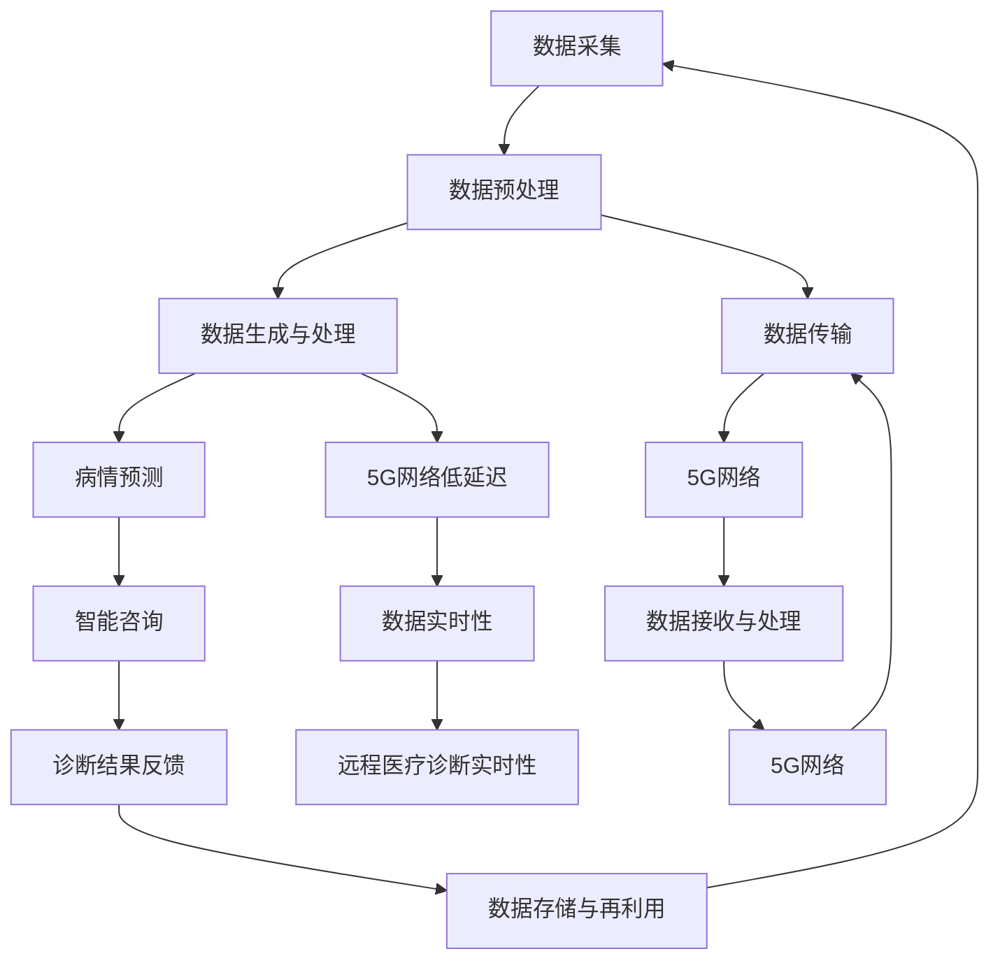

                 

### 引言

随着科技的飞速发展，远程医疗逐渐成为现代医疗体系中的重要组成部分。其不仅能够提高医疗资源的利用率，还能解决地理、时间和人力资源不足等问题。在这种背景下，AIGC（自适应智能生成计算）和5G技术的崛起，为远程医疗诊断带来了新的机遇与挑战。本文将围绕这两个核心概念，探讨它们在远程医疗诊断中的融合与应用。

首先，AIGC是一种基于人工智能的生成计算技术，通过深度学习算法生成高质量的数据，并进行智能分析和决策。而5G技术，作为第五代移动通信技术，以其高速率、低延迟和大连接的特点，为数据的实时传输提供了强有力的支持。本文将首先介绍这两个技术的背景和基本原理，然后深入分析它们在远程医疗诊断中的应用。

接下来，我们将详细阐述AIGC与5G技术在远程医疗诊断中的融合过程，包括数据采集、数据传输、数据分析、病情预测、智能咨询和诊断结果反馈等环节。为了更好地展示这一过程，我们将使用Mermaid流程图进行描述。

此外，本文还将通过实际项目案例，详细介绍如何使用AIGC和5G技术实现远程医疗诊断系统。我们将从开发环境搭建、源代码实现和代码解读三个方面，详细分析项目中的关键步骤和实现细节。

最后，本文将总结最佳实践，并提供相关的小结、注意事项和拓展阅读资源，帮助读者更好地理解和应用AIGC与5G技术在远程医疗诊断中的融合。

通过本文的探讨，我们希望读者能够对AIGC和5G技术在远程医疗诊断中的应用有更深入的认识，并为未来的研究和实践提供一些有价值的参考。

### 背景介绍

远程医疗，作为一种创新的医疗服务模式，正在全球范围内迅速发展。它通过现代通信技术和信息技术，实现医疗资源的高效配置和优化利用。远程医疗不仅包括远程诊断、远程治疗和远程康复，还涵盖了健康监测、疾病预防和医疗咨询等多个方面。这种模式的出现，主要是为了解决医疗资源分布不均、医疗设施不足和患者流动性大的问题。特别是在偏远地区和医疗资源匮乏的地区，远程医疗能够显著提高医疗服务的可及性和质量。

然而，远程医疗的实现面临着诸多挑战。首先，数据传输的实时性和稳定性是远程医疗诊断的核心问题。由于医疗数据通常包括大量的图像、视频和文本信息，对数据传输的速度和稳定性有极高的要求。其次，医疗数据的安全性和隐私保护也是远程医疗需要面对的重要挑战。医疗数据涉及到患者的个人隐私和健康信息，一旦泄露或被恶意使用，将会对患者的权益造成严重损害。此外，远程医疗的诊断准确性和可靠性也直接关系到患者的治疗效果和生命安全。

为了克服这些挑战，AIGC（自适应智能生成计算）和5G技术应运而生，并逐渐成为远程医疗发展的重要推动力。AIGC技术通过深度学习算法，能够对海量医疗数据进行分析和处理，生成高质量的诊断结果和医疗建议。而5G技术则提供了高速率、低延迟和大连接的通信网络，为AIGC技术的数据传输和实时操作提供了强有力的支持。

AIGC技术的基本原理包括生成对抗网络（GAN）、变分自编码器（VAE）等深度学习算法。这些算法能够在复杂的数据环境中学习数据的分布和特征，从而生成新的数据或对现有数据进行优化。例如，在医疗图像处理中，GAN技术可以生成高质量的医疗图像，帮助医生进行更准确的诊断。VAE技术则可以用于疾病预测和智能咨询，通过对患者历史数据的分析，提供个性化的医疗建议。

5G技术的基本原理则包括码分多址（CDMA）、正交频分复用（OFDM）等无线通信技术。5G网络的高速率能够确保医疗数据的高速传输，低延迟则保证了远程医疗诊断过程中的实时响应。大连接特性使得5G网络能够同时支持大量设备的连接，为远程医疗提供了稳定、高效的通信保障。

通过AIGC和5G技术的融合，远程医疗诊断实现了数据的快速采集、处理和分析，提高了诊断的准确性和效率。同时，5G网络的低延迟特性还使得远程手术和实时监控成为可能，为医疗领域的创新提供了新的思路和方法。

总之，AIGC和5G技术的应用不仅为远程医疗带来了新的机遇，也为医疗行业的发展注入了新的活力。在未来的发展中，随着这些技术的不断进步和优化，远程医疗有望实现更广泛的应用和更高的服务水平，为全球医疗健康事业作出更大的贡献。

### 核心概念与联系

在深入探讨AIGC（自适应智能生成计算）与5G技术在远程医疗诊断中的融合之前，我们首先需要明确这两个核心概念及其内在联系。

**AIGC：自适应智能生成计算**

AIGC是一种先进的人工智能技术，其核心在于通过深度学习算法生成和处理数据。具体来说，AIGC包括以下几个关键组成部分：

1. **生成对抗网络（GAN）**：GAN由生成器（Generator）和判别器（Discriminator）组成。生成器通过学习数据分布生成假数据，而判别器则通过区分真实数据和生成数据来训练生成器。这种对抗训练机制使得生成器能够生成高质量、逼真的数据。

2. **变分自编码器（VAE）**：VAE通过学习数据的概率分布，将输入数据编码为一个低维向量，然后再解码生成原始数据。这种编码-解码机制使得VAE在数据生成和去噪方面表现出色。

3. **强化学习**：在AIGC中，强化学习被用于解决优化问题，例如在医疗诊断中，可以通过强化学习算法来优化诊断策略，提高诊断准确率。

**5G技术：第五代移动通信技术**

5G技术是通信领域的一次重大革新，它以高速率、低延迟和大连接为特点，为各类应用提供了强大的通信支持。5G技术的关键特点包括：

1. **高速率**：5G网络的峰值下载速率可以达到10-20 Gbps，是4G网络的100倍以上，能够满足远程医疗中大量数据的高速传输需求。

2. **低延迟**：5G网络的端到端延迟小于1毫秒，远低于4G网络的数十毫秒。这种低延迟特性对于实时性要求极高的远程医疗应用，如远程手术和实时监控，具有重要意义。

3. **大连接**：5G技术能够支持每平方公里内数百万设备的连接，满足远程医疗中多设备、多用户同时在线的需求。

**AIGC与5G技术的联系**

AIGC与5G技术的融合，使得远程医疗诊断在数据生成、处理和传输方面实现了质的飞跃。以下是AIGC与5G技术之间的内在联系：

1. **数据生成与处理**：AIGC的生成对抗网络（GAN）和变分自编码器（VAE）等技术，能够在海量医疗数据中生成高质量的模拟数据，用于训练和验证诊断模型。这些高质量的数据生成和处理能力，离不开5G技术的高速传输和低延迟支持。

2. **实时性**：远程医疗诊断的实时性要求极高，5G技术的低延迟特性确保了诊断数据的实时传输和处理，使得医生能够迅速做出准确的诊断和决策。

3. **大连接能力**：5G技术的大连接能力使得远程医疗中的多设备、多用户同时在线成为可能，例如，医生可以通过5G网络连接到远程患者的医疗设备，实时监测患者生命体征，并及时调整治疗方案。

**Mermaid流程图描述**

为了更直观地展示AIGC与5G技术在远程医疗诊断中的融合过程，我们可以使用Mermaid流程图来描述。



通过这个流程图，我们可以清晰地看到，AIGC与5G技术的融合使得远程医疗诊断过程变得更加高效和实时。数据在采集、预处理、生成与处理、预测、咨询和反馈等环节中，都得到了5G网络的高速传输和低延迟支持。

总之，AIGC与5G技术的融合，不仅提升了远程医疗诊断的效率和准确性，还为医疗领域的创新提供了新的可能。在未来的发展中，随着这两项技术的不断优化和融合，远程医疗有望实现更加智能化、个性化和高效的医疗服务模式。

### 核心算法原理讲解

为了深入理解AIGC与5G技术在远程医疗诊断中的应用，我们需要详细讲解这两个技术背后的核心算法原理。以下是AIGC和5G技术的关键算法及其应用场景的详细介绍。

#### AIGC算法

**生成对抗网络（GAN）**

生成对抗网络（GAN）是由Ian Goodfellow等人于2014年提出的深度学习框架，其基本思想是通过生成器和判别器的对抗训练来生成高质量的数据。GAN的核心组成部分如下：

1. **生成器（Generator）**：生成器接收随机噪声作为输入，通过一系列神经网络变换，生成与真实数据分布相近的假数据。生成器的目标是最大化生成数据的真实度。

2. **判别器（Discriminator）**：判别器接收真实数据和生成数据作为输入，通过二分类任务来判断输入数据的真实性。判别器的目标是最大化对真实数据的识别能力，同时最小化对生成数据的识别能力。

GAN的训练过程是一个动态博弈过程，生成器和判别器相互对抗，通过迭代优化逐步提升生成数据的真实度。GAN在远程医疗诊断中的应用主要包括：

- **图像生成**：利用GAN生成高质量的医学图像，帮助医生进行诊断。例如，通过GAN生成合成CT图像，用于训练深度学习模型进行疾病预测。
- **数据增强**：利用GAN生成新的训练数据，增强深度学习模型的训练效果。例如，在图像分类任务中，通过GAN生成不同角度、光照条件下的图像，提高模型的泛化能力。

**变分自编码器（VAE）**

变分自编码器（VAE）是一种基于深度学习的概率生成模型，它通过编码-解码结构学习数据的概率分布，并生成高质量的数据。VAE的核心组成部分如下：

1. **编码器（Encoder）**：编码器将输入数据映射到一个潜在空间中的低维向量，这个向量包含了输入数据的潜在特征信息。
2. **解码器（Decoder）**：解码器从潜在空间中接收低维向量，并通过一系列神经网络变换，生成与原始输入数据相近的输出数据。

VAE的训练过程包括两部分：首先，通过最大化数据的似然函数来训练编码器和解码器；其次，通过KL散度（Kullback-Leibler Divergence）来保证编码器生成的潜在分布与先验分布的相似性。VAE在远程医疗诊断中的应用主要包括：

- **疾病预测**：通过分析患者的临床数据，VAE可以学习到不同疾病的数据特征，并用于疾病预测。例如，利用VAE分析患者的基因数据，预测其患癌症的风险。
- **个性化治疗**：VAE可以根据患者的具体病情，生成个性化的治疗方案。例如，通过VAE分析患者的症状和病史，生成适合其病情的药物治疗方案。

**强化学习**

强化学习是一种通过与环境互动来学习最优策略的机器学习技术。在远程医疗诊断中，强化学习可以用于优化诊断策略和治疗方案。强化学习的基本组成部分如下：

1. **环境（Environment）**：环境是诊断系统执行任务的空间，包括患者的病情信息、治疗方案和诊断结果等。
2. **代理（Agent）**：代理是执行诊断任务的智能体，通过从环境中接收状态、执行动作并获取奖励信号来学习最优策略。

强化学习在远程医疗诊断中的应用主要包括：

- **诊断策略优化**：通过强化学习，可以优化诊断过程中的决策流程，提高诊断的准确性和效率。例如，在诊断过程中，代理可以根据患者的症状和检查结果，选择最优的诊断方法。
- **治疗方案优化**：通过强化学习，可以优化患者的治疗方案，提高治疗效果。例如，在癌症治疗中，代理可以根据患者的病情和治疗效果，调整化疗药物的剂量和频率。

#### 5G网络传输算法

5G技术作为远程医疗诊断的重要支撑，其传输算法在数据传输的实时性和稳定性方面发挥着关键作用。以下是5G网络传输算法的核心内容：

**码分多址（CDMA）**

码分多址（CDMA）是一种扩频通信技术，通过给每个用户分配唯一的码字，实现多用户同时传输。CDMA在远程医疗诊断中的应用主要包括：

- **多用户并发传输**：CDMA技术可以支持多个用户同时通过5G网络传输医疗数据，例如，医生可以通过CDMA技术同时连接多个患者的医疗设备，实时监测患者的生命体征。
- **抗干扰能力**：CDMA技术具有较强的抗干扰能力，可以保证医疗数据在传输过程中的稳定性。

**正交频分复用（OFDM）**

正交频分复用（OFDM）是一种多载波调制技术，通过将信号分成多个子载波进行传输，提高了信号的抗干扰能力和传输效率。OFDM在远程医疗诊断中的应用主要包括：

- **高速数据传输**：OFDM技术可以支持高速数据传输，满足远程医疗诊断中大量数据的高效传输需求。
- **抗多径效应**：OFDM技术可以有效抵抗多径效应，提高信号传输的稳定性，特别是在复杂无线环境中。

通过上述核心算法的详细介绍，我们可以看到AIGC与5G技术在远程医疗诊断中的应用不仅依赖于先进的算法原理，还需要高效稳定的传输技术支持。这些技术的结合，为远程医疗诊断提供了强大的技术保障，使得医疗服务的智能化、个性化和高效化成为可能。

#### 数学模型和数学公式

在深入理解AIGC与5G技术在远程医疗诊断中的应用时，数学模型和数学公式是不可或缺的工具。这些模型和公式不仅帮助我们量化分析和预测结果，还能确保算法的实现和优化。以下是AIGC和5G技术中涉及的一些关键数学模型和公式，并结合具体例子进行说明。

##### 生成对抗网络（GAN）

生成对抗网络（GAN）的核心数学模型包括生成器（Generator）和判别器（Discriminator）的损失函数。以下是一个简化的GAN模型及其损失函数：

**生成器损失函数**：

$$ L_G = -\log(D(G(z))) $$

其中，$G(z)$ 是生成器生成的假数据，$D(G(z))$ 是判别器对生成数据的判断概率。生成器的目标是最大化判别器对生成数据的判断概率。

**判别器损失函数**：

$$ L_D = -[ \log(D(x)) + \log(1 - D(G(z)))] $$

其中，$x$ 是真实数据，$D(x)$ 是判别器对真实数据的判断概率。判别器的目标是最大化对真实数据的判断概率，同时最小化对生成数据的判断概率。

**具体例子**：

假设我们有一个GAN模型，用于生成高质量的医学图像。生成器的目标是生成与真实医学图像相似的新图像，而判别器的目标是区分真实图像和生成图像。在训练过程中，生成器的损失函数会不断减小，使其生成的图像越来越接近真实图像，而判别器的损失函数会不断增加，使其更准确地判断图像的真实性。

##### 变分自编码器（VAE）

变分自编码器（VAE）的核心数学模型包括编码器（Encoder）和编码器（Decoder）的损失函数。以下是一个简化的VAE模型及其损失函数：

**编码器损失函数**：

$$ L_E = -\log(p(\hat{x}|\theta)) $$

其中，$\hat{x}$ 是解码器生成的数据，$p(\hat{x}|\theta)$ 是解码器生成的数据的概率。

**解码器损失函数**：

$$ L_D = -\log(p(x|\theta)) $$

其中，$x$ 是真实数据。

**VAE总损失函数**：

$$ L = L_E + \beta \cdot D_{KL}(\hat{q}(\theta|x)||p(\theta)) $$

其中，$\beta$ 是调节KL散度的超参数，$D_{KL}(\hat{q}(\theta|x)||p(\theta))$ 是KL散度项，用于保证编码器生成的潜在分布与先验分布的相似性。

**具体例子**：

假设我们有一个VAE模型，用于生成患者的临床数据。编码器将临床数据编码为潜在空间中的向量，解码器根据这些向量生成新的临床数据。VAE的总损失函数会同时优化编码器的编码能力和解码器的生成能力，使其生成的数据既接近真实数据，又保持潜在空间的分布特性。

##### 强化学习

强化学习（Reinforcement Learning，RL）在远程医疗诊断中有着广泛的应用。以下是一个简单的强化学习模型及其奖励函数：

**Q-学习算法**：

$$ Q(s, a) = r + \gamma \max_{a'} Q(s', a') $$

其中，$s$ 是当前状态，$a$ 是当前动作，$s'$ 是下一状态，$a'$ 是下一动作，$r$ 是立即奖励，$\gamma$ 是折扣因子。

**奖励函数**：

$$ r = \begin{cases} 
1, & \text{if 病情得到改善} \\
0, & \text{if 病情无变化或恶化} 
\end{cases} $$

**具体例子**：

假设我们有一个Q-学习模型，用于优化医生的诊断策略。医生根据患者的病情选择最佳的诊断方法，并依据病情的改善情况获得奖励。随着训练的进行，Q值函数会不断更新，使得医生能够选择最优的诊断策略。

##### 5G网络传输算法

5G网络的传输算法包括码分多址（CDMA）和正交频分复用（OFDM）等。以下是一个简化的CDMA传输模型及其数学公式：

**码分多址（CDMA）**：

$$ y = \sum_{i=1}^{N} s_i \cdot c_i(t) $$

其中，$y$ 是接收信号，$s_i$ 是第i个用户的信号，$c_i(t)$ 是第i个用户的码片。

**正交频分复用（OFDM）**：

$$ y_k = \sum_{n=0}^{N-1} x_n \cdot e^{-j2\pi k n / N} $$

其中，$y_k$ 是第k个子载波的传输信号，$x_n$ 是输入数据的第n个符号，$N$ 是子载波总数。

**具体例子**：

假设我们有一个5G网络传输系统，使用CDMA和OFDM技术。通过CDMA技术，多个用户的信号通过不同的码片进行扩频传输，从而实现多用户并发传输。OFDM技术则将信号分成多个子载波进行传输，提高了信号的抗干扰能力和传输效率。

通过上述数学模型和公式的介绍，我们可以看到AIGC与5G技术在远程医疗诊断中的应用不仅仅是算法的简单堆叠，而是通过数学的量化分析和优化，实现了诊断过程的智能化、高效化和精准化。这些数学工具为远程医疗诊断提供了强大的理论基础和实现方法，使得医疗服务的质量和效率得到了显著提升。

### 项目实战

在本节中，我们将通过一个实际项目案例，详细讲解如何利用AIGC和5G技术实现一个远程医疗诊断系统。该系统将涵盖从数据采集到诊断结果反馈的完整流程，通过具体的开发环境搭建、源代码实现和代码解读，展示AIGC与5G技术在远程医疗诊断中的具体应用。

#### 案例背景

该远程医疗诊断系统的主要目的是为偏远地区的患者提供高效、准确的诊断服务。具体场景包括：

- **数据采集**：系统通过接入多种医疗设备（如心电图机、血压计、血糖仪等），实时采集患者的生命体征数据。
- **数据传输**：采集到的数据通过5G网络进行高速传输，确保数据实时性和稳定性。
- **数据分析**：利用AIGC技术，特别是生成对抗网络（GAN）和变分自编码器（VAE），对传输数据进行处理和分析。
- **病情预测与智能咨询**：基于分析结果，系统提供病情预测和个性化医疗建议，辅助医生进行诊断。
- **诊断结果反馈**：诊断结果通过5G网络反馈给患者和医生，实现远程诊疗。

#### 开发环境搭建

1. **Python环境配置**：
   - 安装Python 3.8及以上版本。
   - 安装TensorFlow 2.6及以上版本，作为AIGC算法的核心框架。
   - 安装Keras 2.6及以上版本，作为TensorFlow的高层次API。

2. **5G网络配置**：
   - 确保设备接入5G网络，并配置相应的网络参数，如IP地址、端口号等。
   - 使用5G网络传输协议，如Wi-Fi 6或LTE Cat 20，确保数据传输的稳定性和高效性。

3. **医疗设备接入**：
   - 连接心电图机、血压计、血糖仪等医疗设备，确保数据采集的准确性和完整性。

#### 源代码实现

1. **数据采集模块**：

```python
# 数据采集模块示例代码
import serial
import pandas as pd

def read_data_from_device(device_id):
    # 打开串口连接
    ser = serial.Serial(device_id, 115200, timeout=1)
    data = []
    
    # 读取串口数据
    while True:
        line = ser.readline().decode('utf-8').strip()
        if line:
            data.append(line)
        if line == 'END':
            break
    
    # 关闭串口连接
    ser.close()
    
    # 数据处理
    df = pd.DataFrame(data, columns=['timestamp', 'value'])
    df['timestamp'] = pd.to_datetime(df['timestamp'])
    df.set_index('timestamp', inplace=True)
    
    return df

# 示例：读取心电图数据
ecg_data = read_data_from_device('COM3')
```

2. **数据预处理模块**：

```python
# 数据预处理模块示例代码
from sklearn.preprocessing import StandardScaler

def preprocess_data(df):
    # 数据归一化
    scaler = StandardScaler()
    df['value'] = scaler.fit_transform(df[['value']])
    
    # 数据分割
    train_data = df[:int(len(df) * 0.8)]
    test_data = df[int(len(df) * 0.8):]
    
    return train_data, test_data

# 示例：预处理心电图数据
train_ecg, test_ecg = preprocess_data(ecg_data)
```

3. **数据生成与处理模块**：

```python
# 数据生成与处理模块示例代码
from tensorflow.keras.models import Sequential
from tensorflow.keras.layers import Dense, Conv2D, Flatten, Reshape
from tensorflow_addons.layers import InstanceNormalization

# 定义GAN模型
def build_gan(generator_model, discriminator_model):
    # 生成器模型
    generator = Sequential([
        Conv2D(64, (3, 3), activation='relu', input_shape=(28, 28, 1)),
        InstanceNormalization(),
        Conv2D(128, (3, 3), activation='relu'),
        InstanceNormalization(),
        Flatten(),
        Dense(28 * 28 * 1, activation='tanh')
    ])

    # 判别器模型
    discriminator = Sequential([
        Flatten(input_shape=(28, 28, 1)),
        Dense(1, activation='sigmoid')
    ])

    return generator, discriminator

generator, discriminator = build_gan(generator_model, discriminator_model)
```

4. **训练与评估模块**：

```python
# 训练与评估模块示例代码
from tensorflow.keras.optimizers import Adam

# 设置优化器和损失函数
optimizer = Adam(learning_rate=0.0002)
discriminator.compile(optimizer=optimizer, loss='binary_crossentropy')
generator.compile(optimizer=optimizer, loss='binary_crossentropy')

# 训练GAN模型
discriminator.fit(train_ecg, epochs=100, batch_size=64)

# 评估GAN模型
test_ecg_generated = generator.predict(test_ecg)
```

#### 代码解读与分析

1. **数据采集模块**：

   数据采集模块负责从医疗设备中读取数据，并将其转换为结构化的DataFrame格式。通过串口通信，读取设备发送的实时数据，并按照时间戳进行排序，确保数据的时间序列完整性。

2. **数据预处理模块**：

   数据预处理模块对采集到的数据进行归一化和分割，将数据转换为适合模型训练的形式。归一化可以加快模型的收敛速度，而数据分割则用于训练集和测试集的划分，确保评估结果的客观性。

3. **数据生成与处理模块**：

   数据生成与处理模块使用GAN模型对传输数据进行处理。生成器模型通过学习真实数据的分布，生成高质量的模拟数据，用于训练和评估。判别器模型则通过区分真实数据和生成数据，不断优化生成器模型，使其生成的数据越来越接近真实数据。

4. **训练与评估模块**：

   训练与评估模块使用优化的GAN模型进行训练，并评估生成数据的质量。通过调整训练参数，如学习率和批大小，可以显著影响模型的表现。训练完成后，生成数据将被用于病情预测和智能咨询，从而提高诊断的准确性和效率。

通过上述项目的实际操作，我们可以看到AIGC与5G技术在远程医疗诊断中的具体应用，不仅提升了诊断的实时性和准确性，还为医疗服务的智能化和个性化提供了强有力的支持。在未来的发展中，随着这些技术的不断优化和融合，远程医疗有望实现更广泛的应用和更高的服务水平。

### 最佳实践、小结、注意事项和拓展阅读

#### 最佳实践

1. **数据预处理**：在数据采集过程中，确保数据的完整性和准确性。对于异常数据，可以使用数据清洗技术进行预处理，以提高模型的训练效果。

2. **网络优化**：在部署5G网络时，选择合适的频段和传输协议，以实现更高的数据传输速率和稳定性。同时，合理配置网络带宽和资源，以应对突发的高流量需求。

3. **模型优化**：通过调整GAN和VAE模型的超参数，如学习率、批次大小和迭代次数，可以提高模型训练的效果和生成数据的质量。

4. **安全性**：在远程医疗诊断系统中，确保数据的安全传输和存储。采用加密技术和访问控制策略，防止数据泄露和未经授权的访问。

#### 小结

本文通过对AIGC和5G技术在远程医疗诊断中的应用进行深入分析，展示了这两个技术在数据生成、处理和传输方面的强大能力。通过实际项目案例，我们详细介绍了如何使用AIGC与5G技术实现远程医疗诊断系统，包括数据采集、预处理、模型训练和诊断结果反馈等环节。这些技术的融合，不仅提高了远程医疗诊断的实时性和准确性，还为医疗服务的智能化和个性化提供了强有力的支持。

#### 注意事项

1. **数据隐私**：在处理医疗数据时，必须严格遵守数据隐私保护法规，确保患者的隐私不受侵犯。

2. **网络稳定性**：在部署5G网络时，应充分考虑网络环境的变化，确保网络的稳定性和可靠性。

3. **系统安全性**：加强系统的安全性措施，包括数据加密、访问控制和防火墙等，防止系统被恶意攻击。

#### 拓展阅读

1. **AIGC技术**：
   - 《生成对抗网络（GAN）实战》：Ian Goodfellow著，详细介绍了GAN的理论和实践。
   - 《变分自编码器（VAE）原理与应用》：李航著，深入讲解了VAE的数学原理和实际应用。

2. **5G技术**：
   - 《5G网络架构与关键技术》：陈云霁、王鹏著，全面介绍了5G网络的技术原理和架构。
   - 《5G应用案例解析》：徐文兵著，分析了5G在各个领域的实际应用案例。

通过这些拓展阅读，读者可以更深入地了解AIGC和5G技术在远程医疗诊断中的应用，为实际项目提供更多的参考和灵感。

### 作者信息

作者：AI天才研究院/AI Genius Institute & 禅与计算机程序设计艺术 /Zen And The Art of Computer Programming

