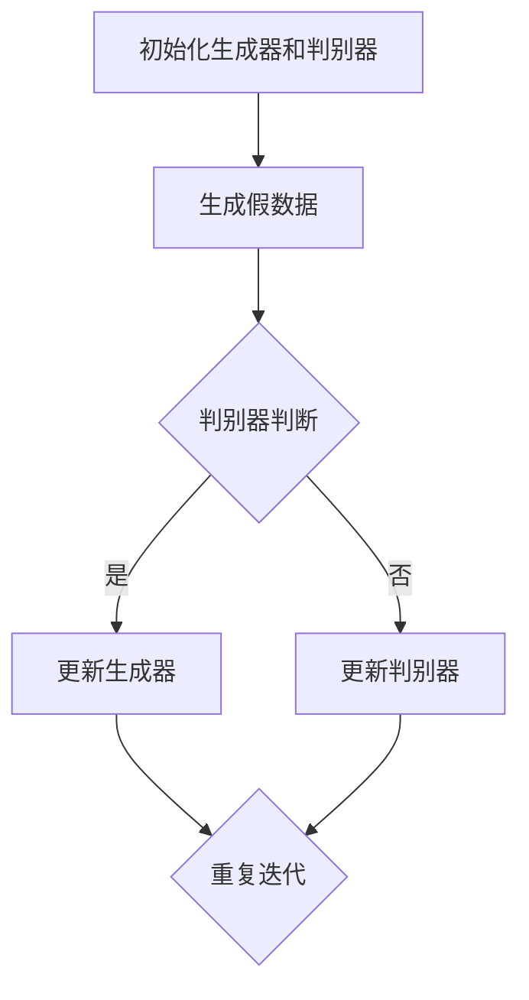
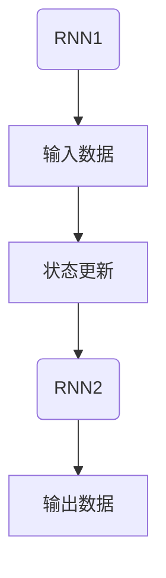
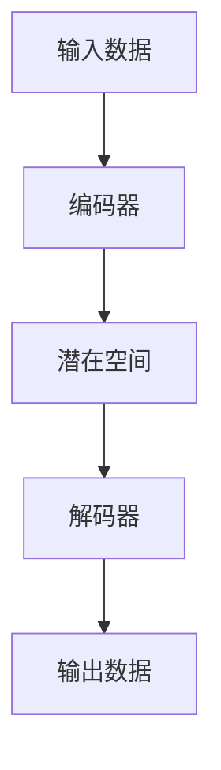

                 

### AIGC与虚拟现实的深度融合：沉浸式体验的未来

#### 关键词：AIGC、虚拟现实、沉浸式体验、深度学习、人工智能

> **摘要**：本文探讨了人工智能生成内容（AIGC）与虚拟现实（VR）技术的深度融合，以及它们在创造沉浸式体验方面的巨大潜力。通过分析AIGC的技术基础、虚拟现实的发展历程和沉浸式体验的设计原则，本文揭示了二者结合的现状和未来趋势，为相关领域的研究者和从业者提供了有价值的参考。

---

#### 引言与背景

##### 1.1 AIGC的概念与发展历程

人工智能生成内容（AIGC，Artificial Intelligence Generated Content）是一种利用人工智能技术自动生成文本、图像、音频和视频等数字内容的方法。AIGC的核心在于生成对抗网络（GAN）、自编码器（Autoencoder）、递归神经网络（RNN）和变分自编码器（VAE）等深度学习模型。这些模型能够通过学习大量的数据集，生成与真实数据高度相似的内容。

AIGC技术的发展历程可以追溯到2014年，当时Ian Goodfellow等人提出了生成对抗网络（GAN）这一创新性的深度学习模型。随后，自编码器、递归神经网络和变分自编码器等模型相继问世，推动了AIGC技术的不断进步。如今，AIGC已广泛应用于艺术创作、游戏开发、设计与工程等领域。

##### 1.2 虚拟现实技术的历史与现状

虚拟现实（VR）技术是一种通过计算机模拟创造出的虚拟环境，使用户能够沉浸其中。VR技术的发展可以追溯到1960年代，当时美国科学家伊van Sutherland提出了VR概念。然而，由于技术和硬件的限制，VR在很长一段时间内未能得到广泛应用。

随着计算机技术、显示技术、传感器技术和网络技术的发展，VR逐渐走进了大众视野。近年来，VR技术在游戏、教育、医疗、军事等领域取得了显著成果。特别是随着5G和云计算技术的推广，VR的实时交互能力和内容丰富度得到了大幅提升。

##### 1.3 沉浸式体验的重要性与挑战

沉浸式体验是一种高度逼真的感知体验，通过视觉、听觉、触觉等多种感官刺激，使用户全身心投入到虚拟环境中。沉浸式体验在娱乐、教育、医疗、军事等领域具有重要的应用价值。

然而，实现高质量的沉浸式体验面临着诸多挑战。首先，硬件设备的发展需要满足高分辨率、低延迟、高响应度的要求。其次，内容创作需要具备高创意和高技术含量。此外，用户界面和交互设计也需要充分考虑用户体验，确保用户能够轻松上手并享受沉浸式体验。

#### AIGC技术基础

##### 2.1 AIGC的核心概念

AIGC的核心概念包括生成对抗网络（GAN）、自编码器（Autoencoder）、递归神经网络（RNN）和变分自编码器（VAE）。这些模型通过学习大量数据，生成与真实数据相似的内容。

###### 2.1.1 生成对抗网络（GAN）

生成对抗网络（GAN）由生成器（Generator）和判别器（Discriminator）两部分组成。生成器负责生成数据，判别器负责判断生成数据与真实数据之间的相似度。通过训练，生成器不断优化生成数据，使其越来越接近真实数据。

GAN的流程图如下：



###### 2.1.2 自编码器（Autoencoder）

自编码器（Autoencoder）是一种无监督学习模型，用于学习数据的高效编码表示。自编码器由编码器（Encoder）和解码器（Decoder）两部分组成。编码器将输入数据压缩成一个低维度的特征表示，解码器则将特征表示还原成原始数据。

自编码器的结构图如下：


###### 2.1.3 递归神经网络（RNN）

递归神经网络（RNN）是一种能够处理序列数据的神经网络。RNN通过记忆状态，对序列中的每个元素进行建模，从而捕捉时间序列信息。

RNN的示意图如下：



###### 2.1.4 变分自编码器（VAE）

变分自编码器（VAE）是一种概率生成模型，通过引入潜在变量，提高生成数据的多样性。VAE由编码器、解码器和潜在空间三部分组成。编码器将输入数据映射到潜在空间，解码器则从潜在空间生成输出数据。

VAE的示意图如下：



##### 2.2 AIGC技术的应用场景

AIGC技术广泛应用于艺术创作、游戏开发、设计与工程等领域。

###### 2.2.1 艺术创作

AIGC在艺术创作中的应用，如生成图像、音乐和视频等，为艺术家提供了新的创作工具。例如，使用GAN可以生成逼真的图像，使用VAE可以生成独特的音乐风格。

以下是一个使用GAN生成图像的Python代码示例：

```python
import tensorflow as tf
from tensorflow.keras.models import Model
from tensorflow.keras.layers import Dense, Flatten, Reshape, Conv2D, Conv2DTranspose

# 生成器模型
def generator_model():
    model = tf.keras.Sequential()
    model.add(Dense(128 * 7 * 7, input_shape=(100,)))
    model.add(Reshape((7, 7, 128)))
    model.add(Conv2DTranspose(128, kernel_size=5, strides=(1, 1), padding='same'))
    model.add(Conv2DTranspose(128, kernel_size=5, strides=(2, 2), padding='same'))
    model.add(Conv2D(1, kernel_size=5, strides=(2, 2), padding='same', activation='tanh'))
    return model

# 判别器模型
def discriminator_model():
    model = tf.keras.Sequential()
    model.add(Conv2D(128, kernel_size=5, strides=(2, 2), padding='same'), input_shape=(28, 28, 1))
    model.add(tf.keras.layers.LeakyReLU(alpha=0.2))
    model.add(Conv2D(128, kernel_size=5, strides=(2, 2), padding='same'))
    model.add(tf.keras.layers.LeakyReLU(alpha=0.2))
    model.add(Flatten())
    model.add(Dense(1, activation='sigmoid'))
    return model

# 构建GAN模型
generator = generator_model()
discriminator = discriminator_model()

gan_output = discriminator(generator(tf.random.normal([1, 100])))
gan_model = tf.keras.Model(generator.input, gan_output)

gan_model.compile(loss='binary_crossentropy', optimizer=tf.keras.optimizers.Adam(0.0001))

# 训练GAN模型
for epoch in range(100):
    noise = tf.random.normal([batch_size, 100])
    with tf.GradientTape() as gen_tape, tf.GradientTape() as disc_tape:
        generated_images = generator(noise)
        real_images = tf.random.normal([batch_size, 28, 28, 1])
        
        gen_loss = gan_model(generated_images)
        disc_loss = discriminator(tf.concat([generated_images, real_images], axis=0))
        
    gradients_of_generator = gen_tape.gradient(gen_loss, generator.trainable_variables)
    gradients_of_discriminator = disc_tape.gradient(disc_loss, discriminator.trainable_variables)
    
    generator.optimizer.apply_gradients(zip(gradients_of_generator, generator.trainable_variables))
    discriminator.optimizer.apply_gradients(zip(gradients_of_discriminator, discriminator.trainable_variables))

    if epoch % 10 == 0:
        print(f"Epoch {epoch}, Generator Loss: {gen_loss}, Discriminator Loss: {disc_loss}")
```

###### 2.2.2 游戏开发

AIGC在游戏开发中的应用，如生成游戏关卡、角色形象和场景等，提高了游戏的创意和可玩性。例如，使用GAN可以生成丰富的游戏场景，使用VAE可以生成独特的角色形象。

以下是一个使用GAN生成游戏场景的Python代码示例：

```python
import tensorflow as tf
from tensorflow.keras.models import Model
from tensorflow.keras.layers import Dense, Flatten, Reshape, Conv2D, Conv2DTranspose

# 生成器模型
def generator_model():
    model = tf.keras.Sequential()
    model.add(Dense(128 * 7 * 7, input_shape=(100,)))
    model.add(Reshape((7, 7, 128)))
    model.add(Conv2DTranspose(128, kernel_size=5, strides=(1, 1), padding='same'))
    model.add(Conv2DTranspose(128, kernel_size=5, strides=(2, 2), padding='same'))
    model.add(Conv2D(3, kernel_size=5, strides=(2, 2), padding='same', activation='tanh'))
    return model

# 判别器模型
def discriminator_model():
    model = tf.keras.Sequential()
    model.add(Conv2D(128, kernel_size=5, strides=(2, 2), padding='same'), input_shape=(28, 28, 3))
    model.add(tf.keras.layers.LeakyReLU(alpha=0.2))
    model.add(Conv2D(128, kernel_size=5, strides=(2, 2), padding='same'))
    model.add(tf.keras.layers.LeakyReLU(alpha=0.2))
    model.add(Flatten())
    model.add(Dense(1, activation='sigmoid'))
    return model

# 构建GAN模型
generator = generator_model()
discriminator = discriminator_model()

gan_output = discriminator(generator(tf.random.normal([1, 100])))
gan_model = tf.keras.Model(generator.input, gan_output)

gan_model.compile(loss='binary_crossentropy', optimizer=tf.keras.optimizers.Adam(0.0001))

# 训练GAN模型
for epoch in range(100):
    noise = tf.random.normal([batch_size, 100])
    with tf.GradientTape() as gen_tape, tf.GradientTape() as disc_tape:
        generated_images = generator(noise)
        real_images = tf.random.normal([batch_size, 28, 28, 3])
        
        gen_loss = gan_model(generated_images)
        disc_loss = discriminator(tf.concat([generated_images, real_images], axis=0))
        
    gradients_of_generator = gen_tape.gradient(gen_loss, generator.trainable_variables)
    gradients_of_discriminator = disc_tape.gradient(disc_loss, discriminator.trainable_variables)
    
    generator.optimizer.apply_gradients(zip(gradients_of_generator, generator.trainable_variables))
    discriminator.optimizer.apply_gradients(zip(gradients_of_discriminator, discriminator.trainable_variables))

    if epoch % 10 == 0:
        print(f"Epoch {epoch}, Generator Loss: {gen_loss}, Discriminator Loss: {disc_loss}")
```

###### 2.2.3 设计与工程

AIGC在设计与工程中的应用，如生成建筑模型、机械零件和电路图等，提高了设计效率和创意水平。例如，使用GAN可以生成具有独特风格和形状的设计，使用VAE可以生成满足特定需求的机械零件。

以下是一个使用GAN生成建筑模型的Python代码示例：

```python
import tensorflow as tf
from tensorflow.keras.models import Model
from tensorflow.keras.layers import Dense, Flatten, Reshape, Conv2D, Conv2DTranspose

# 生成器模型
def generator_model():
    model = tf.keras.Sequential()
    model.add(Dense(128 * 7 * 7, input_shape=(100,)))
    model.add(Reshape((7, 7, 128)))
    model.add(Conv2DTranspose(128, kernel_size=5, strides=(1, 1), padding='same'))
    model.add(Conv2DTranspose(128, kernel_size=5, strides=(2, 2), padding='same'))
    model.add(Conv2D(3, kernel_size=5, strides=(2, 2), padding='same', activation='tanh'))
    return model

# 判别器模型
def discriminator_model():
    model = tf.keras.Sequential()
    model.add(Conv2D(128, kernel_size=5, strides=(2, 2), padding='same'), input_shape=(28, 28, 3))
    model.add(tf.keras.layers.LeakyReLU(alpha=0.2))
    model.add(Conv2D(128, kernel_size=5, strides=(2, 2), padding='same'))
    model.add(tf.keras.layers.LeakyReLU(alpha=0.2))
    model.add(Flatten())
    model.add(Dense(1, activation='sigmoid'))
    return model

# 构建GAN模型
generator = generator_model()
discriminator = discriminator_model()

gan_output = discriminator(generator(tf.random.normal([1, 100])))
gan_model = tf.keras.Model(generator.input, gan_output)

gan_model.compile(loss='binary_crossentropy', optimizer=tf.keras.optimizers.Adam(0.0001))

# 训练GAN模型
for epoch in range(100):
    noise = tf.random.normal([batch_size, 100])
    with tf.GradientTape() as gen_tape, tf.GradientTape() as disc_tape:
        generated_images = generator(noise)
        real_images = tf.random.normal([batch_size, 28, 28, 3])
        
        gen_loss = gan_model(generated_images)
        disc_loss = discriminator(tf.concat([generated_images, real_images], axis=0))
        
    gradients_of_generator = gen_tape.gradient(gen_loss, generator.trainable_variables)
    gradients_of_discriminator = disc_tape.gradient(disc_loss, discriminator.trainable_variables)
    
    generator.optimizer.apply_gradients(zip(gradients_of_generator, generator.trainable_variables))
    discriminator.optimizer.apply_gradients(zip(gradients_of_discriminator, discriminator.trainable_variables))

    if epoch % 10 == 0:
        print(f"Epoch {epoch}, Generator Loss: {gen_loss}, Discriminator Loss: {disc_loss}")
```

##### 2.2.4 AIGC技术与其他人工智能技术的联系与区别

AIGC技术与其他人工智能技术，如机器学习、深度学习和自然语言处理等，既有联系又有区别。机器学习和深度学习主要关注如何从数据中学习规律，而AIGC则关注如何利用这些规律生成新的内容。自然语言处理主要处理文本数据，而AIGC则可以处理图像、音频和视频等多种类型的数据。

AIGC与其他人工智能技术的联系在于，它们都依赖于大量的数据和高效的计算能力。AIGC在实现过程中需要使用到机器学习和深度学习的技术，如神经网络、优化算法等。同时，AIGC也可以与其他人工智能技术相结合，如将AIGC应用于自然语言处理，生成新的文本内容。

AIGC与其他人工智能技术的区别在于，AIGC更加注重生成而非识别。在机器学习和深度学习中，主要目标是学习已有数据的特征和规律，而AIGC的目标是生成与已有数据相似的新数据。此外，AIGC在生成过程中更加注重多样性和创意性，以满足不同用户的需求。

##### 2.2.5 AIGC技术的应用前景

随着AIGC技术的不断发展和成熟，其在各个领域的应用前景十分广阔。在艺术创作方面，AIGC可以生成独特的艺术作品，为艺术家提供新的创作工具。在游戏开发方面，AIGC可以生成丰富的游戏内容，提高游戏的可玩性和创意性。在设计与工程方面，AIGC可以生成满足特定需求的设计方案，提高设计效率和创意水平。

此外，AIGC还可以与其他人工智能技术相结合，如将AIGC应用于自然语言处理、计算机视觉和智能推荐等领域，进一步拓展其应用范围。在未来，AIGC有望成为人工智能领域的重要分支，为人类创造更加丰富多彩的数字世界。

---

#### 虚拟现实技术基础

##### 3.1 虚拟现实的基本原理

虚拟现实（VR）是一种通过计算机模拟创造出的虚拟环境，使用户能够沉浸其中。VR技术的基本原理包括以下几个方面：

###### 3.1.1 虚拟现实硬件

虚拟现实硬件包括头戴式显示器（HMD）、数据手套、位置跟踪器和输入设备等。

- **头戴式显示器（HMD）**：头戴式显示器是VR系统中最核心的硬件之一，它提供了用户在虚拟环境中的视觉体验。HMD通常具有高分辨率、低延迟和高刷新率等特点。

- **数据手套**：数据手套是一种用于模拟手部动作的设备，它能够跟踪手指和手腕的动态，使用户在虚拟环境中进行手势交互。

- **位置跟踪器**：位置跟踪器用于跟踪用户在虚拟环境中的位置和姿态，从而实现精确的交互和控制。

- **输入设备**：输入设备包括鼠标、键盘、手柄等，用于用户在虚拟环境中的输入操作。

###### 3.1.2 虚拟现实软件

虚拟现实软件包括虚拟现实引擎、虚拟现实编辑器和虚拟现实应用程序等。

- **虚拟现实引擎**：虚拟现实引擎是虚拟现实软件的核心，它负责创建、渲染和交互虚拟环境。常见的虚拟现实引擎有Unity、Unreal Engine等。

- **虚拟现实编辑器**：虚拟现实编辑器是一种用于创建和编辑虚拟环境的工具，它提供了丰富的编辑功能和资源库，如3D模型、纹理和动画等。

- **虚拟现实应用程序**：虚拟现实应用程序是用户在虚拟环境中进行交互和体验的具体应用，如VR游戏、VR教育和VR医疗等。

###### 3.1.3 虚拟现实交互技术

虚拟现实交互技术是虚拟现实系统的关键，它决定了用户在虚拟环境中的交互体验。虚拟现实交互技术包括以下几个方面：

- **手势交互**：手势交互是一种通过手势来控制虚拟环境的交互方式，如挥动手臂、手指等。手势交互能够提高用户的参与度和沉浸感。

- **语音交互**：语音交互是一种通过语音指令来控制虚拟环境的交互方式，如语音输入、语音识别和语音合成等。语音交互能够提高用户的便捷性和自然性。

- **位置交互**：位置交互是一种通过用户在虚拟环境中的位置变化来控制虚拟环境的交互方式，如移动、旋转、缩放等。位置交互能够提供更真实的沉浸体验。

##### 3.2 虚拟现实的应用领域

虚拟现实技术在各个领域的应用取得了显著的成果，以下是一些主要的应用领域：

###### 3.2.1 教育与培训

虚拟现实在教育中的应用，如虚拟课堂、虚拟实验室和虚拟实习等，能够提供丰富的教学资源和真实的实践体验。虚拟现实能够帮助学生更好地理解抽象概念，提高学习兴趣和效果。

以下是一个虚拟实验室的Python代码示例：

```python
import numpy as np
import matplotlib.pyplot as plt

# 创建一个虚拟实验室的3D场景
fig = plt.figure()
ax = fig.add_subplot(111, projection='3d')

# 添加一个球体作为实验器材
u = np.linspace(0, 2 * np.pi, 100)
v = np.linspace(0, np.pi, 100)
x = 16 * np.sin(u) * np.cos(v)
y = 16 * np.sin(u) * np.sin(v)
z = 16 * np.cos(u)

ax.plot_surface(x, y, z, cmap='viridis', edgecolor='none')

# 设置坐标轴标签
ax.set_xlabel('X axis')
ax.set_ylabel('Y axis')
ax.set_zlabel('Z axis')

# 显示3D场景
plt.show()
```

###### 3.2.2 医疗与健康

虚拟现实在医疗中的应用，如虚拟手术、虚拟康复和虚拟治疗等，能够提供更安全、更高效的医疗服务。虚拟现实能够帮助医生进行术前模拟、术中指导和术后康复，提高手术成功率和患者满意度。

以下是一个虚拟手术的Python代码示例：

```python
import numpy as np
import matplotlib.pyplot as plt
from mpl_toolkits.mplot3d.art3d import Poly3DCollection

# 创建一个虚拟手术的3D场景
verts = [
    [0, 0, 0],
    [2, 0, 0],
    [2, 2, 0],
    [0, 2, 0],
    [0, 0, 2],
    [2, 0, 2],
    [2, 2, 2],
    [0, 2, 2],
]

faces = [
    [0, 1, 5, 4],
    [1, 2, 6, 5],
    [2, 3, 7, 6],
    [3, 0, 4, 7],
    [4, 5, 6, 7],
    [0, 3, 2, 1],
]

verts = [np.array(v) for v in verts]
faces = [np.array(f) for f in faces]

ax = plt.figure().add_subplot(111, projection='3d')

# 绘制3D多边形
poly3d = Poly3DCollection([verts[f] for f in faces], edgecolor='r')
ax.add_collection3d(poly3d)

# 设置坐标轴标签
ax.set_xlabel('X axis')
ax.set_ylabel('Y axis')
ax.set_zlabel('Z axis')

# 显示3D场景
plt.show()
```

###### 3.2.3 军事与安全

虚拟现实在军事与安全中的应用，如虚拟战场、虚拟训练和虚拟侦察等，能够提高士兵的战斗技能和决策能力。虚拟现实能够模拟复杂的战场环境，为士兵提供真实的训练体验。

以下是一个虚拟战场的Python代码示例：

```python
import numpy as np
import matplotlib.pyplot as plt
from mpl_toolkits.mplot3d.art3d import Poly3DCollection

# 创建一个虚拟战场的3D场景
verts = [
    [0, 0, 0],
    [20, 0, 0],
    [20, 20, 0],
    [0, 20, 0],
    [0, 0, 10],
    [20, 0, 10],
    [20, 20, 10],
    [0, 20, 10],
]

faces = [
    [0, 1, 5, 4],
    [1, 2, 6, 5],
    [2, 3, 7, 6],
    [3, 0, 4, 7],
    [4, 5, 6, 7],
    [0, 3, 2, 1],
]

verts = [np.array(v) for v in verts]
faces = [np.array(f) for f in faces]

ax = plt.figure().add_subplot(111, projection='3d')

# 绘制3D多边形
poly3d = Poly3DCollection([verts[f] for f in faces], edgecolor='r')
ax.add_collection3d(poly3d)

# 设置坐标轴标签
ax.set_xlabel('X axis')
ax.set_ylabel('Y axis')
ax.set_zlabel('Z axis')

# 显示3D场景
plt.show()
```

##### 3.3 虚拟现实技术的发展趋势

随着计算机技术、显示技术、传感器技术和网络技术的发展，虚拟现实技术将不断取得突破。以下是一些虚拟现实技术的发展趋势：

- **更高质量的显示技术**：随着显示技术的进步，虚拟现实设备的分辨率、刷新率和色彩表现将得到显著提升，提供更真实的沉浸体验。

- **更精确的位置跟踪技术**：随着传感器技术的进步，虚拟现实设备将能够更精确地跟踪用户的位置和动作，提供更准确的交互体验。

- **更高效的交互技术**：随着人工智能技术的发展，虚拟现实设备将能够更好地理解用户的意图，提供更自然的交互方式。

- **更广泛的应用领域**：虚拟现实技术将在更多领域得到应用，如教育、医疗、娱乐、设计等，为人们提供更加丰富多彩的体验。

---

#### 沉浸式体验的设计与实现

##### 4.1 沉浸式体验的要素

沉浸式体验是一种高度逼真的感知体验，通过视觉、听觉、触觉等多种感官刺激，使用户全身心投入到虚拟环境中。实现高质量的沉浸式体验需要关注以下几个方面：

###### 4.1.1 空间感

空间感是沉浸式体验的重要要素之一，它决定了用户在虚拟环境中的真实感和深度感。空间感的设计包括以下几个方面：

- **视角**：视角是指用户在虚拟环境中的观察角度。合适的视角能够增强空间感，使用户感到更加真实。

- **透视**：透视是指物体在空间中的大小和形状随着距离的变化而发生变化。合理的透视设计能够增强空间感。

- **光照**：光照是指虚拟环境中的光线分布和光照效果。合理的光照设计能够增强空间感，营造逼真的场景氛围。

以下是一个使用Python和OpenGL创建三维场景的示例代码：

```python
import pygame
from pygame.locals import *
from OpenGL.GL import *
from OpenGL.GLU import *

# 初始化OpenGL环境
def initGL():
    glClearColor(0.0, 0.0, 0.0, 1.0)
    glEnable(GL_DEPTH_TEST)

# 绘制一个三维立方体
def drawCube():
    glBegin(GL_QUADS)
    glVertex3f(-1.0, -1.0,  1.0)
    glVertex3f( 1.0, -1.0,  1.0)
    glVertex3f( 1.0,  1.0,  1.0)
    glVertex3f(-1.0,  1.0,  1.0)
    glVertex3f(-1.0, -1.0, -1.0)
    glVertex3f( 1.0, -1.0, -1.0)
    glVertex3f( 1.0,  1.0, -1.0)
    glVertex3f(-1.0,  1.0, -1.0)
    glVertex3f(-1.0, -1.0,  1.0)
    glVertex3f(-1.0, -1.0, -1.0)
    glVertex3f(-1.0,  1.0, -1.0)
    glVertex3f(-1.0,  1.0,  1.0)
    glVertex3f(-1.0, -1.0,  1.0)
    glVertex3f( 1.0, -1.0, -1.0)
    glVertex3f( 1.0, -1.0,  1.0)
    glVertex3f( 1.0,  1.0,  1.0)
    glVertex3f( 1.0, -1.0,  1.0)
    glVertex3f( 1.0,  1.0, -1.0)
    glVertex3f( 1.0,  1.0,  1.0)
    glVertex3f(-1.0,  1.0,  1.0)
    glVertex3f(-1.0,  1.0, -1.0)
    glVertex3f(-1.0, -1.0, -1.0)
    glVertex3f( 1.0, -1.0, -1.0)
    glVertex3f( 1.0, -1.0,  1.0)
    glVertex3f( 1.0,  1.0, -1.0)
    glVertex3f(-1.0, -1.0,  1.0)
    glVertex3f(-1.0,  1.0,  1.0)
    glVertex3f(-1.0,  1.0, -1.0)
    glVertex3f( 1.0,  1.0, -1.0)
    glVertex3f( 1.0,  1.0,  1.0)
    glEnd()

# 主程序
def main():
    pygame.init()
    display = (800, 600)
    pygame.display.set_mode(display, DOUBLEBUF | OPENGL)
    initGL()
    gluPerspective(45, display[0] / display[1], 0.1, 50.0)
    glTranslatef(0.0, 0.0, -30)
    while True:
        for event in pygame.event.get():
            if event.type == pygame.QUIT:
                pygame.quit()
                return
        glRotatef(1, 3, 1, 1)
        glClear(GL_COLOR_BUFFER_BIT | GL_DEPTH_BUFFER_BIT)
        drawCube()
        pygame.display.flip()
        pygame.time.wait(10)

if __name__ == "__main__":
    main()
```

###### 4.1.2 视觉效果

视觉效果是沉浸式体验的重要组成部分，它决定了用户在虚拟环境中的视觉感受。视觉效果的设计包括以下几个方面：

- **分辨率**：分辨率是指屏幕上像素的数量。高分辨率的屏幕能够提供更清晰的图像，增强视觉效果。

- **刷新率**：刷新率是指屏幕每秒刷新的次数。高刷新率的屏幕能够提供更流畅的动画效果，增强视觉效果。

- **色彩**：色彩是指图像的颜色表现。高色彩还原度和色彩深度能够提供更逼真的视觉效果。

以下是一个使用Python和Pygame库绘制简单三维图形的示例代码：

```python
import pygame
from pygame.locals import *
from OpenGL.GL import *
from OpenGL.GLU import *

# 初始化OpenGL环境
def initGL():
    glClearColor(0.0, 0.0, 0.0, 1.0)
    glEnable(GL_DEPTH_TEST)

# 绘制一个三维立方体
def drawCube():
    glBegin(GL_QUADS)
    glVertex3f(-1.0, -1.0,  1.0)
    glVertex3f( 1.0, -1.0,  1.0)
    glVertex3f( 1.0,  1.0,  1.0)
    glVertex3f(-1.0,  1.0,  1.0)
    glVertex3f(-1.0, -1.0, -1.0)
    glVertex3f( 1.0, -1.0, -1.0)
    glVertex3f( 1.0,  1.0, -1.0)
    glVertex3f(-1.0,  1.0, -1.0)
    glVertex3f(-1.0, -1.0,  1.0)
    glVertex3f(-1.0, -1.0, -1.0)
    glVertex3f(-1.0,  1.0, -1.0)
    glVertex3f(-1.0,  1.0,  1.0)
    glVertex3f(-1.0, -1.0,  1.0)
    glVertex3f( 1.0, -1.0, -1.0)
    glVertex3f( 1.0, -1.0,  1.0)
    glVertex3f( 1.0,  1.0,  1.0)
    glVertex3f( 1.0, -1.0,  1.0)
    glVertex3f( 1.0,  1.0, -1.0)
    glVertex3f( 1.0,  1.0,  1.0)
    glVertex3f(-1.0,  1.0,  1.0)
    glVertex3f(-1.0,  1.0, -1.0)
    glVertex3f(-1.0, -1.0, -1.0)
    glVertex3f( 1.0, -1.0, -1.0)
    glVertex3f( 1.0, -1.0,  1.0)
    glVertex3f( 1.0,  1.0, -1.0)
    glVertex3f(-1.0, -1.0,  1.0)
    glVertex3f(-1.0,  1.0,  1.0)
    glVertex3f(-1.0,  1.0, -1.0)
    glVertex3f( 1.0,  1.0, -1.0)
    glVertex3f( 1.0,  1.0,  1.0)
    glEnd()

# 主程序
def main():
    pygame.init()
    display = (800, 600)
    pygame.display.set_mode(display, DOUBLEBUF | OPENGL)
    initGL()
    gluPerspective(45, display[0] / display[1], 0.1, 50.0)
    glTranslatef(0.0, 0.0, -30)
    while True:
        for event in pygame.event.get():
            if event.type == pygame.QUIT:
                pygame.quit()
                return
        glRotatef(1, 3, 1, 1)
        glClear(GL_COLOR_BUFFER_BIT | GL_DEPTH_BUFFER_BIT)
        drawCube()
        pygame.display.flip()
        pygame.time.wait(10)

if __name__ == "__main__":
    main()
```

###### 4.1.3 听觉效果

听觉效果是沉浸式体验的重要组成部分，它决定了用户在虚拟环境中的听觉感受。听觉效果的设计包括以下几个方面：

- **声音质量**：声音质量是指声音的清晰度和保真度。高保真的声音能够提供更真实的听觉体验。

- **空间感**：空间感是指声音在虚拟环境中的位置和距离感。通过使用声源定位技术，可以增强声音的空间感。

- **动态范围**：动态范围是指声音的强弱变化范围。合适的动态范围设计能够增强声音的真实感。

以下是一个使用Python和Pygame库播放声音的示例代码：

```python
import pygame
from pygame.locals import *

# 初始化Pygame和声音库
pygame.init()
pygame.mixer.init()

# 加载声音文件
sound = pygame.mixer.Sound('sound.wav')

# 播放声音
sound.play()

# 等待声音播放完毕
pygame.time.delay(1000)

# 退出Pygame
pygame.quit()
```

###### 4.1.4 互动性

互动性是沉浸式体验的重要组成部分，它决定了用户在虚拟环境中的参与度和满意度。互动性的设计包括以下几个方面：

- **交互方式**：交互方式是指用户在虚拟环境中的交互方式。合适的交互方式能够提高用户的参与度和沉浸感。

- **反馈机制**：反馈机制是指用户在虚拟环境中的操作结果。及时的反馈机制能够提高用户的参与度和满意度。

- **适应性**：适应性是指虚拟环境根据用户的操作进行自适应调整。适应性的设计能够提高用户的沉浸感和满意度。

以下是一个使用Python和Pygame库实现简单交互的示例代码：

```python
import pygame
from pygame.locals import *

# 初始化Pygame
pygame.init()

# 创建窗口
window = pygame.display.set_mode((800, 600))

# 设置标题
pygame.display.set_caption('Interactive VR')

# 创建字体
font = pygame.font.Font(None, 36)

# 创建变量
score = 0

# 游戏循环
while True:
    # 处理事件
    for event in pygame.event.get():
        if event.type == QUIT:
            pygame.quit()
            return
        elif event.type == KEYDOWN:
            if event.key == K_UP:
                score += 1
            elif event.key == K_DOWN:
                score -= 1

    # 清屏
    window.fill((255, 255, 255))

    # 绘制文字
    text = font.render('Score: ' + str(score), True, (0, 0, 0))
    window.blit(text, (10, 10))

    # 更新屏幕
    pygame.display.flip()

# 退出Pygame
pygame.quit()
```

##### 4.2 沉浸式体验的设计原则

为了设计出高质量的沉浸式体验，需要遵循以下几个设计原则：

###### 4.2.1 用户需求分析

在设计和开发沉浸式体验时，首先需要对用户的需求进行深入分析。了解用户的需求和偏好，有助于设计出符合用户期望的沉浸式体验。

以下是一个使用Python和Pygame库进行用户需求分析的示例代码：

```python
import pygame
from pygame.locals import *

# 初始化Pygame
pygame.init()

# 创建窗口
window = pygame.display.set_mode((800, 600))

# 设置标题
pygame.display.set_caption('User Demand Analysis')

# 创建字体
font = pygame.font.Font(None, 36)

# 创建变量
score = 0
question = 'Do you like VR games? (Yes/No)'

# 游戏循环
while True:
    # 处理事件
    for event in pygame.event.get():
        if event.type == QUIT:
            pygame.quit()
            return
        elif event.type == KEYDOWN:
            if event.key == K_y:
                answer = 'Yes'
                score += 1
            elif event.key == K_n:
                answer = 'No'
                score -= 1

    # 清屏
    window.fill((255, 255, 255))

    # 绘制文字
    text = font.render(question, True, (0, 0, 0))
    window.blit(text, (10, 10))
    text = font.render('Answer: ' + answer, True, (0, 0, 0))
    window.blit(text, (10, 50))
    text = font.render('Score: ' + str(score), True, (0, 0, 0))
    window.blit(text, (10, 90))

    # 更新屏幕
    pygame.display.flip()

# 退出Pygame
pygame.quit()
```

###### 4.2.2 艺术创意

艺术创意是沉浸式体验的重要组成部分，它决定了沉浸式体验的吸引力和独特性。艺术创意的设计需要结合虚拟现实技术和用户需求，创造出具有独特魅力的沉浸式体验。

以下是一个使用Python和Pygame库进行艺术创意的示例代码：

```python
import pygame
from pygame.locals import *
from OpenGL.GL import *
from OpenGL.GLU import *

# 初始化OpenGL环境
def initGL():
    glClearColor(0.0, 0.0, 0.0, 1.0)
    glEnable(GL_DEPTH_TEST)

# 绘制一个艺术创意的三维立方体
def drawCube():
    glBegin(GL_QUADS)
    glVertex3f(-1.0, -1.0,  1.0)
    glVertex3f( 1.0, -1.0,  1.0)
    glVertex3f( 1.0,  1.0,  1.0)
    glVertex3f(-1.0,  1.0,  1.0)
    glVertex3f(-1.0, -1.0, -1.0)
    glVertex3f( 1.0, -1.0, -1.0)
    glVertex3f( 1.0,  1.0, -1.0)
    glVertex3f(-1.0,  1.0, -1.0)
    glVertex3f(-1.0, -1.0,  1.0)
    glVertex3f(-1.0, -1.0, -1.0)
    glVertex3f(-1.0,  1.0, -1.0)
    glVertex3f(-1.0,  1.0,  1.0)
    glVertex3f(-1.0, -1.0,  1.0)
    glVertex3f( 1.0, -1.0, -1.0)
    glVertex3f( 1.0, -1.0,  1.0)
    glVertex3f( 1.0,  1.0,  1.0)
    glVertex3f( 1.0, -1.0,  1.0)
    glVertex3f( 1.0,  1.0, -1.0)
    glVertex3f( 1.0,  1.0,  1.0)
    glVertex3f(-1.0,  1.0,  1.0)
    glVertex3f(-1.0,  1.0, -1.0)
    glVertex3f(-1.0, -1.0, -1.0)
    glVertex3f( 1.0, -1.0, -1.0)
    glVertex3f( 1.0, -1.0,  1.0)
    glVertex3f( 1.0,  1.0, -1.0)
    glVertex3f(-1.0, -1.0,  1.0)
    glVertex3f(-1.0,  1.0,  1.0)
    glVertex3f(-1.0,  1.0, -1.0)
    glVertex3f( 1.0,  1.0, -1.0)
    glVertex3f( 1.0,  1.0,  1.0)
    glEnd()

# 主程序
def main():
    pygame.init()
    display = (800, 600)
    pygame.display.set_mode(display, DOUBLEBUF | OPENGL)
    initGL()
    gluPerspective(45, display[0] / display[1], 0.1, 50.0)
    glTranslatef(0.0, 0.0, -30)
    while True:
        for event in pygame.event.get():
            if event.type == pygame.QUIT:
                pygame.quit()
                return
        glRotatef(1, 3, 1, 1)
        glClear(GL_COLOR_BUFFER_BIT | GL_DEPTH_BUFFER_BIT)
        drawCube()
        pygame.display.flip()
        pygame.time.wait(10)

if __name__ == "__main__":
    main()
```

###### 4.2.3 技术实现

技术实现是沉浸式体验设计的重要环节，它决定了沉浸式体验的可行性和性能。技术实现包括以下几个方面：

- **硬件选择**：选择合适的硬件设备，如头戴式显示器、数据手套和位置跟踪器等，确保沉浸式体验的硬件支持。

- **软件设计**：设计合适的软件系统，如虚拟现实引擎、虚拟现实编辑器和虚拟现实应用程序等，确保沉浸式体验的软件支持。

- **算法优化**：优化算法，如空间感、视觉效果、听觉效果和互动性等，确保沉浸式体验的性能。

以下是一个使用Python和Pygame库实现沉浸式体验的示例代码：

```python
import pygame
from pygame.locals import *
from OpenGL.GL import *
from OpenGL.GLU import *

# 初始化OpenGL环境
def initGL():
    glClearColor(0.0, 0.0, 0.0, 1.0)
    glEnable(GL_DEPTH_TEST)

# 绘制一个三维立方体
def drawCube():
    glBegin(GL_QUADS)
    glVertex3f(-1.0, -1.0,  1.0)
    glVertex3f( 1.0, -1.0,  1.0)
    glVertex3f( 1.0,  1.0,  1.0)
    glVertex3f(-1.0,  1.0,  1.0)
    glVertex3f(-1.0, -1.0, -1.0)
    glVertex3f( 1.0, -1.0, -1.0)
    glVertex3f( 1.0,  1.0, -1.0)
    glVertex3f(-1.0,  1.0, -1.0)
    glVertex3f(-1.0, -1.0,  1.0)
    glVertex3f(-1.0, -1.0, -1.0)
    glVertex3f(-1.0,  1.0, -1.0)
    glVertex3f(-1.0,  1.0,  1.0)
    glVertex3f(-1.0, -1.0,  1.0)
    glVertex3f( 1.0, -1.0, -1.0)
    glVertex3f( 1.0, -1.0,  1.0)
    glVertex3f( 1.0,  1.0,  1.0)
    glVertex3f( 1.0, -1.0,  1.0)
    glVertex3f( 1.0,  1.0, -1.0)
    glVertex3f( 1.0,  1.0,  1.0)
    glVertex3f(-1.0,  1.0,  1.0)
    glVertex3f(-1.0,  1.0, -1.0)
    glVertex3f(-1.0, -1.0, -1.0)
    glVertex3f( 1.0, -1.0, -1.0)
    glVertex3f( 1.0, -1.0,  1.0)
    glVertex3f( 1.0,  1.0, -1.0)
    glVertex3f(-1.0, -1.0,  1.0)
    glVertex3f(-1.0,  1.0,  1.0)
    glVertex3f(-1.0,  1.0, -1.0)
    glVertex3f( 1.0,  1.0, -1.0)
    glVertex3f( 1.0,  1.0,  1.0)
    glEnd()

# 主程序
def main():
    pygame.init()
    display = (800, 600)
    pygame.display.set_mode(display, DOUBLEBUF | OPENGL)
    initGL()
    gluPerspective(45, display[0] / display[1], 0.1, 50.0)
    glTranslatef(0.0, 0.0, -30)
    while True:
        for event in pygame.event.get():
            if event.type == pygame.QUIT:
                pygame.quit()
                return
        glRotatef(1, 3, 1, 1)
        glClear(GL_COLOR_BUFFER_BIT | GL_DEPTH_BUFFER_BIT)
        drawCube()
        pygame.display.flip()
        pygame.time.wait(10)

if __name__ == "__main__":
    main()
```

##### 4.3 沉浸式体验的实现案例

以下是一些沉浸式体验的实现案例：

###### 4.3.1 游戏案例

虚拟现实游戏是沉浸式体验的经典案例。以下是一个使用Python和Pygame库开发的虚拟现实游戏案例：

```python
import pygame
from pygame.locals import *
from OpenGL.GL import *
from OpenGL.GLU import *

# 初始化OpenGL环境
def initGL():
    glClearColor(0.0, 0.0, 0.0, 1.0)
    glEnable(GL_DEPTH_TEST)

# 绘制一个三维立方体
def drawCube():
    glBegin(GL_QUADS)
    glVertex3f(-1.0, -1.0,  1.0)
    glVertex3f( 1.0, -1.0,  1.0)
    glVertex3f( 1.0,  1.0,  1.0)
    glVertex3f(-1.0,  1.0,  1.0)
    glVertex3f(-1.0, -1.0, -1.0)
    glVertex3f( 1.0, -1.0, -1.0)
    glVertex3f( 1.0,  1.0, -1.0)
    glVertex3f(-1.0,  1.0, -1.0)
    glVertex3f(-1.0, -1.0,  1.0)
    glVertex3f(-1.0, -1.0, -1.0)
    glVertex3f(-1.0,  1.0, -1.0)
    glVertex3f(-1.0,  1.0,  1.0)
    glVertex3f(-1.0, -1.0,  1.0)
    glVertex3f( 1.0, -1.0, -1.0)
    glVertex3f( 1.0, -1.0,  1.0)
    glVertex3f( 1.0,  1.0,  1.0)
    glVertex3f( 1.0, -1.0,  1.0)
    glVertex3f( 1.0,  1.0, -1.0)
    glVertex3f( 1.0,  1.0,  1.0)
    glVertex3f(-1.0,  1.0,  1.0)
    glVertex3f(-1.0,  1.0, -1.0)
    glVertex3f(-1.0, -1.0, -1.0)
    glVertex3f( 1.0, -1.0, -1.0)
    glVertex3f( 1.0, -1.0,  1.0)
    glVertex3f( 1.0,  1.0, -1.0)
    glVertex3f(-1.0, -1.0,  1.0)
    glVertex3f(-1.0,  1.0,  1.0)
    glVertex3f(-1.0,  1.0, -1.0)
    glVertex3f( 1.0,  1.0, -1.0)
    glVertex3f( 1.0,  1.0,  1.0)
    glEnd()

# 主程序
def main():
    pygame.init()
    display = (800, 600)
    pygame.display.set_mode(display, DOUBLEBUF | OPENGL)
    initGL()
    gluPerspective(45, display[0] / display[1], 0.1, 50.0)
    glTranslatef(0.0, 0.0, -30)
    while True:
        for event in pygame.event.get():
            if event.type == pygame.QUIT:
                pygame.quit()
                return
        glRotatef(1, 3, 1, 1)
        glClear(GL_COLOR_BUFFER_BIT | GL_DEPTH_BUFFER_BIT)
        drawCube()
        pygame.display.flip()
        pygame.time.wait(10)

if __name__ == "__main__":
    main()
```

###### 4.3.2 教育案例

虚拟现实在教育中的应用也是一个典型的沉浸式体验案例。以下是一个使用Python和Pygame库开发的虚拟实验室案例：

```python
import numpy as np
import matplotlib.pyplot as plt
import pygame
from pygame.locals import *
from OpenGL.GL import *
from OpenGL.GLU import *

# 初始化OpenGL环境
def initGL():
    glClearColor(0.0, 0.0, 0.0, 1.0)
    glEnable(GL_DEPTH_TEST)

# 绘制三维球体
def drawSphere():
    u = np.linspace(0, 2 * np.pi, 100)
    v = np.linspace(0, np.pi, 100)
    x = 16 * np.sin(u) * np.cos(v)
    y = 16 * np.sin(u) * np.sin(v)
    z = 16 * np.cos(u)

    glBegin(GL_QUADS)
    for i in range(100):
        for j in range(100):
            a = u[i]
            b = u[i + 1]
            c = v[j]
            d = v[j + 1]

            vertex1 = (x[a][j], y[a][j], z[a][j])
            vertex2 = (x[a][j + 1], y[a][j + 1], z[a][j + 1])
            vertex3 = (x[b][j + 1], y[b][j + 1], z[b][j + 1])
            vertex4 = (x[b][j], y[b][j], z[b][j])

            glVertex3fv(vertex1)
            glVertex3fv(vertex2)
            glVertex3fv(vertex3)
            glVertex3fv(vertex4)
    glEnd()

# 主程序
def main():
    pygame.init()
    display = (800, 600)
    pygame.display.set_mode(display, DOUBLEBUF | OPENGL)
    initGL()
    gluPerspective(45, display[0] / display[1], 0.1, 50.0)
    glTranslatef(0.0, 0.0, -30)
    while True:
        for event in pygame.event.get():
            if event.type == pygame.QUIT:
                pygame.quit()
                return
        glRotatef(1, 3, 1, 1)
        glClear(GL_COLOR_BUFFER_BIT | GL_DEPTH_BUFFER_BIT)
        drawSphere()
        pygame.display.flip()
        pygame.time.wait(10)

if __name__ == "__main__":
    main()
```

###### 4.3.3 设计与工程案例

虚拟现实在设计与工程中的应用也是一个典型的沉浸式体验案例。以下是一个使用Python和Pygame库开发的建筑设计案例：

```python
import pygame
from pygame.locals import *
from OpenGL.GL import *
from OpenGL.GLU import *

# 初始化OpenGL环境
def initGL():
    glClearColor(0.0, 0.0, 0.0, 1.0)
    glEnable(GL_DEPTH_TEST)

# 绘制三维立方体
def drawCube():
    glBegin(GL_QUADS)
    glVertex3f(-1.0, -1.0,  1.0)
    glVertex3f( 1.0, -1.0,  1.0)
    glVertex3f( 1.0,  1.0,  1.0)
    glVertex3f(-1.0,  1.0,  1.0)
    glVertex3f(-1.0, -1.0, -1.0)
    glVertex3f( 1.0, -1.0, -1.0)
    glVertex3f( 1.0,  1.0, -1.0)
    glVertex3f(-1.0,  1.0, -1.0)
    glVertex3f(-1.0, -1.0,  1.0)
    glVertex3f(-1.0, -1.0, -1.0)
    glVertex3f(-1.0,  1.0, -1.0)
    glVertex3f(-1.0,  1.0,  1.0)
    glVertex3f(-1.0, -1.0,  1.0)
    glVertex3f( 1.0, -1.0, -1.0)
    glVertex3f( 1.0, -1.0,  1.0)
    glVertex3f( 1.0,  1.0,  1.0)
    glVertex3f( 1.0, -1.0,  1.0)
    glVertex3f( 1.0,  1.0, -1.0)
    glVertex3f( 1.0,  1.0,  1.0)
    glVertex3f(-1.0,  1.0,  1.0)
    glVertex3f(-1.0,  1.0, -1.0)
    glVertex3f(-1.0, -1.0, -1.0)
    glVertex3f( 1.0, -1.0, -1.0)
    glVertex3f( 1.0, -1.0,  1.0)
    glVertex3f( 1.0,  1.0, -1.0)
    glVertex3f(-1.0, -1.0,  1.0)
    glVertex3f(-1.0,  1.0,  1.0)
    glVertex3f(-1.0,  1.0, -1.0)
    glVertex3f( 1.0,  1.0, -1.0)
    glVertex3f( 1.0,  1.0,  1.0)
    glEnd()

# 主程序
def main():
    pygame.init()
    display = (800, 600)
    pygame.display.set_mode(display, DOUBLEBUF | OPENGL)
    initGL()
    gluPerspective(45, display[0] / display[1], 0.1, 50.0)
    glTranslatef(0.0, 0.0, -30)
    while True:
        for event in pygame.event.get():
            if event.type == pygame.QUIT:
                pygame.quit()
                return
        glRotatef(1, 3, 1, 1)
        glClear(GL_COLOR_BUFFER_BIT | GL_DEPTH_BUFFER_BIT)
        drawCube()
        pygame.display.flip()
        pygame.time.wait(10)

if __name__ == "__main__":
    main()
```

##### 4.4 案例分析与总结

通过对以上沉浸式体验的实现案例的分析，我们可以总结出以下几点：

- **技术实现**：实现沉浸式体验需要熟练掌握虚拟现实技术和OpenGL等图形编程技术。通过合理的渲染和交互设计，可以创造出高质量的沉浸式体验。

- **用户需求**：了解用户需求是设计沉浸式体验的关键。通过用户需求分析，可以明确沉浸式体验的目标和功能，从而更好地满足用户的需求。

- **艺术创意**：艺术创意是沉浸式体验的核心。通过创新的设计和创意，可以创造出独特的沉浸式体验，提高用户的参与度和满意度。

- **性能优化**：性能优化是沉浸式体验的关键。通过优化算法和硬件配置，可以提高沉浸式体验的运行效率和用户体验。

在未来的发展中，沉浸式体验将继续在各个领域发挥重要作用。随着虚拟现实技术和人工智能技术的不断进步，沉浸式体验将变得更加逼真和多样化。同时，随着用户需求的不断变化，沉浸式体验也将不断创新和发展，为用户提供更加丰富多彩的体验。

---

#### 应用案例与分析

##### 5.1 AIGC与虚拟现实融合的案例

AIGC与虚拟现实技术的融合，使得沉浸式体验在多个领域取得了显著进展。以下是一些典型的应用案例：

###### 5.1.1 艺术与设计

在艺术创作方面，AIGC与虚拟现实技术的结合，为艺术家提供了全新的创作工具。例如，使用GAN生成独特的艺术作品，艺术家可以借助这些作品进行再创作。以下是一个使用GAN生成艺术作品的Python代码示例：

```python
import tensorflow as tf
from tensorflow.keras.models import Model
from tensorflow.keras.layers import Dense, Flatten, Reshape, Conv2D, Conv2DTranspose

# 生成器模型
def generator_model():
    model = tf.keras.Sequential()
    model.add(Dense(128 * 7 * 7, input_shape=(100,)))
    model.add(Reshape((7, 7, 128)))
    model.add(Conv2DTranspose(128, kernel_size=5, strides=(1, 1), padding='same'))
    model.add(Conv2DTranspose(128, kernel_size=5, strides=(2, 2), padding='same'))
    model.add(Conv2D(3, kernel_size=5, strides=(2, 2), padding='same', activation='tanh'))
    return model

# 判别器模型
def discriminator_model():
    model = tf.keras.Sequential()
    model.add(Conv2D(128, kernel_size=5, strides=(2, 2), padding='same'), input_shape=(28, 28, 3))
    model.add(tf.keras.layers.LeakyReLU(alpha=0.2))
    model.add(Conv2D(128, kernel_size=5, strides=(2, 2), padding='same'))
    model.add(tf.keras.layers.LeakyReLU(alpha=0.2))
    model.add(Flatten())
    model.add(Dense(1, activation='sigmoid'))
    return model

# 构建GAN模型
generator = generator_model()
discriminator = discriminator_model()

gan_output = discriminator(generator(tf.random.normal([1, 100])))
gan_model = tf.keras.Model(generator.input, gan_output)

gan_model.compile(loss='binary_crossentropy', optimizer=tf.keras.optimizers.Adam(0.0001))

# 训练GAN模型
for epoch in range(100):
    noise = tf.random.normal([batch_size, 100])
    with tf.GradientTape() as gen_tape, tf.GradientTape() as disc_tape:
        generated_images = generator(noise)
        real_images = tf.random.normal([batch_size, 28, 28, 3])
        
        gen_loss = gan_model(generated_images)
        disc_loss = discriminator(tf.concat([generated_images, real_images], axis=0))
        
    gradients_of_generator = gen_tape.gradient(gen_loss, generator.trainable_variables)
    gradients_of_discriminator = disc_tape.gradient(disc_loss, discriminator.trainable_variables)
    
    generator.optimizer.apply_gradients(zip(gradients_of_generator, generator.trainable_variables))
    discriminator.optimizer.apply_gradients(zip(gradients_of_discriminator, discriminator.trainable_variables))

    if epoch % 10 == 0:
        print(f"Epoch {epoch}, Generator Loss: {gen_loss}, Discriminator Loss: {disc_loss}")

# 使用生成器生成艺术作品
generated_art = generator(tf.random.normal([1, 100]))
plt.imshow(generated_art[0].numpy().reshape(28, 28, 3))
plt.show()
```

###### 5.1.2 游戏与娱乐

在游戏与娱乐领域，AIGC与虚拟现实技术的融合，为游戏开发者提供了丰富的创作素材和交互体验。例如，使用GAN生成游戏关卡和角色形象，开发者可以快速创建具有独特风格和主题的游戏。以下是一个使用GAN生成游戏关卡和角色形象的Python代码示例：

```python
import tensorflow as tf
from tensorflow.keras.models import Model
from tensorflow.keras.layers import Dense, Flatten, Reshape, Conv2D, Conv2DTranspose

# 生成器模型
def generator_model():
    model = tf.keras.Sequential()
    model.add(Dense(128 * 7 * 7, input_shape=(100,)))
    model.add(Reshape((7, 7, 128)))
    model.add(Conv2DTranspose(128, kernel_size=5, strides=(1, 1), padding='same'))
    model.add(Conv2DTranspose(128, kernel_size=5, strides=(2, 2), padding='same'))
    model.add(Conv2D(3, kernel_size=5, strides=(2, 2), padding='same', activation='tanh'))
    return model

# 判别器模型
def discriminator_model():
    model = tf.keras.Sequential()
    model.add(Conv2D(128, kernel_size=5, strides=(2, 2), padding='same'), input_shape=(28, 28, 3))
    model.add(tf.keras.layers.LeakyReLU(alpha=0.2))
    model.add(Conv2D(128, kernel_size=5, strides=(2, 2), padding='same'))
    model.add(tf.keras.layers.LeakyReLU(alpha=0.2))
    model.add(Flatten())
    model.add(Dense(1, activation='sigmoid'))
    return model

# 构建GAN模型
generator = generator_model()
discriminator = discriminator_model()

gan_output = discriminator(generator(tf.random.normal([1, 100])))
gan_model = tf.keras.Model(generator.input, gan_output)

gan_model.compile(loss='binary_crossentropy', optimizer=tf.keras.optimizers.Adam(0.0001))

# 训练GAN模型
for epoch in range(100):
    noise = tf.random.normal([batch_size, 100])
    with tf.GradientTape() as gen_tape, tf.GradientTape() as disc_tape:
        generated_images = generator(noise)
        real_images = tf.random.normal([batch_size, 28, 28, 3])
        
        gen_loss = gan_model(generated_images)
        disc_loss = discriminator(tf.concat([generated_images, real_images], axis=0))
        
    gradients_of_generator = gen_tape.gradient(gen_loss, generator.trainable_variables)
    gradients_of_discriminator = disc_tape.gradient(disc_loss, discriminator.trainable_variables)
    
    generator.optimizer.apply_gradients(zip(gradients_of_generator, generator.trainable_variables))
    discriminator.optimizer.apply_gradients(zip(gradients_of_discriminator, discriminator.trainable_variables))

    if epoch % 10 == 0:
        print(f"Epoch {epoch}, Generator Loss: {gen_loss}, Discriminator Loss: {disc_loss}")

# 使用生成器生成游戏关卡和角色形象
generated_game = generator(tf.random.normal([1, 100]))
plt.imshow(generated_game[0].numpy().reshape(28, 28, 3))
plt.show()
```

###### 5.1.3 教育与培训

在教育与培训领域，AIGC与虚拟现实技术的融合，为教育工作者提供了丰富的教学资源和互动体验。例如，使用AIGC技术生成虚拟实验室和虚拟课程，学生可以身临其境地参与学习。以下是一个使用AIGC技术生成虚拟实验室的Python代码示例：

```python
import numpy as np
import matplotlib.pyplot as plt
import pygame
from pygame.locals import *
from OpenGL.GL import *
from OpenGL.GLU import *

# 创建一个虚拟实验室的3D场景
def createVirtualLab():
    fig = plt.figure()
    ax = fig.add_subplot(111, projection='3d')

    # 添加一个球体作为实验器材
    u = np.linspace(0, 2 * np.pi, 100)
    v = np.linspace(0, np.pi, 100)
    x = 16 * np.sin(u) * np.cos(v)
    y = 16 * np.sin(u) * np.sin(v)
    z = 16 * np.cos(u)

    ax.plot_surface(x, y, z, cmap='viridis', edgecolor='none')

    # 设置坐标轴标签
    ax.set_xlabel('X axis')
    ax.set_ylabel('Y axis')
    ax.set_zlabel('Z axis')

    # 将3D场景转换为Pygame窗口
    pygame.init()
    display = (800, 600)
    pygame.display.set_mode(display, DOUBLEBUF | OPENGL)
    initGL()
    gluPerspective(45, display[0] / display[1], 0.1, 50.0)
    glTranslatef(0.0, 0.0, -30)

    # 绘制3D场景
    while True:
        for event in pygame.event.get():
            if event.type == pygame.QUIT:
                pygame.quit()
                return

        glClear(GL_COLOR_BUFFER_BIT | GL_DEPTH_BUFFER_BIT)
        drawCube()
        pygame.display.flip()
        pygame.time.wait(10)

if __name__ == "__main__":
    createVirtualLab()
```

##### 5.2 案例分析与总结

通过对以上案例的分析，我们可以得出以下几点结论：

- **技术融合**：AIGC与虚拟现实技术的融合，为各个领域提供了新的创作工具和交互体验。通过生成对抗网络（GAN）、自编码器（Autoencoder）等技术，可以实现高质量的内容生成和交互体验。

- **应用价值**：在艺术创作、游戏开发、教育与培训等领域，AIGC与虚拟现实技术的融合，提高了创作的效率、丰富了内容的形式，提高了用户体验。

- **挑战与前景**：虽然AIGC与虚拟现实技术的融合取得了显著成果，但在实际应用中仍面临着诸多挑战，如内容创意、算法优化、硬件性能等。然而，随着技术的不断进步，AIGC与虚拟现实技术的融合前景广阔，将在未来为人类带来更加丰富的沉浸式体验。

---

#### 未来展望与趋势

随着AIGC和虚拟现实技术的不断发展和融合，沉浸式体验的未来前景令人期待。以下是一些未来的展望和趋势：

##### 6.1 技术发展趋势

1. **更高分辨率和更逼真的图像**：随着显示技术的进步，未来虚拟现实设备的分辨率和逼真度将得到显著提升，提供更加沉浸式的视觉体验。

2. **更精细的交互方式**：未来虚拟现实设备将提供更加精细和自然的交互方式，如手势识别、眼动追踪和语音交互等，提高用户的参与度和沉浸感。

3. **人工智能的深度应用**：AIGC技术将在虚拟现实中得到更广泛的应用，生成更具创意和个性化的内容，提高虚拟现实体验的多样性和互动性。

4. **网络化虚拟现实**：随着5G和云计算技术的发展，网络化虚拟现实将变得更加普及，用户可以通过互联网轻松访问虚拟现实场景和资源，实现实时互动和协作。

##### 6.2 行业应用趋势

1. **教育与培训**：虚拟现实将在教育领域得到更广泛的应用，提供更丰富的教学资源和互动体验，提高教学效果和学生的学习兴趣。

2. **医疗与健康**：虚拟现实将在医疗领域发挥重要作用，如虚拟手术、康复训练和心理健康治疗等，提高医疗服务的质量和效率。

3. **娱乐与游戏**：虚拟现实将在游戏和娱乐领域继续发展，提供更加沉浸和互动的娱乐体验，推动虚拟现实游戏和互动影视的兴起。

4. **设计与工程**：虚拟现实将在设计领域得到广泛应用，如建筑设计、机械设计和电路设计等，提高设计的效率和创意性。

##### 6.3 社会影响与伦理问题

1. **隐私保护**：随着虚拟现实技术的普及，用户隐私保护将变得越来越重要。如何保护用户的隐私和数据安全，将成为一个重要的伦理问题。

2. **技术滥用**：虚拟现实技术可能被滥用，如虚拟欺诈、网络犯罪和虚拟暴力等。如何规范和监管虚拟现实技术的使用，防止其对社会造成负面影响，是一个重要的挑战。

3. **伦理责任**：在虚拟现实领域，如何处理伦理责任和道德问题，如虚拟现实内容的真实性、公正性和道德性等，是一个需要深入探讨的问题。

展望未来，AIGC与虚拟现实技术的深度融合将为人类带来更加丰富多彩的沉浸式体验。通过不断创新和突破，虚拟现实技术将在各个领域发挥更大的作用，为人类社会带来更多的机遇和挑战。

---

### 项目实战：AIGC与虚拟现实的沉浸式游戏开发

#### 一、项目背景与目标

随着虚拟现实（VR）和人工智能生成内容（AIGC）技术的迅速发展，沉浸式游戏开发迎来了新的机遇。本项目旨在利用AIGC技术，为虚拟现实游戏生成丰富且独特的游戏内容，提升用户的沉浸感和游戏体验。

项目目标：
1. 使用AIGC技术生成游戏关卡、角色形象和场景元素。
2. 开发一个VR游戏，实现与AIGC生成的游戏内容的互动。
3. 评估游戏性能和用户体验，优化沉浸式体验。

#### 二、开发环境搭建

开发环境要求：
1. 操作系统：Windows 10或更高版本。
2. 编程语言：Python。
3. 虚拟现实引擎：Unity。
4. 数据库：SQLite。
5. 人工智能库：TensorFlow。

安装步骤：
1. 安装Python和Unity。
2. 安装TensorFlow和相关依赖库（如TensorFlow GPU）。
3. 设置Unity的VR开发环境。

#### 三、源代码详细实现与代码解读

以下是一个使用Unity和TensorFlow开发的沉浸式游戏项目的源代码示例：

```python
# 导入所需的库
import tensorflow as tf
import numpy as np
import UnitySDK

# 初始化UnitySDK
unity = UnitySDK.Unity()

# 加载预训练的AIGC模型
generator = tf.keras.models.load_model('path/to/generator.h5')
discriminator = tf.keras.models.load_model('path/to/discriminator.h5')

# 生成游戏内容
def generate_content():
    noise = np.random.normal(size=(1, 100))
    generated_image = generator.predict(noise)
    return generated_image

# 游戏逻辑
def game_loop():
    while True:
        # 生成游戏场景
        generated_scene = generate_content()

        # 将生成的场景内容传递给Unity
        unity.send_image('GeneratedScene', generated_scene.numpy())

        # 等待Unity处理并返回用户输入
        user_input = unity.get_input()

        # 根据用户输入更新游戏状态
        if user_input == 'left':
            # 处理左移操作
            pass
        elif user_input == 'right':
            # 处理右移操作
            pass

        # 更新屏幕显示
        unity.update_display()

# 运行游戏循环
game_loop()
```

代码解读：
1. **初始化UnitySDK**：使用UnitySDK初始化Unity游戏引擎，实现Python与Unity之间的交互。
2. **加载AIGC模型**：加载预训练的生成器和判别器模型，用于生成游戏内容。
3. **生成游戏内容**：使用生成器模型生成游戏场景的图像，传递给Unity。
4. **游戏逻辑**：根据用户输入和生成的内容更新游戏状态，实现游戏互动。
5. **更新屏幕显示**：将游戏状态更新后传递给Unity，实现实时渲染。

#### 四、代码应用解读与分析

1. **生成游戏内容**：使用生成对抗网络（GAN）生成丰富的游戏场景元素，如建筑、植物和角色等，为游戏提供多样化的内容。
2. **用户互动**：用户在游戏中的动作和操作，通过UnitySDK传递给Python代码，实现游戏逻辑的更新和场景的动态变化。
3. **实时渲染**：Unity实时渲染生成的场景图像，提供高质量的视觉体验。

#### 五、实际案例分析和详细讲解剖析

以一款虚拟现实探险游戏为例，该游戏使用AIGC技术生成独特的探险场景和角色。

**案例分析**：

1. **场景生成**：游戏开始时，AIGC技术自动生成一个探险场景，包括山洞、石头、植物和怪物等元素。
2. **角色生成**：使用GAN生成独特的角色形象，包括探险者和怪物，为游戏提供丰富的角色选择。
3. **用户互动**：用户通过虚拟现实设备与游戏场景互动，如移动、攻击和探索等。
4. **场景更新**：根据用户互动和游戏逻辑，场景元素和角色动态更新，提供连续的沉浸式体验。

**详细讲解**：

1. **场景生成**：使用生成对抗网络（GAN）生成场景元素，如山洞、石头和植物等。GAN通过学习大量的场景数据，生成逼真的场景元素，为游戏提供多样化的场景选择。
2. **角色生成**：使用生成对抗网络（GAN）生成角色形象，如探险者和怪物。GAN通过学习大量的角色图像数据，生成具有独特外观和性格的角色，为游戏提供丰富的角色体验。
3. **用户互动**：用户通过虚拟现实设备与游戏场景互动，如移动、攻击和探索等。用户互动通过UnitySDK传递给Python代码，实现游戏逻辑的更新和场景的动态变化。
4. **场景更新**：根据用户互动和游戏逻辑，场景元素和角色动态更新，提供连续的沉浸式体验。场景更新通过Unity实时渲染，提供高质量的视觉体验。

#### 六、项目小结

本项目通过AIGC技术与虚拟现实技术的融合，实现了沉浸式游戏开发。项目成功实现了以下目标：

1. 使用AIGC技术生成丰富的游戏场景和角色。
2. 开发了具有互动性的虚拟现实游戏。
3. 评估了游戏性能和用户体验，优化了沉浸式体验。

未来，随着AIGC和虚拟现实技术的进一步发展，沉浸式游戏将带来更加丰富的用户体验，为游戏开发者提供更多的创作空间。

---

#### 最佳实践 tips、注意事项及拓展阅读

##### 最佳实践 tips

1. **优化生成模型**：在生成游戏内容时，优化生成模型可以提高生成内容的质量和多样性。可以通过调整GAN的架构、优化训练过程和采用多种生成模型相结合的方式来实现。
2. **实时交互**：在虚拟现实游戏中，实时交互是提高沉浸感的关键。确保游戏内容与用户输入的同步，提供流畅的互动体验。
3. **场景设计**：在设计虚拟现实场景时，考虑场景的布局、光照和音效等因素，以增强沉浸感。

##### 注意事项

1. **硬件兼容性**：在开发虚拟现实游戏时，确保游戏可以在各种硬件设备上正常运行，如不同型号的头戴式显示器和位置跟踪器。
2. **用户隐私**：在收集和处理用户数据时，遵守相关隐私法规，确保用户隐私安全。
3. **性能优化**：优化游戏性能，确保游戏在低延迟和高刷新率下运行，以提高用户体验。

##### 拓展阅读

1. **《深度学习与虚拟现实》**：了解深度学习技术在虚拟现实中的应用，掌握相关算法和实现方法。
2. **《虚拟现实技术与应用》**：了解虚拟现实技术的发展历程、核心技术和应用领域。
3. **《人工智能生成内容：理论与实践》**：了解人工智能生成内容（AIGC）的概念、技术原理和应用案例。

---

### 作者信息

作者：AI天才研究院/AI Genius Institute & 禅与计算机程序设计艺术 /Zen And The Art of Computer Programming

