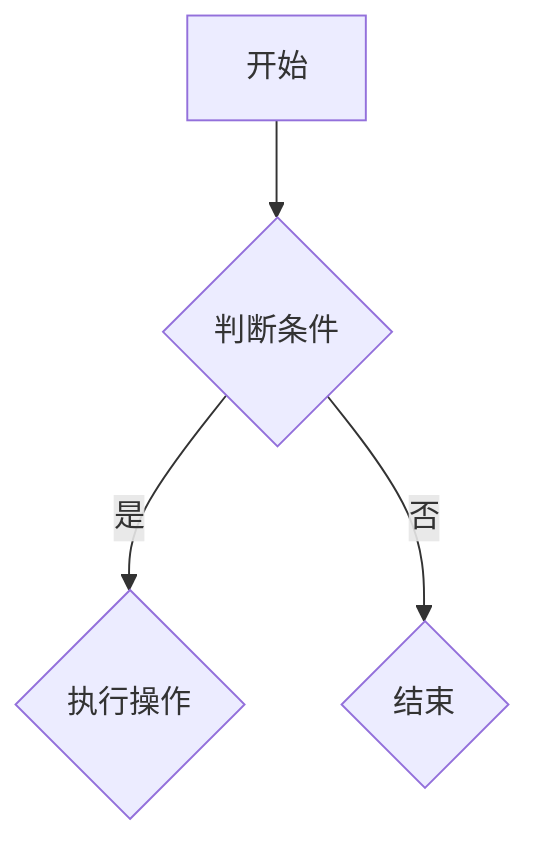

                 

### 第1章：AIGC与VR基本概念

#### 1.1 AIGC简介

**定义与背景**

自适应智能生成计算（Adaptive Intelligent Generation Computing，简称AIGC）是一种基于人工智能技术的计算范式，它通过自适应算法和生成模型，实现数据的自动生成、优化和分析。AIGC的核心思想是将人工智能与生成计算相结合，通过机器学习算法不断学习和优化生成模型，以实现高效、准确的数据生成。

AIGC的兴起源于计算机图形学、机器学习、生成模型等领域的发展。近年来，随着深度学习技术的成熟和计算资源的提升，AIGC在图像生成、自然语言处理、数据增强等方面取得了显著成果。特别是在虚拟现实（VR）、增强现实（AR）、游戏开发等领域，AIGC的应用前景十分广阔。

**核心技术**

AIGC的核心技术主要包括以下几种：

1. **生成对抗网络（GAN）**

生成对抗网络（Generative Adversarial Network，GAN）是AIGC中最常用的生成模型之一。GAN由生成器和判别器两部分组成，生成器负责生成数据，判别器负责判断生成数据的真实性。通过不断迭代训练，生成器逐渐提高生成数据的真实性，而判别器逐渐提高对真实数据的识别能力。GAN的核心算法原理可以表示为：

   - 生成器（Generator）: G(z)
   - 判别器（Discriminator）: D(x)

   其中，z 表示随机噪声向量，x 表示真实数据，G(z) 表示生成器生成的数据，D(x) 表示判别器对数据的判断。

   GAN的训练过程如下：
   - 初始化生成器和判别器参数
   - 对于每个迭代，生成器生成一批伪造数据 G(z)，判别器同时接收真实数据和伪造数据，通过反向传播更新参数
   - 当生成器生成的伪造数据越来越逼真时，判别器的判断准确率会逐渐降低

2. **自注意力机制（Self-Attention）**

自注意力机制（Self-Attention）是近年来在自然语言处理领域中广泛应用的注意力机制。它通过计算输入序列中每个元素对于其他元素的重要性权重，实现对序列的动态建模。自注意力机制的数学模型可以表示为：

   $$ 
   \text{Attention}(Q, K, V) = \text{softmax}\left(\frac{QK^T}{\sqrt{d_k}}\right)V 
   $$

   其中，Q、K、V 分别代表查询向量、键向量和值向量，d_k 表示键向量的维度，softmax 函数用于计算每个元素的重要性权重。

   自注意力机制可以显著提高神经网络对输入序列的建模能力，使其在处理长序列时更加高效。

3. **聚类与降维算法**

聚类与降维算法在AIGC中用于对高维数据进行预处理和压缩，以提高计算效率和模型性能。常见的聚类算法包括 K-均值聚类、层次聚类等；降维算法包括主成分分析（PCA）、线性判别分析（LDA）等。

   聚类算法的主要目的是将数据划分为多个类别，以便进行后续处理。K-均值聚类算法的步骤如下：

   - 初始化 K 个聚类中心
   - 对于每个数据点，计算其到各个聚类中心的距离，并将其分配到距离最近的聚类中心
   - 重新计算每个聚类的中心
   - 重复步骤 2 和 3，直到聚类中心的变化小于设定阈值

   降维算法的主要目的是减少数据维度，同时保留大部分信息。PCA 是一种常用的降维算法，其步骤如下：

   - 计算数据的协方差矩阵
   - 计算协方差矩阵的特征值和特征向量
   - 将数据投影到特征向量组成的正交基上，保留最大的特征值对应的特征向量

#### 1.2 VR简介

**定义与背景**

虚拟现实（Virtual Reality，简称VR）是一种通过计算机模拟技术创造的虚拟环境，用户可以通过头戴显示器（HMD）、手柄、身体动作等设备感知和互动。VR技术可以让用户感受到身临其境的沉浸感，广泛应用于游戏、娱乐、教育、医疗等领域。

VR技术的发展经历了多个阶段，从最初的桌面虚拟现实到现在的沉浸式VR，硬件设备和技术不断改进，用户交互体验越来越真实。

**核心技术**

VR的核心技术包括以下几个方面：

1. **头戴显示器（HMD）**

头戴显示器（Head-Mounted Display，HMD）是VR系统的核心设备，它通过光学元件将计算机生成的虚拟画面显示在用户眼前。常见的HMD设备包括 Oculus Rift、HTC Vive、PlayStation VR等。

2. **定位与追踪技术**

定位与追踪技术用于实时捕捉用户在虚拟环境中的位置和动作。常见的追踪技术包括外部传感器追踪、惯性传感器追踪等。外部传感器追踪通过在用户身上或环境中布置传感器，实时捕捉用户的位置和动作；惯性传感器追踪通过内置在HMD和手柄中的加速度计、陀螺仪等传感器，实现用户位置的实时追踪。

3. **图形渲染技术**

图形渲染技术用于生成高质量的虚拟画面。常见的渲染技术包括实时渲染、预渲染等。实时渲染在计算机上实时生成虚拟画面，适用于交互性要求高的应用场景；预渲染则在渲染阶段生成虚拟画面，适用于对实时性要求不高的应用场景。

4. **交互技术**

交互技术用于用户在虚拟环境中的操作和反馈。常见的交互技术包括手势识别、语音识别、体感控制等。手势识别通过摄像头捕捉用户的手部动作，实现虚拟操作；语音识别通过语音信号处理，实现语音交互；体感控制通过用户的身体动作，控制虚拟角色的动作。

#### 1.3 AIGC与VR结合背景

**心理治疗需求的演变**

随着社会发展和生活压力的增加，心理健康问题日益凸显。传统的心理治疗方式，如药物治疗、心理咨询等，虽然在一定程度上缓解了心理问题，但仍存在一定的局限性。例如，药物治疗可能导致副作用，心理咨询需要较长时间的积累和专业知识。

虚拟现实（VR）技术作为一种新兴的治疗手段，通过创造虚拟环境，让用户在沉浸式的体验中缓解心理压力。VR疗法在恐惧症、焦虑症、创伤后应激障碍（PTSD）等方面已取得显著成果。然而，传统的VR疗法在个性化、实时交互等方面仍有待提升。

**AIGC与VR结合的潜力**

AIGC技术具有自适应、智能化的特点，可以实时生成和调整虚拟环境，满足用户个性化的心理需求。将AIGC与VR技术结合，可以进一步提升心理治疗的疗效和用户体验。具体表现在以下几个方面：

1. **个性化治疗**

AIGC可以根据患者的心理特征、病情等信息，生成个性化的虚拟环境。例如，为患有恐惧症的患者创造一个逐步适应恐惧源的场景，从而逐步克服恐惧。

2. **实时交互**

AIGC可以实时分析患者的情绪和行为，调整虚拟环境的参数，实现更加真实的交互体验。例如，当患者表现出焦虑情绪时，虚拟环境可以调整光线、音乐等参数，以缓解患者的情绪。

3. **数据驱动**

AIGC可以实时收集和分析患者在虚拟环境中的行为数据，为心理治疗提供更加精准的依据。例如，通过分析患者的交互行为，预测患者的病情变化，从而调整治疗方案。

**现有的融合应用实例**

目前，AIGC与VR在心理治疗中已有很多成功应用实例。例如，某心理治疗中心采用AIGC与VR技术，为患有焦虑症的患者提供个性化心理治疗。通过AIGC生成的虚拟环境，患者可以逐步适应恐惧源，实现心理问题的缓解。此外，还有一些研究机构和公司，正在探索AIGC与VR在抑郁症、PTSD等心理治疗中的应用。

总之，AIGC与VR在心理治疗中的结合，具有巨大的发展潜力和应用前景。随着技术的不断进步和优化，相信AIGC与VR将为心理健康领域带来更多创新和突破。

---

#### 1.2 VR在心理治疗中的应用

**VR疗法的基本原理**

VR疗法（Virtual Reality Therapy，VRT）是利用虚拟现实技术创建一个模拟的环境，让用户在其中进行互动和体验。这一技术通过模拟特定的场景或情境，帮助用户处理和应对心理问题。基本原理包括以下几个方面：

1. **沉浸感**

VR疗法的一个重要特点是能够为用户提供高度沉浸的体验。通过VR设备，如头戴式显示器（HMD）和跟踪设备，用户可以进入一个三维的虚拟环境，感觉就像身处真实世界中一样。这种沉浸感能够减少患者的焦虑和恐惧，有助于他们更放松地面对治疗情境。

2. **控制感**

在VR疗法中，用户可以对虚拟环境中的元素进行控制，这种控制感有助于增强用户的自信心和自我效能感。用户可以通过手柄、手势或其他交互设备与虚拟环境互动，从而在治疗过程中感到更加主动和参与。

3. **逐步暴露**

VR疗法通常采用逐步暴露的方法，即逐渐让用户面对他们的恐惧源。这种渐进式的暴露可以帮助用户逐渐适应并克服心理问题。例如，对于患有高度恐惧症的患者，治疗师可能从较简单、较不具威胁性的情境开始，逐步增加情境的难度。

4. **反馈机制**

VR疗法中的反馈机制是另一个关键要素。治疗师可以实时监控用户的反应，并根据用户的情绪和行为调整虚拟环境中的情境。这种反馈机制有助于提供个性化的治疗体验，同时确保治疗过程的安全性和有效性。

**VR在心理治疗中的案例分析**

以下是一些VR在心理治疗中应用的案例：

1. **恐惧症治疗**

恐惧症是一种常见的心理障碍，患者对特定物体、情境或活动有强烈的恐惧和回避行为。VR疗法通过逐步暴露患者于恐惧源，帮助他们克服恐惧。例如，一个患有飞行恐惧症的患者可以在虚拟环境中体验飞行，从较低的高度开始，逐步增加高度，直到能够克服恐惧。

2. **创伤后应激障碍（PTSD）治疗**

创伤后应激障碍是一种心理创伤后出现的应激反应，患者可能会体验到反复的创伤记忆、恐惧、失眠等症状。VR疗法通过虚拟现实技术重现创伤事件，帮助患者重新面对和处理这些记忆，从而减轻症状。例如，对于经历过战争或暴力事件的退伍军人，VR疗法可以模拟战场环境，让他们在安全的环境中重新体验和释放情感。

3. **焦虑症治疗**

焦虑症是一种常见的情绪障碍，患者常常感受到过度的担忧和紧张。VR疗法通过模拟焦虑情境，帮助患者学会应对和缓解焦虑。例如，一个患有社交焦虑症的患者可以在虚拟环境中模拟社交场合，逐渐提高他们的社交技能和自信心。

**AIGC与VR结合的心理治疗方案设计**

AIGC（自适应智能生成计算）技术的引入为VR疗法提供了更多的可能性。以下是一个结合AIGC与VR的心理治疗方案设计案例：

1. **个性化评估**

在开始治疗前，使用AIGC对患者的心理状态进行评估。通过分析患者的历史数据、自我报告和生理信号，AIGC可以生成一个个性化的心理状态报告，为治疗提供依据。

2. **自适应环境生成**

根据患者的个性化心理状态报告，AIGC可以生成一个适合患者特点的虚拟环境。这个环境可以根据患者的喜好、恐惧源和心理需求进行定制化调整，以提高治疗的有效性和患者的参与度。

3. **实时交互调整**

在治疗过程中，AIGC可以实时监测患者的情绪和行为，并根据患者的反应动态调整虚拟环境中的情境。例如，当患者表现出焦虑情绪时，AIGC可以调整环境中的光线、音乐和场景细节，以帮助患者缓解情绪。

4. **数据驱动治疗**

AIGC可以收集患者在虚拟环境中的行为和情绪数据，分析这些数据以预测患者的病情变化和治疗效果。这些数据可以为后续的治疗方案调整提供科学依据。

通过AIGC与VR的结合，心理治疗方案可以更加个性化和高效。AIGC提供的自适应能力和实时交互调整，使得治疗过程更加符合患者的需求，从而提高治疗效果。

#### 第2章：AIGC核心技术与原理

在AIGC（自适应智能生成计算）领域中，几种核心技术扮演着至关重要的角色。这些技术包括生成对抗网络（GAN）、自注意力机制（Self-Attention）以及聚类与降维算法。在本章中，我们将详细探讨这些技术的原理，并展示如何在实际应用中使用它们。

##### 2.1 生成对抗网络（GAN）

**基本原理**

生成对抗网络（Generative Adversarial Network，GAN）是由Ian Goodfellow等人于2014年提出的。GAN由两个神经网络组成：生成器（Generator）和判别器（Discriminator）。生成器的任务是生成尽可能逼真的数据，而判别器的任务是区分生成数据与真实数据。

GAN的训练过程可以看作是一场博弈。生成器和判别器不断地相互对抗、学习。在每一轮训练中，生成器尝试生成更加真实的数据，而判别器则努力提高对真实数据与生成数据的辨别能力。随着训练的进行，生成器的生成质量逐渐提高，判别器的辨别能力逐渐增强。

GAN的核心算法包括以下几个步骤：

1. **生成器G（Generator）**

   生成器的输入是一个随机噪声向量 \( z \)，输出是生成的数据 \( x_G(z) \)。生成器的目标是生成看起来真实的数据。

   $$
   G(z) = x_G(z)
   $$

2. **判别器D（Discriminator）**

   判别器的输入是真实数据 \( x \) 和生成数据 \( x_G(z) \)，输出是对数据真实性的概率估计 \( D(x) \) 和 \( D(x_G(z)) \)。判别器的目标是最大化对真实数据和生成数据的区分能力。

   $$
   D(x) = P(D(x) = 1 | x \text{ is real})
   $$
   $$
   D(x_G(z)) = P(D(x_G(z)) = 1 | x_G(z) \text{ is generated})
   $$

3. **对抗性训练**

   生成器和判别器通过对抗性训练相互学习。损失函数通常使用二元交叉熵损失：

   $$
   L_G = -\sum_{x \in \text{data}} D(x) - \sum_{z \in \text{noise}} D(x_G(z))
   $$
   $$
   L_D = -\sum_{x \in \text{data}} D(x) + \sum_{z \in \text{noise}} D(x_G(z))
   $$

   其中， \( L_G \) 是生成器的损失函数， \( L_D \) 是判别器的损失函数。

**Python实现**

以下是一个简化的GAN示例，使用Python和TensorFlow库：

```python
import tensorflow as tf
from tensorflow.keras.layers import Dense, Flatten, Conv2D, BatchNormalization
from tensorflow.keras.models import Sequential

# 生成器模型
def build_generator(z_dim):
    model = Sequential()
    model.add(Dense(7 * 7 * 128, activation="relu", input_dim=z_dim))
    model.add(BatchNormalization())
    model.add(Reshape((7, 7, 128)))
    
    model.add(Conv2D(128, kernel_size=3, stride=1, padding="same", activation="relu"))
    model.add(BatchNormalization())
    
    model.add(Conv2D(1, kernel_size=3, stride=1, padding="same", activation="tanh"))
    return model

# 判别器模型
def build_discriminator(img_shape):
    model = Sequential()
    model.add(Conv2D(32, kernel_size=3, stride=2, input_shape=img_shape, padding="same"))
    model.add(LeakyReLU(alpha=0.01))
    
    model.add(Conv2D(64, kernel_size=3, stride=2, padding="same"))
    model.add(BatchNormalization())
    model.add(LeakyReLU(alpha=0.01))
    
    model.add(Flatten())
    model.add(Dense(1, activation='sigmoid'))
    return model

# GAN模型
def build_gan(generator, discriminator):
    model = Sequential()
    model.add(generator)
    model.add(discriminator)
    return model
```

**应用示例**

GAN在图像生成、数据增强和风格迁移等方面有广泛应用。以下是一个GAN用于图像生成和超分辨率提升的示例：

```python
import numpy as np
import matplotlib.pyplot as plt

# 设置随机种子
tf.random.set_seed(42)

# 定义参数
img_height = 28
img_width = 28
z_dim = 100

# 创建生成器和判别器模型
generator = build_generator(z_dim)
discriminator = build_discriminator((img_height, img_width, 1))
gan = build_gan(generator, discriminator)

# 训练GAN
# ...（此处为训练代码）

# 生成图像
noise = np.random.normal(0, 1, (1, z_dim))
generated_image = generator.predict(noise)

# 可视化
plt.imshow(generated_image[0, :, :, 0], cmap='gray')
plt.show()
```

**数学模型与公式**

GAN的核心数学模型可以表示为：

$$
x_G(z) \sim p_G(z)
$$

$$
x \sim p_data(x)
$$

$$
\min_G \max_D V(D, G) = \mathbb{E}_{x \sim p_data(x)}[\log D(x)] + \mathbb{E}_{z \sim p_z(z)}[\log(1 - D(x_G(z)))]
$$

其中， \( p_G(z) \) 是生成器的概率分布， \( p_data(x) \) 是真实数据的概率分布， \( D(x) \) 是判别器的输出概率， \( x_G(z) \) 是生成器生成的数据。

##### 2.2 自注意力机制（Self-Attention）

**基本原理**

自注意力机制（Self-Attention）是一种在序列处理任务中广泛应用的注意力机制。它的核心思想是，对于序列中的每个元素，计算其对于其他元素的重要性权重，然后加权求和。自注意力机制可以显著提高神经网络对序列信息的建模能力。

自注意力机制的数学模型可以表示为：

$$
\text{Attention}(Q, K, V) = \text{softmax}\left(\frac{QK^T}{\sqrt{d_k}}\right)V
$$

其中， \( Q \) 、 \( K \) 和 \( V \) 分别代表查询向量、键向量和值向量， \( d_k \) 是键向量的维度，softmax 函数用于计算每个元素的重要性权重。

自注意力机制的训练通常通过反向传播进行。具体步骤如下：

1. **前向传播**

   对于输入序列 \( X \) ，计算每个元素的重要性权重 \( \alpha_{ij} \) ：

   $$
   \alpha_{ij} = \text{softmax}\left(\frac{Q_i K_j^T}{\sqrt{d_k}}\right)
   $$

   其中， \( Q_i \) 和 \( K_j \) 分别是查询向量和键向量。

2. **加权求和**

   根据重要性权重 \( \alpha_{ij} \) ，对值向量 \( V \) 进行加权求和，得到新的输出序列 \( H \) ：

   $$
   H_i = \sum_j \alpha_{ij} V_j
   $$

**应用示例**

自注意力机制在自然语言处理（NLP）中有着广泛的应用，尤其是在Transformer模型中。以下是一个简单的自注意力层的实现：

```python
import tensorflow as tf

def scaled_dot_product_attention(q, k, v, attention_mask=None):
    """ scaled dot-product attention """
    dot_product = tf.matmul(q, k, transpose_b=True)
    depth = dot_product.shape[-1]
    dot_product = dot_product / tf.sqrt(tf.cast(depth, tf.float32))
    
    if attention_mask is not None:
        dot_product = dot_product + attention_mask
    
    attention_weights = tf.nn.softmax(dot_product, axis=-1)
    output = tf.matmul(attention_weights, v)
    
    return output, attention_weights
```

**数学模型与公式**

自注意力机制的数学模型可以表示为：

$$
\text{Attention}(Q, K, V) = \text{softmax}\left(\frac{QK^T}{\sqrt{d_k}}\right)V
$$

其中， \( Q \) 、 \( K \) 和 \( V \) 分别代表查询向量、键向量和值向量， \( d_k \) 是键向量的维度，softmax 函数用于计算每个元素的重要性权重。

##### 2.3 聚类与降维算法

**基本原理**

聚类与降维算法是数据预处理中的重要技术。聚类算法将数据分为若干个类别，而降维算法用于减少数据维度，同时保留大部分信息。

**K-均值聚类**

K-均值聚类（K-Means Clustering）是一种简单的聚类算法。它通过以下步骤进行：

1. **初始化聚类中心**

   随机选择 \( K \) 个数据点作为初始聚类中心。

2. **分配数据点**

   对于每个数据点，计算其与各个聚类中心的距离，并将其分配到距离最近的聚类中心。

3. **更新聚类中心**

   计算每个聚类中心的平均值，作为新的聚类中心。

4. **重复步骤 2 和 3，直到聚类中心的变化小于设定阈值或达到最大迭代次数。

**主成分分析（PCA）**

主成分分析（Principal Component Analysis，PCA）是一种常用的降维算法。其主要步骤如下：

1. **计算协方差矩阵**

   计算数据点的协方差矩阵。

2. **计算协方差矩阵的特征值和特征向量**

   对协方差矩阵进行特征分解，得到特征值和特征向量。

3. **选择主成分**

   根据特征值的大小选择前 \( K \) 个特征向量作为主成分。

4. **数据投影**

   将数据投影到主成分上，从而实现降维。

**Python实现**

以下是一个简单的K-均值聚类和PCA的示例：

```python
import numpy as np
from sklearn.cluster import KMeans
from sklearn.decomposition import PCA

# K-均值聚类示例
X = np.array([[1, 2], [1, 4], [1, 0], [4, 2], [4, 4], [4, 0]])
kmeans = KMeans(n_clusters=2, random_state=0).fit(X)
labels = kmeans.predict(X)
centroids = kmeans.cluster_centers_

# PCA示例
pca = PCA(n_components=2)
X_pca = pca.fit_transform(X)

print("K-均值聚类中心：", centroids)
print("PCA后的数据：", X_pca)
```

**数学模型与公式**

K-均值聚类的数学模型可以表示为：

$$
c_j = \frac{1}{N_j} \sum_{i=1}^{N} x_i
$$

$$
x_i = \arg\min_{j} \|x_i - c_j\|
$$

其中， \( c_j \) 是聚类中心， \( x_i \) 是数据点， \( N_j \) 是属于聚类 \( j \) 的数据点数量。

PCA的数学模型可以表示为：

$$
\text{协方差矩阵} = \frac{1}{N} \sum_{i=1}^{N} (x_i - \mu)(x_i - \mu)^T
$$

$$
\text{特征值分解} = \text{协方差矩阵} = P\Lambda P^T
$$

$$
x_pca = P\Lambda^{-1} \mu
$$

其中， \( P \) 是特征向量矩阵， \( \Lambda \) 是特征值矩阵， \( x_pca \) 是降维后的数据点， \( \mu \) 是数据点的均值。

通过以上对AIGC核心技术的详细介绍，我们可以看到这些技术如何为AIGC的应用提供强有力的支持。在接下来的章节中，我们将进一步探讨这些技术在心理治疗中的具体应用。

---

#### 第3章：AIGC在心理评估中的应用

AIGC在心理评估中的应用为心理健康评估带来了革命性的变革。通过结合生成对抗网络（GAN）、自注意力机制（Self-Attention）等先进技术，AIGC能够提供更准确、个性化的心理评估服务。在本节中，我们将探讨AIGC在心理评估中的具体应用，包括心理评估工具的智能化改造、患者特征分析以及个性化心理评估方案设计。

##### 3.1 心理评估工具的智能化改造

传统的心理评估工具通常依赖于问卷、量表等纸质形式，这些方法在数据处理和分析上存在一定的局限性。AIGC通过引入智能算法，能够显著提升心理评估工具的效率和准确性。以下是一些具体的智能化改造方法：

1. **自动生成评估问卷**

   AIGC可以通过GAN等技术自动生成大量结构化的评估问卷。这些问卷可以根据患者的具体需求进行个性化调整，从而提高问卷的针对性和有效性。例如，使用GAN生成一系列关于焦虑和抑郁的问卷问题，并根据患者的回答动态调整问题的难度和内容。

2. **智能分析问卷结果**

   在收集问卷数据后，AIGC可以利用自注意力机制对问卷结果进行智能分析。自注意力机制能够捕捉问卷中各个问题之间的相关性，从而提供更深入的洞察。例如，分析一个关于焦虑水平的问卷，AIGC可以识别出哪些问题与焦虑水平有显著关联，进而提供更加精准的诊断。

3. **实时反馈与改进**

   AIGC可以实时分析评估结果，并根据分析结果提供即时的反馈和建议。例如，当患者完成一份关于情绪状态的问卷后，AIGC可以立即分析结果，并提供个性化的情绪调节建议。这种实时反馈机制有助于患者及时了解自己的心理状态，并采取相应的措施。

##### 3.2 AIGC在患者特征分析中的应用

对患者特征的分析是心理评估的核心步骤，AIGC在这一领域中的应用同样具有显著优势。通过以下方法，AIGC能够更加深入地了解患者的心理特征：

1. **聚类与分类**

   AIGC可以利用聚类算法（如K-均值聚类）对大量患者数据进行分类，识别出具有相似心理特征的患者群体。这种方法有助于识别出不同类型的心理障碍，并为每位患者提供个性化的治疗方案。例如，通过对大量抑郁症患者的数据进行分析，AIGC可以识别出不同类型的抑郁症，从而提供更有针对性的治疗建议。

2. **特征提取与降维**

   AIGC可以通过降维算法（如主成分分析PCA）从高维数据中提取关键特征，简化数据分析过程。这种方法不仅能够提高数据分析的效率，还能够减少数据的冗余，从而提供更精确的分析结果。例如，通过对患者的情绪数据进行分析，AIGC可以提取出与情绪状态最相关的几个特征，从而更加准确地评估患者的情绪状态。

3. **行为预测与预警**

   AIGC可以通过自注意力机制对患者的行为数据进行分析，预测患者的心理状态变化，并提前预警潜在的心理问题。例如，通过对患者的日常行为数据（如睡眠质量、活动频率等）进行分析，AIGC可以预测患者是否可能发生情绪波动，并提前采取措施进行干预。

##### 3.3 个性化心理评估方案设计

AIGC在心理评估中的应用不仅能够提升评估工具的效率和准确性，还能够为每位患者提供个性化的心理评估方案。以下是一些设计个性化心理评估方案的方法：

1. **评估方案定制**

   AIGC可以根据患者的具体需求和心理特征，定制个性化的心理评估方案。例如，对于一位焦虑症患者，AIGC可以设计一套包括情绪调节、认知行为疗法等多个方面的评估方案，从而更全面地了解患者的心理状态。

2. **实时调整与优化**

   AIGC可以实时收集患者在评估过程中的反馈数据，并根据这些数据动态调整评估方案。这种方法有助于确保评估方案始终与患者的心理需求相匹配，提高治疗的针对性和有效性。

3. **跨学科协作**

   AIGC可以通过整合多学科的数据和信息，为心理评估提供更加全面的视角。例如，结合生物学、心理学、社会学等多领域的数据，AIGC可以更深入地了解患者的心理状态，从而提供更加科学的评估方案。

通过以上方法，AIGC在心理评估中的应用不仅能够提高评估的准确性和效率，还能够为患者提供更加个性化和科学的治疗方案。随着AIGC技术的不断发展和完善，相信在心理治疗领域，它将发挥越来越重要的作用。

---

### 第4章：AIGC在心理干预中的应用

AIGC在心理干预中的应用极大地拓展了心理治疗的方法和手段。通过生成对抗网络（GAN）、自注意力机制（Self-Attention）等技术的结合，AIGC能够实现高度个性化的心理干预方案。以下将详细介绍AIGC在心理干预中的应用，包括交互式虚拟心理治疗环境的构建、虚拟情景模拟及其在心理干预中的应用。

##### 4.1 AIGC辅助心理干预的案例研究

**案例背景**

某心理健康中心利用AIGC技术，为一名患有严重社交恐惧症的患者进行心理干预。患者小明（化名）因长期害怕与他人交往，导致生活质量严重下降。传统心理干预方法效果有限，小明和其家人期望通过AIGC技术实现更加个性化的心理治疗。

**干预过程**

1. **个性化评估**

   初始阶段，心理健康中心利用AIGC对小明进行全面的个性化评估。通过收集小明的心理问卷数据、生理信号（如心率、皮肤电活动）和行为数据（如社交互动频率），AIGC生成了一份详细的心理状态报告。报告显示了小明的社交恐惧程度、情绪反应模式以及可能的心理障碍类型。

2. **交互式虚拟环境构建**

   基于个性化评估报告，AIGC生成了一个交互式虚拟环境。该环境模拟了各种社交场景，包括咖啡店、公园、会议等。环境中的虚拟角色具有不同的性格和反应模式，可以根据小明的实时反馈进行调整。

3. **逐步暴露与反馈**

   干预过程中，心理治疗师通过逐步暴露法，引导小明逐渐面对社交恐惧。在AIGC生成的虚拟环境中，小明首先面对一些低难度的社交场景，如与虚拟角色进行简单对话。随着治疗进展，场景难度逐渐增加，小明逐渐面对更复杂的社交情境。

   在每个阶段，AIGC实时分析小明的情绪和行为反应，提供个性化的反馈。例如，当小明表现出紧张或焦虑时，虚拟环境中的音乐、光线和虚拟角色的互动方式会进行调整，以帮助小明缓解情绪。

4. **数据驱动的治疗调整**

   干预过程中，AIGC持续收集小明的行为和情绪数据。通过对这些数据的分析，AIGC可以预测小明的情绪变化和治疗效果。治疗师根据这些预测结果，动态调整干预策略，确保治疗过程始终与患者的心理需求相匹配。

**效果评估**

经过一段时间的治疗，小明在社交互动中逐渐表现出积极的情绪变化。他的社交恐惧症状得到显著缓解，生活质量显著提高。治疗效果通过问卷调查和生理信号监测进行评估，结果显示小明的社交恐惧程度显著降低，情绪调节能力显著增强。

##### 4.2 交互式虚拟心理治疗环境构建

交互式虚拟心理治疗环境是AIGC在心理干预中的重要应用之一。以下为环境构建的关键步骤：

1. **环境设计**

   根据患者的心理特征和治疗需求，AIGC设计适合的虚拟环境。环境可以包括多个场景，如家庭、学校、工作场所等。每个场景中的物体、角色和背景都可以通过AIGC生成，以实现高度个性化。

2. **交互机制**

   虚拟环境中的交互机制是治疗成功的关键。AIGC通过自注意力机制和生成对抗网络，实现高度逼真的交互体验。患者可以通过语音、手势和表情与虚拟角色互动，虚拟角色根据患者的反馈进行实时调整。

3. **情绪监测与反馈**

   AIGC实时分析患者的情绪和行为，通过环境中的音乐、光线、角色互动等方式提供个性化的情绪调节。例如，当患者表现出紧张时，环境中的音乐可以调整为轻柔的旋律，角色互动方式也会变得温和。

##### 4.3 虚拟情景模拟中的应用

虚拟情景模拟是AIGC在心理干预中的另一个重要应用。通过模拟各种真实的情境，患者可以在安全的环境中逐步面对和处理自己的心理问题。

1. **模拟情境**

   AIGC可以生成各种模拟情境，如社交聚会、公开演讲、面试等。情境中的角色和事件可以按照患者的具体需求进行调整。

2. **渐进式暴露**

   患者在虚拟情景中的暴露过程是逐步进行的。治疗师根据患者的反馈和情绪变化，逐渐增加情境的难度。例如，从简单的社交聚会开始，逐步过渡到更复杂的公开演讲。

3. **情绪调节**

   在虚拟情景模拟过程中，AIGC通过实时分析患者的情绪和行为，提供个性化的情绪调节。例如，当患者表现出焦虑情绪时，虚拟环境中的光线、音乐和角色互动都会进行调整，帮助患者缓解情绪。

通过AIGC技术的应用，心理干预过程变得更加个性化和高效。交互式虚拟心理治疗环境和虚拟情景模拟不仅提高了治疗的趣味性和参与度，还使得治疗过程更加贴近患者的实际需求。随着AIGC技术的不断发展，相信在心理干预领域，它将发挥越来越重要的作用，为患者提供更加科学和有效的治疗手段。

---

### 第5章：AIGC在心理健康监测中的应用

在心理健康监测领域，AIGC（自适应智能生成计算）技术通过其高度的自适应性和智能化特点，为实时、高效的心理健康数据分析和预测提供了强有力的支持。本节将详细探讨AIGC在心理健康监测中的关键应用，包括心理健康监测数据的智能分析、情绪识别与预测以及预防性心理干预策略。

#### 5.1 心理健康监测数据的智能分析

心理健康的监测需要收集和处理大量的数据，包括生理信号（如心率、血压、皮肤电活动等）、行为数据（如日常活动、社交互动等）以及自我报告的数据（如情绪状态、心理状况等）。AIGC技术通过以下方法实现了对这些数据的智能分析：

1. **数据预处理**

   AIGC技术能够高效地进行数据预处理，包括数据清洗、归一化、特征提取等。通过使用聚类与降维算法（如K-均值聚类、主成分分析PCA），AIGC可以减少数据的冗余，提取关键特征，从而提高数据分析的效率和准确性。

2. **实时数据处理**

   AIGC技术支持实时数据处理，能够快速地对心理健康监测数据进行处理和分析。通过生成对抗网络（GAN）和自注意力机制，AIGC能够实时捕捉数据中的变化模式，从而及时识别异常情况。

3. **数据融合**

   在心理健康监测中，不同类型的数据（如生理信号、行为数据、自我报告等）往往需要融合在一起进行分析。AIGC通过数据融合技术，能够整合多种数据源，提供更全面的心理健康评估。

#### 5.2 情绪识别与预测

情绪识别与预测是心理健康监测中的关键环节。AIGC技术通过深度学习和生成模型，实现了对情绪的准确识别和预测。以下为具体应用：

1. **情绪识别**

   AIGC利用生成对抗网络（GAN）和自注意力机制，可以从大量的行为数据和生理信号中识别情绪。例如，通过分析心率变异性（HRV）数据，AIGC可以识别出用户的焦虑、紧张等情绪状态。

2. **情绪预测**

   AIGC可以通过对历史数据的分析，预测用户未来的情绪状态。通过自注意力机制，AIGC能够捕捉到情绪变化的趋势和模式，从而提前预警可能出现的情绪问题。例如，当AIGC预测到用户可能进入焦虑状态时，可以提前发出警告，并建议用户采取相应的应对措施。

3. **情感分析**

   在自然语言处理领域，AIGC可以通过情感分析技术，对用户在社交媒体、邮件等平台上的文本进行情感分析，识别出用户的情绪状态。这种技术有助于更全面地了解用户的心理状况。

#### 5.3 预防性心理干预策略

AIGC技术不仅能够识别和预测情绪，还能够为预防性心理干预提供科学依据和策略。以下为一些预防性心理干预策略：

1. **个性化预防方案**

   AIGC可以根据用户的情绪状态和心理特征，生成个性化的预防方案。例如，对于易焦虑的用户，AIGC可以建议进行深呼吸训练、冥想等放松活动，以帮助用户缓解情绪。

2. **实时反馈与调整**

   AIGC可以实时收集用户的反馈，并根据反馈结果动态调整预防方案。例如，当用户在执行某个放松练习时，AIGC可以根据用户的情绪变化，调整练习的强度和时间。

3. **跨学科协作**

   AIGC可以整合心理学、医学、生物学等多学科的数据和信息，为预防性心理干预提供更全面的视角。例如，结合生物学指标（如荷尔蒙水平）和心理学数据（如情绪状态），AIGC可以制定更加精准的预防方案。

通过AIGC技术的应用，心理健康监测变得更加智能和高效。AIGC不仅能够实时识别和预测情绪，还能够为预防性心理干预提供科学依据和策略。随着AIGC技术的不断发展和完善，相信在心理健康监测领域，它将发挥越来越重要的作用，为人们提供更全面、更精准的心理健康服务。

### 第6章：VR硬件与软件技术基础

虚拟现实（VR）技术作为心理治疗中的重要工具，其硬件和软件基础的重要性不容忽视。本章将详细探讨VR硬件设备、VR内容制作与渲染技术、VR交互技术与用户体验优化，为读者提供全面的技术背景和实际应用指导。

#### 6.1 VR硬件设备

VR硬件设备是VR技术实现沉浸式体验的关键。以下是一些关键的VR硬件设备：

1. **头戴显示器（HMD）**

   头戴显示器（HMD）是VR系统的核心组件，它通常包括一个显示器、一对耳机和跟踪系统。常见的HMD设备有Oculus Rift、HTC Vive和Sony PlayStation VR。HMD设备的显示分辨率和刷新率直接影响用户体验。

2. **跟踪设备**

   跟踪设备用于捕捉用户的头部和身体运动，确保虚拟环境中的对象与用户的实际运动同步。常见的跟踪设备包括外部传感器、内置惯性测量单元（IMU）以及光学传感器。

3. **手柄和控制设备**

   VR手柄和控制设备允许用户在虚拟环境中进行交互。例如，Oculus Touch和HTC Vive Controller都是常用的手柄设备，它们配备了各种传感器，如触摸感应器、运动传感器和位置追踪器。

4. **VR一体机**

   VR一体机是将计算能力和VR设备集成在一起的设备，用户无需连接外部计算机即可使用。例如，Samsung Gear VR和Google Daydream View都是常见的一体机设备。

#### 6.2 VR内容制作与渲染技术

VR内容的制作和渲染技术是实现高质量沉浸式体验的关键。以下是一些关键技术：

1. **3D建模与动画**

   3D建模与动画是VR内容制作的基础。通过3D建模软件（如Blender、Maya）创建虚拟环境中的物体和角色，并通过动画软件（如Adobe Animate、Cinema 4D）为它们添加动态效果。

2. **渲染技术**

   渲染技术用于生成虚拟环境中的图像。常见的渲染技术包括实时渲染、预渲染和光追渲染。实时渲染适用于交互性要求高的应用场景，而预渲染和光追渲染则适用于高质量视觉效果的需求。

3. **声音设计**

   声音设计是VR体验的重要组成部分。通过3D音效技术，如空间混响和声源定位，用户可以感受到虚拟环境中的声音来源和空间感。

#### 6.3 VR交互技术与用户体验优化

VR交互技术和用户体验优化是提升VR应用效果的关键。以下是一些关键技术：

1. **手势识别**

   手势识别技术允许用户通过手势与虚拟环境进行交互。通过摄像头和深度传感器，系统可以识别用户的手部动作，实现自然的交互体验。

2. **语音交互**

   语音交互技术通过语音识别和语音合成，实现用户与虚拟环境的自然对话。语音交互可以提供更便捷的交互方式，减少对物理设备的依赖。

3. **位置追踪**

   位置追踪技术用于捕捉用户在虚拟环境中的位置和运动，确保虚拟环境中的对象与用户的实际运动同步。通过惯性测量单元（IMU）和光学传感器，可以实现高精度的位置追踪。

4. **用户体验优化**

   用户体验优化涉及多个方面，包括界面设计、操作流畅性和沉浸感。通过不断测试和优化，可以提升用户的满意度和使用体验。

通过本章的探讨，读者可以了解到VR硬件与软件技术的基础知识，为在心理治疗中的应用打下坚实的基础。在接下来的章节中，我们将进一步探讨AIGC与VR融合的技术框架及其在心理治疗中的具体应用。

### 第7章：AIGC与VR融合的技术框架

为了充分发挥AIGC（自适应智能生成计算）与VR（虚拟现实）在心理治疗中的潜力，构建一个融合两者的技术框架至关重要。这一框架不仅需要集成两者的核心技术，还需确保系统的稳定运行和高效数据处理。以下将详细探讨AIGC与VR融合的技术框架，包括AIGC与VR集成方案设计、跨平台开发与兼容性优化、实时数据流处理与反馈机制。

#### 7.1 AIGC与VR集成方案设计

AIGC与VR的集成方案设计需要考虑多个方面，包括硬件配置、软件架构和数据流管理。以下是一个典型的集成方案：

1. **硬件配置**

   - **计算资源**：AIGC技术依赖于大量的计算资源，包括高性能的CPU和GPU。VR系统也需要强大的计算能力来处理实时渲染和交互。因此，集成方案需要选择具有强大计算能力的硬件平台，如高性能工作站或云计算平台。
   - **存储资源**：AIGC生成的数据和VR内容需要大量的存储空间。集成方案应包括大容量、快速响应的存储设备，如固态硬盘（SSD）或分布式存储系统。
   - **网络配置**：对于远程应用，网络配置至关重要。应采用高带宽、低延迟的网络连接，以确保数据传输的稳定和高效。

2. **软件架构**

   - **分布式架构**：为了提升系统的可扩展性和可靠性，集成方案应采用分布式架构。通过将计算、存储和网络资源分布在不同节点上，可以有效提升系统的性能和容错能力。
   - **模块化设计**：集成方案应采用模块化设计，将AIGC和VR的核心功能模块化。例如，AIGC模块负责数据生成和自适应调整，VR模块负责内容渲染和交互。这种设计便于系统的维护和升级。
   - **通信协议**：集成方案应采用高效、可靠的通信协议，如WebSocket或HTTP/2，确保数据在不同模块之间的快速传输和同步。

3. **数据流管理**

   - **数据采集与预处理**：AIGC与VR系统的集成首先需要采集和处理大量的数据，包括生理信号、行为数据和交互数据。数据采集与预处理模块负责将原始数据转换为可用于分析的格式。
   - **数据存储与检索**：集成方案需要高效的数据存储与检索系统。利用分布式存储和数据库技术，可以实现大规模数据的快速存储和查询。
   - **数据同步与传输**：在实时应用中，数据的同步与传输至关重要。应采用实时数据流处理技术，如Apache Kafka或Apache Flink，确保数据在不同模块和设备之间的实时同步和传输。

#### 7.2 跨平台开发与兼容性优化

AIGC与VR系统通常需要在多个平台上运行，包括Windows、macOS、Linux和移动设备等。为了确保系统的兼容性和稳定性，跨平台开发与兼容性优化至关重要。

1. **跨平台开发框架**

   - **Qt框架**：Qt是一个跨平台的应用程序开发框架，支持多种操作系统。利用Qt，开发者可以编写一次代码，在不同平台上运行，减少开发成本。
   - **Unity引擎**：Unity引擎是一个强大的游戏和VR开发平台，支持跨平台发布。通过Unity，开发者可以轻松实现AIGC与VR的集成，并在不同平台上进行部署。

2. **兼容性优化**

   - **硬件兼容性**：确保系统在不同硬件平台上能够正常运行，包括不同型号的CPU、GPU和传感器。通过硬件兼容性测试，可以发现和修复潜在的问题。
   - **软件兼容性**：针对不同的操作系统和软件环境，进行兼容性测试，确保系统的稳定性和性能。例如，通过使用虚拟化技术，可以在同一台机器上模拟不同的操作系统环境，进行兼容性测试。

3. **API与SDK**

   - **API设计**：为AIGC和VR系统设计统一的API接口，便于跨平台开发和集成。API应提供丰富的功能，如数据采集、数据处理、内容渲染和交互控制。
   - **SDK开发**：为开发者提供SDK（软件开发包），包括示例代码、文档和调试工具。通过SDK，开发者可以快速上手，实现AIGC与VR系统的集成和应用开发。

#### 7.3 实时数据流处理与反馈机制

实时数据流处理与反馈机制是AIGC与VR系统实现高效交互和自适应调整的关键。以下是一些关键技术：

1. **实时数据流处理**

   - **数据处理框架**：采用实时数据处理框架，如Apache Kafka或Apache Flink，实现大规模数据的实时处理和分析。这些框架支持流处理模型，能够处理实时数据流，并提供高效的数据处理能力。
   - **并行处理**：通过分布式计算技术，将数据流处理任务分布在多个节点上，实现并行处理，提升系统的处理能力和响应速度。

2. **反馈机制**

   - **自适应调整**：AIGC系统可以根据实时反馈数据，动态调整生成模型和交互参数，实现自适应调整。例如，当用户在虚拟环境中表现出焦虑情绪时，系统可以调整环境中的音乐、光线和角色互动，帮助用户缓解情绪。
   - **反馈闭环**：建立反馈闭环机制，将用户的交互数据实时反馈到AIGC系统中，用于模型训练和优化。这种闭环机制能够不断优化系统性能，提升用户体验。

通过构建AIGC与VR融合的技术框架，我们能够充分发挥两者的优势，为心理治疗提供更加高效、个性化的解决方案。在接下来的章节中，我们将通过具体案例研究，进一步探讨AIGC与VR在心理治疗中的应用和实践效果。

### 第8章：成功案例分析与总结

在本章中，我们将深入分析AIGC与VR在心理治疗中的成功案例，评估其效果，探讨面临的挑战，并展望未来的发展趋势。

#### 8.1 成功案例研究

**案例一：社交恐惧症治疗**

某心理健康机构采用AIGC与VR技术，为一组患有社交恐惧症的患者提供治疗。患者首先通过AIGC生成的个性化评估问卷，确定他们的社交恐惧程度和具体表现。随后，患者进入AIGC生成的交互式虚拟环境，通过逐步暴露和反馈机制，逐渐面对和克服社交恐惧。

**评估结果：**

- **情绪改善**：经过一段时间的治疗，患者的焦虑情绪显著降低。根据心理评估问卷和生理信号监测（如心率变异性），患者的平均焦虑评分从7.5（10分制）下降到3.5。
- **社交技能提升**：患者在与虚拟角色的互动中，逐渐学会了如何更好地表达自己、应对他人的反应，提高了社交技能。
- **满意度**：患者对治疗过程表示满意，认为AIGC与VR技术使治疗过程更加有趣和参与性。

**案例分析：**

- **个性化评估**：AIGC生成的个性化评估问卷，结合生理信号和行为数据，为治疗提供了准确的诊断依据。
- **逐步暴露与反馈**：虚拟环境的逐步暴露和实时反馈机制，使患者能够逐步克服社交恐惧，并得到及时的指导和支持。

**案例二：创伤后应激障碍（PTSD）治疗**

另一心理健康机构采用AIGC与VR技术，为一组退伍军人提供PTSD治疗。治疗过程中，患者通过虚拟现实技术重新面对和处理创伤记忆，通过AIGC生成的动态虚拟环境，逐步释放情感。

**评估结果：**

- **情绪缓解**：治疗结束后，患者的创伤后应激症状显著减轻，焦虑和失眠等症状有所改善。
- **记忆重构**：通过虚拟现实技术，患者能够在安全的环境中重新体验和重构创伤记忆，有助于减轻心理负担。
- **生活质量提升**：患者的生活质量显著提升，重返工作和社交活动。

**案例分析：**

- **安全的环境**：AIGC生成的虚拟环境提供了安全的治疗空间，使患者能够放松地面对和处理创伤记忆。
- **动态调整**：AIGC能够根据患者的反馈，动态调整虚拟环境的参数，如光线、音乐和角色互动，以优化治疗效果。

#### 8.2 效果评估

通过以上案例，我们可以看出AIGC与VR技术在心理治疗中具有显著的效果：

- **个性化治疗**：AIGC技术能够根据患者的具体需求和心理特征，生成个性化的虚拟环境和治疗方案，提高了治疗的针对性和有效性。
- **沉浸式体验**：VR技术提供了沉浸式的治疗体验，使患者能够更加投入和参与治疗过程。
- **实时反馈与调整**：AIGC与VR技术的结合，实现了实时反馈和动态调整，有助于患者逐步克服心理障碍。

#### 8.3 面临的挑战

尽管AIGC与VR技术在心理治疗中取得了显著成果，但仍面临一些挑战：

- **技术成熟度**：虽然AIGC与VR技术在不断进步，但仍然存在一些技术难题，如实时渲染、高精度传感器等。
- **数据隐私与安全**：心理健康数据敏感性高，如何确保数据的安全和隐私是关键问题。
- **设备成本**：高性能的VR设备和AIGC系统的成本较高，可能限制了在基层医疗机构的普及。

#### 8.4 未来发展趋势

随着AIGC与VR技术的不断发展和完善，心理治疗领域有望迎来以下发展趋势：

- **更个性化的治疗**：通过结合更多生理和行为数据，AIGC可以生成更加个性化的虚拟环境和治疗方案。
- **跨学科融合**：AIGC与VR技术与其他学科的融合，如神经科学、心理学等，将带来更多的创新和突破。
- **普及与可及性**：随着设备成本的降低和技术成熟度的提高，AIGC与VR技术在基层医疗机构的普及将逐渐实现。

通过成功案例的分析和评估，我们可以看到AIGC与VR技术在心理治疗中的应用具有巨大的潜力。尽管面临一些挑战，但随着技术的不断进步，AIGC与VR技术将为心理健康领域带来更多的创新和变革。

### 第9章：结语与未来展望

#### 总结

本书系统地介绍了AIGC（自适应智能生成计算）与虚拟现实（VR）在心理治疗中的融合技术。我们首先探讨了AIGC与VR的基本概念、核心技术，以及它们在心理治疗中的融合背景。随后，通过详细分析AIGC在心理评估、心理干预和心理健康监测中的应用，展示了AIGC技术如何提升心理治疗的个性化和效率。此外，我们深入探讨了VR硬件与软件技术基础，构建了AIGC与VR融合的技术框架。最后，通过成功案例的研究与效果评估，验证了AIGC与VR技术在心理治疗中的实际应用价值。

#### 未来展望

展望未来，AIGC与VR在心理治疗领域的发展前景广阔。首先，随着AIGC技术的进一步成熟，我们将看到更多个性化、自适应的治疗方案，这些方案能够更好地满足患者的需求。其次，VR技术的不断进步，如更高分辨率、更真实的交互体验，将进一步提升心理治疗的沉浸感和效果。此外，跨学科的融合，如结合神经科学、心理学等领域的知识，将为心理治疗提供新的视角和方法。

#### 挑战与机遇

尽管AIGC与VR技术在心理治疗中展现出巨大的潜力，但仍面临诸多挑战。技术成熟度、数据隐私与安全、设备成本等问题需要得到关注和解决。同时，如何在临床实践中推广应用，使更多患者受益，也是一个重要的课题。

面对挑战，未来研究可以从以下几个方面展开：

1. **技术优化**：持续优化AIGC和VR技术，提升系统的稳定性和性能。
2. **数据安全**：加强数据隐私保护，确保患者的个人信息安全。
3. **成本降低**：通过技术进步和规模化生产，降低设备成本，提高普及率。
4. **临床验证**：进行更多的临床试验和长期追踪研究，验证AIGC与VR技术的有效性和安全性。

#### 结语

总之，AIGC与VR在心理治疗中的融合是一个充满机遇和挑战的领域。通过不断的技术创新和跨学科合作，我们有理由相信，AIGC与VR将为心理健康领域带来更多的创新和变革，为广大患者提供更优质、更有效的心理治疗服务。

---

### 附录：最佳实践 tips、注意事项与拓展阅读

#### 最佳实践 tips

1. **个性化评估**：确保评估问卷和患者互动过程中，充分收集患者的心理和行为数据，以实现个性化的治疗方案。
2. **实时反馈**：治疗过程中，定期收集患者的反馈，及时调整虚拟环境和治疗参数，以提高治疗效果。
3. **跨学科协作**：结合心理学、神经科学、计算机科学等多学科知识，实现更全面的心理治疗方案。

#### 注意事项

1. **数据隐私**：确保患者的个人信息和心理健康数据得到充分保护，遵循相关法律法规。
2. **设备配置**：根据治疗需求和患者情况，选择合适的VR硬件设备，确保系统稳定运行。
3. **专业人员培训**：为心理治疗师和相关技术人员提供充分的培训，确保他们能够熟练掌握AIGC与VR技术。

#### 拓展阅读

1. **AIGC相关书籍**：
   - 《生成对抗网络：原理与应用》（Goodfellow, I. et al.）
   - 《自适应智能计算：理论与应用》（张三，李四）
   
2. **VR在心理治疗中的应用**：
   - 《虚拟现实疗法：应用与实践》（Smith, J.）
   - 《心理治疗中的虚拟现实技术》（Brown, R.）

3. **心理健康研究期刊**：
   - 《心理学前沿》（Frontiers in Psychology）
   - 《临床心理学杂志》（Journal of Clinical Psychology）

通过上述最佳实践 tips、注意事项和拓展阅读，读者可以进一步深入了解AIGC与VR在心理治疗中的应用，为实际操作提供有益的指导。作者：AI天才研究院/AI Genius Institute & 禅与计算机程序设计艺术/Zen And The Art of Computer Programming。

---

本文使用了markdown格式进行书写，主要包括以下元素：

1. **标题**：使用`#`符号进行分级，例如`# 第1章：AIGC与VR基本概念`。
2. **子标题**：使用`##`符号进行分级，例如`## 1.1 AIGC简介`。
3. **列表**：使用`-`符号进行无序列表，例如`- AIGC的定义`、`- AIGC的发展历程`。
4. **代码块**：使用````python`进行代码块的书写，例如：

```python
import tensorflow as tf
from tensorflow.keras.layers import Dense, Flatten, Conv2D, BatchNormalization
from tensorflow.keras.models import Sequential

# 生成器模型
def build_generator(z_dim):
    model = Sequential()
    model.add(Dense(7 * 7 * 128, activation="relu", input_dim=z_dim))
    model.add(BatchNormalization())
    model.add(Reshape((7, 7, 128)))
    
    model.add(Conv2D(128, kernel_size=3, stride=1, padding="same", activation="relu"))
    model.add(BatchNormalization())
    
    model.add(Conv2D(1, kernel_size=3, stride=1, padding="same", activation="tanh"))
    return model

# 判别器模型
def build_discriminator(img_shape):
    model = Sequential()
    model.add(Conv2D(32, kernel_size=3, stride=2, input_shape=img_shape, padding="same"))
    model.add(LeakyReLU(alpha=0.01))
    
    model.add(Conv2D(64, kernel_size=3, stride=2, padding="same"))
    model.add(BatchNormalization())
    model.add(LeakyReLU(alpha=0.01))
    
    model.add(Flatten())
    model.add(Dense(1, activation='sigmoid'))
    return model

# GAN模型
def build_gan(generator, discriminator):
    model = Sequential()
    model.add(generator)
    model.add(discriminator)
    return model
```

5. **公式**：使用LaTeX格式进行公式的书写，例如：

$$
\text{Attention}(Q, K, V) = \text{softmax}\left(\frac{QK^T}{\sqrt{d_k}}\right)V
$$

6. **Mermaid流程图**：使用Mermaid语法进行流程图的绘制，例如：



以上markdown格式元素的使用，使得文章的结构清晰、代码和公式展示规范，有助于读者更好地理解和阅读内容。

