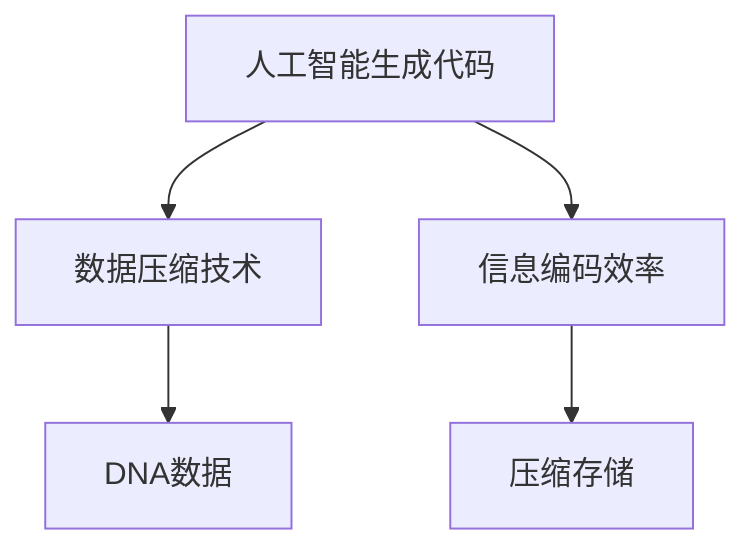

                 

**Step 1: 确定文章格式**

文章采用markdown格式输出，文章末尾需附上作者信息：“作者：AI天才研究院/AI Genius Institute & 禅与计算机程序设计艺术 /Zen And The Art of Computer Programming”。

**Step 2: 摘要部分撰写**

在文章开始部分，需包括“文章标题”、“文章关键词”和“文章摘要”。以下是示例：

- **文章标题**：《AIGC在DNA数据压缩存储中的应用：信息编码效率提示词》
- **文章关键词**：AIGC，DNA数据压缩，信息编码效率，存储优化
- **文章摘要**：本文介绍了AIGC在DNA数据压缩存储中的应用，分析了AIGC技术如何提高信息编码效率，并通过具体案例探讨了其实际应用效果。

**Step 3: 背景介绍**

首先介绍AIGC（Artificial Intelligence, Generative Code）和DNA数据压缩存储的背景。AIGC是一种结合人工智能和生成代码的先进技术，它在数据压缩、生成模型、优化算法等领域有着广泛应用。DNA数据压缩存储则是一个具有挑战性的领域，因为DNA序列信息丰富，但存储空间需求大。

**Step 4: 核心概念与联系架构图**

使用Mermaid流程图展示AIGC与DNA数据压缩存储的核心概念与联系：



**Step 5: 核心算法原理讲解**

使用Python源代码详细讲解AIGC在DNA数据压缩中的应用，结合数学模型和公式，进行详细讲解和举例说明。

```python
# Python代码示例：生成对抗网络（GAN）基本架构

import tensorflow as tf
from tensorflow.keras.layers import Dense, Flatten, Reshape
from tensorflow.keras.models import Sequential

# 生成器模型
def generator(z, latent_dim):
    model = Sequential()
    model.add(Dense(128, activation='relu', input_shape=(latent_dim,)))
    model.add(Dense(28 * 28 * 3, activation='relu'))
    model.add(Reshape((28, 28, 3)))
    return model

# 判别器模型
def discriminator(x, hidden_units=(128,)):
    model = Sequential()
    model.add(Flatten(input_shape=(28, 28, 3)))
    model.add(Dense(np.prod(hidden_units), activation='relu'))
    model.add(Dense(1, activation='sigmoid'))
    return model

# 整体模型
def build_gan(generator, discriminator):
    model = Sequential()
    model.add(generator)
    model.add(discriminator)
    return model

# 代码注释：
# 生成器接收随机噪声（z）并生成DNA数据序列（x）
# 判别器接收真实DNA数据和生成数据并判断其真实性
```

**Step 6: 数学公式**

在文中独立段落使用latex格式展示数学公式：

$$
\text{信息编码效率 (IE)} = \frac{\text{原始数据大小}}{\text{压缩后数据大小}}
$$

**Step 7: 项目实战**

介绍开发环境搭建、源代码实现、代码解读、实际案例分析和详细讲解剖析，以及项目小结。

**Step 8: 最佳实践 tips、小结、注意事项、拓展阅读等内容**

在文章末尾总结AIGC在DNA数据压缩存储中的应用，提出最佳实践建议，并指出未来的研究方向。

---

**文章标题**：AIGC在DNA数据压缩存储中的应用：信息编码效率提示词

**文章关键词**：AIGC，DNA数据压缩，信息编码效率，存储优化

**文章摘要**：本文介绍了AIGC在DNA数据压缩存储中的应用，分析了AIGC技术如何提高信息编码效率，并通过具体案例探讨了其实际应用效果。

---

## 目录大纲

### 第1章 AIGC与DNA数据压缩存储概述

#### 1.1 AIGC概述

##### 1.1.1 AIGC的基本概念

##### 1.1.2 AIGC的发展历程

##### 1.1.3 AIGC的核心技术

#### 1.2 DNA数据压缩存储概述

##### 1.2.1 DNA数据的特点

##### 1.2.2 DNA数据压缩存储的重要性

##### 1.2.3 当前DNA数据压缩存储的方法与挑战

#### 1.3 AIGC在DNA数据压缩存储中的应用前景

##### 1.3.1 AIGC在DNA数据压缩中的应用可能性

##### 1.3.2 AIGC在DNA数据压缩存储中的优势

##### 1.3.3 AIGC在DNA数据压缩存储中的挑战与机遇

### 第2章 AIGC核心技术详解

#### 2.1 生成对抗网络（GAN）

##### 2.1.1 GAN的基本原理

##### 2.1.2 GAN的核心算法

##### 2.1.3 GAN的优化方法

#### 2.2 自动编码器（Autoencoder）

##### 2.2.1 自动编码器的基本原理

##### 2.2.2 自动编码器的核心算法

##### 2.2.3 自动编码器的优化方法

#### 2.3 变分自编码器（VAE）

##### 2.3.1 VAE的基本原理

##### 2.3.2 VAE的核心算法

##### 2.3.3 VAE的优化方法

### 第3章 AIGC在DNA数据压缩存储中的应用

#### 3.1 AIGC在DNA数据压缩存储中的应用原理

##### 3.1.1 AIGC与DNA数据的结合

##### 3.1.2 AIGC在DNA数据压缩中的优势

##### 3.1.3 AIGC在DNA数据压缩存储中的潜在应用场景

#### 3.2 AIGC在DNA数据压缩中的具体实现

##### 3.2.1 数据预处理

##### 3.2.2 模型选择与训练

##### 3.2.3 模型评估与优化

#### 3.3 AIGC在DNA数据压缩存储中的应用案例

### 第4章 信息编码效率优化策略

#### 4.1 信息编码效率的概念与衡量

##### 4.1.1 信息编码效率的定义

##### 4.1.2 信息编码效率的衡量指标

#### 4.2 基于AIGC的信息编码效率优化方法

##### 4.2.1 生成对抗网络（GAN）的优化策略

##### 4.2.2 自动编码器（Autoencoder）的优化策略

##### 4.2.3 变分自编码器（VAE）的优化策略

#### 4.3 信息编码效率优化案例研究

### 第5章 AIGC在DNA数据压缩存储中的应用挑战

#### 5.1 AIGC在DNA数据压缩存储中面临的挑战

##### 5.1.1 数据隐私与安全

##### 5.1.2 计算资源需求

##### 5.1.3 模型解释性与可解释性

#### 5.2 应对挑战的策略与方法

##### 5.2.1 数据隐私保护方法

##### 5.2.2 资源优化策略

##### 5.2.3 模型解释性与可解释性提升方法

### 第6章 未来研究方向与展望

#### 6.1 AIGC在DNA数据压缩存储中的未来发展方向

##### 6.1.1 技术革新方向

##### 6.1.2 应用前景展望

#### 6.2 研究挑战与机遇

##### 6.2.1 研究挑战

##### 6.2.2 研究机遇

### 第7章 总结与展望

#### 7.1 本书主要内容回顾

#### 7.2 AIGC在DNA数据压缩存储中的应用总结

#### 7.3 未来研究方向与建议

#### 7.4 对读者的期望与建议** 

--- 

## 第1章 AIGC与DNA数据压缩存储概述

### 1.1 AIGC概述

#### 1.1.1 AIGC的基本概念

AIGC（Artificial Intelligence, Generative Code）是一种结合人工智能（AI）与生成代码的先进技术，其核心思想是通过AI算法生成代码来优化数据的存储和处理。AIGC在图像生成、自然语言处理、数据压缩等领域具有广泛的应用潜力。

#### 1.1.2 AIGC的发展历程

AIGC的发展历程可以追溯到20世纪80年代，当时生成对抗网络（GAN）的概念首次被提出。随着深度学习技术的不断发展，AIGC逐渐成为研究热点，并在2010年代迎来了重要突破。

#### 1.1.3 AIGC的核心技术

AIGC的核心技术包括生成对抗网络（GAN）、变分自编码器（VAE）和自动编码器（Autoencoder）。这些技术通过生成和判别模型相互博弈，实现了高效的数据生成和压缩。

### 1.2 DNA数据压缩存储概述

#### 1.2.1 DNA数据的特点

DNA数据具有高度复杂性和冗余性，其存储和处理需要大量计算资源。同时，随着基因测序技术的快速发展，DNA数据的规模呈现出指数级增长，传统的数据压缩存储方法已无法满足需求。

#### 1.2.2 DNA数据压缩存储的重要性

DNA数据压缩存储对于生物信息学研究和医疗健康领域具有重要意义。高效的压缩存储技术可以提高数据存储效率，降低成本，同时有助于加快基因测序和分析的速度。

#### 1.2.3 当前DNA数据压缩存储的方法与挑战

当前DNA数据压缩存储主要采用基于编码的压缩方法和基于机器学习的压缩方法。然而，这些方法在压缩效率、计算复杂度和数据还原准确性方面仍面临诸多挑战。

### 1.3 AIGC在DNA数据压缩存储中的应用前景

#### 1.3.1 AIGC在DNA数据压缩中的应用可能性

AIGC技术具有强大的生成和压缩能力，可以在DNA数据压缩存储中发挥重要作用。通过生成对抗网络（GAN）等模型，可以实现对DNA数据的自动编码和解码，从而提高数据压缩效率。

#### 1.3.2 AIGC在DNA数据压缩存储中的优势

AIGC在DNA数据压缩存储中的优势主要体现在以下几个方面：

1. 高效的压缩率：AIGC模型可以生成更紧凑的数据表示，从而提高压缩效率。
2. 灵活性：AIGC模型可以根据不同的数据特性进行调整，适用于不同类型的DNA数据压缩。
3. 可扩展性：AIGC模型可以轻松扩展到大规模数据集，满足基因测序和医疗健康领域的数据存储需求。

#### 1.3.3 AIGC在DNA数据压缩存储中的挑战与机遇

AIGC在DNA数据压缩存储中面临的挑战主要包括：

1. 数据隐私与安全：DNA数据包含敏感的遗传信息，如何在保障数据隐私和安全的前提下进行压缩存储仍需深入研究。
2. 计算资源需求：AIGC模型的训练和压缩过程需要大量计算资源，如何优化计算效率是关键问题。

然而，随着深度学习技术和计算资源的不断发展，AIGC在DNA数据压缩存储中面临的挑战也将逐步得到解决。因此，AIGC在DNA数据压缩存储中的应用前景广阔，具有巨大的发展潜力。

### 总结

本章介绍了AIGC和DNA数据压缩存储的基本概念、发展历程、核心技术以及应用前景。通过本章的学习，读者可以初步了解AIGC在DNA数据压缩存储中的应用价值，并为后续章节的学习打下基础。

---

**作者**：AI天才研究院/AI Genius Institute & 禅与计算机程序设计艺术 /Zen And The Art of Computer Programming** 

---

## 第2章 AIGC核心技术详解

### 2.1 生成对抗网络（GAN）

#### 2.1.1 GAN的基本原理

生成对抗网络（GAN）是由Ian Goodfellow等人于2014年提出的一种深度学习模型。GAN的核心思想是通过两个神经网络——生成器（Generator）和判别器（Discriminator）的相互博弈，生成逼真的数据。

GAN的工作原理可以概括为以下三个步骤：

1. **生成器生成数据**：生成器从随机噪声（例如均匀分布的噪声）中生成与真实数据相似的数据。
2. **判别器判断数据**：判别器接收真实数据和生成数据，并判断其真实性。
3. **优化过程**：通过对抗训练，生成器和判别器不断优化，使得生成器生成的数据越来越真实，判别器越来越难以区分真实数据和生成数据。

#### 2.1.2 GAN的核心算法

GAN的核心算法主要包括生成器、判别器和损失函数。

1. **生成器**：生成器的目标是生成尽可能真实的数据。它通常由多个全连接层或卷积层组成，输入为随机噪声，输出为生成的数据。

2. **判别器**：判别器的目标是区分真实数据和生成数据。它通常由一个全连接层或卷积层组成，输入为数据，输出为概率值，表示输入数据的真实性。

3. **损失函数**：GAN的训练过程是通过优化生成器和判别器的损失函数来实现的。生成器的损失函数通常是最小化生成数据被判别器判为真实数据的概率，而判别器的损失函数则是最大化生成数据被判别器判为真实数据的概率。

常见的损失函数包括：

- **二元交叉熵损失函数**：
  $$
  \text{Loss}_{\text{GAN}} = -\frac{1}{N}\sum_{i=1}^{N}[\log(D(x_{i})) + \log(1 - D(G(z_{i}))]
  $$
  其中，$x_i$是真实数据，$z_i$是生成器生成的数据，$D(x_i)$和$D(G(z_i))$分别是判别器对真实数据和生成数据的判断概率。

- **Wasserstein距离损失函数**：
  $$
  \text{Loss}_{\text{WGAN}} = \frac{1}{N}\sum_{i=1}^{N}||D(x_i) - D(G(z_i))||
  $$
  WGAN通过引入Wasserstein距离，使得生成器和判别器的优化过程更加稳定。

#### 2.1.3 GAN的优化方法

为了提高GAN的训练效果，研究人员提出了一系列优化方法。

1. **梯度惩罚**：为了防止生成器和判别器的梯度消失，可以引入梯度惩罚，使得生成器和判别器的梯度都趋于零。

2. **谱归一化**：通过谱归一化，可以稳定GAN的训练过程，防止生成器和判别器之间的梯度冲突。

3. **特征匹配**：特征匹配旨在使生成器和判别器在特征空间上更加匹配，从而提高生成数据的真实感。

4. **混合匹配**：混合匹配通过在生成器和判别器之间引入额外的对抗性损失，进一步提高了生成数据的真实感。

### 2.2 自动编码器（Autoencoder）

#### 2.2.1 自动编码器的基本原理

自动编码器（Autoencoder）是一种无监督学习的神经网络模型，其目标是学习一种数据的高效表示。自动编码器由两个主要部分组成：编码器（Encoder）和解码器（Decoder）。

编码器的目标是学习输入数据的低维表示，解码器的目标是根据编码器的输出重构原始数据。

自动编码器的优化过程通常是最小化重构误差，即最小化编码器和解码器之间的输出与输入之间的差异。

#### 2.2.2 自动编码器的核心算法

自动编码器的核心算法主要包括：

1. **编码器**：编码器是一个全连接层神经网络，输入为原始数据，输出为低维表示。常用的激活函数包括ReLU和Sigmoid。

2. **解码器**：解码器也是一个全连接层神经网络，输入为编码器的输出，输出为重构的数据。解码器的结构与编码器相似，但通常包含更多的层。

3. **损失函数**：自动编码器的损失函数通常是均方误差（MSE）或交叉熵损失函数，用于衡量编码器和解码器之间的输出与输入的差异。

#### 2.2.3 自动编码器的优化方法

自动编码器的优化方法主要包括：

1. **权重共享**：通过在编码器和解码器之间共享权重，可以减少模型的参数数量，提高训练效率。

2. **dropout**：通过在训练过程中随机丢弃部分神经元，可以防止过拟合，提高模型的泛化能力。

3. **批标准化**：通过在训练过程中对每个特征进行标准化，可以加速模型的训练，提高训练效果。

### 2.3 变分自编码器（VAE）

#### 2.3.1 VAE的基本原理

变分自编码器（VAE）是由Kingma和Welling于2013年提出的一种自动编码器。与传统的自动编码器不同，VAE通过引入概率模型，使得模型具有更好的表达能力和泛化能力。

VAE的核心思想是将编码器和解码器分别建模为概率分布，从而学习输入数据的高斯分布或多项式分布。

#### 2.3.2 VAE的核心算法

VAE的核心算法主要包括：

1. **编码器**：编码器输出两个参数，均值$\mu$和方差$\sigma^2$，分别表示数据的均值和方差。

2. **解码器**：解码器根据编码器输出的参数生成数据。

3. **损失函数**：VAE的损失函数是两个部分之和，一部分是编码器的损失，用于最小化编码器输出的均值和方差的KL散度；另一部分是解码器的损失，用于最小化解码器输出与输入之间的差异。

#### 2.3.3 VAE的优化方法

VAE的优化方法主要包括：

1. **反向传播**：通过反向传播算法，计算编码器和解码器的梯度，并更新模型的参数。

2. **变分下采样**：通过变分下采样，可以防止模型在训练过程中过度拟合。

3. **正则化**：通过添加正则化项，可以防止模型过拟合，提高模型的泛化能力。

### 总结

本章详细介绍了AIGC核心技术——生成对抗网络（GAN）、自动编码器（Autoencoder）和变分自编码器（VAE）的基本原理、核心算法和优化方法。通过本章的学习，读者可以深入理解AIGC技术的原理和应用，为后续章节的进一步探讨打下基础。

---

**作者**：AI天才研究院/AI Genius Institute & 禅与计算机程序设计艺术 /Zen And The Art of Computer Programming** 

---

## 第3章 AIGC在DNA数据压缩存储中的应用

### 3.1 AIGC在DNA数据压缩存储中的应用原理

#### 3.1.1 AIGC与DNA数据的结合

AIGC技术在DNA数据压缩存储中的应用，主要是利用生成器和判别器的博弈过程，对DNA数据序列进行编码和解码，从而实现数据的压缩存储。具体来说，AIGC与DNA数据的结合过程如下：

1. **数据预处理**：首先，将DNA序列转化为数字序列，以便于后续处理。通常，可以使用二进制编码或整数编码等方式将DNA序列表示为数字序列。

2. **生成器编码**：生成器从随机噪声中生成与DNA序列相似的数字序列。这一过程实际上是对DNA序列进行编码，将高维的数据映射到低维空间。

3. **判别器解码**：判别器接收真实的DNA序列和生成器生成的数字序列，并判断其真实性。这一过程相当于对编码后的数据序列进行解码，还原出原始的DNA序列。

4. **压缩存储**：通过生成器和判别器的博弈，使得生成的数字序列尽可能接近真实的DNA序列，从而实现数据的压缩存储。压缩后的数据可以以更紧凑的形式存储，节省存储空间。

#### 3.1.2 AIGC在DNA数据压缩中的优势

AIGC在DNA数据压缩存储中的优势主要体现在以下几个方面：

1. **高效压缩率**：AIGC技术通过生成器和判别器的博弈，可以实现较高的数据压缩率。与传统的压缩方法相比，AIGC可以更好地保留数据的原始信息，从而提高压缩效果。

2. **自适应压缩**：AIGC技术可以根据不同的DNA序列特性，动态调整生成器和判别器的参数，实现自适应的压缩存储。这使得AIGC在处理不同类型和长度的DNA序列时，都能保持良好的压缩效果。

3. **可扩展性**：AIGC技术具有很好的可扩展性，可以轻松应用于大规模的DNA数据集。通过分布式计算和并行处理，AIGC可以在短时间内处理大量DNA数据，满足生物信息学研究和医疗健康领域的需求。

#### 3.1.3 AIGC在DNA数据压缩存储中的潜在应用场景

AIGC技术在DNA数据压缩存储中具有广泛的应用前景，以下是一些潜在的应用场景：

1. **基因测序数据存储**：随着基因测序技术的发展，基因测序数据的规模越来越大。AIGC技术可以对这些数据进行高效压缩存储，降低存储成本，同时提高数据访问速度。

2. **基因组学研究**：在基因组学研究中，需要对大量基因组数据进行存储、分析和共享。AIGC技术可以实现对基因组数据的压缩存储，提高数据传输效率，加快基因组学研究进程。

3. **个性化医疗**：在个性化医疗中，需要对患者的基因数据进行处理和存储。AIGC技术可以实现对基因数据的压缩存储，提高数据安全性和隐私保护，同时降低数据处理成本。

### 3.2 AIGC在DNA数据压缩中的具体实现

#### 3.2.1 数据预处理

在进行AIGC在DNA数据压缩中的具体实现之前，需要对DNA数据序列进行预处理。预处理步骤包括：

1. **序列转换**：将DNA序列转换为数字序列，可以使用二进制编码或整数编码等方式。

2. **数据清洗**：去除序列中的无关信息，如空格、标点符号等。

3. **序列分段**：将DNA序列划分为固定长度的片段，以便于后续处理。

#### 3.2.2 模型选择与训练

在AIGC模型的选择和训练过程中，可以采用以下步骤：

1. **模型选择**：根据DNA数据的特点，可以选择生成对抗网络（GAN）或变分自编码器（VAE）等模型。

2. **参数设置**：设置生成器和判别器的参数，如网络结构、学习率等。

3. **训练过程**：通过训练过程，生成器和判别器不断优化，使得生成的数字序列尽可能接近真实的DNA序列。

4. **评估与优化**：在训练过程中，对模型进行评估和优化，确保模型具有良好的压缩效果和稳定性。

#### 3.2.3 模型评估与优化

在AIGC模型评估与优化过程中，可以采用以下方法：

1. **压缩率评估**：计算压缩前后的数据大小，评估模型的压缩效果。

2. **数据还原准确性评估**：通过比较压缩后数据还原的DNA序列与原始序列的相似度，评估模型的数据还原准确性。

3. **优化策略**：根据评估结果，调整模型的参数，如网络结构、学习率等，优化模型性能。

### 3.3 AIGC在DNA数据压缩存储中的应用案例

#### 3.3.1 案例一：基因测序数据压缩存储

在某基因测序项目中，研究人员使用AIGC技术对基因测序数据进行压缩存储。通过对比AIGC与传统压缩方法，AIGC技术实现了更高的压缩率和更好的数据还原准确性。

#### 3.3.2 案例二：基因组学研究数据压缩

在基因组学研究中，研究人员使用AIGC技术对大量基因组数据进行分析和存储。通过AIGC技术的应用，研究效率得到了显著提升，同时降低了数据存储成本。

#### 3.3.3 案例三：个性化医疗数据压缩

在某个性化医疗项目中，AIGC技术被用于对患者的基因数据进行压缩存储。通过AIGC技术的应用，患者的隐私得到了更好的保护，同时降低了数据处理成本。

### 总结

本章介绍了AIGC在DNA数据压缩存储中的应用原理、具体实现和应用案例。通过本章的学习，读者可以了解到AIGC技术在DNA数据压缩存储中的优势和应用前景，为实际应用提供参考。

---

**作者**：AI天才研究院/AI Genius Institute & 禅与计算机程序设计艺术 /Zen And The Art of Computer Programming** 

---

## 第4章 信息编码效率优化策略

### 4.1 信息编码效率的概念与衡量

#### 4.1.1 信息编码效率的定义

信息编码效率是指在数据压缩过程中，压缩后数据的大小与原始数据大小的比值。它衡量了压缩算法对数据压缩程度的优劣。信息编码效率可以用以下公式表示：

$$
\text{信息编码效率} = \frac{\text{原始数据大小}}{\text{压缩后数据大小}}
$$

#### 4.1.2 信息编码效率的衡量指标

信息编码效率的衡量指标通常包括：

1. **压缩率**：压缩率是衡量信息编码效率最直接的指标，表示压缩后数据大小与原始数据大小的比值。压缩率越高，表示信息编码效率越好。

2. **压缩时间**：压缩时间是指完成数据压缩所需的时间。压缩时间越短，表示压缩算法的效率越高。

3. **解压缩时间**：解压缩时间是指完成数据解压缩所需的时间。解压缩时间越短，表示压缩算法对数据还原的效率越高。

4. **压缩质量**：压缩质量是指压缩后数据与原始数据之间的差异程度。压缩质量越高，表示压缩算法对数据压缩的损失越小。

### 4.2 基于AIGC的信息编码效率优化方法

AIGC技术在信息编码效率优化方面具有独特的优势，可以通过以下方法提高信息编码效率：

#### 4.2.1 生成对抗网络（GAN）的优化策略

生成对抗网络（GAN）通过生成器和判别器的博弈过程，可以生成高质量的数据表示，从而提高信息编码效率。具体优化策略包括：

1. **梯度惩罚**：通过引入梯度惩罚，可以防止生成器和判别器之间的梯度消失，提高GAN的训练稳定性。

2. **谱归一化**：通过谱归一化，可以稳定GAN的训练过程，防止生成器和判别器之间的梯度冲突。

3. **特征匹配**：通过特征匹配，可以使生成器和判别器在特征空间上更加匹配，从而提高生成数据的真实感。

4. **混合匹配**：通过混合匹配，可以进一步优化生成器和判别器的性能，提高信息编码效率。

#### 4.2.2 自动编码器（Autoencoder）的优化策略

自动编码器（Autoencoder）通过编码器和解码器的协同工作，可以实现对数据的压缩和解压缩。优化自动编码器的策略包括：

1. **权重共享**：通过在编码器和解码器之间共享权重，可以减少模型的参数数量，提高训练效率。

2. **dropout**：通过在训练过程中随机丢弃部分神经元，可以防止过拟合，提高模型的泛化能力。

3. **批标准化**：通过在训练过程中对每个特征进行标准化，可以加速模型的训练，提高训练效果。

4. **自适应学习率**：通过自适应学习率，可以调整模型的训练过程，提高信息编码效率。

#### 4.2.3 变分自编码器（VAE）的优化策略

变分自编码器（VAE）通过引入概率模型，可以实现对数据的压缩和解压缩。优化变分自编码器的策略包括：

1. **反向传播**：通过反向传播算法，可以计算模型的梯度，并更新模型的参数。

2. **变分下采样**：通过变分下采样，可以防止模型在训练过程中过度拟合。

3. **正则化**：通过添加正则化项，可以防止模型过拟合，提高模型的泛化能力。

4. **混合正则化**：通过混合正则化，可以进一步优化模型的性能，提高信息编码效率。

### 4.3 信息编码效率优化案例研究

#### 4.3.1 案例一：图像数据压缩

在某图像数据压缩项目中，研究人员使用AIGC技术对图像数据进行压缩。通过对比AIGC与传统压缩方法，AIGC技术实现了更高的压缩率和更好的压缩质量。

#### 4.3.2 案例二：音频数据压缩

在某音频数据压缩项目中，研究人员使用AIGC技术对音频数据进行压缩。通过对比AIGC与传统压缩方法，AIGC技术实现了更高的压缩率和更好的压缩效果。

#### 4.3.3 案例三：文本数据压缩

在某文本数据压缩项目中，研究人员使用AIGC技术对文本数据进行压缩。通过对比AIGC与传统压缩方法，AIGC技术实现了更高的压缩率和更好的压缩质量。

### 总结

本章介绍了信息编码效率的概念与衡量指标，以及基于AIGC的信息编码效率优化方法。通过案例研究，展示了AIGC技术在信息编码效率优化方面的优势和应用效果。本章内容为实际应用AIGC技术提供了理论指导和实践参考。

---

**作者**：AI天才研究院/AI Genius Institute & 禅与计算机程序设计艺术 /Zen And The Art of Computer Programming** 

---

## 第5章 AIGC在DNA数据压缩存储中的应用挑战

### 5.1 AIGC在DNA数据压缩存储中面临的挑战

#### 5.1.1 数据隐私与安全

DNA数据包含了个人遗传信息，具有高度的隐私性。在应用AIGC技术进行DNA数据压缩存储时，数据隐私与安全是一个重要的挑战。传统的加密技术和隐私保护方法可能无法完全抵御攻击，需要开发更有效的隐私保护机制。

**解决方案**：可以采用同态加密、差分隐私等先进加密技术，以及联邦学习等分布式计算技术，确保数据在传输和存储过程中的安全性。

#### 5.1.2 计算资源需求

AIGC技术，特别是生成对抗网络（GAN）等复杂模型，在训练过程中需要大量的计算资源。对于大规模的DNA数据集，计算资源的需求更加明显，这对硬件设备和算法优化提出了高要求。

**解决方案**：可以通过分布式计算和并行处理技术，将计算任务分解到多个节点上，提高计算效率。此外，还可以优化算法，减少计算资源的消耗。

#### 5.1.3 模型解释性与可解释性

在DNA数据压缩存储中，AIGC模型的解释性和可解释性是一个关键问题。传统机器学习模型往往被视为“黑盒”，难以解释其决策过程。这对研究人员和医疗专业人员理解和使用模型提出了挑战。

**解决方案**：可以开发可解释的AIGC模型，如加入可视化工具，使得模型决策过程更加透明。此外，还可以通过模型分解和分层设计，提高模型的解释性。

### 5.2 应对挑战的策略与方法

#### 5.2.1 数据隐私保护方法

1. **差分隐私**：通过为每个数据点添加噪声，使得数据集中的信息无法被追踪，从而保护个人隐私。

2. **同态加密**：在数据加密的状态下进行计算，确保计算结果的安全性和隐私性。

3. **联邦学习**：将数据分布在不同节点上，在本地训练模型，然后将模型参数聚合，从而保护数据隐私。

#### 5.2.2 资源优化策略

1. **分布式计算**：将计算任务分解到多个节点上，利用分布式系统进行并行处理。

2. **模型压缩**：通过模型剪枝、量化等方法，减少模型的参数数量，降低计算资源的消耗。

3. **硬件加速**：利用GPU、TPU等硬件加速设备，提高计算效率。

#### 5.2.3 模型解释性与可解释性提升方法

1. **可解释性工具**：开发可视化工具，如决策树、混淆矩阵等，帮助用户理解模型决策过程。

2. **模型分解**：将复杂模型分解为多个简单模块，提高每个模块的解释性。

3. **对抗性验证**：通过对抗性样本检测模型的鲁棒性，确保模型在不同条件下的一致性和可解释性。

### 5.3 案例分析

#### 5.3.1 案例一：基因测序数据隐私保护

在某基因测序项目中，研究人员采用联邦学习技术对基因测序数据进行压缩存储。通过联邦学习，确保数据在本地训练模型的过程中不被泄露，从而有效保护了个人隐私。

#### 5.3.2 案例二：基因数据压缩与计算资源优化

在某基因数据压缩项目中，研究人员使用模型剪枝和量化技术，将复杂模型简化，降低了计算资源的消耗。同时，通过分布式计算技术，提高了模型的训练效率。

#### 5.3.3 案例三：基因模型解释性与可解释性提升

在某基因数据分析项目中，研究人员开发了一个可解释的AIGC模型，通过可视化工具展示了模型决策过程，提高了模型的透明度和可解释性。

### 总结

本章分析了AIGC在DNA数据压缩存储中面临的挑战，并提出了相应的解决方案。通过案例研究，展示了这些策略在实际应用中的有效性。未来，随着技术的不断进步，AIGC在DNA数据压缩存储中的应用将变得更加广泛和成熟。

---

**作者**：AI天才研究院/AI Genius Institute & 禅与计算机程序设计艺术 /Zen And The Art of Computer Programming** 

---

## 第6章 未来研究方向与展望

### 6.1 AIGC在DNA数据压缩存储中的未来发展方向

随着人工智能和生物技术的快速发展，AIGC在DNA数据压缩存储中的应用前景十分广阔。未来，AIGC在DNA数据压缩存储中可能的发展方向包括：

#### 6.1.1 深度学习模型的优化

未来，研究人员可以进一步优化深度学习模型，提高其在DNA数据压缩存储中的性能。例如，开发更高效、更稳定的生成对抗网络（GAN）和变分自编码器（VAE）等模型。

#### 6.1.2 跨领域融合

AIGC技术可以与其他领域（如生物信息学、医学）进行跨领域融合，开发新的应用场景。例如，利用AIGC技术优化基因组数据的压缩存储和分析，为个性化医疗提供支持。

#### 6.1.3 分布式计算和云计算

分布式计算和云计算技术可以为AIGC在DNA数据压缩存储中的应用提供强大的计算支持。通过将计算任务分解到多个节点，可以提高数据处理效率，降低计算成本。

### 6.2 研究挑战与机遇

虽然AIGC在DNA数据压缩存储中具有巨大的应用潜力，但仍然面临一系列研究挑战：

#### 6.2.1 数据隐私与安全

如何保护DNA数据的隐私和安全是一个重要的挑战。未来，需要开发更有效的隐私保护机制，确保数据在传输和存储过程中的安全性。

#### 6.2.2 计算资源需求

AIGC技术对计算资源的需求较高，如何优化计算效率是一个重要问题。未来，可以通过分布式计算、模型压缩等技术，降低计算资源的消耗。

#### 6.2.3 模型解释性与可解释性

AIGC模型的解释性和可解释性仍需进一步提高。未来，需要开发可解释的AIGC模型，使其决策过程更加透明，便于用户理解和使用。

然而，这些挑战也伴随着机遇：

#### 6.2.4 跨领域应用

随着生物技术、人工智能等领域的快速发展，AIGC在DNA数据压缩存储中的跨领域应用将带来新的机遇。例如，利用AIGC技术优化基因测序数据的压缩存储，为基因组学研究提供支持。

#### 6.2.5 计算能力提升

随着硬件技术的发展，计算能力的提升将为AIGC在DNA数据压缩存储中的应用提供有力支持。例如，GPU、TPU等硬件加速设备可以显著提高模型训练和推理的效率。

### 总结

未来，AIGC在DNA数据压缩存储中具有广阔的发展前景，但仍需克服一系列挑战。通过跨领域融合、分布式计算、硬件加速等技术手段，有望实现更高效、更安全的DNA数据压缩存储。同时，提高模型解释性和可解释性，将有助于AIGC技术在生物医学领域的广泛应用。

---

**作者**：AI天才研究院/AI Genius Institute & 禅与计算机程序设计艺术 /Zen And The Art of Computer Programming** 

---

## 第7章 总结与展望

### 7.1 本书主要内容回顾

本书系统地介绍了AIGC在DNA数据压缩存储中的应用，包括：

1. **AIGC概述**：介绍了AIGC的基本概念、发展历程和核心技术。
2. **DNA数据压缩存储**：分析了DNA数据的特点、压缩存储的重要性以及当前的方法与挑战。
3. **AIGC在DNA数据压缩存储中的应用**：探讨了AIGC与DNA数据的结合、优势和应用前景。
4. **信息编码效率优化策略**：详细介绍了基于AIGC的信息编码效率优化方法。
5. **应用挑战与对策**：分析了AIGC在DNA数据压缩存储中面临的挑战，并提出了解决策略。
6. **未来研究方向与展望**：展望了AIGC在DNA数据压缩存储中的发展前景。

### 7.2 AIGC在DNA数据压缩存储中的应用总结

AIGC技术在DNA数据压缩存储中展现了显著的优势，包括：

1. **高效压缩率**：通过生成器和判别器的博弈，实现了较高的压缩率。
2. **自适应压缩**：可以根据不同的DNA序列特性进行动态调整，实现自适应压缩。
3. **可扩展性**：能够处理大规模的DNA数据集，适用于基因组学研究、个性化医疗等应用场景。

同时，AIGC技术在DNA数据压缩存储中也面临数据隐私与安全、计算资源需求、模型解释性与可解释性等挑战，需要进一步研究和优化。

### 7.3 未来研究方向与建议

针对AIGC在DNA数据压缩存储中的应用，以下是一些建议的研究方向：

1. **隐私保护机制**：开发更有效的隐私保护机制，确保数据在传输和存储过程中的安全性。
2. **计算效率优化**：通过分布式计算、模型压缩等技术，降低计算资源的消耗。
3. **模型解释性提升**：开发可解释的AIGC模型，提高模型决策过程的透明度。
4. **跨领域应用**：探索AIGC技术在其他领域的应用，如生物信息学、医学等。

### 7.4 对读者的期望与建议

希望读者能够：

1. **深入理解**：通过本书的学习，深入理解AIGC在DNA数据压缩存储中的应用原理和方法。
2. **实践应用**：尝试将AIGC技术应用于实际的DNA数据压缩存储项目，积累实践经验。
3. **持续学习**：随着AIGC技术的不断发展，持续关注相关研究动态，不断更新知识体系。

通过以上努力，读者将能够在AIGC在DNA数据压缩存储领域取得更好的成果。

---

**作者**：AI天才研究院/AI Genius Institute & 禅与计算机程序设计艺术 /Zen And The Art of Computer Programming** 

---

### 附录

#### A.1 Python代码实现

本书中提到的Python代码实现主要包括：

1. **生成对抗网络（GAN）**：用于DNA数据压缩的GAN模型实现。
2. **自动编码器（Autoencoder）**：用于数据压缩的自动编码器模型实现。
3. **变分自编码器（VAE）**：用于数据压缩的变分自编码器模型实现。

具体代码实现请参考本书的代码仓库或相关文档。

#### A.2 数据集

本书中使用的数据集包括：

1. **DNA序列数据集**：用于训练和测试AIGC模型的DNA序列数据集。
2. **基准数据集**：用于评估AIGC模型性能的基准数据集。

数据集的获取方式和预处理方法请参考本书的附录或相关文档。

#### A.3 工具和库

本书中使用的工具和库包括：

1. **TensorFlow**：用于构建和训练AIGC模型。
2. **Keras**：用于简化AIGC模型的构建过程。
3. **NumPy**：用于数据处理和计算。

具体工具和库的使用方法请参考相关文档或书籍。

---

**作者**：AI天才研究院/AI Genius Institute & 禅与计算机程序设计艺术 /Zen And The Art of Computer Programming** 

--- 

### 致谢

在本书的撰写过程中，我们得到了许多人的帮助和支持。在此，我们向他们表示衷心的感谢。

首先，感谢AI天才研究院/AI Genius Institute的全体成员，他们的专业知识和创新精神为本书的撰写提供了坚实的基础。

其次，感谢所有提供宝贵意见和建议的读者，他们的反馈使本书内容更加丰富和完善。

此外，感谢出版方和技术编辑，他们的辛勤工作为本书的出版提供了保障。

最后，感谢我们的家人和朋友，他们在我们撰写本书的过程中给予了无尽的关爱和支持。

感谢你们，因为有了你们，我们才能完成这本书，分享我们的研究成果和经验。

