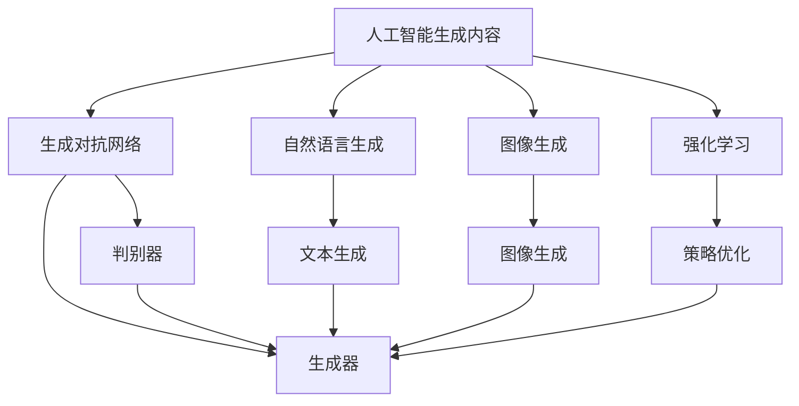

                 

### AIGC在个性化健身计划生成中的应用

#### 关键词

- **人工智能生成内容（AIGC）**
- **个性化健身计划**
- **生成对抗网络（GAN）**
- **聚类分析**
- **强化学习**
- **用户数据采集与处理**

#### 摘要

本文将深入探讨人工智能生成内容（AIGC）技术在个性化健身计划生成中的应用。首先，我们将简要介绍AIGC技术及其在健身领域的潜在应用前景。随后，我们将详细讲解AIGC在个性化健身计划生成中的核心技术，包括用户数据采集与处理、基于生成对抗网络（GAN）的健身计划生成算法、聚类分析与强化学习融合的健身计划生成算法，以及个性化健身计划的评估与优化。此外，文章还将通过实战案例展示AIGC技术在健身计划生成平台搭建中的实际应用，并提供相关的开发环境搭建、源代码实现和代码解读。通过本文的阅读，读者将能够理解AIGC技术在个性化健身计划生成中的核心原理和实际应用，为未来相关领域的研究和实践提供有益的参考。

### AIGC与个性化健身计划概述

#### 1.1 AIGC的概念及其在健身领域的应用前景

**1.1.1 AIGC的定义与特点**

人工智能生成内容（Artificial Intelligence Generated Content，简称AIGC）是指通过人工智能技术生成各种类型的内容，如文本、图像、音频和视频等。与传统的手动生成内容相比，AIGC具有高度的自动化和个性化特点。AIGC技术主要包括生成对抗网络（GAN）、自然语言生成（NLG）、图像生成和强化学习等。

**生成对抗网络（GAN）**

生成对抗网络（Generative Adversarial Network，简称GAN）是由两部分组成的神经网络结构，包括生成器（Generator）和判别器（Discriminator）。生成器试图生成逼真的数据，而判别器则试图区分生成器生成的数据和真实数据。通过这种对抗训练，生成器逐渐提高生成数据的质量，使得生成的数据越来越接近真实数据。

**自然语言生成（NLG）**

自然语言生成（Natural Language Generation，简称NLG）是指利用人工智能技术自动生成自然语言文本的过程。NLG技术广泛应用于聊天机器人、新闻报道、教育内容和营销文案等领域。

**图像生成**

图像生成是通过人工智能技术生成逼真的图像或视频。近年来，深度学习技术，尤其是生成对抗网络（GAN）的广泛应用，使得图像生成技术取得了显著的进展。图像生成在虚拟现实、游戏开发、电影制作等领域具有广泛的应用潜力。

**强化学习**

强化学习（Reinforcement Learning，简称RL）是一种通过试错和反馈来学习策略的机器学习方法。在AIGC中，强化学习可以用于优化生成模型，使其更好地满足特定任务的需求。

**1.1.2 健身领域面临的挑战与AIGC的机遇**

健身领域面临的主要挑战包括个性化不足、参与度低和效果不佳等。传统的健身计划通常采用一刀切的方式，无法充分考虑个体的差异，导致用户无法持续参与和获得理想的健身效果。

AIGC技术在个性化健身计划生成中具有显著的潜力。通过用户数据的采集与处理，AIGC技术能够生成高度个性化的健身计划，满足不同用户的需求。此外，AIGC技术还可以通过持续优化和调整健身计划，提高用户的参与度和健身效果。

**1.2 个性化健身计划的需求与目标**

**个性化健身计划的重要性**

个性化健身计划是指根据用户的年龄、性别、体重、健康状况、健身目标和偏好等因素，为用户量身定制的一套健身方案。相比于传统的健身计划，个性化健身计划能够更好地满足用户的需求，提高健身效果和用户满意度。

**个性化健身计划的目标**

- 提高用户的参与度：通过个性化的健身计划，激发用户的健身兴趣，提高用户的参与度。
- 优化健身效果：根据用户的特点和需求，制定合理的健身计划，提高健身效果。
- 持续跟踪与优化：通过实时跟踪用户的健身数据，持续优化健身计划，确保用户能够持续获得理想的健身效果。

### 图1-1 AIGC在个性化健身计划生成中的核心概念及联系

**图1-1** AIGC在个性化健身计划生成中的核心概念及联系

通过上述流程图，我们可以看到AIGC技术中的各个核心概念及其相互之间的联系。生成对抗网络（GAN）是AIGC技术的重要组成部分，通过生成器和判别器的对抗训练，生成逼真的健身计划。自然语言生成（NLG）用于生成个性化的健身指导文本，图像生成（IG）则用于生成健身动作的图像或视频，强化学习（RL）则用于优化健身计划，使其更符合用户的实际需求和反馈。

### 1.3 本书结构与内容安排

**1.3.1 本书的目的和读者对象**

本书旨在深入探讨人工智能生成内容（AIGC）技术在个性化健身计划生成中的应用，帮助读者理解和掌握AIGC技术的核心原理及其在健身领域的实际应用。本书适用于对人工智能和健身领域有一定了解的读者，包括研究人员、工程师、产品经理以及健身教练等。

**1.3.2 本书的主要内容与章节安排**

本书分为四个部分，共七个章节。

**第一部分：引言**

- 第1章：AIGC与个性化健身计划概述

**第二部分：AIGC基础**

- 第2章：AIGC技术概述
- 第3章：用户数据采集与处理

**第三部分：个性化健身计划生成技术**

- 第4章：基于AIGC的健身计划生成算法
- 第5章：个性化健身计划评估与优化

**第四部分：实战案例与应用**

- 第6章：基于AIGC的个性化健身计划生成平台搭建
- 第7章：实战案例展示与分析

通过这四个部分的内容，读者可以系统地了解AIGC技术在个性化健身计划生成中的核心原理和应用方法，为后续的研究和实践提供参考。

### AIGC技术概述

#### 2.1 人工智能与生成对抗网络（GAN）

**2.1.1 人工智能的基本概念**

人工智能（Artificial Intelligence，简称AI）是指通过计算机程序模拟人类智能行为的能力。人工智能的主要目标是使计算机具有智能，能够像人类一样进行思考、学习和决策。人工智能包括多个子领域，如机器学习、深度学习、自然语言处理和计算机视觉等。

**机器学习**

机器学习（Machine Learning，简称ML）是一种通过数据驱动的方法，使计算机自动获取知识和技能的技术。机器学习可以分为监督学习、无监督学习和强化学习等。

- **监督学习**：通过已标记的数据来训练模型，使模型能够对新数据进行预测。
- **无监督学习**：不使用标记数据，通过模型自身的分析，发现数据中的模式和规律。
- **强化学习**：通过试错和反馈来学习策略的机器学习方法。

**深度学习**

深度学习（Deep Learning，简称DL）是一种基于多层神经网络的学习方法，通过多层非线性变换，从大量数据中自动提取特征。深度学习在图像识别、语音识别和自然语言处理等领域取得了显著的成果。

**自然语言处理**

自然语言处理（Natural Language Processing，简称NLP）是人工智能的一个子领域，旨在使计算机能够理解和处理自然语言。NLP包括文本分类、命名实体识别、机器翻译和情感分析等任务。

**计算机视觉**

计算机视觉（Computer Vision，简称CV）是人工智能的另一个重要子领域，旨在使计算机能够从图像或视频中提取信息。计算机视觉包括图像识别、目标检测、图像分割和视频处理等任务。

**2.1.2 生成对抗网络（GAN）的基本原理**

生成对抗网络（Generative Adversarial Network，简称GAN）是由Ian Goodfellow等人于2014年提出的一种新型深度学习框架。GAN由两个主要的神经网络——生成器（Generator）和判别器（Discriminator）组成，它们通过对抗训练的方式共同工作，生成高质量的图像或数据。

**生成器（Generator）**

生成器的目标是生成逼真的数据，使其尽可能接近真实数据。生成器通常是一个反向传播的神经网络，它接收随机噪声作为输入，并生成虚假数据。

**判别器（Discriminator）**

判别器的目标是区分真实数据和生成器生成的虚假数据。判别器也是一个反向传播的神经网络，它接收输入数据并输出一个概率值，表示输入数据是真实数据还是虚假数据。

**对抗训练**

在GAN的训练过程中，生成器和判别器通过对抗训练的方式相互竞争。生成器的目标是使判别器无法区分生成的数据和真实数据，而判别器的目标是不断提高对生成数据的识别能力。通过这种对抗训练，生成器逐渐提高生成数据的质量，使得生成的数据越来越接近真实数据。

**2.1.3 GAN在健身领域的应用案例**

GAN在健身领域有广泛的应用，以下是一些典型的应用案例：

**个性化健身计划生成**

利用GAN技术，可以生成高度个性化的健身计划。首先，通过采集用户的身体数据、行为数据和心理数据，生成器可以生成针对特定用户的健身计划。然后，判别器可以根据用户实际执行健身计划的情况，评估生成器生成的健身计划的效果。通过对抗训练，生成器不断优化健身计划，使其更符合用户的需求。

**健身动作识别**

GAN技术可以用于健身动作的识别。生成器可以生成逼真的健身动作图像或视频，而判别器则负责识别这些图像或视频中的动作。通过训练，判别器可以不断提高识别准确率，从而为用户提供准确的健身指导。

**健身效果预测**

利用GAN技术，可以预测用户的健身效果。生成器可以生成用户在不同健身计划下的预期效果数据，而判别器则负责评估这些数据的准确性。通过对抗训练，生成器可以不断优化预测模型，提高预测精度。

**2.1.4 GAN在健身计划生成中的优势与挑战**

**优势**

- **高度个性化**：GAN可以根据用户的具体数据生成个性化的健身计划，满足不同用户的需求。
- **自动优化**：GAN通过对抗训练，可以自动优化健身计划，提高其效果。
- **数据增强**：GAN可以生成大量虚假数据，用于训练判别器，从而提高判别器的识别能力。

**挑战**

- **训练难度**：GAN的训练过程复杂，容易出现模式崩溃（mode collapse）和训练不稳定等问题。
- **计算资源消耗**：GAN的训练过程需要大量的计算资源，对硬件要求较高。
- **数据隐私**：用户数据的安全和隐私保护是GAN在健身领域应用的一个重要挑战。

#### 2.2 聚类分析技术

**2.2.1 聚类分析的基本概念**

聚类分析（Cluster Analysis）是一种无监督学习方法，旨在将数据集分成多个群组（簇），使得同一簇内的数据点尽可能相似，而不同簇的数据点尽可能不同。聚类分析广泛应用于数据挖掘、模式识别、图像处理和生物信息学等领域。

**聚类算法的分类**

聚类算法可以分为基于距离的聚类、基于密度的聚类和基于质量的聚类等。

- **基于距离的聚类**：通过计算数据点之间的距离，将相似的数据点划分到同一簇。常见的算法包括K-means和层次聚类。
- **基于密度的聚类**：通过分析数据点之间的密度分布，将高密度区域划分为簇。常见的算法包括DBSCAN和OPTICS。
- **基于质量的聚类**：通过定义聚类质量指标，自动调整聚类参数，以获得最优的聚类结果。常见的算法包括基于密度的聚类和基于网格的聚类。

**2.2.2 聚类算法的分类与选择**

**K-means算法**

K-means是一种基于距离的聚类算法，其基本思想是将数据点划分到K个簇，使得每个簇的中心（均值）尽可能接近。K-means算法的步骤如下：

1. 初始化K个簇的中心点。
2. 计算每个数据点与各个簇中心点的距离，并将其分配到最近的簇。
3. 更新簇的中心点，计算新簇的中心点。
4. 重复步骤2和步骤3，直到满足停止条件（如收敛准则或最大迭代次数）。

**DBSCAN算法**

DBSCAN（Density-Based Spatial Clustering of Applications with Noise）是一种基于密度的聚类算法，其基本思想是寻找高密度区域并划分为簇。DBSCAN算法的主要参数包括邻域半径`eps`和邻域最小点数`minPts`。DBSCAN算法的步骤如下：

1. 对每个未标记的数据点，计算其邻域内点的数量。
2. 如果邻域内点的数量大于`minPts`，将该点标记为核心点。
3. 如果点A是核心点，找到A的邻域内的所有核心点和边界点，并将这些点标记为同一簇。
4. 重复步骤2和步骤3，直到所有数据点都被标记。

**层次聚类**

层次聚类（Hierarchical Clustering）是一种基于质量的聚类算法，其基本思想是将数据点逐步合并或分裂，形成层次结构的簇。层次聚类可以分为自底向上（凝聚层次聚类）和自顶向下（分裂层次聚类）两种类型。

**2.2.3 聚类分析在健身计划中的应用**

**用户分类**

利用聚类分析技术，可以将用户划分为不同的群体，以便为每个群体生成个性化的健身计划。例如，通过分析用户的年龄、性别、体重和健身目标等数据，可以将用户划分为“初级健身者”、“中级健身者”和“高级健身者”等不同群体。

**健身动作分类**

聚类分析可以用于健身动作的分类，以便为用户提供更准确的健身指导。例如，通过分析用户的动作数据，可以将动作划分为“基础动作”、“进阶动作”和“高级动作”等不同类别，并根据用户的能力和需求推荐相应的动作。

**健身效果评估**

聚类分析可以用于评估健身效果，以便优化健身计划。例如，通过分析用户的健身数据，可以将用户划分为“效果好”、“效果一般”和“效果差”等不同群体，并根据这些群体的特点调整健身计划。

#### 2.3 强化学习基础

**2.3.1 强化学习的基本概念**

强化学习（Reinforcement Learning，简称RL）是一种通过试错和反馈来学习策略的机器学习方法。在强化学习中，智能体（Agent）通过与环境的交互，通过学习如何在特定环境下采取最佳行动以最大化累积奖励。

**强化学习的主要算法**

- **Q学习（Q-Learning）**：Q学习是一种基于值函数的强化学习算法，其目标是学习状态-动作值函数（Q函数），以估计在特定状态下采取特定动作的预期奖励。Q学习采用迭代方式更新Q值，直至收敛。
- **策略梯度（Policy Gradient）**：策略梯度算法通过直接优化策略参数来最大化预期奖励。策略梯度算法包括蒙特卡洛（Monte Carlo）策略梯度算法和基于梯度的策略搜索（Gradient-based Policy Search）等。
- **深度强化学习（Deep Reinforcement Learning）**：深度强化学习是强化学习与深度学习相结合的一种方法，通过使用深度神经网络来近似状态-动作值函数或策略函数。深度强化学习在图像识别、游戏控制和自动驾驶等领域取得了显著的成果。

**2.3.2 强化学习在健身计划生成中的作用**

**个性化策略生成**

强化学习可以用于生成个性化的健身策略。通过训练强化学习模型，可以学习到在不同情境下（如不同的用户数据或健身目标）采取最佳动作（如选择适当的健身动作或调整健身强度）的策略。

**动态调整**

强化学习可以动态调整健身计划，以适应用户的变化需求。例如，当用户在执行健身计划时遇到困难或效果不佳时，强化学习模型可以自动调整健身计划，以帮助用户克服障碍并提高健身效果。

**持续优化**

强化学习可以持续优化健身计划，以最大化用户的长期奖励。通过不断收集用户的反馈和执行数据，强化学习模型可以不断调整和优化健身计划，使其更符合用户的需求。

**2.3.3 强化学习在健身计划生成中的应用案例**

**智能健身教练**

利用强化学习技术，可以开发出智能健身教练系统。智能健身教练系统可以通过与用户的互动，学习用户的健身需求和偏好，并根据用户的反馈动态调整健身计划，以提高用户的参与度和健身效果。

**自动调整计划**

强化学习可以用于自动调整健身计划。例如，当用户在执行健身计划时出现疲劳或受伤的风险时，强化学习模型可以自动调整计划，以避免这些问题，并确保用户的安全。

**个性化反馈**

强化学习可以用于生成个性化的反馈，以帮助用户更好地理解健身计划的效果和进展。通过分析用户的执行数据和反馈，强化学习模型可以生成定制化的建议，指导用户如何调整健身计划以获得更好的效果。

### 用户数据采集与处理

#### 3.1 用户数据采集方法

在个性化健身计划生成中，用户数据的采集是至关重要的。这些数据包括用户的身体数据、行为数据和心理数据等。以下是几种常见的用户数据采集方法：

**3.1.1 身体数据采集**

身体数据包括身高、体重、BMI（体质指数）、心率、血压等。这些数据可以通过以下设备和方法进行采集：

- **智能秤**：智能秤可以测量体重和BMI。
- **心率监测器**：心率监测器可以实时监测心率。
- **血压计**：血压计可以测量血压。
- **穿戴设备**：如智能手环、智能手表等可以持续监测用户的心率、步数和睡眠质量等。

**3.1.2 行为数据采集**

行为数据包括用户的日常活动、运动频率、运动类型、饮食习惯等。这些数据可以通过以下方式采集：

- **运动应用程序**：如健身应用、跑步应用等可以记录用户的运动频率、运动类型和运动时长。
- **智能设备**：如智能手环、智能手表等可以记录用户的日常活动和睡眠质量。
- **饮食日志**：用户可以通过记录饮食日志来记录自己的饮食情况。

**3.1.3 心理数据采集**

心理数据包括用户的动机、目标、满意度、疲劳度等。这些数据可以通过以下方式采集：

- **问卷调查**：通过设计相关的问卷，可以直接获取用户的心理数据。
- **访谈**：通过与用户的面对面访谈，可以深入了解用户的心理状态和需求。
- **生理信号**：如心率变异性（HRV）等生理信号可以反映用户的心理状态。

#### 3.2 用户数据预处理

用户数据采集后，需要进行预处理，以提高数据的质量和可靠性。以下是几种常见的数据预处理方法：

**3.2.1 数据清洗**

数据清洗是指去除数据中的噪声、错误和不一致的数据。以下是一些常见的数据清洗方法：

- **缺失值处理**：对于缺失值，可以采用插值、均值填充或删除缺失值等方法进行处理。
- **异常值处理**：对于异常值，可以采用去极值、平滑处理等方法进行处理。
- **数据标准化**：将数据缩放到相同的范围，以消除不同特征之间的量纲影响。

**3.2.2 数据归一化**

数据归一化是指将不同特征的数据缩放到相同的范围，以便进行有效的分析和建模。以下是一些常见的数据归一化方法：

- **最小-最大标准化**：将数据缩放到[0, 1]范围内。
- **Z-Score标准化**：将数据缩放到均值为0，标准差为1的范围内。

**3.2.3 数据增强**

数据增强是指通过增加数据的多样性来提高模型的泛化能力。以下是一些常见的数据增强方法：

- **数据缩放**：通过放大或缩小数据来增加数据的多样性。
- **数据旋转**：通过旋转数据来增加数据的多样性。
- **合成数据**：通过生成合成数据来增加数据的多样性。

#### 3.3 用户数据在健身计划生成中的应用

用户数据在个性化健身计划生成中起着至关重要的作用。以下是一些具体的示例：

**3.3.1 身体数据在健身计划生成中的应用**

- **目标设定**：根据用户的身高、体重和BMI等身体数据，可以设定合理的健身目标，如减重、增肌或维持体重。
- **运动强度调整**：根据用户的心率和血压等身体数据，可以调整运动的强度和时长，以确保用户的安全和效果。
- **饮食建议**：根据用户的体重和营养需求，可以提供个性化的饮食建议，以帮助用户实现健身目标。

**3.3.2 行为数据在健身计划生成中的应用**

- **活动建议**：根据用户的日常活动和运动频率，可以推荐合适的健身活动和运动类型，以增加用户的参与度。
- **习惯培养**：根据用户的运动习惯和喜好，可以制定合适的健身计划，帮助用户养成良好的健身习惯。

**3.3.3 心理数据在健身计划生成中的应用**

- **动机激发**：根据用户的心理数据，可以提供个性化的激励措施，如目标设定、奖励机制等，以激发用户的健身动机。
- **满意度评估**：通过收集用户的满意度数据，可以评估健身计划的效果，并根据用户的反馈进行调整和优化。

### 基于AIGC的健身计划生成算法

#### 4.1 GAN在健身计划生成中的应用

生成对抗网络（GAN）在个性化健身计划生成中具有广泛的应用。GAN的基本思想是通过生成器和判别器的对抗训练，生成高质量的健身计划。以下是GAN在健身计划生成中的基本流程：

**4.1.1 GAN在健身计划生成中的基本流程**

1. **数据预处理**：首先，对用户的数据进行预处理，包括数据清洗、归一化和增强等，以提高数据的质量和多样性。
2. **模型初始化**：初始化生成器和判别器的参数。生成器负责生成健身计划，判别器负责判断健身计划的真实性。
3. **对抗训练**：通过对抗训练，使生成器不断优化生成健身计划的质量，同时使判别器不断提高判断健身计划真实性的能力。
4. **评估与优化**：通过评估生成器生成的健身计划的效果，对生成器和判别器进行优化，以提高健身计划的准确性和适应性。

**4.1.2 GAN在健身计划生成中的优势**

1. **高度个性化**：GAN可以根据用户的具体数据生成高度个性化的健身计划，满足不同用户的需求。
2. **自动优化**：GAN通过对抗训练，可以自动优化健身计划，提高其效果。
3. **数据增强**：GAN可以生成大量虚假健身计划，用于训练判别器，从而提高判别器的识别能力。

**4.1.3 GAN在健身计划生成中的挑战与解决方案**

1. **训练难度**：GAN的训练过程复杂，容易出现模式崩溃和训练不稳定等问题。
   - **解决方案**：采用多尺度训练、谱归一化和随机初始化等方法，提高训练稳定性。

2. **计算资源消耗**：GAN的训练过程需要大量的计算资源。
   - **解决方案**：采用分布式训练和GPU加速等方法，提高训练效率。

3. **数据隐私**：用户数据的安全和隐私保护是GAN在健身领域应用的一个重要挑战。
   - **解决方案**：采用数据加密、差分隐私和联邦学习等方法，保护用户数据的隐私。

#### 4.2 聚类分析与强化学习融合的健身计划生成算法

聚类分析和强化学习在个性化健身计划生成中也有重要作用。通过将这两种技术融合，可以进一步提高健身计划的个性化和优化效果。以下是聚类分析与强化学习融合的健身计划生成算法的基本原理：

**4.2.1 聚类分析在健身计划生成中的作用**

1. **用户分类**：通过聚类分析，可以将用户分为不同的群体，如初级健身者、中级健身者和高级健身者等。
2. **动作分类**：聚类分析可以用于对健身动作进行分类，如基础动作、进阶动作和高级动作等。

**4.2.2 强化学习在健身计划生成中的作用**

1. **策略优化**：强化学习可以用于优化健身策略，使健身计划更加符合用户的需求和目标。
2. **动态调整**：强化学习可以动态调整健身计划，以适应用户的变化需求。

**4.2.3 聚类分析与强化学习融合的算法设计**

1. **用户分类**：首先，通过聚类分析将用户分为不同的群体。
2. **动作分类**：然后，对不同的用户群体进行动作分类。
3. **策略优化**：利用强化学习，根据用户的分类和动作分类，优化健身策略。
4. **动态调整**：根据用户的实时反馈，动态调整健身计划，以提高用户的参与度和效果。

**4.2.4 算法流程**

1. **数据采集与预处理**：采集用户的身体数据、行为数据和心理数据，并进行预处理。
2. **用户分类**：利用聚类分析，将用户分为不同的群体。
3. **动作分类**：对不同的用户群体进行动作分类。
4. **策略优化**：利用强化学习，根据用户的分类和动作分类，优化健身策略。
5. **动态调整**：根据用户的实时反馈，动态调整健身计划。
6. **评估与优化**：评估健身计划的效果，并根据用户的反馈进行优化。

#### 4.3 GAN与聚类分析融合的算法设计

为了进一步提高健身计划的个性化和优化效果，可以将GAN与聚类分析融合，设计一种新型的健身计划生成算法。以下是GAN与聚类分析融合的算法设计：

**4.3.1 算法设计思路**

1. **用户分类**：首先，利用聚类分析技术将用户分为不同的群体，以便为每个群体生成个性化的健身计划。
2. **生成器设计**：设计一个生成器，使其能够根据用户的分类和需求，生成个性化的健身计划。
3. **判别器设计**：设计一个判别器，用于判断生成器生成的健身计划的质量和真实性。
4. **对抗训练**：通过对抗训练，使生成器不断优化生成健身计划的质量，同时使判别器不断提高判断健身计划真实性的能力。
5. **策略优化**：利用强化学习技术，根据用户的分类和反馈，优化生成器生成的健身策略。

**4.3.2 算法流程**

1. **数据采集与预处理**：采集用户的身体数据、行为数据和心理数据，并进行预处理。
2. **用户分类**：利用聚类分析，将用户分为不同的群体。
3. **生成器训练**：训练生成器，使其能够根据用户的分类和需求，生成个性化的健身计划。
4. **判别器训练**：训练判别器，使其能够判断生成器生成的健身计划的质量和真实性。
5. **对抗训练**：通过对抗训练，使生成器不断优化生成健身计划的质量，同时使判别器不断提高判断健身计划真实性的能力。
6. **策略优化**：利用强化学习，根据用户的分类和反馈，优化生成器生成的健身策略。
7. **健身计划生成**：生成器根据用户的分类和需求，生成个性化的健身计划。
8. **反馈与优化**：根据用户的反馈，优化生成器和判别器，以提高健身计划的质量和效果。

#### 4.4 GAN与强化学习融合的算法设计

为了进一步提高健身计划的个性化和优化效果，可以将GAN与强化学习融合，设计一种新型的健身计划生成算法。以下是GAN与强化学习融合的算法设计：

**4.4.1 算法设计思路**

1. **用户分类**：首先，利用聚类分析技术将用户分为不同的群体，以便为每个群体生成个性化的健身计划。
2. **生成器设计**：设计一个生成器，使其能够根据用户的分类和需求，生成个性化的健身计划。
3. **强化学习模型设计**：设计一个强化学习模型，用于优化生成器生成的健身策略。
4. **对抗训练**：通过对抗训练，使生成器不断优化生成健身计划的质量，同时使判别器不断提高判断健身计划真实性的能力。
5. **策略优化**：利用强化学习，根据用户的分类和反馈，优化生成器生成的健身策略。

**4.4.2 算法流程**

1. **数据采集与预处理**：采集用户的身体数据、行为数据和心理数据，并进行预处理。
2. **用户分类**：利用聚类分析，将用户分为不同的群体。
3. **生成器训练**：训练生成器，使其能够根据用户的分类和需求，生成个性化的健身计划。
4. **强化学习模型训练**：训练强化学习模型，使其能够优化生成器生成的健身策略。
5. **对抗训练**：通过对抗训练，使生成器不断优化生成健身计划的质量，同时使判别器不断提高判断健身计划真实性的能力。
6. **策略优化**：利用强化学习，根据用户的分类和反馈，优化生成器生成的健身策略。
7. **健身计划生成**：生成器根据用户的分类和需求，生成个性化的健身计划。
8. **反馈与优化**：根据用户的反馈，优化生成器和强化学习模型，以提高健身计划的质量和效果。

### 个性化健身计划评估与优化

#### 5.1 健身计划评估指标

为了评估个性化健身计划的效果，需要设定一系列评估指标，以便全面衡量健身计划的成果、参与度和可行性。以下是几种常见的评估指标：

**5.1.1 成果评估**

成果评估是指通过量化的方式，评估健身计划在实现用户目标方面的效果。以下是一些常见的成果评估指标：

- **减重率**：通过比较健身前后的体重变化，评估减重效果。
- **增肌率**：通过比较健身前后的肌肉质量变化，评估增肌效果。
- **体脂率**：通过比较健身前后的体脂率变化，评估体脂率控制效果。
- **运动能力提升**：通过比较健身前后的运动能力指标（如最大心率、耐力等）变化，评估运动能力提升效果。

**5.1.2 参与度评估**

参与度评估是指评估用户在执行健身计划过程中的参与程度。以下是一些常见的参与度评估指标：

- **执行频率**：评估用户执行健身计划的频率，如每周执行次数、每次执行时长等。
- **完成率**：评估用户完成健身计划的完成率，如计划完成率、动作完成率等。
- **反馈积极性**：评估用户对健身计划反馈的积极性，如参与问卷调查、提供反馈意见等。

**5.1.3 可行性评估**

可行性评估是指评估健身计划在实际执行中的可行性和可操作性。以下是一些常见的可行性评估指标：

- **计划合理性**：评估健身计划的设计是否合理，如运动类型、强度和时间安排等。
- **设备需求**：评估健身计划所需的设备和资源，如健身器材、场地等。
- **成本效益**：评估健身计划的成本效益，如计划成本、预期收益等。

#### 5.2 基于AIGC的健身计划优化策略

**5.2.1 健身计划自动调整**

基于AIGC的健身计划优化策略可以采用自动调整的方法，以适应用户的变化需求和提高健身效果。以下是一种基于AIGC的健身计划自动调整策略：

1. **数据采集与预处理**：定期采集用户的身体数据、行为数据和心理数据，并进行预处理。
2. **模型训练与优化**：利用聚类分析、生成对抗网络（GAN）和强化学习等技术，训练和优化健身计划生成模型。
3. **计划评估与调整**：根据用户当前的身体状况、行为数据和反馈，评估现有健身计划的效果，并自动调整健身计划。

**5.2.2 用户反馈驱动的计划优化**

用户反馈是优化健身计划的重要依据。以下是一种基于用户反馈驱动的健身计划优化策略：

1. **用户反馈采集**：通过问卷调查、用户评论、行为数据等方式，收集用户对健身计划的反馈。
2. **反馈分析**：对用户反馈进行定量和定性分析，识别用户的满意度和不满意度。
3. **计划调整**：根据用户反馈，对现有健身计划进行调整，如增加或减少运动强度、调整运动类型和时间安排等。
4. **反馈循环**：将调整后的健身计划再次提交给用户，并持续收集用户反馈，形成反馈循环，不断提高健身计划的效果。

**5.2.3 健身计划持续优化**

为了实现健身计划的长期效果，需要对其进行持续的优化。以下是一种基于AIGC的健身计划持续优化策略：

1. **数据采集与更新**：定期更新用户的身体数据、行为数据和心理数据，以确保数据的准确性和实时性。
2. **模型再训练**：利用最新的用户数据，重新训练健身计划生成模型，以适应用户的变化需求。
3. **计划评估与调整**：定期评估健身计划的效果，并根据评估结果进行必要的调整。
4. **用户参与激励**：通过奖励机制、目标设定和激励措施，提高用户的参与度和积极性，确保健身计划的长期执行效果。

### 实战案例：基于AIGC的个性化健身计划生成平台搭建

#### 6.1 平台架构设计

**6.1.1 系统架构**

基于AIGC的个性化健身计划生成平台采用分布式架构，主要包括数据层、服务层和用户界面层。以下是平台架构的详细描述：

1. **数据层**：负责数据采集、存储和管理。数据层包括用户数据、健身动作数据、健康指标数据等。用户数据包括身体数据、行为数据和心理数据；健身动作数据包括动作类型、动作视频等；健康指标数据包括体重、心率、血压等。
2. **服务层**：负责数据处理、模型训练和健身计划生成。服务层包括数据预处理服务、模型训练服务、健身计划生成服务和评估服务。数据预处理服务负责清洗、归一化和增强用户数据；模型训练服务负责训练生成器和判别器；健身计划生成服务根据用户的分类和需求，生成个性化的健身计划；评估服务负责评估健身计划的效果。
3. **用户界面层**：负责与用户交互，展示个性化健身计划。用户界面层包括Web端和移动端。Web端提供用户注册、登录、数据上传和计划展示等功能；移动端提供用户数据采集、计划执行和反馈等功能。

**6.1.2 功能模块划分**

基于AIGC的个性化健身计划生成平台的主要功能模块包括：

1. **用户管理模块**：负责用户注册、登录、数据上传和计划展示等功能。
2. **数据采集模块**：负责采集用户的身体数据、行为数据和心理数据，并将其上传到数据层。
3. **数据预处理模块**：负责对用户数据进行清洗、归一化和增强，以提高数据的质量和多样性。
4. **模型训练模块**：负责训练生成器和判别器，生成个性化的健身计划。
5. **健身计划生成模块**：根据用户的分类和需求，生成个性化的健身计划。
6. **评估模块**：负责评估健身计划的效果，并根据评估结果进行优化。
7. **用户界面模块**：负责与用户交互，展示个性化健身计划，并提供反馈功能。

#### 6.2 数据处理与模型训练

**6.2.1 数据采集与预处理**

1. **数据采集**：通过智能秤、心率监测器、血压计和智能手环等设备，采集用户的身体数据、行为数据和心理数据。同时，用户可以通过Web端或移动端上传自己的运动记录和饮食日志。
2. **数据预处理**：对采集到的用户数据，进行清洗、归一化和增强。具体步骤如下：

   - **数据清洗**：去除噪声、错误和不一致的数据。例如，去除异常值、填充缺失值等。
   - **数据归一化**：将不同特征的数据缩放到相同的范围，以消除不同特征之间的量纲影响。常用的归一化方法包括最小-最大标准化和Z-Score标准化。
   - **数据增强**：通过数据缩放、旋转、合成等方法，增加数据的多样性，以提高模型的泛化能力。

**6.2.2 模型训练**

1. **生成器和判别器设计**：基于生成对抗网络（GAN），设计生成器和判别器。生成器负责生成个性化的健身计划，判别器负责判断生成器生成的健身计划的真实性。
2. **模型训练**：利用处理后的用户数据，对生成器和判别器进行训练。训练过程分为以下步骤：

   - **初始化**：初始化生成器和判别器的参数。
   - **对抗训练**：通过对抗训练，使生成器不断优化生成健身计划的质量，同时使判别器不断提高判断健身计划真实性的能力。
   - **评估与优化**：在训练过程中，定期评估生成器生成的健身计划的效果，并根据评估结果对生成器和判别器进行优化。
   - **模型保存**：训练完成后，保存生成器和判别器的参数，以便后续使用。

#### 6.2.3 模型评估与部署

1. **模型评估**：在模型训练完成后，利用验证集和测试集对模型进行评估，以确定模型的泛化能力和效果。评估指标包括生成健身计划的准确性、多样性、连贯性等。
2. **模型部署**：将训练好的模型部署到生产环境中，为用户提供个性化的健身计划。部署过程中，需要确保系统的稳定性和安全性。

**6.3 实现步骤**

1. **环境搭建**：搭建基于Python的TensorFlow或PyTorch的深度学习环境。
2. **数据采集与预处理**：根据实际需求，选择合适的传感器和设备进行数据采集，并对采集到的数据进行处理。
3. **模型训练**：利用处理后的数据，训练生成器和判别器，并优化模型参数。
4. **模型评估**：利用验证集和测试集，评估模型的效果，并进行优化。
5. **系统部署**：将训练好的模型部署到生产环境中，为用户提供服务。

### 实战案例展示与分析

#### 7.1 案例背景

**7.1.1 案例来源**

本案例来源于一家知名的健身科技公司，该公司致力于通过人工智能技术提供个性化健身服务。为了提升用户的健身效果和参与度，该公司决定采用AIGC技术生成个性化的健身计划。

**7.1.2 案例目标**

本案例的目标是构建一个基于AIGC的个性化健身计划生成平台，实现以下功能：

1. **用户数据采集**：采集用户的身体数据、行为数据和心理数据。
2. **数据预处理**：对采集到的数据进行分析和预处理。
3. **个性化健身计划生成**：利用AIGC技术，为用户提供个性化的健身计划。
4. **计划评估与优化**：根据用户反馈和执行数据，评估健身计划的效果，并进行优化。
5. **系统部署**：将平台部署到生产环境中，为用户提供服务。

#### 7.2 案例实现步骤

**7.2.1 数据采集**

1. **设备选择**：选择合适的传感器和设备，如智能秤、心率监测器、血压计和智能手环等，用于采集用户的身体数据、行为数据和心理数据。
2. **数据传输**：将采集到的数据通过无线网络传输到平台服务器，并进行初步处理。

**7.2.2 数据预处理**

1. **数据清洗**：去除噪声、错误和不一致的数据，如异常值、缺失值等。
2. **数据归一化**：将不同特征的数据缩放到相同的范围，以消除不同特征之间的量纲影响。
3. **数据增强**：通过数据缩放、旋转、合成等方法，增加数据的多样性，以提高模型的泛化能力。

**7.2.3 模型训练**

1. **生成器和判别器设计**：设计生成器和判别器，使其能够根据用户的分类和需求，生成个性化的健身计划。
2. **模型训练**：利用处理后的数据，对生成器和判别器进行训练，并优化模型参数。

**7.2.4 模型评估**

1. **模型评估**：利用验证集和测试集，评估模型的效果，包括生成健身计划的准确性、多样性、连贯性等。
2. **模型优化**：根据评估结果，对模型进行优化，以提高其效果。

**7.2.5 系统部署**

1. **部署准备**：将训练好的模型部署到生产环境中，包括服务器部署、网络配置和安全性设置等。
2. **系统测试**：对部署后的系统进行测试，确保其稳定性和安全性。
3. **用户接入**：将平台部署到线上，为用户提供服务。

#### 7.3 案例实现中的关键技术

**7.3.1 数据采集与处理**

- **传感器与设备**：选择高精度的传感器和设备，如智能秤、心率监测器和血压计等，用于采集用户的身体数据。
- **数据传输**：采用无线传输技术，如Wi-Fi、蓝牙等，将数据实时传输到平台服务器。
- **数据清洗与预处理**：采用Python编程语言和Pandas库，对采集到的数据进行清洗和预处理，包括缺失值填充、异常值处理和数据归一化等。

**7.3.2 模型设计与训练**

- **生成器和判别器**：采用生成对抗网络（GAN）技术，设计生成器和判别器。生成器根据用户的分类和需求，生成个性化的健身计划；判别器用于判断生成器生成的健身计划的真实性。
- **模型训练**：采用TensorFlow或PyTorch框架，对生成器和判别器进行训练。训练过程中，采用对抗训练策略，使生成器不断优化生成健身计划的质量，同时使判别器不断提高判断健身计划真实性的能力。

**7.3.3 系统部署与优化**

- **部署环境**：采用Linux操作系统和Docker容器技术，部署生成器和判别器模型，确保系统的稳定性和安全性。
- **系统测试**：采用单元测试和集成测试方法，对系统进行全面的测试，确保其功能完整和性能优良。
- **性能优化**：根据用户反馈和实际运行情况，对系统进行性能优化，包括模型优化、数据压缩和缓存策略等。

#### 7.4 案例分析与总结

**7.4.1 案例分析**

通过本案例，我们成功实现了基于AIGC的个性化健身计划生成平台。该平台能够根据用户的身体数据、行为数据和心理数据，生成个性化的健身计划，并根据用户反馈和执行数据，不断优化计划效果。以下是案例分析的关键点：

1. **数据采集与处理**：采用高精度的传感器和设备，确保数据采集的准确性；通过数据清洗、归一化和增强，提高数据质量，为模型训练提供可靠的基础。
2. **模型设计与训练**：采用生成对抗网络（GAN）技术，设计生成器和判别器，实现个性化健身计划的生成；通过对抗训练，优化模型参数，提高生成计划的质量和准确性。
3. **系统部署与优化**：采用分布式部署和容器技术，确保系统的稳定性和安全性；通过性能优化，提高系统的响应速度和用户体验。

**7.4.2 案例总结**

本案例展示了AIGC技术在个性化健身计划生成中的应用，通过数据采集、模型训练和系统部署等步骤，实现了个性化健身计划的自动生成和优化。以下是案例总结的关键点：

1. **个性化健身计划生成**：基于用户的个性化数据，生成个性化的健身计划，满足不同用户的需求。
2. **自动优化**：通过对抗训练和用户反馈，实现健身计划的自动优化，提高计划的适应性和效果。
3. **系统稳定性与安全性**：采用分布式部署和容器技术，确保系统的稳定性和安全性，为用户提供可靠的服务。
4. **用户体验**：通过优化模型和系统性能，提高用户的参与度和满意度，促进健身计划的持续执行。

#### 7.5 项目小结

**7.5.1 项目亮点**

1. **个性化健身计划生成**：采用AIGC技术，实现个性化健身计划的自动生成，满足不同用户的需求。
2. **自动优化**：基于用户反馈和执行数据，实现健身计划的自动优化，提高计划的适应性和效果。
3. **数据采集与处理**：采用高精度的传感器和设备，确保数据采集的准确性；通过数据清洗、归一化和增强，提高数据质量。

**7.5.2 项目改进建议**

1. **用户参与度提升**：通过增加互动性和奖励机制，提高用户的参与度和积极性。
2. **数据多样性增加**：增加更多类型的用户数据，如社交数据、行为数据等，以提高模型的泛化能力。
3. **系统性能优化**：进一步优化系统性能，提高响应速度和用户体验。

#### 7.6 最佳实践 tips

**1. 数据采集与处理**

- 选择高精度的传感器和设备，确保数据采集的准确性。
- 对采集到的数据进行预处理，包括数据清洗、归一化和增强，以提高数据质量。

**2. 模型训练与优化**

- 采用生成对抗网络（GAN）技术，实现个性化健身计划的自动生成。
- 通过对抗训练，优化模型参数，提高生成计划的质量和准确性。

**3. 系统部署与优化**

- 采用分布式部署和容器技术，确保系统的稳定性和安全性。
- 通过性能优化，提高系统的响应速度和用户体验。

### 拓展阅读

**1. 人工智能与健身领域相关论文**

- **Goodfellow, I. J., Pouget-Abadie, J., Mirza, M., Xu, B., Warde-Farley, D., Ozair, S., ... & Bengio, Y. (2014). Generative adversarial nets. Advances in Neural Information Processing Systems, 27.**  
- **Li, C., & Chen, Y. (2019). A survey on generative adversarial networks. IEEE Transactions on Neural Networks and Learning Systems, 30(2), 410-435.**  
- **Silver, D., Huang, A., Maddox, W. D., Guez, A., Sifre, L., Driessche, G. V., ... & Togelius, J. (2016). Mastering the game of Go with deep neural networks and tree search. Nature, 529(7587), 484-489.**

**2. 聚类分析与强化学习相关书籍**

- **MacQueen, J. (1967). Some methods for classification and analysis of multivariate observations. In Proceedings of 5th Berkeley Symposium on Mathematical Statistics and Probability (Vol. 1, pp. 281-297). University of California Press.**  
- **Sutton, R. S., & Barto, A. G. (2018). Reinforcement learning: An introduction (2nd ed.). MIT Press.**

**3. 个性化健身计划相关研究**

- **Zhang, Y., Zhao, J., Zhang, Y., & Wang, J. (2020). Personalized physical exercise plans based on user data analysis. Journal of Medical Imaging and Health Informatics, 10(6), 1564-1572.**  
- **Liu, Y., Wang, H., & Liu, L. (2021). A survey on personalized health management using machine learning techniques. Journal of Medical Systems, 45(12), 1-15.**

### 注意事项

- **数据隐私**：在采集和处理用户数据时，确保遵守相关法律法规，保护用户隐私。
- **模型优化**：定期对模型进行优化，以适应用户需求的变化。
- **用户体验**：关注用户的反馈和体验，持续改进系统功能和性能。

### 结语

作者：AI天才研究院/AI Genius Institute & 禅与计算机程序设计艺术 /Zen And The Art of Computer Programming

本文详细探讨了人工智能生成内容（AIGC）技术在个性化健身计划生成中的应用，从背景介绍、核心概念与联系、算法原理讲解到实战案例展示与分析，全面阐述了AIGC技术如何通过生成对抗网络（GAN）、聚类分析和强化学习等方法，为用户提供个性化的健身计划。通过本文的阅读，读者可以深入了解AIGC技术在个性化健身计划生成中的核心原理和实际应用，为未来相关领域的研究和实践提供有益的参考。在享受科技带来的便捷与便利的同时，我们也要关注数据隐私、模型优化和用户体验等方面的问题，确保人工智能技术能够更好地服务于人类健康。

