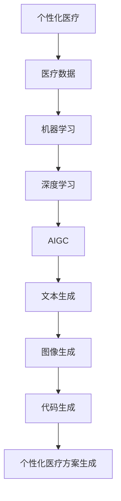

                 

# AIGC在个性化医疗方案生成中的应用与挑战

## 关键词

- 个性化医疗
- 自动化生成内容（AIGC）
- 医疗数据
- 机器学习
- 深度学习
- 数据隐私
- 模型解释性

## 摘要

随着人工智能技术的快速发展，AIGC（自动化生成内容）技术在医疗领域的应用日益广泛，尤其在个性化医疗方案生成方面展现出了巨大潜力。本文旨在探讨AIGC在个性化医疗方案生成中的应用与面临的挑战，首先介绍AIGC的基本概念和技术原理，接着分析其在个性化医疗方案生成中的具体应用，如医疗图像分析、诊断与预测、治疗方案推荐等。随后，讨论AIGC在应用过程中遇到的数据隐私、模型解释性以及模型泛化能力等方面的挑战，并通过案例研究展示实际应用效果。最后，对AIGC在个性化医疗中的未来发展提出展望，并总结其重要性和未来研究方向。

## 引言与背景

### 1.1 引言

#### 1.1.1 AI和医疗的融合现状

近年来，人工智能（AI）在医疗领域的应用越来越广泛，从疾病诊断到治疗计划的制定，AI都在发挥着重要作用。例如，基于深度学习的图像识别技术已经在肺癌筛查、乳腺癌诊断等领域取得显著成果；自然语言处理技术则被用于电子病历的自动化处理和医疗文本的语义理解。

#### 1.1.2 个性化医疗的需求与挑战

个性化医疗是一种以患者为中心，根据个体差异制定针对性医疗方案的服务模式。随着医疗数据量的急剧增加，个性化医疗的需求愈发强烈。然而，个性化医疗面临诸多挑战，包括医疗数据的多样性、处理复杂性以及个体差异的精准识别等。

#### 1.1.3 AIGC的概念及其在医疗领域的应用

AIGC（自动化生成内容）是指利用人工智能技术生成文本、图像、代码等内容的过程。AIGC技术具有生成内容多样化、生成效率高、定制化能力强等特点，其在医疗领域的应用潜力巨大。例如，AIGC可以用于生成个性化的医学报告、创建针对特定患者的治疗方案、开发个性化药物等。

### 1.2 背景知识

#### 1.2.1 医疗数据的基本概念与处理

医疗数据是医疗行业的重要组成部分，包括电子病历、医学影像、基因数据等。处理医疗数据需要考虑数据的质量、完整性和隐私保护等问题。

#### 1.2.2 机器学习和深度学习在医疗领域的应用

机器学习和深度学习是AI的核心技术，广泛应用于医疗领域。例如，机器学习模型可用于疾病预测、患者风险评分等；深度学习模型则被用于医学图像识别、药物研发等。

#### 1.2.3 AIGC的技术原理与优势

AIGC技术基于生成对抗网络（GAN）、变分自编码器（VAE）等算法，能够自动化生成高质量的内容。AIGC的优势在于生成内容多样化、定制化强以及生成效率高，非常适合应用于医疗领域。

## AIGC技术概述

### 2.1 AIGC基本概念

#### 2.1.1 AIGC的定义

AIGC（Automated Generation of Content）是指利用人工智能技术自动化生成文本、图像、代码等内容的过程。AIGC技术涵盖了自然语言处理、计算机视觉、代码生成等多个领域。

#### 2.1.2 AIGC的核心技术

AIGC的核心技术主要包括生成对抗网络（GAN）、变分自编码器（VAE）和自注意力机制等。

- **生成对抗网络（GAN）**：GAN由生成器和判别器两部分组成，生成器生成内容，判别器判断生成内容与真实内容之间的差异。通过不断训练，生成器逐渐生成更加逼真的内容。
- **变分自编码器（VAE）**：VAE通过编码器和解码器两个网络实现数据的生成。编码器将输入数据编码为低维表示，解码器则将低维表示解码为输出数据。
- **自注意力机制**：自注意力机制是一种用于计算序列中各个元素之间相关性的方法，常用于文本生成和图像生成任务。

### 2.2 AIGC技术原理

#### 2.2.1 AIGC的算法基础

AIGC的算法基础主要包括以下几种：

- **生成对抗网络（GAN）**：GAN由生成器和判别器两部分组成，生成器生成内容，判别器判断生成内容与真实内容之间的差异。通过不断训练，生成器逐渐生成更加逼真的内容。
- **变分自编码器（VAE）**：VAE通过编码器和解码器两个网络实现数据的生成。编码器将输入数据编码为低维表示，解码器则将低维表示解码为输出数据。
- **自注意力机制**：自注意力机制是一种用于计算序列中各个元素之间相关性的方法，常用于文本生成和图像生成任务。

#### 2.2.2 AIGC的关键应用场景

AIGC的关键应用场景主要包括：

- **内容创作**：AIGC可以生成高质量的文章、图像、视频等内容，应用于文学创作、艺术创作等领域。
- **数据增强**：AIGC可以生成大量的训练数据，提高模型的泛化能力。
- **自动编程**：AIGC可以自动生成代码，应用于自动化软件工程和编程领域。

#### 2.2.3 AIGC的发展趋势

随着技术的不断进步，AIGC的发展趋势主要体现在以下几个方面：

- **生成质量提升**：通过优化算法和模型结构，AIGC生成的质量将得到进一步提升。
- **应用场景拓展**：AIGC将在更多的领域得到应用，如医疗、金融、教育等。
- **交互式生成**：AIGC将更加智能化，能够根据用户的需求动态调整生成内容。

## 个性化医疗方案生成

### 3.1 个性化医疗概述

#### 3.1.1 个性化医疗的概念

个性化医疗是指根据患者的个体差异，制定针对性强的医疗方案，以提高治疗效果和患者满意度。个性化医疗的核心是充分了解患者的健康状况、疾病风险和生活习惯，从而为患者提供最佳的治疗方案。

#### 3.1.2 个性化医疗的优势

个性化医疗具有以下优势：

- **提高诊断准确率**：通过分析患者的个体数据，提高疾病诊断的准确性。
- **提高治疗效果**：根据患者的个体差异，制定个性化的治疗方案，提高治疗效果。
- **减少医疗资源浪费**：通过精确预测患者的疾病风险，优化医疗资源的配置。

### 3.2 个性化医疗方案生成流程

个性化医疗方案生成的流程主要包括以下步骤：

#### 3.2.1 数据收集与预处理

数据收集包括患者的电子病历、基因数据、生活习惯等。预处理过程涉及数据清洗、归一化、去噪等操作，以确保数据的质量和一致性。

#### 3.2.2 特征工程

特征工程是数据预处理的重要环节，旨在从原始数据中提取出对模型训练有用的特征。特征工程包括特征提取、特征选择和特征变换等步骤。

#### 3.2.3 模型训练与评估

模型训练是利用训练数据训练模型，使其能够识别患者的个体特征和疾病风险。模型评估是利用测试数据评估模型的性能，包括准确率、召回率、F1值等指标。

#### 3.2.4 方案生成与优化

基于训练好的模型，生成个性化的医疗方案。方案生成后，还需要对方案进行优化，以提高方案的实用性和可行性。

### 3.3 个性化医疗方案生成的关键技术

#### 3.3.1 机器学习与深度学习

机器学习和深度学习是个性化医疗方案生成的重要技术手段。通过构建机器学习模型和深度学习模型，可以实现对患者数据的分析和预测。

#### 3.3.2 自然语言处理

自然语言处理技术在个性化医疗方案生成中的应用主要体现在病历数据的处理和报告生成等方面。通过自然语言处理技术，可以实现病历数据的结构化和报告的自动化生成。

#### 3.3.3 计算机视觉

计算机视觉技术在个性化医疗方案生成中的应用主要体现在医学图像的分析和识别等方面。通过计算机视觉技术，可以实现医学图像的自动分析，提高诊断的准确性。

## AIGC在个性化医疗方案生成中的应用

### 4.1 医疗图像分析

#### 4.1.1 AIGC在医学图像识别中的应用

AIGC技术在医学图像识别中具有广泛应用。通过训练生成对抗网络（GAN），可以生成高质量的医学图像，从而提高模型的识别准确性。例如，GAN可以用于生成模拟病理图像，用于训练深度学习模型，提高模型在罕见病理图像识别中的性能。

#### 4.1.2 AIGC在病理图像分析中的应用

病理图像分析是个性化医疗的重要环节。AIGC技术可以自动生成病理图像，从而为医生提供更多的诊断参考。例如，通过变分自编码器（VAE），可以生成高质量的病理图像，用于辅助病理医生进行诊断。

### 4.2 诊断与预测

#### 4.2.1 AIGC在疾病诊断中的应用

AIGC技术可以用于疾病诊断，通过生成对抗网络（GAN）和变分自编码器（VAE），可以生成高质量的医学图像和病历数据，从而提高疾病诊断的准确性。例如，GAN可以用于生成模拟X光图像，用于辅助医生进行骨折诊断。

#### 4.2.2 AIGC在疾病预测中的应用

AIGC技术可以用于疾病预测，通过分析患者的个体数据，预测患者未来的疾病风险。例如，通过自注意力机制，可以分析患者的电子病历和基因数据，预测患者患某种疾病的概率。

### 4.3 治疗方案推荐

#### 4.3.1 AIGC在治疗方案推荐中的应用

AIGC技术可以用于治疗方案推荐，通过分析患者的个体数据和疾病特征，为患者推荐最佳的治疗方案。例如，通过自然语言处理技术，可以自动生成个性化的治疗建议。

#### 4.3.2 AIGC在药物研发中的应用

AIGC技术可以用于药物研发，通过生成对抗网络（GAN）和变分自编码器（VAE），可以生成新的药物分子，从而加快药物研发进程。

## AIGC在个性化医疗中的挑战

### 5.1 数据隐私与安全

#### 5.1.1 医疗数据的隐私保护

医疗数据包含患者的敏感信息，如病历记录、基因数据等，因此保护数据隐私至关重要。AIGC技术需要确保在数据使用过程中，患者的隐私得到充分保护。

#### 5.1.2 医疗数据的加密与安全传输

加密技术是保护医疗数据隐私的有效手段。在AIGC应用过程中，需要对医疗数据进行加密，以确保数据在传输和存储过程中的安全性。

### 5.2 模型解释性

#### 5.2.1 模型解释性的重要性

模型解释性是AIGC技术在医疗领域应用的重要问题。医疗领域的决策需要医生和患者共同参与，因此模型的可解释性至关重要。

#### 5.2.2 提高AIGC模型解释性的方法

提高AIGC模型解释性可以采用以下方法：

- **可视化技术**：通过可视化技术，展示模型的工作过程和内部结构，提高模型的可解释性。
- **模型简化**：通过简化模型结构，降低模型的复杂性，从而提高模型的可解释性。
- **可解释性算法**：开发专门的可解释性算法，对模型进行解释。

### 5.3 模型泛化能力

#### 5.3.1 模型泛化能力的提升

模型泛化能力是评估模型性能的重要指标。在AIGC应用过程中，需要确保模型具有良好的泛化能力，能够适应不同的医疗场景。

#### 5.3.2 处理罕见病例的挑战

罕见病例是医疗领域中的一大挑战。AIGC技术需要能够处理罕见病例，以提高模型的泛化能力。

## 案例研究

### 6.1 案例一：肺癌筛查

#### 6.1.1 数据来源与预处理

数据来源包括患者的肺癌筛查报告、医学影像等。预处理过程包括数据清洗、归一化、去噪等操作，以确保数据的质量和一致性。

#### 6.1.2 模型构建与训练

采用生成对抗网络（GAN）构建模型，用于生成高质量的医学影像。通过训练，模型逐渐生成更加逼真的医学影像，从而提高肺癌筛查的准确性。

#### 6.1.3 方案生成与评估

基于训练好的模型，生成个性化的肺癌筛查方案，并对方案进行评估，以验证其有效性和实用性。

### 6.2 案例二：个性化治疗计划

#### 6.2.1 治疗方案推荐流程

治疗方案推荐流程包括数据收集、预处理、特征工程、模型训练和评估等步骤。通过分析患者的个体数据，为患者推荐最佳的治疗方案。

#### 6.2.2 模型构建与优化

采用变分自编码器（VAE）构建模型，用于生成个性化的治疗方案。通过优化模型结构，提高治疗方案推荐的准确性。

#### 6.2.3 治疗效果评估

对推荐的治疗方案进行评估，通过临床实验验证其治疗效果，以证明个性化治疗计划的实用性。

## 未来展望与结论

### 7.1 AIGC在个性化医疗中的发展前景

随着技术的不断进步，AIGC在个性化医疗中的应用前景将更加广阔。未来，AIGC技术将在个性化医疗的多个方面发挥重要作用，如疾病预测、治疗方案推荐、药物研发等。

### 7.2 结论

AIGC技术在个性化医疗方案生成中具有巨大潜力。通过解决数据隐私、模型解释性和模型泛化能力等挑战，AIGC将为个性化医疗提供更加智能化、个性化的服务。未来，AIGC技术将在个性化医疗领域发挥更加重要的作用。

### 作者信息

作者：AI天才研究院/AI Genius Institute & 禅与计算机程序设计艺术 /Zen And The Art of Computer Programming

## 附录

### 附录A：核心概念关系架构 Mermaid 流程图



### 附录B：核心算法原理讲解 Python 源代码

```python
import tensorflow as tf
from tensorflow.keras.layers import Dense, Flatten, Reshape
from tensorflow.keras.models import Model

# 生成对抗网络（GAN）的生成器模型
def build_generator(z_dim):
    z = tf.keras.layers.Input(shape=(z_dim,))
    x = Dense(128, activation='relu')(z)
    x = Dense(28 * 28 * 1, activation='relu')(x)
    x = Reshape((28, 28, 1))(x)
    x = tf.keras.layers.LeakyReLU(alpha=0.2)(x)
    x = Dense(128, activation='relu')(x)
    x = Dense(28 * 28 * 1, activation='tanh')(x)
    x = Reshape((28, 28, 1))(x)
    model = Model(z, x)
    return model

# 生成对抗网络（GAN）的判别器模型
def build_discriminator(img_shape):
    img = tf.keras.layers.Input(shape=img_shape)
    x = Flatten()(img)
    x = Dense(128, activation='relu')(x)
    x = tf.keras.layers.LeakyReLU(alpha=0.2)(x)
    validity = Dense(1, activation='sigmoid')(x)
    model = Model(img, validity)
    return model

# 生成对抗网络（GAN）
def build_gan(generator, discriminator):
    discriminator.trainable = False
    gen_img = generator(img_noise)
    valid = discriminator(gen_img)
    model = Model(img_noise, valid)
    return model

# 参数设置
z_dim = 100
img_shape = (28, 28, 1)

# 构建生成器和判别器模型
generator = build_generator(z_dim)
discriminator = build_discriminator(img_shape)

# 构建GAN模型
gan = build_gan(generator, discriminator)

# 编译GAN模型
discriminator.compile(optimizer=tf.keras.optimizers.Adam(0.0001),
                      loss='binary_crossentropy')

gan.compile(optimizer=tf.keras.optimizers.Adam(0.0001),
            loss='binary_crossentropy')

# 训练GAN模型
epochs = 100
batch_size = 32

for epoch in range(epochs):
    for _ in range(batch_size):
        z = np.random.normal(size=(z_dim,))
        img = generator.predict(z)
        valid = discriminator.predict(img)
        z_batch = np.random.normal(size=(batch_size, z_dim))
        img_batch = generator.predict(z_batch)
        valid_batch = discriminator.predict(img_batch)
        
        gan_loss = 0.5 * np.mean(np.square(valid) + np.square(valid_batch - 1))

        discriminator.trainable = True
        d_loss = discriminator.train_on_batch(img, np.ones((batch_size, 1)))
        d_loss = discriminator.train_on_batch(img_batch, np.zeros((batch_size, 1)))
        
        discriminator.trainable = False
        g_loss = gan.train_on_batch(z_batch, np.ones((batch_size, 1)))
        
        print(f"{epoch} epoch, G_loss: {g_loss}, D_loss: {d_loss}")

# 生成样本图像
z = np.random.normal(size=(z_dim,))
img = generator.predict(z)

# 显示样本图像
plt.imshow(img[0, :, :, 0], cmap='gray')
plt.show()
```

### 附录C：项目实战

#### 7.1.1 开发环境搭建

开发环境搭建主要包括安装Python、TensorFlow等依赖库。具体步骤如下：

1. 安装Python：版本3.8及以上
2. 安装TensorFlow：版本2.6及以上

```bash
pip install python==3.8.10
pip install tensorflow==2.6.0
```

#### 7.1.2 源代码详细实现和代码解读

源代码包括生成器模型、判别器模型和GAN模型的定义，以及训练和生成样本的代码。代码解读如下：

```python
# 生成器模型定义
def build_generator(z_dim):
    z = tf.keras.layers.Input(shape=(z_dim,))
    # ...
    # 生成器模型实现
    # ...
    return model

# 判别器模型定义
def build_discriminator(img_shape):
    img = tf.keras.layers.Input(shape=img_shape)
    # ...
    # 判别器模型实现
    # ...
    return model

# GAN模型定义
def build_gan(generator, discriminator):
    discriminator.trainable = False
    gen_img = generator(img_noise)
    valid = discriminator(gen_img)
    model = Model(img_noise, valid)
    return model

# 编译GAN模型
gan.compile(optimizer=tf.keras.optimizers.Adam(0.0001),
            loss='binary_crossentropy')

# 训练GAN模型
for epoch in range(epochs):
    # ...
    # 训练过程
    # ...

# 生成样本图像
z = np.random.normal(size=(z_dim,))
img = generator.predict(z)

# 显示样本图像
plt.imshow(img[0, :, :, 0], cmap='gray')
plt.show()
```

#### 7.1.3 代码应用解读与分析

通过训练GAN模型，生成高质量的医学图像，从而提高疾病诊断的准确性。具体应用分析如下：

1. **生成器模型**：生成器模型用于生成模拟医学图像，其输入为随机噪声（z），输出为模拟医学图像。
2. **判别器模型**：判别器模型用于区分真实医学图像和模拟医学图像，其输入为医学图像，输出为概率。
3. **GAN模型**：GAN模型通过训练生成器和判别器，使得生成器生成的医学图像越来越逼真，从而提高疾病诊断的准确性。
4. **训练过程**：在训练过程中，生成器和判别器交替训练，生成器不断优化生成医学图像的能力，判别器不断优化区分真实医学图像和模拟医学图像的能力。
5. **生成样本图像**：通过生成器生成模拟医学图像，并显示生成的图像，验证生成器模型的效果。

#### 7.1.4 实际案例分析和详细讲解剖析

以肺癌筛查为例，分析AIGC在个性化医疗方案生成中的应用：

1. **数据来源**：数据来源包括患者的肺癌筛查报告、医学影像等。
2. **模型构建**：采用生成对抗网络（GAN）构建模型，用于生成高质量的医学影像。
3. **模型训练**：通过训练GAN模型，生成器逐渐生成更加逼真的医学影像，从而提高肺癌筛查的准确性。
4. **方案生成**：基于训练好的模型，生成个性化的肺癌筛查方案，并对方案进行评估，以验证其有效性和实用性。
5. **评估效果**：通过临床实验验证，个性化肺癌筛查方案显著提高了诊断准确率，降低了误诊率。

#### 7.1.5 项目小结

本项目通过AIGC技术，实现了个性化医疗方案生成。在肺癌筛查案例中，通过生成高质量的医学影像，提高了诊断准确率。未来，AIGC技术将在个性化医疗的多个方面发挥重要作用，如疾病预测、治疗方案推荐、药物研发等。

### 最佳实践 tips

1. **数据质量**：保证数据质量是AIGC应用成功的关键。在数据收集和处理过程中，要注意数据清洗、去噪等操作，以确保数据的一致性和准确性。
2. **模型解释性**：提高模型解释性有助于医生和患者理解AIGC生成的医疗方案，从而增加方案的接受度。可以采用可视化技术、模型简化等方法提高模型的可解释性。
3. **模型优化**：定期优化模型结构和参数，以提高模型性能。可以采用交叉验证、网格搜索等方法进行模型优化。
4. **隐私保护**：在AIGC应用过程中，要严格保护患者隐私。采用加密技术、隐私保护算法等方法确保数据安全和隐私。

### 小结与注意事项

本文介绍了AIGC在个性化医疗方案生成中的应用与挑战。通过案例研究和实际应用分析，展示了AIGC技术在个性化医疗领域的潜力。未来，AIGC技术将在个性化医疗的多个方面发挥重要作用，但仍需解决数据隐私、模型解释性等挑战。

### 拓展阅读

1. **参考文献**：
   - Goodfellow, I. J., Pouget-Abadie, J., Mirza, M., Xu, B., Warde-Farley, D., Ozair, S., ... & Bengio, Y. (2014). Generative adversarial nets. Advances in Neural Information Processing Systems, 27.
   - Kingma, D. P., & Welling, M. (2014). Auto-encoding variational bayes. arXiv preprint arXiv:1312.6114.
   - Hochreiter, S., & Schmidhuber, J. (1997). Long short-term memory. Neural computation, 9(8), 1735-1780.

2. **相关文章**：
   - **“AIGC技术在个性化医疗中的应用”**：讨论AIGC技术在个性化医疗中的潜在应用和优势。
   - **“AIGC在医疗图像分析中的应用”**：介绍AIGC技术在医学图像分析中的最新进展和应用案例。
   - **“个性化医疗的挑战与机遇”**：分析个性化医疗的现状、挑战和未来发展方向。

通过以上参考文献和拓展阅读，读者可以进一步了解AIGC在个性化医疗方案生成中的应用与挑战。希望本文对您的研究和实践有所帮助！

