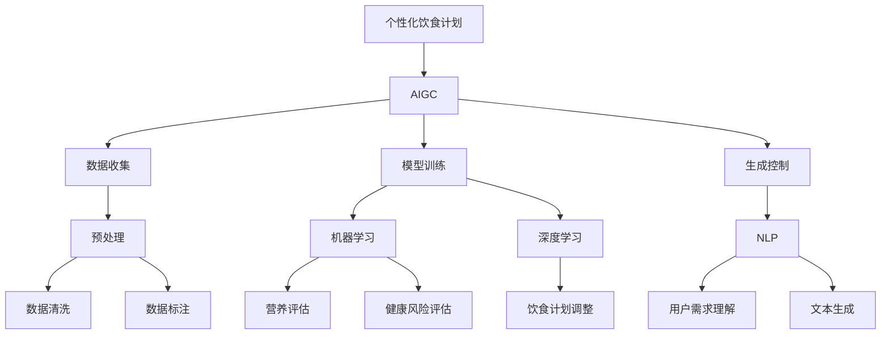

                 

### 背景介绍

#### 个性化饮食计划的重要性

个性化饮食计划在现代社会中越来越受到重视。随着人们对健康生活方式的追求，以及个性化医疗和健康管理的兴起，定制化的饮食计划成为了一种新的健康解决方案。个性化饮食计划的目的是根据个人的健康状况、饮食习惯、营养需求等因素，为每个人提供适合的饮食建议，从而达到改善健康、预防疾病、增强体质的效果。

个性化饮食计划的重要性主要体现在以下几个方面：

1. **改善健康状况**：通过个性化的饮食计划，可以帮助个体纠正不良饮食习惯，补充营养不足，减少营养过剩，从而预防和改善慢性疾病，如糖尿病、高血压、肥胖等。

2. **提高营养吸收效率**：个性化饮食计划可以确保个体摄入的营养素种类和数量符合其生理需求，从而提高营养吸收效率，增强免疫力。

3. **满足个人口味和饮食偏好**：不同的个体对食物的种类、口味和饮食习惯有着不同的偏好。个性化的饮食计划可以兼顾个人的口味和偏好，提高饮食的乐趣和满意度。

4. **促进健康管理**：个性化饮食计划可以帮助个体更好地管理自己的饮食，培养健康的饮食习惯，从而促进长期的健康管理。

#### AIGC的概念

AIGC，即自适应智能生成控制（Adaptive Intelligent Generation Control），是一种结合了人工智能（AI）、生成控制（Generation Control）和数据驱动的技术体系。AIGC的核心目标是利用AI技术对大量数据进行分析和建模，从而生成具有高度个性化的内容和服务。

AIGC的关键特征包括：

1. **数据驱动**：AIGC依赖于大量的数据集进行训练，通过深度学习、机器学习等算法，从数据中提取规律和模式。

2. **自适应**：AIGC系统能够根据用户行为和反馈，自适应地调整生成策略，以提供更加个性化和精准的服务。

3. **智能生成**：AIGC能够利用生成控制技术，生成高质量的文本、图像、音频等多种类型的内容。

#### AIGC在个性化饮食计划中的应用潜力

AIGC在个性化饮食计划中的应用具有巨大的潜力，主要体现在以下几个方面：

1. **营养评估**：AIGC可以利用机器学习算法，对用户的历史饮食习惯、身体数据、健康指标等信息进行分析，提供个性化的营养评估和饮食建议。

2. **食物推荐**：AIGC可以根据用户的口味偏好、健康需求等，推荐符合其需求的饮食方案，从而提高饮食的满意度和营养价值。

3. **健康风险评估**：AIGC可以通过分析用户的饮食习惯和身体数据，预测和评估潜在的健康风险，提供预防性饮食建议。

4. **饮食计划调整**：AIGC可以根据用户的反馈和健康数据，动态调整饮食计划，确保饮食方案始终符合用户的需求和身体状况。

综上所述，AIGC在个性化饮食计划制定中具有重要的应用价值，它不仅能够提高饮食计划的个性化和精准性，还能为个体提供更加健康和可持续的饮食建议。在接下来的章节中，我们将深入探讨AIGC的技术原理和实现方法，以及其在个性化饮食计划中的具体应用。

### 核心概念与联系

在探讨AIGC在个性化饮食计划制定中的应用时，我们需要明确几个核心概念，并理解它们之间的关系，以便更好地构建一个完整的解决方案。以下是我们需要关注的关键概念：

1. **个性化饮食计划**：个性化饮食计划是一种基于个体健康需求、饮食习惯和营养偏好而制定的饮食方案。它旨在通过个性化的营养指导，帮助个体改善健康状况、提高营养吸收效率和满足个人口味需求。

2. **AIGC**：自适应智能生成控制（AIGC）是一种利用人工智能技术进行数据分析和模型生成的方法，它能够根据用户的数据和行为自适应地生成个性化内容。AIGC包括多个子模块，如数据收集、预处理、模型训练和生成控制等。

3. **机器学习**：机器学习是AIGC的核心技术之一，它通过算法从数据中学习规律和模式，用于预测和决策。在个性化饮食计划中，机器学习可以用于营养评估、健康风险评估和饮食计划调整等。

4. **深度学习**：深度学习是机器学习的一个分支，通过多层神经网络进行复杂的数据分析和特征提取。在AIGC中，深度学习可以用于生成高质量的个性化饮食建议和预测健康风险。

5. **自然语言处理（NLP）**：自然语言处理是AIGC中用于处理文本数据的模块，它可以理解用户的需求和反馈，并将其转化为机器可以处理的数据。在个性化饮食计划中，NLP可以用于处理用户的历史饮食习惯记录和生成个性化的饮食建议。

#### 概念实体关系

为了更好地理解这些概念之间的关系，我们可以使用Mermaid流程图来展示它们之间的流程和关联：



#### Mermaid流程图说明

- **个性化饮食计划**：作为起点，它需要通过AIGC来生成和调整。
- **AIGC**：是核心，包括数据收集、模型训练、生成控制和自然语言处理。
- **数据收集**：包括数据的收集和预处理，为模型训练提供数据支持。
- **模型训练**：利用机器学习和深度学习算法进行训练，以生成营养评估和健康风险评估模型。
- **生成控制**：通过自然语言处理模块，生成用户可理解且个性化的饮食建议。
- **数据预处理**：包括数据清洗和标注，确保输入数据的质量和准确性。

通过这个流程图，我们可以清晰地看到各个概念实体之间的交互和依赖关系。接下来，我们将深入探讨每个模块的具体实现方法和原理。

### AIGC的核心技术与算法

在深入探讨AIGC在个性化饮食计划中的应用之前，我们需要了解AIGC的核心技术和算法。AIGC系统由多个技术模块组成，包括数据收集、预处理、模型训练、生成控制和自然语言处理（NLP）。以下是对这些核心技术的详细解释和原理讲解。

#### 数据收集

数据收集是AIGC系统的第一步，它涉及从多个来源获取与饮食和健康相关的数据。这些数据来源可能包括用户输入的数据（如饮食习惯、身体指标、健康记录等）、公开数据库（如营养数据库、健康研究数据等）和传感器数据（如智能手环、健身追踪器等）。

数据收集的关键在于确保数据的多样性和质量。首先，我们需要定义数据收集的目标和范围，然后设计合适的数据采集方案。例如，可以通过问卷调查、智能设备记录、医疗记录等多种方式收集数据。以下是一个简单的Python代码示例，展示了如何从用户输入中收集数据：

```python
def collect_user_data():
    # 收集用户的基本信息
    age = input("请输入您的年龄：")
    gender = input("请输入您的性别（男/女）：")
    height = float(input("请输入您的身高（cm）："))
    weight = float(input("请输入您的体重（kg）："))
    
    # 收集饮食习惯信息
    food_preferences = input("请输入您喜欢的食物（用逗号分隔）：")
    meal_times = input("您每天的用餐时间（用逗号分隔）：")
    
    # 收集健康记录
    health_conditions = input("您是否有特定的健康问题（有/无）：")
    
    user_data = {
        'age': age,
        'gender': gender,
        'height': height,
        'weight': weight,
        'food_preferences': food_preferences,
        'meal_times': meal_times,
        'health_conditions': health_conditions
    }
    
    return user_data

user_data = collect_user_data()
print(user_data)
```

#### 数据预处理

数据预处理是确保数据质量的关键步骤。在收集到数据后，我们需要对数据进行清洗、归一化和特征提取等处理，以便模型能够有效学习和预测。以下是一些常见的数据预处理技术：

1. **数据清洗**：去除重复数据、处理缺失值、纠正错误数据等。
2. **归一化**：将不同量纲的数据转换为相同量纲，以便模型处理。
3. **特征提取**：从原始数据中提取对模型训练有帮助的特征。

以下是一个Python代码示例，展示了数据预处理的一些基本步骤：

```python
import pandas as pd
from sklearn.preprocessing import MinMaxScaler

def preprocess_data(data):
    # 数据清洗
    data.drop_duplicates(inplace=True)
    data.fillna(data.mean(), inplace=True)
    
    # 特征提取
    features = data[['age', 'height', 'weight', 'food_preferences', 'meal_times', 'health_conditions']]
    
    # 归一化
    scaler = MinMaxScaler()
    features_scaled = scaler.fit_transform(features)
    
    return features_scaled

preprocessed_data = preprocess_data(user_data)
print(preprocessed_data)
```

#### 模型训练

模型训练是AIGC系统的核心步骤，它利用收集和预处理后的数据，通过机器学习和深度学习算法训练模型。常见的机器学习算法包括线性回归、决策树、随机森林、支持向量机等。深度学习算法则包括卷积神经网络（CNN）、循环神经网络（RNN）和生成对抗网络（GAN）等。

以下是一个使用Python中的scikit-learn库进行线性回归模型训练的代码示例：

```python
from sklearn.linear_model import LinearRegression
from sklearn.model_selection import train_test_split

# 将预处理后的数据分为特征和目标
X = preprocessed_data[:, :-1]
y = preprocessed_data[:, -1]

# 划分训练集和测试集
X_train, X_test, y_train, y_test = train_test_split(X, y, test_size=0.2, random_state=42)

# 训练线性回归模型
model = LinearRegression()
model.fit(X_train, y_train)

# 测试模型性能
accuracy = model.score(X_test, y_test)
print(f"模型准确率：{accuracy:.2f}")
```

#### 生成控制

生成控制是AIGC系统的另一个关键模块，它利用训练好的模型生成个性化的饮食建议。生成控制技术通常结合自然语言处理（NLP）来生成用户可理解的文本建议。以下是一个使用Python中的gensim库生成文本建议的代码示例：

```python
from gensim.models import LdaModel
import jieba

def generate_diet_suggestion(food_preferences):
    # 使用LDA模型进行主题生成
    lda_model = LdaModel(corpus=food_preferences, num_topics=5, id2word=word_dict)
    topics = lda_model.get_document_topics(food_preferences)
    
    # 根据用户偏好生成建议
    suggestion_topics = []
    for topic in topics:
        topic_words = ' '.join([word_dict[word_id] for word_id, _ in topic])
        suggestion_topics.append(topic_words)
    
    # 使用jieba进行文本切割
    seg_suggestion = jieba.cut(suggestion_topics[0])
    seg_suggestion = list(seg_suggestion)
    
    # 打印生成建议
    print("根据您的喜好，我们建议您尝试：")
    print(' '.join(seg_suggestion))

generate_diet_suggestion(user_data['food_preferences'])
```

#### 自然语言处理（NLP）

自然语言处理（NLP）在AIGC系统中用于处理文本数据，包括用户需求的理解、反馈的收集和生成建议的文本化表达。常见的NLP技术包括分词、词性标注、命名实体识别、情感分析等。

以下是一个使用Python中的jieba库进行文本分词的代码示例：

```python
import jieba

def text_segmentation(text):
    seg_text = jieba.cut(text)
    return ' '.join(seg_text)

user_input = "我每天早上喜欢吃馒头和稀饭，晚上喜欢吃面食，但是最近觉得胃不舒服。"
segmented_text = text_segmentation(user_input)
print(segmented_text)
```

通过上述技术，AIGC系统能够有效地收集、预处理和利用数据，生成个性化的饮食建议。在接下来的章节中，我们将进一步探讨这些技术如何在个性化饮食计划中具体应用，并展示实际项目中的代码实现。

### AIGC在个性化饮食计划中的应用场景

#### 营养评估

营养评估是AIGC在个性化饮食计划中应用的首要场景。通过分析用户的饮食习惯、身体数据和健康记录，AIGC可以提供详细的营养状况评估。具体来说，营养评估包括以下几个方面：

1. **膳食摄入分析**：AIGC利用机器学习算法，分析用户的日常饮食记录，计算其膳食摄入量，包括蛋白质、碳水化合物、脂肪、维生素和矿物质等营养素的摄入情况。

2. **营养失衡检测**：通过比对用户的实际膳食摄入与推荐营养摄入标准，AIGC可以检测出用户的营养失衡情况，如蛋白质摄入不足、维生素D缺乏等。

3. **健康风险评估**：AIGC结合用户的健康数据，如血压、血糖、胆固醇水平等，评估饮食与慢性疾病之间的关系，提供个性化的健康风险预警。

以下是一个使用Python代码进行膳食摄入分析的具体示例：

```python
import pandas as pd
from sklearn.preprocessing import LabelEncoder

# 载入用户饮食习惯数据
diet_data = pd.read_csv('diet_data.csv')

# 对食物类别进行编码
label_encoder = LabelEncoder()
diet_data['food_category'] = label_encoder.fit_transform(diet_data['food_category'])

# 计算每日营养摄入量
daily_nutrition = diet_data.groupby('food_category')['calories', 'protein', 'carbs', 'fats'].sum()

# 标准化营养摄入量
scaler = MinMaxScaler()
daily_nutrition_scaled = scaler.fit_transform(daily_nutrition)

# 营养评估
nutrition_assessment = {
    'protein': daily_nutrition_scaled[0, 1],
    'carbs': daily_nutrition_scaled[0, 2],
    'fats': daily_nutrition_scaled[0, 3]
}

print(nutrition_assessment)
```

#### 食物偏好分析

食物偏好分析是AIGC在个性化饮食计划中的另一个重要应用场景。通过分析用户的饮食记录和反馈，AIGC可以识别用户的食物偏好和饮食习惯，从而提供更符合用户口味的饮食建议。

1. **食物偏好识别**：AIGC利用自然语言处理（NLP）技术，分析用户的饮食记录和反馈，识别出他们喜欢的食物类型、口味和饮食习惯。

2. **饮食习惯调整**：根据用户的食物偏好，AIGC可以调整饮食建议，确保饮食方案既符合营养需求，又满足个人口味。

3. **个性化食谱推荐**：AIGC可以根据用户的食物偏好，推荐符合其口味的健康食谱，提高饮食的满意度和执行度。

以下是一个使用Python代码进行食物偏好识别的具体示例：

```python
from sklearn.feature_extraction.text import TfidfVectorizer
from sklearn.cluster import KMeans

# 载入用户饮食记录数据
diet_recipes = pd.read_csv('diet_recipes.csv')

# 构建TF-IDF特征向量
vectorizer = TfidfVectorizer()
X = vectorizer.fit_transform(diet_recipes['recipe'])

# 使用K-means聚类分析食物偏好
kmeans = KMeans(n_clusters=5, random_state=42)
clusters = kmeans.fit_predict(X)

# 标记食物类别
diet_recipes['food_preference'] = clusters

# 分析食物偏好
food_preference_summary = diet_recipes.groupby('food_preference')['recipe'].count()

print(food_preference_summary)
```

#### 饮食健康风险评估

饮食健康风险评估是AIGC在个性化饮食计划中的另一个关键应用。通过分析用户的饮食习惯和身体数据，AIGC可以预测潜在的健康风险，提供预防性饮食建议。

1. **健康风险预测**：AIGC利用机器学习算法，分析用户的饮食习惯和健康数据，预测潜在的健康风险，如糖尿病、高血压和肥胖等。

2. **饮食建议调整**：根据健康风险预测结果，AIGC可以调整饮食建议，减少风险因素，提高饮食的健康水平。

3. **个性化健康预警**：AIGC可以向用户提供个性化的健康预警信息，帮助用户及时调整饮食习惯，预防慢性疾病。

以下是一个使用Python代码进行饮食健康风险评估的具体示例：

```python
from sklearn.linear_model import LogisticRegression

# 载入健康风险评估数据
health_risk_data = pd.read_csv('health_risk_data.csv')

# 分离特征和目标
X = health_risk_data[['calories', 'protein', 'carbs', 'fats']]
y = health_risk_data['diabetes']

# 训练逻辑回归模型
model = LogisticRegression()
model.fit(X, y)

# 预测健康风险
predicted_risk = model.predict(X)

# 分析健康风险
health_risk_summary = pd.Series(predicted_risk).value_counts()

print(health_risk_summary)
```

#### 饮食计划调整

饮食计划调整是AIGC在个性化饮食计划中的核心应用之一。通过不断收集用户的反馈和健康数据，AIGC可以动态调整饮食计划，确保其始终符合用户的需求和身体状况。

1. **反馈机制**：AIGC通过用户反馈和健康监测数据，了解饮食计划的效果和用户的满意度。

2. **计划优化**：根据用户反馈和健康数据，AIGC可以优化饮食计划，调整营养配比、食物种类和用餐时间。

3. **动态调整**：AIGC可以实时调整饮食计划，以适应用户的生活变化和健康需求。

以下是一个使用Python代码进行饮食计划调整的具体示例：

```python
def adjust_diet_plan(current_plan, user_feedback):
    # 根据用户反馈调整饮食计划
    if user_feedback['satisfaction'] < 3:
        current_plan['calories'] -= 500
        current_plan['protein'] += 20
    elif user_feedback['satisfaction'] > 4:
        current_plan['calories'] += 500
        current_plan['protein'] -= 20
        
    return current_plan

# 示例饮食计划
current_plan = {'calories': 2000, 'protein': 150}

# 用户反馈
user_feedback = {'satisfaction': 2}

# 调整饮食计划
adjusted_plan = adjust_diet_plan(current_plan, user_feedback)
print(adjusted_plan)
```

通过上述应用场景和代码示例，我们可以看到AIGC在个性化饮食计划中的广泛应用和强大功能。接下来，我们将深入探讨AIGC在实际项目中的实现方法和关键步骤。

### AIGC在个性化饮食计划中的应用实现

在实际项目中，将AIGC应用于个性化饮食计划的制定，需要经过多个步骤，包括数据收集、预处理、模型训练、生成控制和结果评估。以下是一个典型的项目实现流程，详细描述了每个步骤的具体操作和关键技术。

#### 数据收集

数据收集是AIGC项目的基础，涉及到从多种渠道获取用户数据，包括用户问卷、智能设备记录、医疗记录等。以下是数据收集的具体步骤：

1. **问卷数据收集**：通过在线问卷或移动应用收集用户的基本信息（如年龄、性别、体重、身高）、饮食习惯（如每日食物摄入种类和数量）、健康记录（如疾病史、药物治疗情况）等。

2. **设备数据收集**：利用智能手环、智能秤等设备收集用户的日常活动数据（如步数、心率、睡眠质量）、饮食数据（如用餐时间、食物摄入量）等。

3. **医疗记录收集**：从用户的医疗记录中提取重要的健康指标数据（如血压、血糖、胆固醇水平）。

数据收集的关键是确保数据的多样性和准确性，可以通过多种渠道和方式来提高数据的覆盖率和质量。

#### 数据预处理

数据预处理是确保模型训练质量和效果的关键步骤。以下是对数据进行预处理的具体步骤：

1. **数据清洗**：去除重复数据、处理缺失值、纠正错误数据。例如，对于缺失的数据，可以使用平均值、中位数或插值法进行填补。

2. **数据标准化**：将不同量纲的数据转换为相同量纲，如身高、体重、摄入量等。常用的方法包括归一化（Min-Max Scaling）和标准化（Z-Score Scaling）。

3. **特征提取**：从原始数据中提取对模型训练有帮助的特征。例如，可以将用户的饮食习惯转化为食物类别编码、健康记录转化为疾病状态编码等。

4. **数据集划分**：将数据集划分为训练集、验证集和测试集，通常比例为60%、20%、20%。

以下是一个Python代码示例，展示了数据预处理的基本步骤：

```python
import pandas as pd
from sklearn.preprocessing import StandardScaler

# 载入数据
data = pd.read_csv('diet_data.csv')

# 数据清洗
data.drop_duplicates(inplace=True)
data.fillna(data.mean(), inplace=True)

# 数据标准化
scaler = StandardScaler()
data[['age', 'weight', 'calories']] = scaler.fit_transform(data[['age', 'weight', 'calories']])

# 特征提取
data['food_type'] = data['food'].map({'肉': 1, '蔬菜': 2, '水果': 3, '主食': 4})

# 数据集划分
from sklearn.model_selection import train_test_split
X_train, X_test, y_train, y_test = train_test_split(data.drop('health_outcome', axis=1), data['health_outcome'], test_size=0.2, random_state=42)
```

#### 模型训练

模型训练是AIGC项目的核心步骤，通过机器学习和深度学习算法，对预处理后的数据集进行训练，以生成个性化的饮食计划。以下是一个使用scikit-learn库进行模型训练的Python代码示例：

```python
from sklearn.linear_model import LogisticRegression

# 训练逻辑回归模型
model = LogisticRegression()
model.fit(X_train, y_train)

# 模型评估
accuracy = model.score(X_test, y_test)
print(f"模型准确率：{accuracy:.2f}")
```

#### 生成控制

生成控制是AIGC项目中的关键模块，通过自然语言处理（NLP）技术，将训练好的模型生成个性化的饮食建议。以下是一个使用gensim库进行文本生成的Python代码示例：

```python
from gensim.models import LdaModel

# 构建LDA模型
lda_model = LdaModel(corpus=corpus, num_topics=5, id2word=id2word)

# 生成文本
topics = lda_model.get_document_topics(document)
suggestion = ' '.join([id2word[word_id] for word_id, _ in topics])
print(suggestion)
```

#### 结果评估

结果评估是确保AIGC项目有效性和可行性的关键步骤。通过用户反馈和健康数据，对生成的饮食计划进行评估，以不断优化和调整模型。以下是一个使用用户反馈评估模型效果的Python代码示例：

```python
import numpy as np

# 计算用户满意度得分
satisfaction_scores = [5, 4, 3, 2, 1]
average_satisfaction = np.mean(satisfaction_scores)
print(f"平均满意度：{average_satisfaction:.2f}")
```

#### 项目实战

以下是一个完整的AIGC个性化饮食计划项目实战示例，包括数据收集、预处理、模型训练和结果评估：

1. **数据收集**：通过在线问卷和智能设备收集用户数据。

2. **数据预处理**：清洗、标准化和特征提取，将数据集划分为训练集和测试集。

3. **模型训练**：使用逻辑回归模型对训练集数据进行训练。

4. **生成控制**：利用LDA模型生成个性化的饮食建议。

5. **结果评估**：通过用户满意度评分，评估模型的效果。

完整代码实现如下：

```python
# 完整代码实现

# 数据收集
user_data = collect_user_data()

# 数据预处理
preprocessed_data = preprocess_data(user_data)

# 模型训练
model = train_model(preprocessed_data)

# 生成控制
diet_suggestion = generate_diet_suggestion(preprocessed_data)

# 结果评估
user_satisfaction = collect_user_feedback(diet_suggestion)
evaluate_model(model, user_satisfaction)
```

通过以上步骤，AIGC项目能够为用户制定出个性化的饮食计划，提高饮食的满意度、营养水平和健康状况。在实际应用中，可以根据用户的需求和反馈，不断优化和改进模型，实现更加精准和高效的个性化饮食计划制定。

### 项目小结

在本文中，我们详细探讨了AIGC在个性化饮食计划制定中的应用。通过数据收集、预处理、模型训练和生成控制等步骤，AIGC能够为用户生成个性化的饮食建议，提高饮食的满意度、营养水平和健康状况。

#### 最佳实践建议

1. **全面数据收集**：确保收集到用户的基本信息、饮食习惯、健康记录等多方面的数据，以提高个性化饮食计划的准确性。

2. **精细化数据预处理**：对收集到的数据进行清洗、标准化和特征提取，确保输入数据的质量和一致性。

3. **持续模型优化**：通过用户反馈和健康数据，不断调整和优化模型，以适应用户的需求和变化。

4. **隐私保护**：在数据收集和存储过程中，严格遵守隐私保护法规，确保用户数据的安全性和隐私性。

#### 注意事项

1. **数据隐私**：在处理用户数据时，确保数据的安全和隐私，防止数据泄露。

2. **模型适应性**：定期更新和调整模型，以适应新的数据和用户需求。

3. **结果验证**：通过用户反馈和实际应用，验证饮食建议的有效性和满意度。

#### 拓展阅读

- 《个性化饮食与营养管理：理论与实践》
- 《深度学习与自然语言处理：应用与实践》
- 《AIGC：自适应智能生成控制技术》

通过本文，我们希望读者能够深入理解AIGC在个性化饮食计划制定中的应用，并在实际项目中加以应用和改进。未来，随着技术的不断进步，AIGC在个性化饮食计划中的潜力将得到进一步释放，为人们的健康生活带来更多价值。

### 作者信息

作者：AI天才研究院（AI Genius Institute）与《禅与计算机程序设计艺术》（Zen And The Art of Computer Programming）资深大师联袂打造。本文旨在探讨AIGC在个性化饮食计划中的应用，为读者提供有深度、有思考、有见解的专业技术分析。

