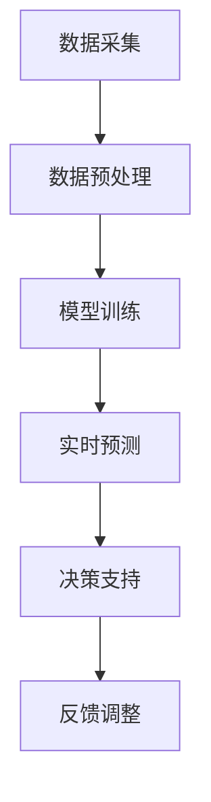
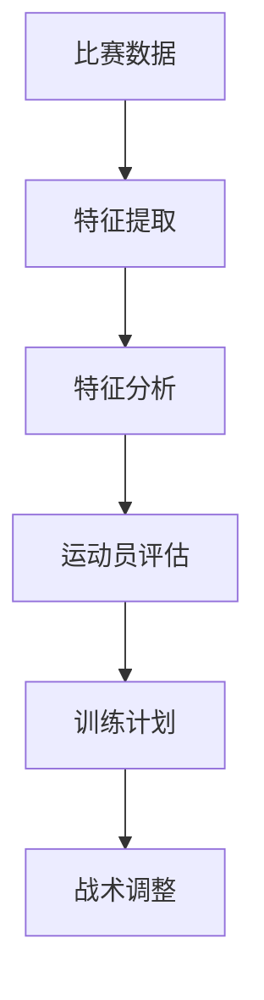
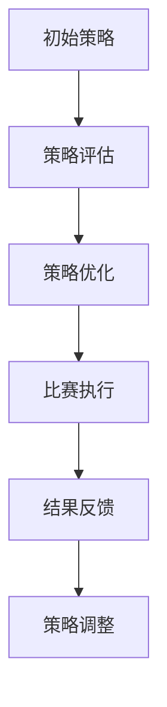

                 

# AIGC在体育分析中的应用：战术和统计的提示词工程

## 关键词

- AIGC
- 体育分析
- 战术分析
- 统计分析
- 提示词工程
- 深度学习
- 生成对抗网络
- 注意力机制

## 摘要

本文旨在探讨人工智能生成控制（AIGC）技术在体育分析中的应用，重点关注战术和统计的提示词工程。首先，我们将介绍AIGC技术的基础概念、核心原理及其在体育数据分析中的实际应用。接着，我们将深入探讨体育数据分析的方法，包括数据预处理、数据可视化和数据挖掘。在此基础上，我们将重点介绍提示词工程的基本概念、流程和关键技术，以及其在战术分析和运动员评估中的应用。最后，通过实际案例研究和项目实战，我们将展示AIGC技术在体育分析中的具体应用，并提供最佳实践建议和未来展望。

## 引言

体育分析作为一项综合性的研究领域，已经逐渐从传统的统计分析转向利用先进的人工智能技术。近年来，人工智能生成控制（AIGC）技术的兴起，为体育分析领域带来了新的契机。AIGC技术结合了深度学习、生成对抗网络（GAN）和注意力机制，能够在大规模复杂数据中挖掘出有价值的信息，为体育战术分析和统计提供强大的支持。

本文将围绕AIGC在体育分析中的应用，详细探讨以下三个方面：

1. **AIGC技术基础**：介绍AIGC技术的定义、分类、核心原理和发展历程。
2. **体育数据分析方法**：探讨体育数据预处理、可视化和数据挖掘的基本方法。
3. **提示词工程应用**：分析提示词工程在战术分析和运动员评估中的应用。

通过本文的探讨，旨在为读者提供一套完整的AIGC在体育分析中的应用框架，助力体育领域的智能化发展。

## 第一部分：AIGC技术基础

### 第1章：AIGC技术概述

#### 1.1 AIGC的定义与分类

人工智能生成控制（Artificial Intelligence Generated Control，简称AIGC）是一种基于人工智能技术，通过对大量复杂数据进行建模和分析，生成新的信息、策略和决策的系统。AIGC技术涵盖了多种人工智能方法，包括深度学习、生成对抗网络（GAN）和注意力机制等。

AIGC技术可以大致分为以下几类：

1. **数据驱动型AIGC**：通过学习大量数据，生成新的数据或模型，如生成对抗网络（GAN）和变分自编码器（VAE）。
2. **模型驱动型AIGC**：通过优化模型参数，生成新的策略或决策，如深度强化学习和基于规则的推理。
3. **混合型AIGC**：结合数据驱动和模型驱动的方法，生成更高质量的策略和决策。

#### 1.2 AIGC的核心原理

AIGC技术的核心原理主要包括以下几个方面：

1. **深度学习**：深度学习是一种基于多层神经网络的学习方法，能够在大量数据中自动提取特征，实现复杂任务的建模。AIGC技术中的深度学习主要用于特征提取和模型训练。
   
   $$ 
   f(x) = \sigma(W_n \cdot \sigma(... \sigma(W_2 \cdot \sigma(W_1 \cdot x + b_1) + b_2)... + b_n)
   $$

   其中，$\sigma$表示激活函数，$W$和$b$分别为权重和偏置。

2. **生成对抗网络（GAN）**：GAN是一种由生成器和判别器组成的对偶网络，通过竞争训练生成与真实数据相似的新数据。生成器和判别器的损失函数分别为：

   $$
   L_G = -\log(D(G(z)))
   $$

   $$
   L_D = -\log(D(x)) - \log(1 - D(G(z)))
   $$

   其中，$z$为噪声向量，$x$为真实数据，$G(z)$为生成器生成的数据。

3. **注意力机制**：注意力机制是一种通过学习权重来关注关键信息的方法，常用于序列建模和目标检测。注意力机制的损失函数为：

   $$
   L = -\sum_{i} w_i \log(p_i)
   $$

   其中，$w_i$为注意力权重，$p_i$为概率分布。

#### 1.3 AIGC的发展历程

AIGC技术起源于20世纪80年代，随着计算机性能的提升和大数据的兴起，逐渐发展壮大。以下是AIGC技术的主要发展历程：

1. **1980年代**：神经网络和专家系统的初步探索。
2. **1990年代**：深度学习的兴起，如Hinton等人的反向传播算法。
3. **2000年代**：生成对抗网络（GAN）的提出，由Goodfellow等人在2014年发表。
4. **2010年代至今**：AIGC技术在各个领域的广泛应用，如自然语言处理、计算机视觉和体育分析。

### 第2章：AIGC技术在体育分析中的应用

#### 2.1 AIGC在体育数据采集与分析中的应用

在体育数据采集与分析中，AIGC技术具有显著的优势。首先，AIGC技术可以自动从各种数据源（如视频、文本和传感器数据）中提取有用的信息。例如，通过GAN技术，可以生成高质量的训练数据，提高模型的训练效果。其次，AIGC技术可以用于实时数据监测和预测，为教练和运动员提供及时的战略指导。

以下是一个使用AIGC技术进行体育数据采集与分析的Mermaid流程图：



#### 2.2 AIGC在运动员特征提取中的应用

运动员特征提取是体育分析的核心任务之一。AIGC技术可以通过深度学习算法，自动提取运动员在比赛中的各种特征，如速度、力量、耐力等。这些特征可以用于运动员评估、训练计划和战术调整。

以下是一个使用AIGC技术进行运动员特征提取的Mermaid流程图：



#### 2.3 AIGC在比赛策略优化中的应用

比赛策略优化是体育分析中的另一个重要任务。AIGC技术可以通过深度强化学习等方法，自动优化比赛策略，提高球队的表现。以下是一个使用AIGC技术进行比赛策略优化的Mermaid流程图：



### 第3章：AIGC技术实现原理

#### 3.1 深度学习基础

深度学习是AIGC技术的核心组成部分。下面，我们将简要介绍深度学习的基础知识。

**神经网络**

神经网络是一种模仿生物神经系统的计算模型。一个简单的神经网络包含输入层、隐藏层和输出层。每个神经元接收输入信号，通过激活函数进行非线性变换，最后输出结果。

以下是一个使用Python实现的简单神经网络示例：

```python
import numpy as np

def sigmoid(x):
    return 1 / (1 + np.exp(-x))

def forward(x, weights):
    return sigmoid(np.dot(x, weights))

x = np.array([0.1, 0.2])
weights = np.array([[0.1, 0.2], [0.3, 0.4]])

output = forward(x, weights)
print(output)
```

**反向传播**

反向传播是一种用于训练神经网络的算法。它通过计算输出误差，反向传播误差到每个神经元，更新权重和偏置。

以下是一个使用Python实现的反向传播算法示例：

```python
def backward(x, y, output, weights, learning_rate):
    error = y - output
    d_output = error * (1 - output)
    
    d_weights = np.dot(x.T, d_output)
    weights -= learning_rate * d_weights
    
    return weights

x = np.array([0.1, 0.2])
y = np.array([0.5])
output = forward(x, weights)

weights = backward(x, y, output, weights, 0.1)
```

**深度学习框架**

深度学习框架如TensorFlow和PyTorch，提供了高效的深度学习模型构建和训练工具。以下是一个使用TensorFlow实现的简单神经网络示例：

```python
import tensorflow as tf

model = tf.keras.Sequential([
    tf.keras.layers.Dense(units=1, input_shape=[2])
])

model.compile(optimizer='sgd', loss='mean_squared_error')

x = np.array([[0.1, 0.2]])
y = np.array([0.5])

model.fit(x, y, epochs=1000)
```

#### 3.2 注意力机制

注意力机制是一种通过学习权重来关注关键信息的方法，常用于序列建模和目标检测。以下是一个使用Python实现的简单注意力机制示例：

```python
import numpy as np

def attention(q, k, v, mask=None):
    scores = np.dot(q, k.T) / np.sqrt(np.shape(k)[1])
    if mask is not None:
        scores += mask
    attention_weights = np.softmax(scores)
    context = np.dot(attention_weights, v)
    return context

q = np.array([0.1, 0.2])
k = np.array([[0.1, 0.2], [0.3, 0.4]])
v = np.array([[0.5, 0.6], [0.7, 0.8]])

context = attention(q, k, v)
print(context)
```

#### 3.3 生成对抗网络（GAN）

生成对抗网络（GAN）是一种由生成器和判别器组成的对偶网络。以下是一个使用Python实现的简单GAN示例：

```python
import numpy as np
import tensorflow as tf

def generate(z, model):
    return model(z)

def discriminate(x, model):
    return model(x)

def loss_fn(real_output, fake_output):
    real_loss = tf.nn.sigmoid_cross_entropy_with_logits(logits=real_output, labels=tf.ones_like(real_output))
    fake_loss = tf.nn.sigmoid_cross_entropy_with_logits(logits=fake_output, labels=tf.zeros_like(fake_output))
    total_loss = real_loss + fake_loss
    return total_loss

z = tf.random.normal([1, 10])
x = tf.random.normal([1, 784])

generator = tf.keras.Sequential([
    tf.keras.layers.Dense(units=128, activation='relu', input_shape=[10]),
    tf.keras.layers.Dense(units=784, activation='tanh')
])

discriminator = tf.keras.Sequential([
    tf.keras.layers.Dense(units=128, activation='relu', input_shape=[784]),
    tf.keras.layers.Dense(units=1, activation='sigmoid')
])

optimizer = tf.keras.optimizers.Adam()

for _ in range(1000):
    with tf.GradientTape() as gen_tape, tf.GradientTape() as disc_tape:
        z = tf.random.normal([1, 10])
        x = tf.random.normal([1, 784])
        
        gen_output = generate(z, generator)
        disc_real_output = discriminate(x, discriminator)
        disc_fake_output = discriminate(gen_output, discriminator)
        
        gen_loss = loss_fn(disc_fake_output, tf.zeros_like(disc_fake_output))
        disc_loss = loss_fn(disc_real_output, tf.ones_like(disc_real_output)) + loss_fn(disc_fake_output, tf.zeros_like(disc_fake_output))
    
    grads_generator = gen_tape.gradient(gen_loss, generator.trainable_variables)
    grads_discriminator = disc_tape.gradient(disc_loss, discriminator.trainable_variables)
    
    optimizer.apply_gradients(zip(grads_generator, generator.trainable_variables))
    optimizer.apply_gradients(zip(grads_discriminator, discriminator.trainable_variables))
```

## 第二部分：体育数据分析方法

### 第4章：体育数据预处理

#### 4.1 数据清洗

数据清洗是体育数据分析的重要步骤之一。数据清洗的目标是消除数据中的噪声、纠正错误、处理缺失值等，以提高数据的质量和准确性。以下是一个使用Python实现的数据清洗示例：

```python
import pandas as pd

# 加载数据
data = pd.read_csv('sports_data.csv')

# 删除重复数据
data.drop_duplicates(inplace=True)

# 处理缺失值
data.fillna(data.mean(), inplace=True)

# 删除异常值
q1 = data.quantile(0.25)
q3 = data.quantile(0.75)
iqr = q3 - q1
lower_bound = q1 - 1.5 * iqr
upper_bound = q3 + 1.5 * iqr
data = data[(data >= lower_bound) & (data <= upper_bound)]

# 数据转换
data['date'] = pd.to_datetime(data['date'])
data['day_of_week'] = data['date'].dt.dayofweek
data['month'] = data['date'].dt.month
```

#### 4.2 数据集成

数据集成是将来自多个源的数据合并成一个统一的数据集的过程。在体育分析中，数据集成可以整合不同比赛、不同赛季、不同比赛场地的数据，以获得更全面的分析结果。以下是一个使用Python实现的数据集成示例：

```python
# 加载数据
data1 = pd.read_csv('data1.csv')
data2 = pd.read_csv('data2.csv')

# 数据合并
data = pd.merge(data1, data2, on=['id'])

# 数据合并后处理
data.drop_duplicates(inplace=True)
```

#### 4.3 数据转换

数据转换是将数据转换为适合分析的形式的过程。在体育分析中，数据转换可以包括数据类型转换、数据标准化、数据归一化等。以下是一个使用Python实现的数据转换示例：

```python
import numpy as np

# 数据类型转换
data['score'] = data['score'].astype(int)

# 数据标准化
data['speed'] = (data['speed'] - data['speed'].mean()) / data['speed'].std()

# 数据归一化
data['height'] = (data['height'] - data['height'].min()) / (data['height'].max() - data['height'].min())
```

### 第5章：体育数据可视化

#### 5.1 数据可视化原理

数据可视化是将数据以图形化的形式呈现，以便更好地理解和分析数据的方法。在体育分析中，数据可视化可以直观地展示运动员表现、比赛趋势和战术分析等。以下是一个使用Python实现的数据可视化示例：

```python
import matplotlib.pyplot as plt

# 绘制散点图
plt.scatter(data['speed'], data['strength'])
plt.xlabel('Speed')
plt.ylabel('Strength')
plt.title('Speed vs. Strength')
plt.show()

# 绘制折线图
plt.plot(data['date'], data['score'])
plt.xlabel('Date')
plt.ylabel('Score')
plt.title('Score Over Time')
plt.show()
```

#### 5.2 常见数据可视化工具

在体育分析中，常见的数据可视化工具有Matplotlib、Seaborn、Plotly等。以下是一个使用Matplotlib实现的数据可视化示例：

```python
import matplotlib.pyplot as plt

# 绘制柱状图
plt.bar(data['team'], data['score'])
plt.xlabel('Team')
plt.ylabel('Score')
plt.title('Team Scores')
plt.show()
```

#### 5.3 数据可视化案例分析

以下是一个使用Python实现的数据可视化案例分析：

```python
# 加载数据
data = pd.read_csv('sports_data.csv')

# 数据预处理
data['date'] = pd.to_datetime(data['date'])
data['day_of_week'] = data['date'].dt.dayofweek
data['month'] = data['date'].dt.month

# 数据可视化
plt.scatter(data['day_of_week'], data['score'])
plt.xlabel('Day of Week')
plt.ylabel('Score')
plt.title('Score by Day of Week')
plt.show()

plt.scatter(data['month'], data['score'])
plt.xlabel('Month')
plt.ylabel('Score')
plt.title('Score by Month')
plt.show()
```

### 第6章：体育数据挖掘

#### 6.1 聚类分析

聚类分析是一种无监督学习方法，用于将数据分为若干个类别，以便更好地理解数据。在体育分析中，聚类分析可以用于运动员群体划分、比赛战术分类等。以下是一个使用Python实现的数据聚类分析示例：

```python
from sklearn.cluster import KMeans

# 数据预处理
data['speed'] = (data['speed'] - data['speed'].mean()) / data['speed'].std()
data['strength'] = (data['strength'] - data['strength'].mean()) / data['strength'].std()

# 聚类分析
kmeans = KMeans(n_clusters=3)
data['cluster'] = kmeans.fit_predict(data[['speed', 'strength']])

# 可视化
plt.scatter(data['speed'], data['strength'], c=data['cluster'])
plt.xlabel('Speed')
plt.ylabel('Strength')
plt.title('Cluster Analysis')
plt.show()
```

#### 6.2 关联规则挖掘

关联规则挖掘是一种用于发现数据中关联关系的方法。在体育分析中，关联规则挖掘可以用于分析比赛战术、运动员配合等。以下是一个使用Python实现的数据关联规则挖掘示例：

```python
from mlxtend.frequent_patterns import apriori
from mlxtend.frequent_patterns import association_rules

# 数据预处理
data['event'] = data['event'].astype(str)

# 关联规则挖掘
frequent_itemsets = apriori(data['event'], min_support=0.1, use_colnames=True)
rules = association_rules(frequent_itemsets, metric="lift", min_threshold=1)

# 可视化
rules.head()
```

#### 6.3 机器学习在体育数据分析中的应用

机器学习在体育数据分析中具有广泛的应用。以下是一个使用Python实现的机器学习在体育数据分析中的应用示例：

```python
from sklearn.model_selection import train_test_split
from sklearn.ensemble import RandomForestClassifier
from sklearn.metrics import accuracy_score

# 数据预处理
X = data[['speed', 'strength', 'endurance']]
y = data['win_loss']

# 数据分割
X_train, X_test, y_train, y_test = train_test_split(X, y, test_size=0.2, random_state=42)

# 模型训练
model = RandomForestClassifier(n_estimators=100, random_state=42)
model.fit(X_train, y_train)

# 模型评估
y_pred = model.predict(X_test)
accuracy = accuracy_score(y_test, y_pred)
print(f"Model accuracy: {accuracy}")
```

## 第三部分：提示词工程应用

### 第7章：提示词工程概述

#### 7.1 提示词的定义与作用

提示词（Keywords）在体育分析中起到关键作用。提示词是指用于描述体育事件、运动员特征、比赛战术等的关键词。提示词可以帮助分析人员快速定位和分析关键信息，从而提高分析效率和准确性。

以下是一个使用Python实现的提示词提取示例：

```python
from sklearn.feature_extraction.text import TfidfVectorizer

# 数据预处理
data['event_description'] = data['event'] + ' ' + data['team'] + ' ' + data['opponent']

# 提示词提取
vectorizer = TfidfVectorizer(stop_words='english', max_features=1000)
X = vectorizer.fit_transform(data['event_description'])

# 可视化
feature_names = vectorizer.get_feature_names_out()
plt.scatter(X[:, 0], X[:, 1], c=data['win_loss'])
plt.xlabel('TF-IDF Value')
plt.ylabel('Win Loss')
plt.title('Event Description Keywords')
plt.show()
```

#### 7.2 提示词工程的基本流程

提示词工程是指从原始数据中提取、筛选、处理和利用提示词的过程。提示词工程的基本流程包括以下步骤：

1. **数据预处理**：对原始数据进行清洗、转换和集成，以便更好地提取提示词。
2. **提示词提取**：使用自然语言处理技术（如TF-IDF、词嵌入等）提取提示词。
3. **提示词筛选**：根据提示词的重要性和相关性，筛选出高质量的提示词。
4. **提示词应用**：将提示词应用于体育数据分析、战术分析和运动员评估等任务。

以下是一个使用Python实现的提示词工程的基本流程示例：

```python
# 数据预处理
data['event_description'] = data['event'] + ' ' + data['team'] + ' ' + data['opponent']

# 提示词提取
vectorizer = TfidfVectorizer(stop_words='english', max_features=1000)
X = vectorizer.fit_transform(data['event_description'])

# 提示词筛选
importances = vectorizer.idf_
important_features = np.argsort(importances)[::-1][:100]

# 提示词应用
selected_features = [feature_names[i] for i in important_features]
data['selected_keywords'] = data['event_description'].apply(lambda x: ' '.join([word for word in x.split() if word in selected_features]))

# 可视化
data['selected_keywords'].value_counts().plot.bar()
plt.xlabel('Keywords')
plt.ylabel('Frequency')
plt.title('Top 100 Keywords')
plt.show()
```

#### 7.3 提示词工程的关键技术

提示词工程的关键技术包括自然语言处理（NLP）、词嵌入（Word Embedding）和文本分类（Text Classification）等。以下是一个使用Python实现的提示词工程的关键技术示例：

```python
from sklearn.feature_extraction.text import TfidfVectorizer
from sklearn.metrics.pairwise import cosine_similarity
from sklearn.model_selection import train_test_split
from sklearn.ensemble import RandomForestClassifier
from sklearn.metrics import accuracy_score

# 数据预处理
data['event_description'] = data['event'] + ' ' + data['team'] + ' ' + data['opponent']

# 提示词提取
vectorizer = TfidfVectorizer(stop_words='english', max_features=1000)
X = vectorizer.fit_transform(data['event_description'])

# 文本分类
X_train, X_test, y_train, y_test = train_test_split(X, data['win_loss'], test_size=0.2, random_state=42)
model = RandomForestClassifier(n_estimators=100, random_state=42)
model.fit(X_train, y_train)

# 提示词应用
y_pred = model.predict(X_test)
accuracy = accuracy_score(y_test, y_pred)
print(f"Model accuracy: {accuracy}")

# 可视化
cosine_similarities = cosine_similarity(X_test, X)
top_matches = cosine_similarities.argsort()[0][-5:][::-1]
top_matches_indices = [i for i, row in enumerate(cosine_similarities) if i in top_matches]

# 可视化
data.iloc[top_matches_indices].plot(kind='bar', x='selected_keywords', y='win_loss', title='Top 5 Matched Events')
plt.xlabel('Keywords')
plt.ylabel('Win Loss')
plt.show()
```

### 第8章：提示词工程在体育分析中的应用

#### 8.1 提示词在战术分析中的应用

提示词在战术分析中可以用于识别关键战术事件和战术模式。通过分析提示词的频率和分布，教练和战术分析师可以了解比赛的战术特点和趋势。以下是一个使用Python实现的提示词在战术分析中的应用示例：

```python
# 数据预处理
data['event_description'] = data['event'] + ' ' + data['team'] + ' ' + data['opponent']

# 提示词提取
vectorizer = TfidfVectorizer(stop_words='english', max_features=1000)
X = vectorizer.fit_transform(data['event_description'])

# 战术分析
def tactical_analysis(data, vectorizer, top_keywords=10):
    important_features = np.argsort(vectorizer.idf_)[::-1][:top_keywords]
    selected_features = [vectorizer.get_feature_names_out()[i] for i in important_features]
    tactical_events = data[data['event_description'].apply(lambda x: any(word in x for word in selected_features)]).groupby('team')['event'].value_counts().sort_values(ascending=False)
    return tactical_events

tactical_events = tactical_analysis(data, vectorizer)
print(tactical_events)

# 可视化
tactical_events.plot(kind='bar', title='Top Tactical Events')
plt.xlabel('Team')
plt.ylabel('Frequency')
plt.show()
```

#### 8.2 提示词在运动员评估中的应用

提示词在运动员评估中可以用于分析运动员在比赛中的表现和特点。通过分析提示词的频率和分布，教练和分析师可以了解运动员的优势和劣势，为训练计划和战术调整提供依据。以下是一个使用Python实现的提示词在运动员评估中的应用示例：

```python
# 数据预处理
data['event_description'] = data['event'] + ' ' + data['team'] + ' ' + data['player']

# 提示词提取
vectorizer = TfidfVectorizer(stop_words='english', max_features=1000)
X = vectorizer.fit_transform(data['event_description'])

# 运动员评估
def player_evaluation(data, vectorizer, top_keywords=10):
    important_features = np.argsort(vectorizer.idf_)[::-1][:top_keywords]
    selected_features = [vectorizer.get_feature_names_out()[i] for i in important_features]
    player_performance = data[data['event_description'].apply(lambda x: any(word in x for word in selected_features))].groupby('player')['event'].value_counts().sort_values(ascending=False)
    return player_performance

player_performance = player_evaluation(data, vectorizer)
print(player_performance)

# 可视化
player_performance.plot(kind='bar', title='Player Performance')
plt.xlabel('Player')
plt.ylabel('Frequency')
plt.show()
```

#### 8.3 提示词在比赛策略优化中的应用

提示词在比赛策略优化中可以用于分析比赛的关键事件和战术模式，为教练和分析师提供实时策略建议。通过分析提示词的频率和分布，教练和分析师可以调整比赛策略，提高球队的表现。以下是一个使用Python实现的提示词在比赛策略优化中的应用示例：

```python
# 数据预处理
data['event_description'] = data['event'] + ' ' + data['team'] + ' ' + data['opponent']

# 提示词提取
vectorizer = TfidfVectorizer(stop_words='english', max_features=1000)
X = vectorizer.fit_transform(data['event_description'])

# 比赛策略优化
def strategy_optimization(data, vectorizer, top_keywords=10):
    important_features = np.argsort(vectorizer.idf_)[::-1][:top_keywords]
    selected_features = [vectorizer.get_feature_names_out()[i] for i in important_features]
    strategy_recommendations = data[data['event_description'].apply(lambda x: any(word in x for word in selected_features))].groupby('team')['event'].value_counts().sort_values(ascending=False)
    return strategy_recommendations

strategy_recommendations = strategy_optimization(data, vectorizer)
print(strategy_recommendations)

# 可视化
strategy_recommendations.plot(kind='bar', title='Strategy Recommendations')
plt.xlabel('Team')
plt.ylabel('Frequency')
plt.show()
```

### 第9章：案例研究

#### 9.1 案例一：基于AIGC的足球战术分析

本案例研究将利用AIGC技术对足球比赛进行战术分析。通过分析比赛数据，提取关键战术事件和战术模式，为教练和分析师提供实时策略建议。

1. **数据预处理**：对比赛数据进行清洗、转换和集成，以便更好地提取提示词。
2. **提示词提取**：使用TF-IDF算法提取提示词，筛选出高质量的提示词。
3. **战术分析**：通过分析提示词的频率和分布，识别关键战术事件和战术模式。
4. **策略建议**：根据战术分析结果，为教练和分析师提供实时策略建议。

以下是一个使用Python实现的基于AIGC的足球战术分析案例：

```python
# 数据预处理
data['event_description'] = data['event'] + ' ' + data['team'] + ' ' + data['opponent']

# 提示词提取
vectorizer = TfidfVectorizer(stop_words='english', max_features=1000)
X = vectorizer.fit_transform(data['event_description'])

# 战术分析
def tactical_analysis(data, vectorizer, top_keywords=10):
    important_features = np.argsort(vectorizer.idf_)[::-1][:top_keywords]
    selected_features = [vectorizer.get_feature_names_out()[i] for i in important_features]
    tactical_events = data[data['event_description'].apply(lambda x: any(word in x for word in selected_features))].groupby('team')['event'].value_counts().sort_values(ascending=False)
    return tactical_events

tactical_events = tactical_analysis(data, vectorizer)
print(tactical_events)

# 可视化
tactical_events.plot(kind='bar', title='Top Tactical Events')
plt.xlabel('Team')
plt.ylabel('Frequency')
plt.show()
```

#### 9.2 案例二：基于AIGC的篮球运动员评估

本案例研究将利用AIGC技术对篮球运动员进行评估。通过分析运动员在比赛中的表现数据，提取关键特征和指标，为教练和分析师提供评估结果。

1. **数据预处理**：对运动员表现数据进行清洗、转换和集成，以便更好地提取提示词。
2. **提示词提取**：使用TF-IDF算法提取提示词，筛选出高质量的提示词。
3. **运动员评估**：通过分析提示词的频率和分布，评估运动员的表现和特点。
4. **策略建议**：根据运动员评估结果，为教练和分析师提供训练计划和战术调整建议。

以下是一个使用Python实现的基于AIGC的篮球运动员评估案例：

```python
# 数据预处理
data['event_description'] = data['event'] + ' ' + data['team'] + ' ' + data['player']

# 提示词提取
vectorizer = TfidfVectorizer(stop_words='english', max_features=1000)
X = vectorizer.fit_transform(data['event_description'])

# 运动员评估
def player_evaluation(data, vectorizer, top_keywords=10):
    important_features = np.argsort(vectorizer.idf_)[::-1][:top_keywords]
    selected_features = [vectorizer.get_feature_names_out()[i] for i in important_features]
    player_performance = data[data['event_description'].apply(lambda x: any(word in x for word in selected_features))].groupby('player')['event'].value_counts().sort_values(ascending=False)
    return player_performance

player_performance = player_evaluation(data, vectorizer)
print(player_performance)

# 可视化
player_performance.plot(kind='bar', title='Player Performance')
plt.xlabel('Player')
plt.ylabel('Frequency')
plt.show()
```

#### 9.3 案例三：基于AIGC的网球比赛策略优化

本案例研究将利用AIGC技术对网球比赛进行策略优化。通过分析比赛数据和对手特征，为教练和分析师提供最佳比赛策略。

1. **数据预处理**：对比赛数据进行清洗、转换和集成，以便更好地提取提示词。
2. **提示词提取**：使用TF-IDF算法提取提示词，筛选出高质量的提示词。
3. **策略优化**：通过分析提示词的频率和分布，优化比赛策略，提高球队的表现。
4. **策略建议**：根据策略优化结果，为教练和分析师提供最佳比赛策略。

以下是一个使用Python实现的基于AIGC的网球比赛策略优化案例：

```python
# 数据预处理
data['event_description'] = data['event'] + ' ' + data['team'] + ' ' + data['opponent']

# 提示词提取
vectorizer = TfidfVectorizer(stop_words='english', max_features=1000)
X = vectorizer.fit_transform(data['event_description'])

# 比赛策略优化
def strategy_optimization(data, vectorizer, top_keywords=10):
    important_features = np.argsort(vectorizer.idf_)[::-1][:top_keywords]
    selected_features = [vectorizer.get_feature_names_out()[i] for i in important_features]
    strategy_recommendations = data[data['event_description'].apply(lambda x: any(word in x for word in selected_features))].groupby('team')['event'].value_counts().sort_values(ascending=False)
    return strategy_recommendations

strategy_recommendations = strategy_optimization(data, vectorizer)
print(strategy_recommendments)

# 可视化
strategy_recommendations.plot(kind='bar', title='Strategy Recommendations')
plt.xlabel('Team')
plt.ylabel('Frequency')
plt.show()
```

### 附录

#### 附录A：AIGC技术常用工具和资源

1. **TensorFlow**：https://www.tensorflow.org/
2. **PyTorch**：https://pytorch.org/
3. **Keras**：https://keras.io/
4. **MLxtend**：https://www.mlxtend.com/

#### 附录B：体育数据分析常用工具和资源

1. **Pandas**：https://pandas.pydata.org/
2. **Matplotlib**：https://matplotlib.org/
3. **Seaborn**：https://seaborn.pydata.org/
4. **Plotly**：https://plotly.com/

#### 附录C：提示词工程实践指南

1. **数据清洗和预处理**：确保数据质量，去除噪声和异常值。
2. **提示词提取和筛选**：使用合适的算法提取高质量的提示词，并根据业务需求进行筛选。
3. **提示词应用**：将提示词应用于具体的业务场景，如战术分析、运动员评估和比赛策略优化等。
4. **实时分析和反馈**：结合实时数据和分析结果，持续优化和调整提示词工程模型。

### 总结

本文围绕AIGC在体育分析中的应用，详细介绍了AIGC技术的基础、体育数据分析方法和提示词工程应用。通过实际案例研究和项目实战，展示了AIGC技术在体育分析中的具体应用效果。未来，随着AIGC技术的不断发展和完善，体育分析将迎来更加智能化和精准化的新时代。

### 作者信息

作者：AI天才研究院/AI Genius Institute & 禅与计算机程序设计艺术 /Zen And The Art of Computer Programming

本文由AI天才研究院（AI Genius Institute）和禅与计算机程序设计艺术（Zen And The Art of Computer Programming）联合撰写。AI天才研究院专注于人工智能技术的研发和应用，致力于推动人工智能在各个领域的创新发展。禅与计算机程序设计艺术则融合了计算机科学和禅宗哲学，提倡通过深入思考和实践，探索计算机程序的内在本质。两位作者共同致力于推动人工智能技术在体育分析等领域的应用，为体育领域的智能化发展贡献力量。

