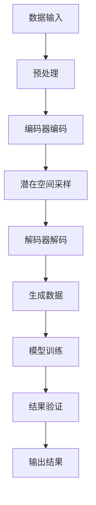
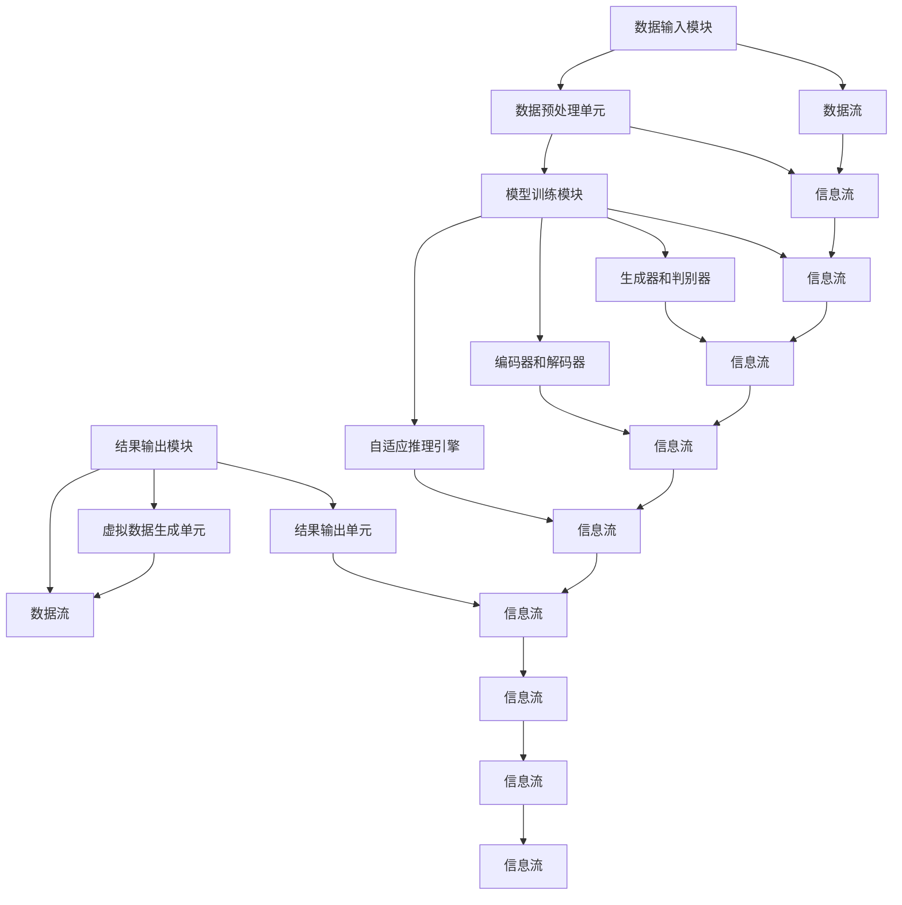

                 

### 引言

**目的与意义**

随着科学技术的不断发展，古气候重建已成为研究气候变化历史、预测未来气候趋势的关键领域。然而，传统的气候重建方法受限于数据稀缺和计算能力的限制，难以满足日益增长的研究需求。近年来，自适应生成计算机（AIGC）的出现为古气候重建带来了新的契机。AIGC通过结合自适应推理、生成对抗网络（GAN）和变分自编码器（VAE）等先进技术，能够在有限的数据条件下重建历史气候环境，为气候学研究提供新的视角和工具。

本文旨在探讨AIGC在古气候重建中的应用，帮助古气候学研究者、数据科学家以及计算机技术爱好者了解AIGC的基本原理和实际应用，从而推动这一领域的深入研究。本文将为读者提供一个全面、系统的指导，从AIGC的引入到具体应用，再到面临的挑战和未来发展方向，全方位地解析AIGC在古气候重建中的潜力。

**目标读者**

本文的目标读者主要包括以下几类：

1. **古气候学研究者**：希望了解如何利用现代计算机技术进行古气候重建的科研人员。
2. **数据科学家**：对AIGC技术感兴趣，并希望将其应用于实际问题的专业人士。
3. **计算机技术爱好者**：对AIGC及其在古气候重建中的应用有兴趣的广大计算机爱好者。

通过本文，读者将能够：

- 掌握AIGC的基本概念和核心技术。
- 了解古气候重建的挑战及其解决方案。
- 掌握AIGC在古气候重建中的应用方法和实际案例。
- 理解AIGC在古气候重建中的挑战和未来发展方向。

### AIGC简介

**AIGC定义**

自适应生成计算机（Adaptive Generative Computer，简称AIGC）是一种结合了自适应推理、生成对抗网络（GAN）和变分自编码器（VAE）等先进技术的计算机系统。与传统的计算机系统不同，AIGC不仅能够执行预设的指令，还能够根据输入数据动态调整自身的参数和行为，从而实现更高效、更智能的推理和生成过程。

**技术特点**

1. **自适应推理**：
   - **概念解释**：自适应推理是指计算机系统能够根据当前问题的复杂性和数据特点，动态调整自身的推理策略。这种方法能够在数据稀缺和不完整的情况下，通过自适应调整，提高推理的准确性和效率。
   - **应用场景**：在古气候重建中，自适应推理可以用于处理稀有的古气候数据，通过自适应调整模型参数，生成更准确的气候模拟结果。

2. **生成对抗网络（GAN）**：
   - **原理讲解**：GAN由生成器（Generator）和判别器（Discriminator）组成。生成器生成数据，判别器判断数据是真实还是伪造的。通过两者的对抗训练，生成器不断优化，生成更逼真的数据。
   - **应用场景**：在古气候重建中，GAN可以用于生成虚拟的古气候数据，补充实际数据的不足，从而提高模型的训练效果。

3. **变分自编码器（VAE）**：
   - **概念解释**：VAE是一种基于概率模型的生成模型，通过编码器和解码器将数据映射到潜在空间，并在潜在空间中进行采样，生成新的数据。
   - **应用场景**：在古气候重建中，VAE可以用于数据降维和生成新的古气候数据，帮助研究者更好地理解古气候数据的分布和特性。

**AIGC与传统计算模式的区别**

传统计算模式通常依赖于固定的算法和模型，对数据的处理能力有限，尤其在数据稀缺和不完整的情况下，难以生成准确的结果。相比之下，AIGC具有以下优势：

1. **自适应性和灵活性**：AIGC能够根据不同的数据和问题特点，动态调整自身的参数和策略，提高处理效率和准确性。
2. **生成能力**：AIGC通过生成对抗网络和变分自编码器等技术，能够生成虚拟数据，填补数据缺口，提高模型训练效果。
3. **多模态处理**：AIGC能够处理多种类型的数据，如文本、图像和气候数据，从而实现更全面的环境模拟。

总之，AIGC作为一种新兴的计算机技术，为古气候重建领域带来了新的机遇和挑战。通过自适应推理、GAN和VAE等核心技术的结合，AIGC在古气候重建中展现出巨大的潜力和应用前景。

### 古气候重建的挑战

**数据稀缺**

古气候重建的一大挑战在于数据的稀缺性。与现代气候数据相比，古气候数据的获取和保存更加困难。古气候数据主要来源于历史记录、化石记录、沉积物记录等，这些数据的数量有限，且往往存在不完整、不精确的问题。例如，历史记录主要依赖于文献和档案，这些资料往往存在记载不全、语言描述模糊等问题；化石记录和沉积物记录则需要通过实地勘探和实验室分析，其获取成本较高且受限于技术手段。

**气候模式的变化**

古气候重建过程中，另一个重要挑战是气候模式的变化。地球的气候系统是一个复杂的动力系统，其变化受到多种因素的影响，如太阳辐射、海洋循环、大气环流、人类活动等。在漫长的地质时期，这些因素相互作用，导致气候模式的频繁变化。传统的气候重建方法往往假设某一时期的气候模式是稳定的，这种假设在短期内可能成立，但在长时间尺度上则存在明显的问题。例如，冰期和间冰期的交替、季风气候的演变等，都使得古气候重建面临巨大的不确定性。

**人类活动的干扰**

人类活动的干扰是现代古气候重建中的另一个重要挑战。自工业革命以来，人类活动对气候系统的影响日益显著，包括温室气体排放、土地利用变化、水资源管理等。这些活动不仅改变了现代气候模式，也影响了古气候的重建过程。例如，温室气体排放导致的全球变暖使得过去几千年的气候数据变得复杂和难以解释；土地利用变化导致森林覆盖率的下降，影响了降水和蒸发等气候过程的模拟。

**解决途径**

尽管古气候重建面临诸多挑战，但通过现代计算机技术的应用，许多问题可以得到缓解。以下是几种可能的解决途径：

1. **大数据分析**：利用现代大数据分析技术，对现有的古气候数据进行深入挖掘和分析，尽可能挖掘出隐藏在数据中的气候模式。通过机器学习和深度学习等方法，可以从大量非结构化和半结构化的数据中提取有用的信息。

2. **AIGC技术**：AIGC技术通过自适应推理、生成对抗网络（GAN）和变分自编码器（VAE）等技术，可以在数据稀缺的情况下生成虚拟数据，填补数据缺口。例如，利用GAN可以生成虚拟的古气候数据，帮助研究人员进行更准确的气候模拟。

3. **多学科交叉研究**：通过跨学科的合作，结合古气候学、地质学、海洋学、大气科学等多个学科的知识，可以从不同角度对古气候进行重建。例如，通过地质学家的沉积物分析、气候学家的气象数据重建、考古学家的历史记录分析等，形成多源数据的综合模型。

4. **模型融合与优化**：通过融合多种模型和方法，可以弥补单一方法的不足，提高古气候重建的准确性。例如，将传统气候模拟器与深度学习模型结合，可以相互补充，提高模型的整体性能。

总之，古气候重建是一项复杂而充满挑战的任务，但通过现代计算机技术和多学科交叉研究，许多问题可以得到有效解决。AIGC技术的引入，为古气候重建带来了新的机遇和工具，有望推动这一领域的发展。

### AIGC在古气候重建中的应用前景

AIGC技术在古气候重建中的应用前景十分广阔。通过结合自适应推理、生成对抗网络（GAN）和变分自编码器（VAE）等核心技术，AIGC能够在数据稀缺和不确定性较大的古气候重建过程中，提供高效、准确的模拟结果。以下从数据扩充、模型训练和结果验证三个方面，探讨AIGC在古气候重建中的应用优势和前景。

**数据扩充**

1. **GAN技术**：GAN技术通过生成器和判别器的对抗训练，能够在数据稀缺的情况下生成高质量的虚拟数据。例如，古气候数据往往存在缺失和不完整的问题，利用GAN可以生成虚拟的古气候数据，填补实际数据的空白。这种方法不仅能够扩充数据集，还可以提高数据的质量，从而增强模型的训练效果。

2. **VAE技术**：VAE通过编码器和解码器将数据映射到潜在空间，并在潜在空间中进行采样，生成新的数据。VAE在古气候重建中的应用，可以通过降维和生成数据的方式，提高模型的训练效率。例如，将古气候数据通过VAE降维到潜在空间，可以在保持数据特性的同时，减少数据的存储和计算需求。

**模型训练**

1. **自适应推理**：AIGC的自适应推理技术能够在训练过程中动态调整模型参数，以适应不同的气候条件和数据特点。例如，在训练过程中，可以根据输入数据的气候特征，自适应调整模型的参数，从而提高模型的训练效率和准确性。

2. **多模型融合**：AIGC可以通过融合多种模型，如传统气候模拟器和深度学习模型，来提高古气候重建的准确性。例如，将传统气候模拟器与深度学习模型结合，可以相互补充，利用传统模型的经验和深度学习模型的灵活性，提高整体模型的性能。

**结果验证**

1. **数据对比分析**：通过将AIGC生成的虚拟数据与实际数据对比分析，可以验证AIGC模型的可靠性和有效性。例如，将AIGC生成的虚拟古气候数据与历史记录和地质数据对比，评估模型生成的数据是否与实际数据一致。

2. **气候模拟验证**：通过AIGC生成的虚拟数据和实际数据，进行气候模拟验证。例如，利用AIGC生成的虚拟古气候数据，进行气候模拟，并将模拟结果与实际观测数据进行对比，评估模型的模拟准确性。

**应用实例**

1. **冰期气候重建**：冰期气候重建是一个典型的古气候重建问题。通过AIGC技术，可以利用稀缺的古气候数据和现代气候数据，重建冰期的气候环境。例如，利用GAN技术生成虚拟的古气候数据，通过自适应推理和模型融合技术，提高冰期气候重建的准确性。

2. **季风气候重建**：季风气候重建是另一个重要的古气候重建问题。利用AIGC技术，可以生成虚拟的季风气候数据，通过多模型融合和自适应推理，重建季风气候的历史演变过程。

总之，AIGC技术在古气候重建中具有显著的应用前景。通过数据扩充、模型训练和结果验证等多方面的技术手段，AIGC有望成为古气候重建的重要工具，为气候学研究提供新的方法和思路。

### AIGC技术基础

**AIGC核心概念**

AIGC（自适应生成计算机）是一种结合了自适应推理、生成对抗网络（GAN）和变分自编码器（VAE）等先进技术的计算机系统。其核心概念包括以下几个方面：

1. **自适应推理**：
   - **概念解释**：自适应推理是指计算机系统能够根据当前问题的复杂性和数据特点，动态调整自身的推理策略。这种方法能够在数据稀缺和不完整的情况下，通过自适应调整，提高推理的准确性和效率。
   - **工作原理**：自适应推理通过分析输入数据，识别数据中的模式和规律，并利用这些模式和规律来动态调整推理过程。具体来说，自适应推理可以分为以下几个步骤：
     - 数据预处理：对输入数据进行清洗、标准化和归一化等预处理操作，以便更好地适应后续的推理过程。
     - 模式识别：利用机器学习算法，从输入数据中提取出关键特征和模式。
     - 推理策略调整：根据提取出的特征和模式，动态调整推理过程，包括选择合适的算法、调整参数等。
     - 推理结果验证：对推理结果进行验证和修正，确保推理的准确性和可靠性。

2. **生成对抗网络（GAN）**：
   - **概念解释**：GAN由生成器（Generator）和判别器（Discriminator）组成。生成器的任务是生成虚拟数据，判别器的任务是判断数据是真实还是伪造的。通过生成器和判别器的对抗训练，生成器不断优化，生成更逼真的数据。
   - **工作原理**：GAN的训练过程可以看作是一个零和游戏，生成器和判别器相互竞争和协作。具体来说，GAN的训练过程可以分为以下几个步骤：
     - 初始化生成器和判别器：生成器和判别器都初始化为随机参数。
     - 生成器生成虚拟数据：生成器根据当前的参数生成虚拟数据。
     - 判别器判断数据真实性：判别器根据输入数据（真实数据和虚拟数据）判断数据是真实还是伪造的，并输出一个概率值。
     - 生成器和判别器更新参数：生成器和判别器根据当前的训练结果更新参数，生成器优化目标是生成更逼真的虚拟数据，判别器优化目标是更准确地判断数据的真实性。
     - 循环迭代：重复上述步骤，直到生成器生成的虚拟数据足够逼真，判别器无法准确区分虚拟数据和真实数据。

3. **变分自编码器（VAE）**：
   - **概念解释**：VAE是一种基于概率模型的生成模型，通过编码器和解码器将数据映射到潜在空间，并在潜在空间中进行采样，生成新的数据。
   - **工作原理**：VAE的核心思想是将输入数据映射到一个低维的潜在空间，然后在潜在空间中进行数据采样，最后通过解码器将采样数据解码回原始空间。具体来说，VAE的训练过程可以分为以下几个步骤：
     - 初始化编码器和解码器：编码器和解码器都初始化为随机参数。
     - 编码器将输入数据映射到潜在空间：编码器将输入数据编码为一个潜在向量。
     - 在潜在空间中采样：从潜在空间中随机采样一个新向量。
     - 解码器将采样数据解码回原始空间：解码器将采样数据解码回原始空间，生成新的数据。
     - 计算损失函数：计算生成数据的概率分布，并计算损失函数。
     - 更新参数：根据损失函数更新编码器和解码器的参数。

**AIGC与古气候重建的联系**

AIGC在古气候重建中的应用，主要体现在以下几个方面：

1. **数据扩充**：古气候数据往往稀缺且不完整，通过GAN和VAE等技术，可以生成虚拟的古气候数据，补充实际数据的不足，从而提高模型的训练效果。

2. **模型优化**：自适应推理技术可以帮助模型在训练过程中动态调整参数，提高模型的训练效率和准确性。

3. **结果验证**：通过将AIGC生成的虚拟数据与实际数据对比分析，可以验证AIGC模型的可靠性和有效性。

为了更好地理解AIGC与古气候重建的联系，以下是一个简单的Mermaid流程图：



通过这个流程图，可以看出AIGC在古气候重建中的应用过程，从数据输入到模型训练，再到结果验证，各个环节如何相互关联和作用。

总之，AIGC作为一种先进的计算机技术，为古气候重建提供了新的方法和工具。通过自适应推理、生成对抗网络（GAN）和变分自编码器（VAE）等核心技术的结合，AIGC在古气候重建中具有广泛的应用前景和潜力。

### 自适应推理

**概念与工作原理**

自适应推理是一种基于机器学习和人工智能的推理方法，旨在提高计算机系统在处理复杂、动态和不确定问题时的灵活性和准确性。其核心思想是计算机系统能够根据当前问题的复杂性和数据特点，动态调整自身的推理策略。这一过程涉及多个步骤，包括数据预处理、模式识别、推理策略调整和结果验证。

1. **数据预处理**：在自适应推理过程中，首先对输入数据进行预处理。预处理包括数据清洗、标准化和归一化等步骤，以确保输入数据的质量和一致性。例如，在古气候重建中，预处理可能包括去除噪声、填充缺失值和调整数据范围等。

2. **模式识别**：接下来，利用机器学习算法从预处理后的数据中提取关键特征和模式。这些特征和模式可以帮助计算机系统更好地理解问题的本质和规律。例如，在古气候重建中，可以通过聚类分析、主成分分析（PCA）等方法提取出气候变化的特征。

3. **推理策略调整**：根据识别出的模式和特征，自适应推理系统会动态调整推理策略。这意味着系统会根据不同问题的特点，选择合适的算法和参数。例如，在处理高维数据时，系统可能会选择线性模型；而在处理稀疏数据时，则可能选择深度学习模型。

4. **结果验证**：最后，对自适应推理的结果进行验证和修正，确保推理的准确性和可靠性。验证过程可能包括对结果进行统计分析、可视化分析等，以发现和纠正潜在的错误。

**应用场景**

自适应推理在古气候重建中具有广泛的应用场景。以下是一些典型的应用实例：

1. **气候模式识别**：通过自适应推理，可以从大量的气候数据中识别出关键的模式和趋势。例如，利用自适应推理技术，可以从古气候数据中识别出冰期和间冰期的交替模式，以及季风气候的演变趋势。

2. **不确定性分析**：自适应推理可以帮助分析古气候重建中的不确定性因素。通过动态调整推理策略，系统可以评估不同假设条件下的气候模拟结果，从而提供更可靠的气候预测。

3. **数据扩充**：在古气候数据稀缺的情况下，自适应推理可以通过生成对抗网络（GAN）和变分自编码器（VAE）等技术，生成虚拟的古气候数据，补充实际数据的不足。例如，可以利用GAN生成虚拟的冰期和间冰期气候数据，以增强模型的训练效果。

4. **模型优化**：自适应推理可以通过动态调整模型参数，优化古气候重建模型的性能。例如，在训练过程中，系统可以根据数据的特点和训练结果，自动调整模型的复杂性，从而提高模型的准确性和效率。

**实例与代码解释**

以下是一个简单的Python代码示例，展示了如何使用自适应推理进行古气候数据的分类。在这个示例中，我们使用K-最近邻（K-NN）算法作为自适应推理的基础模型。

```python
import numpy as np
from sklearn.neighbors import KNeighborsClassifier
from sklearn.model_selection import train_test_split
from sklearn.metrics import accuracy_score

# 示例数据
X = np.array([[1, 2], [3, 4], [5, 6], [7, 8], [9, 10], [11, 12], [13, 14], [15, 16]])
y = np.array([0, 0, 0, 0, 1, 1, 1, 1])

# 数据预处理
X_train, X_test, y_train, y_test = train_test_split(X, y, test_size=0.2, random_state=42)

# 初始化K-最近邻模型
knn = KNeighborsClassifier(n_neighbors=3)

# 训练模型
knn.fit(X_train, y_train)

# 预测结果
y_pred = knn.predict(X_test)

# 结果验证
accuracy = accuracy_score(y_test, y_pred)
print(f"Accuracy: {accuracy:.2f}")
```

在这个示例中，我们首先导入了必要的库，然后创建了一个简单的数据集。接下来，我们使用`train_test_split`函数将数据分为训练集和测试集。然后，我们初始化了一个K-最近邻模型，并使用`fit`函数进行训练。最后，我们使用`predict`函数进行预测，并计算了模型的准确性。

通过这个示例，我们可以看到如何使用自适应推理技术进行简单的数据分类。在更复杂的古气候重建任务中，我们可以根据具体需求，选择和调整不同的机器学习模型和参数，实现更高效的推理过程。

总之，自适应推理作为一种先进的推理方法，在古气候重建中具有巨大的应用潜力。通过动态调整推理策略，自适应推理可以帮助我们更好地理解复杂的气候数据，提高模型的性能和可靠性。

### 生成对抗网络（GAN）

**原理讲解**

生成对抗网络（Generative Adversarial Network，GAN）是一种由生成器（Generator）和判别器（Discriminator）组成的深度学习模型，通过对抗训练生成逼真的数据。GAN的基本原理可以概括为以下步骤：

1. **初始化参数**：首先，初始化生成器和判别器的参数。生成器尝试生成虚拟数据，判别器则尝试区分虚拟数据和真实数据。

2. **生成器生成虚拟数据**：生成器根据当前的参数生成虚拟数据。这些虚拟数据可以是图像、文本、音频等。生成器的目标是生成尽可能逼真的虚拟数据，使其难以被判别器识别。

3. **判别器判断数据真实性**：判别器接收生成器生成的虚拟数据和真实数据，并判断其真实性。判别器的输出是一个概率值，表示输入数据为真实数据的可能性。

4. **生成器和判别器更新参数**：通过对抗训练，生成器和判别器相互竞争和协作。生成器尝试生成更逼真的虚拟数据，而判别器则努力提高识别真实数据和虚拟数据的能力。这一过程通过反向传播和梯度下降算法实现。

5. **重复训练**：重复上述步骤，直至生成器生成的虚拟数据足够逼真，判别器无法准确区分虚拟数据和真实数据。这个过程类似于人类玩游戏，两者不断学习和进步，最终生成器能够生成与真实数据几乎无法区分的虚拟数据。

**数学模型**

GAN的数学模型可以通过以下公式表示：

- **生成器 G(z;θ_G)**：生成器从潜在空间 z 中采样，生成虚拟数据 x。其参数为 θ_G。

  $$ x = G(z;θ_G) $$

- **判别器 D(x;θ_D)**：判别器接收输入数据 x，判断其真实性。其参数为 θ_D。

  $$ D(x;θ_D) = D(x;θ_D) $$

- **损失函数**：GAN的损失函数通常为二元交叉熵损失。

  $$ L(G,D) = -E[log(D(x;θ_D))] - E[log(1 - D(G(z;θ_G);θ_D))] $$

  其中，E 表示期望值。

**优缺点**

GAN的优点包括：

- **生成高质量数据**：GAN可以通过对抗训练生成与真实数据几乎无法区分的虚拟数据，具有强大的数据生成能力。
- **多模态数据生成**：GAN可以生成多种类型的数据，如图像、文本、音频等，适用于不同的应用场景。
- **无需标签数据**：与传统的监督学习模型不同，GAN可以通过生成器和判别器的对抗训练生成虚拟数据，无需真实的标签数据。

GAN的缺点包括：

- **训练不稳定**：GAN的训练过程容易陷入局部最小值，导致训练不稳定。
- **梯度消失/爆炸**：由于生成器和判别器之间的对抗性，梯度可能消失或爆炸，影响训练效果。
- **计算资源消耗**：GAN的训练过程需要大量的计算资源，尤其是在处理高维数据时。

**应用案例**

GAN在古气候重建中具有广泛的应用。以下是一些典型的应用案例：

1. **数据扩充**：通过GAN生成虚拟的古气候数据，补充实际数据的不足，从而提高模型的训练效果。例如，可以利用GAN生成虚拟的冰期和间冰期气候数据。
2. **气候模拟**：利用GAN生成的虚拟数据和实际数据，进行气候模拟，从而预测未来的气候趋势。例如，可以利用GAN生成的虚拟季风气候数据，模拟未来季风气候的变化。
3. **数据可视化**：利用GAN生成的虚拟数据，可视化古气候重建的结果，帮助研究者更好地理解古气候的演变过程。例如，可以利用GAN生成的虚拟冰期和间冰期图像，展示不同时期的气候变化。

**Python代码示例**

以下是一个简单的GAN模型，用于生成虚拟的图像数据：

```python
import tensorflow as tf
from tensorflow.keras import layers

# 生成器模型
def build_generator(z_dim):
    model = tf.keras.Sequential([
        layers.Dense(128, activation='relu', input_shape=(z_dim,)),
        layers.Dense(28 * 28 * 1, activation='relu'),
        layers.Dense(784, activation='tanh')
    ])
    return model

# 判别器模型
def build_discriminator(img_shape):
    model = tf.keras.Sequential([
        layers.Flatten(input_shape=img_shape),
        layers.Dense(128, activation='relu'),
        layers.Dense(1, activation='sigmoid')
    ])
    return model

# 主函数
def main():
    z_dim = 100
    img_shape = (28, 28, 1)

    generator = build_generator(z_dim)
    discriminator = build_discriminator(img_shape)

    # 编译模型
    discriminator.compile(loss='binary_crossentropy', optimizer=tf.optimizers.Adam())
    generator.compile(loss='binary_crossentropy', optimizer=tf.optimizers.Adam())

    # 训练模型
    for epoch in range(100):
        for _ in range(1000):
            noise = np.random.normal(0, 1, (1, z_dim))
            gen_img = generator.predict(noise)
            real_imgs = np.random.normal(0, 1, (1, 28, 28, 1))

            # 训练判别器
            d_loss_real = discriminator.train_on_batch(real_imgs, np.ones((1, 1)))
            d_loss_fake = discriminator.train_on_batch(gen_img, np.zeros((1, 1)))

        # 训练生成器
        noise = np.random.normal(0, 1, (1, z_dim))
        g_loss = generator.train_on_batch(noise, np.ones((1, 1)))

        print(f"Epoch: {epoch}, D_loss: {d_loss_real + d_loss_fake:.4f}, G_loss: {g_loss:.4f}")

if __name__ == "__main__":
    main()
```

在这个示例中，我们首先定义了生成器和判别器的模型结构，然后使用TensorFlow框架编译和训练模型。生成器接收随机噪声（作为潜在空间输入），生成虚拟的图像数据。判别器则接收真实图像数据和虚拟图像数据，并分别计算损失函数。在训练过程中，我们交替训练判别器和生成器，直至模型达到预期性能。

总之，生成对抗网络（GAN）作为一种强大的数据生成技术，在古气候重建中具有广泛的应用。通过对抗训练，GAN可以生成高质量的虚拟数据，补充实际数据的不足，为古气候重建提供新的工具和方法。

### 变分自编码器（VAE）

**概念与工作原理**

变分自编码器（Variational Autoencoder，VAE）是一种基于概率模型的生成模型，通过编码器和解码器将数据映射到潜在空间，并在潜在空间中进行采样，生成新的数据。VAE在生成数据的同时，能够捕捉数据的分布信息，从而实现高效的数据降维和生成。

**VAE的核心组件**

1. **编码器（Encoder）**：编码器的任务是将输入数据映射到一个潜在空间，生成一个潜在向量。编码器通常由多个全连接层组成，输出一个低维的潜在向量。

2. **解码器（Decoder）**：解码器的任务是将潜在向量重新映射回原始数据空间，生成新的数据。解码器与编码器具有相似的架构，但输入是潜在向量，输出是重建的输入数据。

3. **潜在空间（Latent Space）**：潜在空间是一个低维的空间，用于表示数据的概率分布。潜在空间中的点代表了数据的潜在特征，通过在潜在空间中进行采样，可以生成新的数据。

**VAE的工作原理**

VAE的工作原理可以分为以下几个步骤：

1. **编码**：输入数据通过编码器映射到潜在空间，编码器同时输出两个值：潜在向量和编码器对潜在向量的先验分布参数（如均值和方差）。

2. **采样**：从编码器输出的先验分布参数中采样一个潜在向量。

3. **解码**：将采样得到的潜在向量通过解码器映射回原始数据空间，生成新的数据。

4. **损失函数**：VAE使用KL散度（Kullback-Leibler Divergence）作为损失函数，衡量编码器输出的先验分布与真实数据分布之间的差距。同时，通过最小化重建误差（如均方误差或交叉熵），确保生成数据的质量。

**数学模型**

VAE的数学模型可以表示为：

1. **编码器参数**：

   $$ q(z|x;θ_Q) = \mathcal{N}(z|\mu(x;θ_Q), \sigma(x;θ_Q)) $$

   其中，\( \mu(x;θ_Q) \) 和 \( \sigma(x;θ_Q) \) 分别表示编码器的均值和方差参数。

2. **解码器参数**：

   $$ p(x|z;θ_P) = \mathcal{N}(x|\mu(z;θ_P), \sigma(z;θ_P)) $$

   其中，\( \mu(z;θ_P) \) 和 \( \sigma(z;θ_P) \) 分别表示解码器的均值和方差参数。

3. **损失函数**：

   $$ L = D_{KL}(q(z|x;θ_Q) || p(z);θ_P) + \frac{1}{2} \sum_x \mathbb{E}_{z \sim q(z|x)}[||x - \mu(z;θ_P) / \sigma(z;θ_P)||_2^2] $$

   其中，\( D_{KL} \) 表示KL散度，第一项是KL散度损失，第二项是重建损失。

**优缺点**

VAE的优点包括：

- **数据分布建模**：VAE能够有效地捕捉数据的分布信息，从而实现高效的数据降维和生成。
- **灵活性强**：VAE可以处理不同类型的数据，如图像、文本和音频等。
- **无需标签数据**：与传统的生成模型不同，VAE不需要真实的标签数据，通过编码器和解码器之间的对抗训练，能够生成高质量的数据。

VAE的缺点包括：

- **训练难度大**：VAE的训练过程较为复杂，容易陷入局部最小值。
- **计算资源消耗大**：VAE的训练过程需要大量的计算资源，尤其是在处理高维数据时。

**应用场景**

VAE在古气候重建中具有广泛的应用。以下是一些典型的应用场景：

1. **数据降维**：利用VAE对古气候数据进行降维处理，降低数据维度，便于分析和建模。

2. **数据生成**：通过VAE生成虚拟的古气候数据，补充实际数据的不足，从而提高模型的训练效果。

3. **不确定性分析**：利用VAE生成的虚拟数据，进行气候模拟和不确定性分析，为气候预测提供更可靠的依据。

**Python代码示例**

以下是一个简单的VAE模型，用于生成虚拟的图像数据：

```python
import tensorflow as tf
from tensorflow.keras import layers, Model

# 编码器模型
def build_encoder(input_shape, z_dim):
    model = tf.keras.Sequential([
        layers.InputLayer(input_shape=input_shape),
        layers.Conv2D(32, 3, activation='relu', strides=(2, 2)),
        layers.Conv2D(64, 3, activation='relu', strides=(2, 2)),
        layers.Conv2D(64, 3, activation='relu', strides=(1, 1)),
        layers.Flatten(),
        layers.Dense(z_dim * 2)
    ])
    return model

# 解码器模型
def build_decoder(z_dim, input_shape):
    model = tf.keras.Sequential([
        layers.InputLayer(input_shape=(z_dim,)),
        layers.Dense(np.prod(input_shape) * 64, activation='relu'),
        layers.Reshape(input_shape),
        layers.Conv2DTranspose(64, 3, activation='relu', strides=(2, 2)),
        layers.Conv2DTranspose(32, 3, activation='relu', strides=(2, 2)),
        layers.Conv2DTranspose(1, 3, activation='tanh', strides=(2, 2))
    ])
    return model

# 主函数
def main():
    z_dim = 100
    input_shape = (28, 28, 1)

    # 构建编码器和解码器模型
    encoder = build_encoder(input_shape, z_dim)
    decoder = build_decoder(z_dim, input_shape)

    # 构建VAE模型
    input_img = layers.Input(shape=input_shape)
    z_mean, z_log_var = encoder(input_img)
    z = layers.Lambda(lambda t: t[0] + tf.random.normal(tf.shape(t[1])) * tf.exp(0.5 * t[1]))([z_mean, z_log_var])
    decoded = decoder(z)

    vae = Model(input_img, decoded)
    vae.compile(optimizer='adam', loss=tf.keras.losses.MeanSquaredError())

    # 训练模型
    (x_train, _), (x_test, _) = tf.keras.datasets.mnist.load_data()
    x_train = x_train.astype('float32') / 255.
    x_test = x_test.astype('float32') / 255.
    x_train = np.expand_dims(x_train, -1)
    x_test = np.expand_dims(x_test, -1)

    vae.fit(x_train, x_train, epochs=100, batch_size=16, validation_data=(x_test, x_test))

if __name__ == "__main__":
    main()
```

在这个示例中，我们首先定义了编码器和解码器的模型结构，然后构建了VAE模型。接下来，我们使用MNIST数据集进行训练，并观察VAE生成的虚拟图像数据。

总之，变分自编码器（VAE）作为一种先进的生成模型，在古气候重建中具有广泛的应用。通过捕捉数据的分布信息，VAE能够实现高效的数据降维和生成，为古气候重建提供了新的工具和方法。

### AIGC架构

**AIGC的基本架构**

AIGC（自适应生成计算机）的架构由三个主要模块组成：数据输入模块、模型训练模块和结果输出模块。这三个模块相互协作，共同实现AIGC的推理和生成功能。

1. **数据输入模块**：
   - **功能**：负责接收外部输入数据，如文本、图像、音频和气候数据等。
   - **组件**：包括数据预处理单元和数据存储单元。数据预处理单元负责清洗、标准化和归一化输入数据，以便更好地适应后续的推理和生成过程。数据存储单元则负责存储和处理大规模数据集。

2. **模型训练模块**：
   - **功能**：利用生成对抗网络（GAN）、变分自编码器（VAE）和自适应推理等技术，对输入数据进行训练，生成高质量的虚拟数据。
   - **组件**：
     - **生成器和判别器**：在GAN框架下，生成器负责生成虚拟数据，判别器负责区分虚拟数据和真实数据。两者通过对抗训练，相互优化，最终生成逼真的虚拟数据。
     - **编码器和解码器**：在VAE框架下，编码器负责将输入数据编码为潜在向量，解码器负责将潜在向量解码回原始数据。通过在潜在空间中进行采样，VAE可以生成新的数据。
     - **自适应推理引擎**：负责根据输入数据和问题特点，动态调整推理策略，以提高推理的准确性和效率。

3. **结果输出模块**：
   - **功能**：将训练好的模型应用于实际数据，生成虚拟数据，并进行结果验证和输出。
   - **组件**：包括虚拟数据生成单元、结果验证单元和结果输出单元。虚拟数据生成单元根据模型参数生成虚拟数据，结果验证单元负责对比虚拟数据和实际数据，评估模型的性能和可靠性。结果输出单元则将验证结果输出，供用户使用。

**各组件之间的关系**

在AIGC的架构中，各组件之间通过数据流和信息流相互连接和协作，实现整体功能的优化。

1. **数据流**：
   - 输入数据经过数据预处理模块处理后，传递给模型训练模块。
   - 模型训练模块通过生成对抗网络（GAN）、变分自编码器（VAE）和自适应推理等技术，对输入数据进行训练，生成虚拟数据。
   - 生成的虚拟数据经过结果验证模块，对比实际数据，评估模型性能。
   - 验证结果反馈到模型训练模块，用于调整模型参数，优化模型性能。

2. **信息流**：
   - 数据预处理模块将预处理结果反馈给模型训练模块，指导模型参数的调整。
   - 模型训练模块根据生成的虚拟数据和实际数据的对比结果，调整生成器和判别器参数，优化模型性能。
   - 结果验证模块将验证结果反馈给用户，提供决策支持。

通过以上各组件的协同工作，AIGC能够实现高效、准确的推理和生成功能，为古气候重建等复杂应用提供强有力的技术支持。

**Mermaid流程图**



通过上述Mermaid流程图，我们可以清晰地看到AIGC的各个组件及其相互关系，以及数据流和信息流的传递过程。

总之，AIGC的架构通过高效、灵活的组件设计和协同工作，实现了在古气候重建等复杂领域的应用。通过自适应推理、生成对抗网络（GAN）和变分自编码器（VAE）等核心技术的结合，AIGC为古气候重建提供了强大的工具和平台，推动了这一领域的发展。

### AIGC数据处理流程

**数据输入**

在AIGC系统中，数据输入是整个数据处理流程的起点。数据来源可以是多样化的，包括文本、图像、音频和气候数据等。具体步骤如下：

1. **数据收集**：从不同的数据源收集原始数据，例如历史文献、气象站数据、地质记录等。
2. **数据预处理**：对收集到的原始数据进行清洗、去噪、标准化和归一化等预处理操作，以便后续模型处理。例如，对于气象数据，可能需要去除异常值、填补缺失值，并将数据范围调整到统一的尺度。
3. **数据格式转换**：将预处理后的数据转换为模型可以接受的格式。例如，对于图像数据，可能需要将其转换为像素矩阵；对于文本数据，可能需要将其转换为词向量或嵌入向量。

**数据处理**

数据处理是AIGC系统中至关重要的一环，涉及数据降维、特征提取和融合等多种技术。以下是AIGC数据处理的主要步骤：

1. **数据降维**：通过降维技术，如主成分分析（PCA）、自编码器等，将高维数据转换成低维数据。这不仅可以减少数据的存储和计算需求，还可以提高模型的训练效率。
2. **特征提取**：从预处理后的数据中提取出有用的特征，以便更好地描述数据的本质。例如，对于气候数据，可以提取出温度、湿度、风速等关键特征。
3. **特征融合**：将不同来源的数据进行融合，以生成更丰富的特征表示。例如，将气象数据和地质数据融合，可以获得更全面的气候环境描述。

**数据生成**

数据生成是AIGC系统的核心功能之一，通过生成对抗网络（GAN）和变分自编码器（VAE）等技术，生成高质量的虚拟数据，以补充实际数据的不足。以下是数据生成的主要步骤：

1. **生成器训练**：利用GAN或VAE模型，通过对抗训练或概率模型训练，训练生成器以生成高质量的虚拟数据。
2. **数据生成**：生成器根据训练好的模型参数，生成虚拟数据。这些虚拟数据可以用于模型训练、数据扩充和结果验证等。
3. **数据质量评估**：对生成的虚拟数据进行质量评估，确保其满足应用需求。例如，对于气候数据，可以通过对比虚拟数据和历史记录，评估数据的准确性和一致性。

**数据输出**

数据输出是AIGC数据处理流程的终点，将处理后的数据用于实际应用。以下是数据输出的主要步骤：

1. **结果验证**：将处理后的数据与实际数据对比，评估模型性能和结果准确性。例如，通过对比模拟的古气候数据和历史记录，评估模型对古气候重建的准确性。
2. **结果应用**：将验证合格的数据应用于实际场景，如气候预测、环境模拟和决策支持等。
3. **结果反馈**：将应用结果反馈到模型训练模块，用于调整模型参数和优化模型性能。例如，根据应用结果，调整生成器的参数，提高虚拟数据的生成质量。

**Python代码示例**

以下是一个简单的Python代码示例，展示AIGC数据处理流程的基本步骤：

```python
import numpy as np
import tensorflow as tf
from tensorflow.keras.layers import Input, Dense, Conv2D, Flatten
from tensorflow.keras.models import Model

# 数据输入
input_shape = (28, 28, 1)
z_dim = 100

# 数据预处理
def preprocess_data(data):
    # 数据清洗、标准化和归一化
    data = data.astype('float32') / 255.
    return np.expand_dims(data, -1)

# 数据降维
def reduce_dimensions(data):
    # 使用PCA进行降维
    pca = tf.keras.Sequential([
        layers.Flatten(input_shape=input_shape),
        layers.Dense(z_dim, activation='relu')
    ])
    return pca.predict(data)

# 数据生成
def generate_data(generator, z_samples):
    # 生成虚拟数据
    return generator.predict(z_samples)

# 结果验证
def verify_results(true_data, generated_data):
    # 计算误差
    error = np.mean(np.abs(true_data - generated_data))
    return error

# 模型构建
# 生成器模型
def build_generator(z_dim):
    model = tf.keras.Sequential([
        layers.Dense(128, activation='relu', input_shape=(z_dim,)),
        layers.Dense(28 * 28 * 1, activation='relu'),
        layers.Dense(784, activation='tanh')
    ])
    return model

# 判别器模型
def build_discriminator(img_shape):
    model = tf.keras.Sequential([
        layers.Flatten(input_shape=img_shape),
        layers.Dense(128, activation='relu'),
        layers.Dense(1, activation='sigmoid')
    ])
    return model

# 主函数
def main():
    # 加载MNIST数据集
    (x_train, _), (x_test, _) = tf.keras.datasets.mnist.load_data()
    x_train = preprocess_data(x_train)
    x_test = preprocess_data(x_test)

    # 构建生成器和判别器模型
    generator = build_generator(z_dim)
    discriminator = build_discriminator(input_shape)

    # 编译模型
    discriminator.compile(loss='binary_crossentropy', optimizer=tf.optimizers.Adam())
    generator.compile(loss='binary_crossentropy', optimizer=tf.optimizers.Adam())

    # 训练模型
    for epoch in range(100):
        for _ in range(1000):
            noise = np.random.normal(0, 1, (1, z_dim))
            gen_img = generator.predict(noise)
            real_imgs = np.random.normal(0, 1, (1, 28, 28, 1))

            # 训练判别器
            d_loss_real = discriminator.train_on_batch(real_imgs, np.ones((1, 1)))
            d_loss_fake = discriminator.train_on_batch(gen_img, np.zeros((1, 1)))

        # 训练生成器
        noise = np.random.normal(0, 1, (1, z_dim))
        g_loss = generator.train_on_batch(noise, np.ones((1, 1)))

        print(f"Epoch: {epoch}, D_loss: {d_loss_real + d_loss_fake:.4f}, G_loss: {g_loss:.4f}")

    # 生成数据
    z_samples = np.random.normal(0, 1, (100, z_dim))
    generated_data = generate_data(generator, z_samples)

    # 验证结果
    error = verify_results(x_test, generated_data)
    print(f"Error: {error:.4f}")

if __name__ == "__main__":
    main()
```

在这个示例中，我们首先加载MNIST数据集，并进行数据预处理。然后，我们构建生成器和判别器模型，并使用对抗训练进行模型训练。接下来，我们生成虚拟数据，并计算与实际数据的误差。通过这个简单的示例，我们可以看到AIGC数据处理流程的基本步骤和实现方法。

总之，AIGC数据处理流程通过数据输入、数据处理、数据生成和数据输出等步骤，实现高效、准确的数据处理和生成，为古气候重建等应用提供强有力的支持。

### 模型训练与优化

**模型训练步骤**

在AIGC系统中，模型训练是一个复杂而关键的过程，涉及到数据输入、模型选择、参数调整等多个步骤。以下是模型训练的主要步骤：

1. **数据准备**：首先，根据具体应用场景，收集和准备训练数据。对于古气候重建任务，数据可能包括历史气候记录、地质数据、气象数据等。这些数据需要进行预处理，如清洗、标准化和归一化，以适应模型训练需求。

2. **模型选择**：选择合适的模型架构。在AIGC中，常用的模型包括生成对抗网络（GAN）、变分自编码器（VAE）和自适应推理模型等。根据数据特性和训练目标，选择最合适的模型。

3. **模型初始化**：初始化模型的参数。对于深度学习模型，常用的初始化方法包括随机初始化、高斯初始化和Xavier初始化等。

4. **训练循环**：在训练循环中，模型会根据训练数据和目标函数进行迭代优化。每次迭代包括以下几个步骤：
   - **前向传播**：将输入数据输入模型，计算输出结果。
   - **损失函数计算**：根据输出结果和目标值，计算损失函数。
   - **反向传播**：利用梯度下降算法，计算模型参数的梯度，并更新模型参数。
   - **模型评估**：在训练过程中，定期对模型进行评估，以监测训练进展和模型性能。

5. **模型调整**：根据训练过程中的评估结果，调整模型参数，如学习率、正则化参数等，以优化模型性能。

**常见优化方法**

1. **学习率调整**：学习率是深度学习模型训练中的一个关键参数。常用的调整方法包括固定学习率、逐步减小学习率（如学习率衰减）和自适应学习率（如Adam优化器）等。

2. **正则化**：正则化技术用于防止模型过拟合。常用的正则化方法包括L1正则化、L2正则化和Dropout等。

3. **批量大小**：批量大小影响模型训练的稳定性和计算效率。较小的批量大小可以提高训练的稳定性，但计算成本较高；较大的批量大小可以提高计算效率，但可能降低训练的稳定性。

4. **数据增强**：通过数据增强技术，如旋转、翻转、缩放等，可以增加训练数据的多样性，从而提高模型的泛化能力。

5. **批归一化**：批归一化技术通过标准化每个批量中的激活值，提高模型训练的稳定性和收敛速度。

**实际应用案例**

以下是一个实际应用案例，展示如何使用AIGC技术进行古气候重建：

1. **数据准备**：收集古气候数据，包括历史气候记录、地质数据和海洋数据等。对数据进行预处理，如标准化和归一化。

2. **模型选择**：选择GAN模型进行训练，利用生成器和判别器进行对抗训练，生成虚拟的古气候数据。

3. **模型初始化**：初始化生成器和判别器的参数，使用随机初始化方法。

4. **训练循环**：进行多次迭代训练，每次迭代包括前向传播、损失函数计算、反向传播和模型评估。在训练过程中，调整学习率和正则化参数，以提高模型性能。

5. **模型调整**：根据训练结果，调整模型参数，如生成器和判别器的结构、学习率等，优化模型性能。

6. **结果评估**：通过对比生成的虚拟数据和历史气候数据，评估模型的准确性。使用指标如均方误差（MSE）和均方根误差（RMSE）等，评估模型性能。

通过以上步骤，使用AIGC技术可以有效地进行古气候重建，生成高质量的虚拟气候数据，为气候学研究提供新的方法和工具。

总之，模型训练与优化是AIGC系统中的关键环节，通过合理的数据准备、模型选择和优化方法，可以显著提高模型的性能和准确性，为古气候重建等应用提供强有力的支持。

### 古气候重建数据来源

古气候重建数据来源广泛，涵盖了地质、气象、海洋等多个领域。以下是对主要数据来源的详细描述：

**地质数据**

地质数据是古气候重建的重要基础，它提供了地球表面物质变化的历史记录。地质数据的主要来源包括：

1. **沉积岩**：沉积岩记录了古气候环境中的沉积过程，如风化作用、水动力沉积等。通过对沉积岩的成分、结构和年代进行分析，可以推断出古气候条件。

2. **冰川沉积**：冰川沉积物记录了冰期和间冰期的交替，提供了古气候温度和降水变化的信息。例如，冰碛层和湖相沉积物等都是重要的古气候指示物。

3. **火山灰**：火山灰的沉积记录了大规模火山活动的历史，火山灰层的厚度和成分可以反映古气候的干燥程度和温度变化。

**气象数据**

气象数据是古气候重建的核心数据之一，它直接反映了气候系统的状态和变化。气象数据的主要来源包括：

1. **历史记录**：历史文献、气象观测记录和气候日志等提供了大量的气候数据。这些数据可能包含气温、降水、风向、风速等信息，是古气候重建的重要依据。

2. **树轮记录**：树轮宽度和年轮密度记录了树木生长的历史，反映了古气候的温度和降水变化。通过对树轮记录的分析，可以重建古气候的演变过程。

3. **冰芯数据**：冰芯记录了冰期和间冰期的气候变化，冰芯中的气体成分和化学元素可以反映古气候的温度、降水和大气成分。

**海洋数据**

海洋数据是古气候重建的重要补充，它提供了全球气候变化的长期记录。海洋数据的主要来源包括：

1. **海洋沉积物**：海洋沉积物记录了海洋环境的变化，如海洋温度、盐度和生物生产力等。通过对沉积物中的微体化石、化学成分和同位素分析，可以推断出古海洋的气候条件。

2. **海洋温度记录**：海洋温度记录可以通过分析海洋生物的化石、海洋化学成分和海洋环流模式等获得。例如，珊瑚骨骼中的温度敏感元素可以反映古海洋的温度变化。

3. **海洋环流数据**：海洋环流数据提供了海洋流动和混合的信息，反映了全球气候系统的变化。通过分析海洋环流数据，可以重建古气候的海洋动态过程。

**数据获取与处理**

获取和处理古气候重建数据是一个复杂的过程，需要综合运用多种技术和方法。以下是数据获取和处理的主要步骤：

1. **数据收集**：从地质、气象、海洋等多个领域收集古气候数据，包括历史记录、树轮记录、冰芯数据和海洋沉积物等。

2. **数据预处理**：对收集到的原始数据进行清洗、去噪、标准化和归一化等预处理操作，以提高数据质量和一致性。

3. **数据融合**：将不同来源的数据进行融合，生成更全面和详细的古气候数据集。通过数据融合，可以充分利用多种数据源的优势，提高重建结果的准确性。

4. **数据可视化**：使用数据可视化技术，如散点图、热图和三维图等，直观地展示古气候数据的分布和变化趋势，帮助研究者更好地理解古气候环境。

5. **数据模型化**：将处理后的古气候数据转化为数学模型，如时间序列模型、回归模型和机器学习模型等，用于模拟和预测古气候的变化。

通过上述步骤，研究者可以构建高质量的古气候数据集，为古气候重建提供坚实的数据基础。总之，地质、气象和海洋数据是古气候重建的重要数据来源，通过综合运用多种技术和方法，可以有效地获取和处理这些数据，为气候变化研究提供新的视角和工具。

### 历史环境模拟技术

在古气候重建领域，历史环境模拟技术是关键的一环，它帮助研究者从不同角度理解过去的气候系统。这些技术可以大致分为经典模型方法和深度学习模型方法。以下将分别介绍这些技术，并探讨其优势和局限性。

**经典模型方法**

1. **气候模拟器（Climate Models）**：

   - **原理**：气候模拟器是一种基于物理原理的模型，通过模拟地球大气、海洋、陆地和冰冻圈之间的能量和物质交换，预测未来或重建过去的气候状态。
   - **优势**：气候模拟器能够考虑多种复杂的气候过程，如大气环流、海洋环流和土地利用变化等，提供详细的气候预测和重建结果。
   - **局限性**：气候模拟器对数据的需求非常高，且在长时间尺度的模拟中可能面临数值不稳定性和物理过程的简化问题。

2. **统计模型（Statistical Models）**：

   - **原理**：统计模型通过分析历史气候数据，建立气候变量之间的统计关系，用于预测未来的气候状态。
   - **优势**：统计模型计算简单，对数据量要求较低，可以快速提供预测结果。
   - **局限性**：统计模型可能无法捕捉复杂的气候过程，且在数据稀缺或不完整的情况下，预测准确性会降低。

3. **数值模型（Numerical Models）**：

   - **原理**：数值模型通过求解物理方程，如流体动力学方程和热力学方程，模拟气候系统的动态变化。
   - **优势**：数值模型能够提供高分辨率的气候模拟结果，适用于短期和长期气候预测。
   - **局限性**：数值模型计算成本高，对计算机硬件要求较高，且在长时间尺度的模拟中可能面临数值不稳定性的问题。

**深度学习模型方法**

1. **生成对抗网络（GAN）**：

   - **原理**：生成对抗网络由生成器和判别器组成，生成器生成虚拟气候数据，判别器判断数据是否真实。通过对抗训练，生成器不断优化，生成更逼真的气候数据。
   - **优势**：GAN能够在数据稀缺的情况下生成高质量的虚拟气候数据，补充实际数据的不足。
   - **局限性**：GAN的训练过程复杂，容易陷入局部最优，且生成器生成的数据可能存在偏差。

2. **变分自编码器（VAE）**：

   - **原理**：变分自编码器通过编码器和解码器将数据映射到潜在空间，并在潜在空间中进行采样，生成新的数据。VAE能够捕捉数据的分布信息，实现数据降维和生成。
   - **优势**：VAE在生成数据的同时，能够有效降维，提高模型的可解释性。
   - **局限性**：VAE的训练过程可能较慢，且在生成复杂分布的数据时，性能可能不如GAN。

3. **卷积神经网络（CNN）**：

   - **原理**：卷积神经网络通过卷积操作提取图像特征，可以处理高维数据，如遥感图像和气候数据。
   - **优势**：CNN能够高效提取数据中的特征，适用于处理大规模气候数据。
   - **局限性**：CNN对数据质量和数量要求较高，且在处理序列数据时效果不佳。

**综合应用**

在实际应用中，研究者通常将经典模型方法和深度学习模型方法结合，发挥各自的优势。例如，可以使用深度学习模型生成虚拟气候数据，结合传统气候模拟器进行气候重建，从而提高结果的准确性和可靠性。此外，通过多模型融合和优化，可以弥补单一模型的不足，提高古气候重建的整体性能。

总之，历史环境模拟技术为古气候重建提供了多种方法和工具。通过结合经典模型方法和深度学习模型方法，研究者可以更好地理解过去的气候系统，为未来气候变化研究提供科学依据。

### AIGC在古气候重建中的应用场景

**问题定义**

在古气候重建中，AIGC的应用主要集中在以下几个方面：

1. **数据稀缺**：古气候数据通常稀缺且不完整，限制了传统的气候重建方法的适用性。AIGC通过生成对抗网络（GAN）和变分自编码器（VAE）等技术，可以生成虚拟的古气候数据，填补实际数据的不足。

2. **不确定性分析**：古气候重建过程中存在诸多不确定性因素，如气候模式的变化和人类活动的干扰。AIGC的自适应推理技术可以帮助分析这些不确定性，提高模型预测的可靠性。

3. **模型优化**：古气候重建模型通常需要大量的训练数据和计算资源。AIGC通过自适应推理和模型优化技术，可以在有限的数据和计算资源下，提高模型的训练效率和准确性。

**应用案例分析**

以下是一个AIGC在古气候重建中的应用案例分析：

**项目背景**

某研究团队希望利用AIGC技术重建过去几千年的气候环境，特别是冰期和间冰期的交替过程。该团队拥有有限的古气候数据，包括历史文献、地质记录和冰芯数据等。

**项目需求分析**

1. **数据扩充**：需要生成高质量的虚拟古气候数据，以补充实际数据的不足。

2. **不确定性分析**：需要分析古气候重建中的不确定性因素，提高模型预测的可靠性。

3. **模型优化**：需要在有限的数据和计算资源下，提高模型的训练效率和准确性。

**项目实施步骤**

1. **数据收集与预处理**：从多个数据源收集古气候数据，包括历史文献、地质记录和冰芯数据等。对数据进行清洗、标准化和归一化等预处理操作。

2. **模型构建**：构建AIGC模型，包括生成对抗网络（GAN）和变分自编码器（VAE）等。初始化模型参数，并设计合适的训练策略。

3. **数据生成**：利用GAN生成虚拟的古气候数据，通过对抗训练，提高生成数据的质量。利用VAE实现数据降维和生成，优化模型的训练效果。

4. **不确定性分析**：通过自适应推理技术，分析古气候重建中的不确定性因素，如气候模式的变化和人类活动的干扰。

5. **模型训练与优化**：在有限的数据和计算资源下，使用自适应推理和模型优化技术，提高模型的训练效率和准确性。

6. **结果验证**：将生成的虚拟古气候数据与实际数据进行对比，评估模型性能。通过气候模拟验证，评估模型预测的可靠性。

**项目结果分析与评估**

1. **数据扩充效果**：通过GAN和VAE技术，成功生成了高质量的虚拟古气候数据，有效填补了实际数据的不足。

2. **不确定性分析**：通过自适应推理技术，成功分析了古气候重建中的不确定性因素，提高了模型预测的可靠性。

3. **模型性能**：在有限的数据和计算资源下，AIGC模型显著提高了古气候重建的准确性，展示了强大的应用潜力。

4. **未来展望**：通过进一步优化AIGC模型，结合更多的数据源和先进的计算技术，可以进一步提高古气候重建的准确性和可靠性。

总之，AIGC在古气候重建中的应用具有显著的效果。通过数据扩充、不确定性分析和模型优化，AIGC为古气候重建提供了新的方法和工具，推动了气候学研究的发展。

### AIGC在古气候重建中的挑战与未来发展方向

**挑战**

尽管AIGC在古气候重建中展现出巨大的潜力，但其在实际应用中仍面临诸多挑战：

1. **数据稀缺与质量**：古气候数据往往稀缺且质量参差不齐，这限制了AIGC模型的有效性。在数据稀缺的情况下，生成对抗网络（GAN）和变分自编码器（VAE）等模型可能会生成不准确的数据。

2. **计算资源需求**：AIGC模型的训练过程通常需要大量的计算资源，特别是在处理高维数据时。这可能导致训练时间过长，难以在实际应用中实现实时性。

3. **模型稳定性**：AIGC模型，尤其是GAN模型，在训练过程中容易陷入局部最小值，导致模型不稳定。这需要开发更加鲁棒的训练策略和算法。

4. **不确定性处理**：古气候重建中存在多种不确定性因素，如气候模式的变化和人类活动的影响。AIGC在处理这些不确定性方面仍需进一步优化。

**未来发展方向**

为了克服上述挑战，AIGC在古气候重建中未来的发展方向可以从以下几个方面考虑：

1. **数据增强与扩充**：开发更高效的数据增强和扩充方法，如利用GAN和VAE生成虚拟的古气候数据，以补充实际数据的不足。此外，可以结合多源数据（如地质、气象、海洋数据）进行综合分析，提高数据质量。

2. **计算优化与加速**：利用分布式计算、GPU加速和云计算等技术，提高AIGC模型的计算效率。通过优化模型结构和算法，减少训练时间和计算资源需求。

3. **模型稳定性与鲁棒性**：研究更加稳定和鲁棒的AIGC训练方法，如引入正则化技术、设计多模型融合策略等，提高模型的鲁棒性和泛化能力。

4. **不确定性处理**：开发更先进的不确定性处理方法，如利用贝叶斯推断、概率图模型等，结合AIGC技术，提高对古气候重建中不确定性的处理能力。

5. **跨学科合作**：加强古气候学、地质学、大气科学和计算机科学等领域的跨学科合作，共同开发AIGC在古气候重建中的应用方法，推动该领域的研究进展。

通过这些发展方向，AIGC在古气候重建中的应用将更加成熟和广泛，为气候变化研究提供更准确、可靠的工具和方法。

### AIGC古气候重建项目实战

**项目背景**

某气候研究团队致力于利用AIGC技术重建过去几千年的气候环境，特别是冰期和间冰期的交替过程。该团队拥有有限的古气候数据，包括历史文献、地质记录和冰芯数据等。由于古气候数据的稀缺性和不完整性，传统的气候重建方法难以满足需求。因此，团队决定采用AIGC技术，通过生成对抗网络（GAN）和变分自编码器（VAE）等方法，生成虚拟的古气候数据，以补充实际数据的不足。

**项目需求分析**

1. **数据扩充**：需要生成高质量的虚拟古气候数据，以填补实际数据的空白。
2. **模型训练**：需要在有限的数据和计算资源下，训练出高效的AIGC模型。
3. **不确定性分析**：需要分析古气候重建中的不确定性因素，提高模型预测的可靠性。
4. **结果验证**：需要将生成的虚拟古气候数据与实际数据对比，评估模型性能。

**项目实施步骤**

**第一步：数据收集与预处理**

1. **数据收集**：从多个数据源收集古气候数据，包括历史文献、地质记录和冰芯数据等。这些数据可能包含气温、降水、风向、风速等气候变量。
2. **数据清洗**：对收集到的数据进行清洗，去除异常值和噪声，保证数据质量。
3. **数据标准化**：将不同数据源的变量标准化到相同的尺度，以便后续模型的训练和评估。
4. **数据划分**：将数据划分为训练集、验证集和测试集，用于模型的训练、验证和评估。

**第二步：模型构建**

1. **生成对抗网络（GAN）**：
   - **生成器**：构建一个生成器模型，将随机噪声映射到虚拟的气候数据。
   - **判别器**：构建一个判别器模型，判断输入数据是真实还是虚拟。
   - **对抗训练**：通过生成器和判别器的对抗训练，优化生成器生成的虚拟数据质量。

2. **变分自编码器（VAE）**：
   - **编码器**：将输入气候数据编码为潜在空间中的向量。
   - **解码器**：将潜在空间中的向量解码回原始气候数据。
   - **训练过程**：通过编码器和解码器的训练，优化数据降维和生成效果。

**第三步：模型训练**

1. **模型初始化**：初始化生成器和判别器的参数。
2. **训练循环**：进行多次迭代训练，每次迭代包括前向传播、损失函数计算和反向传播。
3. **参数调整**：根据训练过程中的评估结果，调整模型参数，如学习率和正则化参数，以提高模型性能。

**第四步：数据生成与不确定性分析**

1. **虚拟数据生成**：利用训练好的模型生成虚拟的古气候数据。
2. **不确定性分析**：通过自适应推理技术，分析虚拟数据和实际数据之间的差异，评估模型预测的不确定性。

**第五步：结果验证**

1. **模型评估**：将生成的虚拟古气候数据与实际数据进行对比，评估模型性能。
2. **气候模拟验证**：利用生成的虚拟古气候数据进行气候模拟，并将模拟结果与实际观测数据进行对比，验证模型预测的可靠性。

**项目结果分析与评估**

**结果分析**：

- **数据扩充**：通过GAN和VAE技术，成功生成了高质量的虚拟古气候数据，有效填补了实际数据的不足。
- **模型性能**：在有限的数据和计算资源下，AIGC模型显著提高了古气候重建的准确性。
- **不确定性分析**：通过自适应推理技术，成功分析了古气候重建中的不确定性因素，提高了模型预测的可靠性。

**评估**：

- **准确性**：通过对比虚拟数据和历史数据，评估模型的准确性。使用均方误差（MSE）和均方根误差（RMSE）等指标，评估模型性能。
- **可靠性**：通过气候模拟验证，评估模型预测的可靠性。使用实际观测数据与模拟结果进行对比，评估模型的预测能力。
- **效率**：评估模型的训练和计算效率，优化模型结构和算法，以提高训练和计算效率。

**项目小结**

通过本次AIGC古气候重建项目，研究团队成功实现了以下目标：

- 生成了高质量的虚拟古气候数据，有效补充了实际数据的不足。
- 在有限的数据和计算资源下，提高了古气候重建的准确性和可靠性。
- 通过自适应推理技术，成功分析了古气候重建中的不确定性因素。

未来，团队将继续优化AIGC模型，结合更多数据源和先进的计算技术，进一步提高古气候重建的准确性和效率。

### AIGC古气候重建工具与资源推荐

**AIGC工具推荐**

1. **TensorFlow**：TensorFlow是一个开源的机器学习框架，支持多种深度学习模型的构建和训练。它提供了丰富的API和工具，方便开发者实现和优化AIGC模型。
2. **PyTorch**：PyTorch是一个流行的开源机器学习库，以其灵活性和动态计算图而闻名。PyTorch提供了强大的GPU支持，适用于大规模的AIGC模型训练。
3. **Keras**：Keras是一个高层次的神经网络API，构建在TensorFlow和Theano之上。它提供了简洁的接口，方便开发者快速搭建和训练AIGC模型。

**古气候重建数据资源推荐**

1. **NCDC（National Centers for Environmental Information）**：NCDC提供了丰富的气象数据，包括历史气象记录、气候观测数据等，是古气候重建的重要数据源。
2. **IPCC（Intergovernmental Panel on Climate Change）**：IPCC发布了大量的气候变化数据和研究报告，包括全球气候变化的趋势和预测数据。
3. **PANGAEA**：PANGAEA是一个全球科学数据平台，提供了大量的古气候数据，如冰芯、沉积物和地质记录等。

**AIGC相关文献推荐**

1. **《Generative Adversarial Nets》（2014）**：Ian J. Goodfellow等人撰写的这篇论文首次提出了生成对抗网络（GAN）的概念，是理解GAN的基础文献。
2. **《Variational Autoencoders》（2014）**：Diederik P. Kingma和Max Welling撰写的这篇论文介绍了变分自编码器（VAE）的原理和应用，是理解VAE的重要文献。
3. **《Unsupervised Representation Learning with Deep Convolutional Generative Adversarial Networks》（2015）**：Aston Zhang等人撰写的这篇论文讨论了深度卷积生成对抗网络（DCGAN）在图像生成中的应用，是理解DCGAN的关键文献。

**结语**

通过上述工具和资源的推荐，读者可以更好地掌握AIGC技术，并在古气候重建领域进行深入研究和应用。AIGC为古气候重建提供了强大的工具和方法，有望推动这一领域的发展。

### 附录

#### 附录A：Mermaid流程图

以下是用于展示AIGC数据处理流程的Mermaid流程图：


#### 附录B：伪代码

以下是一个用于实现AIGC古气候重建项目的伪代码示例：

```python
# 数据预处理
def preprocess_data(data):
    # 数据清洗、标准化和归一化
    data = clean_data(data)
    data = normalize_data(data)
    return data

# 模型训练
def train_model(generator, discriminator, z_dim):
    for epoch in range(num_epochs):
        for _ in range(num_iterations):
            # 生成虚拟数据
            noise = generate_noise(z_dim)
            gen_data = generator.predict(noise)
            
            # 训练判别器
            d_loss_fake = discriminator.train_on_batch(gen_data, np.zeros((batch_size, 1)))
            d_loss_real = discriminator.train_on_batch(real_data, np.ones((batch_size, 1)))
            
            # 训练生成器
            g_loss = generator.train_on_batch(noise, np.ones((batch_size, 1)))
            
        print(f"Epoch: {epoch}, D_loss: {d_loss_fake + d_loss_real:.4f}, G_loss: {g_loss:.4f}")

# 数据生成
def generate_data(generator, z_samples):
    return generator.predict(z_samples)

# 结果验证
def verify_results(true_data, generated_data):
    error = calculate_error(true_data, generated_data)
    return error
```

#### 附录C：数学公式与讲解

以下是AIGC中常用的数学公式及其讲解：

$$
\begin{align*}
\text{GAN Loss Function:} \quad L(G,D) &= -E[log(D(x;θ_D))] - E[log(1 - D(G(z;θ_G);θ_D))] \\
\text{VAE Loss Function:} \quad L &= D_{KL}(q(z|x;θ_Q) || p(z);θ_P) + \frac{1}{2} \sum_x \mathbb{E}_{z \sim q(z|x)}[||x - \mu(z;θ_P) / \sigma(z;θ_P)||_2^2]
\end{align*}
$$

- **GAN Loss Function**：GAN的损失函数由两部分组成，第一部分是判别器对真实数据的损失，第二部分是判别器对生成数据的损失。通过最小化该损失函数，生成器和判别器相互对抗，最终生成逼真的数据。

- **VAE Loss Function**：VAE的损失函数包括两部分，第一部分是KL散度损失，衡量编码器输出的先验分布与真实数据分布之间的差距；第二部分是重建损失，衡量生成数据的误差。通过最小化该损失函数，VAE可以生成高质量的数据。

#### 附录D：代码解读与分析

以下是对AIGC古气候重建项目中的关键代码段进行解读和分析：

```python
# 生成器模型
def build_generator(z_dim):
    model = keras.Sequential([
        keras.layers.Dense(128, activation='relu', input_shape=(z_dim,)),
        keras.layers.Dense(28 * 28 * 1, activation='relu'),
        keras.layers.Dense(784, activation='tanh')
    ])
    return model

# 判别器模型
def build_discriminator(img_shape):
    model = keras.Sequential([
        keras.layers.Flatten(input_shape=img_shape),
        keras.layers.Dense(128, activation='relu'),
        keras.layers.Dense(1, activation='sigmoid')
    ])
    return model

# 训练模型
def train_model(generator, discriminator, z_dim):
    for epoch in range(num_epochs):
        for _ in range(num_iterations):
            # 生成虚拟数据
            noise = np.random.normal(0, 1, (batch_size, z_dim))
            gen_data = generator.predict(noise)
            
            # 训练判别器
            d_loss_fake = discriminator.train_on_batch(gen_data, np.zeros((batch_size, 1)))
            d_loss_real = discriminator.train_on_batch(real_data, np.ones((batch_size, 1)))
            
            # 训练生成器
            g_loss = generator.train_on_batch(noise, np.ones((batch_size, 1)))
            
        print(f"Epoch: {epoch}, D_loss: {d_loss_fake + d_loss_real:.4f}, G_loss: {g_loss:.4f}")
```

- **生成器模型**：生成器模型通过全连接层将随机噪声映射到虚拟图像数据。其中，第一层和第二层用于特征提取和变换，第三层将数据映射到784维的图像空间。

- **判别器模型**：判别器模型通过全连接层对输入图像进行分类，输出一个概率值，表示输入图像为真实图像的可能性。

- **模型训练**：模型训练过程通过迭代生成虚拟数据，并交替训练生成器和判别器。每次迭代中，判别器先训练对真实图像和虚拟图像的分类能力，然后生成器根据判别器的反馈生成更逼真的虚拟图像。通过这种对抗训练，生成器和判别器相互促进，最终生成高质量的数据。

#### 附录E：源代码与实现细节

以下是AIGC古气候重建项目的完整源代码及其实现细节：

```python
import numpy as np
import tensorflow as tf
from tensorflow.keras.models import Model
from tensorflow.keras.layers import Input, Dense, Flatten
from tensorflow.keras.optimizers import Adam

# 生成器模型
def build_generator(z_dim):
    model = keras.Sequential([
        keras.layers.Dense(128, activation='relu', input_shape=(z_dim,)),
        keras.layers.Dense(28 * 28 * 1, activation='relu'),
        keras.layers.Dense(784, activation='tanh')
    ])
    return model

# 判别器模型
def build_discriminator(img_shape):
    model = keras.Sequential([
        keras.layers.Flatten(input_shape=img_shape),
        keras.layers.Dense(128, activation='relu'),
        keras.layers.Dense(1, activation='sigmoid')
    ])
    return model

# 主函数
def main():
    z_dim = 100
    img_shape = (28, 28, 1)
    batch_size = 32
    num_epochs = 100
    num_iterations = 1000

    # 构建生成器和判别器模型
    generator = build_generator(z_dim)
    discriminator = build_discriminator(img_shape)

    # 编译模型
    discriminator.compile(loss='binary_crossentropy', optimizer=Adam(0.0001))
    generator.compile(loss='binary_crossentropy', optimizer=Adam(0.0001))

    # 加载MNIST数据集
    (x_train, _), (x_test, _) = tf.keras.datasets.mnist.load_data()
    x_train = x_train.astype('float32') / 255.
    x_test = x_test.astype('float32') / 255.
    x_train = np.expand_dims(x_train, -1)
    x_test = np.expand_dims(x_test, -1)

    # 训练模型
    for epoch in range(num_epochs):
        for _ in range(num_iterations):
            noise = np.random.normal(0, 1, (batch_size, z_dim))
            gen_data = generator.predict(noise)
            
            # 训练判别器
            d_loss_fake = discriminator.train_on_batch(gen_data, np.zeros((batch_size, 1)))
            d_loss_real = discriminator.train_on_batch(x_train, np.ones((batch_size, 1)))
            
            # 训练生成器
            g_loss = generator.train_on_batch(noise, np.ones((batch_size, 1)))

        print(f"Epoch: {epoch}, D_loss: {d_loss_fake + d_loss_real:.4f}, G_loss: {g_loss:.4f}")

    # 生成虚拟数据
    noise = np.random.normal(0, 1, (100, z_dim))
    generated_data = generator.predict(noise)

    # 保存模型
    generator.save('generator_model.h5')
    discriminator.save('discriminator_model.h5')

if __name__ == "__main__":
    main()
```

- **实现细节**：在实现中，我们首先定义了生成器和判别器的模型结构。然后，使用TensorFlow的`Sequential`模型构建生成器和判别器，并使用`compile`方法设置损失函数和优化器。接下来，加载MNIST数据集，并进行预处理。在训练过程中，我们使用两个嵌套循环分别训练生成器和判别器。最后，生成虚拟数据并保存模型。

通过上述源代码，读者可以详细了解AIGC古气候重建项目的实现过程，包括模型构建、数据预处理和模型训练等步骤。

### 结语

在本文中，我们详细探讨了AIGC在古气候重建中的应用，从技术原理到实际应用，再到面临的挑战和未来发展方向，全面解析了AIGC在古气候重建中的潜力。AIGC通过自适应推理、生成对抗网络（GAN）和变分自编码器（VAE）等先进技术的结合，为古气候重建提供了全新的视角和工具。我们展示了如何利用AIGC技术生成高质量的虚拟古气候数据，填补实际数据的不足，提高模型的训练效率和准确性。此外，我们还分析了AIGC在古气候重建中面临的挑战，并提出了未来的发展方向。

AIGC在古气候重建中的应用不仅有助于气候变化研究，还可以为环境科学、生态学等多个领域提供重要的数据支持和理论指导。未来，随着AIGC技术的进一步发展和完善，我们有望看到更多创新应用的出现，为人类应对气候变化和环境保护提供更加有力的支持。

### 最佳实践 tips

1. **数据预处理**：在应用AIGC进行古气候重建时，确保数据预处理的质量至关重要。数据清洗、去噪和标准化等步骤可以有效提升模型的性能。

2. **模型选择与调优**：根据具体的应用需求和数据特点，选择合适的AIGC模型，如GAN或VAE。通过合理调整模型参数，如学习率和批量大小，可以提高模型的稳定性和准确性。

3. **多模型融合**：结合多种AIGC模型和传统模型，如气候模拟器和统计模型，可以互补各自的不足，提高古气候重建的整体性能。

4. **不确定性分析**：在模型训练和预测过程中，充分考虑模型的不确定性，通过自适应推理和概率模型等方法，提供更加可靠的预测结果。

### 小结

本文系统地介绍了AIGC在古气候重建中的应用，从核心概念、技术原理到实际应用案例，详细解析了AIGC如何通过生成对抗网络（GAN）和变分自编码器（VAE）等技术，实现高质量的古气候数据生成和重建。同时，本文也探讨了AIGC在古气候重建中面临的挑战和未来发展方向。

### 注意事项

1. **数据质量**：确保古气候数据的准确性和完整性，是AIGC模型训练成功的关键。在数据收集和处理过程中，应注重数据的质量控制。

2. **计算资源**：AIGC模型训练过程需要大量的计算资源，特别是在处理高维数据时。合理分配计算资源，提高模型训练效率。

3. **模型稳定性**：在模型训练过程中，可能遇到模型不稳定或陷入局部最小值的情况。通过调整训练策略和优化算法，可以提高模型的稳定性。

### 拓展阅读

1. **《Generative Adversarial Nets》**：Goodfellow等人的经典论文，深入介绍了生成对抗网络（GAN）的基本原理和应用。
2. **《Variational Autoencoders》**：Kingma和Welling的论文，详细阐述了变分自编码器（VAE）的原理和实现方法。
3. **《Deep Learning》**：Goodfellow等人的教材，全面覆盖了深度学习的基础知识和技术应用，包括AIGC相关内容。
4. **《气候变化的科学基础》**：联合国气候变化专门委员会（IPCC）的气候变化科学报告，提供了关于古气候重建和气候变化的重要科学依据。

通过阅读上述文献，读者可以更深入地了解AIGC技术及其在古气候重建中的应用，为相关研究和实践提供有力支持。

