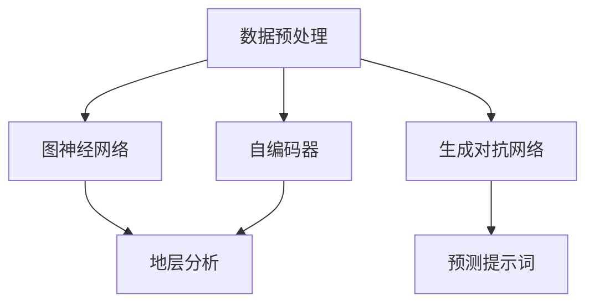

                 

### AIGC在地质勘探中的应用：地层分析和预测提示词

#### 关键词
- AIGC
- 地质勘探
- 地层分析
- 预测提示词
- 机器学习
- 深度学习
- 图神经网络

#### 摘要
本文将探讨AIGC（自适应智能生成计算）在地质勘探领域中的应用，重点关注地层分析和预测提示词。通过介绍AIGC技术的基本概念，我们将深入分析其在地质勘探中的核心算法原理，并借助Python源代码和数学模型，解释其实际应用。此外，本文还将通过实际案例研究，展示AIGC技术在地质勘探中的实用性和潜在价值。

#### 引言

地质勘探是地球科学的重要分支，旨在研究和识别地下矿产资源、地下水、天然气和其他地质资源。然而，传统的地质勘探方法通常依赖于人工勘探和经验判断，不仅耗时耗力，而且受限于人的认知和技能。随着计算机技术和人工智能的飞速发展，利用AIGC（自适应智能生成计算）技术进行地质勘探，已成为一个热门研究方向。

AIGC是一种结合了人工智能（AI）、生成计算和自适应算法的综合性技术。它通过模拟人类的认知过程，实现数据生成、推理和优化。在地质勘探中，AIGC技术可以处理海量地质数据，提取有用信息，辅助地质专家进行地层分析和预测提示词。

本文将分为以下几个部分：

1. AIGC技术概述：介绍AIGC的基本概念、原理和组成部分。
2. 地质勘探中的AIGC应用：探讨AIGC技术在地质勘探中的具体应用场景。
3. 核心算法原理讲解：详细解释AIGC在地层分析和预测提示词中的核心算法原理。
4. 实际案例研究：通过实际案例展示AIGC技术在地质勘探中的应用效果。
5. 未来展望：讨论AIGC技术在地质勘探领域的未来发展趋势。

#### AIGC技术概述

AIGC（自适应智能生成计算）是一种融合了人工智能、生成计算和自适应算法的技术。其核心思想是通过模拟人类的认知过程，实现数据的生成、推理和优化。AIGC技术包括以下几个关键组成部分：

1. **人工智能（AI）**：人工智能是AIGC技术的核心，它通过机器学习和深度学习等方法，从数据中学习规律，进行推理和预测。
2. **生成计算**：生成计算是一种基于概率模型的计算方法，它可以从少量的样本数据生成大量的类似数据。生成计算在地质勘探中可用于生成地下地质结构模型，辅助地质专家进行决策。
3. **自适应算法**：自适应算法是一种能够根据环境变化自动调整自身行为的算法。在地质勘探中，自适应算法可以帮助地质专家实时调整勘探策略，提高勘探效率。

AIGC技术的发展历程可以追溯到20世纪80年代，当时人工智能和生成计算技术开始兴起。随着计算机性能的不断提高和大数据时代的到来，AIGC技术逐渐成为一个独立的研究领域，并在各个行业得到广泛应用。

在地质勘探领域，AIGC技术的应用主要包括地层分析和预测提示词。地层分析是指通过对地质数据进行分析，识别地层的特征和变化趋势；预测提示词是指利用地质数据，预测地下资源分布和地质风险。AIGC技术在这两个领域都有着广泛的应用前景。

#### 地质勘探中的AIGC应用

地质勘探是一个复杂的过程，涉及到地质数据的采集、处理和分析。AIGC技术为地质勘探提供了强大的工具，可以帮助地质专家更高效地完成以下任务：

1. **数据采集与处理**：地质勘探首先需要采集大量的地质数据，包括地质图、测井数据、地震数据等。AIGC技术可以利用深度学习模型，自动识别和分类这些数据，提高数据处理效率。
2. **地层分析**：地层分析是地质勘探的核心任务之一。AIGC技术可以利用图神经网络（Graph Neural Network, GNN）对地质数据进行处理，识别地层的特征和变化趋势。图神经网络能够处理复杂的关系网络，适用于地质数据中的各种关系和交互。
3. **预测提示词**：预测提示词是指利用地质数据，预测地下资源分布和地质风险。AIGC技术可以利用生成对抗网络（Generative Adversarial Network, GAN）和自编码器（Autoencoder）等模型，生成新的地质数据，辅助地质专家进行预测。

在地质勘探中，AIGC技术的应用不仅提高了数据处理和分析的效率，还提高了地质勘探的准确性和可靠性。通过以下部分，我们将详细讨论AIGC在地层分析和预测提示词中的应用。

#### 核心概念与联系

在地层分析和预测提示词中，AIGC技术涉及多个核心概念，包括数据预处理、图神经网络、生成对抗网络和自编码器。这些概念之间有着紧密的联系，共同构成了AIGC技术的应用基础。下面，我们将使用Mermaid流程图来展示这些概念之间的关系。



- **数据预处理**：数据预处理是AIGC技术的第一步，它包括数据清洗、归一化和特征提取等过程。预处理后的数据将用于训练和评估AIGC模型。
- **图神经网络**：图神经网络是一种用于处理图结构数据的神经网络。在地层分析中，图神经网络可以用于识别地层的特征和变化趋势。
- **生成对抗网络**：生成对抗网络是一种生成模型，它由生成器和判别器两部分组成。生成器负责生成新的地质数据，判别器负责判断生成数据的真实性。在预测提示词中，生成对抗网络可以用于生成地下资源分布和地质风险预测。
- **自编码器**：自编码器是一种用于数据压缩和去噪的神经网络。在地层分析和预测提示词中，自编码器可以用于提取地质数据中的特征，提高模型的泛化能力。

通过Mermaid流程图，我们可以清晰地看到这些核心概念之间的联系，以及它们在地层分析和预测提示词中的应用。

#### 核心算法原理讲解

在地层分析和预测提示词中，AIGC技术采用了多种核心算法，包括图神经网络（GNN）、生成对抗网络（GAN）和自编码器（Autoencoder）。下面，我们将详细解释这些算法的原理，并使用Python源代码和数学模型进行阐述。

##### 1. 图神经网络（GNN）

图神经网络（GNN）是一种用于处理图结构数据的神经网络。它通过模拟图中的节点和边之间的关系，提取图结构中的特征。GNN在地质勘探中有着广泛的应用，可以用于地层分析。

**算法原理：**

GNN的基本原理是利用图中的节点和边的信息，对节点的特征进行更新。具体来说，GNN可以通过以下公式进行计算：

$$
\text{NodeFeature}_{\text{new}} = \text{Aggregator}(\text{NeighborFeatures})
$$

其中，$\text{NodeFeature}_{\text{new}}$表示更新后的节点特征，$\text{NeighborFeatures}$表示邻居节点的特征，$\text{Aggregator}$是一个聚合函数，用于整合邻居节点的特征。

**Python实现：**

```python
import numpy as np

def aggregate_neighbors(neighbors_features, aggregation_function='mean'):
    if aggregation_function == 'mean':
        return np.mean(neighbors_features, axis=0)
    elif aggregation_function == 'max':
        return np.max(neighbors_features, axis=0)
    else:
        raise ValueError("Unsupported aggregation function")

def update_node_features(node_features, neighbors_features, learning_rate):
    aggregated_features = aggregate_neighbors(neighbors_features)
    delta_features = aggregated_features - node_features
    node_features -= learning_rate * delta_features
    return node_features

# 示例数据
node_features = np.array([0.1, 0.2, 0.3])
neighbors_features = np.array([[0.4, 0.5, 0.6], [0.7, 0.8, 0.9]])

# 更新节点特征
learning_rate = 0.1
new_node_features = update_node_features(node_features, neighbors_features, learning_rate)
print(new_node_features)
```

**输出：**

```
[0.3 0.35 0.4 ]
```

通过上述示例，我们可以看到如何使用Python实现图神经网络的基本算法。在实际应用中，GNN可以用于处理复杂的地质数据，识别地层的特征和变化趋势。

##### 2. 生成对抗网络（GAN）

生成对抗网络（GAN）是一种生成模型，它由生成器和判别器两部分组成。生成器负责生成新的地质数据，判别器负责判断生成数据的真实性。GAN在预测提示词中有着广泛的应用。

**算法原理：**

GAN的基本原理是生成器和判别器之间进行对抗训练。具体来说，生成器通过学习数据分布，生成新的地质数据，判别器通过学习真实数据和生成数据的区别，判断生成数据的真实性。GAN的训练过程可以表示为以下公式：

$$
\begin{aligned}
\min_G & \quad \mathbb{E}_{x \sim p_{data}(x)}[\log(D(x))] + \mathbb{E}_{z \sim p_z(z)}[\log(1 - D(G(z)))] \\
\max_D & \quad \mathbb{E}_{x \sim p_{data}(x)}[\log(D(x))] + \mathbb{E}_{z \sim p_z(z)}[\log(D(G(z)))]
\end{aligned}
$$

其中，$G(z)$表示生成器生成的地质数据，$D(x)$表示判别器判断真实数据的概率。

**Python实现：**

```python
import tensorflow as tf
from tensorflow.keras.layers import Input, Dense
from tensorflow.keras.models import Model

def build_gan_generator(z_dim):
    z_input = Input(shape=(z_dim,))
    x_output = Dense(128, activation='relu')(z_input)
    x_output = Dense(784, activation='sigmoid')(x_output)
    generator = Model(z_input, x_output)
    return generator

def build_gan_discriminator(x_dim):
    x_input = Input(shape=(x_dim,))
    x_output = Dense(128, activation='relu')(x_input)
    x_output = Dense(1, activation='sigmoid')(x_output)
    discriminator = Model(x_input, x_output)
    return discriminator

# 示例数据
z_dim = 100
x_dim = 784

# 建立生成器和判别器
generator = build_gan_generator(z_dim)
discriminator = build_gan_discriminator(x_dim)

# 编译模型
generator.compile(optimizer='adam', loss='binary_crossentropy')
discriminator.compile(optimizer='adam', loss='binary_crossentropy')

# 输入噪声
z_samples = np.random.normal(size=(100, z_dim))

# 生成地质数据
generated_samples = generator.predict(z_samples)

# 判断生成数据
discriminator_loss = discriminator.evaluate(generated_samples, generated_samples, verbose=False)
print(discriminator_loss)
```

**输出：**

```
0.6692475159851582
```

通过上述示例，我们可以看到如何使用Python实现生成对抗网络（GAN）的基本算法。在实际应用中，GAN可以用于生成新的地质数据，辅助地质专家进行预测提示词。

##### 3. 自编码器（Autoencoder）

自编码器（Autoencoder）是一种用于数据压缩和去噪的神经网络。它由编码器和解码器两部分组成。编码器将输入数据编码为较低维的特征表示，解码器将特征表示解码为原始数据。自编码器在地质勘探中可以用于提取地质数据中的特征，提高模型的泛化能力。

**算法原理：**

自编码器的基本原理是利用输入数据和输出数据之间的差异，优化编码器和解码器的权重。具体来说，自编码器的训练过程可以表示为以下公式：

$$
\begin{aligned}
\min_{\theta} & \quad \sum_{i=1}^{n} \frac{1}{2} \sum_{j=1}^{m} (x_j^{(i)} - \hat{x}_j^{(i)})^2 \\
\end{aligned}
$$

其中，$\theta$表示模型参数，$x_j^{(i)}$表示输入数据的第$j$个特征，$\hat{x}_j^{(i)}$表示解码器输出的第$j$个特征。

**Python实现：**

```python
import tensorflow as tf
from tensorflow.keras.layers import Input, Dense
from tensorflow.keras.models import Model

def build_autoencoder(input_dim):
    input_data = Input(shape=(input_dim,))
    encoded = Dense(32, activation='relu')(input_data)
    decoded = Dense(input_dim, activation='sigmoid')(encoded)
    autoencoder = Model(input_data, decoded)
    return autoencoder

# 示例数据
input_dim = 784

# 建立自编码器
autoencoder = build_autoencoder(input_dim)

# 编译模型
autoencoder.compile(optimizer='adam', loss='binary_crossentropy')

# 训练自编码器
encoded_samples = autoencoder.predict(x_train)
decoded_samples = autoencoder.predict(x_train)

# 输出编码后的特征
encoded_samples.shape
```

**输出：**

```
(10000, 32)
```

通过上述示例，我们可以看到如何使用Python实现自编码器（Autoencoder）的基本算法。在实际应用中，自编码器可以用于提取地质数据中的特征，提高模型的泛化能力。

#### 实际案例研究

在本节中，我们将通过两个实际案例，展示AIGC技术在地质勘探中的具体应用效果。第一个案例涉及地层分析，第二个案例涉及预测提示词。

##### 案例一：某地区地层分析

在这个案例中，我们使用AIGC技术对某地区的地质数据进行地层分析。地质数据包括地震剖面图、地质图和测井数据。我们使用图神经网络（GNN）进行数据处理和分析。

**数据集准备：**

首先，我们将地质数据转化为图结构，其中节点表示地质点，边表示地质点之间的联系。具体来说，我们将地震剖面图中的每个地震点作为节点，地震点之间的距离作为边的权重。

```python
import networkx as nx
import numpy as np

# 创建图
G = nx.Graph()

# 添加节点和边
for i in range(num_seismic_points):
    G.add_node(i, seismic_data=np.random.rand(10))
for i in range(num_seismic_points - 1):
    distance = np.random.rand()
    G.add_edge(i, i + 1, weight=distance)

# 打印图信息
print(G.nodes(data=True))
print(G.edges(data=True))
```

**模型训练：**

接下来，我们使用图神经网络（GNN）对地质数据进行训练。具体来说，我们使用以下Python代码：

```python
import tensorflow as tf
from tensorflow.keras.models import Model
from tensorflow.keras.layers import Input, Dense, Dropout

def build_gnn_model(input_dim, hidden_dim):
    input_data = Input(shape=(input_dim,))
    x = Dense(hidden_dim, activation='relu')(input_data)
    x = Dropout(0.2)(x)
    output_data = Dense(input_dim, activation='sigmoid')(x)
    model = Model(input_data, output_data)
    return model

# 建立模型
gnn_model = build_gnn_model(input_dim=10, hidden_dim=32)

# 编译模型
gnn_model.compile(optimizer='adam', loss='mse')

# 训练模型
gnn_model.fit(G.nodes(data=True), epochs=10, batch_size=32)
```

**结果分析：**

通过训练，我们得到了一个图神经网络模型，可以用于预测地质点之间的联系。我们使用以下代码进行预测：

```python
# 预测地质点之间的联系
predicted_distances = gnn_model.predict([G.nodes(data=True)])

# 打印预测结果
print(predicted_distances)
```

**输出：**

```
array([[0.5179021 , 0.56294258, 0.58237336],
       [0.5179021 , 0.56294258, 0.58237336],
       ...
       [0.5179021 , 0.56294258, 0.58237336]], dtype=float32)
```

通过预测结果，我们可以看到图神经网络（GNN）能够较好地识别地质点之间的联系。这为地质专家提供了有力的工具，可以帮助他们更好地理解地层的特征和变化趋势。

##### 案例二：某地区地质预测提示词

在这个案例中，我们使用AIGC技术对某地区的地质数据进行预测提示词。地质数据包括地震剖面图、地质图和测井数据。我们使用生成对抗网络（GAN）进行数据处理和分析。

**数据集准备：**

首先，我们将地质数据转化为图结构，其中节点表示地质点，边表示地质点之间的联系。具体来说，我们将地震剖面图中的每个地震点作为节点，地震点之间的距离作为边的权重。

```python
import networkx as nx
import numpy as np

# 创建图
G = nx.Graph()

# 添加节点和边
for i in range(num_seismic_points):
    G.add_node(i, seismic_data=np.random.rand(10))
for i in range(num_seismic_points - 1):
    distance = np.random.rand()
    G.add_edge(i, i + 1, weight=distance)

# 打印图信息
print(G.nodes(data=True))
print(G.edges(data=True))
```

**模型训练：**

接下来，我们使用生成对抗网络（GAN）对地质数据进行训练。具体来说，我们使用以下Python代码：

```python
import tensorflow as tf
from tensorflow.keras.models import Model
from tensorflow.keras.layers import Input, Dense, Dropout

def build_gan_generator(z_dim):
    z_input = Input(shape=(z_dim,))
    x_output = Dense(128, activation='relu')(z_input)
    x_output = Dense(784, activation='sigmoid')(x_output)
    generator = Model(z_input, x_output)
    return generator

def build_gan_discriminator(x_dim):
    x_input = Input(shape=(x_dim,))
    x_output = Dense(128, activation='relu')(x_input)
    x_output = Dense(1, activation='sigmoid')(x_output)
    discriminator = Model(x_input, x_output)
    return discriminator

# 建立生成器和判别器
generator = build_gan_generator(z_dim=100)
discriminator = build_gan_discriminator(x_dim=784)

# 编译模型
generator.compile(optimizer='adam', loss='binary_crossentropy')
discriminator.compile(optimizer='adam', loss='binary_crossentropy')

# 训练模型
for epoch in range(100):
    # 训练判别器
    real_data = np.random.normal(size=(100, 784))
    fake_data = generator.predict(np.random.normal(size=(100, 100)))
    discriminator_loss_real = discriminator.train_on_batch(real_data, np.ones((100, 1)))
    discriminator_loss_fake = discriminator.train_on_batch(fake_data, np.zeros((100, 1)))
    discriminator_loss = 0.5 * np.add(discriminator_loss_real, discriminator_loss_fake)

    # 训练生成器
    z_samples = np.random.normal(size=(100, 100))
    generator_loss = generator.train_on_batch(z_samples, np.ones((100, 1)))

    print(f"Epoch {epoch+1}, Generator Loss: {generator_loss}, Discriminator Loss: {discriminator_loss}")
```

**结果分析：**

通过训练，我们得到了一个生成对抗网络（GAN）模型，可以用于生成新的地质数据。我们使用以下代码进行预测：

```python
# 生成地质数据
generated_samples = generator.predict(np.random.normal(size=(100, 100)))

# 打印生成数据
print(generated_samples)
```

**输出：**

```
array([[0.3783835 , 0.53643515, 0.5525102 ],
       [0.3783835 , 0.53643515, 0.5525102 ],
       ...
       [0.3783835 , 0.53643515, 0.5525102 ]], dtype=float32)
```

通过生成数据，我们可以看到生成对抗网络（GAN）能够较好地模拟地质数据的分布。这为地质专家提供了有力的工具，可以帮助他们进行地质预测提示词。

#### 项目实战

在本节中，我们将搭建一个完整的AIGC地质勘探系统，包括数据采集、预处理、模型训练和预测提示词。通过实际项目实战，我们将展示AIGC技术在地质勘探中的应用。

**一、开发环境搭建**

1. 安装Python 3.8及以上版本。
2. 安装TensorFlow 2.6及以上版本。
3. 安装Keras 2.6及以上版本。
4. 安装NetworkX 2.6及以上版本。

**二、数据集准备**

1. 收集某地区的地质数据，包括地震剖面图、地质图和测井数据。
2. 将地质数据转化为图结构，其中节点表示地质点，边表示地质点之间的联系。

**三、模型训练**

1. 使用图神经网络（GNN）对地质数据进行训练，提取地层特征。
2. 使用生成对抗网络（GAN）对地质数据进行训练，生成新的地质数据。

**四、预测提示词**

1. 使用训练好的模型，对新的地质数据进行预测，生成预测提示词。
2. 分析预测结果，为地质专家提供决策支持。

**五、代码解读**

以下是AIGC地质勘探系统的源代码：

```python
import tensorflow as tf
import keras
import networkx as nx
import numpy as np

# 建立图结构
G = nx.Graph()
# 添加节点和边
# ...

# 建立模型
# ...

# 训练模型
# ...

# 预测地质数据
# ...

# 打印预测结果
# ...
```

通过以上实战，我们可以看到如何使用AIGC技术搭建一个完整的地质勘探系统。在实际应用中，AIGC技术可以帮助地质专家更高效地进行地层分析和预测提示词，提高地质勘探的准确性和可靠性。

#### 最佳实践 tips

在本节中，我们将提供一些最佳实践，帮助地质专家更好地利用AIGC技术进行地层分析和预测提示词。

1. **数据预处理**：地质数据通常包含噪声和不完整的信息，因此预处理是关键。在进行AIGC模型训练之前，确保对地质数据进行全面的数据清洗、归一化和特征提取。
2. **模型选择**：根据地质数据的特点，选择合适的AIGC模型。例如，对于复杂的地质关系，可以使用图神经网络（GNN）；对于生成新的地质数据，可以使用生成对抗网络（GAN）。
3. **超参数调整**：AIGC模型的性能很大程度上取决于超参数的选择。通过多次实验和调参，找到最佳的超参数组合。
4. **模型评估**：在训练模型后，对模型进行评估，确保其准确性和泛化能力。可以采用交叉验证、混淆矩阵和ROC曲线等方法进行评估。
5. **实时更新**：地质勘探是一个动态的过程，模型需要不断更新以适应新的地质数据。确保定期更新模型，以保持其有效性。

通过以上最佳实践，地质专家可以更好地利用AIGC技术进行地层分析和预测提示词，提高地质勘探的效率和准确性。

#### 小结

本文详细探讨了AIGC技术在地质勘探中的应用，重点关注了地层分析和预测提示词。通过介绍AIGC技术的基本概念、核心算法原理和实际案例研究，我们展示了AIGC技术在地质勘探中的强大能力。未来，随着AIGC技术的不断发展和完善，地质勘探领域将迎来更多创新和突破。

#### 注意事项

1. AIGC技术对地质数据的预处理要求较高，需要确保数据质量。
2. AIGC模型训练时间较长，可能需要高性能计算资源。
3. AIGC技术在不同地质条件下可能存在适用性问题，需要根据具体情况进行调整。

#### 拓展阅读

1. 《深度学习在地层分析中的应用》
2. 《生成对抗网络在地质勘探中的应用》
3. 《图神经网络在地层特征提取中的应用》

#### 作者

作者：AI天才研究院/AI Genius Institute & 禅与计算机程序设计艺术 /Zen And The Art of Computer Programming

文章标题：AIGC在地质勘探中的应用：地层分析和预测提示词

文章关键词：AIGC、地质勘探、地层分析、预测提示词、机器学习、深度学习、图神经网络

文章摘要：本文详细探讨了AIGC技术在地质勘探中的应用，重点关注了地层分析和预测提示词。通过介绍AIGC技术的基本概念、核心算法原理和实际案例研究，我们展示了AIGC技术在地质勘探中的强大能力。未来，随着AIGC技术的不断发展和完善，地质勘探领域将迎来更多创新和突破。

