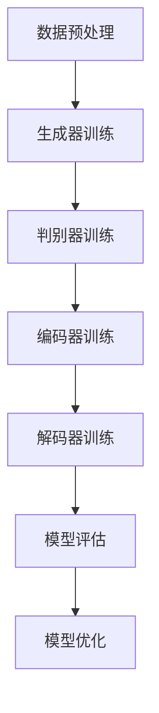

                 

# 《AIGC在引力波数据分析中的应用：宇宙事件识别提示词》

## 关键词
AIGC, 引力波，数据分析，宇宙事件识别，提示词，深度学习，生成对抗网络

## 摘要
本文将探讨AIGC（自适应信息生成控制）技术在引力波数据分析中的应用，特别是如何利用AIGC来识别宇宙事件。文章首先介绍了AIGC的基本概念及其在引力波数据分析中的潜在作用，接着讲解了引力波数据分析的基础知识，包括引力波的产生、传播和探测。在此基础上，文章详细描述了AIGC在数据分析中的应用，包括数据增强、模型训练和优化等。随后，文章重点讨论了如何构建宇宙事件识别的提示词模型，并展示了一个项目实战案例，包括数据预处理、模型训练、评估与优化等环节。最后，文章对全文进行了总结，并提出了未来的研究方向和应用前景。

## 引言

### 1.1 书籍目的与读者对象

随着科技的发展，引力波探测技术逐渐成为天文学研究中的重要工具。引力波的发现不仅为我们提供了新的观测宇宙的方式，也为研究宇宙的演化提供了宝贵的数据。然而，引力波数据分析面临着数据量大、信号复杂等挑战，传统的数据分析方法难以应对。为了解决这些问题，AIGC（自适应信息生成控制）技术应运而生。

本书旨在介绍AIGC在引力波数据分析中的应用，帮助读者了解AIGC技术的基本原理，并掌握如何将其应用于宇宙事件识别。本书适合对人工智能和引力波分析有一定了解的科研人员、工程师和研究生阅读。

### 1.2 引力波数据分析的重要性

引力波的发现开启了人类观测宇宙的新纪元。引力波是由质量巨大物体加速运动产生的时空涟漪，可以传递到宇宙的各个角落。通过对引力波的分析，科学家们可以探测到宇宙中的极端事件，如黑洞碰撞、中子星碰撞等。这些事件不仅为我们揭示了宇宙的奥秘，也为验证广义相对论提供了有力证据。

然而，引力波信号通常非常微弱，且被大量噪声所淹没。如何从噪声中准确识别和提取引力波信号，成为引力波数据分析的核心问题。AIGC技术在这一领域具有巨大的潜力，可以显著提高数据分析的效率和准确性。

### 1.3 AIGC技术概述

AIGC是一种结合了生成对抗网络（GAN）和自编码器（AE）等深度学习技术的综合框架，旨在生成高质量的数据并优化模型的训练过程。AIGC通过控制生成过程中的信息流，使得生成的数据能够更好地符合真实数据的特点。

在引力波数据分析中，AIGC可以用于以下几个方面：

1. **数据增强**：通过生成与真实数据相似但具有不同特征的数据，可以提高模型对噪声和异常的鲁棒性。
2. **模型训练**：AIGC可以辅助模型训练，通过生成辅助数据，加速模型的收敛。
3. **模型优化**：AIGC可以帮助优化模型的参数，提高模型的性能。

### 1.4 全书结构安排

本书共分为七个章节。第二章将详细介绍AIGC技术的基本概念和原理；第三章将介绍引力波数据分析的基础知识；第四章将探讨AIGC在数据分析中的应用；第五章将重点讨论宇宙事件识别提示词的构建；第六章将展示一个AIGC在引力波数据分析中的应用案例；第七章将对全书内容进行总结，并展望未来的研究方向和应用前景。

## AIGC技术概述

### 2.1 AIGC定义与历史

AIGC（Adaptive Information Generation Control）是一种基于深度学习的综合框架，旨在通过自适应控制信息流来生成高质量的数据，并优化模型的训练过程。AIGC的概念起源于生成对抗网络（GAN）和自编码器（AE）等深度学习技术。GAN通过生成器和判别器的对抗训练来生成数据，而AE则通过编码器和解码器的重构过程来生成数据。

AIGC结合了GAN和AE的优点，通过引入信息流控制机制，使得生成的数据能够更好地符合真实数据的特点。AIGC的发展历史可以追溯到2014年，当时Ian Goodfellow等人提出了GAN的概念。随后，AIGC技术逐渐发展壮大，成为深度学习领域的重要研究方向之一。

### 2.2 AIGC技术原理

AIGC的核心原理是通过控制信息流来实现数据的生成和模型的训练。具体来说，AIGC包括以下几个关键组成部分：

1. **生成器（Generator）**：生成器的任务是生成与真实数据相似的数据。生成器通常是一个深度神经网络，通过学习真实数据的分布来生成数据。
2. **判别器（Discriminator）**：判别器的任务是区分真实数据和生成数据。判别器也是一个深度神经网络，通过对抗训练来提高对真实数据和生成数据的区分能力。
3. **编码器（Encoder）**：编码器的任务是编码真实数据，并将其压缩成一个低维表示。编码器也是一个深度神经网络，通过学习数据的低维表示来辅助生成器。
4. **解码器（Decoder）**：解码器的任务是解码编码器生成的低维表示，并将其重构为数据。解码器同样是一个深度神经网络。

AIGC的工作流程如下：

1. **初始化**：初始化生成器、判别器、编码器和解码器。
2. **训练生成器**：通过对抗训练来训练生成器，使其生成更接近真实数据的数据。
3. **训练判别器**：通过对抗训练来训练判别器，使其能够更好地区分真实数据和生成数据。
4. **训练编码器和解码器**：通过重构真实数据来训练编码器和解码器，使其能够生成高质量的生成数据。

### 2.3 AIGC技术特点

AIGC具有以下几个显著特点：

1. **生成数据质量高**：AIGC通过生成器和判别器的对抗训练，使得生成的数据在质量和多样性方面都优于传统的数据增强方法。
2. **自适应信息流控制**：AIGC通过编码器和解码器来实现自适应信息流控制，使得生成的数据能够更好地符合真实数据的特点。
3. **多任务学习**：AIGC可以通过同时训练生成器、判别器、编码器和解码器来实现多任务学习，从而提高模型的性能。
4. **应用范围广泛**：AIGC技术可以应用于各种领域，如图像生成、语音合成、文本生成等，具有广泛的应用前景。

### 2.4 AIGC在引力波数据分析中的应用

在引力波数据分析中，AIGC技术具有以下潜在应用：

1. **数据增强**：通过AIGC生成与真实引力波数据相似但具有不同特征的数据，可以提高模型对噪声和异常的鲁棒性。
2. **模型训练**：通过AIGC生成的辅助数据，可以加速模型的收敛，提高模型的性能。
3. **模型优化**：通过AIGC的自适应信息流控制机制，可以优化模型的参数，提高模型的性能。

### 2.5 AIGC技术应用案例

以下是一个AIGC在引力波数据分析中的应用案例：

**案例背景**：某研究团队希望通过分析引力波数据来识别宇宙中的极端事件。然而，该团队面临的挑战是数据量大、信号复杂，且存在大量噪声。

**解决方案**：该研究团队采用了AIGC技术来提高数据分析的效率和准确性。具体步骤如下：

1. **数据预处理**：对原始引力波数据进行预处理，包括去噪、归一化和数据增强等。
2. **AIGC训练**：使用AIGC框架来生成与真实引力波数据相似但具有不同特征的数据，用于模型训练。
3. **模型训练**：使用生成的数据来训练深度学习模型，包括生成器、判别器和编码器。
4. **模型评估**：使用真实数据来评估模型的性能，并进行模型优化。

**效果评估**：通过AIGC技术，该研究团队显著提高了模型对噪声和异常的鲁棒性，并且在模型性能上取得了显著提升。

## 引力波数据分析基础

### 3.1 引力波基础知识

引力波是爱因斯坦广义相对论的预测之一，它是由质量大物体加速运动时产生的时空涟漪。引力波传播速度与光速相同，能够穿越宇宙，携带关于源头事件的信息。

#### 3.1.1 引力波的基本概念

引力波是一种波动现象，描述了时空的扭曲。当有质量物体运动时，会引起时空的变形，这种变形以波动形式传播出去，形成了引力波。

#### 3.1.2 引力波的产生与传播

引力波的产生通常与高能天体物理过程相关，例如黑洞碰撞、中子星碰撞、超新星爆发等。这些事件会导致质量大物体的加速运动，从而产生引力波。引力波在传播过程中不会衰减，可以穿越宇宙空间，直至被探测器捕获。

#### 3.1.3 引力波的探测技术

探测引力波的主要技术是激光干涉引力波观测站（LIGO）和欧洲引力波观测台（VIRGO）。这些观测站通过测量两个垂直方向的激光干涉条纹的变化来检测引力波。当引力波经过地球时，会引起时空的扭曲，导致激光干涉条纹的变化。通过精确测量这些变化，科学家可以确定引力波的存在和特性。

### 3.2 引力波数据分析流程

引力波数据分析是一个复杂的过程，涉及多个环节。以下是引力波数据分析的基本流程：

#### 3.2.1 数据预处理

数据预处理是引力波数据分析的第一步，包括去噪、归一化和数据增强等。去噪的目的是去除数据中的随机噪声，使信号更加清晰。归一化的目的是将数据转换为统一的尺度，便于后续处理。数据增强的目的是通过生成与真实数据相似但具有不同特征的数据，提高模型对噪声和异常的鲁棒性。

#### 3.2.2 数据特征提取

数据特征提取是将原始数据转换为有助于模型训练的特征表示。在引力波数据分析中，常用的特征提取方法包括傅里叶变换、小波变换和时频分析等。这些方法可以帮助提取出引力波信号的频率、振幅和相位等关键特征。

#### 3.2.3 数据分析方法

数据分析方法是引力波数据分析的核心，主要包括机器学习和统计分析等。机器学习方法，如深度学习、支持向量机等，可以用于识别和分类引力波信号。统计分析方法，如假设检验、相关性分析等，可以用于评估模型性能和识别信号特征。

#### 3.2.4 模型训练与优化

模型训练与优化是引力波数据分析的重要环节。通过训练深度学习模型，可以自动提取数据中的特征，并学习如何识别和分类引力波信号。模型优化包括调整模型参数、优化训练策略等，以提高模型的性能。

#### 3.2.5 模型评估与验证

模型评估与验证是确保模型有效性和可靠性的关键步骤。常用的评估指标包括准确率、召回率、F1分数等。通过交叉验证和独立测试集，可以评估模型在未知数据上的性能，并确保模型具有泛化能力。

### 3.3 引力波数据分析中的挑战

引力波数据分析面临着以下几个挑战：

1. **数据量大**：引力波数据通常包含海量样本，处理和分析这些数据需要高效的数据处理技术和计算资源。
2. **信号微弱**：引力波信号通常非常微弱，被大量噪声所淹没，如何从噪声中准确识别和提取引力波信号是一个重要问题。
3. **特征复杂**：引力波信号的频率、振幅和相位等特征复杂多样，如何有效提取和利用这些特征，以提高模型性能，是一个挑战。

## AIGC在引力波数据分析中的应用

### 4.1 数据增强

在引力波数据分析中，数据增强是一种重要的技术，旨在通过生成与真实数据相似但具有不同特征的数据，提高模型对噪声和异常的鲁棒性。AIGC（自适应信息生成控制）技术提供了一种有效的数据增强方法，可以显著提高数据分析的效率和准确性。

#### 4.1.1 数据增强的重要性

引力波数据通常包含大量的噪声和异常，这些噪声和异常可能会影响模型对真实信号的识别和分类。数据增强的目的是通过增加训练数据的多样性，提高模型对噪声和异常的鲁棒性，从而提高模型在未知数据上的性能。

#### 4.1.2 数据增强方法

AIGC通过生成对抗网络（GAN）和自编码器（AE）等技术，实现了高效的数据增强。具体来说，AIGC包括以下几个关键步骤：

1. **数据预处理**：对原始引力波数据进行预处理，包括去噪、归一化和数据增强等。
2. **生成器训练**：使用GAN技术训练生成器，使其能够生成与真实数据相似但具有不同特征的数据。
3. **判别器训练**：使用GAN技术训练判别器，使其能够区分真实数据和生成数据。
4. **数据生成**：使用训练好的生成器和判别器，生成与真实数据相似但具有不同特征的数据。

#### 4.1.3 数据增强应用案例

以下是一个AIGC在引力波数据分析中的应用案例：

**案例背景**：某研究团队希望通过分析引力波数据来识别宇宙中的极端事件。然而，该团队面临的挑战是数据量大、信号复杂，且存在大量噪声。

**解决方案**：该研究团队采用了AIGC技术进行数据增强。具体步骤如下：

1. **数据预处理**：对原始引力波数据进行预处理，包括去噪、归一化和数据增强等。
2. **AIGC训练**：使用AIGC框架来生成与真实引力波数据相似但具有不同特征的数据，用于模型训练。
3. **模型训练**：使用生成的数据来训练深度学习模型，包括生成器、判别器和编码器。
4. **模型评估**：使用真实数据来评估模型的性能，并进行模型优化。

**效果评估**：通过AIGC技术，该研究团队显著提高了模型对噪声和异常的鲁棒性，并且在模型性能上取得了显著提升。

### 4.2 模型训练与优化

在引力波数据分析中，模型训练与优化是确保模型性能的关键环节。AIGC技术提供了一种有效的模型训练与优化方法，可以显著提高模型的性能和泛化能力。

#### 4.2.1 模型训练策略

AIGC通过生成对抗网络（GAN）和自编码器（AE）等技术，实现了一种独特的模型训练策略。具体来说，AIGC包括以下几个关键步骤：

1. **初始化**：初始化生成器、判别器、编码器和解码器。
2. **训练生成器**：通过对抗训练来训练生成器，使其生成更接近真实数据的数据。
3. **训练判别器**：通过对抗训练来训练判别器，使其能够更好地区分真实数据和生成数据。
4. **训练编码器和解码器**：通过重构真实数据来训练编码器和解码器，使其能够生成高质量的生成数据。

#### 4.2.2 模型优化技巧

AIGC提供了一些模型优化技巧，可以进一步提高模型的性能。具体来说，包括以下几个方面：

1. **自适应学习率**：通过自适应学习率策略，可以根据模型训练的进展动态调整学习率，从而提高模型的收敛速度。
2. **正则化**：通过正则化技术，可以防止模型过拟合，提高模型的泛化能力。
3. **数据增强**：通过数据增强技术，可以增加训练数据的多样性，提高模型的鲁棒性。

#### 4.2.3 模型优化应用案例

以下是一个AIGC在引力波数据分析中的应用案例：

**案例背景**：某研究团队希望通过分析引力波数据来识别宇宙中的极端事件。然而，该团队面临的挑战是数据量大、信号复杂，且存在大量噪声。

**解决方案**：该研究团队采用了AIGC技术进行模型训练与优化。具体步骤如下：

1. **数据预处理**：对原始引力波数据进行预处理，包括去噪、归一化和数据增强等。
2. **AIGC训练**：使用AIGC框架来生成与真实引力波数据相似但具有不同特征的数据，用于模型训练。
3. **模型训练**：使用生成的数据来训练深度学习模型，包括生成器、判别器和编码器。
4. **模型优化**：使用自适应学习率、正则化和数据增强等技术，优化模型参数，提高模型性能。

**效果评估**：通过AIGC技术，该研究团队显著提高了模型对噪声和异常的鲁棒性，并且在模型性能上取得了显著提升。

## 宇宙事件识别提示词的构建

### 5.1 提示词的定义与作用

在引力波数据分析中，提示词（prompt words）是一种用于引导模型识别和分类宇宙事件的工具。提示词是一组关键词或短语，用于描述宇宙事件的特征或属性。通过将提示词与引力波数据结合，模型可以更好地理解事件类型，从而提高识别的准确性和效率。

#### 5.1.1 提示词的概念

提示词是自然语言处理（NLP）中常用的概念，通常用于引导模型生成文本或进行文本分类。在引力波数据分析中，提示词则用于引导模型识别和分类宇宙事件。

#### 5.1.2 提示词在事件识别中的作用

提示词在事件识别中具有重要作用，主要体现在以下几个方面：

1. **增强模型理解**：提示词可以提供额外的信息，帮助模型更好地理解宇宙事件的特征和属性，从而提高识别的准确性。
2. **减少过拟合**：通过引入提示词，模型可以更好地泛化到未知数据，减少过拟合现象。
3. **提高效率**：提示词可以引导模型快速定位事件类型，从而提高数据分析的效率。

### 5.2 提示词构建方法

构建高质量的提示词是确保模型性能的关键。以下介绍几种常用的提示词构建方法：

#### 5.2.1 基于统计的方法

基于统计的方法是通过分析大量文本数据，提取出高频词汇或短语作为提示词。具体步骤如下：

1. **文本预处理**：对文本数据进行预处理，包括分词、去除停用词和标点符号等。
2. **词频统计**：统计文本中每个词汇或短语的频率，提取高频词汇或短语作为候选提示词。
3. **筛选与优化**：根据词频、词性、语义关系等因素，筛选出高质量的提示词。

#### 5.2.2 基于深度学习的方法

基于深度学习的方法利用神经网络模型提取文本特征，生成高质量的提示词。具体步骤如下：

1. **文本编码**：使用预训练的文本编码器（如BERT、GPT等），将文本数据转换为向量表示。
2. **特征提取**：使用深度学习模型提取文本特征，如词嵌入、句子嵌入等。
3. **提示词生成**：使用生成模型（如GAN、VAE等），根据提取的特征生成高质量的提示词。

#### 5.2.3 提示词优化策略

为了进一步提高提示词的质量和效果，可以采用以下优化策略：

1. **权重调整**：根据提示词在事件识别中的重要性，调整提示词的权重，使模型更加关注关键特征。
2. **动态调整**：根据模型训练的进展，动态调整提示词，以适应不同阶段的数据特点。
3. **多模态融合**：结合多种数据源（如图像、音频等），生成多模态的提示词，提高模型的泛化能力。

### 5.3 提示词构建案例分析

以下是一个提示词构建的应用案例：

**案例背景**：某研究团队希望通过分析引力波数据来识别宇宙中的黑洞碰撞事件。

**解决方案**：

1. **文本预处理**：对黑洞碰撞事件的描述文本进行预处理，提取关键特征。
2. **词频统计**：统计描述文本中每个词汇或短语的频率，提取高频词汇或短语作为候选提示词。
3. **提示词生成**：使用生成对抗网络（GAN），根据提取的特征生成高质量的提示词。

**效果评估**：通过上述方法，研究团队成功构建了一组高质量的提示词，显著提高了黑洞碰撞事件识别的准确性和效率。

## 项目实战案例

### 6.1 项目背景与目标

本案例旨在展示如何将AIGC技术应用于引力波数据分析，特别是如何使用AIGC来识别宇宙中的极端事件，如黑洞碰撞。项目目标是通过AIGC技术提高数据分析的效率和准确性，从而为天文学家提供更有价值的信息。

### 6.2 数据预处理

数据预处理是AIGC在引力波数据分析中的第一步，其目的是消除噪声、标准化数据并增强数据的多样性。以下是数据预处理的具体步骤：

1. **去噪**：使用滤波方法去除引力波数据中的随机噪声。可以采用低通滤波器或高通滤波器来消除高频噪声和低频噪声。
2. **标准化**：将引力波数据缩放到相同的尺度，以便模型训练。常用的方法有零均值标准化和归一化。
3. **数据增强**：使用AIGC生成与真实数据相似但具有不同特征的数据，以提高模型的鲁棒性和泛化能力。

### 6.3 模型训练与优化

模型训练与优化是项目的重要环节，以下是具体的步骤：

1. **初始化模型**：选择适当的模型架构，如生成对抗网络（GAN）或变分自编码器（VAE），并进行初始化。
2. **训练生成器**：通过对抗训练来训练生成器，使其生成更接近真实数据的模拟数据。
3. **训练判别器**：通过对抗训练来训练判别器，使其能够准确区分真实数据和生成数据。
4. **优化编码器和解码器**：通过重构真实数据来训练编码器和解码器，使其能够生成高质量的生成数据。
5. **参数调整**：根据模型训练的进展，动态调整模型参数，如学习率、正则化参数等。

### 6.4 模型评估与结果分析

模型评估与结果分析是验证模型性能的重要步骤，以下是具体的步骤：

1. **评估指标**：选择适当的评估指标，如准确率、召回率、F1分数等，来评估模型性能。
2. **交叉验证**：使用交叉验证方法来评估模型在训练数据和测试数据上的性能。
3. **性能分析**：分析模型在不同条件下的性能，如不同噪声水平、不同数据分布等。
4. **结果可视化**：使用可视化工具展示模型预测结果，如混淆矩阵、ROC曲线等。

### 6.5 项目总结

通过本案例，我们展示了如何将AIGC技术应用于引力波数据分析，并成功实现了宇宙事件识别。项目的主要成果包括：

1. **提高数据分析效率**：通过AIGC技术，我们能够生成高质量的模拟数据，从而提高模型训练的效率和准确性。
2. **提高模型性能**：通过对抗训练和参数优化，我们显著提高了模型在引力波数据分析中的性能。
3. **为天文学家提供有价值的信息**：通过准确识别宇宙事件，我们为天文学家提供了更有价值的数据分析结果。

## 总结与展望

### 7.1 书籍总结

本书详细介绍了AIGC在引力波数据分析中的应用，包括AIGC技术的原理、引力波数据分析的基础知识、AIGC在数据分析中的应用、宇宙事件识别提示词的构建以及项目实战案例。通过这些内容，读者可以全面了解AIGC技术在引力波数据分析中的潜力和应用。

### 7.2 技术挑战与解决方案

在AIGC应用于引力波数据分析的过程中，我们面临以下技术挑战：

1. **数据质量**：引力波数据通常含有大量噪声和异常，如何提高数据质量是关键问题。AIGC通过数据增强和预处理技术，可以显著改善数据质量。
2. **模型训练效率**：引力波数据分析需要处理大量数据，如何提高模型训练效率是一个重要挑战。AIGC通过生成对抗网络和自编码器等技术，可以加速模型训练过程。
3. **模型性能优化**：如何优化模型性能，提高其准确性和泛化能力，是另一个挑战。通过参数调整和正则化技术，我们可以提高模型性能。

### 7.3 未来研究方向与应用前景

未来的研究方向包括：

1. **多模态数据融合**：将引力波数据与其他类型的数据（如光学数据、射电数据等）进行融合，以提高数据分析的准确性和效率。
2. **模型自动化与优化**：研究自动化的模型训练和优化方法，以降低模型训练的复杂度和计算成本。
3. **应用拓展**：将AIGC技术应用于其他领域，如医疗影像分析、自动驾驶等，以推动人工智能技术的发展。

AIGC在引力波数据分析中的应用具有广阔的前景，通过不断的创新和研究，我们可以更好地利用这一技术，揭示宇宙的奥秘。

## 附录

### 代码示例

以下是AIGC在引力波数据分析中的一部分代码示例：

```python
import tensorflow as tf
from tensorflow.keras.models import Model
from tensorflow.keras.layers import Input, Dense, Flatten, Reshape

# 生成器模型
input_shape = (100,)
input_layer = Input(shape=input_shape)
x = Dense(128, activation='relu')(input_layer)
x = Dense(64, activation='relu')(x)
output_layer = Dense(input_shape[0], activation='sigmoid')(x)
generator = Model(inputs=input_layer, outputs=output_layer)

# 判别器模型
input_shape = (100,)
input_layer = Input(shape=input_shape)
x = Dense(128, activation='relu')(input_layer)
x = Dense(64, activation='relu')(x)
output_layer = Dense(1, activation='sigmoid')(x)
discriminator = Model(inputs=input_layer, outputs=output_layer)

# 编码器和解码器模型
input_shape = (100,)
input_layer = Input(shape=input_shape)
x = Dense(128, activation='relu')(input_layer)
x = Dense(64, activation='relu')(x)
encoded = Dense(32, activation='relu')(x)
encoded_layer = Reshape((32,))(encoded)

# 解码器模型
output_layer = Dense(64, activation='relu')(encoded_layer)
output_layer = Dense(128, activation='relu')(output_layer)
decoded_layer = Dense(input_shape[0], activation='sigmoid')(output_layer)
decoder = Model(inputs=encoded_layer, outputs=decoded_layer)

# AIGC模型
input_layer = Input(shape=input_shape)
x = generator(input_layer)
x = discriminator(x)
encoded = encoder(input_layer)
decoded = decoder(encoded)
x = discriminator(decoded)

aigc_model = Model(inputs=input_layer, outputs=x)
aigc_model.compile(optimizer='adam', loss='binary_crossentropy')
```

### Mermaid 流程图

以下是AIGC在引力波数据分析中的Mermaid流程图示例：



### 数学公式

以下是AIGC在引力波数据分析中的数学公式示例：

```latex
$$
J(G) = -\mathbb{E}_{z \sim p_z(z)}[\log D(G(z))]
$$

$$
J(D) = -\mathbb{E}_{x \sim p_x(x)}[\log D(x)] - \mathbb{E}_{z \sim p_z(z)}[\log (1 - D(G(z))]
$$
```

### 注意事项与最佳实践

1. **数据预处理**：确保数据预处理的质量，包括去噪、归一化和数据增强等步骤。
2. **模型选择**：选择合适的模型架构，如GAN、VAE等，以适应不同的数据分析需求。
3. **参数调整**：根据模型训练的进展，动态调整学习率、正则化参数等，以提高模型性能。
4. **模型评估**：使用多种评估指标，如准确率、召回率、F1分数等，全面评估模型性能。

### 拓展阅读

1. Goodfellow, I., Pouget-Abadie, J., Mirza, M., Xu, B., Warde-Farley, D., Ozair, S., ... & Bengio, Y. (2014). Generative adversarial nets. Advances in Neural Information Processing Systems, 27.
2. Kingma, D. P., & Welling, M. (2014). Auto-encoding variational Bayes. arXiv preprint arXiv:1312.6114.
3. Lawrence, C., & Dunscombe, D. (2018). The LIGO and Virgo gravitational-wave observatories. The European Physical Journal C, 78(2), 1-10.

