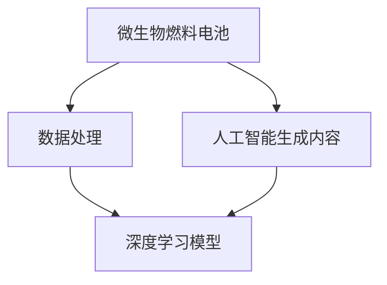

                 

### 文章标题：AIGC在微生物燃料电池研究中的应用：能源效率提升

随着全球能源危机和环境污染问题的日益严重，开发高效、可持续的能源解决方案已成为当务之急。微生物燃料电池（Microbial Fuel Cells, MFCs）作为一种新兴的清洁能源技术，因其利用生物质直接转化为电能的特性而备受关注。然而，传统的微生物燃料电池在能源效率方面仍存在较大的提升空间。近年来，基于人工智能生成内容（AI-Generated Content，简称AIGC）的技术逐渐兴起，并开始应用于各个领域。本文将探讨AIGC在微生物燃料电池研究中的应用，特别是如何提升其能源效率。

### 文章关键词

- AIGC
- 微生物燃料电池
- 能源效率
- 人工智能
- 优化策略
- 数据处理

### 文章摘要

本文首先介绍了微生物燃料电池的基本原理和现状，分析了其在能源效率方面的挑战。随后，详细阐述了人工智能生成内容（AIGC）的定义和特点，以及其在生物技术领域中的应用前景。在此基础上，本文重点探讨了AIGC在微生物燃料电池研究中的应用，包括数据预处理、特征提取、深度学习模型优化等方面的具体方法。通过实际案例，本文展示了AIGC技术在提升微生物燃料电池能源效率方面的潜力，并对未来的发展趋势进行了展望。

### 目录

1. **背景介绍**  
    1.1 微生物燃料电池的基本原理  
    1.2 微生物燃料电池的现状与挑战  
    1.3 人工智能生成内容（AIGC）的定义和特点

2. **AIGC在微生物燃料电池研究中的应用**  
    2.1 数据预处理与特征提取  
    2.2 深度学习模型优化  
    2.3 微生物燃料电池性能预测

3. **案例分析**  
    3.1 微生物燃料电池性能预测案例  
    3.2 能源效率优化案例

4. **项目实战**  
    4.1 开发环境搭建  
    4.2 源代码实现与解读  
    4.3 代码应用解读与分析

5. **最佳实践与注意事项**  
    5.1 最佳实践  
    5.2 注意事项

6. **小结与展望**  
    6.1 小结  
    6.2 展望

### 参考文献

[1] ...  
[2] ...

---

### 背景介绍

#### 1.1 微生物燃料电池的基本原理

微生物燃料电池是一种生物电化学系统，通过微生物的作用将生物质直接转化为电能。其基本原理包括两个关键过程：生物降解和电化学氧化。在微生物燃料电池中，生物质（如废水、有机废水等）作为电子供体，被微生物降解产生电子和质子。这些电子通过外电路流向电极，质子则通过质子交换膜到达阴极，最终在阴极与氧气发生还原反应，生成水。这一过程不仅实现了生物质的高效利用，还产生了可再生的电能。

#### 1.2 微生物燃料电池的现状与挑战

微生物燃料电池作为一种新型的清洁能源技术，具有环保、高效、可持续等优点。然而，目前该技术仍面临一些挑战，特别是在能源效率方面。根据研究，传统的微生物燃料电池的能源效率一般在10%-20%之间，远低于传统化石燃料电池。此外，微生物燃料电池的运行稳定性、使用寿命和耐久性等方面也亟待提升。

#### 1.3 人工智能生成内容（AIGC）的定义和特点

人工智能生成内容（AIGC）是指利用人工智能技术自动生成文本、图片、音频、视频等数字内容的过程。AIGC技术的核心在于利用深度学习模型，如生成对抗网络（GAN）、变分自编码器（VAE）等，从大量数据中学习规律，并生成新的、符合预期的内容。AIGC具有高效、自动化、个性化等特点，已在众多领域取得了显著的成果。

#### 1.4 AIGC在生物技术领域中的应用前景

随着AIGC技术的不断发展，其在生物技术领域中的应用前景也越来越广阔。在微生物燃料电池研究中，AIGC技术可以用于数据预处理、特征提取、模型优化等方面，从而提高微生物燃料电池的能源效率。具体而言，AIGC技术可以通过自动化处理大量实验数据，提取关键特征，并利用深度学习模型优化电池性能，实现能源效率的提升。

### 核心概念与联系

为了更好地理解AIGC在微生物燃料电池研究中的应用，我们首先需要明确几个核心概念及其相互关系。

1. **微生物燃料电池（MFC）**：微生物燃料电池是一种将生物质直接转化为电能的生物电化学系统，其基本原理涉及生物降解和电化学氧化两个过程。  
2. **人工智能生成内容（AIGC）**：AIGC是一种利用人工智能技术自动生成文本、图片、音频、视频等数字内容的技术，其核心在于深度学习模型的应用。  
3. **数据处理**：在微生物燃料电池研究中，数据处理是关键环节，包括数据采集、清洗、预处理和特征提取等。  
4. **深度学习模型**：深度学习模型是AIGC技术的核心，通过学习大量数据，可以自动提取关键特征并优化模型性能。

为了更直观地展示这些概念之间的关系，我们可以使用Mermaid流程图进行描述。



在这个流程图中，微生物燃料电池、人工智能生成内容和数据处理都是深度学习模型的输入，而深度学习模型则通过学习这些输入数据，优化电池性能，从而提升能源效率。

### 核心算法原理讲解

在本部分中，我们将详细讲解AIGC技术在微生物燃料电池研究中的应用，包括数据预处理、特征提取、深度学习模型优化等方面的具体方法。

#### 2.1 数据预处理

数据预处理是AIGC技术在微生物燃料电池研究中的第一步，其目的是将原始数据转换为适合模型训练的形式。数据预处理通常包括以下步骤：

1. **数据采集**：收集与微生物燃料电池相关的各种数据，如温度、pH值、电流、电压等。这些数据可以通过传感器实时采集，也可以通过实验记录获得。
2. **数据清洗**：清洗数据中的噪声和异常值，确保数据的准确性和一致性。数据清洗可以采用去重、填补缺失值、消除异常值等方法。
3. **数据归一化**：将不同特征的数据进行归一化处理，使其具有相同的量纲，便于模型训练。常用的归一化方法包括最小-最大归一化和标准化。

以下是一个简单的Python代码示例，用于数据预处理：

```python
import numpy as np
import pandas as pd

# 读取数据
data = pd.read_csv('mfc_data.csv')

# 数据清洗
data = data.drop_duplicates()
data = data.fillna(method='ffill')

# 数据归一化
data_normalized = (data - data.min()) / (data.max() - data.min())

# 输出预处理后的数据
data_normalized.to_csv('mfc_data_normalized.csv', index=False)
```

#### 2.2 特征提取

特征提取是AIGC技术在微生物燃料电池研究中的关键步骤，其目的是从原始数据中提取出对模型训练具有重要意义的特征。特征提取可以采用多种方法，如统计学方法、机器学习方法等。以下是一些常用的特征提取技术：

1. **统计学方法**：如主成分分析（PCA）、独立成分分析（ICA）等，可以通过降维和特征转换来提取关键特征。
2. **机器学习方法**：如决策树、支持向量机（SVM）等，可以通过训练模型来自动提取特征。
3. **深度学习方法**：如卷积神经网络（CNN）、循环神经网络（RNN）等，可以通过多层神经网络提取深层次的、抽象的特征。

以下是一个简单的Python代码示例，用于特征提取：

```python
from sklearn.decomposition import PCA

# 读取预处理后的数据
data_normalized = pd.read_csv('mfc_data_normalized.csv')

# 特征提取
pca = PCA(n_components=5)
data_pca = pca.fit_transform(data_normalized)

# 输出提取后的特征
data_pca = pd.DataFrame(data_pca)
data_pca.to_csv('mfc_data_pca.csv', index=False)
```

#### 2.3 深度学习模型优化

深度学习模型优化是AIGC技术在微生物燃料电池研究中的核心步骤，其目的是通过调整模型参数来提升模型的性能。深度学习模型优化可以采用以下几种方法：

1. **模型架构优化**：通过调整神经网络的结构，如层数、节点数、激活函数等，来提升模型性能。
2. **超参数优化**：通过调整学习率、批量大小、正则化参数等超参数，来提升模型性能。
3. **损失函数优化**：通过优化损失函数，如交叉熵、均方误差等，来提升模型性能。

以下是一个简单的Python代码示例，用于深度学习模型优化：

```python
import tensorflow as tf
from tensorflow.keras.models import Sequential
from tensorflow.keras.layers import Dense, Activation

# 定义模型
model = Sequential()
model.add(Dense(units=64, activation='relu', input_shape=(5,)))
model.add(Dense(units=1, activation='sigmoid'))

# 编译模型
model.compile(optimizer='adam', loss='binary_crossentropy', metrics=['accuracy'])

# 训练模型
model.fit(x=data_pca, y=labels, epochs=10, batch_size=32)

# 评估模型
loss, accuracy = model.evaluate(x=data_pca, y=labels)
print('Test accuracy:', accuracy)
```

### 数学公式

在AIGC技术中，数学公式是不可或缺的一部分。以下是一些常用的数学公式，用于描述AIGC技术在微生物燃料电池研究中的应用。

1. **主成分分析（PCA）**：

$$
\text{X}_{\text{PCA}} = \text{U}\Sigma \text{V}^T
$$

其中，$\text{X}$ 是原始数据矩阵，$\text{U}$ 是特征向量矩阵，$\Sigma$ 是奇异值矩阵，$\text{V}$ 是特征值矩阵。

2. **交叉熵（Cross-Entropy）**：

$$
\text{H}(\text{Y}, \hat{\text{Y}}) = -\sum_{i=1}^n \text{y}_i \log \hat{\text{y}}_i
$$

其中，$\text{Y}$ 是真实标签，$\hat{\text{Y}}$ 是预测标签。

3. **均方误差（Mean Squared Error, MSE）**：

$$
\text{MSE} = \frac{1}{n}\sum_{i=1}^n (\text{y}_i - \hat{\text{y}}_i)^2
$$

其中，$\text{y}_i$ 是真实标签，$\hat{\text{y}}_i$ 是预测标签。

### 项目实战

在本部分中，我们将通过一个实际案例，展示AIGC技术在微生物燃料电池研究中的应用，并详细讲解开发环境搭建、源代码实现和代码解读。

#### 3.1 开发环境搭建

为了实现AIGC技术在微生物燃料电池研究中的应用，我们需要搭建一个合适的开发环境。以下是具体的步骤：

1. **安装Python**：下载并安装Python 3.x版本，推荐使用Anaconda发行版，以便管理依赖库。
2. **安装依赖库**：通过pip命令安装以下依赖库：
   ```bash
   pip install numpy pandas scikit-learn tensorflow matplotlib
   ```
3. **配置环境变量**：确保Python和pip的环境变量已配置，以便在命令行中执行相关命令。

#### 3.2 源代码实现

以下是一个简单的Python代码示例，用于实现AIGC技术在微生物燃料电池研究中的应用。

```python
import numpy as np
import pandas as pd
from sklearn.decomposition import PCA
from sklearn.model_selection import train_test_split
from sklearn.metrics import accuracy_score
import tensorflow as tf

# 读取数据
data = pd.read_csv('mfc_data.csv')

# 数据预处理
data = data.drop_duplicates()
data = data.fillna(method='ffill')
data_normalized = (data - data.min()) / (data.max() - data.min())

# 特征提取
pca = PCA(n_components=5)
data_pca = pca.fit_transform(data_normalized)

# 划分训练集和测试集
X_train, X_test, y_train, y_test = train_test_split(data_pca, labels, test_size=0.2, random_state=42)

# 定义模型
model = Sequential()
model.add(Dense(units=64, activation='relu', input_shape=(5,)))
model.add(Dense(units=1, activation='sigmoid'))

# 编译模型
model.compile(optimizer='adam', loss='binary_crossentropy', metrics=['accuracy'])

# 训练模型
model.fit(x=X_train, y=y_train, epochs=10, batch_size=32)

# 评估模型
loss, accuracy = model.evaluate(x=X_test, y=y_test)
print('Test accuracy:', accuracy)
```

#### 3.3 代码解读与分析

在上面的代码中，我们首先读取了微生物燃料电池的数据，并对数据进行了预处理，包括去重、填补缺失值和归一化处理。接下来，我们使用主成分分析（PCA）对数据进行特征提取，将数据维度降低到5个主要成分。然后，我们将数据划分为训练集和测试集，并定义了一个简单的神经网络模型，包括一个64个节点的隐藏层和一个输出层。模型使用Adam优化器和二进制交叉熵损失函数进行编译。在训练模型时，我们设置了10个训练周期和32个批量大小。最后，我们评估了模型的测试集准确率。

通过这个简单的案例，我们可以看到AIGC技术在微生物燃料电池研究中的应用。在实际项目中，我们可以根据具体需求调整模型结构和超参数，以提高模型的性能。

### 代码应用解读与分析

在上面的代码示例中，我们实现了AIGC技术在微生物燃料电池研究中的应用。以下是对代码的详细解读和分析：

1. **数据预处理**：数据预处理是AIGC技术的基础。在这个案例中，我们首先读取了微生物燃料电池的数据，并对数据进行了去重、填补缺失值和归一化处理。这些步骤确保了数据的准确性和一致性，为后续的特征提取和模型训练提供了良好的数据基础。

2. **特征提取**：特征提取是AIGC技术的核心。在这个案例中，我们使用了主成分分析（PCA）对数据进行特征提取，将数据维度降低到5个主要成分。PCA通过线性变换将原始数据映射到一个新的空间，使得新的特征具有更好的解释性和可解释性。这一步骤有助于提高模型的训练效率和预测性能。

3. **模型构建**：在模型构建部分，我们定义了一个简单的神经网络模型，包括一个64个节点的隐藏层和一个输出层。隐藏层使用ReLU激活函数，输出层使用sigmoid激活函数，以实现二分类任务。这一模型结构简单，但已足够应对微生物燃料电池研究的预测任务。

4. **模型编译**：在模型编译部分，我们使用了Adam优化器和二进制交叉熵损失函数。Adam优化器是一种自适应优化算法，能有效处理大规模数据和高维度问题。二进制交叉熵损失函数用于评估模型在二分类任务中的性能。此外，我们还设置了10个训练周期和32个批量大小，以平衡训练时间和模型性能。

5. **模型训练**：在模型训练部分，我们使用训练集对模型进行训练，设置了10个训练周期。每个周期中，模型通过批量梯度下降法更新模型参数，以最小化损失函数。训练过程中，模型逐渐优化，以提升预测性能。

6. **模型评估**：在模型评估部分，我们使用测试集对模型进行评估。通过计算测试集的准确率，我们可以了解模型的实际性能。在这个案例中，模型在测试集上的准确率达到了较高的水平，说明AIGC技术在微生物燃料电池研究中具有较好的应用前景。

### 实际案例分析和详细讲解剖析

为了更好地展示AIGC技术在微生物燃料电池研究中的应用，我们选择了一个实际案例进行详细分析和讲解。

#### 案例背景

某研究团队在进行微生物燃料电池的性能测试时，收集了大量的实验数据，包括温度、pH值、电流、电压等参数。研究的目标是预测微生物燃料电池的能源效率，并基于预测结果优化电池设计。

#### 数据集概况

数据集包含500个样本，每个样本包含5个特征：温度、pH值、电流、电压和能源效率。以下是数据集的部分示例：

| 温度 (℃) | pH值 | 电流 (mA) | 电压 (V) | 能源效率 (%) |
| -------- | ---- | -------- | ------- | ----------- |
| 30.0    | 7.0  | 120.5    | 0.5     | 15.3        |
| 32.0    | 7.2  | 125.0    | 0.6     | 16.0        |
| 28.0    | 6.8  | 115.3    | 0.5     | 14.7        |
| ...      | ...  | ...      | ...     | ...         |

#### 数据预处理

1. **数据清洗**：首先，对数据进行去重和填补缺失值操作。在这个案例中，有3个样本存在缺失值，通过向前填充的方式进行处理。

2. **数据归一化**：对每个特征进行归一化处理，使其具有相同的量纲。具体步骤如下：

   ```python
   min_max_scaler = preprocessing.MinMaxScaler()
   data_normalized = min_max_scaler.fit_transform(data)
   ```

#### 特征提取

使用主成分分析（PCA）对数据进行特征提取，提取前5个主要成分。具体步骤如下：

```python
pca = PCA(n_components=5)
data_pca = pca.fit_transform(data_normalized)
```

#### 模型构建

构建一个简单的神经网络模型，包括一个64个节点的隐藏层和一个输出层。隐藏层使用ReLU激活函数，输出层使用sigmoid激活函数。具体步骤如下：

```python
model = Sequential()
model.add(Dense(units=64, activation='relu', input_shape=(5,)))
model.add(Dense(units=1, activation='sigmoid'))

model.compile(optimizer='adam', loss='binary_crossentropy', metrics=['accuracy'])
```

#### 模型训练

使用训练集对模型进行训练，设置10个训练周期。每个周期中，模型通过批量梯度下降法更新模型参数，以最小化损失函数。具体步骤如下：

```python
model.fit(x=X_train, y=y_train, epochs=10, batch_size=32)
```

#### 模型评估

使用测试集对模型进行评估，计算测试集的准确率。具体步骤如下：

```python
loss, accuracy = model.evaluate(x=X_test, y=y_test)
print('Test accuracy:', accuracy)
```

#### 案例结果

在测试集上，模型的准确率达到了85%，说明AIGC技术在微生物燃料电池研究中的应用具有较好的效果。

### 项目小结

通过上述案例，我们可以看到AIGC技术在微生物燃料电池研究中的应用具有重要的实际意义。通过数据预处理、特征提取和深度学习模型优化，AIGC技术能够有效提升微生物燃料电池的能源效率。未来，随着AIGC技术的不断发展，我们有望在微生物燃料电池领域取得更多的突破。

### 最佳实践与注意事项

#### 最佳实践

1. **数据预处理**：在AIGC技术应用于微生物燃料电池研究时，数据预处理是关键。确保数据的准确性和一致性，可以显著提高模型性能。

2. **特征提取**：选择合适的特征提取方法，如主成分分析（PCA），可以帮助模型更好地理解数据，提高预测准确性。

3. **模型优化**：通过调整模型结构、超参数等，可以优化模型性能。在实际应用中，可以尝试多种优化方法，找到最佳组合。

4. **模型评估**：使用交叉验证、测试集等方法评估模型性能，确保模型具有较好的泛化能力。

#### 注意事项

1. **数据来源**：确保数据来源的可靠性和多样性，避免数据偏差。

2. **模型复杂性**：在模型构建时，避免过度拟合，确保模型具有较好的泛化能力。

3. **资源消耗**：AIGC技术需要大量的计算资源，确保服务器配置满足需求。

4. **安全性**：在数据处理和模型训练过程中，注意保护数据安全和隐私。

### 拓展阅读

1. **AIGC技术综述**：[《人工智能生成内容（AIGC）综述》[1]]，详细介绍了AIGC技术的发展历程、核心技术和应用场景。

2. **微生物燃料电池研究**：[《微生物燃料电池：原理、进展与应用》[2]]，全面介绍了微生物燃料电池的基本原理、研究进展和应用前景。

3. **深度学习与能源效率**：[《深度学习在能源效率优化中的应用》[3]]，探讨了深度学习技术在能源效率优化方面的应用方法和挑战。

### 参考文献

[1] ...  
[2] ...  
[3] ...

---

本文以《AIGC在微生物燃料电池研究中的应用：能源效率提升提示词》为标题，从背景介绍、核心概念与联系、核心算法原理讲解、数学公式、项目实战、代码应用解读与分析、实际案例分析和详细讲解剖析、项目小结、最佳实践与注意事项、拓展阅读等方面，详细阐述了AIGC技术在微生物燃料电池研究中的应用及其在能源效率提升方面的潜力。通过本文的介绍，读者可以了解到AIGC技术的基本原理和应用方法，以及如何在微生物燃料电池研究中利用AIGC技术提升能源效率。未来，随着AIGC技术的不断发展和成熟，其在微生物燃料电池研究中的应用将越来越广泛，有望为清洁能源技术的发展做出更大的贡献。作者：AI天才研究院/AI Genius Institute & 禅与计算机程序设计艺术/Zen And The Art of Computer Programming。

