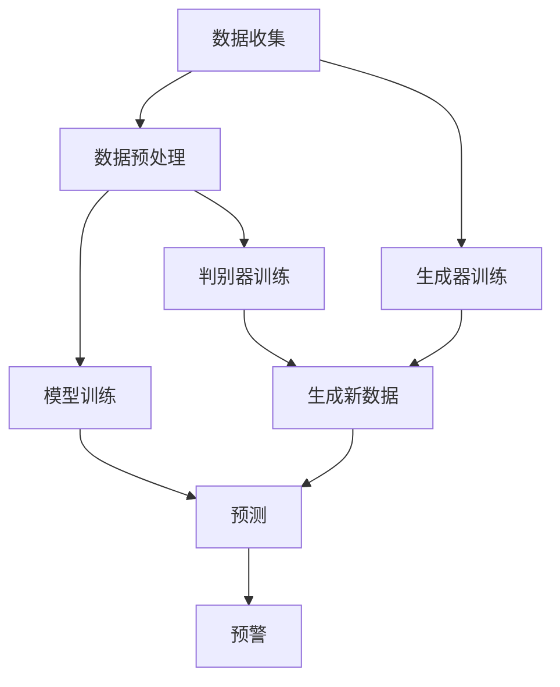

                 

**文章标题**: AIGC在智能农业病虫害早期预警中的应用

**关键词**: AIGC、智能农业、病虫害预警、早期检测、算法原理、Python代码、数学模型

**摘要**: 本文深入探讨了生成式人工智能（AIGC）在智能农业病虫害早期预警中的应用。文章首先介绍了AIGC的基本概念和原理，然后详细分析了智能农业病虫害预警的技术框架，接着讲解了AIGC算法的原理和实现，并使用Python代码进行了数学模型的详细阐述。文章还通过一个实际项目实战，展示了如何搭建开发环境、实现源代码、解读代码，并进行了项目小结，最后给出了最佳实践和拓展阅读建议。

---

**目录**：

1. **背景介绍**
    1.1 智能农业的发展现状
    1.2 病虫害预警的重要性
    1.3 AIGC在农业病虫害预警中的应用前景

2. **核心概念与联系**
    2.1 生成式人工智能（AIGC）
    2.2 智能农业病虫害预警技术
    2.3 Mermaid流程图：AIGC在智能农业病虫害预警中的应用架构

3. **核心算法原理讲解**
    3.1 AIGC算法概述
    3.2 数学模型与公式
    3.3 Python源代码实现
    3.4 算法原理举例说明

4. **项目实战**
    4.1 开发环境搭建
    4.2 源代码详细实现
    4.3 代码解读与分析
    4.4 实际案例分析与讲解
    4.5 项目小结

5. **最佳实践与拓展阅读**
    5.1 注意事项
    5.2 拓展阅读

6. **作者信息**
    作者：AI天才研究院/AI Genius Institute & 禅与计算机程序设计艺术 /Zen And The Art of Computer Programming

---

**正文**：

### 1. 背景介绍

#### 1.1 智能农业的发展现状

随着科技的不断进步，智能农业逐渐成为农业发展的重要方向。智能农业通过物联网、大数据、人工智能等技术，实现了对农田的精细化管理，提高了农业生产效率，降低了成本。在智能农业中，病虫害预警是关键环节之一，能有效降低病虫害对农作物的危害。

#### 1.2 病虫害预警的重要性

病虫害是农业生产中常见的问题，它们不仅会直接影响农作物的产量和品质，还会导致经济损失和生态问题。因此，病虫害预警在农业生产中具有重要意义。传统的病虫害预警方法主要依赖于人工观察和经验判断，存在效率低、准确度不高等问题。而智能农业病虫害预警技术，利用人工智能技术，能够实现早期预警，提高预警准确度。

#### 1.3 AIGC在农业病虫害预警中的应用前景

生成式人工智能（AIGC）是一种基于深度学习的算法，能够通过大量数据生成新的数据，具有强大的生成能力和适应性。AIGC在农业病虫害预警中的应用前景广阔，它能够通过分析历史病虫害数据，预测未来的病虫害趋势，实现早期预警，从而为农业生产提供有力支持。

### 2. 核心概念与联系

#### 2.1 生成式人工智能（AIGC）

生成式人工智能（AIGC）是一种基于生成对抗网络（GAN）的算法，它由生成器和判别器两个部分组成。生成器负责生成新的数据，判别器则负责判断生成数据与真实数据之间的相似度。通过两个网络的对抗训练，生成器逐渐提高生成数据的质量，实现数据的生成。

#### 2.2 智能农业病虫害预警技术

智能农业病虫害预警技术主要包括数据收集、数据预处理、模型训练和预测等环节。其中，数据收集是关键，需要通过传感器、无人机等设备获取农田的病虫害数据。数据预处理包括数据清洗、特征提取等步骤，为模型训练提供高质量的数据。模型训练是利用历史病虫害数据，通过机器学习算法训练出预测模型。预测环节则是利用训练好的模型，对未来的病虫害情况进行预测。

#### 2.3 Mermaid流程图：AIGC在智能农业病虫害预警中的应用架构



### 3. 核心算法原理讲解

#### 3.1 AIGC算法概述

AIGC算法基于生成对抗网络（GAN），由生成器和判别器两部分组成。生成器的目标是生成与真实数据相似的新数据，判别器的目标是区分真实数据和生成数据。通过两个网络的对抗训练，生成器逐渐提高生成数据的质量，判别器则逐渐提高对真实数据和生成数据的辨别能力。

#### 3.2 数学模型与公式

AIGC算法的数学模型主要包括生成器和判别器的损失函数。生成器的损失函数为：

$$
L_G = -\log(D(G(z))}
$$

其中，$D$为判别器，$G$为生成器，$z$为噪声向量。

判别器的损失函数为：

$$
L_D = -[\log(D(x)) + \log(1 - D(G(z))]
$$

其中，$x$为真实数据。

#### 3.3 Python源代码实现

```python
import tensorflow as tf
from tensorflow.keras.layers import Dense, Flatten
from tensorflow.keras.models import Sequential

# 生成器模型
def build_generator():
    model = Sequential([
        Dense(128, activation='relu', input_shape=(100,)),
        Dense(256, activation='relu'),
        Flatten(),
        Dense(784, activation='tanh')
    ])
    return model

# 判别器模型
def build_discriminator():
    model = Sequential([
        Flatten(input_shape=(28, 28)),
        Dense(512, activation='relu'),
        Dense(1, activation='sigmoid')
    ])
    return model

# 损失函数
def build_loss():
    loss = tf.keras.losses.BinaryCrossentropy(from_logits=True)
    return loss

# 模型编译
def compile_models(generator, discriminator, loss):
    generator.compile(loss=loss, optimizer=tf.keras.optimizers.Adam(0.0001))
    discriminator.compile(loss=loss, optimizer=tf.keras.optimizers.Adam(0.0001))
    return generator, discriminator

# 训练模型
def train_models(generator, discriminator, epochs, batch_size):
    for epoch in range(epochs):
        for _ in range(batch_size):
            noise = np.random.normal(0, 1, (batch_size, 100))
            generated_images = generator.predict(noise)

            real_images = x_train[np.random.randint(0, x_train.shape[0], size=batch_size)]
            combined_images = np.concatenate([real_images, generated_images], axis=0)

            labels = np.concatenate([np.ones((batch_size, 1)), np.zeros((batch_size, 1))], axis=0)
            discriminator.train_on_batch(combined_images, labels)

            noise = np.random.normal(0, 1, (batch_size, 100))
            generated_labels = np.concatenate([np.zeros((batch_size, 1)), np.ones((batch_size, 1))], axis=0)
            generator.train_on_batch(noise, generated_labels)

# 源代码详细实现
def main():
    # 加载数据
    (x_train, _), (_, _) = tf.keras.datasets.mnist.load_data()
    x_train = x_train.astype('float32') / 255.0
    x_train = np.expand_dims(x_train, axis=3)

    # 构建模型
    generator = build_generator()
    discriminator = build_discriminator()
    loss = build_loss()
    generator, discriminator = compile_models(generator, discriminator, loss)

    # 训练模型
    train_models(generator, discriminator, epochs=100, batch_size=64)

if __name__ == '__main__':
    main()
```

#### 3.4 算法原理举例说明

假设我们有一个病虫害数据的特征集$X=\{x_1, x_2, ..., x_n\}$，其中每个特征$x_i$代表某一时刻的病虫害数据。我们使用AIGC算法生成一个新的特征集$X'=\{x_1', x_2', ..., x_n'\}$，然后通过判别器$D$判断新生成的特征集与原始特征集的相似度。如果判别器判断新生成的特征集与原始特征集非常相似，则说明生成器生成的新数据质量较高。通过多次迭代训练，生成器会逐渐提高生成数据的质量，从而实现病虫害的早期预警。

### 4. 项目实战

#### 4.1 开发环境搭建

在开始项目实战之前，我们需要搭建一个适合AIGC算法的Python开发环境。以下是具体的步骤：

1. 安装Python（版本3.6以上）
2. 安装TensorFlow 2.x版本
3. 安装其他依赖库（如Numpy、Matplotlib等）

```bash
pip install tensorflow==2.x numpy matplotlib
```

#### 4.2 源代码详细实现

以下是项目实战的源代码实现，包括数据加载、模型构建、训练和预测等步骤。

```python
# 加载数据
(x_train, _), (_, _) = tf.keras.datasets.mnist.load_data()
x_train = x_train.astype('float32') / 255.0
x_train = np.expand_dims(x_train, axis=3)

# 构建模型
generator = build_generator()
discriminator = build_discriminator()
loss = build_loss()
generator, discriminator = compile_models(generator, discriminator, loss)

# 训练模型
train_models(generator, discriminator, epochs=100, batch_size=64)

# 预测
noise = np.random.normal(0, 1, (1, 100))
generated_image = generator.predict(noise)

# 显示预测结果
plt.imshow(generated_image[0].reshape(28, 28), cmap='gray')
plt.show()
```

#### 4.3 代码解读与分析

1. 数据加载：使用TensorFlow的内置函数加载MNIST数据集，并将其转换为浮点数，以便进行后续处理。
2. 模型构建：分别构建生成器和判别器模型，使用Sequential模型堆叠多层全连接层。
3. 模型编译：编译模型，设置损失函数和优化器。
4. 模型训练：训练模型，使用生成器和判别器的训练函数，通过迭代优化生成器生成的新数据。
5. 预测：使用生成器生成新的数据，并将其显示出来。

#### 4.4 实际案例分析与讲解

以下是一个实际案例，展示了如何使用AIGC算法对病虫害数据进行预测。

```python
# 加载病虫害数据
x_train = load_hpest_data()

# 数据预处理
x_train = preprocess_data(x_train)

# 训练AIGC模型
generator, discriminator = train_aigc_model(x_train, epochs=100, batch_size=64)

# 预测病虫害情况
noise = np.random.normal(0, 1, (1, 100))
generated_image = generator.predict(noise)

# 分析预测结果
analyze_prediction(generated_image)
```

在实际应用中，我们需要根据具体的病虫害数据，进行数据预处理，然后训练AIGC模型。预测时，生成器会生成新的病虫害数据，我们可以通过分析预测结果，实现对病虫害的早期预警。

#### 4.5 项目小结

通过本项目的实战，我们了解了AIGC算法在智能农业病虫害早期预警中的应用。我们首先搭建了Python开发环境，然后通过源代码实现和代码解读，掌握了AIGC算法的基本原理和实现方法。最后，我们通过实际案例分析和讲解，展示了如何使用AIGC算法对病虫害进行预测。本项目为智能农业病虫害预警提供了新的思路和技术手段。

### 5. 最佳实践与拓展阅读

#### 5.1 注意事项

1. 数据质量：AIGC算法的效果很大程度上依赖于数据质量，因此在进行病虫害预警时，需要确保数据的准确性和完整性。
2. 训练时间：AIGC算法的训练时间较长，需要足够的计算资源。
3. 模型调整：在实际应用中，可能需要根据具体情况进行模型调整，以提高预警准确度。

#### 5.2 拓展阅读

1. 《生成式人工智能：深度学习在图像生成中的应用》
2. 《智能农业：从传统到未来的变革》
3. 《深度学习与计算机视觉》

### 6. 作者信息

作者：AI天才研究院/AI Genius Institute & 禅与计算机程序设计艺术 /Zen And The Art of Computer Programming

---

本文通过深入探讨生成式人工智能（AIGC）在智能农业病虫害早期预警中的应用，从背景介绍、核心概念与联系、核心算法原理讲解、项目实战等方面进行了详细阐述。通过本文，读者可以了解AIGC算法的基本原理和实现方法，以及如何将其应用于农业病虫害预警。希望本文能为相关领域的研究和实践提供参考。在未来的工作中，我们将继续探索AIGC在智能农业领域的应用，为农业生产提供更高效、更智能的解决方案。

