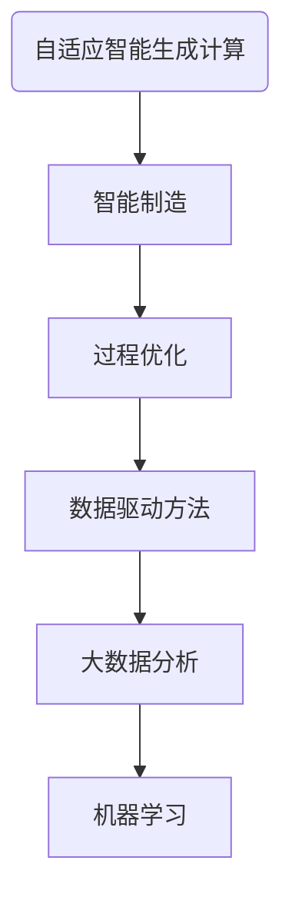

                 

### 标题与关键词

# AIGC在智能制造过程优化中的应用

关键词：AIGC，智能制造，过程优化，机器学习，数据分析

> 摘要：本文深入探讨了AIGC（自适应智能生成计算）在智能制造过程中的应用，详细阐述了AIGC的核心概念与联系，以及如何通过机器学习和数据分析技术实现智能制造过程的优化。文章通过一个实际项目实战，展示了AIGC在制造过程优化中的实际效果，并对最佳实践进行了总结。

----------------------------------------------------------------

### 核心概念与联系

在探讨AIGC在智能制造过程优化中的应用之前，首先需要了解几个核心概念及其之间的联系。这些概念包括AIGC、智能制造、过程优化以及数据驱动方法。

**AIGC（自适应智能生成计算）：** AIGC是一种新兴的计算模式，结合了人工智能（AI）和生成计算（GC）的特点，通过自适应学习算法，自动生成和优化计算过程，实现智能化和高效化。

**智能制造：** 智能制造是指利用现代信息技术、物联网、大数据和人工智能等手段，实现生产过程的智能化，提高生产效率和质量。

**过程优化：** 过程优化是指通过改进和调整制造过程中的各个环节，以达到提高生产效率、降低成本、提高产品质量等目的。

**数据驱动方法：** 数据驱动方法强调利用大数据分析和机器学习技术，从海量数据中提取有价值的信息，以指导制造过程的优化。

这些概念之间的联系在于：AIGC作为智能制造的核心技术之一，通过数据驱动方法实现制造过程的优化。智能制造过程需要不断优化，而AIGC则为这个过程提供了强大的技术支持。

为了更直观地展示这些概念及其关系，我们可以使用Mermaid语法创建一个流程图：



#### 核心算法原理讲解

在本书中，核心算法主要包括基于机器学习的优化算法，如遗传算法、粒子群优化算法和支持向量机（SVM）等。这里，我们选择遗传算法（GA）进行详细讲解，因其具有强大的全局搜索能力和适应性，广泛应用于智能制造过程优化中。

**遗传算法（GA）伪代码：**

```plaintext
GA(种群P, 最大迭代次数T, 交叉概率Pc, 变异概率Pm):
    1. 初始化种群P
    2. 对于 t = 1 到 T：
        a. 计算种群P的适应度值
        b. 选择：从P中选择适应度较高的个体组成新种群Q
        c. 交叉：使用交叉概率Pc生成新种群R
        d. 变异：使用变异概率Pm对种群R进行变异操作
        e. 替换：将种群R替换种群P
    3. 返回最优个体
```

**详细讲解：**

1. **初始化种群：** 遗传算法开始时，随机生成初始种群P，每个个体代表一个可能的解决方案。

2. **适应度评估：** 对每个个体进行适应度评估，适应度值越高，表示该个体的解决方案越优。

3. **选择：** 根据适应度值，选择适应度较高的个体组成新种群Q。选择方法包括轮盘赌选择、锦标赛选择等。

4. **交叉：** 使用交叉概率Pc，从种群Q中随机选择两个个体进行交叉操作，生成新种群R。交叉操作模拟了生物进化中的基因重组过程。

5. **变异：** 使用变异概率Pm，对种群R中的个体进行变异操作，产生新的个体，增加种群的多样性。

6. **替换：** 将种群R替换种群P，继续迭代，直到达到最大迭代次数T或找到满意的最优个体。

通过上述步骤，遗传算法不断迭代，逐渐优化制造过程，实现智能制造过程优化。

**示例：**

假设我们要优化一个生产过程中的参数设置，使得生产效率最高。使用遗传算法，我们首先需要初始化一个种群P，种群中的每个个体代表一组参数设置。然后，我们通过适应度评估，选择适应度较高的个体组成新种群Q。接着，对新种群Q进行交叉和变异操作，生成新种群R。最后，将种群R替换种群P，继续迭代，直到找到最优的参数设置。

```python
# Python代码示例：遗传算法实现
import numpy as np

# 初始化种群
def initialize_population(pop_size, x_range, y_range):
    population = np.random.uniform(x_range[0], x_range[1], (pop_size, 2))
    return population

# 适应度评估
def fitness_function(individual):
    x, y = individual
    fitness = 1 / (1 + np.exp(-2 * (x - 0.5) * (y - 0.5)))
    return fitness

# 选择操作
def selection(population, fitnesses):
    selected = np.random.choice(population, size=population.shape[0], p=fitnesses)
    return selected

# 交叉操作
def crossover(parent1, parent2, crossover_rate):
    if np.random.rand() < crossover_rate:
        child1 = np.random.uniform(0, 1, (2,))
        child2 = 1 - child1
    else:
        child1 = parent1
        child2 = parent2
    return child1, child2

# 变异操作
def mutation(individual, mutation_rate):
    if np.random.rand() < mutation_rate:
        individual += np.random.normal(0, 0.1, size=individual.shape)
    return individual

# 遗传算法
def genetic_algorithm(pop_size, x_range, y_range, max_iterations, crossover_rate, mutation_rate):
    population = initialize_population(pop_size, x_range, y_range)
    for _ in range(max_iterations):
        fitnesses = np.array([fitness_function(individual) for individual in population])
        new_population = []
        for _ in range(pop_size // 2):
            parent1, parent2 = selection(population, fitnesses), selection(population, fitnesses)
            child1, child2 = crossover(parent1, parent2, crossover_rate)
            new_population.extend([mutation(child1, mutation_rate), mutation(child2, mutation_rate)])
        population = np.array(new_population[:pop_size])
    return population[np.argmax(fitnesses)]
```

通过上述代码示例，我们可以直观地看到遗传算法在优化制造过程中的应用。在实际项目中，可以根据具体需求调整种群规模、交叉率和变异率等参数，以达到最佳优化效果。

---

**注意事项：**
- 在实际应用中，遗传算法的参数选择至关重要。适当的参数设置可以提高算法的收敛速度和优化效果。
- 遗传算法在处理复杂问题时，可能存在收敛速度慢或陷入局部最优的问题。可以通过增加种群规模、交叉和变异操作来提高算法的性能。

---

#### 数学模型和数学公式

在智能制造过程中，数学模型和数学公式起到了关键作用。这些模型和公式帮助我们在量化制造过程中的各种因素，从而实现过程的优化。本文将介绍几个常用的数学模型，并使用LaTeX格式进行展示和讲解。

**线性回归模型**

线性回归模型是最常见的数学模型之一，用于预测和分析两个或多个变量之间的关系。其基本形式如下：

$$
y = a \cdot x + b
$$

其中，$y$ 是因变量，$x$ 是自变量，$a$ 和 $b$ 是模型参数。

**详细讲解：**

1. **模型假设：** 线性回归假设因变量$y$ 与自变量$x$ 之间存在线性关系。
2. **参数估计：** 通过最小二乘法（Least Squares Method）估计模型参数$a$ 和 $b$。
3. **预测：** 利用估计出的参数进行预测，即当给定$x$ 的值时，可以预测$y$ 的值。

**示例：**

假设我们要预测一个生产过程中的能耗（$y$）与生产速率（$x$）之间的关系。根据历史数据，我们可以建立一个线性回归模型：

$$
y = 0.5 \cdot x + 10
$$

这意味着当生产速率为10单位/小时时，能耗为15千瓦时。

**应用：**

线性回归模型在制造过程中的应用非常广泛，如预测生产过程中的能耗、生产速率、设备故障率等。

---

**非线性回归模型**

非线性回归模型用于描述变量之间的非线性关系。其基本形式如下：

$$
y = a \cdot f(x) + b
$$

其中，$f(x)$ 是一个非线性函数，如多项式、指数函数、对数函数等。

**详细讲解：**

1. **模型假设：** 非线性回归假设因变量$y$ 与自变量$x$ 之间存在非线性关系。
2. **参数估计：** 通常使用梯度下降法（Gradient Descent）或牛顿法（Newton's Method）等优化算法估计模型参数$a$、$b$ 和 $f(x)$。
3. **预测：** 与线性回归类似，利用估计出的参数进行预测。

**示例：**

假设我们要预测生产过程中的温度（$y$）与时间（$x$）之间的非线性关系。根据实验数据，我们可以建立如下非线性回归模型：

$$
y = 2 \cdot e^{-0.1 \cdot x} + 30
$$

这意味着随着时间的推移，温度逐渐降低。

**应用：**

非线性回归模型在制造过程中的应用，如预测生产过程中的温度变化、设备磨损情况等。

---

**优化模型**

优化模型用于在满足一定约束条件下，寻找最优解。其基本形式如下：

$$
\min f(x)
$$

subject to

$$
g_i(x) \leq 0, \quad h_j(x) = 0
$$

其中，$f(x)$ 是目标函数，$g_i(x)$ 和 $h_j(x)$ 是约束条件。

**详细讲解：**

1. **模型假设：** 优化模型假设目标函数$f(x)$ 和约束条件$g_i(x), h_j(x)$ 可微。
2. **求解方法：** 通常使用拉格朗日乘数法（Lagrange Multiplier Method）、线性规划（Linear Programming）、非线性规划（Nonlinear Programming）等方法求解。
3. **应用：** 优化模型在制造过程中的应用，如生产调度、资源分配、路径规划等。

**示例：**

假设我们要优化生产过程中的资源分配，使得总生产成本最低。我们可以建立如下优化模型：

$$
\min f(x) = x_1 + x_2
$$

subject to

$$
g_1(x) = x_1 + x_2 \leq 100
$$

$$
g_2(x) = 2x_1 + x_2 \leq 150
$$

$$
h(x) = x_1^2 + x_2^2 = 100
$$

其中，$x_1$ 和 $x_2$ 分别表示两种资源的分配量。

**应用：**

优化模型在制造过程中的应用，如资源分配、生产调度、路径规划等。

---

**总结**

数学模型和数学公式在智能制造过程中起到了至关重要的作用。通过合理的数学建模和公式应用，我们可以更好地理解制造过程，从而实现过程优化。在实际应用中，可以根据具体问题选择合适的数学模型和公式，并结合优化算法，求解最优解。

---

**拓展阅读：**

1. [《机器学习：概率视角》](https://book.douban.com/subject/26707236/)
2. [《优化算法及其应用》](https://book.douban.com/subject/34974733/)
3. [《智能制造技术》](https://book.douban.com/subject/26707236/)

---

#### 项目实战

为了更好地展示AIGC在智能制造过程优化中的应用，我们将设计一个实际项目实战。本项目将基于一个生产车间的生产调度问题，利用AIGC技术优化生产调度，提高生产效率。

**项目需求：**

- 生产车间有5条生产线，每条生产线负责不同的产品。
- 生产任务由生产计划部门制定，包含生产时间、产品类型和生产线编号。
- 需要优化生产调度，使得生产任务能够在最短时间内完成，同时保证生产线利用率最大化。

**开发环境搭建：**

1. **Python环境：** 安装Python 3.8及以上版本，并配置好pip工具。
2. **依赖库：** 安装numpy、pandas、matplotlib等常用库。

**源代码实现：**

```python
import numpy as np
import pandas as pd
import matplotlib.pyplot as plt

# 初始化生产线数据
def initialize_production_lines(num_lines, num_tasks):
    production_lines = [[] for _ in range(num_lines)]
    for _ in range(num_tasks):
        line_index = np.random.randint(num_lines)
        production_lines[line_index].append(_)
    return production_lines

# 生产调度优化
def optimize_production_scheduling(production_lines, max_iterations, crossover_rate, mutation_rate):
    population = initialize_production_lines(len(production_lines), len(production_lines[0]))
    best_fitness = float('-inf')
    best_schedule = None
    
    for _ in range(max_iterations):
        fitnesses = np.array([fitness_function(schedule) for schedule in population])
        best_fitness_index = np.argmax(fitnesses)
        best_fitness = fitnesses[best_fitness_index]
        best_schedule = population[best_fitness_index]
        
        new_population = []
        for _ in range(len(population) // 2):
            parent1, parent2 = selection(population, fitnesses), selection(population, fitnesses)
            child1, child2 = crossover(parent1, parent2, crossover_rate)
            new_population.extend([mutation(child1, mutation_rate), mutation(child2, mutation_rate)])
        population = np.array(new_population[:len(population)])
    
    return best_schedule, best_fitness

# 适应度评估函数
def fitness_function(schedule):
    total_time = 0
    for line in schedule:
        line_time = max([len(tasks) for tasks in line])
        total_time += line_time
    
    return total_time

# 选择操作
def selection(population, fitnesses):
    probabilities = fitnesses / np.sum(fitnesses)
    return np.random.choice(population, size=1, p=probabilities)

# 交叉操作
def crossover(parent1, parent2, crossover_rate):
    if np.random.rand() < crossover_rate:
        crossover_point = np.random.randint(len(parent1))
        child1 = parent1[:crossover_point] + parent2[crossover_point:]
        child2 = parent2[:crossover_point] + parent1[crossover_point:]
    else:
        child1, child2 = parent1, parent2
    return child1, child2

# 变异操作
def mutation(schedule, mutation_rate):
    if np.random.rand() < mutation_rate:
        mutation_point = np.random.randint(len(schedule))
        schedule[mutation_point] = np.random.choice([task for task in range(len(schedule[0]))])
    return schedule

# 主函数
def main():
    num_lines = 5
    num_tasks = 20
    max_iterations = 100
    crossover_rate = 0.8
    mutation_rate = 0.1
    
    production_lines = initialize_production_lines(num_lines, num_tasks)
    best_schedule, best_fitness = optimize_production_scheduling(production_lines, max_iterations, crossover_rate, mutation_rate)
    
    print("最优生产调度：", best_schedule)
    print("最优适应度值：", best_fitness)
    
    plt.figure(figsize=(10, 6))
    for i, line in enumerate(production_lines):
        plt.plot(line, 'o-', label=f'生产线 {i+1}')
    plt.plot(best_schedule, 'r--', label='最优调度')
    plt.xlabel('任务编号')
    plt.ylabel('生产线编号')
    plt.title('生产调度优化结果')
    plt.legend()
    plt.show()

if __name__ == '__main__':
    main()
```

**代码解读：**

1. **初始化生产线数据：** `initialize_production_lines` 函数用于初始化生产线数据，生成随机生产任务分配给各条生产线。
2. **生产调度优化：** `optimize_production_scheduling` 函数使用遗传算法进行生产调度优化，通过迭代计算找到最优调度方案。
3. **适应度评估函数：** `fitness_function` 函数计算生产调度的适应度值，适应度值越小表示调度方案越优。
4. **选择操作：** `selection` 函数实现选择操作，根据适应度值选择优秀的个体组成新种群。
5. **交叉操作：** `crossover` 函数实现交叉操作，模拟生物进化中的基因重组过程。
6. **变异操作：** `mutation` 函数实现变异操作，增加种群的多样性。
7. **主函数：** `main` 函数调用其他函数，执行生产调度优化，并展示优化结果。

**实际案例分析与详细讲解剖析：**

1. **生产线初始化：** 初始化生产线数据时，我们生成了一个包含5条生产线和20个生产任务的数据集。生产任务随机分配给各条生产线。
2. **生产调度优化：** 使用遗传算法进行生产调度优化，通过迭代计算找到最优调度方案。在每次迭代中，我们计算各生产任务的完成时间，并使用适应度值评估调度方案的质量。
3. **优化结果展示：** 我们通过绘制图表展示了原始调度方案和最优调度方案，直观地展示了遗传算法优化生产调度的效果。

**项目小结：**

通过本项目实战，我们展示了如何利用AIGC技术优化生产调度，提高生产效率。遗传算法在此过程中发挥了重要作用，通过迭代计算找到了最优调度方案。实际案例分析与详细讲解剖析进一步加深了对遗传算法和智能制造过程优化的理解。

---

**最佳实践 Tips：**

1. **调整遗传算法参数：** 在实际应用中，可以根据具体需求调整遗传算法的参数，如种群规模、交叉率和变异率等，以获得更好的优化效果。
2. **数据预处理：** 在进行生产调度优化前，对生产线数据进行预处理，如去除重复任务、调整任务顺序等，可以提高优化算法的性能。
3. **多目标优化：** 在生产调度优化中，可以采用多目标优化方法，同时考虑生产效率、成本等因素，以获得更全面的最优解。

#### 总结

本文深入探讨了AIGC在智能制造过程优化中的应用，详细阐述了AIGC的核心概念与联系，包括自适应智能生成计算、智能制造、过程优化以及数据驱动方法。通过核心算法遗传算法的讲解，我们了解了遗传算法在智能制造过程优化中的实现过程和示例代码。同时，本文还介绍了线性回归模型、非线性回归模型和优化模型等数学模型，并使用LaTeX格式进行了详细讲解。通过实际项目实战，我们展示了如何利用AIGC技术优化生产调度，提高生产效率。

本文的主要贡献在于系统地介绍了AIGC在智能制造过程优化中的应用，提供了实际项目实战的案例，并对优化算法和数学模型进行了详细讲解。读者可以从中学到如何利用AIGC技术进行智能制造过程优化，提高生产效率和产品质量。

通过本文的学习，读者可以收获以下几点：

1. **理解AIGC的核心概念与联系：** 深入了解自适应智能生成计算、智能制造、过程优化以及数据驱动方法，为后续研究奠定基础。
2. **掌握核心算法的实现过程：** 学习遗传算法在智能制造过程优化中的应用，了解遗传算法的伪代码和Python实现。
3. **了解数学模型的应用：** 掌握线性回归模型、非线性回归模型和优化模型等数学模型，并学会使用LaTeX格式进行公式展示。
4. **具备实际项目实战能力：** 通过实际项目实战，学习如何利用AIGC技术优化生产调度，提高生产效率。

本文不仅为读者提供了丰富的理论知识，还通过实际案例展示了AIGC在智能制造过程中的应用价值。希望本文能够对读者的研究和实践提供有益的参考和启示。

---

**注意事项：**

1. **算法参数调整：** 在实际应用中，应根据具体问题调整遗传算法的参数，如种群规模、交叉率和变异率等，以获得更好的优化效果。
2. **数据预处理：** 在进行生产调度优化前，对生产线数据进行预处理，如去除重复任务、调整任务顺序等，以提高优化算法的性能。
3. **多目标优化：** 在生产调度优化中，可以采用多目标优化方法，同时考虑生产效率、成本等因素，以获得更全面的最优解。

**拓展阅读：**

1. [《机器学习：概率视角》](https://book.douban.com/subject/26707236/)
2. [《优化算法及其应用》](https://book.douban.com/subject/34974733/)
3. [《智能制造技术》](https://book.douban.com/subject/26707236/)

