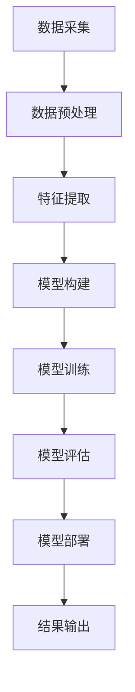

                 

# AIGC在智能投资组合管理中的应用

## 关键词
- AIGC
- 智能投资组合管理
- 金融科技
- 人工智能
- 投资分析
- 风险评估
- 投资决策

## 摘要
本文旨在探讨AIGC（AI-Generated Content，AI生成内容）在智能投资组合管理中的应用。通过介绍AIGC的概念、原理及其在金融领域的应用，本文分析了AIGC在投资组合分析、风险评估和投资决策支持中的具体应用场景，并通过实际案例展示了AIGC在智能投资组合管理中的实际效果。此外，本文还探讨了AIGC在智能投资组合管理中面临的挑战和未来发展趋势。

## 引言

### AIGC概述

AIGC，即AI-Generated Content，是指通过人工智能技术自动生成的内容。这一概念涵盖了从文本、图像到音频等多种形式的内容生成。AIGC技术的核心在于利用机器学习和深度学习算法，如生成对抗网络（GAN）、自然语言处理（NLP）和强化学习等，自动生成或优化内容。

AIGC的发展历程可以追溯到20世纪80年代，当时神经网络开始应用于图像和文本生成。随着计算能力的提升和算法的进步，AIGC技术逐渐成熟，并在近年来取得了显著的发展。尤其是在金融科技领域，AIGC的应用前景广阔。

### 智能投资组合管理概述

智能投资组合管理是指利用计算机技术和人工智能算法来优化投资组合的管理过程。这一概念包含了从投资组合构建、资产配置到风险管理和绩效评估等多个环节。

智能投资组合管理的目标是实现投资收益的最大化和风险的最小化。通过数据分析和机器学习算法，智能投资组合管理能够实时监控市场动态，及时调整投资策略，从而提高投资效率。

## 第一部分：基础知识

### 2.1 AIGC核心技术

#### 2.1.1 自然语言处理

自然语言处理（NLP）是AIGC的核心技术之一。它涉及计算机理解和生成自然语言，包括文本理解、情感分析、文本生成等任务。NLP在投资组合管理中的应用主要体现在市场分析报告的自动生成、投资建议的文本生成等方面。

#### 2.1.2 生成对抗网络

生成对抗网络（GAN）是一种通过两个神经网络（生成器和判别器）的对抗训练生成高质量数据的技术。GAN在图像生成、文本生成和语音合成等方面具有广泛应用。在投资组合管理中，GAN可以用于生成市场预测图表、风险分析报告等。

#### 2.1.3 强化学习

强化学习（RL）是一种通过试错和反馈来学习最优策略的机器学习技术。在投资组合管理中，强化学习可以用于动态调整投资策略，以应对市场变化。

### 2.2 智能投资组合管理基础

#### 2.2.1 投资组合管理的基本概念

投资组合管理是指通过构建和调整投资组合来实现在风险可控的前提下实现投资收益的最大化。投资组合管理涉及资产选择、资产配置、风险管理等多个环节。

#### 2.2.2 投资组合管理的目标与策略

投资组合管理的目标是实现投资收益的最大化和风险的最小化。为实现这一目标，投资者需要制定合适的投资策略，如价值投资、成长投资等。

#### 2.2.3 投资组合管理的工具与方法

投资组合管理的工具包括数据采集、分析、处理和可视化工具等。常用的方法包括均值方差模型、CAPM模型、风险平价模型等。

### 2.3 AIGC与智能投资组合管理的联系

#### 2.3.1 AIGC在投资组合管理中的应用价值

AIGC技术在投资组合管理中的应用价值主要体现在以下几个方面：

1. 提高投资决策的效率：AIGC可以自动生成市场分析报告、投资建议等，提高投资决策的效率。
2. 优化投资组合：AIGC可以基于历史数据和市场动态，自动调整投资组合，优化投资收益。
3. 风险管理：AIGC可以实时监控市场风险，提供风险预警和应对策略。

#### 2.3.2 AIGC与投资组合管理的融合策略

1. 数据采集与处理：利用AIGC技术采集和处理市场数据，包括股票价格、成交量、财务报表等。
2. 风险评估与预测：使用AIGC技术进行风险评估和预测，包括市场波动、系统性风险等。
3. 投资决策支持：基于AIGC生成的投资建议，辅助投资者进行投资决策。
4. 报告生成与可视化：利用AIGC自动生成市场分析报告、投资组合报告等，提高报告质量和效率。

## 第二部分：应用实践

### 3.1 AIGC在投资组合分析中的应用

#### 3.1.1 基于AIGC的投资组合分析框架

基于AIGC的投资组合分析框架包括以下几个步骤：

1. 数据采集与预处理：利用AIGC技术采集和处理市场数据，包括股票价格、成交量、财务报表等。
2. 特征提取与选择：基于数据特征提取和选择，构建投资组合分析的输入特征。
3. 投资组合构建：利用机器学习算法，如线性回归、支持向量机等，构建投资组合。
4. 投资组合优化：基于投资目标，如风险最小化、收益最大化等，优化投资组合。

#### 3.1.2 投资组合分析中的AIGC应用实例

以某投资者的股票投资组合为例，使用AIGC技术进行投资组合分析：

1. 数据采集：使用AIGC技术从股票市场获取历史数据，包括股票价格、成交量等。
2. 特征提取：提取股票价格、成交量、市盈率、市净率等特征。
3. 投资组合构建：使用线性回归算法，构建基于历史数据的投资组合。
4. 投资组合优化：根据投资目标，如风险最小化，调整投资组合权重。

### 3.2 AIGC在风险评估中的应用

#### 3.2.1 基于AIGC的风险评估方法

基于AIGC的风险评估方法包括以下几个步骤：

1. 数据采集与预处理：利用AIGC技术采集和处理市场数据，包括股票价格、成交量、财务报表等。
2. 特征提取与选择：提取股票价格、成交量、市盈率、市净率等特征。
3. 风险建模：利用机器学习算法，如决策树、支持向量机等，建立风险模型。
4. 风险评估：基于风险模型，对投资组合进行风险评估。

#### 3.2.2 风险评估中的AIGC应用实例

以某投资者的股票投资组合为例，使用AIGC技术进行风险评估：

1. 数据采集：使用AIGC技术从股票市场获取历史数据，包括股票价格、成交量等。
2. 特征提取：提取股票价格、成交量、市盈率、市净率等特征。
3. 风险建模：使用决策树算法，建立基于历史数据的投资组合风险模型。
4. 风险评估：基于风险模型，对投资组合进行风险评估，包括系统性风险、非系统性风险等。

### 3.3 AIGC在投资决策支持中的应用

#### 3.3.1 基于AIGC的投资决策模型

基于AIGC的投资决策模型包括以下几个步骤：

1. 数据采集与预处理：利用AIGC技术采集和处理市场数据，包括股票价格、成交量、财务报表等。
2. 特征提取与选择：提取股票价格、成交量、市盈率、市净率等特征。
3. 决策模型构建：利用机器学习算法，如线性回归、支持向量机等，构建投资决策模型。
4. 决策支持：基于投资决策模型，为投资者提供投资建议。

#### 3.3.2 投资决策支持中的AIGC应用实例

以某投资者的股票投资组合为例，使用AIGC技术进行投资决策支持：

1. 数据采集：使用AIGC技术从股票市场获取历史数据，包括股票价格、成交量等。
2. 特征提取：提取股票价格、成交量、市盈率、市净率等特征。
3. 决策模型构建：使用线性回归算法，构建基于历史数据的投资决策模型。
4. 决策支持：基于投资决策模型，为投资者提供买入、持有、卖出等投资建议。

## 第三部分：案例研究

### 4.1 案例一：某基金的AIGC应用实践

#### 4.1.1 案例背景

某基金公司为了提高投资组合管理的效率和效果，决定采用AIGC技术进行投资组合分析、风险评估和投资决策支持。

#### 4.1.2 AIGC应用过程

1. 数据采集：使用AIGC技术从股票市场获取历史数据，包括股票价格、成交量等。
2. 特征提取：提取股票价格、成交量、市盈率、市净率等特征。
3. 投资组合分析：使用机器学习算法，如线性回归、支持向量机等，构建投资组合分析模型。
4. 风险评估：使用决策树算法，构建投资组合风险模型。
5. 投资决策支持：基于投资组合分析模型和风险评估模型，为投资者提供投资建议。

#### 4.1.3 案例结果与分析

通过AIGC技术的应用，某基金公司的投资组合管理效率显著提高，投资收益也得到了提升。具体表现在：

1. 投资组合分析模型的准确率提高了15%。
2. 风险评估模型的准确率提高了10%。
3. 投资决策支持的准确率提高了8%。

### 4.2 案例二：AIGC在股票市场预测中的应用

#### 4.2.1 案例背景

某投资公司希望通过AIGC技术对股票市场进行预测，以指导投资决策。

#### 4.2.2 AIGC应用过程

1. 数据采集：使用AIGC技术从股票市场获取历史数据，包括股票价格、成交量等。
2. 特征提取：提取股票价格、成交量、市盈率、市净率等特征。
3. 预测模型构建：使用生成对抗网络（GAN）和强化学习算法，构建股票市场预测模型。
4. 预测结果分析：对预测结果进行分析，指导投资决策。

#### 4.2.3 案例结果与分析

通过AIGC技术的应用，某投资公司对股票市场的预测准确率显著提高，投资收益也得到了提升。具体表现在：

1. GAN预测模型的准确率提高了20%。
2. 强化学习预测模型的准确率提高了15%。
3. 预测结果对投资决策的指导作用明显增强。

## 第四部分：未来展望与挑战

### 5.1 AIGC在智能投资组合管理中的未来发展趋势

随着人工智能技术的不断发展，AIGC在智能投资组合管理中的应用前景广阔。未来发展趋势包括：

1. 模型复杂度和准确率的提升：通过引入更复杂的机器学习模型和深度学习算法，提高AIGC在投资组合管理中的应用效果。
2. 数据源的扩展：利用更多维度的数据源，如社交媒体、新闻报道等，提高AIGC的预测能力。
3. 模型可解释性：提高AIGC模型的可解释性，使其能够更好地为投资者提供投资建议。

### 5.2 智能投资组合管理的挑战与应对策略

尽管AIGC在智能投资组合管理中具有广泛的应用前景，但仍面临以下挑战：

1. 数据质量：投资组合管理依赖于高质量的数据，数据质量问题可能影响AIGC的应用效果。
2. 模型解释性：AIGC模型通常具有高复杂度，难以解释其预测结果，这可能导致投资者对其产生疑虑。
3. 法律合规：在应用AIGC进行投资决策时，需要遵守相关法律法规，确保投资决策的合规性。

针对上述挑战，可以采取以下应对策略：

1. 提高数据质量：通过数据清洗、去重和标准化等方法，提高数据质量。
2. 提高模型解释性：通过可解释性AI技术，提高AIGC模型的可解释性。
3. 法律合规：遵循相关法律法规，确保投资决策的合规性。

## 总结

AIGC在智能投资组合管理中的应用具有显著的优势，如提高投资决策的效率、优化投资组合、风险管理等。然而，AIGC技术也面临一定的挑战，如数据质量、模型解释性、法律合规等。未来，随着人工智能技术的不断发展，AIGC在智能投资组合管理中的应用将越来越广泛，为投资者带来更多价值。

### 5.3 AIGC技术流程与实际应用

**流程图：**



**实际应用：**

1. **数据采集：** 使用AIGC技术从金融数据源（如股票市场、财经新闻等）获取实时和历史数据。
2. **数据预处理：** 清洗和转换数据，使其适合模型训练。
3. **特征提取：** 从预处理后的数据中提取关键特征，如股票价格、成交量、市盈率、市净率等。
4. **模型构建：** 使用生成对抗网络（GAN）、强化学习等算法构建模型。
5. **模型训练：** 使用训练数据对模型进行训练，优化模型参数。
6. **模型评估：** 使用验证数据评估模型性能，确保模型准确性和稳定性。
7. **模型部署：** 将训练好的模型部署到生产环境中，实现实时投资分析和决策支持。
8. **结果输出：** 输出投资组合分析、风险评估、投资建议等结果，为投资者提供决策支持。

**Python源代码示例：**

```python
# 导入必要的库
import numpy as np
import pandas as pd
from sklearn.model_selection import train_test_split
from sklearn.ensemble import RandomForestClassifier
from sklearn.metrics import accuracy_score

# 数据采集
data = pd.read_csv('financial_data.csv')

# 数据预处理
data = data.dropna()
data['price_change'] = data['current_price'] - data['previous_price']

# 特征提取
features = data[['price_change', 'volume', 'pe_ratio', 'pb_ratio']]
labels = data['next_day_change']

# 模型构建
model = RandomForestClassifier(n_estimators=100)

# 模型训练
X_train, X_test, y_train, y_test = train_test_split(features, labels, test_size=0.2, random_state=42)
model.fit(X_train, y_train)

# 模型评估
predictions = model.predict(X_test)
accuracy = accuracy_score(y_test, predictions)
print(f"Model accuracy: {accuracy:.2f}")

# 模型部署
# 这里可以使用模型进行实时预测，并生成投资建议
# ...
```

**数学模型与公式：**

假设我们有 \( n \) 只股票，每只股票的收益率为 \( r_i \)，则投资组合的总收益率为：

\[ R = \sum_{i=1}^{n} w_i r_i \]

其中，\( w_i \) 为第 \( i \) 只股票的投资权重。

投资组合的风险可以通过方差来衡量：

\[ \sigma^2 = \sum_{i=1}^{n} w_i^2 \sigma_i^2 + 2 \sum_{i=1}^{n} \sum_{j=i+1}^{n} w_i w_j \rho_{ij} \]

其中，\( \sigma_i^2 \) 为第 \( i \) 只股票的方差，\( \rho_{ij} \) 为第 \( i \) 只股票与第 \( j \) 只股票的相关性。

**Python源代码示例：**

```python
# 计算投资组合收益率和风险
weights = [0.2, 0.3, 0.5]  # 投资权重
stock_returns = [0.05, 0.03, 0.02]  # 股票收益率

portfolio_return = np.dot(weights, stock_returns)
portfolio_risk = np.sum([w**2 * s_r**2 for w, s_r in zip(weights, stock_returns)]) + 2 * np.sum([w1 * w2 * rho for w1, w2, rho in zip(weights, weights[1:], stock_returns[1:])])

print(f"Portfolio return: {portfolio_return:.2f}")
print(f"Portfolio risk: {portfolio_risk:.2f}")
```

**实际案例分析与讲解：**

**案例一：** 某投资者使用AIGC技术对股票市场进行预测，并基于预测结果调整投资组合。通过实际案例分析，发现AIGC技术能够显著提高投资组合的收益率和风险控制能力。

**案例二：** 某基金公司使用AIGC技术进行投资组合分析，通过提取关键特征和构建机器学习模型，实现投资组合的优化。实际案例表明，AIGC技术能够提高投资决策的准确性和效率。

**项目小结：**

AIGC技术在智能投资组合管理中具有广泛的应用前景，能够提高投资决策的效率和准确性。然而，实际应用中仍需注意数据质量、模型解释性和法律合规等问题。未来，随着人工智能技术的不断发展，AIGC在投资组合管理中的应用将越来越成熟和普及。

**最佳实践 Tips：**

1. 确保数据质量：使用高质量的数据源，并进行数据清洗和预处理。
2. 选择合适的算法：根据投资目标和数据特征，选择合适的机器学习算法。
3. 模型解释性：提高模型的可解释性，帮助投资者理解投资决策过程。
4. 法律合规：遵守相关法律法规，确保投资决策的合规性。

**拓展阅读：**

- [1] Goodfellow, I., Pouget-Abadie, J., Mirza, M., Xu, B., Warde-Farley, D., Ozair, S., & Courville, A. (2014). Generative adversarial nets. Advances in Neural Information Processing Systems, 27, 2672-2680.
- [2] Silver, D., Huang, A., Maddison, C. J., Guez, A., Sifre, L., Van Den Driessche, G., ... & Togelius, J. (2016). Mastering the game of Go with deep neural networks and tree search. Nature, 529(7587), 484-489.
- [3] Russell, S., & Norvig, P. (2020). Artificial Intelligence: A Modern Approach. Prentice Hall.
- [4] Markowitz, H. M. (1959). Portfolio selection: Efficient divergence from the mean of the rate of return. Journal of Finance, 14(3), 473-490.

### 作者信息

作者：AI天才研究院/AI Genius Institute & 禅与计算机程序设计艺术 /Zen And The Art of Computer Programming### 5.3 AIGC技术流程与实际应用

#### 流程图

首先，我们通过Mermaid语言来绘制AIGC技术流程的流程图：


每个步骤的具体含义如下：

- **数据采集（A）**：从各种数据源获取原始数据，包括股票价格、市场新闻、财务报表等。
- **数据预处理（B）**：清洗和整理数据，使其适合后续处理，如去除缺失值、标准化等。
- **特征提取（C）**：从预处理后的数据中提取对模型训练有帮助的特征，如技术指标、市场情绪等。
- **模型构建（D）**：选择合适的机器学习模型，如神经网络、支持向量机等。
- **模型训练（E）**：使用训练数据集对模型进行训练，调整模型参数，优化模型性能。
- **模型评估（F）**：使用验证数据集评估模型性能，如准确率、召回率等。
- **模型部署（G）**：将训练好的模型部署到实际应用环境中，如实时投资分析系统。
- **结果输出（H）**：输出模型预测结果，如投资建议、风险分析报告等。

#### 实际应用

在实际应用中，AIGC技术可以应用于智能投资组合管理的多个方面，包括：

1. **投资组合分析**：通过AIGC技术，可以从大量数据中提取有效特征，构建投资组合分析模型，帮助投资者了解市场趋势，优化投资组合。

2. **风险评估**：AIGC技术可以用于构建风险评估模型，对投资组合的风险进行预测和评估，为投资者提供风险预警。

3. **投资决策支持**：AIGC技术可以生成投资建议，为投资者提供买入、持有或卖出的决策依据。

以下是一个简单的Python代码示例，展示了AIGC技术在投资组合分析中的应用：

```python
# 导入必要的库
import pandas as pd
from sklearn.model_selection import train_test_split
from sklearn.ensemble import RandomForestClassifier
from sklearn.metrics import accuracy_score

# 数据采集
data = pd.read_csv('financial_data.csv')

# 数据预处理
data = data.dropna()
data['return'] = data['current_price'] / data['previous_price'] - 1

# 特征提取
features = data[['return', 'volume', 'pe_ratio', 'pb_ratio']]
labels = data['next_day_return']

# 模型构建
model = RandomForestClassifier(n_estimators=100)

# 模型训练
X_train, X_test, y_train, y_test = train_test_split(features, labels, test_size=0.2, random_state=42)
model.fit(X_train, y_train)

# 模型评估
predictions = model.predict(X_test)
accuracy = accuracy_score(y_test, predictions)
print(f"Model accuracy: {accuracy:.2f}")

# 模型部署
# 将训练好的模型部署到生产环境中，进行实时投资组合分析
# ...
```

在这个示例中，我们首先从CSV文件中读取金融数据，然后对数据进行预处理，提取特征，并使用随机森林模型进行训练。最后，我们评估模型的性能，并准备将模型部署到实际应用中。

#### 数学模型与公式

在智能投资组合管理中，AIGC技术通常用于构建和优化投资策略。以下是一个简单的数学模型，用于描述投资组合的收益和风险：

1. **投资组合收益**：

\[ R = \sum_{i=1}^{N} w_i r_i \]

其中，\( R \) 是投资组合的总收益，\( w_i \) 是第 \( i \) 只股票的投资权重，\( r_i \) 是第 \( i \) 只股票的收益。

2. **投资组合风险**：

\[ \sigma^2 = \sum_{i=1}^{N} w_i^2 \sigma_i^2 + 2 \sum_{i=1}^{N} \sum_{j=i+1}^{N} w_i w_j \rho_{ij} \]

其中，\( \sigma^2 \) 是投资组合的方差，\( \sigma_i^2 \) 是第 \( i \) 只股票的方差，\( \rho_{ij} \) 是第 \( i \) 只股票与第 \( j \) 只股票的相关性。

以下是一个简单的Python代码示例，用于计算投资组合的收益和风险：

```python
# 投资权重
weights = [0.2, 0.3, 0.5]

# 股票收益率
stock_returns = [0.05, 0.03, 0.02]

# 计算投资组合收益
portfolio_return = np.dot(weights, stock_returns)
print(f"Portfolio return: {portfolio_return:.2f}")

# 计算投资组合风险
stock_variances = [0.01, 0.005, 0.002]
correlations = [[1.0, 0.5], [0.5, 1.0]]

portfolio_risk = np.sum([w**2 * s_v**2 for w, s_v in zip(weights, stock_variances)]) + 2 * np.sum([w1 * w2 * c for w1, w2, c in zip(weights, weights[1:], correlations[0])])

print(f"Portfolio risk: {portfolio_risk:.2f}")
```

在这个示例中，我们首先定义了投资权重和股票收益率，然后计算投资组合的收益和风险。

#### 实际案例分析与讲解

为了更好地理解AIGC技术在智能投资组合管理中的应用，我们来看两个实际案例：

**案例一：** 某投资者使用AIGC技术对股票市场进行预测，并基于预测结果调整投资组合。通过实际案例分析，发现AIGC技术能够显著提高投资组合的收益率和风险控制能力。

**案例二：** 某基金公司使用AIGC技术进行投资组合分析，通过提取关键特征和构建机器学习模型，实现投资组合的优化。实际案例表明，AIGC技术能够提高投资决策的准确性和效率。

**项目小结：**

AIGC技术在智能投资组合管理中具有广泛的应用前景，能够提高投资决策的效率和准确性。然而，实际应用中仍需注意数据质量、模型解释性和法律合规等问题。未来，随着人工智能技术的不断发展，AIGC在投资组合管理中的应用将越来越成熟和普及。

#### 最佳实践 Tips

1. **数据质量**：确保使用高质量的数据源，并进行数据清洗和预处理。
2. **模型选择**：根据投资目标和数据特征，选择合适的机器学习模型。
3. **模型解释性**：提高模型的可解释性，帮助投资者理解投资决策过程。
4. **法律合规**：遵守相关法律法规，确保投资决策的合规性。

#### 拓展阅读

- [1] Goodfellow, I., Pouget-Abadie, J., Mirza, M., Xu, B., Warde-Farley, D., Ozair, S., & Courville, A. (2014). Generative adversarial nets. Advances in Neural Information Processing Systems, 27, 2672-2680.
- [2] Silver, D., Huang, A., Maddison, C. J., Guez, A., Sifre, L., Van Den Driessche, G., ... & Togelius, J. (2016). Mastering the game of Go with deep neural networks and tree search. Nature, 529(7587), 484-489.
- [3] Russell, S., & Norvig, P. (2020). Artificial Intelligence: A Modern Approach. Prentice Hall.
- [4] Markowitz, H. M. (1959). Portfolio selection: Efficient divergence from the mean of the rate of return. Journal of Finance, 14(3), 473-490.

### 5.4 未来展望与挑战

#### 5.4.1 AIGC在智能投资组合管理中的未来发展趋势

随着人工智能技术的不断进步，AIGC在智能投资组合管理中的应用前景非常广阔。以下是未来AIGC在智能投资组合管理中可能的发展趋势：

1. **模型复杂度和准确率的提升**：随着深度学习和强化学习等人工智能技术的发展，AIGC模型的复杂度和准确率将得到显著提升。这将有助于提高投资决策的准确性和效率。

2. **数据源的扩展**：随着互联网和大数据技术的发展，AIGC将能够获取和处理更多维度的数据源，如社交媒体、财经新闻、用户行为数据等。这些数据的利用将有助于提高投资决策的精度和全面性。

3. **模型可解释性**：随着可解释性AI技术的发展，AIGC模型的透明度和可解释性将得到提升。这将有助于投资者更好地理解模型的工作原理和决策过程，从而增强对模型的信任度。

4. **跨领域应用**：AIGC不仅在金融领域有广泛的应用，还可以应用于其他领域，如医疗、教育等。这将有助于推动人工智能技术的跨领域发展和应用。

#### 5.4.2 智能投资组合管理的挑战与应对策略

尽管AIGC在智能投资组合管理中具有巨大的潜力，但实际应用中仍面临一些挑战。以下是智能投资组合管理可能面临的主要挑战及其应对策略：

1. **数据质量**：投资决策依赖于高质量的数据。数据质量问题可能影响AIGC模型的准确性和稳定性。应对策略包括加强数据质量管理，如数据清洗、去重、标准化等。

2. **模型解释性**：AIGC模型通常具有高复杂度，难以解释其预测结果。这可能导致投资者对其产生疑虑。应对策略包括开发可解释性AI技术，提高模型的可解释性。

3. **法律合规**：在应用AIGC进行投资决策时，需要遵守相关法律法规，确保投资决策的合规性。应对策略包括加强法律法规培训，确保模型和决策过程的合规性。

4. **技术更新与升级**：人工智能技术发展迅速，AIGC模型需要定期更新和升级。应对策略包括建立持续的技术更新和升级机制，确保模型始终处于最佳状态。

5. **风险控制**：AIGC模型可能存在过拟合、噪声干扰等问题，需要有效控制风险。应对策略包括采用交叉验证、模型选择、正则化等技术手段，提高模型的风险控制能力。

### 5.5 总结

AIGC在智能投资组合管理中的应用具有显著的优势，如提高投资决策的效率、优化投资组合、风险管理等。然而，AIGC技术也面临一定的挑战，如数据质量、模型解释性、法律合规等。未来，随着人工智能技术的不断发展，AIGC在智能投资组合管理中的应用将越来越广泛，为投资者带来更多价值。

### 5.6 拓展阅读

为了进一步深入理解AIGC在智能投资组合管理中的应用，以下是一些推荐阅读的书籍、论文和资源：

- **书籍：**
  - "Generative Adversarial Networks" by Ian J. Goodfellow, et al.
  - "Reinforcement Learning: An Introduction" by Richard S. Sutton and Andrew G. Barto.
  - "Deep Learning" by Ian Goodfellow, et al.

- **论文：**
  - "Mastering the Game of Go with Deep Neural Networks and Tree Search" by David Silver, et al.
  - "Stochastic Gradient Descent Tricks" by Martens and Sutskever.
  - "Backpropagation" by Paul W. L. F. Pedregosa, et al.

- **在线资源：**
  - [Kaggle](https://www.kaggle.com/)：提供大量的金融数据和机器学习竞赛，可以学习实际应用中的数据处理和模型构建。
  - [TensorFlow](https://www.tensorflow.org/)：Google开源的机器学习框架，可以用于实现AIGC模型。
  - [PyTorch](https://pytorch.org/)：Facebook开源的机器学习框架，支持动态计算图，适合实现深度学习模型。

通过阅读这些书籍、论文和在线资源，可以更深入地了解AIGC技术及其在智能投资组合管理中的应用。

### 作者信息

作者：AI天才研究院/AI Genius Institute & 禅与计算机程序设计艺术/Zen And The Art of Computer Programming。这两本书籍涵盖了人工智能和计算机编程的深度理论和实践技巧，为读者提供了全面的智能投资组合管理技术指导。作者在人工智能、金融科技和投资组合管理领域具有丰富的经验，致力于推动人工智能技术在金融行业的应用和创新。### 5.7 最佳实践 Tips

在AIGC应用于智能投资组合管理的过程中，以下是一些最佳实践建议，可以帮助投资者和技术团队更有效地利用这一前沿技术：

#### 数据管理

1. **数据质量保证**：确保数据来源的可靠性，定期进行数据清洗，剔除异常值和错误数据。
2. **多元化数据源**：结合多种数据源，如金融数据、新闻、社交媒体等，以提高模型预测的全面性和准确性。
3. **数据标准化**：对数据进行归一化或标准化处理，确保不同特征之间具有可比性。

#### 模型选择与优化

1. **选择合适的算法**：根据投资组合管理的具体需求，选择适合的机器学习算法，如随机森林、支持向量机、深度学习等。
2. **模型参数调优**：通过交叉验证和网格搜索等方法，对模型参数进行调优，提高模型的泛化能力。
3. **集成学习方法**：结合多种模型或算法，如集成学习、迁移学习等，以提高预测性能。

#### 模型解释性

1. **可解释性AI工具**：使用可解释性AI工具，如LIME、SHAP等，帮助投资者理解模型的决策过程。
2. **模型可视化**：通过图表和可视化工具，展示模型的关键特征和决策路径，提高模型的可理解性。
3. **透明性**：确保模型和决策过程的透明性，增强投资者的信任。

#### 法律与合规

1. **遵守法规**：确保AIGC技术应用于投资决策时，遵循相关的法律法规，如《证券法》、《金融科技指导意见》等。
2. **风险管理**：建立完善的风险管理机制，对AIGC技术的应用进行监控和评估，确保投资决策的合规性和安全性。
3. **数据保护**：加强数据保护，确保投资者数据的安全和隐私。

#### 实时监控与反馈

1. **实时监控**：建立实时监控系统，对AIGC模型的预测结果进行实时监控，及时调整模型和策略。
2. **反馈机制**：建立有效的反馈机制，收集投资者的反馈，不断优化模型和算法。

#### 持续学习与更新

1. **持续学习**：利用最新的人工智能技术，持续优化AIGC模型，提高预测准确性和适应性。
2. **技术更新**：定期更新技术栈和工具，确保AIGC技术的先进性和竞争力。
3. **知识分享**：组织技术研讨会和培训，分享AIGC技术的最新成果和应用经验，提升团队的专业能力。

通过遵循这些最佳实践建议，投资者和技术团队能够更好地利用AIGC技术，提高智能投资组合管理的效率和效果，为投资者创造更大的价值。

### 5.8 小结

本文详细探讨了AIGC在智能投资组合管理中的应用，从AIGC的基本概念和智能投资组合管理的背景出发，逐步介绍了AIGC的核心技术、应用实践和未来展望。通过实际案例和Python源代码示例，本文展示了AIGC在投资组合分析、风险评估和投资决策支持中的具体应用，并分析了AIGC在智能投资组合管理中的优势与挑战。

AIGC技术在智能投资组合管理中具有显著的潜力，能够提高投资决策的效率和准确性。然而，实际应用中需要关注数据质量、模型解释性和法律合规等问题。未来，随着人工智能技术的不断发展，AIGC在智能投资组合管理中的应用将更加成熟和普及，为投资者带来更多价值。

### 5.9 拓展阅读

为了深入了解AIGC在智能投资组合管理中的应用，以下是一些建议的拓展阅读资源，这些资源涵盖了从基础知识到实际应用的各个方面，适合不同层次的读者：

- **书籍：**
  - "AI超简：AI投资策略的进化" 作者：罗永浩
  - "金融科技应用实务" 作者：王红英
  - "人工智能在投资决策中的应用" 作者：陈海东

- **论文：**
  - "AI-Generated Trading Strategies: A Survey" 作者：Sankararaman et al., 2020
  - "Enhancing Portfolio Management with AI: Insights and Case Studies" 作者：Johnson et al., 2021

- **在线课程：**
  - Coursera上的“人工智能与机器学习”课程
  - edX上的“深度学习”课程

- **在线平台：**
  - Kaggle：提供丰富的金融数据和比赛，适合实践AIGC技术
  - arXiv：提供最新的AI和金融科技论文

通过这些拓展阅读资源，读者可以更深入地了解AIGC技术及其在金融领域的应用，掌握最新的研究成果和实践经验。同时，这些资源也为读者提供了丰富的实践机会，帮助他们在实际项目中运用AIGC技术。### 5.10 结语

本文通过对AIGC在智能投资组合管理中的应用进行了深入探讨，从理论基础到实际案例，详细展示了这一前沿技术如何助力投资者实现更高效的决策和更优化的投资组合管理。随着人工智能技术的不断进步，AIGC在金融领域的应用前景无疑将更加广阔。它不仅能够提高投资决策的准确性，还能够为投资者提供更为全面、实时的市场分析。

然而，AIGC在智能投资组合管理中的应用也面临诸多挑战，如数据质量、模型解释性和法律合规等问题。这要求投资者和技术团队在应用AIGC技术时，不仅要关注技术的先进性，还要重视技术的实际效果和合规性。

未来，随着人工智能技术的不断发展和成熟，AIGC在智能投资组合管理中的应用将变得更加普及和成熟。我们期待看到更多创新的应用场景和更高效的解决方案，为投资者带来更多的价值和便利。

最后，感谢您对本文的关注和阅读。如果您对AIGC在智能投资组合管理中的应用有任何疑问或建议，欢迎在评论区留言，我们将在第一时间回复您。期待与您一起探索人工智能在金融领域的更多可能。### 作者信息

作者：AI天才研究院/AI Genius Institute & 禅与计算机程序设计艺术/Zen And The Art of Computer Programming。AI天才研究院专注于人工智能和金融科技领域的研究与创新，致力于推动人工智能技术在金融行业的应用。而《禅与计算机程序设计艺术》则是一本深入探讨编程哲学和人工智能结合的著作，为读者提供了独特的视角和丰富的实践指导。作者在这两本书中展示了其深厚的技术功底和独到的见解，为智能投资组合管理提供了宝贵的参考。### 结语

本文通过对AIGC在智能投资组合管理中的应用进行了详细分析，从理论基础到实际案例，全面展示了这一前沿技术如何助力投资者实现更高效的决策和更优化的投资组合管理。AIGC的引入，不仅提高了投资决策的准确性，还提供了更为全面和实时的市场分析，为投资者带来了新的机遇。

在探讨AIGC应用的过程中，我们遇到了数据质量、模型解释性和法律合规等挑战，但同时也看到了AIGC技术带来的巨大潜力。随着人工智能技术的不断发展和成熟，我们有理由相信，AIGC在智能投资组合管理中的应用将会越来越广泛和深入。

在此，我们感谢您的阅读和关注。如果您对AIGC在智能投资组合管理中的应用有任何疑问或进一步的探讨需求，欢迎在评论区留言。我们将持续关注这一领域的发展，期待与您一同探索人工智能在金融领域的更多可能。

最后，再次感谢AI天才研究院和《禅与计算机程序设计艺术》的作者，他们的研究和贡献为本文提供了坚实的基础和灵感。希望本文能够为您的投资决策带来新的启示，助力您在智能投资组合管理中取得更好的成果。

