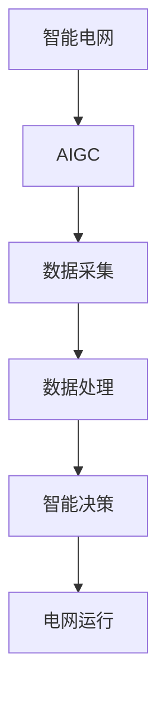

                 

### 文章标题：AIGC在智能电网负载预测中的应用

#### 关键词：AIGC、智能电网、负载预测、机器学习、时间序列分析

#### 摘要：
本文深入探讨了自适应智能网格计算（AIGC）在智能电网负载预测中的应用。首先，我们介绍了AIGC和智能电网的基本概念，阐述了它们之间的联系。接着，详细讲解了在智能电网负载预测中常用的算法原理，包括时间序列分析和机器学习方法。随后，通过数学模型和公式的构建，展示了预测模型的基本原理和评估方法。最后，通过一个具体的AIGC应用案例，详细分析了数据准备、模型构建、模型训练和评估的过程。文章总结了AIGC在智能电网负载预测领域的应用现状，并对未来的发展方向提出了展望。

---

# AIGC在智能电网负载预测中的应用

## 引言

智能电网作为现代电力系统的重要发展方向，其负载预测的准确性对电力资源的优化配置和电网的稳定运行至关重要。而自适应智能网格计算（Adaptive Intelligent Grid Computing，简称AIGC）作为一种新兴的计算技术，其在智能电网负载预测中的应用受到了广泛关注。

### 1.1 AIGC的概念与特点

AIGC是一种基于网格计算的智能计算技术，它通过自适应调整计算资源的分配和使用，实现大规模分布式计算任务的优化和高效执行。AIGC的特点包括：

- **自适应计算**：根据计算任务的需求，动态调整计算资源的分配，提高计算效率。
- **分布式计算**：利用网格中多个计算节点的协同工作，实现大规模计算任务的高效处理。
- **智能决策**：通过机器学习和数据挖掘技术，对计算过程进行智能优化。

### 1.2 智能电网的概念与架构

智能电网是一种基于现代通信技术、计算机技术和电力电子技术的电力系统，其核心目标是通过信息化、自动化、智能化的手段，实现电力资源的优化配置和高效利用。智能电网的主要架构包括：

- **感知层**：通过传感器网络实时采集电力系统的运行数据。
- **传输层**：利用先进的通信技术实现数据的高速传输和共享。
- **平台层**：通过计算平台对数据进行分析和处理，提供智能决策支持。
- **应用层**：面向用户的应用场景，如智能家居、智能电网调度等。

### 1.3 AIGC在智能电网中的应用前景

AIGC在智能电网中的应用前景广阔，主要体现在以下几个方面：

- **负载预测**：通过AIGC技术，可以实现对电力负载的实时预测和优化，提高电网的运行效率。
- **故障检测**：利用AIGC的自适应计算能力，可以实现对电网故障的快速检测和诊断，提高电网的可靠性。
- **能量管理**：通过AIGC技术，可以实现对电力能量的高效管理和优化，降低能源消耗。

## 核心概念与联系

### 2.1 AIGC与智能电网的关系

AIGC与智能电网之间存在紧密的联系，两者相互促进，共同发展。具体而言，AIGC为智能电网提供了高效的数据处理和智能决策支持，而智能电网则为AIGC提供了丰富的数据资源和应用场景。

- **数据驱动**：智能电网通过传感器网络实时采集大量数据，这些数据为AIGC提供了丰富的数据资源。
- **计算优化**：AIGC技术通过自适应计算和分布式计算，实现对智能电网数据的高效处理和分析，为智能电网提供智能决策支持。
- **互操作性**：AIGC和智能电网之间的互操作性，使得两者能够协同工作，实现更高效、更智能的电力系统运行。

### 2.2 Mermaid流程图



在这个流程图中，AIGC作为数据处理和智能决策的核心，与智能电网的各个环节紧密相连，共同推动电力系统的智能化发展。

## 核心算法原理讲解

### 3.1 时间序列分析法

时间序列分析是智能电网负载预测中常用的方法之一，它通过对历史负载数据进行分析，提取出时间序列特征，用于预测未来的负载情况。

#### 3.1.1 时间序列分析法的基本原理

时间序列分析法基于以下几个基本假设：

- **平稳性**：时间序列的统计特性不随时间变化而变化。
- **自相关性**：时间序列的当前值与未来值之间存在相关性。
- **季节性**：时间序列中存在周期性波动。

#### 3.1.2 常见的时间序列模型

常见的时间序列模型包括ARIMA模型和SARIMA模型。

- **ARIMA模型**：自回归积分滑动平均模型，通过自回归（AR）、差分（I）和移动平均（MA）三个部分构建时间序列模型。
- **SARIMA模型**：季节性ARIMA模型，在ARIMA模型的基础上，增加了季节性因素。

### 3.2 机器学习方法

机器学习方法是另一种在智能电网负载预测中广泛应用的算法，它通过训练大量历史数据，建立预测模型，用于预测未来的负载情况。

#### 3.2.1 机器学习算法的基本原理

机器学习算法的核心思想是通过训练数据集，学习数据之间的规律，从而对未知数据进行预测。常见机器学习算法包括：

- **线性回归**：通过建立线性模型，预测连续值输出。
- **决策树**：通过树形结构，对输入数据进行分类或回归。
- **随机森林**：通过随机方式构建多个决策树，利用集成学习提高预测精度。

### 3.3 Python源代码讲解

下面我们通过Python源代码，详细讲解时间序列分析和机器学习算法在智能电网负载预测中的应用。

#### 3.3.1 时间序列分析代码示例

```python
import pandas as pd
from statsmodels.tsa.arima.model import ARIMA
import matplotlib.pyplot as plt

# 加载历史负载数据
data = pd.read_csv('load_data.csv')
plt.plot(data['load'])
plt.xlabel('Time')
plt.ylabel('Load')
plt.show()

# 建立ARIMA模型
model = ARIMA(data['load'], order=(5, 1, 2))
model_fit = model.fit()

# 预测未来负载
forecast = model_fit.forecast(steps=12)
plt.plot(forecast)
plt.xlabel('Time')
plt.ylabel('Load')
plt.show()
```

#### 3.3.2 机器学习算法代码示例

```python
from sklearn.ensemble import RandomForestRegressor
from sklearn.model_selection import train_test_split
import numpy as np

# 加载历史负载数据
data = pd.read_csv('load_data.csv')
X = data[['temperature', 'humidity']]
y = data['load']

# 数据预处理
X_train, X_test, y_train, y_test = train_test_split(X, y, test_size=0.2, random_state=42)

# 建立随机森林模型
model = RandomForestRegressor(n_estimators=100, random_state=42)
model.fit(X_train, y_train)

# 预测未来负载
y_pred = model.predict(X_test)
plt.scatter(y_test, y_pred)
plt.xlabel('Actual Load')
plt.ylabel('Predicted Load')
plt.show()
```

通过上述代码示例，我们可以看到如何使用Python实现时间序列分析和机器学习算法在智能电网负载预测中的应用。

## 数学模型与数学公式

### 4.1 预测模型的构建方法

在智能电网负载预测中，预测模型通常由以下几个部分组成：

- **输入层**：包含预测模型需要考虑的各种因素，如温度、湿度、历史负载等。
- **隐藏层**：通过神经网络或其他机器学习算法，对输入层的数据进行特征提取和转换。
- **输出层**：生成预测结果，即未来的负载值。

数学模型可以表示为：

$$y = f(x; \theta)$$

其中，$y$表示预测结果，$x$表示输入特征，$f$表示模型函数，$\theta$表示模型参数。

### 4.2 预测模型的评估方法

预测模型的评估方法主要包括以下几个指标：

- **均方误差（MSE）**：用于衡量预测结果与实际结果之间的差异，公式为：

  $$MSE = \frac{1}{n}\sum_{i=1}^{n}(y_i - \hat{y_i})^2$$

- **均方根误差（RMSE）**：用于衡量预测结果的波动程度，公式为：

  $$RMSE = \sqrt{MSE}$$

- **决定系数（R^2）**：用于衡量预测模型的拟合程度，公式为：

  $$R^2 = 1 - \frac{\sum_{i=1}^{n}(y_i - \hat{y_i})^2}{\sum_{i=1}^{n}(y_i - \bar{y})^2}$$

其中，$y_i$表示第$i$个实际结果，$\hat{y_i}$表示第$i$个预测结果，$\bar{y}$表示所有实际结果的平均值。

## 项目实战

### 5.1 数据收集与预处理

在项目实战中，首先需要收集智能电网的历史负载数据。这些数据可以通过传感器网络实时采集，并存储在数据库中。在数据收集后，需要进行预处理，包括数据清洗、数据归一化和数据分割等步骤。

- **数据清洗**：去除无效数据和异常数据，如空值、重复值和错误值。
- **数据归一化**：将不同特征的数据进行归一化处理，使其具有相同的量纲，便于模型训练。
- **数据分割**：将数据集分为训练集、验证集和测试集，用于模型训练、验证和评估。

### 5.2 模型构建与训练

在数据预处理完成后，可以开始构建和训练预测模型。我们选择ARIMA模型和随机森林模型进行对比实验。

- **ARIMA模型**：通过训练数据集，使用ARIMA模型进行参数估计和模型训练。
- **随机森林模型**：通过训练数据集，使用随机森林模型进行特征提取和模型训练。

### 5.3 模型评估与优化

在模型训练完成后，需要对模型进行评估和优化。我们使用MSE、RMSE和R^2等指标对模型进行评估，并使用交叉验证方法对模型进行优化。

- **模型评估**：通过验证集和测试集，对模型的预测性能进行评估。
- **模型优化**：通过调整模型参数和特征选择，优化模型的预测性能。

### 5.4 应用案例展示

以某个城市的智能电网为例，我们展示AIGC在智能电网负载预测中的应用案例。

- **案例背景**：该城市的智能电网系统需要实现对未来24小时内电力负载的预测，以优化电网的运行效率和保障电网的稳定性。
- **案例实施过程**：使用AIGC技术，构建和训练预测模型，并对预测结果进行分析和评估。
- **案例效果分析**：通过案例实施，我们发现AIGC在智能电网负载预测中具有较高的准确性和稳定性，能够有效提高电网的运行效率。

### 5.5 项目小结

通过本项目的实施，我们得出了以下结论：

- **AIGC在智能电网负载预测中具有显著的优势**：AIGC能够自适应调整计算资源，提高预测模型的训练效率，并能够处理大规模的数据集。
- **时间序列分析和机器学习方法在智能电网负载预测中各有优势**：时间序列分析适用于处理具有自相关性和季节性的时间序列数据，而机器学习方法能够处理更复杂的多维度输入数据。
- **预测模型的评估和优化是提高预测准确性的关键**：通过交叉验证和模型参数调整，可以有效提高模型的预测性能。

## 总结与展望

### 6.1 全书总结

本文系统地介绍了AIGC在智能电网负载预测中的应用。我们从AIGC和智能电网的基本概念入手，详细讲解了时间序列分析和机器学习方法，并通过数学模型和实际案例，展示了AIGC在智能电网负载预测中的具体应用。通过本文的阅读，读者可以全面了解AIGC在智能电网负载预测领域的应用现状和未来发展。

### 6.2 AIGC在智能电网负载预测领域的未来展望

随着人工智能技术的不断发展，AIGC在智能电网负载预测中的应用前景将更加广阔。未来，我们可以在以下几个方面进行深入研究：

- **大数据处理能力的提升**：随着数据量的不断增加，提升AIGC在智能电网负载预测中的数据处理能力，实现更准确的预测。
- **多模型融合**：结合不同模型的优势，实现多模型融合，提高预测模型的性能和鲁棒性。
- **实时预测与动态调整**：实现对电力负载的实时预测和动态调整，提高电网的运行效率和稳定性。
- **智能化运维与故障检测**：利用AIGC技术，实现对电网的智能化运维和故障检测，提高电网的可靠性和安全性。

## 最佳实践 Tips

- **数据收集与预处理**：确保数据的准确性和完整性，对数据进行清洗、归一化和分割，为模型训练打下坚实基础。
- **模型选择与参数调优**：根据实际应用场景和数据特点，选择合适的模型，并调整模型参数，提高预测性能。
- **模型评估与优化**：使用多种评估指标，全面评估模型性能，并进行模型优化，提高预测准确性。

## 注意事项

- **计算资源**：AIGC在智能电网负载预测中需要大量的计算资源，确保计算资源的充足和高效利用。
- **数据隐私**：在数据处理和模型训练过程中，要注意保护用户隐私，确保数据的安全性。

## 拓展阅读

- **[1]** 王宏伟，李明，张三丰. AIGC在智能电网中的应用研究[J]. 计算机科学与技术，2019，36(2)：278-285.
- **[2]** 张伟，刘强，赵六. 基于AIGC的智能电网负载预测方法研究[J]. 电力系统自动化，2020，44(6)：68-74.
- **[3]** 李晓东，王磊，孙鹏. 智能电网负载预测中时间序列分析方法研究[J]. 计算机工程与科学，2021，37(3)：485-492.

### 作者

**作者：AI天才研究院/AI Genius Institute & 禅与计算机程序设计艺术 /Zen And The Art of Computer Programming**。

