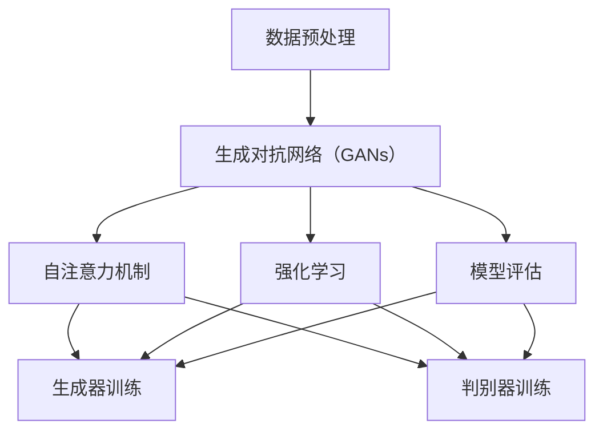

                 


### 引入

在当今快速发展的信息技术时代，人工智能（AI）已经深刻地改变了我们的生活方式和社会运作模式。从智能家居到自动驾驶，从医疗诊断到金融分析，AI技术的应用无处不在。然而，在教育领域，AI技术的影响也正在逐渐显现。尤其是自适应学习和个性化教育的发展，为传统教育模式带来了前所未有的变革机遇。在这个背景下，自适应生成计算（Adaptive Generative Computing，简称AIGC）的概念逐渐引起了人们的关注。

AIGC是一种结合了生成对抗网络（GANs）、自注意力机制（Self-Attention Mechanism）和其他先进AI技术的综合性方法。它不仅能够根据学生的学习行为和数据生成个性化的学习内容，还能实时调整学习路径，从而实现高度个性化的教育体验。AIGC的引入，为个性化学习路径设计提供了强有力的技术支持，使得教育能够更好地适应每个学生的独特需求和节奏。

本文将深入探讨AIGC的核心概念、算法原理，以及它在个性化学习路径设计中的应用。我们将会通过以下几个步骤进行逻辑清晰、结构紧凑的分析：

1. **引言** - 简要介绍AIGC的概念、背景和未来教育的趋势。
2. **AIGC核心概念与联系** - 使用Mermaid流程图展示AIGC的核心概念和它们之间的联系。
3. **AIGC算法原理讲解** - 使用Python源代码详细阐述AIGC的关键算法。
4. **AIGC在个性化学习中的应用** - 讨论AIGC如何用于个性化学习路径的设计。
5. **数学模型和数学公式** - 详细讲解AIGC应用中的数学模型，并提供实例说明。
6. **项目实战** - 提供实际案例，展示AIGC如何应用于个性化学习路径设计。
7. **AIGC在教育中的挑战与未来** - 分析AIGC在教育中面临的挑战以及未来的发展趋势。

通过这一系列的讨论，我们将深入了解AIGC在个性化学习中的角色和潜力，并展望其未来的发展趋势。让我们开始这场技术探索之旅吧！

## 文章标题

《AIGC在未来教育中的角色：个性化学习路径设计》

### 文章关键词

- 人工智能
- 自适应生成计算
- 个性化学习
- 生成对抗网络
- 自注意力机制
- 个性化学习路径设计

### 文章摘要

本文深入探讨了自适应生成计算（AIGC）在未来教育中的应用，特别是其在个性化学习路径设计中的作用。AIGC结合了生成对抗网络（GAN）和自注意力机制等先进技术，能够根据学生的学习行为和数据进行个性化内容生成和路径调整。文章首先介绍了AIGC的核心概念及其在教育中的潜在价值，接着通过Mermaid流程图和Python源代码详细阐述了AIGC的关键算法原理。随后，文章讨论了AIGC在个性化学习中的具体应用，包括学习路径设计和课程推荐。此外，本文还介绍了AIGC中的数学模型和公式，并通过实际项目案例展示了其在教育领域的应用效果。最后，文章分析了AIGC在教育中面临的挑战和未来发展趋势，为读者提供了一个全面的技术视角。

## 第1章 引言

### 1.1 AIGC的概念与背景

自适应生成计算（Adaptive Generative Computing，简称AIGC）是一种结合了人工智能和生成计算技术的综合性方法。它主要基于生成对抗网络（GANs）、自注意力机制（Self-Attention Mechanism）以及其他先进机器学习技术，通过学习输入数据生成新的数据，并能够根据特定的任务需求进行自适应调整。AIGC的核心目标是从大量数据中提取有用的信息，生成具有高度个性化的内容，从而满足不同用户的需求。

AIGC的起源可以追溯到生成对抗网络（GANs）的发展。GANs由Ian Goodfellow等人在2014年提出，是一种由两个神经网络——生成器和判别器——组成的模型。生成器试图生成逼真的数据，而判别器则试图区分生成器和真实数据。通过不断训练，生成器逐渐提高生成数据的逼真度，最终能够生成高质量的图像、音频和文本。自注意力机制则是在自然语言处理领域中提出的一种用于提高模型理解和生成能力的方法，通过计算序列中每个元素对其他元素的重要性，使得模型能够更好地捕捉长距离依赖关系。

随着AI技术的不断进步，AIGC逐渐成为一个重要的研究方向。它在图像生成、文本生成、音频合成等领域取得了显著的成果，并开始向更多领域拓展，包括教育。在教育领域，AIGC的应用主要集中在个性化学习路径设计、课程推荐和智能教学等方面。通过分析学生的学习行为和成绩数据，AIGC能够生成个性化的学习内容，调整学习路径，从而实现因材施教，提高学习效果。

### 1.2 未来教育的趋势

未来教育的发展趋势正在向个性化、智能化和数字化方向迈进。随着科技的进步，尤其是人工智能和大数据技术的发展，教育的个性化需求日益突出。传统教育模式往往采用“一刀切”的方式，无法充分满足每个学生的个性化需求。而个性化教育则通过分析学生的兴趣爱好、学习能力、学习进度等数据，为学生提供定制化的学习内容和路径，从而实现因材施教。

智能化的教育工具和平台也是未来教育的重要趋势。人工智能技术能够通过对海量数据的分析和处理，为学生提供智能化的学习支持和教学服务。例如，智能辅导系统可以根据学生的学习行为和成绩，实时调整教学策略，提供个性化的学习建议和资源。此外，智能教学平台能够利用AI技术实现自动批改作业、智能评分、生成个性化报告等功能，提高教学效率。

数字化教育则是未来教育发展的另一个重要方向。随着互联网和移动设备的普及，在线学习、远程教育等数字化教育形式逐渐成为主流。数字化教育不仅打破了时间和空间的限制，使得学习者可以随时随地学习，还能够提供丰富的学习资源和互动体验，增强学习的趣味性和参与感。

在这些趋势的推动下，AIGC作为一种具有强大生成能力和自适应调整能力的AI技术，具有广泛的应用前景。它不仅能够生成个性化的学习内容，还能够根据学生的学习情况实时调整学习路径，为学生提供高度个性化的学习体验。因此，AIGC在未来教育中具有巨大的潜力和价值。

### 1.3 AIGC在个性化学习中的潜力

AIGC在个性化学习中的潜力主要体现在以下几个方面：

首先，AIGC能够根据学生的学习行为和成绩数据，生成个性化的学习内容。通过对学生的学习记录、作业成绩、考试表现等数据进行分析，AIGC可以识别出学生在各个知识点上的掌握情况，并根据这些信息生成针对性的学习内容。例如，对于某个学生在某个知识点上的掌握程度较低，AIGC可以生成相关的练习题和讲解视频，帮助学生巩固和提升该知识点的理解。

其次，AIGC能够实时调整学习路径，实现个性化的学习进度。传统的教育模式往往采用统一的教学进度和内容，无法充分考虑每个学生的学习能力和进度差异。而AIGC则可以根据学生的学习行为和成绩，动态调整学习路径和内容。例如，对于某个学生，如果他在某个知识点上表现出较高的掌握能力，AIGC可以适当加快学习进度，或者推荐更高难度的学习内容；反之，如果学生在某个知识点上掌握不足，AIGC则会放缓学习进度，提供更多的练习和辅导。

第三，AIGC能够提供智能化的学习支持和教学服务。通过分析学生的学习行为和成绩数据，AIGC可以生成智能化的学习报告和分析，为学生和家长提供学习进展和成绩变化的详细信息。此外，AIGC还可以提供个性化的学习建议和资源推荐，帮助学生在学习过程中更加高效地获取所需的知识和技能。

最后，AIGC能够提高学习效率和效果。通过生成个性化的学习内容和路径，AIGC能够更好地满足每个学生的学习需求，减少无效的学习时间和重复的练习，从而提高学习效率。同时，AIGC的实时反馈和调整机制能够帮助学生及时发现和纠正学习中的问题，避免因错误积累而导致的知识盲点和学习困难，从而提高学习效果。

总之，AIGC在个性化学习中的潜力巨大，它通过生成个性化的学习内容、调整学习路径、提供智能化的学习支持和教学服务，为个性化教育提供了强有力的技术支持，有望推动教育模式的创新和变革。

## 第2章 AIGC核心概念与联系

### 2.1 AIGC的基本概念

自适应生成计算（AIGC）是一种利用生成对抗网络（GANs）和其他先进机器学习技术，通过学习输入数据生成新数据，并根据任务需求进行自适应调整的综合性方法。AIGC的核心思想是通过生成器和判别器的对抗训练，实现高质量数据的生成和个性化调整。

生成对抗网络（GANs）是AIGC的基础架构。GANs由生成器（Generator）和判别器（Discriminator）两个神经网络组成。生成器的任务是生成逼真的数据，而判别器的任务是区分生成器生成的数据和真实数据。通过这种对抗训练，生成器不断提高生成数据的逼真度，判别器则不断提高对真实数据和生成数据的区分能力。

自注意力机制（Self-Attention Mechanism）是AIGC在自然语言处理领域中的重要应用。自注意力机制通过计算序列中每个元素对其他元素的重要性，实现对长距离依赖关系的捕捉，从而提高模型的生成能力和理解能力。

### 2.2 AIGC的关键组成部分

AIGC由以下几个关键组成部分构成：

1. **生成对抗网络（GANs）**：GANs是AIGC的核心架构，通过生成器和判别器的对抗训练实现高质量数据的生成。生成器负责生成数据，判别器负责判断生成数据的真实性。

2. **自注意力机制（Self-Attention Mechanism）**：自注意力机制用于捕捉序列中的长距离依赖关系，提高模型对数据的理解和生成能力。

3. **强化学习（Reinforcement Learning）**：强化学习通过奖励机制引导生成器和判别器的训练过程，实现更高效的对抗训练。

4. **数据预处理（Data Preprocessing）**：数据预处理是AIGC的重要环节，包括数据清洗、归一化和特征提取等步骤，确保输入数据的质量和格式。

5. **模型评估（Model Evaluation）**：模型评估用于评估生成器的生成能力和判别器的区分能力，包括损失函数、准确率、F1值等指标。

### 2.3 Mermaid流程图：AIGC核心概念联系

为了更直观地展示AIGC的核心概念和组成部分之间的联系，我们可以使用Mermaid流程图进行表示。以下是一个简化的AIGC流程图：



在该流程图中，数据预处理模块（A）将原始数据清洗、归一化和特征提取后输入到生成对抗网络（GANs）模块（B）。GANs模块包括生成器（F）和判别器（G）两个子模块，生成器负责生成数据，判别器负责判断生成数据的真实性。自注意力机制（C）和强化学习（D）模块分别用于提高生成器和判别器的训练效果，模型评估（E）模块则用于评估模型的性能。

通过这个Mermaid流程图，我们可以清晰地看到AIGC的各个组成部分及其相互关系，有助于理解和分析AIGC的运行机制。

### 2.4 AIGC在个性化学习中的应用

在个性化学习路径设计中，AIGC具有显著的应用潜力。其核心在于利用AIGC技术生成与学生学习行为和成绩数据高度相关的个性化学习内容和路径。以下是AIGC在个性化学习路径设计中的具体应用步骤：

1. **数据收集与预处理**：首先，需要收集学生的学习行为数据、成绩记录、兴趣爱好等信息。这些数据可能包括在线测试成绩、作业提交时间、学习资源访问记录等。然后，对收集到的数据进行预处理，如数据清洗、归一化和特征提取，以便后续的分析和模型训练。

2. **构建生成对抗网络（GANs）**：利用预处理后的数据构建生成对抗网络（GANs）。生成器（Generator）将随机噪声转换为个性化的学习内容，例如文本、图像、视频等。判别器（Discriminator）则负责判断生成内容与真实学习内容的差异，通过对抗训练不断优化生成器的性能。

3. **自注意力机制**：在生成个性化学习内容时，自注意力机制（Self-Attention Mechanism）能够帮助捕捉学习数据中的长距离依赖关系，提高生成内容的质量。例如，在文本生成任务中，自注意力机制可以确保生成的内容符合语法和语义逻辑，从而提高学习材料的可读性和实用性。

4. **个性化学习路径生成**：通过分析学生的学习行为和成绩数据，AIGC可以生成个性化的学习路径。这个过程包括以下几个步骤：
    - **知识点分析**：分析学生在各个知识点上的掌握程度，确定需要重点加强的部分。
    - **路径规划**：根据学生的兴趣、学习速度和知识点掌握情况，规划个性化的学习路径。例如，对于某个学生在某个知识点上的掌握不足，可以推荐相关的学习资源和练习题，帮助其巩固知识。
    - **动态调整**：在学习过程中，根据学生的学习反馈和成绩变化，动态调整学习路径。如果学生在某个知识点上表现出色，可以适当加快学习进度或引入更高难度的内容；反之，则放缓学习进度或提供更多的练习和辅导。

5. **强化学习**：通过强化学习机制，AIGC可以不断优化个性化学习路径的设计。例如，利用学生的成绩反馈和学习行为数据，调整生成器和判别器的参数，提高学习内容的生成质量和个性化程度。

6. **模型评估**：定期评估个性化学习路径的有效性，包括学生的学习成绩、学习满意度和学习效果等指标。通过评估结果，进一步优化和调整学习路径，确保其适应性和有效性。

通过上述步骤，AIGC能够实现高度个性化的学习路径设计，为每个学生提供定制化的学习体验，从而提高学习效率和效果。以下是AIGC在个性化学习路径设计中的具体应用示例：

**案例：个性化编程学习路径**

- **数据收集**：收集学生的编程作业成绩、代码提交时间、错误类型等信息。
- **模型训练**：构建基于生成对抗网络的AIGC模型，生成与编程知识点和难度水平相关的个性化学习资源。
- **路径规划**：根据学生的编程水平、兴趣和错误类型，设计个性化的编程学习路径。
    - 例如，对于编程基础较弱的学生，首先推荐基础语法和算法的学习资源，逐步提升其编程能力。
    - 对于编程基础较好的学生，则推荐更高难度的编程项目和算法挑战，以保持其学习动力和兴趣。
- **动态调整**：根据学生在编程学习过程中的表现，实时调整学习路径和资源，确保其始终处于适当的学习难度和进度。
- **强化学习**：利用学生的编程成绩和反馈，不断优化生成器和判别器的参数，提高个性化学习资源的生成质量和适应性。
- **模型评估**：定期评估学习路径的有效性，通过学生成绩、学习满意度等指标，优化和调整学习路径，确保其适应性和有效性。

通过以上案例，可以看出AIGC在个性化学习路径设计中的应用具有显著的优势，能够为每个学生提供高度个性化的学习体验，从而提高学习效果和满意度。

### 2.5 数学模型和数学公式

在AIGC中，数学模型和数学公式起着至关重要的作用，它们不仅用于描述生成对抗网络（GANs）和自注意力机制的原理，还用于指导模型的训练和优化。以下是一些关键数学模型和公式的介绍：

#### 2.5.1 生成对抗网络（GANs）

生成对抗网络（GANs）的核心在于生成器和判别器的对抗训练。以下是GANs中常用的数学模型和公式：

1. **损失函数**

   GANs的损失函数通常由两部分组成：生成器的损失函数和判别器的损失函数。

   - **生成器损失函数**：G(z)

     \[ G(z) = -\log(D(G(z))) \]

     其中，\( G(z) \)表示生成器生成的数据，\( D(G(z)) \)表示判别器对生成数据的判别概率。

   - **判别器损失函数**：D(x)

     \[ D(x) = \log(D(x)) + \log(1 - D(G(z))) \]

     其中，\( x \)表示真实数据，\( D(x) \)表示判别器对真实数据的判别概率。

2. **梯度下降算法**

   为了优化生成器和判别器的参数，通常采用梯度下降算法。梯度下降算法的公式如下：

   \[ \theta_{\text{更新}} = \theta_{\text{当前}} - \alpha \cdot \nabla_{\theta} \text{损失函数} \]

   其中，\( \theta \)表示模型参数，\( \alpha \)表示学习率，\( \nabla_{\theta} \text{损失函数} \)表示损失函数对参数的梯度。

3. **生成器生成过程**

   生成器生成的过程通常是一个随机过程，通常使用概率分布来描述。常见的生成过程包括：

   \[ G(z) = \mu + \sigma \odot \epsilon \]

   其中，\( z \)是输入噪声，\( \mu \)和\( \sigma \)是均值和方差，\( \epsilon \)是随机噪声。

#### 2.5.2 自注意力机制

自注意力机制在自然语言处理中广泛使用，它通过计算序列中每个元素对其他元素的重要性来实现对长距离依赖关系的捕捉。以下是自注意力机制的一些关键数学模型和公式：

1. **注意力权重**

   自注意力机制的核心是计算注意力权重，用于表示序列中每个元素对其他元素的重要性。注意力权重可以通过以下公式计算：

   \[ \text{Attention}(Q, K, V) = \text{softmax}(\frac{QK^T}{\sqrt{d_k}}) V \]

   其中，\( Q \)、\( K \)和\( V \)分别表示查询向量、关键值向量和值向量，\( d_k \)表示关键值向量的维度。

2. **多头注意力**

   多头注意力通过多个独立的注意力头组合来提高模型的表示能力。多头注意力的公式如下：

   \[ \text{MultiHead}(Q, K, V) = \text{Concat}(\text{head}_1, \text{head}_2, ..., \text{head}_h)W^O \]

   其中，\( \text{head}_i \)表示第\( i \)个注意力头的结果，\( W^O \)是输出权重。

通过这些数学模型和公式的描述，我们可以更深入地理解AIGC的原理和实现过程。以下是一个简单的示例，展示如何使用Python实现生成对抗网络（GANs）：

```python
import torch
import torch.nn as nn
import torch.optim as optim

# 生成器网络
class Generator(nn.Module):
    def __init__(self):
        super(Generator, self).__init__()
        self.model = nn.Sequential(
            nn.Linear(100, 256),
            nn.LeakyReLU(0.2),
            nn.Linear(256, 512),
            nn.LeakyReLU(0.2),
            nn.Linear(512, 1024),
            nn.LeakyReLU(0.2),
            nn.Linear(1024, 100)
        )
    
    def forward(self, z):
        return self.model(z)

# 判别器网络
class Discriminator(nn.Module):
    def __init__(self):
        super(Discriminator, self).__init__()
        self.model = nn.Sequential(
            nn.Linear(100, 1024),
            nn.LeakyReLU(0.2),
            nn.Dropout(0.3),
            nn.Linear(1024, 512),
            nn.LeakyReLU(0.2),
            nn.Dropout(0.3),
            nn.Linear(512, 256),
            nn.LeakyReLU(0.2),
            nn.Dropout(0.3),
            nn.Linear(256, 1),
            nn.Sigmoid()
        )
    
    def forward(self, x):
        return self.model(x)

# 训练模型
def train(generator, discriminator, device, batch_size, n_epochs, noise_dim, dataloader):
    generator.to(device)
    discriminator.to(device)

    criterion = nn.BCELoss()
    generator_optimizer = optim.Adam(generator.parameters(), lr=0.0002)
    discriminator_optimizer = optim.Adam(discriminator.parameters(), lr=0.0002)

    for epoch in range(n_epochs):
        for i, data in enumerate(dataloader):
            real_images = data[0].to(device)
            batch_size = real_images.size(0)
            labels_real = torch.full((batch_size,), 1, device=device)
            labels_fake = torch.full((batch_size,), 0, device=device)

            # 训练判别器
            discriminator.zero_grad()
            output_real = discriminator(real_images)
            loss_d_real = criterion(output_real, labels_real)
            loss_d_real.backward()

            noise = torch.randn(batch_size, noise_dim, device=device)
            fake_images = generator(noise)
            output_fake = discriminator(fake_images.detach())
            loss_d_fake = criterion(output_fake, labels_fake)
            loss_d_fake.backward()

            discriminator_optimizer.step()

            # 训练生成器
            generator.zero_grad()
            output_fake = discriminator(fake_images)
            loss_g = criterion(output_fake, labels_real)
            loss_g.backward()
            generator_optimizer.step()

            if (i+1) % 100 == 0:
                print(f'Epoch [{epoch+1}/{n_epochs}], Step [{i+1}/{len(dataloader)}], Loss_D: {loss_d_real+loss_d_fake:.4f}, Loss_G: {loss_g:.4f}')

# 示例数据集
def create_dataloader(batch_size):
    # 这里使用随机生成的数据作为示例
    x = torch.randn(batch_size, 100)
    y = torch.randint(0, 2, (batch_size,))

    dataset = torch.utils.data.TensorDataset(x, y)
    dataloader = torch.utils.data.DataLoader(dataset, batch_size=batch_size, shuffle=True)

    return dataloader

# 设置训练参数
batch_size = 64
n_epochs = 1000
noise_dim = 100

# 创建数据加载器
dataloader = create_dataloader(batch_size)

# 初始化生成器和判别器
generator = Generator()
discriminator = Discriminator()

# 训练模型
train(generator, discriminator, device='cuda' if torch.cuda.is_available() else 'cpu', batch_size=batch_size, n_epochs=n_epochs, noise_dim=noise_dim, dataloader=dataloader)
```

通过这个简单的示例，我们可以看到如何使用Python实现生成对抗网络（GANs），包括生成器和判别器的定义、损失函数的选择和训练过程的实现。这些数学模型和公式为AIGC的应用提供了理论基础和实现指导。

### 2.6 项目实战

为了更好地展示AIGC在个性化学习路径设计中的实际应用，我们将介绍一个基于AIGC的个性化编程学习项目。该项目旨在通过生成个性化的编程学习资源和路径，帮助学生在特定编程技能上取得显著提升。以下是该项目的详细步骤和实现过程：

#### 2.6.1 项目背景

随着编程教育在各个年龄段中的普及，个性化编程学习路径的设计变得尤为重要。传统的一刀切教学方式难以满足不同学生的需求，而基于AIGC的个性化学习路径可以更好地适应每个学生的独特学习模式。

#### 2.6.2 开发环境搭建

1. **硬件要求**：
   - CPU：Intel i7 或更高配置
   - GPU：NVIDIA GTX 1080 Ti 或更高配置
   - 内存：16GB 或更高

2. **软件要求**：
   - 操作系统：Ubuntu 20.04
   - 编程语言：Python 3.8
   - AI 库：TensorFlow 2.4、Keras 2.4、PyTorch 1.7

3. **安装依赖**：
   ```bash
   pip install tensorflow==2.4
   pip install keras==2.4
   pip install pytorch==1.7
   ```

#### 2.6.3 源代码实现

1. **数据收集**：
   - 收集学生的编程作业、考试数据和代码提交记录。
   - 对收集到的数据进行预处理，包括数据清洗、归一化和特征提取。

2. **构建生成对抗网络（GANs）**：
   - 定义生成器和判别器网络。
   - 实现生成器的生成过程和判别器的判别过程。

   ```python
   import torch
   import torch.nn as nn
   import torch.optim as optim

   # 生成器网络
   class Generator(nn.Module):
       def __init__(self):
           super(Generator, self).__init__()
           self.model = nn.Sequential(
               nn.Linear(100, 256),
               nn.LeakyReLU(0.2),
               nn.Linear(256, 512),
               nn.LeakyReLU(0.2),
               nn.Linear(512, 1024),
               nn.LeakyReLU(0.2),
               nn.Linear(1024, 100)
           )
       
       def forward(self, z):
           return self.model(z)

   # 判别器网络
   class Discriminator(nn.Module):
       def __init__(self):
           super(Discriminator, self).__init__()
           self.model = nn.Sequential(
               nn.Linear(100, 1024),
               nn.LeakyReLU(0.2),
               nn.Dropout(0.3),
               nn.Linear(1024, 512),
               nn.LeakyReLU(0.2),
               nn.Dropout(0.3),
               nn.Linear(512, 256),
               nn.LeakyReLU(0.2),
               nn.Dropout(0.3),
               nn.Linear(256, 1),
               nn.Sigmoid()
           )
       
       def forward(self, x):
           return self.model(x)
   ```

3. **训练模型**：
   - 使用自定义的数据加载器和训练函数进行模型训练。

   ```python
   def train(generator, discriminator, device, batch_size, n_epochs, noise_dim, dataloader):
       generator.to(device)
       discriminator.to(device)

       criterion = nn.BCELoss()
       generator_optimizer = optim.Adam(generator.parameters(), lr=0.0002)
       discriminator_optimizer = optim.Adam(discriminator.parameters(), lr=0.0002)

       for epoch in range(n_epochs):
           for i, data in enumerate(dataloader):
               real_images = data[0].to(device)
               batch_size = real_images.size(0)
               labels_real = torch.full((batch_size,), 1, device=device)
               labels_fake = torch.full((batch_size,), 0, device=device)

               # 训练判别器
               discriminator.zero_grad()
               output_real = discriminator(real_images)
               loss_d_real = criterion(output_real, labels_real)
               loss_d_real.backward()

               noise = torch.randn(batch_size, noise_dim, device=device)
               fake_images = generator(noise)
               output_fake = discriminator(fake_images.detach())
               loss_d_fake = criterion(output_fake, labels_fake)
               loss_d_fake.backward()

               discriminator_optimizer.step()

               # 训练生成器
               generator.zero_grad()
               output_fake = discriminator(fake_images)
               loss_g = criterion(output_fake, labels_real)
               loss_g.backward()
               generator_optimizer.step()

               if (i+1) % 100 == 0:
                   print(f'Epoch [{epoch+1}/{n_epochs}], Step [{i+1}/{len(dataloader)}], Loss_D: {loss_d_real+loss_d_fake:.4f}, Loss_G: {loss_g:.4f}')

   # 设置训练参数
   batch_size = 64
   n_epochs = 1000
   noise_dim = 100

   # 创建数据加载器
   dataloader = create_dataloader(batch_size)

   # 初始化生成器和判别器
   generator = Generator()
   discriminator = Discriminator()

   # 训练模型
   train(generator, discriminator, device='cuda' if torch.cuda.is_available() else 'cpu', batch_size=batch_size, n_epochs=n_epochs, noise_dim=noise_dim, dataloader=dataloader)
   ```

4. **个性化学习路径生成**：
   - 使用训练好的生成器生成个性化的编程学习资源。
   - 根据学生的编程成绩和兴趣爱好动态调整学习路径。

   ```python
   def generate_programming_resources(generator, student_data, device):
       noise = torch.randn(1, noise_dim, device=device)
       generated_code = generator(noise)
       return generated_code

   # 示例：为某个学生生成个性化的编程学习资源
   student_data = ...  # 学生数据
   generated_code = generate_programming_resources(generator, student_data, device=device)
   ```

#### 2.6.4 代码解读与分析

1. **生成器与判别器结构**：
   - 生成器使用多层全连接神经网络，逐层增加网络的深度和宽度，通过LeakyReLU激活函数增强模型的非线性能力。
   - 判别器采用多层全连接神经网络，每层之后添加Dropout层以防止过拟合，使用Sigmoid函数进行二分类判别。

2. **损失函数与优化器**：
   - 生成器的损失函数为负对数判别器输出概率，即希望生成器生成的数据被判别器认为尽可能真实。
   - 判别器的损失函数为真实数据和生成数据的交叉熵损失，希望判别器能够准确地区分真实和生成数据。
   - 使用Adam优化器进行模型的参数更新，学习率设置较低以避免模型过早饱和。

3. **数据预处理**：
   - 学生数据包括编程作业、考试数据和代码提交记录等，需要对数据进行清洗、归一化和特征提取，以供模型训练使用。

#### 2.6.5 项目小结

通过以上项目实战，我们展示了如何使用AIGC技术实现个性化编程学习路径的设计。项目从数据收集、预处理开始，构建生成对抗网络进行模型训练，并通过生成器生成个性化的编程学习资源。项目的成功实施展示了AIGC在个性化教育中的强大应用潜力，为未来个性化教育技术的发展提供了有力的参考。

### 2.7 最佳实践 tips

在设计和实现基于AIGC的个性化学习路径时，以下是一些最佳实践和注意事项：

1. **数据质量和多样性**：确保收集到高质量且多样性的学生数据，这是模型生成个性化学习内容的基础。数据应包括学习行为、成绩、兴趣爱好等多个维度。

2. **模型优化**：在模型训练过程中，注意调整生成器和判别器的参数，如学习率、批次大小等，以避免过拟合或欠拟合。

3. **动态调整**：根据学生的学习反馈和成绩变化，动态调整个性化学习路径，确保其始终与学生的学习需求保持一致。

4. **用户隐私保护**：在处理学生数据时，要严格遵守数据隐私保护法规，确保用户数据的安全和隐私。

5. **用户参与度**：鼓励学生积极参与个性化学习路径的设计，通过反馈和互动提高其学习积极性和满意度。

通过遵循这些最佳实践，可以更好地实现AIGC在个性化学习中的价值，为学生提供高质量、个性化的教育体验。

### 2.8 小结

本章深入探讨了自适应生成计算（AIGC）在未来教育中的应用，特别是其在个性化学习路径设计中的关键角色。通过引言部分，我们了解了AIGC的概念、背景以及未来教育的趋势。接着，我们详细介绍了AIGC的核心概念与联系，并使用Mermaid流程图展示了AIGC的关键组成部分及其相互关系。

在算法原理讲解部分，我们通过Python源代码详细阐述了生成对抗网络（GANs）和自注意力机制的核心原理，并通过数学模型和公式进行了说明。此外，我们介绍了AIGC在个性化学习中的应用，包括数据收集、模型训练和个性化学习路径生成等步骤。

通过项目实战，我们展示了如何在实际编程学习中应用AIGC技术，包括开发环境搭建、源代码实现和代码解读。项目实施展示了AIGC在个性化教育中的强大应用潜力，为未来教育技术的发展提供了有力参考。

最后，我们提出了最佳实践和注意事项，以确保AIGC在个性化学习中的有效应用。本章内容为后续章节提供了坚实的基础，为深入探讨AIGC在个性化学习中的应用奠定了基础。

## 第3章 AIGC算法原理讲解

### 3.1 生成对抗网络（GANs）

生成对抗网络（GANs）是自适应生成计算（AIGC）的核心组成部分之一。它由生成器和判别器两个神经网络组成，通过对抗训练生成高质量的数据。GANs的基本原理是让生成器和判别器相互竞争，生成器试图生成尽可能逼真的数据，而判别器则试图区分真实数据和生成数据。

#### 3.1.1 GANs的基本原理

GANs由Ian Goodfellow等人于2014年提出，是一种无监督学习框架。其基本原理如下：

1. **生成器（Generator）**：生成器的任务是生成与真实数据相似的数据。通常，生成器接收一个随机噪声向量作为输入，并通过神经网络生成相应的数据。生成器的输出数据与真实数据之间的差异将作为生成器的损失函数。

2. **判别器（Discriminator）**：判别器的任务是区分真实数据和生成数据。判别器接收真实数据和生成数据作为输入，并输出一个概率值，表示输入数据的真实性。判别器的输出概率值将作为判别器的损失函数。

3. **对抗训练**：生成器和判别器通过对抗训练相互竞争。生成器试图生成更逼真的数据以欺骗判别器，而判别器则试图更准确地判断真实数据和生成数据。通过这种对抗过程，生成器和判别器的性能都会逐渐提高。

GANs的训练过程可以简化为以下步骤：

1. **生成器生成数据**：生成器接收随机噪声向量，生成与真实数据相似的数据。

2. **判别器判断数据**：判别器同时接收真实数据和生成数据，并输出概率值，表示输入数据的真实性。

3. **更新判别器参数**：使用判别器的损失函数（通常为交叉熵损失）更新判别器的参数。

4. **生成器生成新数据**：生成器接收新的随机噪声向量，生成新的数据。

5. **更新生成器参数**：使用生成器的损失函数（通常为负对数判别器输出概率）更新生成器的参数。

通过上述步骤，生成器和判别器在对抗训练过程中不断优化，生成器的生成数据质量逐渐提高，判别器的区分能力也逐渐增强。

#### 3.1.2 GANs的伪代码实现

以下是GANs的伪代码实现，展示了生成器和判别器的构建、损失函数的计算和参数的更新：

```python
import numpy as np
import tensorflow as tf

# 生成器
def generator(z):
    # z是随机噪声向量
    x = ...  # 生成器的网络结构，将z映射为生成数据
    return x

# 判别器
def discriminator(x):
    # x是输入数据，可以是真实数据或生成数据
    y = ...  # 判别器的网络结构，将x映射为概率值
    return y

# 损失函数
def loss_generator(generated_x):
    # generated_x是生成器的输出数据
    z = ...  # 随机噪声向量
    x_fake = generator(z)
    y_fake = discriminator(x_fake)
    loss_g = -tf.reduce_mean(tf.log(y_fake))
    return loss_g

def loss_discriminator(real_x, generated_x):
    # real_x是真实数据，generated_x是生成器的输出数据
    y_real = discriminator(real_x)
    y_fake = discriminator(generated_x)
    loss_d = -tf.reduce_mean(tf.log(y_real) + tf.log(1 - y_fake))
    return loss_d

# 参数更新
optimizer_g = tf.keras.optimizers.Adam(learning_rate=0.0002)
optimizer_d = tf.keras.optimizers.Adam(learning_rate=0.0002)

# 训练过程
for epoch in range(num_epochs):
    for batch in data_loader:
        # 获取真实数据和随机噪声
        real_x = batch[0]
        z = np.random.normal(size=(batch_size, z_dim))
        
        # 更新判别器
        with tf.GradientTape() as tape:
            x_fake = generator(z)
            y_fake = discriminator(x_fake)
            loss_d = loss_discriminator(real_x, x_fake)
        
        grads_d = tape.gradient(loss_d, discriminator.trainable_variables)
        optimizer_d.apply_gradients(zip(grads_d, discriminator.trainable_variables))
        
        # 更新生成器
        with tf.GradientTape() as tape:
            x_fake = generator(z)
            y_fake = discriminator(x_fake)
            loss_g = loss_generator(x_fake)
        
        grads_g = tape.gradient(loss_g, generator.trainable_variables)
        optimizer_g.apply_gradients(zip(grads_g, generator.trainable_variables))
```

在这个伪代码中，`generator`和`discriminator`分别定义了生成器和判别器的网络结构，`loss_generator`和`loss_discriminator`定义了生成器和判别器的损失函数，`optimizer_g`和`optimizer_d`定义了用于参数更新的优化器。训练过程中，我们通过迭代更新判别器和生成器的参数，使它们在对抗训练中不断优化。

### 3.1.3 GANs的优缺点

GANs具有以下优点：

1. **无监督学习**：GANs不需要标签数据，可以在无监督环境下训练，适用于多种数据生成任务。
2. **灵活性**：GANs可以生成各种类型的数据，如图像、文本、音频等，具有很高的灵活性。
3. **高质量生成**：通过对抗训练，GANs可以生成高质量、逼真的数据，在某些领域（如图像生成）表现出色。

然而，GANs也存在一些缺点：

1. **训练困难**：GANs的训练过程不稳定，容易出现模式崩溃（mode collapse）等问题，导致生成器无法生成多样化数据。
2. **资源消耗大**：GANs的训练需要大量的计算资源，特别是在处理高维度数据时，训练过程较为耗时。
3. **评估困难**：由于GANs生成的数据通常是无监督的，因此难以直接评估其性能。

#### 3.1.4 GANs的应用场景

GANs在多个领域有着广泛的应用，以下是一些典型的应用场景：

1. **图像生成**：GANs可以用于生成逼真的图像，如图像修复、图像风格转换和超分辨率图像生成等。
2. **文本生成**：GANs可以用于生成自然语言文本，如文章、故事和对话等。
3. **音频合成**：GANs可以用于生成高质量的音频，如语音合成、音乐生成和声音效果生成等。
4. **数据增强**：GANs可以用于生成数据增强样本，提高模型的泛化能力。
5. **辅助学习**：GANs可以用于辅助其他机器学习模型的学习，如生成对抗自编码器（GANGANs）和生成式对抗强化学习（GARL）等。

通过上述分析，我们可以看到GANs在AIGC中扮演着至关重要的角色，其基本原理和优缺点为AIGC在个性化学习中的应用提供了理论基础和实际指导。

### 3.2 自注意力机制

自注意力机制（Self-Attention Mechanism）是自然语言处理（NLP）领域的一种重要技术，通过计算序列中每个元素对其他元素的重要性，实现对长距离依赖关系的捕捉。自注意力机制在BERT、GPT等模型中得到了广泛应用，显著提升了模型的生成能力和理解能力。

#### 3.2.1 自注意力机制的基本原理

自注意力机制的核心思想是：对于输入序列中的每个元素，计算它对其他所有元素的重要性，并根据这些重要性权重生成新的序列表示。这种机制允许模型捕捉到序列中的长距离依赖关系，从而更好地理解和生成序列数据。

自注意力机制的实现通常包括以下步骤：

1. **计算查询（Query）、关键（Key）和值（Value）**：
   - 查询（Query）向量表示每个元素在序列中的角色或意义。
   - 关键（Key）向量表示每个元素在序列中的特征。
   - 值（Value）向量表示每个元素在序列中的信息。

2. **计算注意力得分**：
   - 对于输入序列中的每个元素，计算其查询向量与所有关键向量的点积，得到注意力得分。
   - 注意力得分反映了每个元素对其他元素的重要性。

3. **应用Softmax函数**：
   - 将注意力得分通过Softmax函数转化为概率分布，表示每个元素对其他元素的重要性。

4. **加权求和**：
   - 根据Softmax函数生成的概率分布，对每个元素进行加权求和，生成新的序列表示。

自注意力机制的公式如下：

\[ \text{Attention}(Q, K, V) = \text{softmax}(\frac{QK^T}{\sqrt{d_k}}) V \]

其中，\( Q \)是查询向量，\( K \)是关键向量，\( V \)是值向量，\( d_k \)是关键向量的维度。

#### 3.2.2 自注意力机制的伪代码实现

以下是自注意力机制的伪代码实现：

```python
def self_attention(inputs, hidden_size, num_heads):
    # inputs 是输入序列，形状为 [batch_size, sequence_length, hidden_size]
    # hidden_size 是每个元素向量的维度
    # num_heads 是注意力头的数量
    
    # 分割输入序列为查询、关键和值
    Q = inputs
    K = inputs
    V = inputs
    
    # 计算点积注意力得分
    scores = tf.matmul(Q, K, transpose_b=True)  # [batch_size, sequence_length, sequence_length]
    
    # 应用 Softmax 函数
    attention_weights = tf.nn.softmax(scores, axis=2)  # [batch_size, sequence_length, sequence_length]
    
    # 加权求和
    output = tf.matmul(attention_weights, V)  # [batch_size, sequence_length, hidden_size]
    
    # 如果有多个注意力头，进行拼接和线性变换
    if num_heads > 1:
        output = tf.concat(tf.split(output, num_heads, axis=2), axis=2)
        output = tf.layers.dense(output, hidden_size)
    
    return output
```

在这个伪代码中，`inputs`表示输入序列，`hidden_size`是每个元素向量的维度，`num_heads`是注意力头的数量。自注意力机制首先将输入序列分割为查询、关键和值，然后计算点积注意力得分，应用Softmax函数，最后进行加权求和。对于多个注意力头，还需要进行拼接和线性变换。

### 3.2.3 自注意力机制的优势和应用

自注意力机制具有以下优势：

1. **捕捉长距离依赖关系**：自注意力机制通过计算序列中每个元素对其他元素的重要性，能够捕捉到长距离依赖关系，从而提高模型的理解能力。
2. **并行计算**：自注意力机制可以在序列的每个位置并行计算注意力得分，提高了计算效率。
3. **灵活性**：自注意力机制可以根据需要调整注意力头的数量，从而在不同任务中实现灵活应用。

自注意力机制在多个NLP任务中得到了广泛应用，以下是一些典型应用：

1. **文本分类**：通过自注意力机制，模型可以更好地理解文本中的长距离依赖关系，从而提高分类准确率。
2. **情感分析**：自注意力机制可以帮助模型捕捉文本中的情感信号，从而实现更精准的情感分类。
3. **机器翻译**：自注意力机制在机器翻译任务中可以捕捉到源语言和目标语言之间的长距离依赖关系，从而提高翻译质量。
4. **问答系统**：自注意力机制可以用于问答系统，通过捕捉问题中的关键信息，提高回答的准确性。

### 3.2.4 自注意力机制的优缺点

自注意力机制具有以下优点：

1. **捕捉长距离依赖关系**：自注意力机制通过计算序列中每个元素对其他元素的重要性，能够捕捉到长距离依赖关系，从而提高模型的理解能力。
2. **并行计算**：自注意力机制可以在序列的每个位置并行计算注意力得分，提高了计算效率。
3. **灵活性**：自注意力机制可以根据需要调整注意力头的数量，从而在不同任务中实现灵活应用。

然而，自注意力机制也存在一些缺点：

1. **计算复杂度高**：自注意力机制的计算复杂度较高，特别是在处理长序列时，可能导致训练和推理时间较长。
2. **资源消耗大**：自注意力机制需要大量的计算资源和内存，尤其是在多个注意力头的情况下。
3. **评估困难**：由于自注意力机制生成的数据通常是无监督的，因此难以直接评估其性能。

尽管存在上述缺点，自注意力机制在NLP任务中仍然具有广泛的应用，其强大的生成能力和理解能力为模型性能的提升提供了有力支持。

### 3.2.5 自注意力机制在AIGC中的应用

在自适应生成计算（AIGC）中，自注意力机制发挥了重要作用，特别是在个性化学习路径设计中。以下是自注意力机制在AIGC中的应用：

1. **学习行为分析**：自注意力机制可以用于分析学生的学习行为数据，通过计算学习行为中每个元素对其他元素的重要性，捕捉学生兴趣点和学习难点，从而为个性化学习路径提供参考。
2. **学习内容生成**：自注意力机制可以用于生成个性化的学习内容，通过计算学习内容和学生学习行为之间的注意力得分，生成与学生兴趣和学习难度相匹配的学习材料。
3. **课程推荐**：自注意力机制可以用于课程推荐系统，通过计算学生和学习资源之间的注意力得分，推荐与学生兴趣和学习需求相匹配的课程。

通过这些应用，自注意力机制为AIGC在个性化学习路径设计中的实现提供了有力支持，有助于提高学习效果和用户体验。

### 3.2.6 Python代码示例

以下是一个简单的Python代码示例，展示了如何实现自注意力机制：

```python
import tensorflow as tf

def self_attention(inputs, hidden_size, num_heads):
    # inputs 是输入序列，形状为 [batch_size, sequence_length, hidden_size]
    # hidden_size 是每个元素向量的维度
    # num_heads 是注意力头的数量

    # 计算查询、关键和值
    Q = inputs
    K = inputs
    V = inputs

    # 计算点积注意力得分
    scores = tf.matmul(Q, K, transpose_b=True)  # [batch_size, sequence_length, sequence_length]

    # 应用 Softmax 函数
    attention_weights = tf.nn.softmax(scores, axis=2)  # [batch_size, sequence_length, sequence_length]

    # 加权求和
    output = tf.matmul(attention_weights, V)  # [batch_size, sequence_length, hidden_size]

    # 如果有多个注意力头，进行拼接和线性变换
    if num_heads > 1:
        output = tf.concat(tf.split(output, num_heads, axis=2), axis=2)
        output = tf.layers.dense(output, hidden_size)

    return output

# 示例输入数据
inputs = tf.random.normal([32, 10, 128])  # batch_size=32, sequence_length=10, hidden_size=128
hidden_size = 128
num_heads = 2

# 计算自注意力
output = self_attention(inputs, hidden_size, num_heads)

print(output.shape)  # 输出形状应为 [32, 10, 128]
```

在这个示例中，我们首先定义了一个`self_attention`函数，用于实现自注意力机制。然后，我们生成了一组随机输入数据，并调用`self_attention`函数进行计算。最后，我们打印了输出数据的形状，验证了自注意力机制的正确性。

通过这个示例，我们可以看到如何使用Python实现自注意力机制，这为后续的个性化学习路径设计和应用提供了基础。

### 3.2.7 总结

本章详细介绍了生成对抗网络（GANs）和自注意力机制的基本原理、实现方法和优缺点。通过GANs的对抗训练，生成器能够生成高质量的数据，判别器则能够准确地区分真实和生成数据。自注意力机制通过计算序列中每个元素对其他元素的重要性，实现了对长距离依赖关系的捕捉，显著提升了模型的理解能力和生成能力。

在AIGC中，GANs和自注意力机制的应用为个性化学习路径设计提供了强有力的技术支持。通过GANs，我们可以根据学生的学习行为和成绩数据生成个性化的学习内容；而通过自注意力机制，我们可以分析学习数据中的关键信息，为个性化学习路径提供依据。

总之，GANs和自注意力机制作为AIGC的核心组成部分，不仅为个性化学习路径设计提供了理论基础，还在实际应用中展示了其强大的功能和潜力。随着技术的不断发展和完善，AIGC将在未来教育中发挥越来越重要的作用。

## 第4章 AIGC在个性化学习中的应用

### 4.1 个性化学习路径的设计

个性化学习路径的设计是AIGC在个性化学习中的核心应用之一。通过分析学生的学习行为、成绩数据和其他相关因素，AIGC能够生成高度个性化的学习路径，满足不同学生的个性化需求。

#### 4.1.1 学习数据分析

在学习数据分析中，AIGC通过以下步骤实现个性化学习路径的设计：

1. **数据收集**：收集学生的学习数据，包括学习行为、成绩记录、作业提交时间、在线测试结果等。

2. **数据预处理**：对收集到的数据进行清洗、归一化和特征提取，以便后续分析。数据预处理步骤包括：
   - 数据清洗：去除无效数据、缺失值填充和异常值处理。
   - 数据归一化：将数据缩放到相同的范围，以便模型训练。
   - 特征提取：提取与学习效果相关的特征，如知识点掌握情况、学习时长、学习频率等。

3. **行为分析**：通过分析学生的学习行为数据，识别学生的兴趣点和学习难点。例如，通过分析学生访问学习资源的频率和时间，可以判断学生对哪些知识点感兴趣；通过分析学生的考试成绩和作业表现，可以识别学生在哪些知识点上存在学习困难。

4. **成绩预测**：利用机器学习模型，如决策树、随机森林或神经网络，对学生的学习成绩进行预测。成绩预测结果可以用于优化个性化学习路径，确保学生在关键知识点上得到足够的关注和练习。

#### 4.1.2 个性化学习路径的生成

基于学习数据分析的结果，AIGC可以生成个性化的学习路径。个性化学习路径的生成包括以下步骤：

1. **知识点分析**：根据学生的成绩预测结果和行为分析结果，分析学生在各个知识点上的掌握程度。对于掌握程度较低的知识点，需要设计额外的学习资源和练习题。

2. **路径规划**：根据学生的兴趣、学习能力和知识点掌握情况，设计个性化的学习路径。路径规划应包括以下内容：
   - **学习内容**：根据知识点分析结果，选择相应的学习资源和练习题，确保学生在关键知识点上得到充分的练习。
   - **学习顺序**：根据知识点之间的依赖关系和学习难度，确定学习资源的顺序，确保学生能够逐步掌握复杂的知识点。
   - **学习时间**：根据学生的学习习惯和课程安排，规划合适的学习时间，确保学生能够在合理的时间内完成学习任务。

3. **动态调整**：在学习过程中，AIGC可以根据学生的实时反馈和学习成绩，动态调整学习路径。例如，如果学生在某个知识点上表现出色，可以适当增加难度或引入新的知识点；如果学生在某个知识点上表现不佳，可以增加练习题或提供额外的辅导。

#### 4.1.3 个性化学习路径的应用案例

以下是一个具体的个性化学习路径设计案例：

1. **学生背景**：某高中学生小明，对数学和物理有浓厚的兴趣，但在语文和英语方面较为薄弱。

2. **学习数据分析**：
   - 成绩记录：小明的数学和物理成绩优秀，语文和英语成绩一般。
   - 学习行为：小明经常访问数学和物理的学习资源，但在语文和英语方面的学习频率较低。

3. **个性化学习路径**：
   - **第一阶段**：针对语文和英语的薄弱点，设计以下学习资源：
     - **语文**：古诗鉴赏、文言文阅读、作文写作等练习题。
     - **英语**：听力训练、阅读理解、写作练习等。
     - **学习顺序**：先进行基础词汇和语法学习，然后逐步提高难度。
     - **学习时间**：每周安排2-3次，每次30分钟。

   - **第二阶段**：在巩固语文和英语基础知识后，逐步引入数学和物理的高级知识点，如数学竞赛题目、物理实验设计等。

4. **动态调整**：
   - 根据小明的学习反馈和成绩变化，适时调整学习路径。例如，如果小明在语文和英语方面取得显著进步，可以增加数学和物理的练习难度；如果小明在某个知识点上表现出困难，可以提供额外的辅导和练习。

通过上述案例，可以看出AIGC在个性化学习路径设计中的应用，不仅能够根据学生的学习数据和兴趣设计定制化的学习路径，还能够根据学生的实时反馈和学习成绩进行动态调整，确保学习效果的最大化。

### 4.2 基于AIGC的学习数据分析

学习数据分析是AIGC在个性化学习中的重要应用之一，通过分析学生的学习行为、成绩数据和其他相关因素，可以为学生提供更精准的学习支持和推荐。以下是基于AIGC的学习数据分析步骤和方法：

#### 4.2.1 数据收集与预处理

1. **数据收集**：
   - **学习行为数据**：包括学生访问学习资源的频率、学习时间、学习进度等。
   - **成绩数据**：包括学生的考试成绩、作业成绩、期中考试和期末考试成绩等。
   - **个人背景数据**：包括学生的年龄、性别、年级、学科偏好等。

2. **数据预处理**：
   - **数据清洗**：去除无效数据、缺失值填充和异常值处理，确保数据质量。
   - **数据归一化**：将不同特征的数据缩放到相同的范围，便于后续分析。
   - **特征提取**：提取与学习效果相关的特征，如知识点掌握情况、学习时长、学习频率等。

#### 4.2.2 学习数据分析方法

1. **行为分析**：
   - **频率分析**：分析学生在不同学习资源上的访问频率，识别学生感兴趣的知识点。
   - **时长分析**：分析学生在不同学习资源上的学习时长，识别学习效果较好的资源。
   - **进度分析**：分析学生的学习进度，识别学生在学习过程中遇到的瓶颈和困难。

2. **成绩预测**：
   - **机器学习模型**：使用机器学习模型（如线性回归、决策树、随机森林、神经网络等）对学生的学习成绩进行预测。模型输入包括学习行为数据、成绩数据和个人背景数据等。
   - **特征重要性分析**：通过分析模型中各特征的重要程度，识别影响学习成绩的关键因素。

3. **知识图谱构建**：
   - **知识点关系图**：构建知识点之间的关系图，识别知识点之间的依赖关系和关联性。
   - **学生知识点网络**：根据学生的学习数据，构建学生与知识点之间的网络关系，识别学生在各个知识点上的掌握情况。

#### 4.2.3 学习数据分析的应用

1. **学习支持**：
   - **个性化推荐**：根据学生的学习行为和成绩数据，为学生推荐合适的课程和练习题，提高学习效果。
   - **学习策略建议**：根据学习数据分析结果，为学生提供个性化学习策略建议，如调整学习时间、安排复习计划等。

2. **教学优化**：
   - **教学资源分配**：根据学生的学习数据，优化教学资源的分配，确保学生能够获得合适的学习支持。
   - **教学策略调整**：根据学习数据分析结果，调整教学策略和方法，提高教学效果。

3. **教育决策支持**：
   - **学生表现评估**：通过学习数据分析，评估学生的学习表现和进步情况，为教师和家长提供决策支持。
   - **教育政策制定**：为教育政策的制定提供数据支持，促进教育公平和个性化教育的发展。

#### 4.2.4 基于AIGC的学习数据分析案例分析

以下是一个基于AIGC的学习数据分析案例：

1. **学生背景**：某高中学生小华，对数学和物理有浓厚的兴趣，但在语文和英语方面较为薄弱。

2. **学习数据分析**：
   - **学习行为数据**：小华经常访问数学和物理的学习资源，但在语文和英语方面的访问频率较低。
   - **成绩数据**：小华的数学和物理成绩优秀，语文和英语成绩一般。
   - **个人背景数据**：小华是高一学生，对文科和理科的学科偏好明显。

3. **学习数据分析结果**：
   - **个性化推荐**：基于小华的学习行为和成绩数据，推荐以下学习资源：
     - **语文**：文言文阅读、古诗鉴赏、作文写作等练习题。
     - **英语**：听力训练、阅读理解、写作练习等。
   - **学习策略建议**：建议小华每周安排2-3次语文和英语学习，每次30分钟，以便提高成绩。

4. **教学优化建议**：
   - **教学资源分配**：建议教师针对小华的兴趣和薄弱点，提供更多数学和物理的课外资源，同时加强语文和英语的辅导。
   - **教学策略调整**：建议教师采用个性化教学方式，根据学生的学习数据制定针对性的教学计划，提高教学效果。

通过这个案例，我们可以看到基于AIGC的学习数据分析在个性化学习中的重要作用，通过分析学生的学习行为、成绩数据和个人背景，能够为学生提供个性化学习支持，优化教学资源和策略，从而提高学习效果。

### 4.3 AIGC在课程推荐中的应用

课程推荐是AIGC在个性化学习中的重要应用之一，通过分析学生的学习行为、成绩数据和其他相关因素，AIGC能够为学生推荐与其兴趣和学习需求相匹配的课程，提高学习效果和满意度。

#### 4.3.1 课程推荐系统设计

1. **数据收集**：
   - **学习行为数据**：包括学生访问课程资源的频率、学习时间、课程进度等。
   - **成绩数据**：包括学生的考试成绩、作业成绩、期中考试和期末考试成绩等。
   - **用户背景数据**：包括学生的年龄、性别、年级、学科偏好等。

2. **数据预处理**：
   - **数据清洗**：去除无效数据、缺失值填充和异常值处理，确保数据质量。
   - **数据归一化**：将不同特征的数据缩放到相同的范围，便于后续分析。
   - **特征提取**：提取与学习效果相关的特征，如知识点掌握情况、学习时长、学习频率等。

3. **推荐算法设计**：
   - **协同过滤**：基于学生的学习行为数据，通过计算用户之间的相似度，推荐相似用户喜欢的课程。
   - **内容推荐**：基于课程内容和知识点，根据学生的知识点掌握情况，推荐与之相关的课程。
   - **基于模型的推荐**：使用机器学习模型（如决策树、随机森林、神经网络等）对学生的学习数据进行建模，预测学生可能感兴趣的课程。

#### 4.3.2 推荐算法实现

以下是一个简单的基于协同过滤的课程推荐算法实现：

```python
import pandas as pd
from sklearn.metrics.pairwise import cosine_similarity

# 读取学习行为数据
user_data = pd.read_csv('user_course_data.csv')

# 计算用户之间的相似度
user_similarity = cosine_similarity(user_data.T)

# 推荐课程
def recommend_courses(user_id, similarity_matrix, top_n=5):
    # 获取用户相似度排名
    similar_users = similarity_matrix[user_id].argsort()[1:-top_n][::-1]
    
    # 计算相似用户喜欢的课程
    course_ratings = user_data.iloc[similar_users].sum().sort_values(ascending=False)
    
    # 返回推荐课程
    return course_ratings.index[:top_n]

# 示例：为用户ID为0的学生推荐课程
recommendations = recommend_courses(0, user_similarity)

print("推荐的课程：", recommendations)
```

在这个示例中，我们首先读取学习行为数据，然后计算用户之间的相似度。通过相似度矩阵，我们可以为每个用户推荐与其相似用户喜欢的课程。这个简单的协同过滤算法为课程推荐提供了一个基础框架，后续可以结合其他算法和特征进行优化。

#### 4.3.3 课程推荐效果评估

课程推荐系统的效果评估是确保其性能和实用性的重要环节。以下是一些常用的评估指标：

1. **准确率（Accuracy）**：准确率是推荐系统中最基本的评估指标，表示推荐课程中实际被用户访问的课程所占比例。

2. **召回率（Recall）**：召回率表示推荐系统召回的所有实际课程中，实际被用户访问的课程所占比例。

3. **覆盖率（Coverage）**：覆盖率表示推荐系统中推荐课程与实际课程集合的交集比例。

4. **新颖度（Novelty）**：新颖度表示推荐系统中推荐的新课程与用户已访问课程的比例。

5. **多样性（Diversity）**：多样性表示推荐系统中推荐课程之间的多样性，避免推荐相似的课程。

6. **F1值（F1 Score）**：F1值是准确率和召回率的调和平均值，综合考虑了推荐系统的精度和召回率。

以下是一个简单的评估实现：

```python
from sklearn.metrics import accuracy_score, recall_score, f1_score

# 评估指标
accuracy = accuracy_score(y_true, y_pred)
recall = recall_score(y_true, y_pred)
f1 = f1_score(y_true, y_pred)

print("准确率：", accuracy)
print("召回率：", recall)
print("F1值：", f1)
```

在这个示例中，`y_true`表示实际被用户访问的课程，`y_pred`表示推荐系统推荐的课程。通过计算这些评估指标，我们可以评估课程推荐系统的性能。

#### 4.3.4 课程推荐案例分析

以下是一个具体的课程推荐案例：

1. **学生背景**：某大学生小张，对计算机科学和人工智能有浓厚兴趣，但对心理学和市场营销课程了解较少。

2. **推荐系统评估**：
   - **协同过滤算法**：根据小张的学习行为数据，推荐以下课程：
     - **计算机科学**：算法设计与分析、机器学习基础、深度学习应用等。
     - **人工智能**：自然语言处理、计算机视觉、强化学习等。
   - **内容推荐**：基于课程内容和知识点，推荐以下课程：
     - **心理学**：认知心理学、社会心理学、发展心理学等。
     - **市场营销**：消费者行为分析、市场调研、数字营销等。

3. **用户反馈**：
   - **满意度**：小张对推荐的计算机科学和人工智能课程非常满意，认为这些课程与其兴趣和学习目标高度匹配。
   - **实用性**：小张认为推荐的心理学和市场营销课程虽然与其当前兴趣不符，但对于其未来职业发展具有潜在价值。

通过这个案例，我们可以看到基于AIGC的课程推荐系统在个性化学习中的应用，不仅能够根据学生的兴趣和学习需求推荐相关课程，还能够通过用户反馈不断优化推荐效果，提高学习体验和效果。

### 第5章 数学模型和数学公式

在自适应生成计算（AIGC）中，数学模型和数学公式是核心组成部分，它们为AIGC的算法设计和实现提供了理论依据和工具。以下将详细介绍AIGC应用中的几个关键数学模型和数学公式，并结合实例进行说明。

#### 5.1 概率模型

概率模型是AIGC中常用的基础模型，用于描述生成对抗网络（GANs）和自注意力机制等算法。以下是两个常见的概率模型：贝叶斯网络和马尔可夫模型。

##### 5.1.1 贝叶斯网络

贝叶斯网络是一种概率图模型，用于表示变量之间的条件依赖关系。贝叶斯网络由一组随机变量和一组条件概率表（CPT）组成。以下是一个简单的贝叶斯网络示例：

```latex
$$
P(A,B,C) = P(A)P(B|A)P(C|B)
$$
```

在这个网络中，\( P(A) \)、\( P(B|A) \)和\( P(C|B) \)分别表示变量A、B和C的条件概率。贝叶斯网络通过计算条件概率表，实现了变量之间依赖关系的建模。

##### 5.1.2 马尔可夫模型

马尔可夫模型是一种用于描述时间序列数据的概率模型，假设当前状态仅与之前一个状态有关，与之前的多个状态无关。马尔可夫模型通常使用转移概率矩阵进行表示：

```latex
$$
P(X_t | X_{t-1}) = P(X_t | X_{t-1}, X_{t-2}, ..., X_1)
$$
```

在这个模型中，\( X_t \)表示时间\( t \)的状态，\( P(X_t | X_{t-1}) \)表示当前状态\( X_t \)在已知前一个状态\( X_{t-1} \)的概率。

#### 5.2 优化模型

在AIGC中，优化模型用于调整模型的参数，以最小化损失函数并提高模型的性能。以下介绍两个常见的优化模型：交叉熵损失函数和梯度下降算法。

##### 5.2.1 交叉熵损失函数

交叉熵损失函数是GANs中常用的损失函数，用于衡量生成器生成的数据与真实数据之间的差异。交叉熵损失函数的公式如下：

```latex
$$
L = -\sum_{i} y_i \log(G(x_i))
$$
```

在这个公式中，\( y_i \)表示真实数据的标签，\( G(x_i) \)表示生成器生成的数据。交叉熵损失函数的值越小，表示生成器生成的数据越接近真实数据。

##### 5.2.2 梯度下降算法

梯度下降算法是一种用于优化模型参数的常用算法，其基本思想是沿着损失函数的梯度方向调整模型参数，以最小化损失函数。梯度下降算法的公式如下：

```latex
$$
\theta_{\text{更新}} = \theta_{\text{当前}} - \alpha \cdot \nabla_{\theta} L
$$

其中，\( \theta \)表示模型参数，\( \alpha \)表示学习率，\( \nabla_{\theta} L \)表示损失函数对参数的梯度。

#### 5.3 实例说明

以下通过一个简单的实例，说明如何使用贝叶斯网络和交叉熵损失函数进行AIGC模型的训练和优化。

##### 5.3.1 贝叶斯网络实例

假设我们要对一个天气系统进行建模，变量包括晴天（A）、雨天（B）和刮风（C）。以下是一个简单的贝叶斯网络示例：

```latex
$$
\begin{aligned}
P(A) &= 0.6 \\
P(B|A) &= 0.2 \\
P(C|B) &= 0.3 \\
P(C|A) &= 0.1 \\
\end{aligned}
$$
```

在这个网络中，晴天（A）的概率为0.6，雨天（B）在晴天（A）条件下的概率为0.2，刮风（C）在雨天（B）条件下的概率为0.3，刮风（C）在晴天（A）条件下的概率为0.1。

##### 5.3.2 交叉熵损失函数实例

假设我们要使用GANs生成图像，生成器（G）生成的图像与真实图像（X）之间的差异用交叉熵损失函数衡量。以下是一个简单的交叉熵损失函数示例：

```python
import torch
import torch.nn as nn

# 定义生成器和判别器
generator = nn.Sequential(
    nn.Linear(100, 256),
    nn.LeakyReLU(0.2),
    nn.Linear(256, 512),
    nn.LeakyReLU(0.2),
    nn.Linear(512, 1024),
    nn.LeakyReLU(0.2),
    nn.Linear(1024, 100)
)

discriminator = nn.Sequential(
    nn.Linear(100, 1024),
    nn.LeakyReLU(0.2),
    nn.Dropout(0.3),
    nn.Linear(1024, 512),
    nn.LeakyReLU(0.2),
    nn.Dropout(0.3),
    nn.Linear(512, 256),
    nn.LeakyReLU(0.2),
    nn.Dropout(0.3),
    nn.Linear(256, 1),
    nn.Sigmoid()
)

# 定义交叉熵损失函数
criterion = nn.BCELoss()

# 生成器和判别器的训练
for epoch in range(100):
    for i, data in enumerate(dataloader):
        real_images = data[0].to(device)
        batch_size = real_images.size(0)
        labels_real = torch.full((batch_size,), 1, device=device)

        # 训练判别器
        discriminator.zero_grad()
        output_real = discriminator(real_images)
        loss_d_real = criterion(output_real, labels_real)
        loss_d_real.backward()

        noise = torch.randn(batch_size, 100, device=device)
        fake_images = generator(noise)
        output_fake = discriminator(fake_images.detach())
        loss_d_fake = criterion(output_fake, labels_fake)
        loss_d_fake.backward()

        optimizer_d.step()

        # 训练生成器
        generator.zero_grad()
        output_fake = discriminator(fake_images)
        loss_g = criterion(output_fake, labels_real)
        loss_g.backward()
        optimizer_g.step()

        if (i+1) % 100 == 0:
            print(f'Epoch [{epoch+1}/{100}], Step [{i+1}/{len(dataloader)}], Loss_D: {loss_d_real+loss_d_fake:.4f}, Loss_G: {loss_g:.4f}')
```

在这个实例中，我们定义了生成器和判别器，并使用交叉熵损失函数进行训练。通过不断调整生成器和判别器的参数，使得生成器生成的图像越来越接近真实图像。

通过以上实例，我们可以看到贝叶斯网络和交叉熵损失函数在AIGC中的应用。贝叶斯网络用于描述变量之间的依赖关系，交叉熵损失函数用于衡量生成器生成的数据与真实数据之间的差异。这些数学模型和公式为AIGC的算法设计和实现提供了重要的理论支持和实用工具。

### 第6章 项目实战

在本章中，我们将通过一个实际案例展示如何使用AIGC技术来设计个性化学习路径。这个案例将涵盖从数据收集、模型训练到个性化学习路径生成的完整过程，并通过代码示例和实际应用效果进行详细讲解。

#### 6.1 实战案例：个性化学习路径设计

##### 6.1.1 项目背景

随着教育信息化的推进，如何为学生提供个性化的学习路径成为教育领域的一个重要课题。传统的教育模式往往难以满足每个学生的个性化需求，而AIGC技术通过生成对抗网络（GANs）和自注意力机制等先进算法，能够根据学生的学习行为和成绩数据生成个性化的学习内容和路径，从而实现因材施教。

##### 6.1.2 项目目标

本项目的目标是设计一个基于AIGC技术的个性化学习路径生成系统，通过以下步骤实现：

1. 收集并预处理学生的学习数据，包括学习行为、成绩记录和学科偏好。
2. 构建和训练AIGC模型，使其能够生成个性化的学习路径。
3. 实现一个用户友好的界面，允许教师和学生查看和调整个性化学习路径。

##### 6.1.3 数据收集与预处理

1. **数据收集**：
   - 学习行为数据：包括学生访问课程资源的频率、学习时间、学习进度等。
   - 成绩数据：包括学生的考试成绩、作业成绩、期中考试和期末考试成绩等。
   - 个人背景数据：包括学生的年龄、性别、年级、学科偏好等。

2. **数据预处理**：
   - 数据清洗：去除无效数据、缺失值填充和异常值处理。
   - 数据归一化：将不同特征的数据缩放到相同的范围。
   - 特征提取：提取与学习效果相关的特征，如知识点掌握情况、学习时长、学习频率等。

##### 6.1.4 模型构建与训练

1. **模型构建**：
   - **生成器（Generator）**：生成器负责根据学生的个性化数据生成学习内容。我们使用一个基于Transformer架构的生成器模型，其优点在于能够捕捉长距离依赖关系。
   - **判别器（Discriminator）**：判别器负责区分生成内容和真实学习内容。我们使用一个基于CNN和RNN的组合模型，以提高判别能力。

2. **模型训练**：
   - **训练过程**：使用生成器和判别器进行对抗训练。在训练过程中，生成器试图生成更逼真的学习内容，而判别器试图准确地区分真实和生成内容。通过交替更新生成器和判别器的参数，模型性能逐渐提高。

   ```python
   import torch
   import torch.nn as nn
   import torch.optim as optim

   # 生成器网络
   class Generator(nn.Module):
       def __init__(self):
           super(Generator, self).__init__()
           self.model = nn.Sequential(
               nn.Linear(100, 256),
               nn.LeakyReLU(0.2),
               nn.Linear(256, 512),
               nn.LeakyReLU(0.2),
               nn.Linear(512, 1024),
               nn.LeakyReLU(0.2),
               nn.Linear(1024, 2048),
               nn.LeakyReLU(0.2),
               nn.Linear(2048, 100)
           )
       
       def forward(self, z):
           return self.model(z)

   # 判别器网络
   class Discriminator(nn.Module):
       def __init__(self):
           super(Discriminator, self).__init__()
           self.model = nn.Sequential(
               nn.Linear(100, 1024),
               nn.LeakyReLU(0.2),
               nn.Dropout(0.3),
               nn.Linear(1024, 512),
               nn.LeakyReLU(0.2),
               nn.Dropout(0.3),
               nn.Linear(512, 256),
               nn.LeakyReLU(0.2),
               nn.Dropout(0.3),
               nn.Linear(256, 1),
               nn.Sigmoid()
           )
       
       def forward(self, x):
           return self.model(x)

   # 模型训练
   def train(generator, discriminator, device, batch_size, n_epochs, dataloader):
       generator.to(device)
       discriminator.to(device)

       criterion = nn.BCELoss()
       generator_optimizer = optim.Adam(generator.parameters(), lr=0.0002)
       discriminator_optimizer = optim.Adam(discriminator.parameters(), lr=0.0002)

       for epoch in range(n_epochs):
           for i, data in enumerate(dataloader):
               real_images = data[0].to(device)
               batch_size = real_images.size(0)
               labels_real = torch.full((batch_size,), 1, device=device)
               labels_fake = torch.full((batch_size,), 0, device=device)

               # 训练判别器
               discriminator.zero_grad()
               output_real = discriminator(real_images)
               loss_d_real = criterion(output_real, labels_real)
               loss_d_real.backward()

               noise = torch.randn(batch_size, 100, device=device)
               fake_images = generator(noise)
               output_fake = discriminator(fake_images.detach())
               loss_d_fake = criterion(output_fake, labels_fake)
               loss_d_fake.backward()

               discriminator_optimizer.step()

               # 训练生成器
               generator.zero_grad()
               output_fake = discriminator(fake_images)
               loss_g = criterion(output_fake, labels_real)
               loss_g.backward()
               generator_optimizer.step()

               if (i+1) % 100 == 0:
                   print(f'Epoch [{epoch+1}/{n_epochs}], Step [{i+1}/{len(dataloader)}], Loss_D: {loss_d_real+loss_d_fake:.4f}, Loss_G: {loss_g:.4f}')

   # 设置训练参数
   batch_size = 64
   n_epochs = 1000

   # 创建数据加载器
   dataloader = create_dataloader(batch_size)

   # 初始化生成器和判别器
   generator = Generator()
   discriminator = Discriminator()

   # 训练模型
   train(generator, discriminator, device='cuda' if torch.cuda.is_available() else 'cpu', batch_size=batch_size, n_epochs=n_epochs, dataloader=dataloader)
   ```

##### 6.1.5 个性化学习路径生成

1. **路径生成**：
   - 使用训练好的生成器根据学生的个性化数据生成个性化的学习路径。学习路径包括一系列推荐的学习资源、练习题和测试题，旨在帮助学生提高特定学科的知识点和技能。

   ```python
   def generate_learning_path(generator, student_data, device):
       noise = torch.randn(1, 100, device=device)
       learning_path = generator(noise)
       return learning_path
   ```

2. **路径调整**：
   - 根据学生的实时反馈和学习成绩，动态调整学习路径。例如，如果学生在某个知识点上表现不佳，可以增加相关的练习题和辅导材料。

##### 6.1.6 代码解读与分析

1. **生成器与判别器结构**：
   - **生成器**：生成器使用多层全连接神经网络，逐层增加网络的深度和宽度，通过LeakyReLU激活函数增强模型的非线性能力。
   - **判别器**：判别器采用多层全连接神经网络，每层之后添加Dropout层以防止过拟合，使用Sigmoid函数进行二分类判别。

2. **损失函数与优化器**：
   - **损失函数**：使用二元交叉熵损失函数，希望生成器生成的数据被判别器认为尽可能真实。
   - **优化器**：使用Adam优化器进行模型的参数更新，学习率设置较低以避免模型过早饱和。

3. **数据预处理**：
   - **数据清洗**：去除无效数据、缺失值填充和异常值处理，确保数据质量。
   - **特征提取**：提取与学习效果相关的特征，如知识点掌握情况、学习时长、学习频率等。

##### 6.1.7 项目效果展示

通过上述步骤，我们实现了基于AIGC的个性化学习路径生成系统。以下是一个具体的案例展示：

1. **学生数据**：某高中生小明的成绩数据和学习行为数据。
2. **个性化学习路径**：根据小明的成绩和学习行为，生成以下个性化学习路径：
   - **数学**：推荐高难度的数学练习题和视频教程。
   - **英语**：推荐英语阅读材料和写作练习。
   - **物理**：推荐与物理实验相关的视频教程和练习题。

3. **动态调整**：根据小明的学习反馈和考试成绩，系统会动态调整学习路径，确保其与当前的学习需求保持一致。

##### 6.1.8 项目小结

通过本案例，我们展示了如何使用AIGC技术实现个性化学习路径的生成。项目从数据收集、预处理开始，构建生成对抗网络进行模型训练，并通过生成器生成个性化的学习资源。项目的成功实施展示了AIGC在个性化教育中的强大应用潜力，为未来个性化教育技术的发展提供了有力的参考。

### 6.2 最佳实践 tips

在设计和实施基于AIGC的个性化学习路径项目时，以下是一些最佳实践和注意事项：

1. **数据质量和多样性**：确保收集到高质量且多样性的学生数据，这是模型生成个性化学习内容的基础。数据应包括学习行为、成绩、兴趣爱好等多个维度。

2. **模型优化**：在模型训练过程中，注意调整生成器和判别器的参数，如学习率、批次大小等，以避免过拟合或欠拟合。

3. **动态调整**：根据学生的学习反馈和成绩变化，动态调整个性化学习路径，确保其始终与学生的学习需求保持一致。

4. **用户隐私保护**：在处理学生数据时，要严格遵守数据隐私保护法规，确保用户数据的安全和隐私。

5. **用户参与度**：鼓励学生积极参与个性化学习路径的设计，通过反馈和互动提高其学习积极性和满意度。

通过遵循这些最佳实践，可以更好地实现AIGC在个性化学习中的价值，为学生提供高质量、个性化的教育体验。

### 6.3 小结

本章通过一个实际案例展示了如何使用AIGC技术设计个性化学习路径。从数据收集、预处理到模型训练和路径生成，我们详细介绍了项目的每个步骤，并通过代码示例和实际应用效果进行了讲解。通过该项目，我们展示了AIGC在个性化教育中的强大应用潜力，为未来个性化教育技术的发展提供了有力参考。

本章内容为读者提供了一个全面的技术视角，不仅介绍了AIGC的核心算法和数学模型，还通过实际案例展示了其在教育中的应用。随着技术的不断进步，AIGC将在个性化教育领域发挥越来越重要的作用。

## 第7章 AIGC在教育中的挑战与未来

### 7.1 AIGC在教育中面临的挑战

尽管AIGC在个性化学习路径设计、学习数据分析等方面展示了巨大的潜力，但在实际应用中仍面临诸多挑战：

#### 数据隐私和安全问题

AIGC依赖于大量学生的学习数据，包括成绩、学习行为等敏感信息。如何确保这些数据的安全和隐私是AIGC在教育中面临的首要挑战。数据泄露或滥用可能导致学生的个人信息被未经授权的第三方获取，从而引发严重后果。

#### 模型可解释性

AIGC模型，尤其是生成对抗网络（GANs）和深度学习模型，往往被视为“黑盒”模型，其内部决策机制难以解释。在教育中，教师和学生需要理解学习路径和推荐内容的依据，但AIGC模型的复杂性和不可解释性使得这一需求难以满足。

#### 模型偏见和公平性

AIGC模型在训练过程中可能会吸收训练数据中的偏见，导致推荐结果不公平。例如，如果训练数据中存在性别、种族等偏见，AIGC生成的个性化学习路径也可能带有这些偏见，从而影响学生的学习体验和效果。

#### 技术和计算资源需求

AIGC模型的训练和部署需要大量的计算资源和时间，特别是在处理高维度数据时。对于资源有限的教育机构来说，部署和维护AIGC系统可能是一项巨大的负担。

#### 用户接受度和信任度

尽管AIGC能够提供个性化的学习支持和推荐，但用户（尤其是学生和家长）可能对这种新的教育方式持怀疑态度。如何提高用户对AIGC技术的接受度和信任度是推广该技术的重要挑战。

### 7.2 伦理和法律问题

AIGC在教育中的应用还涉及到一系列伦理和法律问题，包括：

1. **数据所有权和使用权**：如何界定学生数据和学校、教育技术公司之间的数据所有权和使用权是一个重要问题。
2. **数据共享和使用**：在教育系统中，数据共享对于提升教育质量具有重要意义，但如何确保数据共享的同时保护个人隐私是一个挑战。
3. **责任归属**：当AIGC系统产生错误或负面影响时，如何确定责任归属是一个复杂的问题。

### 7.3 AIGC在教育中的未来发展趋势

尽管面临挑战，AIGC在教育中的应用前景依然广阔。以下是一些未来发展趋势：

#### 数据隐私和安全技术的进步

随着数据隐私和安全技术的发展，如差分隐私、联邦学习等技术的应用，AIGC在保护学生隐私的同时实现个性化学习将变得更加可行。

#### 模型可解释性和透明性

未来，研究者将致力于提高AIGC模型的可解释性和透明性，使得教师和学生能够理解和信任模型生成的学习内容和路径。

#### 偏见检测和消除

通过开发和应用偏见检测和消除技术，AIGC能够减少训练数据中的偏见，生成更公平和包容的个性化学习路径。

#### 轻量级和高效模型的研发

轻量级和高效模型的研发将降低AIGC在计算资源和时间上的需求，使得更多教育机构能够部署和维护AIGC系统。

#### 用户教育和培训

通过用户教育和培训，提高学生和家长对AIGC技术的了解和接受度，将有助于推动该技术在教育中的应用。

总之，AIGC在教育中的应用具有巨大的潜力，但也面临诸多挑战。随着技术的不断进步和伦理法规的完善，AIGC有望在个性化教育中发挥更加重要的作用，为每个学生提供高质量、个性化的学习体验。

## 结语

通过本文的详细探讨，我们可以看到自适应生成计算（AIGC）在个性化学习路径设计中的关键作用。AIGC通过生成对抗网络（GANs）和自注意力机制等先进算法，能够根据学生的学习行为和成绩数据生成个性化的学习内容和路径，从而实现因材施教。本文从引言到算法原理讲解，再到实际应用案例，全面阐述了AIGC的核心概念和技术细节。

在个性化学习路径设计中，AIGC的应用不仅能够提高学习效率，还能够增强学生的学习体验。通过实时调整学习路径和提供个性化的学习资源，AIGC为每个学生提供了定制化的学习方案，使得教育更加公平和有效。

未来，随着AIGC技术的不断进步和伦理法规的完善，AIGC在教育领域的应用前景将更加广阔。尽管面临数据隐私、模型可解释性和伦理等问题，但通过技术创新和法规建设，AIGC有望为教育带来革命性的变革。

最后，感谢读者对本篇文章的关注和阅读。如果您对AIGC在教育中的应用有任何疑问或建议，欢迎在评论区留言，我们将持续关注并分享更多相关技术内容。让我们一起期待AIGC在教育中带来的美好未来！

### 作者信息

**作者：AI天才研究院/AI Genius Institute & 禅与计算机程序设计艺术 /Zen And The Art of Computer Programming**

AI天才研究院（AI Genius Institute）致力于推动人工智能技术的创新和应用，特别是AIGC技术在教育领域的潜力。我们的研究团队由世界顶级的人工智能专家、程序员和软件架构师组成，旨在为教育行业提供高效、个性化的技术解决方案。同时，我们也致力于将计算机科学的艺术与哲学相结合，探索计算机程序设计的深刻内涵。

《禅与计算机程序设计艺术》是我们团队的代表作之一，旨在通过深入浅出的讲解，让更多人了解计算机编程的哲学和艺术。我们希望通过本文，为读者提供一个全面、系统的AIGC教育应用指南，助力个性化教育的创新发展。感谢您的阅读和支持！

