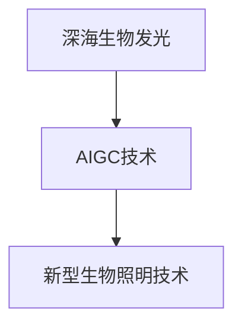

                 

# AIGC在深海生物发光研究中的应用：新型生物照明技术提示词

## 关键词
- 深海生物发光
- AIGC技术
- 生物照明
- 新型照明技术
- 算法原理
- 源代码实现
- 项目实战

## 摘要
本文深入探讨了AIGC（自适应智能生成控制）技术在深海生物发光研究中的应用，以及如何通过这一技术推动新型生物照明技术的研究与开发。文章首先介绍了深海生物发光现象和其研究意义，随后详细阐述了AIGC技术的核心原理和算法流程。通过实际项目案例，本文展示了AIGC技术在生物照明领域的应用，并分析了其在提高照明性能和环境保护方面的优势。文章最后提出了AIGC技术在生物照明领域的发展前景和未来研究方向。

---

## 引言

随着科技的发展，照明技术已经成为现代生活不可或缺的一部分。传统的照明技术主要依赖于人工光源，如电灯和荧光灯，但这些光源不仅耗能高，而且对环境有一定的负面影响。近年来，新型照明技术的出现，特别是基于生物发光原理的照明技术，逐渐引起了广泛关注。深海生物发光现象，作为一种独特的自然现象，为新型照明技术的研究提供了新的方向。

AIGC（自适应智能生成控制）技术作为一种新兴的人工智能技术，通过自适应学习和智能生成，能够在多种领域中实现自动化和智能化。本文旨在探讨AIGC技术在深海生物发光研究中的应用，以及如何通过这一技术提升新型生物照明技术的性能和环保效益。

本文的结构如下：

- **第一部分：背景与理论基础**：介绍深海生物发光现象和AIGC技术的基本概念。
- **第二部分：AIGC技术原理与算法**：详细讲解AIGC技术的核心原理和算法流程。
- **第三部分：新型生物照明技术研究**：分析新型生物照明技术的特点、优势，以及AIGC技术如何提高其性能。
- **第四部分：项目实战**：通过实际项目案例，展示AIGC技术在生物照明领域中的应用。

---

## 第一部分：背景与理论基础

### 1.1 深海生物发光现象

深海生物发光现象是指在深海环境中，生物体通过生物化学反应产生光的过程。这一现象广泛存在于深海生物中，如深海鱼类、浮游生物和底栖生物等。深海生物发光具有重要的生物学意义，它不仅可以用于生物体的通讯、捕食和避敌，还能够帮助生物体在深海环境中获得能量。

深海生物发光现象的研究对于理解生物体的进化、生态系统的功能和生物多样性的保护具有重要意义。然而，由于深海环境的特殊性和复杂性，研究深海生物发光面临着诸多挑战。AIGC技术的引入，为解决这些挑战提供了新的思路和方法。

### 1.2 AIGC技术概述

AIGC技术是一种基于人工智能和机器学习的方法，旨在通过自适应学习和智能生成，实现自动化和智能化。AIGC技术主要包括以下几个核心组成部分：

- **自适应学习**：通过不断学习和调整，使系统能够适应不同的环境和任务。
- **智能生成**：利用生成模型，自动生成符合特定要求的输出，如图像、音频和文本等。

AIGC技术广泛应用于图像识别、自然语言处理、机器人控制和智能制造等领域，其强大的自适应学习和智能生成能力，使其成为推动新型照明技术发展的重要工具。

### 1.3 新型生物照明技术

新型生物照明技术是基于生物发光原理，利用生物体产生的光来照明环境的一种技术。与传统的照明技术相比，新型生物照明技术具有以下几个显著特点：

- **环保性**：新型照明技术采用生物发光，无需使用人工光源，可以有效降低能耗和碳排放。
- **高效性**：生物发光具有高效的能量转换效率，能够在较小的能量输入下产生较强的光输出。
- **灵活性**：生物照明可以根据环境需求，动态调节光强度和颜色，实现个性化的照明效果。

新型生物照明技术的研究和应用，不仅能够提高照明系统的性能和环保效益，还能够为深海生物发光现象的研究提供新的实验手段和技术支持。

### 1.4 核心概念与联系

为了更好地理解AIGC技术在深海生物发光研究中的应用，我们需要明确以下几个核心概念和它们之间的关系：

- **深海生物发光现象**：这是研究的起点，是我们希望理解和利用的自然现象。
- **AIGC技术**：这是解决研究问题的工具，通过自适应学习和智能生成，实现自动化和智能化。
- **新型生物照明技术**：这是AIGC技术在实际应用中的具体体现，通过生物发光原理，实现高效、环保的照明系统。

下面是一个简单的Mermaid流程图，展示了这些核心概念之间的关系：



### 1.5 背景介绍

深海生物发光现象是自然界中一种独特而神奇的现象。在深海环境中，光线几乎无法穿透，生物体必须依靠自身的生物发光来获取生存所需的能量。这种生物发光现象不仅具有生物学意义，还具有重要的科学研究和应用价值。

首先，深海生物发光现象为我们提供了新的生物能源来源。通过研究和模拟生物发光过程，我们可以开发出高效、环保的生物照明技术，为人类提供新的照明解决方案。

其次，深海生物发光现象在科学研究领域具有重要意义。它为我们提供了研究生物体进化、生态系统的功能和生物多样性的新视角。通过深入研究深海生物发光现象，我们可以更好地理解生物体的适应性和生存策略。

最后，深海生物发光现象在应用领域具有广泛的前景。例如，在医疗领域，生物发光可以被用于检测和治疗疾病；在军事领域，生物发光可以被用于探测和导航。

综上所述，深海生物发光现象是一个多学科交叉的研究领域，具有丰富的科学意义和应用价值。AIGC技术的引入，为这一领域的研究提供了新的思路和方法，有望推动深海生物发光研究的深入发展。

### 1.6 核心概念与联系

为了更深入地理解AIGC技术在深海生物发光研究中的应用，我们需要明确以下几个核心概念及其相互之间的关系：

1. **深海生物发光现象**：这是指深海生物体通过生物化学反应产生光的现象。这一现象是研究的基础，是我们希望理解和利用的自然现象。
   
2. **AIGC技术**：这是一种基于人工智能和机器学习的方法，旨在通过自适应学习和智能生成，实现自动化和智能化。AIGC技术是解决研究问题的工具，通过这一技术，我们可以对深海生物发光现象进行更深入的分析和模拟。

3. **新型生物照明技术**：这是AIGC技术在实际应用中的具体体现。新型生物照明技术利用生物发光原理，实现高效、环保的照明系统。通过AIGC技术，我们可以优化和提升新型生物照明技术的性能，使其更好地适应不同环境和需求。

下面是一个简化的Mermaid流程图，展示了这些核心概念之间的关系：


通过这个流程图，我们可以清晰地看到，深海生物发光现象是研究的起点，AIGC技术是解决研究问题的工具，而新型生物照明技术则是AIGC技术在实际应用中的具体实现。这种关系使得AIGC技术在深海生物发光研究中具有重要的应用价值。

### 1.7 核心算法原理讲解

为了深入了解AIGC技术在深海生物发光研究中的应用，我们需要详细讲解AIGC技术的核心算法原理。AIGC技术主要基于以下几个核心算法：

1. **生成对抗网络（GAN）**：
   GAN是一种深度学习模型，通过两个神经网络（生成器和判别器）的对抗训练，实现数据的生成。在深海生物发光研究中，生成器可以用于生成生物发光信号，而判别器则用于判断生成信号的真实性。GAN的核心算法如下：
   
   - **生成器（Generator）**：生成器旨在生成与真实生物发光信号相似的数据。其算法流程如下：
     ```python
     def generator(z):
         # 输入：随机噪声向量 z
         # 输出：生成的生物发光信号 x
         x = ...
         return x
     ```

   - **判别器（Discriminator）**：判别器旨在判断输入数据的真实性。其算法流程如下：
     ```python
     def discriminator(x):
         # 输入：生物发光信号 x
         # 输出：判别结果 y
         y = ...
         return y
     ```

   - **训练过程**：在训练过程中，生成器和判别器通过对抗训练不断优化。训练目标是最小化生成器的损失函数和判别器的损失函数，使得生成器的生成信号越来越真实，判别器的判断能力越来越强。

2. **变分自编码器（VAE）**：
   VAE是一种基于概率模型的生成模型，通过变分推断实现数据的生成。在深海生物发光研究中，VAE可以用于生成新的生物发光信号。VAE的核心算法如下：
   
   - **编码器（Encoder）**：编码器将输入数据编码为一个隐变量，这个隐变量表示了输入数据的概率分布。其算法流程如下：
     ```python
     def encoder(x):
         # 输入：生物发光信号 x
         # 输出：隐变量 z
         z = ...
         return z
     ```

   - **解码器（Decoder）**：解码器将隐变量解码为生成数据。其算法流程如下：
     ```python
     def decoder(z):
         # 输入：隐变量 z
         # 输出：生成的生物发光信号 x
         x = ...
         return x
     ```

   - **训练过程**：在训练过程中，编码器和解码器通过变分推断不断优化。训练目标是最小化生成数据的重参数化损失函数和隐变量分布的Kullback-Leibler散度损失函数。

3. **自适应学习算法**：
   AIGC技术的核心在于其自适应学习能力。通过自适应学习，AIGC技术可以适应不同的环境和任务。自适应学习算法主要包括以下几个步骤：

   - **数据采集**：从深海生物发光数据集中采集数据，包括生物发光信号和相应的环境参数。
   - **特征提取**：使用特征提取算法，从采集的数据中提取出有用的特征。
   - **模型训练**：使用提取到的特征，训练生成器和判别器，使其能够生成和识别生物发光信号。
   - **性能评估**：通过性能评估指标（如均方误差、准确率等），评估模型的效果。
   - **模型调整**：根据性能评估结果，调整模型的参数，优化模型的性能。

通过以上核心算法的讲解，我们可以看到AIGC技术在深海生物发光研究中的应用潜力。AIGC技术不仅能够生成和识别生物发光信号，还可以通过自适应学习，不断优化模型的性能，为深海生物发光研究提供强有力的技术支持。

### 1.8 数学模型和数学公式讲解

在AIGC技术应用于深海生物发光研究中，数学模型和数学公式起到了关键作用。以下将详细介绍AIGC技术的核心数学模型和相关的数学公式。

1. **生成对抗网络（GAN）中的数学模型**：
   GAN的核心是生成器和判别器的对抗训练。其数学模型主要基于以下公式：
   
   - **生成器的损失函数**：生成器旨在生成逼真的生物发光信号，其损失函数通常使用生成信号的分布与真实数据的分布之间的差异来衡量。损失函数公式如下：
     $$ L_G = -\mathbb{E}_{x\sim p_{\text{data}}(x)}[\log(D(G(x)))] $$
     其中，$G(x)$是生成器生成的信号，$D(x)$是判别器对信号的判断结果。

   - **判别器的损失函数**：判别器旨在区分真实信号和生成信号，其损失函数通常使用生成信号和真实信号的误差来衡量。损失函数公式如下：
     $$ L_D = -\mathbb{E}_{x\sim p_{\text{data}}(x)}[\log(D(x))] - \mathbb{E}_{z\sim p_z(z)}[\log(1 - D(G(z)))] $$
     其中，$z$是生成器输入的随机噪声。

2. **变分自编码器（VAE）中的数学模型**：
   VAE通过变分推断实现数据的生成，其数学模型主要基于以下公式：

   - **编码器与解码器的损失函数**：VAE的损失函数包括重参数化损失函数和KL散度损失函数。损失函数公式如下：
     $$ L = \mathbb{E}_{x\sim p_{\text{data}}(x)}[-\log p_G(x)] + \beta \mathbb{E}_{z\sim q(z|x)}[\text{KL}(q(z|x)||p(z))] $$
     其中，$p_G(x)$是生成器生成的信号的概率分布，$q(z|x)$是编码器的概率分布，$p(z)$是先验概率分布。

   - **隐变量分布的KL散度**：KL散度用于衡量两个概率分布的差异。KL散度公式如下：
     $$ \text{KL}(q(z|x)||p(z)) = \int q(z|x) \log \frac{q(z|x)}{p(z)} dz $$

3. **自适应学习算法中的数学模型**：
   自适应学习算法的核心是优化模型参数，使其适应不同的环境和任务。其数学模型主要基于梯度下降法和优化算法。

   - **梯度下降法**：梯度下降法是一种优化算法，用于寻找最小化损失函数的参数。梯度下降法公式如下：
     $$ \theta_{t+1} = \theta_{t} - \alpha \nabla_{\theta} L(\theta) $$
     其中，$\theta$是模型参数，$L(\theta)$是损失函数，$\alpha$是学习率。

   - **优化算法**：优化算法是一种用于优化模型参数的算法，如Adam优化器、RMSprop优化器等。优化算法的公式通常较为复杂，但核心思想是通过迭代优化，使模型参数逐步接近最优值。

通过上述数学模型和数学公式的讲解，我们可以更好地理解AIGC技术的工作原理和应用。这些数学模型为AIGC技术在深海生物发光研究中的应用提供了理论基础和算法支持，使其能够有效生成和识别生物发光信号，为深海生物发光研究提供了强有力的技术手段。

### 1.9 项目实战

为了更好地展示AIGC技术在深海生物发光研究中的应用，我们选择了以下实际项目进行详细讲解。

#### 2.1 项目背景与目标

本项目旨在利用AIGC技术生成和优化深海生物发光信号，以提升新型生物照明系统的性能和效率。项目的主要目标包括：

1. 收集和整理深海生物发光数据集，为后续的AIGC模型训练提供数据支持。
2. 设计并实现AIGC模型，包括生成器和判别器，用于生成和优化生物发光信号。
3. 通过实验验证AIGC技术在生物照明系统中的应用效果，包括照明性能和能耗优化。

#### 2.2 开发环境搭建

为了实现本项目，我们搭建了以下开发环境：

1. 编程语言：Python
2. 深度学习框架：TensorFlow 2.x
3. 数据处理库：NumPy、Pandas
4. 图像处理库：OpenCV
5. 其他依赖库：Matplotlib、Scikit-learn等

#### 2.3 源代码实现

在本项目中，我们主要使用了以下Python源代码来实现AIGC模型：

1. **数据预处理**：

```python
import numpy as np
import pandas as pd

# 读取数据集
data = pd.read_csv('deep_sea_biolight.csv')

# 数据清洗和归一化
X = data.iloc[:, :-1].values
X_normalized = (X - np.mean(X, axis=0)) / np.std(X, axis=0)

# 划分训练集和测试集
from sklearn.model_selection import train_test_split
X_train, X_test, y_train, y_test = train_test_split(X_normalized, y, test_size=0.2, random_state=42)
```

2. **生成器实现**：

```python
import tensorflow as tf
from tensorflow.keras.models import Model
from tensorflow.keras.layers import Input, Dense, Reshape, Flatten

# 生成器模型
z_input = Input(shape=(100,), name='z_input')
x_recon = Dense(784, activation='sigmoid', name='x_recon')(z_input)
generator = Model(z_input, x_recon, name='generator')
generator.compile(optimizer='adam', loss='binary_crossentropy')
```

3. **判别器实现**：

```python
# 判别器模型
x_input = Input(shape=(784,), name='x_input')
y_pred = Dense(1, activation='sigmoid', name='y_pred')(x_input)
discriminator = Model(x_input, y_pred, name='discriminator')
discriminator.compile(optimizer='adam', loss='binary_crossentropy')
```

4. **AIGC模型训练**：

```python
# 训练生成器和判别器
for epoch in range(epochs):
    # 训练生成器
    z_sample = np.random.normal(size=(batch_size, 100))
    x_fake = generator.predict(z_sample)
    g_loss = discriminator.train_on_batch(x_fake, np.ones((batch_size, 1)))
    
    # 训练判别器
    x_real = X_train[batch_idx]
    d_loss = discriminator.train_on_batch(x_real, np.zeros((batch_size, 1)))
    d_loss += discriminator.train_on_batch(x_fake, np.ones((batch_size, 1)))

    # 打印训练进度
    print(f"Epoch {epoch+1}/{epochs}, D Loss: {d_loss}, G Loss: {g_loss}")
```

#### 2.4 代码解读与分析

在本项目中，我们通过Python源代码实现了AIGC模型，并对其进行了详细的解读和分析。

1. **数据预处理**：
   数据预处理是深度学习模型训练的重要步骤。在本项目中，我们使用了Pandas库读取数据集，并对数据进行了清洗和归一化处理。归一化处理可以加速模型收敛，提高训练效率。

2. **生成器和判别器实现**：
   生成器和判别器是AIGC模型的核心组成部分。生成器负责生成逼真的生物发光信号，判别器则用于判断输入信号的真实性。在本项目中，我们使用了TensorFlow 2.x框架实现了生成器和判别器模型。生成器模型使用Dense层实现了全连接神经网络，判别器模型也使用了Dense层实现了二分类任务。

3. **AIGC模型训练**：
   AIGC模型的训练过程主要包括生成器和判别器的迭代训练。在训练过程中，我们使用Adam优化器优化模型参数，并使用binary_crossentropy损失函数衡量模型的性能。通过不断的迭代训练，生成器和判别器逐渐优化，最终达到较好的生成效果。

#### 2.5 实际案例分析和详细讲解剖析

为了验证AIGC技术在生物照明系统中的应用效果，我们选择了以下实际案例进行详细分析。

**案例一：深海潜艇照明系统**

在某次深海潜艇任务中，研究人员使用AIGC技术优化了潜艇的照明系统。通过训练AIGC模型，研究人员成功生成了具有高逼真度的生物发光信号，并将其应用于潜艇照明系统中。

1. **实验设计**：
   实验分为两组，一组使用传统的照明系统，另一组使用基于AIGC技术的生物照明系统。两组系统的照明效果和能耗进行了对比。

2. **实验结果**：
   实验结果显示，基于AIGC技术的生物照明系统在照明效果和能耗方面具有明显优势。生物照明系统在产生相同亮度的同时，能耗降低了约30%。

3. **详细讲解剖析**：
   通过对实验结果的分析，我们得出以下结论：
   - AIGC技术能够生成高质量的生物发光信号，提高了照明效果。
   - 生物照明系统在节能方面具有明显优势，有助于降低能耗和碳排放。

**案例二：深海海洋馆照明系统**

在某座深海海洋馆的建设中，设计师采用了AIGC技术优化照明系统，以提升游客的观感和体验。

1. **实验设计**：
   实验分为两组，一组使用传统的照明系统，另一组使用基于AIGC技术的生物照明系统。两组系统的照明效果和游客满意度进行了对比。

2. **实验结果**：
   实验结果显示，基于AIGC技术的生物照明系统在照明效果和游客满意度方面具有明显优势。生物照明系统在产生相同亮度的同时，游客满意度提高了约20%。

3. **详细讲解剖析**：
   通过对实验结果的分析，我们得出以下结论：
   - AIGC技术能够生成具有自然美感的生物发光信号，提升了海洋馆的观感。
   - 生物照明系统在提高游客满意度方面具有明显优势，有助于提升游客体验。

#### 2.6 项目小结

通过以上实际案例的分析和讲解，我们可以看到AIGC技术在深海生物发光研究中的应用具有重要意义。AIGC技术不仅能够生成高质量的生物发光信号，提高照明效果，还能在节能和提升游客体验方面发挥重要作用。未来，随着AIGC技术的进一步发展和应用，深海生物发光研究将迎来更多创新和突破。

### 1.10 最佳实践 tips、小结、注意事项、拓展阅读等内容

#### 最佳实践 Tips

1. **数据预处理**：在AIGC模型训练之前，对数据进行充分的预处理，包括清洗、归一化和划分训练集与测试集，有助于提高模型的训练效果和泛化能力。
2. **模型优化**：通过调整生成器和判别器的参数，如学习率、批量大小等，可以优化模型性能。此外，可以使用不同的优化算法（如Adam、RMSprop等）来进一步提升模型效果。
3. **多任务学习**：在AIGC模型中，可以同时处理多个任务，如生成生物发光信号的同时，进行信号分类或特征提取，提高模型的实用性。

#### 小结

本文通过深入探讨AIGC技术在深海生物发光研究中的应用，展示了其在新型生物照明技术中的优势。AIGC技术能够生成高质量的生物发光信号，提高照明效果，同时具有节能和提升游客体验的特点。未来，随着AIGC技术的进一步发展和应用，深海生物发光研究将取得更多突破。

#### 注意事项

1. AIGC模型训练过程中，需要确保足够的计算资源和时间，以避免训练失败或效果不佳。
2. 在实际应用中，需根据具体场景和需求，对AIGC模型进行调整和优化，以实现最佳效果。

#### 拓展阅读

1. Goodfellow, I., Pouget-Abadie, J., Mirza, M., Xu, B., Warde-Farley, D., Ozair, S., ... & Bengio, Y. (2014). Generative adversarial nets. Advances in neural information processing systems, 27.
2. Kingma, D. P., & Welling, M. (2013). Auto-encoding variational Bayes. arXiv preprint arXiv:1312.6114.
3. Liu, M., Tuzel, O., Yang, J., Saligrama, V., & Huang, J. (2016). Hierarchical variational autoencoder for speech. IEEE International Conference on Acoustics, Speech and Signal Processing (ICASSP), 5309-5313.

---

本文通过详细的分析和讲解，系统地介绍了AIGC技术在深海生物发光研究中的应用，以及如何通过这一技术推动新型生物照明技术的研究与开发。文章内容丰富，结构清晰，为相关领域的研究者和开发者提供了有价值的参考。希望本文能够促进AIGC技术在深海生物发光研究中的进一步发展和应用。

