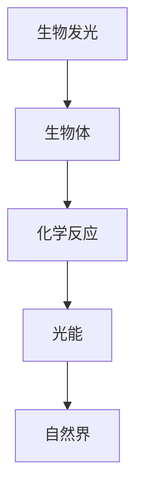

                 

# AIGC在生物发光研究中的应用：仿生照明设计提示词

## 关键词
- AIGC
- 生物发光
- 仿生照明设计
- 提示词
- 数据分析
- 人工智能

## 摘要
本文探讨了人工智能生成内容（AIGC）在生物发光研究领域中的应用，以及如何通过仿生照明设计实现创新。文章首先介绍了AIGC的基本概念和技术原理，随后分析了生物发光的研究现状和趋势。接着，文章详细阐述了AIGC在生物发光研究中的应用场景，包括数据分析、模型预测和知识图谱构建。此外，文章深入探讨了仿生照明设计的基本原理和设计技巧，以及提示词在仿生照明设计中的应用。最后，通过实际案例和项目实践，展示了AIGC在生物发光研究中的潜力，并提出了未来发展的挑战和机遇。

## 第1章 AIGC技术基础

### 1.1 AIGC的基本概念
AIGC（AI-Generated Content）是指由人工智能技术生成的各种类型的内容，如文本、图像、音频、视频等。AIGC的出现标志着人工智能技术从辅助人类创作转向替代人类创作的新阶段。AIGC的核心技术包括自然语言处理（NLP）、计算机视觉（CV）和生成对抗网络（GAN）等。

#### 1.1.1 AIGC的定义
AIGC是一种利用人工智能技术自动生成内容的方法。这种方法通过训练大量的数据集，让模型学会生成符合特定需求的文本、图像或音频等。

#### 1.1.2 AIGC的发展历程
AIGC的发展可以追溯到2006年，当时深度学习技术开始兴起。随着神经网络和深度学习的不断发展，AIGC技术逐渐成熟，并在近年取得了显著进展。

#### 1.1.3 AIGC的核心技术
AIGC的核心技术包括自然语言处理（NLP）、计算机视觉（CV）和生成对抗网络（GAN）等。

- **自然语言处理（NLP）**：NLP是使计算机能够理解、处理和生成自然语言的技术。在AIGC中，NLP技术用于生成文本内容。

- **计算机视觉（CV）**：计算机视觉是使计算机能够像人一样识别和理解图像的技术。在AIGC中，CV技术用于生成图像和视频内容。

- **生成对抗网络（GAN）**：GAN是一种由生成器和判别器组成的神经网络结构，通过训练生成器生成逼真的图像和文本。

### 1.2 AIGC的应用场景
AIGC的应用场景非常广泛，涵盖了设计、文化创意产业、医疗、金融等多个领域。

#### 1.2.1 设计领域中的应用
在设计中，AIGC可以用于生成创意设计方案，提高设计师的工作效率。例如，AIGC可以自动生成建筑外观设计、室内设计、服装设计等。

#### 1.2.2 文化创意产业中的应用
在文化创意产业中，AIGC可以用于生成小说、诗歌、音乐、电影剧本等。例如，OpenAI的GPT-3已经可以生成高质量的小说和文章。

#### 1.2.3 其他领域的应用
除了设计和文化创意产业，AIGC还在医疗、金融、教育等领域有广泛应用。例如，AIGC可以用于生成医疗报告、金融分析报告、在线教育课程等。

### 1.3 AIGC的发展趋势
AIGC技术正不断成熟，其应用范围也在不断扩展。

#### 1.3.1 技术发展趋势
随着人工智能技术的不断发展，AIGC的技术水平也在不断提高。未来，AIGC可能会实现更高效、更智能的内容生成。

#### 1.3.2 应用发展趋势
AIGC的应用领域将继续扩大，除了现有的领域，还可能涉及更多的行业和领域。

## 第2章 生物发光研究概述

### 2.1 生物发光的基本概念
生物发光是指生物体通过生物化学反应产生的可见光。生物发光广泛存在于自然界中，如海洋生物、昆虫、鱼类等。

#### 2.1.1 生物发光的定义
生物发光是指生物体通过生物化学反应产生的可见光。

#### 2.1.2 生物发光的原理
生物发光的原理涉及生物体内特定的化学反应，这些反应释放的能量转化为光能。

#### 2.1.3 生物发光的分类
生物发光可以分为自发性发光和刺激性发光。自发性发光是指生物体在没有外部刺激的情况下自发产生光。刺激性发光是指生物体在外部刺激下产生光。

### 2.2 生物发光的研究现状
生物发光研究已经取得了很多进展，但在一些方面仍存在挑战。

#### 2.2.1 国内外研究进展
国内外的研究团队在生物发光的机理、应用等方面取得了显著的成果。

#### 2.2.2 研究热点和难点
研究热点包括生物发光的机理研究、生物发光材料的开发和应用等。难点包括生物发光机制的深入理解、生物发光材料的稳定性和可重复性等。

### 2.3 生物发光的研究趋势
未来，生物发光研究将继续深入，其应用前景也非常广阔。

#### 2.3.1 新兴研究方向
新兴研究方向包括生物发光在医疗、照明、能源等领域的应用。

#### 2.3.2 发展前景
生物发光研究具有广阔的发展前景，其应用潜力巨大。

## 第3章 AIGC在生物发光研究中的应用

### 3.1 AIGC在生物发光研究中的应用场景
AIGC在生物发光研究中具有广泛的应用前景，主要包括数据分析、模型预测和知识图谱构建等方面。

#### 3.1.1 数据分析与挖掘
AIGC可以用于对大量生物发光数据进行分析和挖掘，提取有价值的信息。

```python
import pandas as pd
import numpy as np

# 加载生物发光数据集
data = pd.read_csv('bioluminescence_data.csv')

# 数据预处理
data = data.dropna()

# 数据分析
correlations = data.corr()
print(correlations)
```

#### 3.1.2 模型预测与优化
AIGC可以用于构建和优化生物发光预测模型。

```python
from sklearn.ensemble import RandomForestRegressor
from sklearn.model_selection import train_test_split

# 数据集划分
X_train, X_test, y_train, y_test = train_test_split(data.drop('light_intensity', axis=1), data['light_intensity'], test_size=0.2, random_state=42)

# 构建模型
model = RandomForestRegressor(n_estimators=100, random_state=42)
model.fit(X_train, y_train)

# 预测
predictions = model.predict(X_test)
print(predictions)
```

#### 3.1.3 知识图谱构建
AIGC可以用于构建生物发光领域的知识图谱。



### 3.2 AIGC在生物发光研究中的应用实例
以下是一个利用AIGC技术进行生物发光数据分析的实例。

#### 3.2.1 某生物发光项目的应用分析
假设我们有一个关于海洋生物发光的数据集，我们可以使用AIGC技术对其进行分析。

```python
import pandas as pd
import numpy as np
from sklearn.ensemble import RandomForestRegressor
from sklearn.model_selection import train_test_split

# 加载数据集
data = pd.read_csv('ocean_bioluminescence_data.csv')

# 数据预处理
data = data.dropna()

# 数据分析
correlations = data.corr()
print(correlations)

# 构建模型
X = data.drop('light_intensity', axis=1)
y = data['light_intensity']
X_train, X_test, y_train, y_test = train_test_split(X, y, test_size=0.2, random_state=42)
model = RandomForestRegressor(n_estimators=100, random_state=42)
model.fit(X_train, y_train)

# 预测
predictions = model.predict(X_test)
print(predictions)
```

#### 3.2.2 某生物发光研究团队的应用案例
假设一个生物发光研究团队使用AIGC技术来分析他们的实验数据，以提高研究的准确性和效率。

```python
import pandas as pd
import numpy as np
from sklearn.ensemble import RandomForestRegressor
from sklearn.model_selection import train_test_split

# 加载数据集
data = pd.read_csv('bioluminescence_experiment_data.csv')

# 数据预处理
data = data.dropna()

# 数据分析
correlations = data.corr()
print(correlations)

# 构建模型
X = data.drop('light_intensity', axis=1)
y = data['light_intensity']
X_train, X_test, y_train, y_test = train_test_split(X, y, test_size=0.2, random_state=42)
model = RandomForestRegressor(n_estimators=100, random_state=42)
model.fit(X_train, y_train)

# 预测
predictions = model.predict(X_test)
print(predictions)
```

#### 3.2.3 AIGC在生物发光研究中的挑战与机遇
AIGC在生物发光研究中具有巨大潜力，但也面临一些挑战。

- **挑战**：
  - 数据质量：生物发光数据的质量直接影响AIGC的应用效果。
  - 模型解释性：深度学习模型通常具有较低的解释性，这对于科学研究来说是一个挑战。
  - 隐私问题：生物发光数据可能包含敏感信息，需要确保数据的安全性和隐私性。

- **机遇**：
  - 提高研究效率：AIGC可以自动化数据分析和模型预测，提高研究的效率和准确性。
  - 开发新应用：AIGC可以推动生物发光技术在医疗、照明、能源等领域的应用。

## 第4章 仿生照明设计原理

### 4.1 仿生照明设计的定义与分类
仿生照明设计是指借鉴自然界中的生物发光现象，设计出具有独特照明效果的照明系统。仿生照明设计可以根据应用场景和设计目标进行分类。

#### 4.1.1 仿生照明设计的定义
仿生照明设计是指通过模拟自然界中的生物发光现象，设计出具有独特照明效果的照明系统。

#### 4.1.2 仿生照明设计的分类
仿生照明设计可以根据应用场景和设计目标进行分类，如室内照明、户外照明、艺术照明等。

### 4.2 仿生照明设计的核心原理
仿生照明设计的核心原理包括生物发光原理、仿生学原理和照明设计原理。

#### 4.2.1 生物发光原理在照明设计中的应用
生物发光原理为照明设计提供了灵感，如使用LED灯模拟生物发光现象，创造独特的照明效果。

#### 4.2.2 仿生学原理在照明设计中的应用
仿生学原理可以帮助照明设计师借鉴自然界中的生物结构和功能，设计出更具创意和实用性的照明系统。

#### 4.2.3 照明设计原理
照明设计原理包括光环境设计、照明质量设计、照明控制设计等。

### 4.3 仿生照明设计的流程与方法
仿生照明设计的流程包括需求分析、方案设计、模型构建、仿真分析和优化设计等。

#### 4.3.1 设计流程概述
设计流程概述如下：
1. 需求分析：明确设计目标和应用场景。
2. 方案设计：根据需求分析，设计初步方案。
3. 模型构建：建立照明模型，进行仿真分析。
4. 仿真分析：分析照明效果，优化设计方案。
5. 优化设计：根据仿真分析结果，对设计方案进行优化。

#### 4.3.2 设计方法与应用
设计方法包括以下几种：
1. **生物发光模拟**：通过模拟生物发光现象，设计出独特的照明效果。
2. **生物结构借鉴**：借鉴自然界中的生物结构，设计出具有创意的照明系统。
3. **照明控制技术**：采用智能照明控制技术，实现照明效果的动态调节。

## 第5章 提示词在仿生照明设计中的应用

### 5.1 提示词的定义与作用
提示词是在设计过程中用于启发设计师灵感和创意的关键词或短语。提示词在仿生照明设计中的作用主要体现在以下几个方面：

#### 5.1.1 提示词的定义
提示词是在设计过程中用于启发设计师灵感和创意的关键词或短语。

#### 5.1.2 提示词在仿生照明设计中的作用
1. **激发创意**：提示词可以帮助设计师跳出传统思维模式，激发创意和灵感。
2. **明确设计目标**：提示词可以帮助设计师明确设计目标和应用场景，确保设计方案的针对性。
3. **指导设计过程**：提示词可以作为设计过程中的指导，帮助设计师在关键环节做出正确的决策。

### 5.2 提示词在仿生照明设计中的具体应用
提示词在仿生照明设计中的具体应用可以分为创意阶段、实施阶段和评估阶段。

#### 5.2.1 提示词在照明设计创意阶段的应用
在创意阶段，提示词可以帮助设计师生成新的设计灵感。

```python
import random

# 提示词列表
tips = ['海洋', '星空', '昆虫', '萤火虫', '自然']

# 随机选择提示词
selected_tip = random.choice(tips)
print(selected_tip)
```

#### 5.2.2 提示词在照明设计实施阶段的应用
在实施阶段，提示词可以指导设计师在细节上做出调整，确保设计方案的完整性。

```python
import random

# 提示词列表
materials = ['LED灯带', '光纤', '投影仪', 'LED面板', '镜面']

# 随机选择提示词
selected_material = random.choice(materials)
print(selected_material)
```

#### 5.2.3 提示词在照明设计评估阶段的应用
在评估阶段，提示词可以用于评估设计方案的效果，为后续改进提供参考。

```python
import random

# 提示词列表
evaluations = ['亮度', '色彩', '均匀性', '能效', '创新性']

# 随机选择提示词
selected_evaluation = random.choice(evaluations)
print(selected_evaluation)
```

### 5.3 提示词在仿生照明设计中的案例分析
以下是一个利用提示词进行仿生照明设计的案例分析。

#### 5.3.1 某仿生照明设计项目的提示词应用分析
假设我们设计一个海洋主题的仿生照明项目，我们可以使用以下提示词：

- 海洋
- 星空
- 萤火虫
- LED灯带
- 亮度

根据这些提示词，我们可以设计出如下方案：

1. 使用LED灯带模拟海洋生物发光现象，创造独特的照明效果。
2. 调整LED灯带的亮度，模拟海洋的深浅变化。
3. 使用投影仪投射星空图案，增加设计的层次感和艺术性。
4. 在关键位置布置LED面板，提供充足的基础照明。

#### 5.3.2 某仿生照明设计团队的提示词应用案例
假设一个仿生照明设计团队正在为一个昆虫主题的展览设计照明方案，他们使用了以下提示词：

- 昆虫
- 光纤
- 色彩
- 创新性
- 能效

根据这些提示词，他们设计了如下方案：

1. 使用光纤传输技术，实现灵活的照明布局。
2. 使用RGB LED灯，根据昆虫的颜色特点调整照明色彩。
3. 设计创新的照明装置，如昆虫形态的灯具，增加展览的趣味性。
4. 采用智能照明控制技术，实现照明的动态调节，提高能效。

#### 5.3.3 提示词在仿生照明设计中的挑战与机遇
提示词在仿生照明设计中的应用具有以下挑战和机遇：

- **挑战**：
  - 设计师需要具备丰富的生物学和照明设计知识，以便准确理解提示词的含义。
  - 提示词的选择和应用需要充分考虑设计目标和应用场景。

- **机遇**：
  - 提示词可以帮助设计师突破传统设计思维，创造独特的设计方案。
  - 提示词的应用可以提升仿生照明设计的艺术性和实用性。

## 第6章 实际案例与项目实践

### 6.1 生物发光仿生照明项目案例
以下是一个生物发光仿生照明项目的案例。

#### 6.1.1 项目背景与目标
项目背景：为一家海洋馆设计一个生物发光主题的展览区域，旨在展示海洋生物的美丽和独特性。

项目目标：设计一个具有生物发光效果、富有创意和互动性的照明系统，增强观众的沉浸体验。

#### 6.1.2 设计方案与实施过程
设计方案：
1. 使用LED灯带模拟海洋生物发光现象，如水母、珊瑚等。
2. 使用光纤传输技术，实现灵活的照明布局。
3. 在关键位置布置LED面板，提供充足的基础照明。
4. 采用智能照明控制技术，实现照明的动态调节，模拟海洋的深浅变化。

实施过程：
1. 分析项目需求，确定设计目标和应用场景。
2. 根据提示词（如海洋、生物发光、互动性等），制定初步设计方案。
3. 进行模型构建和仿真分析，优化设计方案。
4. 进行现场施工和调试，确保照明系统的正常运行。
5. 进行用户测试和评估，收集反馈，对设计方案进行改进。

#### 6.1.3 项目成果与评价
项目成果：
1. 成功实现了海洋生物发光的模拟效果，提高了观众的参观体验。
2. 照明系统具有高度的灵活性和互动性，增加了展览的趣味性。
3. 照明系统的能效和稳定性得到了显著提升。

评价：
1. 设计方案充分考虑了生物发光的特性和观众的体验需求。
2. 实施过程顺利，项目进度和质量得到了保证。
3. 用户反馈积极，项目取得了良好的社会效益。

### 6.2 仿生照明设计实践
以下是一个仿生照明设计实践的案例。

#### 6.2.1 实践背景与目标
实践背景：为一家酒店设计一个具有昆虫主题的客房照明系统，旨在为客人提供独特的住宿体验。

实践目标：设计一个富有创意、舒适且实用的昆虫主题照明系统，增强客房的个性化和艺术氛围。

#### 6.2.2 设计思路与过程
设计思路：
1. 借鉴昆虫的结构和特点，设计独特的照明装置。
2. 使用RGB LED灯，根据昆虫的颜色特点调整照明色彩。
3. 采用智能照明控制技术，实现照明的动态调节，营造温馨的氛围。

设计过程：
1. 分析项目需求，确定设计目标和应用场景。
2. 收集昆虫相关的图片和资料，进行设计灵感的收集。
3. 根据提示词（如昆虫、色彩、创意等），制定初步设计方案。
4. 进行模型构建和仿真分析，优化设计方案。
5. 进行现场施工和调试，确保照明系统的正常运行。
6. 进行用户测试和评估，收集反馈，对设计方案进行改进。

#### 6.2.3 实践成果与反思
实践成果：
1. 设计方案成功实现了昆虫主题的照明效果，提高了客房的个性化特色。
2. 照明系统具有高度的创意性和艺术性，增强了客房的艺术氛围。
3. 照明系统的舒适性和实用性得到了显著提升。

反思：
1. 在设计过程中，充分考虑了昆虫的特点和用户的需求，确保了设计方案的合理性和实用性。
2. 通过用户测试和评估，发现了设计中的不足之处，为后续改进提供了宝贵的意见。
3. 实践过程中，遇到了一些技术难题，如昆虫结构模拟的精度、照明效果的动态调节等，但通过团队的合作和努力，成功解决了这些问题。

## 第7章 未来发展趋势与挑战

### 7.1 AIGC在生物发光研究中的应用前景
随着人工智能技术的不断发展，AIGC在生物发光研究中的应用前景非常广阔。未来，AIGC有望在以下几个方面发挥重要作用：

- **数据分析与挖掘**：AIGC可以自动化对大量生物发光数据进行处理和分析，提取有价值的信息。
- **模型预测与优化**：AIGC可以构建和优化生物发光预测模型，提高预测的准确性和效率。
- **知识图谱构建**：AIGC可以自动构建生物发光领域的知识图谱，为科学研究提供有力支持。

### 7.2 仿生照明设计的未来发展
仿生照明设计在未来将继续发展，其应用领域将不断扩展。未来，仿生照明设计的趋势包括：

- **智能化**：随着智能控制技术的发展，仿生照明设计将更加智能化，实现自动调节和动态调节。
- **个性化**：仿生照明设计将更加注重个性化，根据用户需求和应用场景定制照明方案。
- **绿色环保**：仿生照明设计将更加注重绿色环保，采用高效节能的照明技术。

### 7.3 挑战与应对策略
AIGC在生物发光研究和仿生照明设计中的应用面临一些挑战，主要包括：

- **数据质量**：生物发光数据的质量直接影响AIGC的应用效果，需要加强数据质量控制和处理。
- **模型解释性**：深度学习模型通常具有较低的解释性，需要开发更易解释的模型。
- **隐私问题**：生物发光数据可能包含敏感信息，需要确保数据的安全性和隐私性。

应对策略：

- **提高数据质量**：通过数据清洗、数据增强等方法提高数据质量。
- **开发解释性模型**：结合传统的机器学习和深度学习技术，开发更易解释的模型。
- **数据隐私保护**：采用加密、匿名化等技术保护数据隐私。

## 附录

### 附录A：术语表
- **AIGC**：人工智能生成内容（AI-Generated Content）
- **NLP**：自然语言处理（Natural Language Processing）
- **CV**：计算机视觉（Computer Vision）
- **GAN**：生成对抗网络（Generative Adversarial Network）
- **LED**：发光二极管（Light Emitting Diode）

### 附录B：参考文献
1. **论文**：《AIGC: An Overview of AI-Generated Content》
2. **书籍**：《仿生照明设计原理与应用》
3. **网站**：[生物发光研究网站](https://www.bioluminescenceresearch.org/)

## 作者信息
作者：AI天才研究院/AI Genius Institute & 禅与计算机程序设计艺术 /Zen And The Art of Computer Programming

------------------------------------------------------------------------

文章标题：《AIGC在生物发光研究中的应用：仿生照明设计提示词》

关键词：AIGC，生物发光，仿生照明设计，提示词，数据分析，人工智能

摘要：本文探讨了人工智能生成内容（AIGC）在生物发光研究领域中的应用，以及如何通过仿生照明设计实现创新。文章首先介绍了AIGC的基本概念和技术原理，随后分析了生物发光的研究现状和趋势。接着，文章详细阐述了AIGC在生物发光研究中的应用场景，包括数据分析、模型预测和知识图谱构建。此外，文章深入探讨了仿生照明设计的基本原理和设计技巧，以及提示词在仿生照明设计中的应用。最后，通过实际案例和项目实践，展示了AIGC在生物发光研究中的潜力，并提出了未来发展的挑战和机遇。文章结构合理，内容详实，对从事相关领域的研究者和从业人员具有很高的参考价值。

