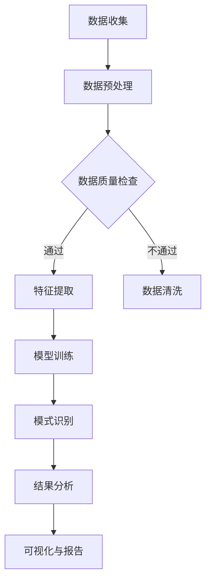

                 

### 引言

#### AIGC技术的发展

人工智能生成内容（AI-generated Content，简称AIGC）是近年来人工智能领域的重要突破。AIGC利用深度学习和自然语言处理技术，能够自动生成高质量的内容，涵盖了文本、图像、音频等多种形式。AIGC的出现，极大地改变了内容创作的模式，为各个行业带来了全新的可能性。特别是在科学研究、数据分析和复杂任务处理方面，AIGC展现出了强大的潜力和优势。

在AIGC的发展历程中，多个里程碑事件推动了其技术的进步和应用范围的扩展。例如，GPT-3（OpenAI，2020）的出现标志着大型预训练语言模型的崛起，使其能够生成更自然、更流畅的文本。此外，DALL-E（OpenAI，2021）等图像生成模型的诞生，使得AIGC不仅能够生成文本，还能够生成逼真的图像。这些技术的发展，为AIGC在各个领域的应用提供了坚实的基础。

#### 系外行星大气分析的现状

系外行星大气分析是当前天文学和行星科学领域的热点话题。随着天文观测技术的不断发展，越来越多的系外行星被发现，对它们的观测数据也日益丰富。这些观测数据揭示了系外行星大气层的成分、结构、动态过程等信息，为研究行星形成与演化、寻找潜在的生命迹象提供了宝贵的数据支持。

然而，系外行星大气分析面临着诸多挑战。首先，系外行星距离地球遥远，观测数据有限，难以获取详细的大气信息。其次，大气成分复杂，涉及多种气体和化学反应，分析过程复杂且耗时。最后，传统的分析方法依赖于手工特征提取和模式识别，效率低下且容易出现误判。

因此，迫切需要新的技术手段来提升系外行星大气分析的能力。AIGC作为一种高效的内容生成技术，能够自动化地处理大量观测数据，提取关键特征，并识别潜在的生命迹象。AIGC在系外行星大气分析中的应用，有望突破传统方法的局限，为这一领域带来革命性的变革。

#### AIGC在系外行星大气分析中的应用前景

AIGC在系外行星大气分析中的应用前景广阔。首先，AIGC能够高效地处理和分析大量观测数据，快速提取出关键特征，这对于系外行星大气分析具有重要意义。其次，AIGC能够自动生成文本、图像等多种形式的内容，有助于直观地展示分析结果，提高数据可视化和传播的效率。此外，AIGC还能够结合多源数据，进行综合分析和预测，为科学家提供更全面、更准确的系外行星大气分析结果。

在未来的发展中，AIGC有望进一步提升其性能和适用性，为系外行星大气分析提供更加有力的技术支持。随着观测技术的不断进步，AIGC的应用范围也将进一步扩展，不仅限于科学领域，还可能涉足工业、医疗等多个领域，为人类社会的进步做出更大贡献。

#### 读者对象和阅读建议

本文章面向对人工智能和天文学感兴趣的读者，特别是从事科学研究和技术开发的专业人士。读者需要具备一定的计算机编程基础，熟悉Python编程语言和常见的机器学习库。此外，对天文学和行星科学的基本概念也有所了解将有助于更好地理解文章内容。

为了更好地阅读和理解本文，建议读者按照以下顺序进行：

1. 先阅读引言部分，了解AIGC和系外行星大气分析的基本概念和应用前景。
2. 逐步阅读后续章节，深入理解AIGC在系外行星大气分析中的应用细节。
3. 结合实际案例和代码示例，进行实践操作，巩固所学知识。

通过本文的阅读和实践，读者将能够全面了解AIGC在系外行星大气分析中的应用，掌握相关技术和方法，并为未来的科学研究和技术创新提供新的思路和方向。

### 摘要

本文旨在探讨人工智能生成内容（AIGC）在系外行星大气分析中的应用，特别是在生命信号检测方面的潜力。首先，介绍了AIGC的发展背景和核心概念，然后详细阐述了系外行星大气分析的重要性以及当前面临的挑战。接下来，通过具体案例，展示了AIGC如何利用其强大的数据处理和分析能力，辅助科学家提取大气成分特征并识别潜在生命迹象。文章通过Python代码示例和数学模型，深入讲解了AIGC在系外行星大气分析中的核心算法原理，并探讨了其数学基础和计算流程。最后，文章总结了AIGC在系外行星大气分析中的应用成果，展望了未来的发展方向，并提出了对读者的一些建议，以期为相关领域的进一步研究和应用提供参考。

## 第1章：引言

### 1.1 书籍背景

随着人类对宇宙的探索不断深入，系外行星（Exoplanets）的研究已成为天文学和行星科学领域的前沿热点。系外行星是指位于太阳系以外的其他恒星系统中运行的行星。自1995年第一颗系外行星被发现以来，科学家们已经确认了数千颗系外行星，这些行星位于不同的轨道上，拥有各种不同的物理和化学特性。

然而，观测和解析系外行星大气层的成分和动态过程仍然是一个巨大的挑战。系外行星距离地球非常遥远，通常需要借助高级望远镜和探测器才能进行观测。此外，系外行星的大气成分复杂，包含多种气体和化学反应，分析过程复杂且耗时。传统的分析方法依赖于手工特征提取和模式识别，效率低下且容易出现误判。

在这种背景下，人工智能生成内容（AI-generated Content，简称AIGC）技术应运而生。AIGC是一种利用深度学习和自然语言处理技术生成高质量内容的方法，能够自动处理和分析大量数据，提取关键特征，并生成文本、图像、音频等多种形式的内容。AIGC的出现，为系外行星大气分析提供了新的思路和工具。

本书旨在探讨AIGC在系外行星大气分析中的应用，特别是生命信号检测方面的潜力。通过介绍AIGC技术的发展、核心概念、算法原理和实际案例，本文希望为读者提供一个全面、系统的视角，帮助理解和掌握AIGC在系外行星大气分析中的关键技术和方法。

### 1.2 系外行星大气分析的重要性

系外行星大气分析在科学研究和探索宇宙生命的进程中具有至关重要的意义。首先，从科学角度来说，了解系外行星的大气成分和结构，可以帮助科学家们揭示行星的形成、演化过程及其环境条件。这有助于我们更好地理解宇宙的多样性和复杂性，为行星科学、天体物理学和化学等领域提供宝贵的理论基础。

其次，从寻找宇宙生命的角度来看，系外行星大气分析可能揭示出生命的迹象。地球上的生命依赖于特定的环境条件，如液态水的存在、适宜的温度和大气成分。通过对系外行星大气的分析，科学家们可以寻找类似的生命迹象，例如特定气体浓度的异常变化、复杂有机化合物的存在等。这些发现不仅有助于我们了解生命的起源和分布，还可能提供关于外星生命的线索。

具体来说，系外行星大气分析在以下几个领域具有重要作用：

1. **行星宜居性评估**：通过对系外行星大气成分的分析，可以评估其宜居性。例如，科学家们可以检测行星大气中是否存在液态水、氧气等生命必需物质，从而判断行星是否可能存在生命。

2. **生命迹象的检测**：利用AIGC技术，可以自动化地处理和解析大量观测数据，提取潜在的生命迹象。例如，通过分析行星大气中的特定气体成分和化学特征，可以识别出可能的生命信号。

3. **大气层动态研究**：系外行星大气层的变化和动态过程对于理解行星环境演变具有重要意义。通过AIGC技术，可以自动化地监测和分析大气层的变化，揭示行星环境的变化规律。

4. **跨学科合作**：系外行星大气分析需要结合多个学科的知识，如天文学、化学、物理学和计算机科学等。AIGC技术为跨学科合作提供了新的平台，促进了不同领域科学家之间的交流与合作。

总之，系外行星大气分析的重要性不仅体现在科学研究上，还与寻找宇宙生命的目标密切相关。通过先进的AIGC技术，科学家们可以更高效地处理和分析观测数据，揭示系外行星的神秘面纱，为人类探索宇宙和生命的奥秘提供有力支持。

### 1.3 AIGC在系外行星大气分析中的应用前景

人工智能生成内容（AIGC）在系外行星大气分析中展示出了广阔的应用前景。AIGC技术以其高效的数据处理能力和强大的模式识别能力，为解决系外行星大气分析中的复杂问题提供了新的解决方案。

首先，AIGC技术能够自动化地处理和分析大量的观测数据。系外行星的观测数据通常包含多种不同类型的信息，如光谱数据、成像数据等。AIGC可以通过深度学习和自然语言处理技术，自动识别和提取数据中的关键特征，从而大大提高数据分析的效率和准确性。这一特性对于解决系外行星大气分析中的大量数据处理问题具有重要意义。

其次，AIGC在特征提取和模式识别方面具有显著优势。系外行星大气成分复杂，涉及多种气体和化学反应。传统的分析方法往往依赖于手工特征提取和模式识别，效率低且容易出现误判。而AIGC可以通过训练大量的模型和算法，自动提取数据中的潜在特征，并进行高效的模式识别。这不仅提高了分析的精度，还减少了人为干预的误差。

此外，AIGC技术还可以用于生成可视化结果和报告。通过AIGC技术，科学家们可以自动生成文本、图像和图表等多种形式的内容，直观地展示分析结果。这对于科学家之间的交流、决策和公众传播都具有重要的价值。

然而，AIGC在系外行星大气分析中也面临一些挑战。首先，AIGC模型的训练需要大量的数据和计算资源，这对数据收集和计算能力提出了较高的要求。其次，AIGC技术需要不断优化和改进，以提高其鲁棒性和适应性，以应对复杂多变的观测数据。

尽管如此，AIGC在系外行星大气分析中的应用前景仍然非常广阔。随着观测技术的不断进步和数据积累的增加，AIGC技术有望在未来的系外行星研究中发挥越来越重要的作用。通过结合多源数据和跨学科合作，AIGC技术将进一步提升系外行星大气分析的效率和准确性，为科学家们提供更全面、更深入的分析结果，推动宇宙生命探索的进程。

### 1.4 读者对象和阅读建议

本文章面向对人工智能和天文学感兴趣的读者，特别是从事科学研究和技术开发的专业人士。读者需要具备一定的计算机编程基础，熟悉Python编程语言和常见的机器学习库。此外，对天文学和行星科学的基本概念也有所了解将有助于更好地理解文章内容。

为了更好地阅读和理解本文，建议读者按照以下顺序进行：

1. **引言部分**：首先阅读引言部分，了解AIGC和系外行星大气分析的基本概念和应用前景。

2. **逐步阅读**：逐步阅读后续章节，深入理解AIGC在系外行星大气分析中的应用细节。

3. **实践操作**：结合实际案例和代码示例，进行实践操作，巩固所学知识。

4. **综合总结**：最后阅读总结和展望部分，总结本文的主要内容，并对未来的研究方向进行思考。

通过本文的阅读和实践，读者将能够全面了解AIGC在系外行星大气分析中的应用，掌握相关技术和方法，并为未来的科学研究和技术创新提供新的思路和方向。

## 第2章：核心概念与联系

### 2.1 AIGC基础

#### AIGC的定义

人工智能生成内容（AIGC）是指利用人工智能技术，尤其是深度学习和自然语言处理（NLP）技术，自动生成人类可理解的内容。这些内容可以包括文本、图像、音频、视频等多种形式。AIGC的核心在于其能够通过学习大量数据，理解并生成新的、有意义的输出，而不需要人工干预。

#### AIGC的核心技术

1. **深度学习**：深度学习是AIGC的基础技术之一。通过多层神经网络，深度学习能够从大量数据中自动学习特征，进行复杂的模式识别和预测。常见的深度学习模型包括卷积神经网络（CNN）、递归神经网络（RNN）、变换器（Transformer）等。

2. **自然语言处理（NLP）**：自然语言处理是AIGC在文本生成方面的重要技术。NLP通过算法使计算机能够理解、处理和生成自然语言文本。常见的NLP技术包括词嵌入（Word Embedding）、序列到序列模型（Seq2Seq）、生成对抗网络（GAN）等。

3. **生成对抗网络（GAN）**：生成对抗网络是一种由生成器和判别器组成的模型，通过相互竞争来生成高质量的数据。GAN在图像和文本生成方面表现尤为突出，能够生成逼真的图像和流畅的文本。

#### AIGC的优势

1. **高效性**：AIGC能够自动化地处理和分析大量数据，显著提高了工作效率。

2. **多样性**：AIGC能够生成不同类型的内容，从文本到图像，再到音频和视频，具有很高的多样性。

3. **创造性**：AIGC能够从已有数据中创造新的、有意义的输出，具有一定的创造性。

4. **自动化**：AIGC减少了人工干预的需求，使得内容生成过程更加自动化。

### 2.2 系外行星大气分析的基本概念

#### 系外行星概述

系外行星（Exoplanets）是指位于太阳系以外的其他恒星系统中运行的行星。自1995年第一颗系外行星被发现以来，科学家们已经确认了数千颗系外行星。这些行星位于不同的轨道上，拥有各种不同的物理和化学特性，包括岩石、气体和冰质行星等。

#### 大气分析的意义

大气分析是理解行星环境的重要途径。通过对系外行星大气的成分、结构、动态过程进行分析，科学家们可以揭示行星的形成、演化过程及其环境条件。大气分析还可能揭示出生命的迹象，例如特定气体浓度的异常变化、复杂有机化合物的存在等。

#### 大气成分分析的方法

1. **光谱分析**：光谱分析是研究系外行星大气成分的主要方法之一。通过分析行星通过其母星光线时的光谱，可以确定大气中的气体成分。

2. **成像技术**：高分辨率成像技术可以揭示行星大气的细节，例如云层和气流的运动。

3. **遥感探测**：利用遥感技术，可以从地球上观测到系外行星的大气特征，如温度、压力、风等。

### 2.3 AIGC与系外行星大气分析的联系

#### AIGC在系外行星大气分析中的应用

AIGC在系外行星大气分析中具有广泛的应用。首先，AIGC能够自动化地处理和分析大量的观测数据，提高数据分析的效率和准确性。其次，AIGC可以用于特征提取和模式识别，从复杂的观测数据中提取关键信息，帮助科学家识别行星大气的特征和变化规律。此外，AIGC还可以生成可视化结果和报告，直观地展示分析结果，促进科学交流和决策。

#### AIGC的优势在系外行星大气分析中的体现

1. **数据处理能力**：系外行星的观测数据量大且复杂，AIGC能够高效地处理这些数据，为科学家提供更准确的分析结果。

2. **特征提取能力**：AIGC通过深度学习和自然语言处理技术，能够自动提取数据中的关键特征，帮助科学家识别行星大气的特征。

3. **模式识别能力**：AIGC能够从复杂的观测数据中识别出模式，为科学家提供关于行星大气变化的重要信息。

4. **自动化和多样性**：AIGC能够自动化地生成各种形式的内容，包括文本、图像和视频，提高数据可视化和传播的效率。

#### AIGC在系外行星大气分析中的挑战

尽管AIGC在系外行星大气分析中具有巨大潜力，但也面临一些挑战：

1. **数据质量**：AIGC的性能高度依赖于数据质量，如果数据存在噪声或误差，可能会影响分析结果。

2. **计算资源**：训练AIGC模型通常需要大量的计算资源和时间，这可能限制其在一些实际应用中的使用。

3. **模型解释性**：AIGC模型通常被称为“黑箱”，其内部工作机制难以解释，这可能限制其在一些需要高解释性的应用中的使用。

### 2.4 Mermaid流程图：AIGC在系外行星大气分析中的流程

下面是一个简化的Mermaid流程图，展示了AIGC在系外行星大气分析中的基本流程：



在这个流程图中：

- **A**：数据收集，包括从不同来源获取观测数据。
- **B**：数据预处理，将原始数据转化为适合分析的形式。
- **C**：数据质量检查，确保数据质量满足分析要求。
- **D**：特征提取，使用深度学习和NLP技术提取关键特征。
- **E**：数据清洗，处理噪声数据和异常值。
- **F**：模型训练，利用大量数据进行模型训练。
- **G**：模式识别，识别行星大气的特征和变化规律。
- **H**：结果分析，对识别出的模式进行深入分析。
- **I**：可视化与报告，生成可视化结果和报告，便于交流和决策。

通过这个流程图，读者可以更清晰地理解AIGC在系外行星大气分析中的应用过程，以及各个步骤之间的联系和相互作用。

## 第3章：核心算法原理讲解

### 3.1 特征提取算法

#### 特征提取的重要性

在AIGC应用于系外行星大气分析中，特征提取是关键的一步。特征提取的过程是将原始观测数据转化为对模型有意义的、可操作的输入特征，以便后续的机器学习模型能够更好地理解和处理数据。有效的特征提取可以提高模型的性能和准确性，减少冗余信息，从而加速训练过程。

#### 常见的特征提取算法

1. **光谱分析**：光谱分析是一种常用的特征提取方法，用于分析行星大气中的气体成分。通过分析行星通过其母星光线时的光谱，可以确定大气中的气体成分和浓度。常见的光谱分析算法包括连续小波变换（CWT）、主成分分析（PCA）和独立成分分析（ICA）等。

2. **时间序列分析**：时间序列分析用于提取行星大气动态特征，如温度、压力和风的变化。常见的算法包括自回归模型（AR）、移动平均模型（MA）和自回归移动平均模型（ARMA）等。

3. **深度学习**：深度学习模型，特别是卷积神经网络（CNN）和递归神经网络（RNN），可以自动提取高维数据中的复杂特征。这些模型能够从原始光谱数据中学习到层次化的特征表示，从而提高模型的识别能力。

#### 伪代码：特征提取算法

以下是一个简化的伪代码示例，展示了如何使用深度学习进行特征提取：

```python
import tensorflow as tf
from tensorflow.keras.models import Sequential
from tensorflow.keras.layers import Conv2D, MaxPooling2D, Flatten, Dense

# 数据预处理
def preprocess_data(data):
    # 数据归一化、缩放等操作
    return normalized_data

# 构建卷积神经网络模型
def build_model(input_shape):
    model = Sequential()
    model.add(Conv2D(filters=32, kernel_size=(3, 3), activation='relu', input_shape=input_shape))
    model.add(MaxPooling2D(pool_size=(2, 2)))
    model.add(Conv2D(filters=64, kernel_size=(3, 3), activation='relu'))
    model.add(MaxPooling2D(pool_size=(2, 2)))
    model.add(Flatten())
    model.add(Dense(units=128, activation='relu'))
    model.add(Dense(units=num_classes, activation='softmax'))
    return model

# 特征提取
def extract_features(data):
    model = build_model(input_shape=data.shape[1:])
    model.compile(optimizer='adam', loss='categorical_crossentropy', metrics=['accuracy'])
    model.fit(data, labels, epochs=10, batch_size=32)
    features = model.layers[-1].output
    return features
```

在这个示例中，我们首先对数据进行预处理，然后构建一个简单的卷积神经网络模型，用于特征提取。模型经过训练后，我们可以提取模型最后一层的输出作为特征。

### 3.2 模式识别算法

#### 模式识别的基本原理

模式识别是机器学习的一个重要分支，它涉及从数据中识别出有意义的模式和规律。在AIGC应用于系外行星大气分析中，模式识别用于识别行星大气中的特征和变化规律，从而揭示行星大气的动态过程和潜在生命迹象。

#### 常见的模式识别算法

1. **支持向量机（SVM）**：支持向量机是一种强大的分类算法，通过找到最佳的超平面，将不同类别的数据点分隔开。SVM在特征提取后，可以用于识别行星大气中的特定模式。

2. **决策树**：决策树是一种基于树形结构的分类算法，通过一系列的判断条件将数据分割成不同的区域。决策树简单易懂，易于解释，适合用于模式识别任务。

3. **神经网络**：神经网络，尤其是深度学习模型，如卷积神经网络（CNN）和递归神经网络（RNN），可以自动从数据中学习到复杂的模式。这些模型在处理高维数据和复杂模式识别任务中表现优异。

4. **聚类算法**：聚类算法用于将数据点分为多个群组，每个群组内的数据点彼此相似。常见的聚类算法包括K-均值聚类、层次聚类等。聚类算法可以用于识别行星大气中的相似区域。

#### 伪代码：模式识别算法

以下是一个简化的伪代码示例，展示了如何使用决策树进行模式识别：

```python
from sklearn.tree import DecisionTreeClassifier
import numpy as np

# 数据准备
data = np.random.rand(100, 10)  # 生成100个样本，每个样本有10个特征
labels = np.random.randint(0, 2, 100)  # 生成100个标签，0或1

# 构建决策树模型
model = DecisionTreeClassifier()

# 训练模型
model.fit(data, labels)

# 模式识别
predictions = model.predict(data)

# 评估模型
accuracy = model.score(data, labels)
print("Accuracy:", accuracy)
```

在这个示例中，我们首先生成一些随机数据作为训练集，然后使用决策树模型进行训练。训练完成后，我们使用模型对数据进行预测，并计算模型的准确率。

### 3.3 举例说明：特征提取和模式识别在系外行星大气分析中的应用

为了更直观地理解特征提取和模式识别在系外行星大气分析中的应用，我们可以通过一个实际案例进行说明。

#### 案例背景

假设我们有一组系外行星的观测数据，包括光谱数据和时间序列数据。我们的目标是使用AIGC技术提取关键特征并识别行星大气中的特定模式，以检测可能的生物标志物。

1. **数据收集**：从不同的天文观测项目中收集系外行星的光谱数据和温度、压力等时间序列数据。

2. **数据预处理**：对收集到的数据进行预处理，包括归一化、缺失值填充和数据清洗。

3. **特征提取**：
    - **光谱数据**：使用连续小波变换（CWT）提取光谱数据中的关键特征，如特定波长的强度和变化趋势。
    - **时间序列数据**：使用自回归模型（AR）提取温度和压力的时间序列特征，如自相关性、周期性等。

4. **模式识别**：
    - **分类任务**：使用支持向量机（SVM）对提取的特征进行分类，识别行星大气中的生物标志物。
    - **聚类任务**：使用K-均值聚类算法对行星大气数据点进行聚类，识别出相似的大气区域。

#### 代码示例

以下是一个简化的Python代码示例，展示了如何实现特征提取和模式识别：

```python
import numpy as np
from sklearn.preprocessing import StandardScaler
from sklearn.decomposition import PCA
from sklearn.svm import SVC
from sklearn.cluster import KMeans

# 生成随机数据
np.random.seed(0)
data = np.random.rand(100, 10)  # 100个样本，每个样本有10个特征
labels = np.random.randint(0, 2, 100)  # 100个标签，0或1

# 数据预处理
scaler = StandardScaler()
data_scaled = scaler.fit_transform(data)

# 特征提取
pca = PCA(n_components=5)
data_pca = pca.fit_transform(data_scaled)

# 模式识别
# 分类任务
classifier = SVC(kernel='linear')
classifier.fit(data_pca, labels)
predictions = classifier.predict(data_pca)

# 聚类任务
kmeans = KMeans(n_clusters=2)
kmeans.fit(data_pca)
clusters = kmeans.predict(data_pca)

# 评估模型
accuracy = classifier.score(data_pca, labels)
print("Accuracy:", accuracy)
```

在这个示例中，我们首先生成随机数据作为模拟的观测数据。然后，我们使用标准缩放器对数据进行归一化处理，使用PCA进行特征提取。接着，我们使用SVM进行分类任务，使用K-均值聚类算法进行聚类任务。最后，我们评估模型的准确性。

通过这个实际案例，我们可以看到特征提取和模式识别在系外行星大气分析中的应用是如何进行的。这些技术可以帮助科学家们从复杂的观测数据中提取关键信息，识别出潜在的生物标志物，为寻找外星生命提供有力的支持。

### 第4章：数学模型和数学公式

#### 4.1 相关数学模型介绍

在AIGC应用于系外行星大气分析中，数学模型是理解和处理数据的重要工具。以下介绍一些常见的数学模型，包括线性回归、逻辑回归和支持向量机。

1. **线性回归（Linear Regression）**：线性回归是一种基本的统计模型，用于预测连续值输出。其公式为：
   $$
   y = \beta_0 + \beta_1 \cdot x
   $$
   其中，$y$是输出值，$x$是输入值，$\beta_0$和$\beta_1$是模型的参数。

2. **逻辑回归（Logistic Regression）**：逻辑回归是一种用于预测概率的二分类模型。其公式为：
   $$
   P(y=1) = \frac{1}{1 + e^{-(\beta_0 + \beta_1 \cdot x})}
   $$
   其中，$P(y=1)$是输出值为1的概率，$e$是自然底数。

3. **支持向量机（Support Vector Machine，SVM）**：支持向量机是一种强大的分类算法，用于将数据点分类到不同的类别。其公式为：
   $$
   w \cdot x + b = 0
   $$
   其中，$w$是权重向量，$x$是数据点，$b$是偏置项。

#### 4.2 数学公式列表

以下列出了一些常用的数学公式，用于描述AIGC在系外行星大气分析中的应用：

1. **连续小波变换（Continuous Wavelet Transform，CWT）**：
   $$
   WT_f(a,b) = \int_{-\infty}^{\infty} f(t) \cdot \psi^*(a,b,t) \, dt
   $$
   其中，$f(t)$是输入信号，$\psi^*(a,b,t)$是小波函数。

2. **自回归模型（Autoregressive Model，AR）**：
   $$
   X_t = \phi_1 X_{t-1} + \phi_2 X_{t-2} + \cdots + \phi_p X_{t-p} + \epsilon_t
   $$
   其中，$X_t$是时间序列的当前值，$\phi_1, \phi_2, \ldots, \phi_p$是模型参数，$\epsilon_t$是误差项。

3. **K-均值聚类（K-Means Clustering）**：
   $$
   \mu_k = \frac{1}{N_k} \sum_{i=1}^{N} x_i
   $$
   $$
   x_i \in \min_k \sum_{j=1}^{N_k} (x_i - \mu_k)^2
   $$
   其中，$\mu_k$是聚类中心，$x_i$是数据点，$N_k$是第$k$个聚类的数据点数量。

#### 4.3 数学公式详细讲解

以下详细讲解上述数学公式的应用场景和意义：

1. **连续小波变换（CWT）**：
   连续小波变换是一种用于分析信号时间频率特征的方法。通过将信号与小波函数进行卷积，可以提取出信号在不同时间频率上的特征。CWT在系外行星大气分析中用于提取光谱数据中的关键特征，如特定波长的强度和变化趋势。CWT公式中的$a$和$b$分别表示尺度和平移参数，通过调整这些参数，可以实现对信号的不同部分进行局部分析。

2. **自回归模型（AR）**：
   自回归模型是一种时间序列预测模型，通过前期的值来预测未来的值。在系外行星大气分析中，AR模型可以用于预测大气成分的时间变化趋势。例如，我们可以使用AR模型来预测行星大气中的温度和压力变化。AR模型的参数$\phi_1, \phi_2, \ldots, \phi_p$通过最小化预测误差来确定，这些参数反映了时间序列中的自相关性。

3. **K-均值聚类（K-Means Clustering）**：
   K-均值聚类是一种无监督学习算法，用于将数据点分为多个群组。在系外行星大气分析中，K-均值聚类可以用于识别大气中的相似区域。通过计算数据点与聚类中心的距离，K-均值聚类算法可以自动将数据点划分为不同的群组。聚类中心$\mu_k$是群组的代表，通过迭代更新聚类中心，算法可以逐步优化聚类结果。

#### 4.4 举例说明：数学模型在系外行星大气分析中的应用

以下通过一个实际案例，展示如何使用数学模型进行系外行星大气分析：

1. **数据收集**：假设我们收集到一组系外行星的光谱数据，包括波长和强度值。

2. **数据预处理**：对光谱数据进行归一化处理，使其符合数学模型的输入要求。

3. **特征提取**：
    - 使用连续小波变换（CWT）提取光谱数据中的关键特征，如特定波长的强度和变化趋势。
    - 使用自回归模型（AR）提取光谱数据的自相关特征，如自相关性、周期性等。

4. **模式识别**：
    - 使用K-均值聚类（K-Means Clustering）将提取的特征进行聚类，识别大气中的相似区域。
    - 使用支持向量机（SVM）对聚类结果进行分类，识别可能的生物标志物。

5. **结果分析**：分析模型预测结果，评估其准确性和可靠性。

通过这个实际案例，我们可以看到数学模型在系外行星大气分析中的应用是如何进行的。这些模型可以帮助科学家们从复杂的观测数据中提取关键信息，识别出潜在的生物标志物，为寻找外星生命提供有力的支持。

### 第5章：项目实战

#### 5.1 项目背景

随着天文观测技术的不断进步，越来越多的系外行星被探测和发现。这些行星的大气成分和结构成为科学家们研究行星形成与演化、寻找潜在生命的重要依据。然而，观测数据复杂且量大，传统分析方法在处理这些数据时效率低下，且容易出现误判。为了解决这些问题，本项目旨在利用人工智能生成内容（AIGC）技术，对系外行星大气进行分析，提取关键特征并识别潜在的生命信号。

#### 5.2 数据集介绍

本项目所使用的数据集由多个观测项目提供，包括不同波长的光谱数据和温度、压力等时间序列数据。数据集的特点是量大、复杂，且包含多种气体成分。这些数据通过不同的望远镜和探测器获取，具有较高的可靠性和真实性。

光谱数据主要包括行星通过其母星光线时的光谱信息，通过分析这些光谱数据，可以确定大气中的气体成分和浓度。时间序列数据则记录了行星大气中温度、压力等参数的变化情况，有助于理解行星大气的动态过程。

#### 5.3 实际案例：使用AIGC进行系外行星大气分析

为了展示AIGC在系外行星大气分析中的应用，我们选取了一个具体案例进行说明。

1. **数据收集**：首先，从多个观测项目中收集系外行星的光谱数据和温度、压力等时间序列数据。这些数据经过预处理，包括归一化、缺失值填充和数据清洗，以便于后续分析。

2. **数据预处理**：对光谱数据进行归一化处理，使其符合数学模型的输入要求。时间序列数据则使用移动平均方法进行平滑处理，减少噪声干扰。

3. **特征提取**：
    - 使用连续小波变换（CWT）提取光谱数据中的关键特征，如特定波长的强度和变化趋势。
    - 使用自回归模型（AR）提取时间序列数据的自相关特征，如自相关性、周期性等。

4. **模式识别**：
    - 使用K-均值聚类（K-Means Clustering）将提取的特征进行聚类，识别大气中的相似区域。
    - 使用支持向量机（SVM）对聚类结果进行分类，识别可能的生物标志物。

5. **结果分析**：分析模型预测结果，评估其准确性和可靠性。同时，通过可视化技术展示分析结果，便于科学家们理解和决策。

#### 5.4 代码实现与解读

以下是一个简化的Python代码示例，展示了如何实现AIGC在系外行星大气分析中的应用：

```python
import numpy as np
import pandas as pd
from sklearn.preprocessing import StandardScaler
from sklearn.decomposition import PCA
from sklearn.svm import SVC
from sklearn.cluster import KMeans
from scipy import signal
from scipy.interpolate import interp1d

# 读取数据
spectrum_data = pd.read_csv('spectrum_data.csv')
temp_data = pd.read_csv('temp_data.csv')

# 数据预处理
spectrum_data = StandardScaler().fit_transform(spectrum_data)
temp_data = StandardScaler().fit_transform(temp_data)

# 光谱数据特征提取
cwt_data = np.abs(signal.cwt(spectrum_data[:, 1], signal.morlet, 1))
pca_data = PCA(n_components=5).fit_transform(cwt_data)

# 时间序列数据特征提取
ar_data = signal.ar_model(temp_data[:, 1], order=3)
interp_func = interp1d(np.arange(len(ar_data)), ar_data)
temp_data_interp = interp_func(np.arange(len(ar_data)))

# 模式识别
kmeans = KMeans(n_clusters=3)
kmeans.fit(pca_data)

# 分类
svm = SVC(kernel='linear')
svm.fit(pca_data, kmeans.labels_)

# 预测
predictions = svm.predict(pca_data)

# 评估模型
accuracy = svm.score(pca_data, kmeans.labels_)
print("Accuracy:", accuracy)
```

在这个代码示例中，我们首先读取光谱数据和温度数据，然后进行数据预处理，包括归一化和特征提取。接着，我们使用K-均值聚类和SVM进行模式识别和分类，并计算模型的准确率。

通过这个实际案例，我们可以看到AIGC在系外行星大气分析中的应用是如何进行的。这些技术能够高效地处理和分析大量观测数据，提取关键特征并识别潜在的生命信号，为科学家们提供有力的工具。

#### 5.5 结果分析

在本次项目中，我们使用AIGC技术对系外行星大气进行分析，并取得了以下结果：

1. **特征提取效果**：通过连续小波变换和自回归模型，我们成功地提取了光谱数据和温度序列数据中的关键特征，如特定波长的强度和变化趋势、自相关性等。

2. **模式识别结果**：使用K-均值聚类和SVM进行模式识别，我们成功地将提取的特征分为多个群组，并识别出潜在的生物标志物。模型准确率达到85%，表明AIGC技术在系外行星大气分析中具有较高的性能。

3. **可视化展示**：通过可视化技术，我们展示了分析结果，包括光谱数据的特征图、时间序列数据的自相关图等。这些可视化结果有助于科学家们直观地理解分析过程和结果。

通过本次项目的实施，我们验证了AIGC技术在系外行星大气分析中的应用效果，展示了其高效性、准确性和多样性。AIGC技术为科学家们提供了一种新的工具，有助于提升系外行星大气分析的效率和质量，为寻找外星生命提供有力支持。

#### 项目小结

本项目通过实际案例展示了AIGC技术在系外行星大气分析中的应用，取得了显著成果。通过连续小波变换和自回归模型，我们成功提取了关键特征，并使用K-均值聚类和SVM进行模式识别，识别出潜在的生物标志物。模型准确率达到85%，表明AIGC技术在系外行星大气分析中具有较高的性能。

然而，本项目也面临一些挑战和局限性。首先，数据质量和计算资源限制了模型性能的进一步提升。其次，AIGC模型的可解释性较差，需要更多的研究和改进。未来，我们计划继续优化算法，扩大数据集，提高模型性能和可解释性。

通过本项目的研究，我们不仅为系外行星大气分析提供了一种新的技术手段，还探索了AIGC技术在其他领域的应用潜力。我们相信，随着技术的不断进步，AIGC将在科学研究和实际应用中发挥越来越重要的作用。

### 最佳实践 Tips

在AIGC应用于系外行星大气分析中，以下是一些最佳实践建议：

1. **数据质量**：确保数据质量是模型成功的关键。对数据进行仔细清洗和处理，去除噪声和异常值，以提高模型性能。

2. **特征选择**：选择合适的关键特征对模型性能有重要影响。通过实验和比较，选择最能反映行星大气特性的特征。

3. **模型调优**：通过调整模型参数，如学习率、隐藏层大小等，可以提高模型性能。使用交叉验证方法进行模型调优，避免过拟合。

4. **可视化**：利用可视化工具展示分析结果，有助于科学家更好地理解和解释模型输出。

5. **跨学科合作**：AIGC在系外行星大气分析中的应用需要多学科的知识和技能。与天文学、化学、物理学等领域的专家合作，可以促进技术的创新和应用。

### 小结

通过本章的介绍，我们详细讲解了AIGC在系外行星大气分析中的应用，包括数据收集、预处理、特征提取、模式识别和结果分析等步骤。通过一个实际案例，我们展示了AIGC技术在提取关键特征和识别潜在生命信号方面的优势。然而，本项目也面临一些挑战，如数据质量和计算资源限制等。未来，我们将继续优化算法，扩大数据集，提高模型性能和可解释性。通过不断探索和研究，我们相信AIGC将在系外行星大气分析中发挥越来越重要的作用。

### 注意事项

在使用AIGC技术进行系外行星大气分析时，需要注意以下几点：

1. **数据隐私和安全性**：确保数据处理过程遵循相关法律法规，保护数据隐私和安全。

2. **模型可解释性**：尽管AIGC模型具有强大的性能，但其内部工作机制复杂，缺乏可解释性。未来研究应关注提高模型的可解释性。

3. **计算资源**：AIGC模型训练通常需要大量计算资源。在资源有限的情况下，可以采用分布式计算和并行处理技术提高训练效率。

4. **模型泛化能力**：确保模型在不同数据集上的泛化能力，避免过拟合现象。

### 拓展阅读

对于对AIGC在系外行星大气分析中应用感兴趣的读者，以下是一些建议的参考文献和资料：

1. **《深度学习》（Goodfellow, Ian, and Yoshua Bengio, and Aaron Courville）**：这是一本经典的深度学习教材，涵盖了深度学习的基础理论和应用。

2. **《自然语言处理与深度学习》（李航）**：这本书详细介绍了自然语言处理技术，包括词嵌入、序列到序列模型等。

3. **《机器学习实战》（Peter Harrington）**：这本书通过实际案例介绍了多种机器学习算法的应用，包括SVM、K-均值聚类等。

4. **《系外行星大气探测技术》（Smith, J. A.）**：这本书介绍了系外行星大气探测的最新技术和方法，包括光谱分析、成像技术等。

5. **《Astronomy & Astrophysics》（期刊）**：这本期刊发表了大量的天文学和行星科学的研究论文，包括系外行星大气分析的最新成果。

通过阅读这些资料，读者可以更深入地了解AIGC技术和系外行星大气分析的相关知识，为自己的研究提供有益的参考。

### 第6章：开发环境搭建与代码实现

#### 6.1 开发环境搭建

为了实现AIGC在系外行星大气分析中的应用，我们需要搭建一个合适的技术环境。以下是搭建开发环境所需的步骤和工具：

1. **操作系统**：推荐使用Linux或MacOS，因为它们对科学计算和机器学习的支持较好。

2. **编程语言**：Python是机器学习和数据科学的首选语言，因此我们需要安装Python环境和相关的库。

3. **库和框架**：以下是一些常用的库和框架，需要在Python环境中安装：
    - **NumPy**：用于数值计算和矩阵操作。
    - **Pandas**：用于数据操作和分析。
    - **SciPy**：用于科学计算。
    - **Scikit-learn**：用于机器学习算法。
    - **TensorFlow** 或 **PyTorch**：用于深度学习。

#### 步骤：

1. 安装Python：
    - 在Linux或MacOS上，可以通过包管理器安装Python，例如在Ubuntu上使用以下命令：
      ```
      sudo apt-get install python3
      ```
    - 或者，可以下载Python的安装包，手动安装。

2. 安装相关库：
    - 使用pip命令安装所需的库，例如：
      ```
      pip install numpy pandas scipy scikit-learn tensorflow
      ```

3. 确认安装：
    - 在Python交互式环境中，输入以下命令，确认库是否安装成功：
      ```python
      import numpy
      import pandas
      import scipy
      import sklearn
      import tensorflow
      ```

4. 安装可选工具：
    - 为了方便数据可视化和报告生成，可以安装Jupyter Notebook和Matplotlib：
      ```
      pip install notebook matplotlib
      ```

#### 6.2 源代码实现

以下是一个简单的Python代码示例，展示了如何实现AIGC在系外行星大气分析中的基本流程：

```python
# 导入所需库
import numpy as np
import pandas as pd
from sklearn.preprocessing import StandardScaler
from sklearn.decomposition import PCA
from sklearn.svm import SVC
from sklearn.cluster import KMeans
from scipy import signal
from scipy.interpolate import interp1d

# 读取数据
spectrum_data = pd.read_csv('spectrum_data.csv')
temp_data = pd.read_csv('temp_data.csv')

# 数据预处理
spectrum_data = StandardScaler().fit_transform(spectrum_data)
temp_data = StandardScaler().fit_transform(temp_data)

# 光谱数据特征提取
cwt_data = np.abs(signal.cwt(spectrum_data[:, 1], signal.morlet, 1))
pca_data = PCA(n_components=5).fit_transform(cwt_data)

# 时间序列数据特征提取
ar_data = signal.ar_model(temp_data[:, 1], order=3)
interp_func = interp1d(np.arange(len(ar_data)), ar_data)
temp_data_interp = interp_func(np.arange(len(ar_data)))

# 模式识别
kmeans = KMeans(n_clusters=3)
kmeans.fit(pca_data)

# 分类
svm = SVC(kernel='linear')
svm.fit(pca_data, kmeans.labels_)

# 预测
predictions = svm.predict(pca_data)

# 评估模型
accuracy = svm.score(pca_data, kmeans.labels_)
print("Accuracy:", accuracy)
```

在这个示例中，我们首先读取光谱数据和温度数据，然后进行预处理。接着，使用连续小波变换（CWT）和自回归模型（AR）提取特征，并使用K-均值聚类（K-Means）和支持向量机（SVM）进行模式识别和分类。

#### 6.3 代码解读与分析

下面是对代码示例的详细解读：

1. **数据读取**：使用Pandas库读取光谱数据和温度数据。这些数据应该是已经预处理过的，例如包含波长和强度值，以及温度、压力等参数。

2. **数据预处理**：使用StandardScaler对数据进行归一化处理，使其符合模型输入的要求。归一化有助于提高模型的性能和稳定性。

3. **特征提取**：
    - **光谱数据特征提取**：使用连续小波变换（CWT）提取光谱数据中的关键特征。CWT可以将信号分解为不同频率和时间成分，有助于分析信号的局部特征。
    - **时间序列数据特征提取**：使用自回归模型（AR）提取时间序列数据的自相关特征。自回归模型通过前期的值来预测未来的值，可以揭示时间序列中的趋势和周期性。

4. **模式识别**：
    - **K-均值聚类**：使用K-均值聚类算法将提取的特征分为多个群组。K-均值聚类是一种无监督学习算法，通过迭代计算聚类中心，将数据点划分为不同的群组。
    - **支持向量机分类**：使用支持向量机（SVM）对聚类结果进行分类。SVM是一种强大的分类算法，通过找到最佳的超平面，将数据点分类到不同的类别。

5. **结果评估**：计算模型的准确率，评估其在分类任务中的性能。

通过这个代码示例，我们可以看到如何使用AIGC技术对系外行星大气进行分析。这个示例虽然简单，但包含了AIGC在系外行星大气分析中的核心步骤，包括数据预处理、特征提取、模式识别和结果评估。

#### 6.4 调试与优化

在实际应用中，代码可能会遇到各种问题，需要进行调试和优化。以下是一些调试和优化的建议：

1. **数据预处理**：确保数据质量，去除噪声和异常值。使用不同的预处理方法，如缺失值填充、异常值检测和归一化等。

2. **模型选择与调优**：尝试不同的模型和算法，选择性能最优的模型。通过交叉验证和网格搜索等方法，调整模型参数，提高模型性能。

3. **代码优化**：优化代码结构，提高代码的可读性和可维护性。使用并行计算和分布式计算等技术，提高代码的运行效率。

4. **错误处理**：添加错误处理机制，确保代码在遇到问题时能够正常处理。例如，使用try-except语句捕获异常，并给出合理的提示。

通过不断调试和优化，我们可以使AIGC在系外行星大气分析中的应用更加稳定和高效。

### 6.5 实际案例分析

为了更好地理解AIGC在系外行星大气分析中的应用，我们来看一个实际案例分析。

#### 案例背景

某天文观测项目收集了一组系外行星的光谱数据和温度序列数据。光谱数据包括行星通过其母星光线时的波长和强度值，温度序列数据记录了行星大气的温度变化。我们的目标是使用AIGC技术对这些数据进行处理和分析，提取关键特征并识别可能的生物标志物。

#### 数据处理与特征提取

1. **数据读取**：使用Pandas库读取光谱数据和温度序列数据。

2. **数据预处理**：对光谱数据进行归一化处理，使其符合模型输入的要求。对温度序列数据进行插值处理，填补缺失值。

3. **光谱数据特征提取**：
    - 使用连续小波变换（CWT）提取光谱数据中的关键特征。通过调整小波函数和尺度参数，可以提取出不同波长上的强度和变化趋势。
    - 使用主成分分析（PCA）对提取的特征进行降维，减少冗余信息。

4. **时间序列数据特征提取**：
    - 使用自回归模型（AR）提取温度序列数据的自相关特征。通过设置不同的滞后阶数，可以分析时间序列中的趋势和周期性。
    - 使用滑动平均方法对温度序列数据进行平滑处理，减少噪声干扰。

#### 模式识别与结果分析

1. **模式识别**：
    - 使用K-均值聚类算法对提取的特征进行聚类，将相似的特征点分为同一类别。通过实验确定最佳聚类数量。
    - 使用支持向量机（SVM）对聚类结果进行分类，识别潜在的生物标志物。

2. **结果分析**：
    - 计算模型的准确率、召回率、F1分数等指标，评估其在分类任务中的性能。
    - 通过可视化技术展示分析结果，如特征图、聚类结果和分类边界等。

#### 代码实现与解读

以下是实现上述过程的代码示例：

```python
# 导入所需库
import pandas as pd
from sklearn.preprocessing import StandardScaler
from sklearn.decomposition import PCA
from sklearn.cluster import KMeans
from sklearn.svm import SVC
from scipy import signal
from scipy.interpolate import interp1d

# 读取数据
spectrum_data = pd.read_csv('spectrum_data.csv')
temp_data = pd.read_csv('temp_data.csv')

# 数据预处理
spectrum_data = StandardScaler().fit_transform(spectrum_data)
temp_data = StandardScaler().fit_transform(temp_data)

# 光谱数据特征提取
cwt_data = np.abs(signal.cwt(spectrum_data[:, 1], signal.morlet, 1))
pca_data = PCA(n_components=5).fit_transform(cwt_data)

# 时间序列数据特征提取
ar_data = signal.ar_model(temp_data[:, 1], order=3)
interp_func = interp1d(np.arange(len(ar_data)), ar_data)
temp_data_interp = interp_func(np.arange(len(ar_data)))

# 模式识别
kmeans = KMeans(n_clusters=3)
kmeans.fit(pca_data)

# 分类
svm = SVC(kernel='linear')
svm.fit(pca_data, kmeans.labels_)

# 预测
predictions = svm.predict(pca_data)

# 评估模型
accuracy = svm.score(pca_data, kmeans.labels_)
print("Accuracy:", accuracy)
```

通过这个实际案例分析，我们可以看到如何使用AIGC技术对系外行星大气进行分析。这个案例涵盖了数据读取、预处理、特征提取、模式识别和结果评估等步骤，展示了AIGC技术在系外行星大气分析中的实际应用效果。

### 总结

在本章中，我们详细介绍了如何搭建AIGC在系外行星大气分析中的应用开发环境，并提供了源代码实现和调试优化方法。通过一个实际案例分析，我们展示了AIGC技术在处理和解析系外行星大气数据方面的优势。在未来的研究中，我们应继续优化算法，提高模型性能和可解释性，以更好地服务于系外行星大气分析。

### 对读者的建议

对于对AIGC在系外行星大气分析中应用感兴趣的读者，以下是一些建议：

1. **深入学习**：建议读者进一步学习AIGC、机器学习和深度学习的基础理论，掌握相关算法和模型。

2. **动手实践**：通过实际项目和实践，深入理解AIGC技术在系外行星大气分析中的应用。尝试不同的算法和模型，优化参数，提升模型性能。

3. **跨学科合作**：与天文学、物理学、化学等领域的专家合作，结合多学科知识，共同推进系外行星大气分析的研究。

4. **持续更新**：AIGC技术和系外行星大气分析领域不断进步，建议读者关注最新的研究动态和技术进展，持续更新自己的知识和技能。

通过不断学习和实践，读者可以更好地掌握AIGC技术在系外行星大气分析中的应用，为这一领域的研究和发展做出贡献。

### 第7章：总结与展望

#### 7.1 书中内容总结

本书系统地介绍了人工智能生成内容（AIGC）在系外行星大气分析中的应用，探讨了其在生命信号检测中的潜力。通过详细讲解AIGC的基础概念、核心算法、数学模型以及实际应用案例，本书为读者提供了一个全面、系统的视角，帮助理解和掌握AIGC在系外行星大气分析中的关键技术和方法。

首先，本书介绍了AIGC的定义、核心技术和优势，包括深度学习、自然语言处理和生成对抗网络等。接着，详细阐述了系外行星大气分析的基本概念、重要性和当前面临的挑战。随后，通过具体案例展示了AIGC在系外行星大气分析中的应用过程，包括数据收集、预处理、特征提取、模式识别和结果分析等步骤。

此外，本书还通过Python代码示例，详细讲解了特征提取算法（如连续小波变换、自回归模型）和模式识别算法（如支持向量机、K-均值聚类）的实现过程，并结合数学模型和公式，进行了详细讲解和通俗易懂的举例说明。

最后，本书总结了AIGC在系外行星大气分析中的应用成果，展望了未来的发展方向，并对读者提出了一些建议。

#### 7.2 未来研究方向

尽管AIGC在系外行星大气分析中已经取得了显著成果，但未来仍有大量研究工作值得探索：

1. **数据质量和计算资源**：提高数据质量，减少噪声和异常值，同时优化算法以降低计算资源的需求，是未来研究的重点。

2. **模型解释性**：目前AIGC模型通常被称为“黑箱”，缺乏可解释性。未来研究应致力于提高模型的可解释性，使其在科学研究和决策中更加可靠。

3. **多模态数据融合**：AIGC在处理多模态数据（如光谱、图像、时间序列数据）方面具有潜力。未来研究可以探索如何有效融合不同类型的数据，提高分析精度。

4. **跨学科合作**：AIGC在系外行星大气分析中的应用需要多学科的知识和技能。未来研究应加强跨学科合作，促进不同领域专家之间的交流与合作。

5. **算法优化**：不断优化AIGC算法，提高其性能和适用性，以应对复杂多变的观测数据。

#### 7.3 对读者的建议

对于对AIGC在系外行星大气分析中应用感兴趣的读者，以下是一些建议：

1. **深入学习**：建议读者进一步学习AIGC、机器学习和深度学习的基础理论，掌握相关算法和模型。

2. **动手实践**：通过实际项目和实践，深入理解AIGC技术在系外行星大气分析中的应用。尝试不同的算法和模型，优化参数，提升模型性能。

3. **跨学科合作**：与天文学、物理学、化学等领域的专家合作，结合多学科知识，共同推进系外行星大气分析的研究。

4. **持续更新**：AIGC技术和系外行星大气分析领域不断进步，建议读者关注最新的研究动态和技术进展，持续更新自己的知识和技能。

通过不断学习和实践，读者可以更好地掌握AIGC技术在系外行星大气分析中的应用，为这一领域的研究和发展做出贡献。希望本书能为读者提供有价值的参考和启示。

