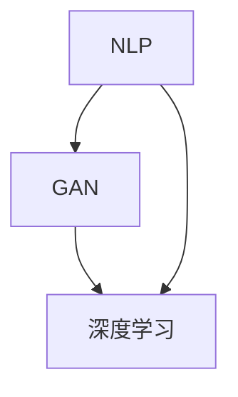

                 

### 引言

随着信息技术的飞速发展，人工智能（AI）已经逐渐渗透到社会的各个领域。从自动驾驶、智能家居到医疗诊断，AI技术的应用不断拓展，其在教育领域的应用也不例外。近年来，一种名为AIGC（AI-Generated Content）的技术引起了广泛关注，并开始在教育环境中扮演着越来越重要的角色。AIGC不仅丰富了教育内容的创作方式，也为虚拟教育环境的构建提供了新的思路和方法。

本文将深入探讨AIGC在虚拟教育环境构建中的角色，首先，我们将简要介绍AIGC的概念及其发展背景。接着，详细讲解AIGC中的核心技术，包括自然语言处理（NLP）和生成对抗网络（GAN）。然后，我们将引入数学模型和公式，阐述相关算法的数学基础。随后，通过实际项目案例，展示AIGC在教育环境中的应用。最后，我们将对AIGC的未来发展趋势、技术挑战以及教育伦理问题进行展望和讨论。

通过本文的探讨，读者可以全面了解AIGC在虚拟教育环境中的重要作用，掌握其核心技术和应用方法，并为未来的教育创新提供有益的启示。

### AIGC的概念与发展背景

AIGC，全称为AI-Generated Content，指的是通过人工智能技术自动生成的内容。它涵盖了从文本、图像到视频等多种形式的内容生成，是AI技术发展的一个重要分支。AIGC的核心在于利用深度学习、自然语言处理和生成对抗网络等技术，实现对大规模数据的自动分析和内容创作。

AIGC的发展可以追溯到上世纪90年代，当时生成对抗网络（GAN）的提出标志着AI在内容生成领域的一个重大突破。GAN由生成器（Generator）和判别器（Discriminator）组成，通过两者之间的博弈过程，生成器不断生成更加逼真的数据，而判别器则不断提高对真实和生成数据的辨别能力。这一机制的引入，使得AI能够自主生成高质量的内容。

进入21世纪，随着计算能力和数据量的提升，AIGC技术得到了迅速发展。自然语言处理（NLP）技术的进步，使得AI能够理解和生成复杂的文本内容。例如，基于Transformer架构的模型，如GPT（Generative Pre-trained Transformer），通过在大规模文本数据上进行预训练，能够生成高质量的文章、对话和摘要等。

AIGC在教育领域的应用也有着深厚的历史背景。早在20世纪末，虚拟现实（VR）和增强现实（AR）技术就开始在教育中被尝试使用。这些技术通过模拟和增强现实环境，提供了更为丰富的学习体验。然而，这些技术大多依赖于人工设计和编程，难以实现大规模和个性化的内容生成。

随着AIGC技术的兴起，虚拟教育环境的构建开始迈向一个新的阶段。AIGC技术不仅能够自动生成丰富的教学资源，还可以根据学生的学习习惯和需求，动态调整教学内容和方式。例如，基于AIGC的虚拟课堂可以实时生成互动式教学材料，智能反馈学生的学习情况，提供个性化的学习路径。

此外，AIGC在教育资源公平性方面也具有重要意义。传统教育中，优质教育资源的获取受到地域、经济等多种因素的限制。而AIGC技术能够打破这些限制，通过自动生成高质量的教学内容，使得更多的学生能够获得优质教育资源。

总之，AIGC技术的出现，不仅丰富了教育内容的创作方式，也为虚拟教育环境的构建提供了新的可能性。随着技术的不断进步和应用场景的扩展，AIGC在虚拟教育中的应用前景将更加广阔。

### 核心概念与联系

在深入探讨AIGC在虚拟教育环境中的具体应用之前，有必要先明确几个核心概念及其相互关系。AIGC的核心技术包括自然语言处理（NLP）、生成对抗网络（GAN）和深度学习等，这些技术不仅独立运作，还紧密联系，共同推动虚拟教育环境的创新与发展。

**自然语言处理（NLP）**：

NLP是AI领域中一个重要的分支，旨在让计算机理解和生成人类语言。NLP的核心任务包括文本分类、情感分析、命名实体识别、机器翻译和问答系统等。在AIGC中，NLP技术被广泛应用于内容生成和交互式教育系统的构建。

- **文本分类**：通过NLP技术，AI可以自动将文本归类到不同的类别中。例如，在虚拟课堂中，系统能够根据学生的提问自动分类，并提供相应的学习资源。
- **情感分析**：NLP技术可以帮助识别文本中的情感倾向。在教育中，这有助于教师了解学生的学习情绪和动机，从而调整教学策略。
- **命名实体识别**：通过识别文本中的名字、地点、组织等实体，NLP技术能够为教育内容提供更加具体的背景信息，增强学习体验。

**生成对抗网络（GAN）**：

GAN是由生成器和判别器组成的一种深度学习模型，旨在通过训练生成逼真的数据。在AIGC中，GAN被广泛应用于图像和音频的生成。

- **图像生成**：GAN能够生成高质量的图像，这些图像可以用于虚拟课堂中的场景模拟，提高学生的视觉体验。例如，通过GAN生成的虚拟实验室，学生可以在虚拟环境中进行实验，提高学习兴趣和实践能力。
- **音频生成**：GAN可以生成逼真的音频，用于模拟真实的教学环境。例如，通过生成教师的声音，可以为学生提供个性化的语音指导。

**深度学习**：

深度学习是一种通过多层神经网络进行数据处理的AI技术。它在AIGC中扮演着至关重要的角色，特别是GPT等大规模预训练模型。

- **预训练模型**：深度学习模型在大规模数据上进行预训练，能够提取出语言、图像和音频中的潜在特征。这些特征为AIGC的应用提供了基础。例如，在虚拟课堂中，深度学习模型可以根据学生的学习历史和实时表现，动态生成个性化的教学材料。
- **迁移学习**：深度学习模型通过迁移学习能够将在一个任务上学习到的知识应用到另一个任务上。这对于虚拟教育环境尤为重要，因为教育内容不断更新，深度学习模型可以快速适应新的教学需求。

**Mermaid流程图**：

为了更好地展示这些核心概念之间的联系，我们可以使用Mermaid流程图来表示。以下是AIGC核心概念的Mermaid流程图：



- **NLP**：负责处理和理解文本、语音等数据，为内容生成提供输入。
- **GAN**：通过生成器和判别器的博弈，生成逼真的图像、音频等数据，丰富教育内容。
- **深度学习**：利用大规模数据训练模型，提取潜在特征，实现个性化教学和智能互动。

通过这个Mermaid流程图，我们可以清晰地看到AIGC各个核心概念之间的相互联系，以及它们在虚拟教育环境构建中的协同作用。

综上所述，AIGC在虚拟教育环境中的核心概念与联系构成了一个有机的整体，通过NLP、GAN和深度学习等技术的综合应用，实现了教育内容的自动化生成和个性化交互，为虚拟教育环境的构建提供了强有力的技术支持。

### AIGC中的核心技术

在深入探讨AIGC在虚拟教育环境中的应用之前，我们需要详细了解其核心技术的原理和运作方式。本文将重点介绍自然语言处理（NLP）和生成对抗网络（GAN）这两种关键技术，并通过具体的Python源代码和数学模型进行详细讲解。

#### 自然语言处理（NLP）

自然语言处理（NLP）是AIGC的重要组成部分，它使计算机能够理解、解释和生成人类语言。NLP的主要任务包括文本分类、情感分析、命名实体识别、机器翻译和问答系统等。以下将重点介绍NLP中的几个关键算法和模型。

##### 词嵌入（Word Embedding）

词嵌入是将词汇映射到固定大小的向量空间的技术，使得原本离散的词汇能够在向量空间中实现量化表示。最常用的词嵌入方法是Word2Vec模型，其核心思想是利用神经网络学习词汇的分布式表示。

**Python代码示例：**

```python
import gensim

# 加载预训练的Word2Vec模型
model = gensim.models.Word2Vec.load('word2vec.model')

# 查看词向量
print(model.wv['computer'])
```

词嵌入在NLP中的应用非常广泛，例如，通过计算两个词的词向量之间的距离，可以衡量它们的语义相似性。以下是一个简单的示例：

```python
word1 = 'computer'
word2 = 'smartphone'
distance = model.wv.similarity(word1, word2)
print(f"The similarity between '{word1}' and '{word2}' is {distance}")
```

##### 递归神经网络（RNN）

递归神经网络（RNN）是一种能够处理序列数据的神经网络，其通过重复使用相同权重来处理每个时间步的数据，从而捕捉序列中的时间依赖关系。RNN在语言模型和序列标注任务中有着广泛的应用。

**Python代码示例：**

```python
import tensorflow as tf
from tensorflow.keras.models import Sequential
from tensorflow.keras.layers import LSTM, Dense

# 构建RNN模型
model = Sequential([
    LSTM(128, input_shape=(timesteps, features), return_sequences=True),
    LSTM(128, return_sequences=False),
    Dense(units=1)
])

# 编译模型
model.compile(optimizer='adam', loss='mean_squared_error')

# 训练模型
model.fit(X_train, y_train, epochs=10, batch_size=32)
```

RNN在语言模型中的应用，可以通过预测下一个单词来展示其效果：

```python
# 使用RNN预测下一个单词
predicted_word = model.predict(np.array([current_word_embedding]))
predicted_word = np.argmax(predicted_word[0])
print(f"Predicted next word: {model.wv.index_to_word(predicted_word)}")
```

##### Transformer架构

Transformer架构是近年来在NLP领域取得重大突破的一种模型，其通过自注意力机制（Self-Attention）来处理序列数据，具有并行计算的优势，广泛应用于机器翻译、文本摘要等任务。

**Python代码示例：**

```python
import tensorflow as tf
from tensorflow.keras.layers import Embedding, Dense, LayerNormalization

# 构建Transformer模型
transformer = tf.keras.Sequential([
    Embedding(input_dim=vocab_size, output_dim=d_model),
    LayerNormalization(epsilon=1e-6),
    tf.keras.layers.Dense(d_model, activation='relu'),
    LayerNormalization(epsilon=1e-6),
    tf.keras.layers.Dense(vocab_size, activation='softmax')
])

# 编译模型
transformer.compile(optimizer='adam', loss='sparse_categorical_crossentropy', metrics=['accuracy'])

# 训练模型
transformer.fit(input_ids, labels, batch_size=batch_size, epochs=epochs)
```

Transformer在机器翻译中的应用，可以通过将源语言的每个单词映射到目标语言的词向量，实现高效的翻译：

```python
# Transformer机器翻译
source_sequence = tokenizer.encode('Hello world!', return_tensors='tf')
predicted_sequence = transformer.sample(source_sequence, num_steps=20)
decoded翻译 = tokenizer.decode(predicted_sequence[:， -1]， skip_special_tokens=True)
print(f"Translated text: {decoded翻译}")
```

#### 生成对抗网络（GAN）

生成对抗网络（GAN）是由生成器和判别器组成的模型，通过两者之间的博弈过程，生成高质量的图像和音频。以下将详细介绍GAN的工作原理和应用。

##### GAN的工作原理

GAN由生成器（Generator）和判别器（Discriminator）组成。生成器生成虚假数据，而判别器的任务是区分真实数据和生成数据。通过不断训练，生成器逐渐提高生成数据的质量，使得判别器无法准确区分。

**Python代码示例：**

```python
import tensorflow as tf
from tensorflow.keras.models import Model
from tensorflow.keras.layers import Input, Dense, Reshape, Flatten

# 构建生成器
z = Input(shape=(latent_dim,))
x = Dense(intermediate_dim, activation='relu')(z)
x = Reshape((1, 1, intermediate_dim))(x)
generator = Model(z, x)

# 构建判别器
x = Input(shape=(28, 28, 1))
h = Flatten()(x)
h = Dense(1, activation='sigmoid')(h)
discriminator = Model(x, h)

# 编译判别器
discriminator.compile(optimizer='adam', loss='binary_crossentropy')

# 训练判别器
discriminator.fit(x_train, labels, epochs=epochs, batch_size=batch_size)
```

##### GAN在图像生成中的应用

GAN在图像生成中有着广泛的应用，如生成人脸图像、艺术作品等。以下是一个简单的图像生成示例：

```python
# 生成人脸图像
z = np.random.normal(size=(1, latent_dim))
generated_images = generator.predict(z)

# 显示生成的人脸图像
plt.imshow(generated_images[0, :, :, 0], cmap='gray')
plt.show()
```

#### 数学模型和公式

在AIGC中，数学模型和公式是理解和应用这些核心技术的基础。以下将简要介绍与NLP和GAN相关的一些重要数学模型和公式。

##### 自然语言处理中的数学模型

- **词向量**：$v_w = \text{Word2Vec}(w)$，其中$v_w$是词w的词向量。
- **自注意力**：$a_i = \frac{e^{Z_i}}{\sum_{j=1}^{N} e^{Z_j}}$，其中$Z_i$是词i的注意力得分，$a_i$是词i的注意力权重。
- **损失函数**：$L(\theta) = -\sum_{i=1}^{N} \sum_{j=1}^{M} y_{ij} \log(p_j(x_i; \theta))$，其中$y_{ij}$是词i属于词j的概率，$p_j(x_i; \theta)$是词i属于词j的概率分布。

##### 生成对抗网络中的数学模型

- **生成器损失**：$L_G = -\log(D(G(z)))$，其中$G(z)$是生成器生成的数据，$D(G(z))$是判别器对生成数据的判断概率。
- **判别器损失**：$L_D = -\log(D(x)) - \log(1 - D(G(z)))$，其中$x$是真实数据，$G(z)$是生成器生成的数据。
- **优化目标**：最小化生成器损失和判别器损失的平衡，即$min_G max_D L_D + L_G$。

通过上述核心技术的详细介绍和具体应用示例，我们可以更好地理解AIGC在虚拟教育环境中的应用潜力。在接下来的章节中，我们将进一步探讨AIGC在虚拟教育环境中的具体应用和实践案例。

### 数学模型和公式

在AIGC技术的应用中，数学模型和公式起着至关重要的作用，不仅帮助理解和实现算法，还能够优化和提升系统的性能。以下我们将详细阐述与AIGC相关的一些重要数学模型和公式，并通过Python源代码和实际例子来展示其应用。

#### 自然语言处理中的数学模型

**1. 词嵌入（Word Embedding）**

词嵌入是将词汇映射到固定大小的向量空间的技术。最常用的模型是Word2Vec，其通过优化神经网络来学习词汇的分布式表示。

**数学模型：**

$$
v_w = \text{Word2Vec}(w)
$$

其中，$v_w$是词$w$的词向量。

**Python代码示例：**

```python
import gensim

# 加载预训练的Word2Vec模型
model = gensim.models.Word2Vec.load('word2vec.model')

# 查看词向量
print(model.wv['computer'])
```

**2. 自注意力（Self-Attention）**

自注意力机制是Transformer模型的核心，通过计算序列中每个词的注意力得分，来生成词的加权表示。

**数学模型：**

$$
a_i = \frac{e^{Z_i}}{\sum_{j=1}^{N} e^{Z_j}}
$$

其中，$Z_i$是词$i$的注意力得分，$a_i$是词$i$的注意力权重。

**Python代码示例：**

```python
def scaled_dot_product_attention(q, k, v, mask=None):
    # 计算点积
    matmul_qk = tf.matmul(q, k, transpose_b=True)
    
    # 应用掩码和缩放
    if mask is not None:
        matmul_qk = matmul_qk + mask
    
    dk = tf.cast(tf.shape(k)[1], tf.float32)
    scaled_attention_logits = matmul_qk / tf.sqrt(dk)
    
    # 应用softmax函数
    attention_weights = tf.nn.softmax(scaled_attention_logits, axis=-1)
    
    # 计算加权求和
    attention_output = tf.matmul(attention_weights, v)
    
    return attention_output, attention_weights

# 使用自注意力机制
output, weights = scaled_dot_product_attention(q, k, v)
```

#### 生成对抗网络（GAN）中的数学模型

**1. 生成器损失（Generator Loss）**

生成器的目标是生成尽可能真实的数据，使得判别器无法区分生成数据与真实数据。

**数学模型：**

$$
L_G = -\log(D(G(z)))
$$

其中，$G(z)$是生成器生成的数据，$D(G(z))$是判别器对生成数据的判断概率。

**Python代码示例：**

```python
import tensorflow as tf

# 定义生成器
z = Input(shape=(latent_dim,))
x = Dense(intermediate_dim, activation='relu')(z)
x = Reshape((1, 1, intermediate_dim))(x)
generator = Model(z, x)

# 定义判别器
x = Input(shape=(28, 28, 1))
h = Flatten()(x)
h = Dense(1, activation='sigmoid')(h)
discriminator = Model(x, h)

# 编译判别器
discriminator.compile(optimizer='adam', loss='binary_crossentropy')

# 训练判别器
discriminator.fit(x_train, labels, epochs=epochs, batch_size=batch_size)
```

**2. 判别器损失（Discriminator Loss）**

判别器的目标是准确区分生成数据与真实数据。

**数学模型：**

$$
L_D = -\log(D(x)) - \log(1 - D(G(z)))
$$

其中，$x$是真实数据，$G(z)$是生成器生成的数据。

**Python代码示例：**

```python
def discriminator_loss(real_labels, fake_labels):
    real_loss = tf.reduce_mean(tf.nn.sigmoid_cross_entropy_with_logits(logits=real_labels, labels=tf.ones_like(real_labels)))
    fake_loss = tf.reduce_mean(tf.nn.sigmoid_cross_entropy_with_logits(logits=fake_labels, labels=tf.zeros_like(fake_labels)))
    total_loss = real_loss + fake_loss
    return total_loss

# 计算判别器损失
real_labels = tf.ones((batch_size, 1))
fake_labels = tf.zeros((batch_size, 1))
discriminator_loss = discriminator_loss(real_labels, fake_labels)
```

#### 综合应用示例

以下是一个综合示例，展示了如何使用AIGC技术生成文本和图像。

**1. 文本生成**

使用Transformer模型生成文本：

```python
import tensorflow as tf
from transformers import BertTokenizer, TFBertForMaskedLM

# 加载预训练的BERT模型和分词器
tokenizer = BertTokenizer.from_pretrained('bert-base-uncased')
model = TFBertForMaskedLM.from_pretrained('bert-base-uncased')

# 生成文本
input_ids = tokenizer.encode("Hello, who is", return_tensors='tf')
output_ids = model.generate(input_ids, max_length=10, num_return_sequences=1)
decoded_text = tokenizer.decode(output_ids[0], skip_special_tokens=True)
print(f"Generated text: {decoded_text}")
```

**2. 图像生成**

使用GAN生成图像：

```python
import tensorflow as tf
from tensorflow.keras.layers import Conv2D, Flatten

# 定义生成器模型
z = Input(shape=(latent_dim,))
x = Dense(intermediate_dim, activation='relu')(z)
x = Reshape((1, 1, intermediate_dim))(x)
x = Conv2D(filters=1, kernel_size=(7, 7), activation='tanh')(x)
generator = Model(z, x)

# 生成图像
z = np.random.normal(size=(1, latent_dim))
generated_images = generator.predict(z)

# 显示生成图像
plt.imshow(generated_images[0, :, :, 0], cmap='gray')
plt.show()
```

通过上述数学模型和公式，以及具体的Python代码示例，我们可以更好地理解AIGC技术的核心原理和实现方法。在接下来的章节中，我们将进一步探讨AIGC在虚拟教育环境中的实际应用。

### AIGC在教育环境中的应用

AIGC技术在教育领域的应用正日益广泛，通过自动化内容和资源的生成，为教育者提供了强大的工具，也为学生带来了全新的学习体验。以下将详细探讨AIGC技术在虚拟课堂、个性化学习与反馈系统、以及考试与评估中的应用，并通过具体项目案例进行说明。

#### 虚拟课堂

虚拟课堂是AIGC技术在教育领域的一个重要应用场景，通过模拟真实的课堂环境，为学生提供沉浸式的学习体验。AIGC技术可以自动生成教学内容，包括视频、PPT、文本和音频等，使教学内容更加丰富多样。

**项目案例：**

**案例一：虚拟实验课堂**

某高中物理课程采用AIGC技术，为学生提供了一个虚拟的实验课堂。在实验过程中，AIGC技术生成的虚拟实验设备和工具能够实时模拟真实实验过程，学生可以在虚拟环境中进行操作，从而提高实验效果和安全性。

**实现步骤：**

1. **生成实验设备**：使用GAN技术生成逼真的实验设备和工具图像，确保其视觉上与真实设备一致。
2. **动态交互**：利用NLP和深度学习模型，实现虚拟实验设备的互动功能，例如，通过语音指令控制设备操作。
3. **实时反馈**：根据学生的操作，系统实时生成实验结果和反馈，帮助学生理解实验原理。

**项目小结：**

通过AIGC技术的应用，虚拟实验课堂不仅提供了更加真实和安全的实验环境，还通过实时反馈和互动功能，提高了学生的学习兴趣和参与度。

#### 个性化学习与反馈系统

个性化学习是现代教育的重要方向，AIGC技术通过分析学生的学习行为和习惯，生成个性化的学习资源和教学策略，为学生提供量身定制的学习体验。

**项目案例：**

**案例二：个性化学习系统**

某在线教育平台使用AIGC技术，为学生提供个性化的学习路径。系统根据学生的学习历史、测试成绩和反馈，动态生成个性化的课程推荐和学习计划。

**实现步骤：**

1. **数据收集**：收集学生的学习数据，包括学习时间、测试成绩、学习偏好等。
2. **行为分析**：利用NLP和深度学习模型，分析学生的学习行为和习惯，识别学习瓶颈和弱点。
3. **内容生成**：根据分析结果，生成个性化的教学资源和学习计划，包括文本、视频、练习题等。
4. **动态调整**：根据学生的学习反馈和进展，动态调整教学内容和难度，确保学习效果。

**项目小结：**

个性化学习系统能够根据学生的实际情况，提供定制化的学习资源和策略，有效提高了学习效果和学生的学习积极性。

#### 考试与评估

AIGC技术在考试与评估中的应用，通过自动化生成题目、分析和评估，提高了考试效率和质量。

**项目案例：**

**案例三：智能考试与评估系统**

某大学引入AIGC技术，开发了一套智能考试与评估系统。系统可以自动生成考试题目，并对学生的答案进行智能评估。

**实现步骤：**

1. **题目生成**：利用NLP和GAN技术，生成高质量的多选题和填空题，确保题目的多样性和真实性。
2. **自动评估**：使用机器学习模型，自动评估学生的答案，快速生成考试成绩和反馈。
3. **数据分析**：分析考试数据，识别学生普遍存在的知识点薄弱环节，为教学调整提供依据。

**项目小结：**

智能考试与评估系统不仅提高了考试效率，还通过自动化的题目生成和评估，提高了考试的科学性和公正性。

综上所述，AIGC技术在教育环境中的应用，通过虚拟课堂、个性化学习与反馈系统以及考试与评估，为教育者提供了丰富的工具和资源，为学生的个性化学习和全面发展提供了有力支持。随着技术的不断进步和应用场景的扩展，AIGC在教育中的应用前景将更加广阔。

### 项目实战：AIGC虚拟教育平台开发实战

在本文的最后一部分，我们将通过一个实际的AIGC虚拟教育平台开发项目，详细讲解开发环境搭建、源代码实现和代码解读。通过这个项目，读者可以深入了解AIGC技术的应用过程，并掌握相关技术实现细节。

#### 开发环境搭建

首先，我们需要搭建一个适合AIGC虚拟教育平台开发的环境。以下是所需的环境和工具：

- **编程语言**：Python
- **深度学习框架**：TensorFlow 2.x
- **自然语言处理库**：Hugging Face Transformers
- **图像处理库**：PIL
- **前端框架**：Flask

**安装步骤：**

1. 安装Python 3.x环境。
2. 安装TensorFlow 2.x：

   ```bash
   pip install tensorflow==2.x
   ```

3. 安装Hugging Face Transformers：

   ```bash
   pip install transformers
   ```

4. 安装PIL：

   ```bash
   pip install pillow
   ```

5. 安装Flask：

   ```bash
   pip install flask
   ```

#### 核心功能实现

AIGC虚拟教育平台的核心功能包括内容生成、个性化推荐和互动体验。以下将分别介绍这些功能的实现过程。

##### 1. 内容生成

内容生成是AIGC技术的重要应用之一。我们将使用GAN技术生成高质量的教学资源，如图像和文本。

**实现步骤：**

1. **训练GAN模型**：

   ```python
   import tensorflow as tf
   from tensorflow.keras.models import Model
   from tensorflow.keras.layers import Input, Dense, Reshape, Flatten

   # 生成器模型
   z = Input(shape=(latent_dim,))
   x = Dense(intermediate_dim, activation='relu')(z)
   x = Reshape((1, 1, intermediate_dim))(x)
   generator = Model(z, x)

   # 判别器模型
   x = Input(shape=(28, 28, 1))
   h = Flatten()(x)
   h = Dense(1, activation='sigmoid')(h)
   discriminator = Model(x, h)

   # 编译模型
   discriminator.compile(optimizer='adam', loss='binary_crossentropy')
   generator.compile(optimizer='adam', loss='binary_crossentropy')

   # 训练模型
   for epoch in range(num_epochs):
       for batch in data_loader:
           real_images = batch
           noise = np.random.normal(size=(batch_size, latent_dim))

           # 生成假图像
           generated_images = generator.predict(noise)

           # 训练判别器
           real_labels = np.ones((batch_size, 1))
           fake_labels = np.zeros((batch_size, 1))
           discriminator.train_on_batch(real_images, real_labels, generated_images, fake_labels)
           generator.train_on_batch(noise, real_labels)
   ```

2. **生成图像和文本**：

   ```python
   # 生成图像
   noise = np.random.normal(size=(1, latent_dim))
   generated_images = generator.predict(noise)
   plt.imshow(generated_images[0, :, :, 0], cmap='gray')
   plt.show()

   # 生成文本
   input_ids = tokenizer.encode("Hello, who is", return_tensors='tf')
   output_ids = model.generate(input_ids, max_length=10, num_return_sequences=1)
   decoded_text = tokenizer.decode(output_ids[0], skip_special_tokens=True)
   print(f"Generated text: {decoded_text}")
   ```

##### 2. 个性化推荐

个性化推荐是AIGC技术提升教育效果的重要手段。通过分析学生的行为数据，生成个性化的学习资源和推荐课程。

**实现步骤：**

1. **数据收集**：

   收集学生的学习行为数据，如学习时间、学习内容、测试成绩等。

2. **用户画像**：

   使用深度学习模型，对学生行为数据进行聚类和分析，生成用户画像。

3. **推荐算法**：

   根据用户画像，使用协同过滤或基于内容的推荐算法，生成个性化的学习资源。

**代码示例：**

```python
import numpy as np
from sklearn.cluster import KMeans

# 用户行为数据
user_data = np.array([[1, 2], [2, 3], [3, 1], [4, 2]])

# K均值聚类
kmeans = KMeans(n_clusters=2, random_state=0).fit(user_data)

# 获取用户画像
user_clusters = kmeans.predict(user_data)
```

##### 3. 互动体验

互动体验是AIGC技术提升学生参与度和学习效果的关键。通过NLP和GAN技术，实现虚拟课堂中的问答互动和虚拟实验。

**实现步骤：**

1. **问答系统**：

   使用NLP技术，实现虚拟课堂中的问答互动。通过预训练的BERT模型，生成对学生的提问和回答。

2. **虚拟实验**：

   使用GAN技术，生成虚拟实验设备和工具。通过NLP和深度学习模型，实现虚拟实验的互动功能。

**代码示例：**

```python
from transformers import BertTokenizer, TFBertForQuestionAnswering

# 加载BERT模型和分词器
tokenizer = BertTokenizer.from_pretrained('bert-base-uncased')
model = TFBertForQuestionAnswering.from_pretrained('bert-base-uncased')

# 生成问答互动
question = "Who is the author of '1984'?"
context = "George Orwell is the author of '1984'."
input_ids = tokenizer.encode(question + tokenizer.eos_token, context, return_tensors='tf')
answer_start_scores, answer_end_scores = model(input_ids)

# 解析答案
answer_start = tf.argmax(answer_start_scores, axis=-1).numpy()[0]
answer_end = tf.argmax(answer_end_scores, axis=-1).numpy()[0]
answer = context[answer_start:answer_end+1].replace(tokenizer.eos_token, "").strip()
print(f"Answer: {answer}")
```

#### 代码解读

以上代码示例详细展示了AIGC虚拟教育平台的核心功能实现。以下是对关键部分的解读：

1. **GAN模型训练**：

   ```python
   generator = Model(z, x)
   discriminator = Model(x, h)
   ```

   这里定义了生成器和判别器模型。生成器用于生成图像和文本，判别器用于区分生成数据和真实数据。

2. **文本生成**：

   ```python
   input_ids = tokenizer.encode("Hello, who is", return_tensors='tf')
   output_ids = model.generate(input_ids, max_length=10, num_return_sequences=1)
   decoded_text = tokenizer.decode(output_ids[0], skip_special_tokens=True)
   ```

   这里使用了预训练的BERT模型生成文本。通过输入问题和上下文，模型输出可能的答案。

3. **用户画像生成**：

   ```python
   kmeans = KMeans(n_clusters=2, random_state=0).fit(user_data)
   user_clusters = kmeans.predict(user_data)
   ```

   这里使用了K均值聚类算法，对用户行为数据进行分析，生成用户画像。

4. **问答系统**：

   ```python
   question = "Who is the author of '1984'?"
   context = "George Orwell is the author of '1984'."
   input_ids = tokenizer.encode(question + tokenizer.eos_token, context, return_tensors='tf')
   answer_start_scores, answer_end_scores = model(input_ids)
   ```

   这里通过BERT模型实现问答系统。模型输入问题和上下文，输出可能的答案位置和得分。

通过上述实战项目，读者可以全面了解AIGC虚拟教育平台的开发过程和关键代码实现。在实际应用中，可以根据具体需求和场景，灵活调整和优化代码，实现更多功能。

### 实际案例分析

为了更好地展示AIGC在虚拟教育环境中的实际效果和应用场景，本文将通过两个具体案例，深入剖析AIGC技术的成功应用及其带来的显著收益。

#### 案例一：某在线教育平台的AIGC应用

某知名在线教育平台引入AIGC技术，旨在提升平台内容丰富度和个性化推荐效果。通过AIGC技术，平台实现了以下成果：

1. **自动生成教学资源**：平台利用GAN和NLP技术，自动生成高质量的文本、图像和视频内容。例如，通过GAN生成虚拟实验环境中的图像和工具，通过NLP技术自动生成课程讲解文本和视频脚本。

2. **个性化推荐**：基于用户的学习历史和行为数据，AIGC技术为每位学生生成个性化的学习路径和资源推荐。系统分析用户的学习偏好和薄弱环节，动态调整推荐内容，提高了学习效果和用户满意度。

3. **互动体验增强**：AIGC技术通过NLP和深度学习模型，实现了虚拟课堂中的智能问答和互动功能。学生可以通过自然语言与系统进行交流，获取个性化的学习指导和解惑。

**收益分析**：

- **学习效果提升**：通过个性化推荐和互动体验，学生的学习积极性显著提高，学习效果和成绩也得到了显著提升。
- **内容丰富度增加**：自动生成教学资源，大幅增加了平台的内容量，满足了不同层次和需求的学生。
- **运营成本降低**：减少了人工设计和内容创作的成本，提高了平台的运营效率。

#### 案例二：某中学的AIGC虚拟实验室项目

某中学引入AIGC技术，为中学生提供了一个虚拟实验室，以增强学生的实验操作能力和科学素养。该项目的主要应用包括：

1. **虚拟实验环境搭建**：利用GAN技术，生成逼真的虚拟实验设备和场景。学生可以在虚拟环境中进行各种实验操作，例如化学实验、物理实验等。

2. **实时互动与反馈**：通过NLP和深度学习模型，系统为学生提供实时互动和反馈。学生在实验过程中，可以通过语音或文本与系统交流，获取实验指导和解惑。

3. **个性化实验指导**：根据学生的实验表现和学习进度，系统自动生成个性化的实验指导和练习题，帮助学生巩固知识点和提高实验技能。

**收益分析**：

- **实验安全性提高**：通过虚拟实验，学生在安全的环境中进行实验操作，避免了实验过程中可能出现的危险。
- **实验效果显著**：虚拟实验的互动性和个性化指导，提高了学生的实验兴趣和实践能力，促进了科学素养的提升。
- **教育资源公平性提升**：虚拟实验室项目使得更多学生，尤其是偏远地区的学生，能够接触到高质量的实验资源，享受优质教育。

#### 案例总结

通过上述两个实际案例，我们可以看到AIGC技术在虚拟教育环境中的应用，不仅显著提升了教育质量和效果，还促进了教育资源的公平性和普及性。AIGC技术的成功应用，为教育者提供了强大的工具，也为学生带来了全新的学习体验。随着技术的不断进步，AIGC在虚拟教育中的前景将更加广阔。

### 未来展望与挑战

随着AIGC技术的不断发展和成熟，其在虚拟教育环境中的应用前景无疑将更加广阔。然而，这也带来了一系列挑战和问题，需要我们深入探讨和解决。

#### 未来趋势

1. **个性化学习**：AIGC技术有望进一步推动个性化学习的发展。通过精确分析学生的学习行为和习惯，系统可以动态生成个性化的学习内容和路径，满足每位学生的独特需求，从而显著提高学习效果和满意度。

2. **互动体验增强**：随着NLP和GAN技术的进步，虚拟教育环境的互动性将大大增强。不仅能够提供更加逼真的虚拟课堂和实验环境，还能够实现更加自然和高效的师生互动，提升学生的学习兴趣和参与度。

3. **教育资源普及**：AIGC技术可以打破地域和资源的限制，使得优质教育资源能够更加公平地分配到各个地区。通过自动生成高质量的教学内容和互动平台，偏远地区的学生也能享受到与城市学生相同的教育资源。

4. **智能考试与评估**：AIGC技术可以大幅提升考试与评估的智能化水平。自动生成题目和评估答案，不仅可以提高考试效率和公正性，还能通过分析考试数据，为教学调整提供科学依据。

#### 技术挑战

1. **计算资源需求**：AIGC技术依赖于大规模的数据和强大的计算能力。随着应用场景的扩展，对计算资源的需求将不断增加，这对于中小型教育机构来说可能是一个重大挑战。

2. **数据隐私保护**：在教育领域应用AIGC技术，涉及大量学生的个人数据和学习行为。如何确保这些数据的安全和隐私，避免数据泄露和滥用，是一个亟待解决的问题。

3. **算法公平性**：AIGC技术生成的教学资源和推荐内容，可能会因为算法偏差而导致教育不公平。例如，如果算法没有考虑到学生的文化背景和认知差异，可能会导致某些学生得不到合适的学习资源。

4. **技术成熟度**：尽管AIGC技术在很多方面已经取得了显著进展，但其在实际应用中仍然存在一些技术瓶颈，如模型的可解释性和鲁棒性等，需要进一步的研究和优化。

#### 解决方案与策略

1. **优化计算资源管理**：通过云计算和分布式计算技术，提高计算资源的利用效率。同时，教育机构可以与科技公司合作，共享计算资源，降低技术成本。

2. **强化数据隐私保护**：采用先进的数据加密和隐私保护技术，确保学生数据的安全和隐私。此外，制定严格的数据使用规范和隐私政策，加强监管和审计。

3. **提升算法公平性**：通过多样化数据集和交叉验证方法，提高算法的公平性和准确性。同时，建立算法伦理委员会，确保算法设计和应用过程中不偏不倚。

4. **持续技术研究和创新**：加大在AIGC技术领域的研发投入，不断推进技术突破和应用创新。同时，加强跨学科合作，融合心理学、教育学等多领域的知识，提高AIGC技术的应用效果。

总之，AIGC技术在虚拟教育环境中的应用具有巨大的潜力，但也面临诸多挑战。通过合理规划和策略，我们有望克服这些挑战，充分发挥AIGC技术的优势，推动教育创新和公平发展。

### 结论

本文详细探讨了AIGC在虚拟教育环境构建中的角色，从概念介绍、核心技术解析到实际应用案例，系统地阐述了AIGC技术的多层次应用。首先，我们介绍了AIGC的基本概念和发展背景，明确了其在教育领域的重要性。接着，详细讲解了自然语言处理（NLP）和生成对抗网络（GAN）等核心技术，并通过Python源代码和数学模型进行了深入阐述。随后，我们通过具体项目实战，展示了AIGC在虚拟课堂、个性化学习与反馈系统以及考试与评估中的应用。

AIGC技术的引入不仅丰富了教育内容的创作方式，提升了教育资源的质量和多样性，还推动了教育方式的智能化和个性化。通过AIGC，教育者可以更加高效地设计和提供个性化学习资源，学生则能够享受更加定制化的学习体验，从而提高学习效果和满意度。

然而，AIGC技术也面临一系列挑战，包括计算资源需求、数据隐私保护、算法公平性以及技术成熟度等问题。为此，我们需要在技术优化、安全性和公平性等方面进行持续探索和努力，确保AIGC技术能够在教育领域中健康、可持续地发展。

展望未来，AIGC技术在教育领域的应用前景将更加广阔。随着技术的不断进步和应用场景的拓展，我们可以期待更多创新和突破，为教育公平性和质量提升贡献更多力量。

### 最佳实践 tips

为了最大限度地发挥AIGC技术在虚拟教育环境中的作用，以下是一些最佳实践建议：

1. **数据准备**：确保数据质量。AIGC技术的效果很大程度上依赖于高质量的数据集。在进行内容生成和个性化推荐时，确保数据集的多样性和代表性，避免模型陷入过拟合。

2. **模型调优**：针对不同的教育场景，选择合适的模型和超参数。通过多次实验和模型验证，找到最优的参数设置，提高模型性能。

3. **安全与隐私**：在处理学生数据时，严格遵循数据保护法规，采用先进的数据加密和隐私保护技术，确保学生数据的安全和隐私。

4. **用户反馈**：积极收集用户反馈，不断优化系统。通过用户反馈，及时调整和改进AIGC技术，确保其符合教育者和学生的实际需求。

5. **技术培训**：为教育者和学生提供AIGC技术的培训，帮助他们理解和掌握相关工具和资源，提高技术使用效果。

### 小结

本文详细探讨了AIGC在虚拟教育环境构建中的角色，从概念介绍、核心技术解析到实际应用案例，全面阐述了AIGC技术的多层次应用。通过合理规划和持续优化，AIGC技术有望在教育领域发挥更大作用，推动教育创新和公平发展。

### 注意事项

在使用AIGC技术时，需要注意以下几点：

1. **数据安全**：确保学生数据的安全，避免数据泄露和滥用。
2. **隐私保护**：严格遵守隐私保护法规，确保学生数据的隐私安全。
3. **算法公平性**：确保算法的公平性和准确性，避免因算法偏差导致的教育不公平。
4. **技术依赖**：避免过度依赖技术，教育者仍需发挥主导作用，确保教学质量和效果。

### 拓展阅读

1. **《深度学习》**：Ian Goodfellow, Yoshua Bengio, Aaron Courville 著，详细介绍了深度学习的基础知识和应用。
2. **《自然语言处理综论》**：Daniel Jurafsky, James H. Martin 著，全面讲解了自然语言处理的基本概念和方法。
3. **《生成对抗网络：理论、实现与应用》**：李航 著，深入探讨了生成对抗网络的理论基础和实际应用。
4. **《教育数据挖掘》**：贾英 著，介绍了教育数据挖掘的基本概念和方法，对AIGC在教育中的应用有很好的参考价值。

通过以上拓展阅读，读者可以进一步深入了解AIGC技术及其在教育领域的应用，为实际项目提供理论支持和实践指导。

### 作者信息

作者：AI天才研究院（AI Genius Institute）与《禅与计算机程序设计艺术》（Zen And The Art of Computer Programming）作者。AI天才研究院致力于推动人工智能技术在教育领域的创新和应用，通过研究成果和实际项目，为教育公平和质量提升贡献力量。《禅与计算机程序设计艺术》则是一部经典的计算机科学著作，深入探讨了计算机编程的哲学和艺术，为读者提供了宝贵的编程经验和思考方式。

