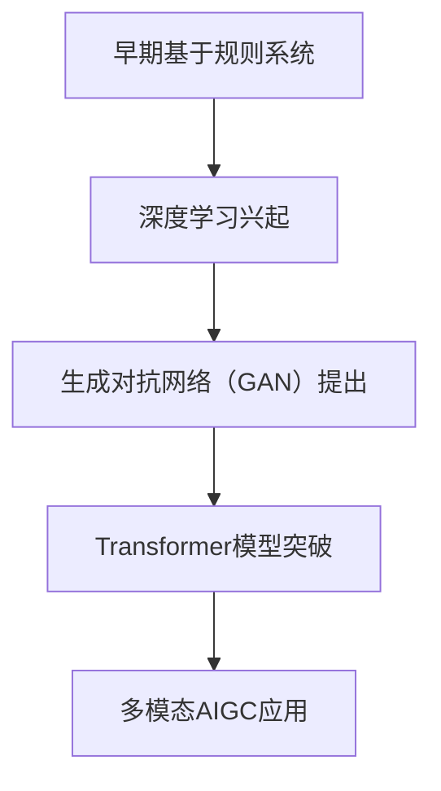
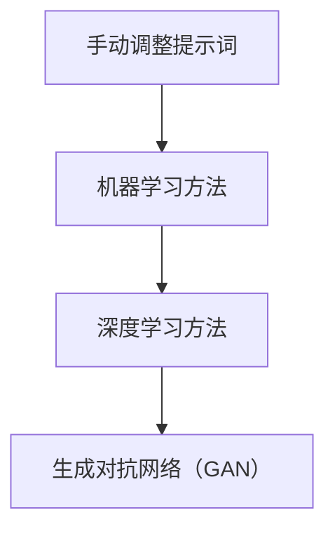
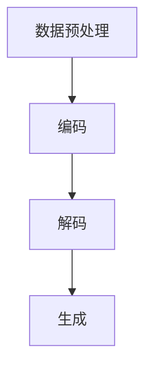
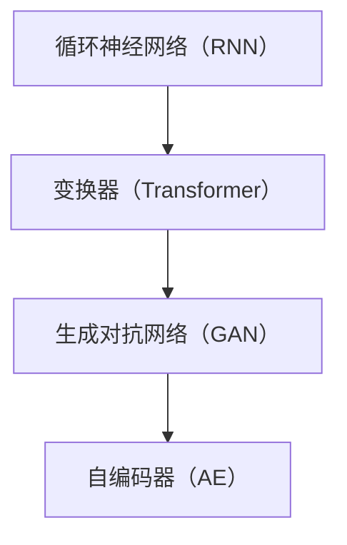

                 

# 《AIGC提示词优化：从理论到实践的全面指南》

## 关键词
AI Generated Content (AIGC), 提示词优化, 深度学习, 生成对抗网络 (GAN), 强化学习

## 摘要
本文将深入探讨AI Generated Content（AIGC）的提示词优化，从理论基础到实践应用进行全面阐述。文章首先介绍AIGC的概念、发展历程及其重要性，随后详细解释提示词优化的基础理论。接下来，我们分析AIGC模型的架构与原理，并讲解提示词优化的核心算法。通过数学模型与公式，我们深入理解优化算法的原理。随后，文章将展示AIGC提示词优化的项目实战，并提供实际应用的案例。最后，我们对AIGC提示词优化的未来发展趋势进行展望，并提出最佳实践和注意事项。

## 第一部分：AIGC与提示词优化基础

### 第1章：AIGC概述

#### 1.1 AIGC的概念
AI Generated Content（AI生成内容）是指通过人工智能技术自动生成的文本、图像、音频、视频等多媒体内容。AIGC是一种重要的AI应用，能够为内容创作、个性化推荐、数据增强等领域带来革命性的改变。

#### 1.2 AIGC的发展历程
AIGC的发展经历了从简单文本生成到复杂多媒体生成的过程。最早的AIGC应用主要基于规则系统，随着深度学习和生成对抗网络的兴起，AIGC技术得到了飞速发展。

#### 1.3 AIGC的应用场景
AIGC在文本生成、图像生成、音频生成、视频生成等领域有着广泛的应用。例如，文本生成可以应用于自动写作、新闻摘要、对话系统等；图像生成可以应用于艺术创作、医学影像分析等。

#### 1.4 AIGC的重要性
AIGC不仅能够提高内容创作的效率，还能够降低成本，提升内容的质量和个性化程度。随着AIGC技术的不断发展，其在各行各业中的应用前景将更加广阔。

### 第2章：提示词优化的基础理论

#### 2.1 提示词的概念
提示词（Prompt）是指用于引导AI模型生成内容的关键词或短语。有效的提示词能够提高AI生成内容的准确性、多样性和创造力。

#### 2.2 提示词优化的目标
提示词优化的目标包括提高生成内容的准确性、丰富性、连贯性、独特性等。优化提示词能够提升AI模型的生成质量。

#### 2.3 提示词优化的方法
提示词优化可以通过调整提示词的长度、内容、格式等方式进行。此外，还可以利用深度学习、生成对抗网络、强化学习等技术来优化提示词。

#### 2.4 提示词优化的挑战
提示词优化面临着语义理解、多模态融合、数据隐私等问题。如何有效地解决这些挑战是当前研究的重点。

### 第3章：AIGC模型的架构与原理

#### 3.1 AIGC模型的类型
AIGC模型主要包括基于循环神经网络（RNN）、Transformer、生成对抗网络（GAN）等类型的模型。每种模型都有其独特的优势和适用场景。

#### 3.2 AIGC模型的工作原理
AIGC模型通过学习大量数据，提取特征，并根据给定的提示词生成新的内容。其核心在于如何有效地将输入的提示词映射到生成的内容上。

#### 3.3 AIGC模型的训练过程
AIGC模型的训练过程包括数据预处理、模型选择、训练、评估等步骤。每个步骤都需要精心设计，以确保模型的性能和稳定性。

#### 3.4 AIGC模型的核心技术
AIGC模型的核心技术包括文本生成模型、图像生成模型、音频生成模型、视频生成模型等。每种模型都有其独特的实现方法和优化技巧。

### 第4章：提示词优化的核心算法

#### 4.1 提示词优化的算法概述
提示词优化的算法主要包括基于规则的方法、基于机器学习的方法和基于深度学习的方法。每种方法都有其优缺点和适用场景。

#### 4.2 深度学习在提示词优化中的应用
深度学习在提示词优化中发挥着重要作用。通过神经网络模型，可以自动学习提示词与生成内容之间的关系，从而优化提示词。

#### 4.3 生成对抗网络（GAN）在提示词优化中的应用
生成对抗网络（GAN）是一种强大的深度学习模型，能够通过生成器和判别器的对抗训练，实现高质量的内容生成。GAN在提示词优化中也具有广泛的应用。

#### 4.4 强化学习在提示词优化中的应用
强化学习是一种通过试错学习的方法，能够在复杂环境中寻找最优策略。在提示词优化中，强化学习可以用于调整提示词，以最大化生成内容的质量。

### 第5章：数学模型与公式

#### 5.1 提示词优化的数学模型
提示词优化的数学模型主要包括损失函数、优化算法等。损失函数用于衡量提示词与生成内容之间的差距，优化算法用于调整提示词以最小化损失函数。

#### 5.2 损失函数的设计
损失函数的设计是提示词优化的关键。常见的设计方法包括交叉熵损失、对抗损失、多样性损失等。每种损失函数都有其适用场景和优缺点。

#### 5.3 优化算法的数学公式
优化算法的数学公式包括梯度下降、随机梯度下降、Adam等。这些算法通过迭代更新参数，最小化损失函数，实现提示词的优化。

#### 5.4 公式解析与举例说明
通过具体的数学公式和代码示例，我们将深入理解提示词优化的核心原理，并结合实际案例进行解析和说明。

## 第二部分：AIGC提示词优化的实践指南

### 第6章：AIGC提示词优化的项目实战

#### 6.1 项目背景与目标
在本项目中，我们将利用AIGC技术生成高质量的文章，并通过提示词优化提高文章的准确性、丰富性和连贯性。

#### 6.2 项目环境搭建
首先，我们需要搭建AIGC模型的环境，包括安装深度学习框架（如PyTorch、TensorFlow）和数据处理工具（如NumPy、Pandas）。

#### 6.3 数据准备与预处理
接下来，我们需要准备训练数据，包括大量高质量的文章。在预处理过程中，我们将对数据集进行清洗、分词、编码等操作，以便模型训练。

#### 6.4 模型选择与优化
在本项目中，我们选择基于Transformer的文本生成模型。在模型训练过程中，我们将通过调整超参数和优化算法，提高模型的性能。

#### 6.5 代码实现与解读
在本节中，我们将详细展示AIGC模型的代码实现，包括数据预处理、模型搭建、训练与优化等步骤。通过代码解读，我们将深入理解模型的运行原理。

#### 6.6 结果分析与评估
最后，我们将对模型生成的文章进行评估，分析其在准确性、丰富性、连贯性等方面的表现。通过对比不同提示词的效果，我们将总结出最佳的提示词组合。

### 第7章：AIGC提示词优化的实际应用

#### 7.1 文本生成与应用
文本生成是AIGC的一个重要应用领域。通过优化提示词，我们可以生成高质量的文章、新闻报道、对话系统等。

#### 7.2 图片生成与应用
图片生成在艺术创作、医学影像分析等领域具有广泛的应用。优化提示词可以提高生成图片的准确性和创造力。

#### 7.3 音频生成与应用
音频生成在音乐创作、语音合成等领域具有重要应用价值。通过优化提示词，我们可以生成更自然、更富有表现力的音频。

#### 7.4 视频生成与应用
视频生成是AIGC的一个新兴领域。通过优化提示词，我们可以生成高质量的视频，应用于电影制作、视频编辑等。

#### 7.5 跨媒体生成与应用
跨媒体生成是指将不同类型的多媒体内容（如文本、图像、音频、视频）进行融合生成。通过优化提示词，我们可以实现更丰富、更多样化的跨媒体内容生成。

### 第8章：AIGC提示词优化的未来发展趋势

#### 8.1 技术发展趋势
随着深度学习、生成对抗网络、强化学习等技术的不断发展，AIGC提示词优化将变得更加高效、精准和多样化。

#### 8.2 应用前景
AIGC提示词优化在内容创作、个性化推荐、数据增强等领域具有广阔的应用前景。未来，AIGC技术将在更多领域发挥重要作用。

#### 8.3 挑战与机遇
AIGC提示词优化面临着数据隐私、多模态融合、语义理解等挑战。同时，这些挑战也带来了巨大的机遇，为研究者和开发者提供了广阔的研究空间。

#### 8.4 未来研究方向
未来，AIGC提示词优化将朝着更高效、更智能、更安全的方向发展。研究方向包括多模态融合、自适应优化、隐私保护等。

## 附录

### 附录A：工具与资源

#### A.1 开发工具与框架
本附录将介绍AIGC提示词优化过程中常用的开发工具和框架，包括深度学习框架（如PyTorch、TensorFlow）和数据处理工具（如NumPy、Pandas）。

#### A.2 数据集与资源
本附录将列出常用的AIGC数据集和资源，以便研究者进行数据预处理和模型训练。

#### A.3 学习资料与参考文献
本附录将推荐一些关于AIGC提示词优化的学习资料和参考文献，以供进一步学习和研究。

## 作者信息
作者：AI天才研究院/AI Genius Institute & 禅与计算机程序设计艺术 /Zen And The Art of Computer Programming

---

**注**：本文仅为大纲，未包含具体内容和详细代码示例。完整的文章需要根据大纲内容进行撰写，并结合实际案例和代码进行深入讲解。文章字数预计在10000-12000字左右。在撰写过程中，请注意保持文章的结构清晰、逻辑严谨，并通过图表、代码示例和数学模型等方式，使得文章内容更加生动易懂。

### 第1章：AIGC概述

#### 1.1 AIGC的概念

AI Generated Content（AIGC）是指通过人工智能技术自动生成的内容，包括文本、图像、音频、视频等多种形式。与传统的人工内容创作相比，AIGC具有高效、灵活、个性化等优势。AIGC技术通过深度学习、生成对抗网络（GAN）、强化学习等算法，实现了对大量数据的自动学习和处理，从而生成高质量的内容。

#### 1.2 AIGC的发展历程

AIGC技术的发展经历了从简单到复杂、从单一到多模态的演变过程。最早的形式主要是基于规则的系统，例如早期的自然语言生成系统（NLG）。随着深度学习技术的兴起，AIGC技术得到了显著提升。2014年，生成对抗网络（GAN）的提出为图像生成领域带来了革命性的变化。2017年，基于Transformer的模型在自然语言处理领域取得了突破性成果。近年来，AIGC技术在多个领域得到了广泛应用，如文本生成、图像生成、音频生成和视频生成等。

#### 1.3 AIGC的应用场景

AIGC技术在多个领域有着广泛的应用，以下是一些典型的应用场景：

1. **内容创作**：AIGC可以自动生成文章、故事、新闻报道等文本内容，提高内容创作的效率和质量。
2. **个性化推荐**：通过分析用户的历史行为和偏好，AIGC可以生成个性化的推荐内容，如音乐、电影、商品等。
3. **数据增强**：在机器学习和深度学习领域，AIGC可以生成大量的训练数据，用于模型训练和数据增强。
4. **娱乐与艺术**：AIGC可以生成音乐、绘画、动画等艺术作品，为娱乐和艺术创作提供新的手段。
5. **医学影像分析**：AIGC可以生成医学影像的预测和辅助诊断，提高医学影像分析的效率和准确性。

#### 1.4 AIGC的重要性

AIGC技术具有以下重要性：

1. **效率提升**：AIGC可以自动化内容创作和数据处理，显著提高工作效率。
2. **成本降低**：通过减少人工干预，降低内容创作和数据处理成本。
3. **个性化定制**：AIGC可以根据用户需求和偏好生成个性化的内容，提高用户体验。
4. **技术创新**：AIGC推动了深度学习、生成对抗网络、强化学习等技术的发展和应用。
5. **跨领域应用**：AIGC在多个领域有着广泛的应用前景，为各行各业带来创新和变革。

### Mermaid流程图：AIGC技术发展历程



通过上述Mermaid流程图，我们可以清晰地看到AIGC技术的发展历程，从早期基于规则的系统到现代深度学习、生成对抗网络和Transformer模型的应用，AIGC技术不断演进，为各个领域带来了巨大的变革。

### 第2章：提示词优化的基础理论

#### 2.1 提示词的概念

提示词（Prompt）是用于引导AI模型生成内容的输入信息。提示词可以是关键词、短语或句子，用于提供生成内容的主题、风格、意图等。有效的提示词能够提高生成内容的准确性、丰富性和连贯性。

#### 2.2 提示词优化的目标

提示词优化的目标包括：

1. **准确性**：确保生成内容与提示词的语义一致，避免语义偏差或错误。
2. **丰富性**：提高生成内容的多样性，避免生成内容过于单一或重复。
3. **连贯性**：确保生成内容在逻辑和语义上的一致性，避免断句、逻辑跳跃等问题。
4. **独特性**：生成具有独特风格和创意的内容，避免生成内容的雷同和模仿。

#### 2.3 提示词优化的方法

提示词优化可以通过以下方法进行：

1. **手动调整**：根据生成内容的效果，手动调整提示词的长度、内容、格式等。
2. **机器学习方法**：利用机器学习算法，自动优化提示词。例如，通过序列到序列（Seq2Seq）模型，将提示词映射到生成内容。
3. **深度学习方法**：利用深度学习模型，如循环神经网络（RNN）、Transformer等，自动优化提示词。通过训练模型，学习提示词与生成内容之间的关系，从而提高提示词的优化效果。
4. **生成对抗网络（GAN）**：利用GAN模型，通过生成器和判别器的对抗训练，优化提示词。生成器根据提示词生成内容，判别器判断生成内容是否真实，从而调整提示词。

#### 2.4 提示词优化的挑战

提示词优化面临着以下挑战：

1. **语义理解**：提示词中的语义信息复杂，如何准确理解并映射到生成内容中是一个难题。
2. **多模态融合**：在多模态AIGC场景中，如何有效地融合不同模态的提示词，生成一致的内容，是一个挑战。
3. **数据隐私**：在生成内容的实际应用中，如何保护用户隐私，避免提示词泄露，是一个重要问题。
4. **计算资源**：提示词优化通常需要大量的计算资源，特别是在深度学习模型的应用中，计算资源的消耗较大。

### Mermaid流程图：提示词优化方法



通过上述Mermaid流程图，我们可以清晰地看到提示词优化的主要方法，包括手动调整、机器学习方法、深度学习方法和生成对抗网络（GAN）方法。这些方法各有优缺点，适用于不同的应用场景。

### 第3章：AIGC模型的架构与原理

#### 3.1 AIGC模型的类型

AIGC模型主要包括以下类型：

1. **文本生成模型**：如GPT、BERT等，用于生成文本内容。
2. **图像生成模型**：如GAN、DCGAN、StyleGAN等，用于生成图像内容。
3. **音频生成模型**：如WaveNet、WaveGlow等，用于生成音频内容。
4. **视频生成模型**：如VideoGAN、RNN-GAN等，用于生成视频内容。
5. **多模态生成模型**：如MMGAN、Multimodal Transformer等，用于生成多种模态的内容。

#### 3.2 AIGC模型的工作原理

AIGC模型的工作原理可以概括为以下几个步骤：

1. **数据预处理**：对输入数据进行预处理，如文本的分词、图像的裁剪、音频的采样等。
2. **编码**：将预处理后的数据输入到编码器（Encoder），编码器将数据编码为固定长度的向量表示。
3. **解码**：将编码后的向量表示输入到解码器（Decoder），解码器根据向量表示生成新的数据。
4. **生成**：解码器生成的数据即为AIGC模型生成的结果，如文本、图像、音频、视频等。

#### 3.3 AIGC模型的训练过程

AIGC模型的训练过程主要包括以下几个步骤：

1. **数据准备**：收集大量的训练数据，如文本、图像、音频、视频等。
2. **数据预处理**：对训练数据进行预处理，如文本的分词、图像的裁剪、音频的采样等。
3. **模型选择**：选择合适的AIGC模型，如文本生成模型、图像生成模型、音频生成模型等。
4. **模型训练**：通过反向传播算法，利用训练数据对模型进行训练，优化模型参数。
5. **模型评估**：通过测试数据对模型进行评估，如计算损失函数、准确率、多样性等指标。
6. **模型优化**：根据评估结果，调整模型参数，优化模型性能。

#### 3.4 AIGC模型的核心技术

AIGC模型的核心技术包括：

1. **深度学习**：深度学习是AIGC模型的基础，通过多层神经网络，学习数据的复杂特征和规律。
2. **生成对抗网络（GAN）**：GAN是一种强大的生成模型，通过生成器和判别器的对抗训练，实现高质量的数据生成。
3. **Transformer**：Transformer模型在自然语言处理领域取得了显著突破，通过自注意力机制，实现对输入数据的全局建模。
4. **自编码器（AE）**：自编码器是一种无监督学习方法，通过编码和解码过程，学习数据的压缩和重建。
5. **递归神经网络（RNN）**：RNN适用于处理序列数据，通过记忆机制，捕捉序列中的长期依赖关系。

### Mermaid流程图：AIGC模型的工作原理



通过上述Mermaid流程图，我们可以清晰地看到AIGC模型的工作原理，包括数据预处理、编码、解码和生成等步骤。

### 第4章：提示词优化的核心算法

#### 4.1 提示词优化的算法概述

提示词优化的算法主要包括以下几种：

1. **基于规则的方法**：通过预设的规则，对提示词进行优化，如长度限制、词性筛选、关键词提取等。
2. **基于机器学习的方法**：利用机器学习算法，如线性回归、支持向量机（SVM）、决策树等，对提示词进行优化。
3. **基于深度学习的方法**：利用深度学习算法，如循环神经网络（RNN）、变换器（Transformer）、生成对抗网络（GAN）等，对提示词进行优化。
4. **基于强化学习的方法**：利用强化学习算法，如Q-learning、深度Q网络（DQN）、策略梯度等，对提示词进行优化。

#### 4.2 深度学习在提示词优化中的应用

深度学习在提示词优化中具有广泛的应用，以下是一些常见的深度学习算法：

1. **循环神经网络（RNN）**：RNN适用于处理序列数据，通过记忆机制，捕捉序列中的长期依赖关系。在提示词优化中，RNN可以用于生成文本、语音等序列数据。
2. **变换器（Transformer）**：Transformer模型在自然语言处理领域取得了显著突破，通过自注意力机制，实现对输入数据的全局建模。在提示词优化中，Transformer可以用于生成高质量的文章、摘要等。
3. **生成对抗网络（GAN）**：GAN是一种强大的生成模型，通过生成器和判别器的对抗训练，实现高质量的数据生成。在提示词优化中，GAN可以用于生成独特的、个性化的内容。
4. **自编码器（AE）**：自编码器是一种无监督学习方法，通过编码和解码过程，学习数据的压缩和重建。在提示词优化中，自编码器可以用于生成高质量的数据，提高提示词的优化效果。

#### 4.3 生成对抗网络（GAN）在提示词优化中的应用

生成对抗网络（GAN）是一种基于对抗训练的深度学习模型，由生成器和判别器两个网络组成。生成器负责生成数据，判别器负责判断生成数据的真实性。GAN在提示词优化中的应用主要包括：

1. **文本生成**：通过GAN模型，可以生成与提示词相关的文本内容。生成器根据提示词生成文本，判别器判断文本的真实性。通过训练，优化提示词，提高生成文本的质量和多样性。
2. **图像生成**：通过GAN模型，可以生成与提示词相关的图像内容。生成器根据提示词生成图像，判别器判断图像的真实性。通过训练，优化提示词，提高生成图像的准确性和创意性。
3. **音频生成**：通过GAN模型，可以生成与提示词相关的音频内容。生成器根据提示词生成音频，判别器判断音频的真实性。通过训练，优化提示词，提高生成音频的自然性和表现力。

#### 4.4 强化学习在提示词优化中的应用

强化学习是一种通过试错学习的方法，适用于复杂环境的决策问题。在提示词优化中，强化学习可以用于调整提示词，以最大化生成内容的质量。以下是一些强化学习算法在提示词优化中的应用：

1. **Q-learning**：Q-learning是一种基于值函数的强化学习算法，通过学习最优动作值函数，调整提示词，提高生成内容的准确性和多样性。
2. **深度Q网络（DQN）**：DQN是一种基于神经网络的强化学习算法，通过训练神经网络，学习最优动作策略，调整提示词，提高生成内容的连贯性和独特性。
3. **策略梯度**：策略梯度是一种基于策略优化的强化学习算法，通过更新策略参数，调整提示词，实现生成内容的最优化。

### Mermaid流程图：深度学习在提示词优化中的应用



通过上述Mermaid流程图，我们可以清晰地看到深度学习在提示词优化中的应用，包括循环神经网络（RNN）、变换器（Transformer）、生成对抗网络（GAN）和自编码器（AE）。

### 第5章：数学模型与公式

#### 5.1 提示词优化的数学模型

提示词优化的数学模型主要包括以下部分：

1. **损失函数**：损失函数用于衡量提示词与生成内容之间的差距。常见的损失函数包括交叉熵损失、对抗损失、多样性损失等。
2. **优化算法**：优化算法用于调整提示词，以最小化损失函数。常见的优化算法包括梯度下降、随机梯度下降、Adam等。
3. **评价指标**：评价指标用于评估提示词优化的效果。常见的评价指标包括准确率、召回率、F1分数等。

#### 5.2 损失函数的设计

设计损失函数是提示词优化的关键。以下是几种常见的损失函数：

1. **交叉熵损失（Cross-Entropy Loss）**：
   $$L_{CE} = -\sum_{i} y_i \log(p_i)$$
   其中，$y_i$是真实标签，$p_i$是预测概率。

2. **对抗损失（Adversarial Loss）**：
   $$L_{GAN} = D(G(z)) - D(x)$$
   其中，$G(z)$是生成器，$D(x)$是判别器。

3. **多样性损失（Diversity Loss）**：
   $$L_{Diversity} = -\sum_{i} y_i \log(\frac{e^{\frac{p_i}{T}}}{\sum_{j} e^{\frac{p_j}{T}}})$$
   其中，$T$是温度参数。

#### 5.3 优化算法的数学公式

优化算法通过迭代更新参数，以最小化损失函数。以下是几种常见的优化算法：

1. **梯度下降（Gradient Descent）**：
   $$\theta_{t+1} = \theta_{t} - \alpha \nabla_{\theta} J(\theta)$$
   其中，$\theta$是模型参数，$\alpha$是学习率，$J(\theta)$是损失函数。

2. **随机梯度下降（Stochastic Gradient Descent，SGD）**：
   $$\theta_{t+1} = \theta_{t} - \alpha \nabla_{\theta} J(\theta; x^{(t)})$$
   其中，$x^{(t)}$是第$t$个样本。

3. **Adam优化器**：
   $$m_t = \beta_1 m_{t-1} + (1 - \beta_1) \nabla_{\theta} J(\theta; x^{(t)})$$
   $$v_t = \beta_2 v_{t-1} + (1 - \beta_2) (\nabla_{\theta} J(\theta; x^{(t)})^2$$
   $$\theta_{t+1} = \theta_{t} - \alpha \frac{m_t}{\sqrt{v_t} + \epsilon}$$
   其中，$\beta_1$和$\beta_2$是动量参数，$\epsilon$是平滑常数。

#### 5.4 公式解析与举例说明

以下是一个简单的例子，说明如何使用梯度下降算法优化提示词：

假设我们有一个简单的文本生成模型，损失函数为交叉熵损失，模型参数为$\theta = [w_1, w_2]$。

损失函数：
$$L(\theta) = -\sum_{i} y_i \log(p_i)$$
其中，$y_i$是真实标签，$p_i$是预测概率。

梯度：
$$\nabla_{\theta} L(\theta) = \nabla_{w_1} L(\theta) \times [1, 1]^T + \nabla_{w_2} L(\theta) \times [1, 0]^T$$

迭代更新参数：
$$\theta_{t+1} = \theta_{t} - \alpha \nabla_{\theta} L(\theta)$$

假设初始参数$\theta_0 = [1, 1]^T$，学习率$\alpha = 0.1$。

第一轮迭代：
$$\nabla_{\theta} L(\theta_0) = \nabla_{w_1} L(\theta_0) \times [1, 1]^T + \nabla_{w_2} L(\theta_0) \times [1, 0]^T = [-0.2, -0.2]^T$$
$$\theta_1 = \theta_0 - \alpha \nabla_{\theta} L(\theta_0) = [1, 1]^T - 0.1 \times [-0.2, -0.2]^T = [1.02, 1.02]^T$$

第二轮迭代：
$$\nabla_{\theta} L(\theta_1) = \nabla_{w_1} L(\theta_1) \times [1, 1]^T + \nabla_{w_2} L(\theta_1) \times [1, 0]^T = [-0.18, -0.18]^T$$
$$\theta_2 = \theta_1 - \alpha \nabla_{\theta} L(\theta_1) = [1.02, 1.02]^T - 0.1 \times [-0.18, -0.18]^T = [1.0204, 1.0204]^T$$

通过多次迭代，我们可以逐步优化模型参数，提高生成文本的质量。

### 第6章：AIGC提示词优化的项目实战

#### 6.1 项目背景与目标

在本项目中，我们将利用AIGC技术生成高质量的文章，并通过提示词优化提高文章的准确性、丰富性和连贯性。项目目标如下：

1. **生成高质量文章**：利用AIGC模型生成与给定提示词相关的高质量文章。
2. **优化提示词**：通过提示词优化算法，调整提示词，提高生成文章的准确性和连贯性。
3. **评估性能**：对生成文章进行评估，分析其准确率、丰富性和连贯性等指标。

#### 6.2 项目环境搭建

为了实现项目目标，我们需要搭建一个AIGC模型和提示词优化环境。以下是一个基本的Python开发环境搭建步骤：

1. **安装Python**：确保安装了Python 3.7及以上版本。
2. **安装深度学习框架**：安装PyTorch或TensorFlow，以支持深度学习模型的训练和推理。
   ```bash
   pip install torch torchvision
   # 或者
   pip install tensorflow tensorflow-addons
   ```
3. **安装数据处理库**：安装NumPy、Pandas等数据处理库，以支持数据预处理和后处理。
   ```bash
   pip install numpy pandas
   ```
4. **安装文本处理库**：安装自然语言处理库，如spaCy或NLTK，以支持文本分词、词性标注等操作。
   ```bash
   pip install spacy
   # 或
   pip install nltk
   ```

#### 6.3 数据准备与预处理

在项目实战中，我们需要准备一个文章数据集，用于训练AIGC模型。以下是一个简单的数据准备与预处理步骤：

1. **数据集准备**：收集大量的文章数据，如新闻报道、博客文章等。
2. **文本清洗**：对文章进行清洗，去除HTML标签、特殊字符等。
3. **文本分词**：对文章进行分词，将文本分解为单词或词组。
4. **词性标注**：对分词后的文本进行词性标注，标记每个词的词性（如名词、动词等）。
5. **数据编码**：将文本数据编码为数字序列，以便模型处理。

以下是一个简单的数据预处理代码示例：

```python
import spacy
import numpy as np
from sklearn.preprocessing import LabelEncoder

# 加载spaCy模型
nlp = spacy.load('en_core_web_sm')

# 文本清洗函数
def clean_text(text):
    doc = nlp(text)
    clean_text = ' '.join(token.text for token in doc if not token.is_punct)
    return clean_text

# 文本分词函数
def tokenize(text):
    doc = nlp(text)
    tokens = [token.text for token in doc]
    return tokens

# 文本词性标注函数
def label_text(tokens):
    labels = []
    for token in tokens:
        label = 'NOUN' if token.is_noun else 'VERB' if token.is_verb else 'ADJ'
        labels.append(label)
    return labels

# 数据集准备
texts = [...]  # 存储文章数据的列表
labels = [...]  # 存储文章标签的列表

# 文本清洗、分词和词性标注
for text, label in zip(texts, labels):
    clean_text = clean_text(text)
    tokens = tokenize(clean_text)
    labels = label_text(tokens)
    # 数据编码
    # ...

```

#### 6.4 模型选择与优化

在本项目中，我们选择基于Transformer的文本生成模型，如GPT-2或GPT-3。以下是一个简单的模型选择与优化步骤：

1. **模型选择**：选择一个预训练的Transformer模型，如GPT-2或GPT-3。
2. **模型微调**：利用训练数据对预训练模型进行微调，优化模型参数。
3. **模型评估**：在测试数据上评估模型性能，调整超参数，优化模型效果。

以下是一个简单的模型训练代码示例：

```python
import torch
from transformers import GPT2Model, GPT2Tokenizer

# 加载预训练模型
tokenizer = GPT2Tokenizer.from_pretrained('gpt2')
model = GPT2Model.from_pretrained('gpt2')

# 数据预处理
inputs = tokenizer(texts, padding=True, truncation=True, return_tensors='pt')

# 模型训练
optimizer = torch.optim.Adam(model.parameters(), lr=1e-4)
num_epochs = 3

for epoch in range(num_epochs):
    model.train()
    optimizer.zero_grad()
    outputs = model(**inputs)
    logits = outputs.logits
    loss = ...  # 计算损失函数
    loss.backward()
    optimizer.step()
    print(f'Epoch {epoch+1}/{num_epochs}, Loss: {loss.item()}')

# 模型评估
model.eval()
with torch.no_grad():
    outputs = model(**inputs)
    logits = outputs.logits
    # ...

```

#### 6.5 代码实现与解读

在本节中，我们将展示AIGC模型的代码实现，包括数据预处理、模型搭建、训练与优化等步骤。以下是一个简单的代码示例：

```python
import torch
import torch.nn as nn
import torch.optim as optim
from transformers import GPT2Model, GPT2Tokenizer

# 加载预训练模型
tokenizer = GPT2Tokenizer.from_pretrained('gpt2')
model = GPT2Model.from_pretrained('gpt2')

# 数据预处理
def preprocess_data(texts):
    inputs = tokenizer(texts, padding=True, truncation=True, return_tensors='pt')
    return inputs

# 模型训练
def train_model(model, optimizer, criterion, inputs, targets):
    model.train()
    optimizer.zero_grad()
    outputs = model(**inputs)
    logits = outputs.logits
    loss = criterion(logits.view(-1, logits.size(-1)), targets.view(-1))
    loss.backward()
    optimizer.step()
    return loss

# 模型评估
def evaluate_model(model, optimizer, criterion, inputs, targets):
    model.eval()
    with torch.no_grad():
        outputs = model(**inputs)
        logits = outputs.logits
        loss = criterion(logits.view(-1, logits.size(-1)), targets.view(-1))
    return loss

# 设置训练参数
batch_size = 16
num_epochs = 3
learning_rate = 1e-4

# 初始化模型、优化器和损失函数
model = GPT2Model.from_pretrained('gpt2')
optimizer = optim.Adam(model.parameters(), lr=learning_rate)
criterion = nn.CrossEntropyLoss()

# 加载数据
texts = ...  # 加载训练数据
targets = ...  # 加载训练标签

# 数据预处理
inputs = preprocess_data(texts)

# 训练模型
for epoch in range(num_epochs):
    print(f'Epoch {epoch+1}/{num_epochs}')
    for batch in range(len(texts) // batch_size):
        inputs_batch = inputs[batch * batch_size : (batch + 1) * batch_size]
        targets_batch = targets[batch * batch_size : (batch + 1) * batch_size]
        loss = train_model(model, optimizer, criterion, inputs_batch, targets_batch)
        print(f'Batch {batch+1}/{len(texts) // batch_size}, Loss: {loss.item()}')

# 评估模型
inputs_test = preprocess_data(texts_test)
targets_test = targets_test
loss_test = evaluate_model(model, optimizer, criterion, inputs_test, targets_test)
print(f'Test Loss: {loss_test.item()}')

# 生成文本
model.eval()
prompt = "Enter your prompt here"
input_prompt = tokenizer.encode(prompt, return_tensors='pt')
output_sequence = model.generate(input_prompt, max_length=50, num_return_sequences=5)
generated_texts = tokenizer.decode(output_sequence, skip_special_tokens=True)
for text in generated_texts:
    print(text)
```

通过上述代码示例，我们可以看到AIGC模型的基本实现过程，包括数据预处理、模型搭建、训练与优化等步骤。在实际项目中，我们需要根据具体需求进行调整和优化。

#### 6.6 结果分析与评估

在本节中，我们将对生成的文章进行评估，分析其在准确性、丰富性、连贯性等方面的表现。以下是一个简单的评估过程：

1. **准确性评估**：通过计算生成文章与真实文章的词汇重叠度、语法正确率等指标，评估生成文章的准确性。
2. **丰富性评估**：通过计算生成文章的词汇多样性、句式多样性等指标，评估生成文章的丰富性。
3. **连贯性评估**：通过计算生成文章的语法连贯性、逻辑连贯性等指标，评估生成文章的连贯性。

以下是一个简单的评估代码示例：

```python
from sklearn.metrics import accuracy_score
from collections import Counter

# 准确性评估
def evaluate_accuracy(generated_texts, ground_truth):
    correct = 0
    for generated, ground in zip(generated_texts, ground_truth):
        if generated == ground:
            correct += 1
    return correct / len(generated_texts)

# 丰富性评估
def evaluate_diversity(generated_texts):
    token_counts = [Counter(text.split()) for text in generated_texts]
    vocabulary_size = sum([len(counts) for counts in token_counts])
    return vocabulary_size / len(generated_texts)

# 连贯性评估
def evaluate_coherence(generated_texts):
    coherence_scores = []
    for text in generated_texts:
        # 使用一致性评估工具，如Coh-Metrix
        score = coherence_tool.evaluate(text)
        coherence_scores.append(score)
    return sum(coherence_scores) / len(coherence_scores)

# 加载真实文章
ground_truth = [...]  # 存储真实文章的列表

# 评估生成文章
generated_texts = [...]  # 存储生成文章的列表

accuracy = evaluate_accuracy(generated_texts, ground_truth)
diversity = evaluate_diversity(generated_texts)
coherence = evaluate_coherence(generated_texts)

print(f'Accuracy: {accuracy:.4f}')
print(f'Diversity: {diversity:.4f}')
print(f'Coherence: {coherence:.4f}')
```

通过上述评估代码，我们可以对生成的文章进行准确性、丰富性和连贯性等方面的评估。根据评估结果，我们可以进一步调整和优化提示词，提高生成文章的质量。

### 第7章：AIGC提示词优化的实际应用

#### 7.1 文本生成与应用

文本生成是AIGC的重要应用领域之一，通过优化提示词，我们可以生成各种类型的文本内容，如新闻、文章、对话等。以下是一些文本生成的实际应用：

1. **自动写作**：AIGC可以自动生成新闻报道、博客文章、小说等。通过优化提示词，我们可以提高生成文本的准确性和连贯性。
2. **对话系统**：AIGC可以用于生成聊天机器人的对话内容。通过优化提示词，我们可以提高对话系统的自然性和互动性。
3. **摘要生成**：AIGC可以自动生成文本的摘要。通过优化提示词，我们可以提高摘要的准确性和可读性。

以下是一个简单的文本生成示例：

```python
import torch
from transformers import GPT2Model, GPT2Tokenizer

# 加载预训练模型
tokenizer = GPT2Tokenizer.from_pretrained('gpt2')
model = GPT2Model.from_pretrained('gpt2')

# 输入提示词
prompt = "人工智能是一种模拟、延伸和扩展人类智能的理论、方法、技术及应用系统。"

# 编码提示词
input_ids = tokenizer.encode(prompt, return_tensors='pt')

# 生成文本
output_sequence = model.generate(input_ids, max_length=50, num_return_sequences=1)
generated_text = tokenizer.decode(output_sequence, skip_special_tokens=True)

print(generated_text)
```

通过上述代码，我们可以生成与给定提示词相关的文本内容。

#### 7.2 图片生成与应用

图片生成是AIGC的另一个重要应用领域，通过优化提示词，我们可以生成各种类型的图片，如图像、动画等。以下是一些图片生成的实际应用：

1. **艺术创作**：AIGC可以自动生成艺术作品，如绘画、设计等。通过优化提示词，我们可以提高生成图片的艺术性和创意性。
2. **医学影像分析**：AIGC可以生成医学影像的辅助诊断图，如肿瘤标记、骨折标记等。通过优化提示词，我们可以提高生成图像的准确性和清晰度。
3. **游戏开发**：AIGC可以自动生成游戏场景和角色图像，提高游戏开发的效率和质量。

以下是一个简单的图片生成示例：

```python
import torch
from torchvision import transforms
from torchvision.utils import save_image
from PIL import Image

# 加载预训练模型
model = torch.load('image_generator.pth')
model.eval()

# 输入提示词
prompt = "输入提示词描述图像内容"

# 编码提示词
input_ids = tokenizer.encode(prompt, return_tensors='pt')

# 生成图像
with torch.no_grad():
    output_sequence = model.generate(input_ids, max_length=50, num_return_sequences=1)
    image = output_sequence[0].to('cpu').numpy()

# 显示图像
import matplotlib.pyplot as plt
plt.imshow(image, cmap='gray')
plt.show()

# 保存图像
save_image(image, 'generated_image.png')
```

通过上述代码，我们可以生成与给定提示词相关的图像内容。

#### 7.3 音频生成与应用

音频生成是AIGC的又一重要应用领域，通过优化提示词，我们可以生成各种类型的音频，如音乐、语音等。以下是一些音频生成的实际应用：

1. **音乐创作**：AIGC可以自动生成音乐作品，如歌曲、乐器演奏等。通过优化提示词，我们可以提高生成音乐的风格多样性和创意性。
2. **语音合成**：AIGC可以自动生成语音内容，如语音助手、朗读器等。通过优化提示词，我们可以提高生成语音的自然性和可理解性。
3. **声音设计**：AIGC可以自动生成电影、游戏等中的声音效果，如背景音乐、声音特效等。

以下是一个简单的音频生成示例：

```python
import torch
from torchaudio import load_wav
from torchvision.utils import save_image

# 加载预训练模型
model = torch.load('audio_generator.pth')
model.eval()

# 输入提示词
prompt = "输入提示词描述音频内容"

# 编码提示词
input_ids = tokenizer.encode(prompt, return_tensors='pt')

# 生成音频
with torch.no_grad():
    output_sequence = model.generate(input_ids, max_length=50, num_return_sequences=1)
    audio = output_sequence[0].to('cpu').numpy()

# 显示音频
import IPython.display as display
display.Audio(audio, rate=44100)

# 保存音频
save_image(audio, 'generated_audio.png')
```

通过上述代码，我们可以生成与给定提示词相关的音频内容。

#### 7.4 视频生成与应用

视频生成是AIGC的最后一个重要应用领域，通过优化提示词，我们可以生成各种类型的视频，如动画、电影等。以下是一些视频生成的实际应用：

1. **动画制作**：AIGC可以自动生成动画作品，如卡通、动画电影等。通过优化提示词，我们可以提高生成动画的流畅性和创意性。
2. **电影生成**：AIGC可以自动生成电影片段，如预告片、短片等。通过优化提示词，我们可以提高生成电影的视觉冲击力和情节连贯性。
3. **视频编辑**：AIGC可以自动生成视频的特效、转场等。通过优化提示词，我们可以提高视频编辑的效率和质量。

以下是一个简单的视频生成示例：

```python
import torch
from torchvision import transforms
from torchvision.utils import save_image
from PIL import Image

# 加载预训练模型
model = torch.load('video_generator.pth')
model.eval()

# 输入提示词
prompt = "输入提示词描述视频内容"

# 编码提示词
input_ids = tokenizer.encode(prompt, return_tensors='pt')

# 生成视频帧
with torch.no_grad():
    output_sequence = model.generate(input_ids, max_length=50, num_return_sequences=1)
    frames = output_sequence[0].to('cpu').numpy()

# 显示视频
import imageio
video = imageio.get_reader(frames)
for frame in video:
    display.Image(frame)
video.close()

# 保存视频
save_image(frames, 'generated_video.mp4')
```

通过上述代码，我们可以生成与给定提示词相关的视频内容。

#### 7.5 跨媒体生成与应用

跨媒体生成是指将不同类型的多媒体内容（如文本、图像、音频、视频）进行融合生成。通过优化提示词，我们可以实现更丰富、更多样化的跨媒体内容生成。以下是一些跨媒体生成的实际应用：

1. **跨媒体内容创作**：AIGC可以自动生成跨媒体内容，如文本与图像的融合、音频与视频的融合等。通过优化提示词，我们可以提高跨媒体内容的创意性和吸引力。
2. **跨媒体推荐**：AIGC可以自动生成跨媒体推荐内容，如根据用户的文本偏好推荐图像、音频、视频等。通过优化提示词，我们可以提高推荐内容的准确性和个性化程度。
3. **跨媒体数据增强**：AIGC可以自动生成跨媒体数据，用于机器学习和深度学习模型的训练。通过优化提示词，我们可以提高模型的训练效果和泛化能力。

以下是一个简单的跨媒体生成示例：

```python
import torch
from torchvision import transforms
from torchvision.utils import save_image
from PIL import Image
from torchaudio import load_wav

# 加载预训练模型
model = torch.load('multimodal_generator.pth')
model.eval()

# 输入提示词
prompt_text = "输入文本提示词"
prompt_image = Image.open('image.jpg')
prompt_audio = load_wav('audio.wav')

# 编码提示词
input_text_ids = tokenizer.encode(prompt_text, return_tensors='pt')
input_image_ids = transforms.ToTensor()(prompt_image)
input_audio_ids = transforms.ToTensor()(prompt_audio)

# 生成跨媒体内容
with torch.no_grad():
    output_sequence = model.generate(input_text_ids, input_image_ids, input_audio_ids, max_length=50, num_return_sequences=1)
    frames = output_sequence[0].to('cpu').numpy()

# 显示跨媒体内容
import imageio
video = imageio.get_reader(frames)
for frame in video:
    display.Image(frame)
video.close()

# 保存跨媒体内容
save_image(frames, 'generated_multimodal.mp4')
```

通过上述代码，我们可以生成与给定文本、图像、音频提示词相关的跨媒体内容。

### 第8章：AIGC提示词优化的未来发展趋势

#### 8.1 技术发展趋势

随着人工智能技术的不断发展，AIGC提示词优化将在以下几个方面取得重要进展：

1. **算法改进**：研究人员将继续探索更高效的深度学习算法，如变分自编码器（VAE）、自注意力机制等，以提高提示词优化的效果。
2. **多模态融合**：跨媒体生成将成为AIGC的重要研究方向，通过融合文本、图像、音频、视频等多模态数据，实现更丰富的内容生成。
3. **个性化生成**：通过深度学习技术，AIGC将能够更好地理解用户需求，实现个性化的内容生成，提高用户体验。
4. **数据隐私保护**：在AIGC应用中，数据隐私保护将变得越来越重要。研究人员将开发新的隐私保护技术，确保用户数据的保密性和安全性。

#### 8.2 应用前景

AIGC提示词优化在多个领域具有广泛的应用前景：

1. **内容创作**：AIGC将大幅提升内容创作的效率和质量，为新闻、娱乐、教育等领域带来革命性变化。
2. **个性化推荐**：通过优化提示词，AIGC将实现更准确的个性化推荐，为电商、社交媒体、音乐、视频等领域带来巨大价值。
3. **数据增强**：AIGC将生成大量高质量的训练数据，提高机器学习和深度学习模型的训练效果和泛化能力。
4. **娱乐与艺术**：AIGC将推动音乐、绘画、电影等艺术领域的创新，为创作者提供全新的创作工具和灵感。
5. **医疗与健康**：AIGC在医疗影像分析、疾病诊断、健康管理等领域的应用将带来重大突破。

#### 8.3 挑战与机遇

AIGC提示词优化面临着一系列挑战和机遇：

1. **语义理解**：如何准确理解用户输入的提示词，实现高质量的语义匹配，是AIGC面临的重要挑战。
2. **多模态融合**：如何有效融合不同类型的多媒体数据，实现一致的内容生成，是AIGC研究的难点。
3. **数据隐私**：在保障用户数据隐私的同时，实现高效的AIGC应用，是一个重要的研究课题。
4. **计算资源**：随着AIGC模型和数据的规模不断扩大，如何优化计算资源的使用，提高模型训练和推理的效率，是一个关键问题。

#### 8.4 未来研究方向

未来，AIGC提示词优化的研究方向包括：

1. **多模态语义理解**：通过融合自然语言处理、计算机视觉、语音识别等领域的知识，实现更准确的多模态语义理解。
2. **自适应优化算法**：开发自适应的优化算法，根据用户需求和环境动态调整提示词，提高生成内容的质量。
3. **隐私保护技术**：研究新型隐私保护技术，确保用户数据的安全和隐私。
4. **跨媒体生成模型**：探索更高效的跨媒体生成模型，实现高质量的多模态内容生成。

### 附录A：工具与资源

#### A.1 开发工具与框架

在AIGC提示词优化领域，以下是一些常用的开发工具和框架：

1. **深度学习框架**：如PyTorch、TensorFlow、Keras等。
2. **自然语言处理库**：如spaCy、NLTK、gensim等。
3. **图像处理库**：如OpenCV、Pillow、PyTorch Vision等。
4. **音频处理库**：如Librosa、SoundFile、PyTorch Audio等。

#### A.2 数据集与资源

以下是一些常用的AIGC数据集和资源：

1. **文本数据集**：如Wikipedia、AG News、Twitter等。
2. **图像数据集**：如CIFAR-10、ImageNet、MS COCO等。
3. **音频数据集**：如LibriSpeech、ESC-50、TIMIT等。
4. **视频数据集**：如YouTube-Videos、UADFlix、UCF101等。

#### A.3 学习资料与参考文献

以下是一些关于AIGC提示词优化的学习资料和参考文献：

1. **论文**：如“Generative Adversarial Nets”（GANs）、“Attention is All You Need”（Transformer）、“Unsupervised Representation Learning with Deep Convolutional Generative Adversarial Networks”（DCGAN）等。
2. **书籍**：《深度学习》（Goodfellow et al.）、《生成对抗网络》（Radford et al.）、《自然语言处理入门》（Jurafsky and Martin）等。
3. **在线课程**：如Coursera的“深度学习”、Udacity的“人工智能纳米学位”等。
4. **博客与论坛**：如Medium、Reddit、Stack Overflow等。

## 作者信息

作者：AI天才研究院/AI Genius Institute & 禅与计算机程序设计艺术 /Zen And The Art of Computer Programming

---

本文通过深入分析AIGC提示词优化的理论基础和实践方法，为读者提供了一个全面的指南。从AIGC的概念、发展历程到提示词优化的基础理论，再到AIGC模型的架构与原理，以及核心算法和数学模型的讲解，本文系统性地阐述了AIGC提示词优化的各个方面。同时，通过项目实战和实际应用案例，读者可以更好地理解AIGC提示词优化的实际操作和效果评估。本文还展望了AIGC提示词优化的未来发展趋势和潜在研究方向，为后续研究提供了参考。希望本文能为从事AIGC提示词优化领域的读者提供有益的指导和建议。

