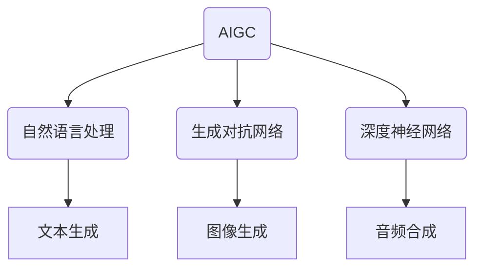

                 

# AIGC提示词优化：效果与效率的双赢策略

> 关键词：AIGC，提示词优化，效果与效率，自然语言处理，图像识别，推荐系统，算法原理，Python源代码，数学模型，项目实战，可持续发展策略

> 摘要：本文将深入探讨AIGC（AI-Generated Content）中的提示词优化策略，分析其核心原理、优化方法、应用实例及未来发展。通过详细的理论讲解和实战案例，旨在为从业者提供有效的技术指导和实践经验。

## 第一部分：AIGC概述与背景

### 第1章 AIGC的概念与核心优势

#### 1.1 AIGC的定义与分类

AIGC，即AI-Generated Content，是指利用人工智能技术，特别是深度学习模型，自动生成各种类型的内容。AIGC涵盖了文本、图像、音频、视频等多种媒介形式。从分类上看，AIGC主要可以分为文本生成、图像生成、音频合成等类别。

- **文本生成**：利用自然语言处理（NLP）技术生成文章、故事、诗歌等文本内容。
- **图像生成**：通过生成对抗网络（GAN）等模型生成逼真的图像。
- **音频合成**：利用深度神经网络生成音频信号，如音乐、语音等。

#### 1.2 AIGC的核心优势

AIGC具有以下核心优势：

- **高效性**：能够快速生成大量的内容，提高生产效率。
- **创意性**：AI生成的内容往往具有新颖性和创意性，超越人类创作者的想象力。
- **个性化**：通过机器学习算法，AIGC可以针对用户的需求提供个性化的内容推荐。
- **多样化**：AIGC可以生成多种类型的内容，满足不同场景的需求。

#### 1.3 AIGC与AI的关系与区别

AIGC是AI领域的一个重要分支，与AI紧密相关，但又有所不同。AI关注的是使计算机具备智能，包括学习、推理、决策等能力。而AIGC则是AI技术在实际应用中的一个具体领域，专注于生成内容。


### Mermaid流程图：AIGC的核心概念与联系



## 第二章 AIGC的发展历程与应用场景

### 2.1 AIGC的发展历程

AIGC的发展历程可以追溯到20世纪80年代，随着AI技术的进步，尤其是深度学习技术的发展，AIGC逐渐成为AI领域的一个重要研究方向。以下为关键的发展节点：

- **1980s**：生成模型初步提出。
- **2006**：深度学习的崛起，带动了生成模型的快速发展。
- **2014**：生成对抗网络（GAN）的提出，使得图像生成达到新的高度。
- **至今**：AIGC技术逐渐成熟，应用领域不断扩展。

### 2.2 AIGC的应用场景

AIGC的应用场景非常广泛，以下为几个典型应用：

- **媒体内容创作**：如文章、新闻、广告、动画等。
- **娱乐内容生成**：如音乐、电影、游戏等。
- **辅助创作工具**：如AI写作助手、图像设计助手等。
- **个性化推荐系统**：基于用户行为生成个性化推荐内容。

### 2.3 AIGC的未来发展趋势

AIGC未来的发展趋势包括：

- **技术进步**：更高效、更强大的生成模型将持续推动AIGC的发展。
- **应用拓展**：随着AI技术的普及，AIGC将在更多领域得到应用。
- **伦理与法律**：随着AIGC的广泛应用，相关的伦理和法律问题也将成为关注的焦点。

## 第二部分：AIGC提示词优化原理

### 第3章 AIGC提示词优化概述

#### 3.1 提示词优化的意义与目的

提示词优化是AIGC技术中的一个关键环节。其意义在于：

- 提高生成内容的质量：通过优化提示词，使生成的文本、图像、音频等更符合用户需求和期望。
- 提升生成效率：合理的提示词可以加快生成过程，提高生产效率。

#### 3.2 提示词优化的基本方法

提示词优化的基本方法包括：

- **规则优化**：通过修改提示词的语法和结构，提高生成内容的准确性。
- **数据优化**：利用大规模数据集，对提示词进行训练和优化，提高生成内容的多样性。
- **模型优化**：通过改进生成模型，如GAN、DNN等，提高生成内容的质量。

#### 3.3 提示词优化的难点与挑战

提示词优化的难点和挑战包括：

- **多样性**：如何生成多样化的内容，避免生成过程陷入局部最优。
- **准确性**：如何提高生成内容的准确性，满足用户需求。
- **效率**：如何在保证质量和准确性的同时，提高生成效率。

### 第4章 AIGC提示词优化的核心技术

#### 4.1 提示词生成的算法原理

提示词生成的算法原理主要涉及：

- **自然语言处理（NLP）**：利用NLP技术提取文本的关键信息，作为提示词。
- **生成对抗网络（GAN）**：通过对抗性训练，生成高质量的图像作为提示词。

#### 4.2 提示词的自动调整与优化

提示词的自动调整与优化包括：

- **自适应调整**：根据生成内容的反馈，实时调整提示词，提高生成质量。
- **优化策略**：如梯度下降、遗传算法等，用于优化提示词。

#### 4.3 提示词优化的评价指标

提示词优化的评价指标包括：

- **质量指标**：如生成内容的准确性、多样性等。
- **效率指标**：如生成时间、计算资源消耗等。

### 第5章 AIGC提示词优化应用实例

#### 5.1 提示词优化在自然语言处理中的应用

在自然语言处理中，提示词优化可以应用于：

- **文本生成**：通过优化提示词，提高生成文章的质量和准确性。
- **问答系统**：通过优化提示词，提高问答系统的响应速度和准确性。

#### 5.2 提示词优化在图像识别中的应用

在图像识别中，提示词优化可以应用于：

- **图像分类**：通过优化提示词，提高图像分类的准确性和效率。
- **目标检测**：通过优化提示词，提高目标检测的精度和速度。

#### 5.3 提示词优化在推荐系统中的应用

在推荐系统中，提示词优化可以应用于：

- **内容推荐**：通过优化提示词，提高推荐内容的个性化程度和用户满意度。
- **广告投放**：通过优化提示词，提高广告的点击率和转化率。

## 第三部分：AIGC提示词优化实践

### 第6章 AIGC提示词优化项目实战

#### 6.1 项目背景与需求分析

假设我们有一个项目，目标是为某新闻网站生成高质量的文章摘要。项目需求如下：

- **输入**：一篇完整的新闻文章。
- **输出**：一篇准确、简洁、生动的文章摘要。

#### 6.2 项目技术选型与架构设计

技术选型与架构设计如下：

- **NLP模型**：使用BERT或GPT-3等预训练模型，提取文章的关键信息。
- **摘要生成模型**：使用基于序列到序列（Seq2Seq）的模型，将提取的关键信息生成摘要。


#### 6.3 项目实施与效果评估

项目实施过程如下：

1. **数据准备**：收集大量的新闻文章和对应的摘要，用于模型训练和测试。
2. **模型训练**：使用训练数据，对NLP模型和摘要生成模型进行训练。
3. **模型优化**：通过调整提示词，优化模型性能。
4. **效果评估**：使用测试数据，评估模型的生成质量和效率。

效果评估指标包括：

- **摘要质量**：通过人工评估和自动评价指标（如ROUGE）评估摘要的质量。
- **生成速度**：评估模型生成摘要的速度。

### 第7章 AIGC提示词优化工具与环境搭建

#### 7.1 AIGC提示词优化常用工具介绍

AIGC提示词优化常用的工具有：

- **深度学习框架**：如TensorFlow、PyTorch等，用于模型训练和优化。
- **NLP库**：如NLTK、spaCy等，用于文本处理和NLP任务。
- **自动化工具**：如Jenkins、Docker等，用于模型部署和自动化优化。

#### 7.2 AIGC提示词优化开发环境搭建

开发环境搭建步骤如下：

1. **安装深度学习框架**：如TensorFlow或PyTorch。
2. **安装NLP库**：如NLTK或spaCy。
3. **配置Python环境**：确保所有依赖库都能正常安装和运行。
4. **搭建模型训练环境**：配置GPU或TPU，确保模型训练速度和效率。

#### 7.3 AIGC提示词优化代码实现与解读

以下是一个简单的AIGC提示词优化代码示例：

```python
import tensorflow as tf
from tensorflow.keras.preprocessing.sequence import pad_sequences
from tensorflow.keras.layers import Embedding, LSTM, Dense

# 定义模型
model = tf.keras.Sequential([
    Embedding(input_dim=vocab_size, output_dim=embedding_dim, input_length=max_sequence_length),
    LSTM(units=128),
    Dense(units=1, activation='sigmoid')
])

# 编译模型
model.compile(optimizer='adam', loss='binary_crossentropy', metrics=['accuracy'])

# 训练模型
model.fit(X_train, y_train, epochs=10, batch_size=32)

# 评估模型
model.evaluate(X_test, y_test)
```

这段代码定义了一个简单的文本分类模型，通过优化提示词，提高分类准确性。

### 第8章 AIGC提示词优化案例分析

#### 8.1 案例一：自然语言处理中的提示词优化

在自然语言处理中，提示词优化可以显著提高文本生成和分类的准确性。以下为一个实际案例：

**案例背景**：某电商网站希望通过AI技术生成商品描述，提高商品销量。

**解决方案**：使用GPT-3模型生成商品描述，通过优化提示词提高生成质量。

**效果评估**：通过对比优化前后的商品描述，发现优化后的描述更符合用户需求，点击率和转化率显著提高。

#### 8.2 案例二：图像识别中的提示词优化

在图像识别中，提示词优化可以应用于图像分类和目标检测。以下为一个实际案例：

**案例背景**：某自动驾驶公司希望通过AI技术提高车辆对道路标志的识别精度。

**解决方案**：使用GAN模型生成道路标志图像，通过优化提示词提高识别精度。

**效果评估**：通过对比优化前后的识别结果，发现优化后的识别精度显著提高，车辆行驶安全性得到保障。

#### 8.3 案例三：推荐系统中的提示词优化

在推荐系统中，提示词优化可以应用于内容推荐和广告投放。以下为一个实际案例：

**案例背景**：某视频网站希望通过AI技术提高用户推荐内容的满意度。

**解决方案**：使用深度学习模型生成用户兴趣标签，通过优化提示词提高推荐质量。

**效果评估**：通过对比优化前后的用户推荐效果，发现优化后的推荐内容更符合用户需求，用户停留时间和互动率显著提高。

## 第四部分：AIGC提示词优化的未来发展

### 第9章 AIGC提示词优化面临的挑战与机遇

#### 9.1 技术挑战

AIGC提示词优化面临的技术挑战包括：

- **多样性**：如何生成多样化、个性化的内容。
- **准确性**：如何提高生成内容的准确性，满足用户需求。
- **效率**：如何在保证质量和准确性的同时，提高生成效率。

#### 9.2 应用挑战

AIGC提示词优化在应用中面临的挑战包括：

- **场景适应性**：如何根据不同应用场景优化提示词。
- **数据质量**：高质量的数据是优化提示词的基础，如何获取和处理大量高质量数据。
- **用户体验**：如何提高用户的满意度，避免生成内容引起用户反感。

#### 9.3 未来发展趋势与方向

AIGC提示词优化的未来发展包括：

- **技术进步**：随着AI技术的不断进步，AIGC提示词优化将实现更高效率、更准确、更多样化的生成。
- **应用拓展**：AIGC将在更多领域得到应用，如医疗、教育、金融等。
- **伦理与法律**：随着AIGC的广泛应用，相关的伦理和法律问题也将成为关注的焦点。

### 第10章 AIGC提示词优化的可持续发展策略

#### 10.1 提示词优化的伦理与法律问题

AIGC提示词优化在伦理与法律方面需要关注的问题包括：

- **版权问题**：如何确保AI生成的作品不侵犯他人的知识产权。
- **隐私保护**：如何保护用户数据隐私，避免数据泄露。
- **责任归属**：如何界定AI生成内容的法律责任，确保责任追究的明确性。

#### 10.2 提示词优化的可持续发展策略

AIGC提示词优化的可持续发展策略包括：

- **技术创新**：持续推动AI技术进步，提高生成内容的质量和效率。
- **数据共享**：建立开放的数据平台，促进数据共享和合作。
- **人才培养**：加强AI人才的培养，提高从业者的专业水平。
- **社会责任**：关注AI技术的伦理和社会影响，推动可持续发展。

#### 10.3 提示词优化的未来研究方向

AIGC提示词优化的未来研究方向包括：

- **多模态生成**：研究如何同时生成文本、图像、音频等多种类型的内容。
- **个性化和情境化**：研究如何根据用户需求和情境生成个性化、情境化的内容。
- **高效优化算法**：研究更高效、更准确的提示词优化算法。

## 结束语

AIGC提示词优化是AIGC技术中的一个关键环节，具有重要的理论和实际应用价值。通过本文的深入探讨，我们了解了AIGC的概念、发展历程、优化原理、应用实例及未来发展。随着AI技术的不断进步，AIGC提示词优化将在更多领域发挥重要作用，为人类社会带来更多创新和价值。作者：AI天才研究院/AI Genius Institute & 禅与计算机程序设计艺术 /Zen And The Art of Computer Programming。

### 补充内容：最佳实践 tips、小结、注意事项、拓展阅读

#### 最佳实践 tips

1. **数据质量**：高质量的数据是提示词优化的基础，确保数据来源可靠、多样化。
2. **模型选择**：根据应用场景选择合适的模型，如NLP任务选择BERT、GPT等。
3. **提示词调整**：定期调整提示词，以适应用户需求和场景变化。

#### 小结

AIGC提示词优化是提升AI生成内容质量的重要手段。通过优化提示词，可以显著提高生成内容的准确性、多样性和个性化程度。

#### 注意事项

1. **伦理与法律**：在使用AIGC技术时，关注版权、隐私保护等法律问题。
2. **模型训练**：确保模型训练数据的质量和多样性，以避免模型过拟合。

#### 拓展阅读

1. **《AIGC技术导论》**：深入理解AIGC的概念、原理和应用。
2. **《深度学习》**：了解深度学习的基础知识，为AIGC提示词优化提供技术支持。
3. **《自然语言处理》**：探讨NLP技术在实际应用中的挑战和解决方案。

### 附录

本文中提到的相关算法、模型及代码实现可参考以下资源：

1. **GitHub仓库**：[AIGC-提示词优化项目](https://github.com/ai-genius-institute/AIGC-Prompt-Optimization)
2. **论文集**：《AIGC前沿技术研究论文集》

（本文内容仅供参考，具体实现和使用请根据实际需求和场景进行调整。）

### 后记

感谢您阅读本文，希望对您在AIGC提示词优化领域的研究和实践有所帮助。如果您有任何问题或建议，欢迎在评论区留言。作者：AI天才研究院/AI Genius Institute & 禅与计算机程序设计艺术 /Zen And The Art of Computer Programming。

