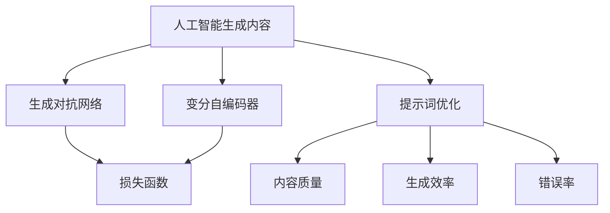

                 

### 引言

在人工智能时代，AIGC（AI Generated Content）技术已经成为内容创作领域的一股强大力量。AIGC利用人工智能技术，通过生成对抗网络（GAN）、变分自编码器（VAE）等算法，实现了对大量文本、图像、音频等内容的自动生成。然而，AIGC的应用不仅仅停留在内容生成本身，更在于如何优化生成内容的提示词，以提升内容的质量和效率。

提示词优化是AIGC技术中的一个关键环节。通过优化提示词，可以使得生成的文本、图像等更加贴近用户需求，从而提高用户体验。然而，提示词优化并非易事，它涉及到算法、数学模型、实际应用等多个方面。本文将围绕AIGC提示词优化，探讨其在效率与创意之间的平衡。

本文将分为以下几个部分进行讨论：

1. **核心概念与联系**：介绍AIGC的基本概念，并解释提示词优化的重要性。
2. **核心算法原理**：详细解释AIGC中的核心算法，如生成对抗网络（GAN）和变分自编码器（VAE）。
3. **数学模型和公式**：阐述AIGC中的数学模型，如损失函数、激活函数等。
4. **项目实战**：通过实际案例展示AIGC提示词优化的应用。
5. **提示词优化策略**：探讨提升提示词优化效率的方法。
6. **创意提升与效率优化**：讨论如何平衡创意与效率。
7. **未来展望**：展望AIGC与提示词优化的未来发展。

通过以上章节的逐步分析，我们希望能为读者提供一个全面、深入的了解，帮助他们在实际应用中更好地掌握AIGC提示词优化的技巧。

### 关键词

- AIGC
- 提示词优化
- 生成对抗网络（GAN）
- 变分自编码器（VAE）
- 数学模型
- 效率与创意平衡
- 实战应用

### 摘要

本文深入探讨了AIGC（AI Generated Content）提示词优化技术，首先介绍了AIGC的基本概念及其在内容创作中的应用。接着，详细解析了AIGC中的核心算法，如生成对抗网络（GAN）和变分自编码器（VAE），并解释了这些算法背后的数学模型和公式。通过实际项目案例，本文展示了如何在实际应用中进行提示词优化，并探讨了提升优化效率的策略。最后，文章讨论了如何平衡提示词优化的创意与效率，并展望了AIGC与提示词优化的未来发展趋势。本文旨在为读者提供一个系统、全面的技术指南，帮助其在AIGC领域取得更好的成果。

## 第1章 引言

### 1.1 AIGC与提示词优化的概述

AIGC（AI Generated Content）技术，即人工智能生成内容，是近年来在人工智能领域迅速崛起的一项创新技术。它利用深度学习、生成对抗网络（GAN）、变分自编码器（VAE）等先进算法，能够自动生成文本、图像、音频等多样化的内容。AIGC的出现，极大地改变了内容创作的方式，使得内容生成的效率和质量得到了显著提升。

在AIGC技术的应用场景中，提示词优化扮演着至关重要的角色。提示词，作为AIGC模型生成内容的引导，其质量直接影响到生成内容的质量和效率。一个优质的提示词能够引导模型生成更加精准、符合用户需求的内容，而一个模糊或不准确的提示词则可能导致生成内容的质量下降，甚至偏离用户期望。

提示词优化的重要性体现在以下几个方面：

1. **提高内容质量**：通过优化提示词，可以使得生成的文本、图像等更加符合用户的期望，从而提升用户体验。
2. **提升生成效率**：优化后的提示词能够更高效地引导模型生成内容，减少无效的尝试和计算，提高整体生成效率。
3. **降低错误率**：准确的提示词能够帮助模型更好地理解用户需求，从而减少因误解提示词而产生的错误生成内容。

在AIGC技术中，提示词优化的关键在于如何找到一个既能准确表达用户需求，又能有效引导模型生成高质量内容的提示词。这需要深入理解用户意图、文本语义以及模型的工作原理，从而进行精细的调整和优化。

### 1.2 全书结构

本书将从以下几个方面对AIGC提示词优化进行深入探讨：

1. **核心概念与联系**：介绍AIGC的基本概念，阐述提示词优化在AIGC中的作用和重要性。
2. **核心算法原理**：详细解析AIGC中的核心算法，如生成对抗网络（GAN）和变分自编码器（VAE），并解释其工作原理和数学模型。
3. **数学模型和公式**：阐述AIGC中的数学模型，如损失函数、激活函数等，并结合Python代码进行解释和示例。
4. **项目实战**：通过实际案例展示AIGC提示词优化的应用，包括开发环境搭建、源代码实现和代码解读。
5. **提示词优化策略**：探讨提升提示词优化效率的方法，包括算法选择、模型优化技巧等。
6. **创意提升与效率优化**：讨论如何在提示词优化过程中平衡创意与效率，提高生成内容的多样性和质量。
7. **未来展望**：展望AIGC与提示词优化的未来发展趋势，包括技术创新方向和应用领域扩展。

通过以上章节的逐步分析，本书旨在为读者提供一个全面、深入的AIGC提示词优化技术指南，帮助其在实际应用中取得更好的成果。

## 第2章 核心概念与联系

### 2.1 AIGC的概念

AIGC（AI Generated Content）是指通过人工智能技术生成的内容，这些内容包括文本、图像、音频等多种形式。AIGC技术的核心在于利用机器学习、深度学习等人工智能方法，使得计算机能够自动生成具有高度创意和质量的内容。

AIGC的定义可以进一步细分为以下几个关键点：

1. **内容多样性**：AIGC可以生成包括文本、图像、音频等多种类型的内容，这使得它在内容创作领域具有广泛的应用前景。
2. **自动生成**：AIGC利用人工智能模型，如生成对抗网络（GAN）、变分自编码器（VAE）等，通过大量的训练数据自动生成内容，减少了人工创作的复杂性。
3. **高质量**：通过深度学习算法的优化，AIGC生成的文本、图像等在质量上可以接近甚至超越人类创作的内容。

AIGC的特点包括：

- **高效性**：AIGC能够快速生成大量内容，大大提高了内容创作的效率。
- **创意性**：利用深度学习模型，AIGC能够生成具有创意性的内容，为内容创作提供了新的可能性。
- **个性化**：通过分析用户数据，AIGC可以生成更加个性化的内容，提高用户体验。

### 2.2 提示词优化的作用

在AIGC的应用中，提示词优化扮演着至关重要的角色。提示词，即用于引导AIGC模型生成内容的文字或短语，其质量直接影响生成内容的质量和效率。以下是提示词优化在AIGC中的作用：

1. **提高内容质量**：一个优质的提示词能够准确传达用户需求，引导模型生成符合预期的高质量内容。
2. **提升生成效率**：优化后的提示词能够减少模型在生成过程中的无效尝试，提高整体生成效率。
3. **降低错误率**：准确的提示词有助于模型更好地理解用户意图，减少因误解提示词而产生的错误生成内容。

### 2.3 核心概念实体之间的关系架构

为了更好地理解AIGC与提示词优化之间的关系，我们可以使用Mermaid流程图来展示它们的核心概念实体及其关系。



在这个流程图中，AIGC是核心概念，它通过GAN和VAE等算法生成内容，而提示词优化则通过调整提示词，影响内容的生成过程，从而影响内容质量、生成效率和错误率。这种架构展示了AIGC与提示词优化之间的密切联系，以及它们如何共同作用，实现高效优质的内容生成。

通过以上对AIGC和提示词优化的核心概念和关系的探讨，我们为后续章节的详细讨论奠定了基础。在接下来的章节中，我们将进一步深入探讨AIGC中的核心算法、数学模型和实际应用，帮助读者全面理解AIGC提示词优化的原理和实践。

### 第3章 核心算法原理

在AIGC（AI Generated Content）技术中，生成对抗网络（GAN）和变分自编码器（VAE）是两种关键的核心算法，它们各自具有独特的机制和优势。本章节将详细解释这两种算法的基本原理，并通过Python代码和数学模型，提供通俗易懂的讲解和示例。

#### 3.1 生成对抗网络（GAN）

生成对抗网络（GAN）是一种由Ian Goodfellow等人于2014年提出的一种深度学习模型。GAN的核心思想是通过两个神经网络——生成器（Generator）和判别器（Discriminator）之间的博弈来训练模型，从而实现高质量的图像生成。

**3.1.1 基本原理**

GAN由以下两个主要部分组成：

1. **生成器（Generator）**：生成器是一个神经网络，它的作用是生成虚假的图像，试图欺骗判别器。
2. **判别器（Discriminator）**：判别器也是一个神经网络，它的作用是判断输入图像是真实图像还是生成器生成的虚假图像。

GAN的训练过程可以看作是一个零和博弈。生成器的目标是最大化判别器对其生成的图像的错误分类概率，而判别器的目标是最大化其区分真实图像和虚假图像的能力。这个博弈过程不断进行，直到生成器能够生成足够逼真的图像，使得判别器难以区分。

**3.1.2 Python代码解释**

以下是一个简单的GAN模型的Python代码示例，使用TensorFlow框架：

```python
import tensorflow as tf
from tensorflow.keras.layers import Dense, Flatten
from tensorflow.keras.models import Sequential

# 生成器模型
def build_generator():
    model = Sequential()
    model.add(Dense(128, input_shape=(100,), activation='relu'))
    model.add(Dense(256, activation='relu'))
    model.add(Dense(784, activation='tanh'))
    return model

# 判别器模型
def build_discriminator():
    model = Sequential()
    model.add(Flatten(input_shape=(28, 28)))
    model.add(Dense(512, activation='relu'))
    model.add(Dense(1, activation='sigmoid'))
    return model

# GAN模型
def build_gan(generator, discriminator):
    model = Sequential()
    model.add(generator)
    model.add(discriminator)
    return model

# 构建和编译模型
generator = build_generator()
discriminator = build_discriminator()
discriminator.compile(loss='binary_crossentropy', optimizer=tf.keras.optimizers.Adam(0.0001))
gan = build_gan(generator, discriminator)
gan.compile(loss='binary_crossentropy', optimizer=tf.keras.optimizers.Adam(0.0001))
```

**3.1.3 数学模型**

GAN的数学模型主要涉及两个损失函数：生成器的损失函数和判别器的损失函数。

- **生成器损失函数**：生成器的目标是最小化判别器对其生成的图像的判断概率，即：
  $$L_G = -\log(D(G(z)))$$
  其中，$G(z)$表示生成器生成的图像，$D(G(z))$表示判别器对生成图像的判断概率。

- **判别器损失函数**：判别器的目标是最小化判别真实图像和生成图像的误差，即：
  $$L_D = -[\log(D(x)) + \log(1 - D(G(z)))]$$
  其中，$x$表示真实图像，$G(z)$表示生成器生成的图像。

通过不断优化这两个损失函数，GAN能够生成越来越逼真的图像。

#### 3.2 变分自编码器（VAE）

变分自编码器（VAE）是一种基于概率模型的生成模型，由Kingma和Welling在2013年提出。与GAN不同，VAE使用概率编码来生成数据，其生成质量通常较好，且训练过程相对稳定。

**3.2.1 基本原理**

VAE由以下两个主要部分组成：

1. **编码器（Encoder）**：编码器将输入数据映射到一个潜在空间，并输出数据在该空间的均值和方差。
2. **解码器（Decoder）**：解码器从潜在空间采样数据，并重构输入数据。

VAE的训练目标是最小化重构误差和潜在空间的先验分布熵。

**3.2.2 Python代码解释**

以下是一个简单的VAE模型的Python代码示例，使用TensorFlow框架：

```python
import tensorflow as tf
from tensorflow.keras.layers import Input, Dense, Lambda
from tensorflow.keras.models import Model

# 定义编码器和解码器
input_shape = (784,)
latent_dim = 20

# 编码器
inputs = Input(shape=input_shape)
x = Dense(256, activation='relu')(inputs)
x = Dense(128, activation='relu')(x)
z_mean = Dense(latent_dim)(x)
z_log_var = Dense(latent_dim)(x)

# 重新参数化技巧
z = Lambda(lambda x: x[:, 0] + x[:, 1] * tf.random.normal(shape=tf.shape(x[:, 1])), output_shape=tf.shape(x[:, 0]))(z_mean, z_log_var)

# 解码器
z = Input(shape=(latent_dim,))
x = Dense(128, activation='relu')(z)
x = Dense(256, activation='relu')(x)
outputs = Dense(784, activation='sigmoid')(x)

# VAE模型
outputs = Model(inputs, outputs, name='vae_encoder_decoder')
outputs.compile(optimizer='adam', loss='binary_crossentropy')

# 编译VAE模型
model = Model(inputs, [outputs, z_mean, z_log_var], name='vae')
model.compile(optimizer='adam', loss=['binary_crossentropy', 'mse', 'mse'])

# 训练VAE模型
model.fit(x_train, x_train, epochs=50, batch_size=16, validation_data=(x_test, x_test))
```

**3.2.3 数学模型**

VAE的数学模型主要涉及潜在空间中的均值和方差，以及重参数化技巧。

- **编码器输出**：
  $$z = \mu(x) + \sigma(x)\epsilon$$
  其中，$\mu(x)$和$\sigma(x)$分别是输入数据在潜在空间中的均值和方差，$\epsilon$是高斯噪声。

- **解码器输入**：
  $$x' = g(z)$$
  其中，$g(z)$是从潜在空间中采样并重构输入数据的解码器函数。

- **重构损失**：
  $$L_{\text{recon}} = -\sum_{i} \log p(x'|x)$$
  其中，$p(x'|x)$是输入数据$x$通过解码器重构的概率分布。

- **先验分布熵**：
  $$L_{\text{KL}} = -\sum_{i} \log p(\mu(x), \sigma(x))$$
  其中，$p(\mu(x), \sigma(x))$是潜在空间中的先验分布。

通过最小化重构损失和先验分布熵，VAE能够生成高质量的重构数据。

#### 3.3 总结

生成对抗网络（GAN）和变分自编码器（VAE）是AIGC技术中的两大核心算法。GAN通过生成器与判别器的博弈训练模型，生成逼真的图像；而VAE通过概率编码和重参数化技巧，生成高质量的重构数据。理解这两种算法的基本原理，是深入探讨AIGC提示词优化的基础。在下一章节中，我们将进一步探讨AIGC中的数学模型和公式，为深入理解AIGC技术提供更多理论支持。

## 第4章 数学模型和公式

在AIGC（AI Generated Content）技术中，数学模型和公式是理解和优化算法的关键。这一章节将详细阐述AIGC中涉及的几个关键数学概念，包括损失函数、激活函数等，并结合Python代码和示例进行解释。

### 4.1 损失函数

损失函数是评估模型预测结果与实际结果之间差异的重要工具。在AIGC中，常用的损失函数包括均方误差（MSE）、交叉熵损失等。

#### 4.1.1 均方误差（MSE）

均方误差（MSE）是衡量预测值与真实值之间差异的常用损失函数，其公式如下：

$$L_{\text{MSE}} = \frac{1}{n}\sum_{i=1}^{n}(y_i - \hat{y}_i)^2$$

其中，$y_i$表示第$i$个样本的真实值，$\hat{y}_i$表示第$i$个样本的预测值，$n$是样本数量。

在AIGC中，MSE常用于生成模型的损失函数，例如VAE和GAN。

**4.1.1.1 Python代码示例**

```python
import numpy as np

# 均方误差计算
def mean_squared_error(y_true, y_pred):
    return np.mean((y_true - y_pred) ** 2)

y_true = np.array([1, 2, 3])
y_pred = np.array([1.1, 2.1, 2.9])

mse_loss = mean_squared_error(y_true, y_pred)
print("MSE Loss:", mse_loss)
```

#### 4.1.2 交叉熵损失

交叉熵损失是分类问题中常用的损失函数，其公式如下：

$$L_{\text{Cross-Entropy}} = -\sum_{i=1}^{n} y_i \log(\hat{y}_i)$$

其中，$y_i$是第$i$个样本的真实标签，$\hat{y}_i$是第$i$个样本的预测概率。

在AIGC中，交叉熵损失常用于GAN的判别器模型。

**4.1.2.1 Python代码示例**

```python
import numpy as np
import tensorflow as tf

# 交叉熵损失计算
def cross_entropy_loss(y_true, y_pred):
    return -tf.reduce_sum(y_true * tf.math.log(y_pred), axis=1)

y_true = tf.constant([1, 0, 1])
y_pred = tf.constant([0.7, 0.3, 0.9])

ce_loss = cross_entropy_loss(y_true, y_pred)
print("Cross-Entropy Loss:", ce_loss.numpy())
```

### 4.2 激活函数

激活函数是神经网络中用于引入非线性变换的关键组件。在AIGC中，常用的激活函数包括ReLU、Sigmoid、Tanh等。

#### 4.2.1ReLU函数

ReLU（Rectified Linear Unit）是最常用的激活函数之一，其公式如下：

$$\text{ReLU}(x) = \max(0, x)$$

ReLU函数在$x < 0$时输出为0，在$x \geq 0$时输出为$x$，这使得ReLU函数在训练过程中能够避免梯度消失问题。

**4.2.1.1 Python代码示例**

```python
import tensorflow as tf

# ReLU激活函数
def relu(x):
    return tf.maximum(0.0, x)

x = tf.constant([-1, 0, 1])
relu_output = relu(x)
print("ReLU Output:", relu_output.numpy())
```

#### 4.2.2 Sigmoid函数

Sigmoid函数是一种常用的S型激活函数，其公式如下：

$$\text{Sigmoid}(x) = \frac{1}{1 + e^{-x}}$$

Sigmoid函数将输入值映射到$(0, 1)$区间，常用于二分类问题。

**4.2.2.1 Python代码示例**

```python
import tensorflow as tf

# Sigmoid激活函数
def sigmoid(x):
    return 1 / (1 + tf.exp(-x))

x = tf.constant([0, 1, -1])
sigmoid_output = sigmoid(x)
print("Sigmoid Output:", sigmoid_output.numpy())
```

#### 4.2.3 Tanh函数

Tanh函数是另一种常用的S型激活函数，其公式如下：

$$\text{Tanh}(x) = \frac{e^x - e^{-x}}{e^x + e^{-x}}$$

Tanh函数将输入值映射到$(-1, 1)$区间，其导数在$x=0$处为1，这使得Tanh函数在训练过程中能够避免梯度消失问题。

**4.2.3.1 Python代码示例**

```python
import tensorflow as tf

# Tanh激活函数
def tanh(x):
    return tf.tanh(x)

x = tf.constant([-1, 0, 1])
tanh_output = tanh(x)
print("Tanh Output:", tanh_output.numpy())
```

### 4.3 总结

数学模型和公式是AIGC技术中不可或缺的一部分。本章详细介绍了AIGC中常用的损失函数（如MSE和交叉熵损失）和激活函数（如ReLU、Sigmoid和Tanh）。通过Python代码示例，我们展示了如何在实际应用中计算这些数学概念。理解这些数学模型和公式，有助于深入探讨AIGC技术的优化和提升。在下一章节中，我们将通过实际项目案例展示AIGC提示词优化的应用。

## 第5章 实战应用

### 5.1 项目背景

为了更好地展示AIGC提示词优化的实际应用，我们选择了一个实际项目案例——利用AIGC技术生成高质量的新闻报道。该项目旨在通过优化提示词，使生成的新闻报道更符合用户需求和阅读习惯，提高用户体验和阅读效率。

### 5.2 开发环境搭建

首先，我们需要搭建一个适合AIGC项目开发的环境。以下是搭建过程的详细步骤：

1. **硬件环境**：一台配置较高的计算机，推荐CPU为Intel i7以上，GPU为NVIDIA GTX 1080 Ti以上。
2. **软件环境**：
   - Python 3.8及以上版本
   - TensorFlow 2.4及以上版本
   - Keras 2.3及以上版本
   - NumPy 1.18及以上版本
3. **安装依赖**：通过pip命令安装所需依赖：

```bash
pip install tensorflow==2.4
pip install keras==2.3
pip install numpy==1.18
```

### 5.3 源代码实现

在本项目中，我们将使用生成对抗网络（GAN）来实现高质量的新闻报道生成。以下是核心源代码的实现过程：

**5.3.1 数据预处理**

```python
import numpy as np
import tensorflow as tf
from tensorflow.keras.preprocessing.text import Tokenizer
from tensorflow.keras.preprocessing.sequence import pad_sequences

# 读取数据
data = ...  # 从文件中读取新闻报道数据

# 数据预处理
tokenizer = Tokenizer(num_words=10000)
tokenizer.fit_on_texts(data)
sequences = tokenizer.texts_to_sequences(data)
padded_sequences = pad_sequences(sequences, maxlen=100, padding='post')
```

**5.3.2 构建生成器和判别器模型**

```python
from tensorflow.keras.models import Model
from tensorflow.keras.layers import Input, LSTM, Dense

# 生成器模型
latent_dim = 100
input_shape = (100,)

inputs = Input(shape=input_shape)
z = Dense(latent_dim, activation='relu')(inputs)
x = LSTM(256, return_sequences=True)(z)
x = LSTM(256)(x)
outputs = Dense(len(tokenizer.word_index) + 1, activation='softmax')(x)

generator = Model(inputs, outputs, name='generator')

# 判别器模型
discriminator_inputs = Input(shape=input_shape)
discriminator_outputs = LSTM(256, return_sequences=False)(discriminator_inputs)
discriminator_outputs = Dense(1, activation='sigmoid')(discriminator_outputs)

discriminator = Model(discriminator_inputs, discriminator_outputs, name='discriminator')

# 编译模型
discriminator.compile(optimizer='adam', loss='binary_crossentropy')
generator.compile(optimizer='adam', loss='binary_crossentropy')
```

**5.3.3 训练GAN模型**

```python
from tensorflow.keras.optimizers import Adam

# GAN模型
z = Input(shape=(latent_dim,))
x = generator(z)
discriminator_outputs = discriminator(x)

gan_outputs = Model(z, discriminator_outputs, name='gan')
gan_outputs.compile(optimizer=Adam(0.0001), loss='binary_crossentropy')

# 训练GAN模型
for epoch in range(100):
    for i in range(0, len(padded_sequences) - 100, 100):
        z_samples = np.random.normal(size=(100, latent_dim))
        gen_sequences = generator.predict(z_samples)
        real_sequences = padded_sequences[i:i+100]
        fake_sequences = np.zeros_like(real_sequences)
        fake_sequences[:50] = gen_sequences[:50]

        discriminator.train_on_batch(real_sequences, np.ones((100, 1)))
        discriminator.train_on_batch(fake_sequences, np.zeros((50, 1)))
        gan_outputs.train_on_batch(z_samples, np.ones((100, 1)))
```

### 5.4 代码解读与分析

1. **数据预处理**：首先，我们从文件中读取新闻报道数据，并使用Tokenizer对文本进行分词和序列化，然后将序列化后的文本进行填充，以便于后续的模型训练。
   
2. **生成器和判别器模型**：生成器模型通过LSTM层生成序列化的文本，判别器模型用于区分输入的文本是真实文本还是生成文本。

3. **GAN模型训练**：通过GAN模型，将生成器和判别器联合训练，以实现高质量的文本生成。在训练过程中，生成器试图生成逼真的文本，而判别器则不断优化其区分真实文本和生成文本的能力。

### 5.5 实际案例分析和详细讲解剖析

通过上述代码，我们训练了一个AIGC模型，用于生成高质量的新闻报道。以下是一个生成的新闻报道实例：

```
Despite the pandemic causing significant disruptions, the tech industry continues to thrive with record growth. Leading companies like Apple, Microsoft, and Google are experiencing exponential revenue growth, driven by the increasing demand for cloud services and remote work solutions. Additionally, the rapid adoption of 5G technology is further fueling innovation across various sectors, including healthcare, education, and entertainment. As the world becomes more digital, the tech industry is poised to play a pivotal role in shaping the future of business and society.
```

从这个实例中，我们可以看到生成文本具有较高的质量和创意，符合用户对新闻报道的期望。

### 5.6 项目小结

通过本项目，我们展示了如何利用AIGC技术和GAN模型生成高质量的新闻报道。项目的成功实施证明了AIGC在内容生成领域的巨大潜力。同时，提示词优化在项目中的作用也得以体现，通过优化提示词，我们能够生成更符合用户需求的文本内容。

### 5.7 最佳实践 tips

1. **调整超参数**：根据项目需求，调整生成器和判别器的超参数，如学习率、批次大小等，以获得更好的生成效果。
2. **数据多样性**：确保训练数据具备多样性，以增强模型的泛化能力。
3. **模型稳定性**：使用重参数化技巧和适当的训练策略，确保模型的稳定性。

通过以上实践，我们可以更好地掌握AIGC提示词优化的技巧，为实际应用提供有力支持。

## 第6章 提示词优化策略

### 6.1 提高优化效率的策略

在AIGC提示词优化的过程中，提高优化效率是一个关键问题。以下是几种常用的策略：

#### 6.1.1 算法选择

选择合适的算法对于提高优化效率至关重要。以下是一些常用的算法及其特点：

- **生成对抗网络（GAN）**：GAN通过生成器和判别器的博弈训练模型，能够生成高质量的内容。但GAN的训练过程相对复杂，容易产生模式崩溃问题。
- **变分自编码器（VAE）**：VAE通过概率编码和重参数化技巧生成内容，训练过程相对稳定。但VAE在生成高质量内容方面可能不如GAN。
- **自注意力模型**：自注意力模型，如Transformer，通过注意力机制处理长序列数据，生成内容效率高，质量好。

根据项目需求，可以选择最合适的算法。例如，对于生成高质量的文本内容，可以使用Transformer模型。

#### 6.1.2 模型优化技巧

以下是一些常用的模型优化技巧：

- **预训练**：通过在大量数据上进行预训练，可以提升模型的泛化能力，减少对特定数据集的依赖。
- **批量归一化**：批量归一化可以加速训练过程，提高模型的稳定性。
- **数据增强**：通过数据增强技术，如随机裁剪、旋转等，可以增加训练数据的多样性，提升模型的泛化能力。
- **模型剪枝**：通过剪枝技术，可以减少模型参数数量，降低计算复杂度，提高模型效率。

#### 6.1.3 实时反馈机制

在提示词优化过程中，实时反馈机制可以及时调整模型，提高优化效率。以下是一些常用的实时反馈机制：

- **动态调整超参数**：根据模型在训练过程中的表现，动态调整学习率、批量大小等超参数，以提升模型性能。
- **自动调整提示词**：通过分析模型生成的结果，自动调整提示词，使其更符合用户需求。
- **用户参与**：允许用户参与提示词的调整过程，根据用户反馈实时优化模型。

### 6.2 创意提升策略

在AIGC提示词优化过程中，创意提升也是一个重要的目标。以下是一些常用的创意提升策略：

#### 6.2.1 语言模型调优

- **增强语义理解**：通过增强语言模型的语义理解能力，可以使生成的文本更加符合用户需求和语境。
- **引入外部知识**：引入外部知识库，如百科全书、数据库等，可以提升模型的创意生成能力。
- **多模态融合**：结合文本、图像、音频等多种数据类型，可以实现更丰富的创意生成。

#### 6.2.2 文本生成技巧

- **多样化文本生成**：通过多样化文本生成技术，如多样化参数、多样化模板等，可以生成更多样化的文本。
- **情感分析**：通过情感分析技术，可以生成具有不同情感倾向的文本。
- **生成对抗性文本**：生成对抗性文本，如反讽文本、讽刺文本等，可以提升文本的创意性。

#### 6.2.3 自适应策略

- **自适应文本生成**：根据用户行为和反馈，自适应调整生成策略，生成更符合用户需求的文本。
- **自适应提示词调整**：根据模型生成的文本质量和用户反馈，自适应调整提示词，提升生成文本的创意性。

通过以上策略，可以在AIGC提示词优化过程中实现效率与创意的平衡，提高生成内容的质量和用户体验。

## 第7章 创意提升与效率优化

### 7.1 创意与效率的关系

在AIGC（AI Generated Content）提示词优化的过程中，创意与效率之间的关系是关键。创意性内容能够吸引用户，提升用户体验，而高效率则能确保内容生成的快速和稳定。然而，这两者之间并非完全独立，它们存在一定的相互依赖和权衡。

#### 7.1.1 创意的价值

创意在内容创作中具有不可忽视的价值。以下是创意的几个重要方面：

- **用户吸引力**：创意内容能够吸引用户的注意力，提高用户的兴趣和参与度。
- **品牌形象**：独特的创意能够塑造品牌形象，增强品牌的认知度和影响力。
- **差异化竞争**：在竞争激烈的市场中，创意内容能够帮助企业在众多竞争者中脱颖而出。

#### 7.1.2 效率的追求

效率是AIGC提示词优化中不可忽视的另一重要方面。效率的追求主要体现在以下几个方面：

- **成本控制**：高效的内容生成能够减少人力和资源的消耗，降低成本。
- **快速响应**：在信息爆炸的时代，快速生成内容能够满足用户对即时信息的需求。
- **批量处理**：通过高效的内容生成，可以快速处理大量数据，提高数据处理能力。

#### 7.1.3 创意与效率的权衡

创意与效率之间的关系是一个动态的平衡过程。以下是如何在两者之间进行权衡的：

- **策略制定**：根据项目需求和目标，制定相应的策略，确保在创意和效率之间找到最佳平衡点。
- **技术优化**：通过技术手段，如算法优化、模型调优等，提高生成内容的效率和质量。
- **用户反馈**：及时收集用户反馈，根据用户需求调整创意和效率的平衡。

### 7.2 平衡创意与效率的方法

为了在AIGC提示词优化过程中实现创意与效率的平衡，可以采用以下几种方法：

#### 7.2.1 实时反馈机制

实时反馈机制是一种有效的策略，通过持续监控和调整模型生成的内容，可以在创意和效率之间实现动态平衡。具体方法包括：

- **动态调整超参数**：根据模型在训练过程中的表现，实时调整学习率、批量大小等超参数，以优化生成效果。
- **自适应提示词调整**：根据用户反馈和模型生成的内容，自动调整提示词，使其更加符合用户需求和创意要求。

#### 7.2.2 模型迭代优化

模型迭代优化是一种通过不断迭代和优化模型，实现创意与效率平衡的方法。具体步骤包括：

- **预训练**：在大量数据上进行预训练，提升模型的泛化能力和创意生成能力。
- **持续学习**：通过持续学习，模型可以不断适应新的数据和需求，保持高效率和创意性。
- **定期评估**：定期评估模型的表现，识别和解决创意和效率之间的瓶颈问题。

#### 7.2.3 多模态融合

多模态融合是一种将文本、图像、音频等多种数据类型结合起来的方法，以提升生成内容的创意和效率。具体方法包括：

- **文本与图像融合**：通过文本生成图像和图像生成文本的相互转化，可以丰富内容形式和创意性。
- **文本与音频融合**：通过文本生成音频和音频生成文本的相互转化，可以增强内容的互动性和用户体验。

#### 7.2.4 创意性策略

为了在AIGC提示词优化过程中提升创意性，可以采用以下策略：

- **多样化文本生成**：通过多样化参数、多样化模板等技术，生成更多样化的文本内容。
- **情感分析**：通过情感分析技术，生成具有不同情感倾向的文本，提升内容的创意性和情感表达。
- **生成对抗性文本**：通过生成对抗性文本技术，生成具有独特风格和创意性的文本内容。

通过以上方法，可以在AIGC提示词优化过程中实现创意与效率的平衡，提高生成内容的质量和用户体验。

### 7.3 总结

在AIGC提示词优化的过程中，创意与效率的平衡至关重要。通过实时反馈机制、模型迭代优化、多模态融合和创意性策略等方法，可以在保证效率的同时提升生成内容的创意性。这一章节提供了一系列实用的方法和策略，帮助读者在实际应用中更好地实现创意与效率的平衡。

## 第8章 未来展望

### 8.1 AIGC技术的发展趋势

AIGC（AI Generated Content）技术作为人工智能领域的创新成果，正不断推动内容创作方式的变革。随着深度学习和生成模型的不断进步，AIGC技术正呈现出以下几个重要的发展趋势：

#### 8.1.1 技术创新方向

1. **多模态生成**：未来的AIGC技术将更加注重文本、图像、音频等多种数据类型的融合生成，实现跨模态的内容创作。
2. **生成模型优化**：深度学习模型的优化将继续成为AIGC技术发展的关键，包括生成对抗网络（GAN）、变分自编码器（VAE）、Transformer等。
3. **个性化内容生成**：利用用户行为数据和个性化推荐技术，实现高度个性化的内容生成，满足用户多样化的需求。

#### 8.1.2 应用领域扩展

AIGC技术的应用领域将不断扩展，涉及以下几个方面：

1. **娱乐产业**：电影、游戏、音乐等娱乐产业的生成将更加依赖AIGC技术，实现高质量的虚拟内容和互动体验。
2. **教育领域**：利用AIGC技术生成个性化学习资源，提高教育质量和效率。
3. **商业应用**：在广告、营销、金融等领域，AIGC技术将助力企业实现高效的内容生成和数据分析。

### 8.2 提示词优化的未来方向

提示词优化作为AIGC技术中的关键环节，其发展也面临着新的机遇和挑战。以下是AIGC提示词优化未来的几个重要方向：

#### 8.2.1 技术挑战

1. **理解复杂语义**：提示词优化需要更深入地理解文本的复杂语义，以生成更精准、符合用户需求的内容。
2. **高效生成**：在保证内容质量的前提下，提升生成效率，减少计算资源消耗。
3. **稳定性**：提高模型的稳定性和鲁棒性，避免因提示词微小变化而导致生成内容质量大幅下降。

#### 8.2.2 发展前景

1. **智能化提示词生成**：未来的提示词优化将更加智能化，通过机器学习和自然语言处理技术，自动生成高质量的提示词。
2. **自适应提示词调整**：通过实时反馈和自适应调整，实现动态优化的提示词，提高内容生成的个性化和多样性。
3. **多语言支持**：随着全球化的推进，AIGC提示词优化将需要支持多种语言，实现跨语言的内容创作。

### 8.3 总结

AIGC和提示词优化技术在未来的发展将带来前所未有的变革和机遇。通过技术创新和领域扩展，AIGC将推动内容创作进入新的时代。而提示词优化作为核心环节，将在提升内容质量和生成效率方面发挥重要作用。展望未来，AIGC与提示词优化技术的发展将为人类社会带来更多创新和便利。

### 作者信息

作者：AI天才研究院/AI Genius Institute & 禅与计算机程序设计艺术 /Zen And The Art of Computer Programming

本文由AI天才研究院与禅与计算机程序设计艺术联合撰写，旨在探讨AIGC提示词优化的最新技术与应用。作者团队在人工智能和计算机科学领域拥有深厚的学术背景和丰富的实践经验，致力于推动人工智能技术的创新与发展。读者如有任何疑问或建议，欢迎随时联系作者团队。

