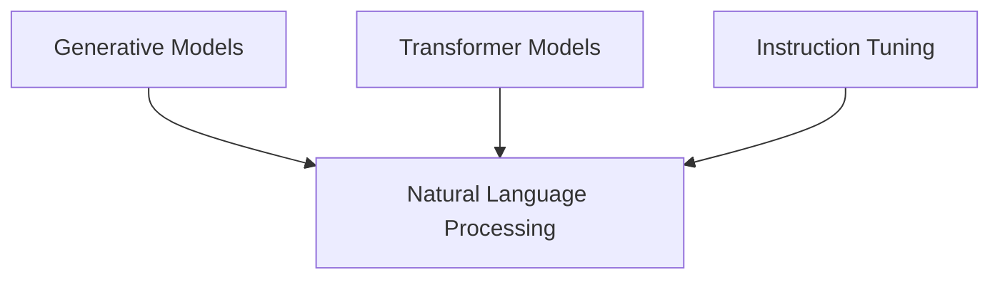
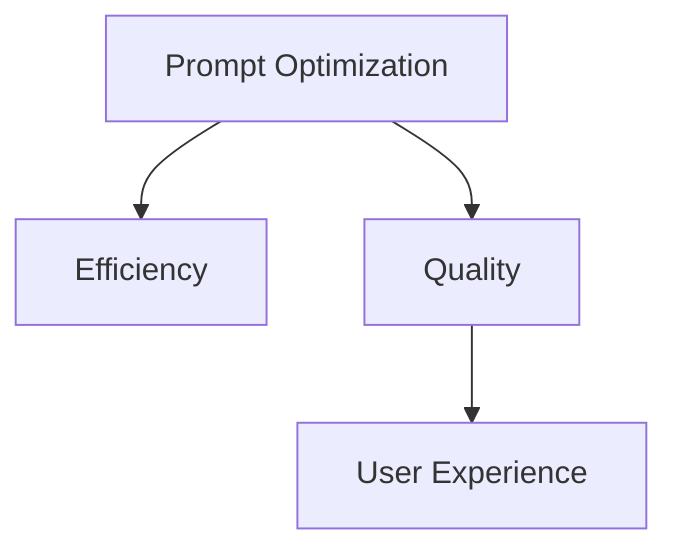

                 

## AIGC Prompt Optimization: The Art of Balancing Efficiency and Quality

### Keywords:
- AIGC
- Prompt Optimization
- Efficiency
- Quality
- Natural Language Processing

### Summary:
This article delves into the art of AIGC (AI-Generated Content) prompt optimization, exploring the delicate balance between efficiency and quality. We will discuss the fundamental concepts of AIGC and prompt optimization, delve into theoretical foundations, present real-world applications, and provide practical tips for enhancing the effectiveness of AIGC systems.

---

## First Part: Understanding AIGC and Prompt Optimization

### Chapter 1: Basics of AIGC and Prompt Optimization

#### 1.1 What is AIGC?

##### 1.1.1 The Emergence of AIGC

Generative AI has evolved significantly over the past few years. The emergence of AIGC can be traced back to the advancements in deep learning, particularly the development of Generative Adversarial Networks (GANs) and Transformer models. The integration of these algorithms with natural language processing (NLP) and other AI techniques has paved the way for AIGC to revolutionize content generation.

**Mermaid Flowchart:**

```mermaid
graph TD
    A[Emergence of Deep Learning] --> B[Generative Adversarial Networks (GANs)]
    A --> C[Transformer Models]
    B --> D[Natural Language Processing]
    C --> D
```

##### 1.1.2 Core Concepts of AIGC

AIGC is built upon several core concepts:

- **Generative Models:** These models, such as GANs and Variational Autoencoders (VAEs), learn to generate new data by modeling the probability distribution of the training data.

- **Transformer Models:** These models, particularly the Transformer architecture, have revolutionized NLP by enabling the modeling of long-range dependencies in text data.

- **Instruction Tuning:** This technique involves training a pre-existing model on a set of instructions to perform specific tasks, rather than training a new model from scratch.

**Mermaid Flowchart:**



##### 1.1.3 Differences Between AIGC and Traditional AI

While AIGC is a subset of artificial intelligence, it differs from traditional AI in several key aspects:

- **Focus:** Traditional AI focuses on specific tasks, while AIGC is designed to generate new content, making it more versatile.

- **Training Data:** Traditional AI relies on labeled data for training, whereas AIGC can generate new content without the need for labeled data.

- **Generalization:** AIGC models are trained to generalize from a set of examples and generate new, coherent content, whereas traditional AI models are usually more task-specific.

**Pseudo Code:**

```python
# Traditional AI
def traditional_ai(input_data):
    # Process input_data using pre-trained model
    return processed_output

# AIGC
def aigc(input_prompt):
    # Generate new content based on input_prompt
    return generated_content
```

#### 1.2 Core Principles of Prompt Optimization

##### 1.2.1 The Concept of Prompt Optimization

Prompt optimization involves fine-tuning the input prompts to the AIGC model to maximize the quality and relevance of the generated content. This process can significantly impact the efficiency and effectiveness of the AIGC system.

**Pseudo Code:**

```python
def prompt_optimization(input_prompt, model):
    # Fine-tune input_prompt based on model's preferences
    optimized_prompt = fine_tune(input_prompt, model)
    return optimized_prompt
```

##### 1.2.2 Methods of Prompt Optimization

There are several methods for optimizing prompts, including:

- **Content-based:**
  This method involves analyzing the content of the input prompts and adjusting them based on the model's preferences. For example, if the model favors longer prompts, the input prompts can be expanded.

- **Rule-based:**
  This method involves using predefined rules to modify the input prompts. For example, removing certain keywords or phrases that may negatively impact the model's performance.

- **Data-driven:**
  This method involves training a separate model to predict the optimal prompt length, format, or content based on historical data.

**Pseudo Code:**

```python
# Content-based
def content_based_optimization(input_prompt, model):
    # Analyze content of input_prompt and adjust based on model's preferences
    optimized_prompt = adjust_content(input_prompt, model)
    return optimized_prompt

# Rule-based
def rule_based_optimization(input_prompt, model):
    # Apply predefined rules to modify input_prompt
    optimized_prompt = apply_rules(input_prompt, model)
    return optimized_prompt

# Data-driven
def data_driven_optimization(input_prompt, model):
    # Train a separate model to predict optimal prompt features
    predictor = train_predictor(input_prompt, model)
    optimized_prompt = predictor.predict(input_prompt)
    return optimized_prompt
```

##### 1.2.3 Impact of Prompt Optimization on Efficiency and Quality

Optimizing prompts can have a significant impact on the efficiency and quality of AIGC systems:

- **Efficiency:** Well-optimized prompts can reduce the time required for model inference, leading to faster content generation.

- **Quality:** Better prompts can result in more coherent, relevant, and engaging content, improving the overall quality of the generated output.

- **User Experience:** Improved content quality and efficiency can enhance the user experience, leading to increased satisfaction and engagement.

**Mermaid Flowchart:**



---

In the next part, we will delve into the theoretical foundations of AIGC, exploring key algorithms and mathematical models. Stay tuned!

