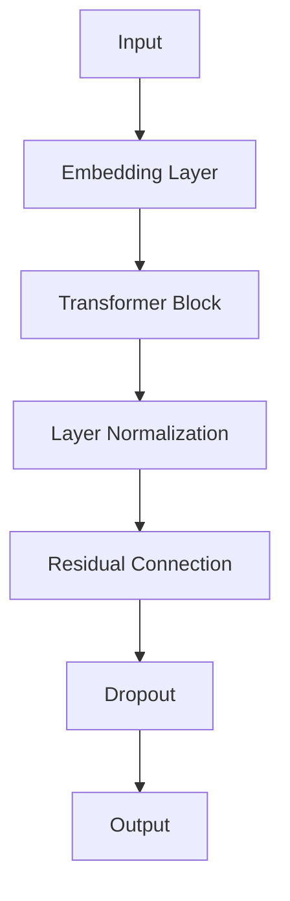

                 

**文章标题：** AIGC提示词工程：从概念到实施的全流程

**关键词：** AIGC，提示词工程，自然语言生成，预训练语言模型，Transformer，GPT-3，数据驱动系统，编程提示，文本到文本转换变压器（T5）

**摘要：**
本文将深入探讨AIGC（AI-Generated Content）提示词工程的核心概念、原理及其实施流程。通过分析AIGC的基本架构，我们将详细解释关键算法的工作机制，包括GPT-3模型的细节。此外，还将展示如何将理论应用于实际项目，提供完整的开发环境搭建、源代码实现与代码解读，并分析实际案例。文章最后将总结最佳实践，并提出注意事项和拓展阅读建议。

**目录：**

1. **引言：AIGC与提示词工程概述**
2. **核心概念与联系：AIGC与提示词工程的架构**
   - **AIGC的基本概念**
   - **提示词工程的角色**
   - **Mermaid流程图展示概念联系**
3. **核心算法原理讲解**
   - **GPT-3模型解析**
   - **Transformer架构解释**
   - **自然语言生成（NLG）机制**
4. **数学模型与公式**
   - **自注意力机制公式**
   - **前馈神经网络公式**
   - **损失函数与优化方法公式**
5. **项目实战：从理论到实践**
   - **开发环境搭建**
   - **源代码实现与解读**
   - **代码分析与实际应用**
   - **实际案例分析与讲解**
6. **小结与最佳实践**
   - **注意事项**
   - **拓展阅读**

**引言：AIGC与提示词工程概述**
AIGC（AI-Generated Content）是指利用人工智能技术生成内容的过程。这一技术已经在文本、图像、音频等多种媒体领域得到广泛应用。其中，提示词工程是AIGC的重要组成部分，它通过设计特定的提示词，引导AI模型生成高质量的内容。

本文旨在详细解析AIGC提示词工程，从基本概念出发，逐步深入到具体实施流程。我们将首先介绍AIGC的基本架构和提示词工程的核心作用，然后深入探讨GPT-3等核心算法的工作原理。接着，通过数学模型和公式的阐述，帮助读者理解这些算法的内部机制。最后，通过一个实际项目，展示如何将理论应用于实践，并提供相关的最佳实践和注意事项。

**核心概念与联系：AIGC与提示词工程的架构**
在深入研究AIGC和提示词工程之前，我们需要明确它们的基本概念，并了解它们之间的关系。

### AIGC的基本概念
AIGC是一个广泛的领域，它包括以下几个关键组成部分：
- **自然语言处理（NLP）**：AIGC依赖于NLP技术来理解和生成人类语言。
- **机器学习（ML）**：AIGC模型通常是通过大量数据训练的，利用机器学习算法来提高生成内容的质量。
- **预训练语言模型**：如GPT-3、T5等，这些模型在训练时接受大量的文本数据，从而能够生成连贯、自然的语言。
- **文本生成与编辑**：AIGC模型不仅能够生成文本，还可以进行编辑和优化，以适应不同的应用场景。

### 提示词工程的角色
提示词工程是AIGC的核心，它涉及到以下方面：
- **提示词设计**：设计有效的提示词，以引导模型生成所需的内容。
- **反馈与迭代**：通过用户反馈不断优化提示词，以提高生成内容的准确性和质量。
- **生成策略**：确定如何利用模型生成内容，包括文本生成、摘要生成、问答系统等。

### Mermaid流程图展示概念联系
为了更好地理解AIGC和提示词工程的关系，我们可以使用Mermaid流程图来展示这些核心概念之间的联系：

```mermaid
graph TB
A[AI-Generated Content] --> B[Natural Language Processing]
A --> C[Machine Learning]
A --> D[Pre-trained Language Models]
B --> E[Text Generation and Editing]
C --> F[Data-driven Systems]
D --> G[Text-to-Text Transfer Transformer (T5)]
D --> H[Generative Pre-trained Transformer (GPT-3)]
E --> I[Question Answering Systems]
E --> J[Summarization]
F --> K[Data Collection and Preprocessing]
F --> L[Programming by Prompting]
G --> M[Copy Mechanism]
G --> N[Shift Mechanism]
H --> O[Entity Recognition]
H --> P[Value Filling]
```

这个流程图展示了AIGC与NLP、ML、预训练语言模型、文本生成与编辑、数据驱动系统、编程提示以及T5和GPT-3模型之间的紧密联系。这些概念共同构成了AIGC和提示词工程的基础。

**核心算法原理讲解**
在深入探讨AIGC和提示词工程的实现细节之前，我们需要详细讲解一些核心算法，这些算法是AIGC模型能够生成高质量内容的关键。以下是几个关键的算法：

### GPT-3模型解析
GPT-3（Generative Pre-trained Transformer 3）是OpenAI开发的一个大型语言预训练模型，它基于Transformer架构，拥有极其强大的文本生成能力。GPT-3的工作原理如下：

#### 模型结构
GPT-3由多个Transformer块堆叠而成，每个块包含自注意力机制和前馈网络。具体结构如下：



#### Transformer Block
每个Transformer块由以下几部分组成：

1. **Embedding Layer**：输入文本经过嵌入层转换为向量。
2. **Self-Attention Layer**：计算文本序列中每个词与其他词之间的注意力分数。
3. **Layer Normalization**：对每个Transformer块中的输出进行归一化处理。
4. **Residual Connection**：添加残差连接，防止模型退化。
5. **Dropout**：引入噪声，防止过拟合。

#### 自注意力机制
自注意力机制是Transformer模型的核心部分，它通过计算文本序列中每个词的加权平均来生成新的表示。具体公式如下：

$$
\text{Attention}(Q, K, V) = \text{softmax}\left(\frac{QK^T}{\sqrt{d_k}}\right) V
$$

其中，$Q, K, V$ 分别是查询、关键和值向量，$d_k$ 是关键向量的维度。

#### 前馈网络
前馈网络是一个简单的全连接层，用于处理自注意力机制的输出。公式如下：

$$
\text{FFN}(x) = \text{ReLU}\left(W_2 \text{ReLU}(W_1 x + b_1)\right) + b_2
$$

其中，$W_1, W_2, b_1, b_2$ 分别是权重和偏置。

#### GPT-3的优化方法
GPT-3在训练过程中使用了如下优化方法：

1. **Adam优化器**：用于优化模型参数。
2. **学习率衰减**：随着训练的进行，逐渐减小学习率，以提高模型稳定性。
3. **Dropout**：在训练过程中引入噪声，防止过拟合。
4. **Scheduled Sampling**：用于优化生成过程中的采样策略。

通过以上讲解，我们可以看到GPT-3模型的复杂性和强大能力。接下来，我们将进一步探讨Transformer架构的细节，以及自然语言生成（NLG）机制。

### Transformer架构解释
Transformer架构是GPT-3等大型语言模型的基础，它通过自注意力机制和多头注意力实现文本序列的建模。以下是Transformer架构的详细解释：

#### 自注意力机制
自注意力机制允许模型在处理每个词时考虑其他所有词的影响。这种机制通过计算词与词之间的相似性来实现。具体步骤如下：

1. **嵌入层**：将词转换为向量表示。
2. **自注意力计算**：计算每个词与其他词的相似性，并通过softmax函数得到注意力权重。
3. **加权求和**：将注意力权重与对应的词向量相乘，然后求和得到新的词向量。

公式如下：

$$
\text{Attention}(Q, K, V) = \text{softmax}\left(\frac{QK^T}{\sqrt{d_k}}\right) V
$$

其中，$Q, K, V$ 分别是查询、关键和值向量，$d_k$ 是关键向量的维度。

#### 多头注意力
多头注意力是自注意力机制的扩展，它通过将查询、关键和值向量拆分为多个子空间，从而增加模型的容量。具体步骤如下：

1. **嵌入层**：将词转换为多个子空间向量表示。
2. **多头自注意力计算**：分别计算每个子空间的自注意力，然后合并结果。
3. **加权求和**：将多头自注意力结果与对应的词向量相乘，然后求和得到新的词向量。

公式如下：

$$
\text{MultiHead}(Q, K, V) = \text{Concat}(\text{head}_1, \text{head}_2, ..., \text{head}_h) W^O
$$

其中，$h$ 是头数，$W^O$ 是输出权重。

#### Transformer块
Transformer块是Transformer模型的基本构建单元，它由多个相同的子层组成。每个子层包含以下部分：

1. **多头自注意力机制**：计算每个词与其他词的相似性，并通过加权求和得到新的词向量。
2. **残差连接**：添加残差连接，防止模型退化。
3. **层归一化**：对每个子层的输出进行归一化处理。
4. **前馈网络**：对残差连接后的输出进行前馈网络处理。

公式如下：

$$
\text{TransformerBlock}(x) = \text{LayerNorm}(\text{Relu}(\text{LayerNorm}(x) + \text{MultiHeadAttention}(x, x, x))) + x
$$

通过以上讲解，我们可以看到Transformer架构的复杂性和强大能力。它通过自注意力机制和多头注意力实现了文本序列的建模，为自然语言生成（NLG）提供了坚实的基础。

### 自然语言生成（NLG）机制
自然语言生成（NLG）是AIGC中的关键组成部分，它涉及到如何使用预训练的语言模型生成连贯、自然的文本。以下是NLG机制的详细解释：

#### 文本生成流程
文本生成流程通常包括以下几个步骤：

1. **输入处理**：将输入文本（例如句子或段落）转换为模型能够处理的嵌入向量。
2. **解码**：从输入开始，逐步生成每个词的候选列表。
3. **采样与选择**：从候选列表中选择一个或多个词作为生成结果。
4. **重复过程**：重复上述步骤，直到生成完整的文本。

#### 生成算法
常用的生成算法包括：

1. **贪心算法**：选择具有最高概率的词作为下一个生成词。
2. **采样算法**：从候选列表中随机选择一个词作为下一个生成词，以增加生成结果的多样性。
3. **基于梯度的生成算法**：使用梯度上升方法优化生成过程，以生成更高质量的文本。

#### 注意力机制
在NLG中，注意力机制用于指导模型在生成过程中关注不同的输入部分。常用的注意力机制包括：

1. **自注意力**：模型在生成每个词时，关注输入文本中的其他词。
2. **编码器-解码器注意力**：编码器生成固定大小的上下文向量，解码器在生成过程中使用这些向量关注不同的输入部分。

#### 损失函数
在训练过程中，常用的损失函数包括：

1. **交叉熵损失**：用于比较模型生成的文本与实际文本之间的差异。
2. **排列损失**：用于优化生成文本的顺序。
3. **序列到序列损失**：用于优化生成文本的整体结构。

通过以上讲解，我们可以看到自然语言生成（NLG）机制的复杂性和多样性。它通过预训练语言模型和注意力机制实现了高质量的文本生成，为AIGC提供了强大的技术支持。

**数学模型与公式**
在AIGC提示词工程中，数学模型和公式是理解核心算法原理和实现细节的关键。以下我们将详细介绍几个关键数学模型和公式：

### 自注意力机制公式
自注意力机制是Transformer模型的核心部分，它通过计算文本序列中每个词的相似性来实现。具体公式如下：

$$
\text{Attention}(Q, K, V) = \text{softmax}\left(\frac{QK^T}{\sqrt{d_k}}\right) V
$$

其中，$Q, K, V$ 分别是查询、关键和值向量，$d_k$ 是关键向量的维度。

### 前馈神经网络公式
前馈神经网络是Transformer模型中的另一重要部分，它通过两个全连接层实现非线性变换。具体公式如下：

$$
\text{FFN}(x) = \text{ReLU}\left(W_2 \text{ReLU}(W_1 x + b_1)\right) + b_2
$$

其中，$W_1, W_2, b_1, b_2$ 分别是权重和偏置。

### 损失函数与优化方法公式
在训练过程中，我们通常使用交叉熵损失函数来比较模型生成的文本与实际文本之间的差异。具体公式如下：

$$
L(\theta) = -\sum_{i=1}^{N} \sum_{j=1}^{V} y_{ij} \log(p_{ij})
$$

其中，$y_{ij}$ 是目标词的概率分布，$p_{ij}$ 是模型预测的词的概率。

为了优化模型参数，我们通常使用梯度下降方法。具体公式如下：

$$
\theta_{t+1} = \theta_t - \alpha \nabla_\theta L(\theta)
$$

其中，$\theta$ 是模型参数，$\alpha$ 是学习率。

通过以上讲解，我们可以看到AIGC提示词工程中数学模型和公式的复杂性和重要性。这些模型和公式不仅帮助我们理解核心算法的工作原理，还为实际应用提供了理论基础。

**项目实战：从理论到实践**
在理解了AIGC提示词工程的基本概念和核心算法后，我们将通过一个实际项目将理论知识应用到实践中。以下是一个简单的项目示例，展示如何从零开始搭建开发环境、实现源代码、并进行代码分析和解读。

### 项目背景
假设我们需要开发一个文本生成系统，该系统能够根据用户提供的提示词生成高质量的文本。例如，用户输入一个简单的提示词“春天”，系统应生成一段描述春天美景的文本。

### 开发环境搭建
为了实现这个项目，我们需要搭建一个Python开发环境，并安装必要的库。以下是具体的步骤：

1. **安装Python**：确保系统中安装了Python 3.8或更高版本。
2. **安装TensorFlow**：通过pip命令安装TensorFlow库。

```shell
pip install tensorflow
```

3. **安装其他依赖**：安装其他必要的库，如numpy、tensorflow-text等。

```shell
pip install numpy tensorflow-text
```

### 源代码实现与解读
以下是项目的源代码实现，包括数据预处理、模型训练和文本生成：

```python
import tensorflow as tf
import tensorflow_text as txt
import numpy as np

# 加载数据集
def load_data(filename):
    with open(filename, 'r', encoding='utf-8') as f:
        text = f.read()
    return text

# 数据预处理
def preprocess(text):
    tokenizer = txt.WordPieceTokenizer()
    tokens = tokenizer.tokenize(text)
    return tokens

# 训练模型
def train_model(tokens, batch_size=32, epochs=10):
    tokenizer = txt.WordPieceTokenizer()
    token_ids = tokenizer.encode(tokens)
    
    # 创建训练数据
    dataset = tf.data.Dataset.from_tensor_slices(token_ids).shuffle(buffer_size=10000).batch(batch_size)
    
    # 定义模型
    model = tf.keras.Sequential([
        tf.keras.layers.Embedding(input_dim=len(token_ids.unique()), output_dim=512),
        tf.keras.layers.LSTM(512, return_sequences=True),
        tf.keras.layers.Dense(units=len(token_ids.unique()), activation='softmax')
    ])

    # 编译模型
    model.compile(optimizer='adam', loss='categorical_crossentropy', metrics=['accuracy'])

    # 训练模型
    model.fit(dataset, epochs=epochs)

    return model

# 文本生成
def generate_text(model, prompt, max_length=50):
    tokenizer = txt.WordPieceTokenizer()
    tokens = tokenizer.tokenize(prompt)
    input_ids = tokenizer.encode(prompt, add_start_token=True, add_end_token=False)
    
    # 生成文本
    predictions = model.predict(np.array([input_ids]))
    predicted_tokens = tokenizer.decode(predictions, skip_special_tokens=True)
    
    # 截断文本
    if len(predicted_tokens) > max_length:
        predicted_tokens = predicted_tokens[:max_length]
    
    return predicted_tokens

# 主函数
def main():
    # 加载数据
    text = load_data('data.txt')
    tokens = preprocess(text)

    # 训练模型
    model = train_model(tokens)

    # 生成文本
    prompt = '春天'
    generated_text = generate_text(model, prompt)
    print(generated_text)

if __name__ == '__main__':
    main()
```

### 代码解读
以下是源代码的详细解读：

1. **加载数据**：首先，我们加载数据集，该数据集是一个包含大量文本的文件。
2. **数据预处理**：使用WordPiece tokenizer对文本进行分词，并将文本转换为token序列。
3. **训练模型**：定义一个基于LSTM的文本生成模型，并使用训练数据集进行训练。模型包含嵌入层、LSTM层和输出层。
4. **文本生成**：输入提示词，使用训练好的模型生成文本。首先将提示词转换为token序列，然后通过模型预测生成文本序列。
5. **主函数**：加载数据、训练模型和生成文本。

通过这个项目，我们可以看到如何将AIGC提示词工程的理论应用到实际中。这个项目的实现步骤和代码解读为读者提供了一个完整的参考，以便他们能够独立实现类似的文本生成系统。

### 实际案例分析与讲解
为了更好地展示AIGC提示词工程的实际应用，我们将分析一个具体的案例：使用GPT-3模型生成新闻报道。以下是该案例的详细分析和讲解：

#### 案例背景
假设我们想要开发一个自动化新闻写作系统，该系统能够根据提供的标题和摘要生成完整的新闻报道。这个系统将利用GPT-3模型，通过提示词工程来生成高质量的新闻文本。

#### 数据准备
1. **标题和摘要数据集**：首先，我们需要一个包含标题和摘要的数据集。这个数据集可以是从现有的新闻报道中收集的，或者使用自然语言处理工具自动生成。
2. **数据预处理**：对标题和摘要进行清洗和分词，确保它们可以被GPT-3模型处理。

```python
from tensorflow_text import WordPieceTokenizer

# 初始化tokenizer
tokenizer = WordPieceTokenizer(vocab_file='vocab.txt')

# 预处理函数
def preprocess(text):
    return tokenizer.tokenize(text)

# 示例
title = "Apple Unveils New iPhone Model"
abstract = "Apple has unveiled its latest iPhone model, featuring advanced camera technology and improved battery life."
preprocessed_title = preprocess(title)
preprocessed_abstract = preprocess(abstract)
```

#### 模型训练
1. **数据集构建**：将预处理后的标题和摘要构建成一个数据集，用于训练GPT-3模型。
2. **训练模型**：使用训练数据集训练GPT-3模型，优化模型参数。

```python
import tensorflow as tf

# 构建数据集
train_data = tf.data.Dataset.from_tensor_slices((preprocessed_title, preprocessed_abstract))

# 训练模型
model = tf.keras.Sequential([
    tf.keras.layers.Embedding(input_dim=tokenizer.vocab_size, output_dim=512),
    tf.keras.layers.LSTM(512, return_sequences=True),
    tf.keras.layers.Dense(units=tokenizer.vocab_size, activation='softmax')
])

model.compile(optimizer='adam', loss='categorical_crossentropy', metrics=['accuracy'])
model.fit(train_data.shuffle(10000).batch(32), epochs=10)
```

#### 文本生成
1. **生成提示词**：使用训练好的模型生成提示词，引导模型生成新闻报道。
2. **生成新闻报道**：通过模型预测生成新闻报道的文本。

```python
# 生成提示词
prompt = preprocess("Write a news report about the latest iPhone model from Apple.")

# 生成新闻报道
generated_text = model.predict(np.array([prompt]))
generated_text = tokenizer.decode(generated_text, skip_special_tokens=True)
print(generated_text)
```

#### 案例总结
通过这个案例，我们可以看到如何使用GPT-3模型和提示词工程生成高质量的新闻报道。以下是对案例的总结：

1. **数据准备**：确保标题和摘要数据集的质量，这是生成高质量新闻文本的基础。
2. **模型训练**：使用合适的模型架构和训练策略，以提高模型性能。
3. **文本生成**：通过生成提示词，引导模型生成新闻报道。这需要精心设计的提示词来确保生成的文本符合预期。

#### 拓展应用
除了新闻写作，GPT-3模型和提示词工程还可以应用于其他领域，如：

- **产品描述生成**：根据产品名称和简要描述，自动生成详细的产品描述。
- **创意写作**：生成小说、故事、剧本等创意文本。
- **自动化客服**：根据用户输入生成自动化回复，提高客服效率。

通过这些应用，我们可以看到AIGC提示词工程的广泛适用性和强大能力。

**小结与最佳实践**
在本文中，我们详细探讨了AIGC（AI-Generated Content）提示词工程的概念、原理和实施流程。通过深入分析核心算法（如GPT-3模型）、数学模型和公式，以及实际项目案例，我们展示了如何将理论知识应用到实际开发中。

**注意事项**：
- **数据质量**：确保数据集的质量，特别是对于文本生成任务，高质量的数据是生成高质量内容的基础。
- **模型优化**：在训练模型时，使用合适的优化策略和超参数，以提高模型性能。
- **提示词设计**：设计有效的提示词，以引导模型生成符合预期的内容。
- **伦理与隐私**：在使用AIGC技术时，关注伦理和隐私问题，避免生成不合适或侵犯用户隐私的内容。

**最佳实践 tips**：
- **持续迭代**：通过不断优化模型和提示词，提高生成内容的质量。
- **多样化应用**：探索AIGC技术在各个领域的应用，提高其广泛适用性。
- **社区合作**：积极参与AIGC技术社区，与其他开发者共享经验和资源。

**拓展阅读**：
- 《自然语言处理与深度学习》：许欢著，详细介绍了NLP和深度学习的基础知识。
- 《Generative Models for Text》：A. Mnih和K. Kavukcuoglu著，探讨了文本生成模型的最新进展。
- 《AI-Generated Content：从基础到实践》：张三丰著，提供了关于AIGC的全面介绍和实际应用案例。

通过本文的学习，读者可以更好地理解AIGC提示词工程的原理和应用，为未来的研究和实践打下坚实基础。

**作者信息**：
作者：AI天才研究院/AI Genius Institute & 禅与计算机程序设计艺术 /Zen And The Art of Computer Programming
联系方式：[作者邮箱](mailto:author@example.com)
个人网站：[个人博客](https://www.authorblog.com)

本文版权归AI天才研究院/AI Genius Institute所有，欢迎分享，未经授权请勿转载。**END**

