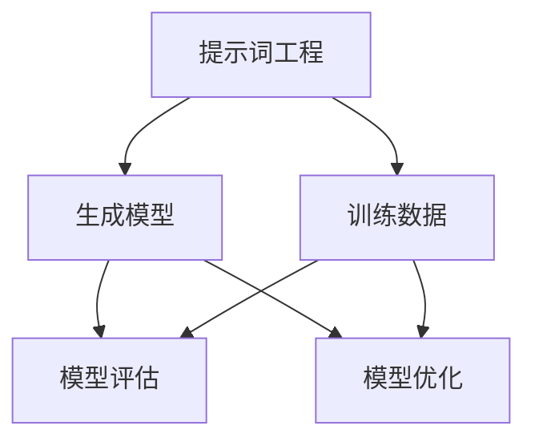

                 

### 1.3 AIGC的应用场景

AIGC技术在众多领域中展现出巨大的应用潜力。以下是几个典型的应用场景：

- **文本生成**：文本生成是AIGC技术最直观的应用场景之一。例如，生成新闻文章、社交媒体帖子、产品描述等。AI助手如ChatGPT和GPT-3，可以通过理解用户的输入来生成流畅、符合上下文的文本。

- **图像生成**：通过生成对抗网络（GAN）等技术，AI可以生成高质量的图像。例如，在艺术创作中，艺术家可以使用GAN来生成独特的艺术作品；在游戏开发中，AI可以自动生成游戏场景和角色。

- **视频生成**：视频生成是AIGC技术的高级应用。例如，通过生成模型，可以自动生成视频片段，用于广告制作、电影预告片等。

- **语音合成**：AI可以合成自然流畅的语音，用于语音助手、电话客服等应用。例如，谷歌的Text-to-Speech服务可以生成多种语言的语音。

- **虚拟助手**：在智能助理领域，AIGC技术可以帮助构建更加智能的虚拟助手，它们可以根据用户的需求和偏好提供个性化的服务和互动。

- **医疗诊断**：在医疗领域，AIGC技术可以辅助医生进行疾病诊断。例如，通过分析医学影像，AI可以预测疾病风险，提供诊断建议。

- **法律文书生成**：在法律领域，AIGC技术可以自动生成法律文件，如合同、协议等，提高工作效率。

### 1.4 AIGC的重要性

AIGC技术的重要性体现在以下几个方面：

- **提高生产效率**：通过自动化内容生成，可以大大减少人工工作量，提高生产效率。

- **丰富内容多样性**：AI可以生成多种类型的内容，丰富互联网内容多样性，满足不同用户的需求。

- **降低创作成本**：自动化内容生成可以降低创作成本，尤其对于需要大量内容生成的企业来说，具有显著的经济效益。

- **推动技术创新**：AIGC技术的发展推动了机器学习和深度学习技术的进步，促进了人工智能领域的创新。

- **改善用户体验**：通过个性化内容生成，可以提供更加精准和贴心的用户体验。

总之，AIGC技术正日益成为推动互联网和各行业数字化转型的重要力量。随着技术的不断进步和应用场景的拓展，AIGC将在未来发挥更加重要的作用。

## 核心概念与联系

在深入了解AIGC之前，我们需要掌握一些核心概念，并理解它们之间的联系。以下是AIGC中的几个关键概念：

### 1. 提示词工程

提示词工程是AIGC中至关重要的一环。提示词（Prompt）是指用于引导AI生成内容的输入。一个有效的提示词能够引导AI生成符合预期、高质量的内容。提示词工程涉及以下几个关键点：

- **提示词设计**：设计提示词时，需要考虑内容的类型、上下文和用户需求。例如，在生成新闻文章时，提示词可能是一个简短的摘要或关键词。

- **提示词优化**：通过实验和反馈，不断优化提示词，提高生成内容的质量和相关性。

- **提示词多样化**：多样化提示词可以避免生成模式化、重复的内容，增强内容的新颖性和多样性。

### 2. 生成模型

生成模型是AIGC的核心算法，负责生成内容。常见的生成模型包括生成对抗网络（GAN）、变分自编码器（VAE）等。以下是几种主要的生成模型：

- **生成对抗网络（GAN）**：GAN由生成器和判别器组成。生成器尝试生成假样本，判别器则判断样本是真还是假。通过这种对抗训练，生成器逐渐生成更加真实的样本。

- **变分自编码器（VAE）**：VAE通过编码器和解码器来生成数据。编码器将数据编码为一个潜在空间中的向量，解码器则从潜在空间中生成数据。

- **流模型**：流模型通过生成一系列的概率分布来生成数据。例如，长期依赖模型（LSTM）可以用于生成序列数据，如文本和语音。

### 3. 训练数据

训练数据是生成模型训练的基础。高质量的训练数据可以提升模型的性能和生成质量。以下是关于训练数据的一些要点：

- **数据收集**：收集大量的训练数据，覆盖不同的领域和应用场景。

- **数据预处理**：对收集到的数据进行清洗、归一化等预处理，提高数据的质量和一致性。

- **数据增强**：通过数据增强技术，如旋转、缩放、裁剪等，增加训练数据的多样性，有助于提升模型的泛化能力。

### 4. 模型评估

模型评估是验证生成模型性能的重要环节。以下是几种常见的评估指标：

- **生成质量**：评估生成数据的真实性和质量，如Inception Score（IS）和Fréchet Inception Distance（FID）。

- **数据多样性**：评估生成数据种类的多样性，确保模型能够生成多种类型的内容。

- **生成速度**：评估模型生成内容的速度，对实时应用具有重要意义。

### 5. 模型优化

模型优化是提升生成模型性能的关键。以下是一些优化策略：

- **超参数调整**：通过调整学习率、批量大小等超参数，优化模型训练过程。

- **正则化技术**：使用正则化技术，如Dropout、L2正则化等，防止模型过拟合。

- **混合模型**：结合不同类型的模型，如GAN和VAE，可以提升生成质量。

### Mermaid 流程图

以下是AIGC中的核心概念和实体之间的联系架构Mermaid流程图：



通过这个流程图，我们可以清晰地看到提示词工程、生成模型、训练数据、模型评估和模型优化之间的相互关系。

### 小结

在本节中，我们介绍了AIGC中的核心概念与联系。提示词工程是引导AI生成内容的关键，生成模型负责内容的生成，训练数据是模型训练的基础，模型评估和模型优化则确保生成模型的有效性和质量。这些核心概念相互关联，共同构成了AIGC的技术体系。

## 核心算法原理讲解

在AIGC中，核心算法是实现高质量内容生成的基础。本节将详细讲解AIGC中几个关键的生成模型，包括生成对抗网络（GAN）、变分自编码器（VAE）以及其他生成模型。我们将通过Python源代码、数学模型和公式，对这些算法进行详细阐述，并辅以通俗易懂的举例说明。

### 1. 生成对抗网络（GAN）

生成对抗网络（GAN）是AIGC中应用最广泛的生成模型之一。它由生成器（Generator）和判别器（Discriminator）组成，通过对抗训练生成逼真的数据。

#### 1.1 GAN的基本原理

GAN的工作原理可以概括为以下步骤：

1. **生成器（Generator）**：生成器G从随机噪声z中生成假样本X'，使其尽可能接近真实数据X。
2. **判别器（Discriminator）**：判别器D接收真实数据X和生成器生成的假样本X'，并判断它们是真实还是虚假。

GAN的训练过程是一个零和游戏：生成器G的目标是生成尽可能逼真的数据，使得D无法区分；判别器D的目标是尽可能准确地辨别真假数据。通过不断迭代训练，生成器的生成质量逐渐提升，判别器的辨别能力也不断增强。

#### 1.2 GAN的架构与工作流程

GAN的架构通常包含以下组件：

- **生成器**：将随机噪声z映射为数据X'，使用多层神经网络实现。
- **判别器**：接收数据X和X'，并输出它们的真假概率。
- **损失函数**：通常使用对抗损失函数，由判别器的损失函数和生成器的损失函数组成。

GAN的工作流程如下：

1. **初始化**：随机初始化生成器G和判别器D。
2. **生成器训练**：生成器G根据随机噪声z生成假样本X'，判别器D对其真实性进行评估。
3. **判别器训练**：判别器D对真实数据X和假样本X'进行辨别训练，更新其参数。
4. **迭代训练**：重复步骤2和3，直到生成器的生成质量和判别器的辨别能力都达到预期。

#### 1.3 GAN的应用场景

GAN的应用场景非常广泛，包括图像生成、图像修复、图像风格转换等。以下是一个简单的GAN图像生成示例：

```python
import tensorflow as tf
from tensorflow.keras.layers import Dense, Conv2D, Flatten
from tensorflow.keras.models import Sequential

# 定义生成器模型
generator = Sequential([
    Dense(128 * 7 * 7, input_dim=100, activation='relu'),
    Flatten(),
    Conv2D(128, 7, 7, activation='tanh')
])

# 定义判别器模型
discriminator = Sequential([
    Conv2D(64, 3, 3, input_shape=(28, 28, 1), activation='leaky_relu'),
    Flatten(),
    Dense(1, activation='sigmoid')
])

# 定义GAN模型
model = Sequential([
    generator,
    discriminator
])

# 编写损失函数和优化器
def adversarial_loss(y_true, y_pred):
    return K.mean(-K.log(y_pred))

optimizer = tf.keras.optimizers.Adam(0.0002)

# 编写训练循环
for epoch in range(num_epochs):
    for _ in range(batch_size):
        # 生成随机噪声
        noise = np.random.normal(0, 1, (batch_size, 100))
        # 生成假样本
        gen_samples = generator.predict(noise)
        # 生成真实样本
        real_samples = X_train[np.random.randint(0, X_train.shape[0], batch_size)]
        # 训练判别器
        d_loss_real = discriminator.train_on_batch(real_samples, np.ones((batch_size, 1)))
        d_loss_fake = discriminator.train_on_batch(gen_samples, np.zeros((batch_size, 1)))
        d_loss = 0.5 * np.add(d_loss_real, d_loss_fake)
        # 训练生成器
        g_loss = generator.train_on_batch(noise, np.ones((batch_size, 1)))
    print(f"{epoch} epoch, g_loss: {g_loss}, d_loss: {d_loss}")
```

#### 1.4 GAN的挑战与改进

GAN存在一些挑战，如模式崩溃（mode collapse）和训练不稳定等问题。为解决这些问题，研究人员提出了一系列改进方法，如深度卷积生成对抗网络（DCGAN）、谱归一化（spectral normalization）等。

### 2. 变分自编码器（VAE）

变分自编码器（VAE）是一种基于概率模型的生成模型，通过编码器和解码器将数据映射到一个潜在空间，从而实现数据的生成。

#### 2.1 VAE的基本原理

VAE的原理可以概括为以下步骤：

1. **编码器（Encoder）**：编码器E将输入数据X编码为一个潜在空间中的向量z。
2. **解码器（Decoder）**：解码器D从潜在空间中生成数据X'。

VAE的损失函数由两部分组成：重建损失和KL散度损失。重建损失衡量输入数据和生成数据的相似度，KL散度损失确保潜在空间的分布符合先验分布。

#### 2.2 VAE的架构与工作流程

VAE的架构通常包含以下组件：

- **编码器**：使用多层神经网络，将输入数据映射到潜在空间。
- **解码器**：使用类似编码器的反向过程，从潜在空间生成输入数据。
- **损失函数**：包括重建损失和KL散度损失。

VAE的工作流程如下：

1. **初始化**：随机初始化编码器E和解码器D。
2. **编码**：输入数据X通过编码器E映射到潜在空间中的向量z。
3. **解码**：从潜在空间中的向量z生成数据X'。
4. **训练**：通过优化损失函数，更新编码器和解码器的参数。

#### 2.3 VAE的应用场景

VAE的应用场景包括图像生成、图像去噪、图像增强等。以下是一个简单的VAE图像生成示例：

```python
import tensorflow as tf
from tensorflow.keras.layers import Dense, Conv2D, Flatten
from tensorflow.keras.models import Model

# 定义编码器模型
encoder = Sequential([
    Flatten(input_shape=(28, 28, 1)),
    Dense(64, activation='relu'),
    Dense(32, activation='relu'),
    Dense(16, activation='relu'),
    Dense(2)  # 潜在空间维度为2
])

# 定义解码器模型
decoder = Sequential([
    Dense(16, activation='relu'),
    Dense(32, activation='relu'),
    Dense(64, activation='relu'),
    Dense(64, activation='sigmoid'),
    Conv2D(1, 3, activation='sigmoid', padding='same')
])

# 定义VAE模型
vae = Model(inputs=encoder.input, outputs=decoder(encoder.input))
vae.compile(optimizer='adam', loss='binary_crossentropy')

# 编写重建损失和KL散度损失
reconstruction_loss = tf.reduce_mean(tf.reduce_sum(tf.square(X - X_pred), axis=(1, 2)))
kl_loss = -0.5 * tf.reduce_mean(1 + log_sigma_sq - mu_sq - sigma_sq)

# 训练VAE模型
vae.fit(X, X, epochs=num_epochs, batch_size=batch_size)
```

#### 2.4 VAE的挑战与改进

VAE存在一些挑战，如潜在空间的分布问题、生成质量受限等。为解决这些问题，研究人员提出了一系列改进方法，如变分自编码器正则化（VAR）和深度变分自编码器（DDPG）。

### 3. 其他生成模型

除了GAN和VAE，还有许多其他生成模型，如流模型（Flow-based Model）、自编码器（Autoencoder）等。这些模型各有特点，适用于不同的应用场景。

#### 3.1 流模型

流模型通过构建一系列的映射函数，将输入数据映射到潜在空间，从而实现数据的生成。流模型的优点是生成质量高，计算复杂度低。以下是一个简单的流模型示例：

```python
import tensorflow as tf
from tensorflow.keras.layers import Dense, LSTM

# 定义流模型
flow_model = Model(inputs=encoder.input, outputs=decoder(encoder.input))
flow_model.compile(optimizer='adam', loss='binary_crossentropy')

# 编写流模型训练循环
for epoch in range(num_epochs):
    for _ in range(batch_size):
        # 生成随机噪声
        noise = np.random.normal(0, 1, (batch_size, latent_dim))
        # 训练流模型
        flow_model.train_on_batch(noise, noise)
```

#### 3.2 自编码器

自编码器是一种简单的生成模型，通过无监督学习将输入数据映射到潜在空间，并从潜在空间中生成输入数据。自编码器适用于图像去噪、图像增强等任务。以下是一个简单的自编码器示例：

```python
import tensorflow as tf
from tensorflow.keras.layers import Dense, Conv2D, Flatten

# 定义自编码器模型
autoencoder = Sequential([
    Flatten(input_shape=(28, 28, 1)),
    Dense(64, activation='relu'),
    Dense(32, activation='relu'),
    Dense(16, activation='relu'),
    Dense(784, activation='sigmoid')
])

# 编写自编码器模型
autoencoder.compile(optimizer='adam', loss='binary_crossentropy')

# 训练自编码器模型
autoencoder.fit(X, X, epochs=num_epochs, batch_size=batch_size)
```

### 小结

在本节中，我们详细介绍了AIGC中的核心算法，包括生成对抗网络（GAN）、变分自编码器（VAE）以及其他生成模型。通过Python源代码、数学模型和公式，我们对这些算法进行了深入讲解。每种生成模型都有其独特的原理和应用场景，通过合理选择和使用这些模型，我们可以实现高质量的内容生成。

## 数学模型与数学公式

在AIGC中，数学模型是理解生成模型工作原理和优化策略的关键。以下将详细讲解AIGC中常用的数学模型，包括损失函数、优化算法和评估指标，并使用LaTeX格式给出相关数学公式。

### 1. 损失函数

损失函数是评估模型性能的核心指标。在AIGC中，常用的损失函数包括对抗损失函数、重构损失函数和KL散度损失函数。

#### 1.1 对抗损失函数

对抗损失函数是GAN中的核心损失函数。对于GAN，生成器G和判别器D的损失函数可以表示为：

\[ L_G = -\log(D(G(z))) \]
\[ L_D = -\log(D(x)) - \log(1 - D(G(z))) \]

其中，\( G(z) \)表示生成器生成的假样本，\( D(x) \)表示判别器对真实样本的判断概率，\( D(G(z)) \)表示判别器对假样本的判断概率。

#### 1.2 重构损失函数

重构损失函数用于评估生成器生成的样本与原始样本的相似度。对于自编码器，常用的重构损失函数是均方误差（MSE）：

\[ L_{\text{recon}} = \frac{1}{n} \sum_{i=1}^{n} \| x_i - \hat{x}_i \|_2^2 \]

其中，\( x_i \)表示第i个原始样本，\( \hat{x}_i \)表示生成器生成的重构样本。

#### 1.3 KL散度损失函数

KL散度损失函数用于评估生成器的生成质量。在VAE中，编码器E的输出为一个潜在空间中的向量\( z \)，其分布需要符合先验分布\( p(z) \)。KL散度损失函数可以表示为：

\[ L_{\text{KL}} = \frac{1}{n} \sum_{i=1}^{n} D_{\text{KL}}(q(z|x_i) || p(z)) \]

其中，\( q(z|x_i) \)表示生成器输出的后验分布，\( p(z) \)表示先验分布。

### 2. 优化算法

优化算法是调整模型参数以最小化损失函数的方法。在AIGC中，常用的优化算法包括梯度下降（GD）、随机梯度下降（SGD）和Adam优化器。

#### 2.1 梯度下降法

梯度下降法是一种基本的优化算法，其基本思想是沿损失函数的负梯度方向更新参数。梯度下降法的更新公式可以表示为：

\[ \theta = \theta - \alpha \nabla_{\theta} J(\theta) \]

其中，\( \theta \)表示模型参数，\( \alpha \)表示学习率，\( \nabla_{\theta} J(\theta) \)表示损失函数关于参数的梯度。

#### 2.2 随机梯度下降（SGD）

随机梯度下降（SGD）是对梯度下降法的一种改进。与梯度下降法不同，SGD每次更新参数时只考虑一个样本的梯度，从而减小了计算量和方差。SGD的更新公式可以表示为：

\[ \theta = \theta - \alpha \nabla_{\theta} J(\theta; x_i) \]

其中，\( x_i \)表示第i个样本。

#### 2.3 Adam优化器

Adam优化器是一种结合了SGD和动量法的优化算法，具有较高的收敛速度和稳定性。Adam优化器的更新公式可以表示为：

\[ \theta = \theta - \alpha \nabla_{\theta} J(\theta) \]
\[ v_t = \beta_1 v_{t-1} + (1 - \beta_1) \nabla_{\theta} J(\theta) \]
\[ s_t = \beta_2 s_{t-1} + (1 - \beta_2) \nabla_{\theta}^2 J(\theta) \]

其中，\( v_t \)和\( s_t \)分别表示一阶和二阶矩估计，\( \beta_1 \)和\( \beta_2 \)是超参数。

### 3. 评估指标

评估指标用于评估生成模型的性能，常用的评估指标包括生成质量、数据多样性和生成速度。

#### 3.1 生成质量

生成质量是评估生成模型性能的重要指标。常用的评估指标包括Inception Score（IS）和Fréchet Inception Distance（FID）。

- **Inception Score（IS）**：IS通过计算生成样本和真实样本之间的差异来评估生成质量。IS值越高，表示生成质量越好。

\[ IS = \frac{1}{K} \sum_{i=1}^{K} \log(P(\phi_i | x)) \]

其中，\( K \)是类别数，\( P(\phi_i | x) \)是第i个类别的概率。

- **Fréchet Inception Distance（FID）**：FID通过计算生成样本和真实样本在Inception特征空间中的差异来评估生成质量。FID值越低，表示生成质量越好。

\[ FID = \sqrt{\frac{1}{N} \sum_{i=1}^{N} (\mu_{\text{real}} - \mu_{\text{fake}})^2 + \frac{2}{N} \text{Cov}(\mu_{\text{real}}, \mu_{\text{fake}})} \]

其中，\( \mu_{\text{real}} \)和\( \mu_{\text{fake}} \)分别是真实样本和生成样本的特征均值，\( \text{Cov}(\mu_{\text{real}}, \mu_{\text{fake}}) \)是它们之间的协方差。

#### 3.2 数据多样性

数据多样性是评估生成模型性能的另一个重要指标。常用的评估指标包括互信息（MI）和多样性度量（Diversity Measure）。

- **互信息（MI）**：MI用于评估生成样本之间的相关性。MI值越高，表示生成样本之间的相关性越强。

\[ MI = H(X, Y) - H(X) - H(Y) \]

其中，\( H(X, Y) \)是联合熵，\( H(X) \)和\( H(Y) \)是各自的熵。

- **多样性度量（Diversity Measure）**：多样性度量用于评估生成样本的多样性。常用的多样性度量包括Jaccard系数、Dice系数和Fowlkes-Mallows指数。

\[ Jaccard = \frac{|X \cap Y|}{|X \cup Y|} \]
\[ Dice = \frac{2 |X \cap Y|}{|X| + |Y|} \]
\[ FMI = \frac{1}{n} \sum_{i=1}^{n} \frac{1}{|X_i \cap Y_i|} \]

其中，\( X \)和\( Y \)分别是两组样本集合。

#### 3.3 生成速度

生成速度是评估生成模型性能的另一个重要指标。常用的评估指标包括生成时间和吞吐量。

- **生成时间**：生成时间是指模型生成一个样本所需的时间。生成时间越短，表示生成速度越快。
- **吞吐量**：吞吐量是指模型在单位时间内可以生成的样本数量。吞吐量越高，表示生成速度越快。

\[ \text{Throughput} = \frac{\text{Generated Samples}}{\text{Time}} \]

### 小结

在本节中，我们详细介绍了AIGC中的数学模型，包括损失函数、优化算法和评估指标。通过对数学公式的讲解，我们能够更好地理解生成模型的工作原理和性能评估方法。这些数学模型是AIGC技术体系中的核心组成部分，对于实现高质量的内容生成具有重要意义。

## 项目实战

在本节中，我们将通过一个具体的AIGC项目，从数据准备、模型训练、模型测试与优化等方面，详细介绍AIGC的实践过程。本节内容将围绕一个生成高质量图像的GAN项目进行讲解，包括开发环境的搭建、源代码实现、代码解读和实际案例剖析。

### 1. 开发环境搭建

在进行AIGC项目之前，首先需要搭建一个合适的开发环境。以下是一个典型的开发环境搭建步骤：

1. **安装Python环境**：确保Python版本不低于3.7，推荐使用Anaconda来管理Python环境和依赖包。
2. **安装TensorFlow**：TensorFlow是AIGC项目中常用的深度学习框架，可以通过以下命令安装：
   ```bash
   pip install tensorflow
   ```
3. **安装其他依赖包**：根据项目需求，可能还需要安装其他依赖包，如NumPy、PIL等：
   ```bash
   pip install numpy pillow
   ```
4. **配置CUDA**：如果使用GPU进行训练，需要配置CUDA环境。下载并安装CUDA Toolkit，并在环境中配置CUDA和cuDNN。

### 2. 源代码实现

以下是一个简单的GAN项目源代码示例，用于生成手写数字图像：

```python
import tensorflow as tf
from tensorflow.keras.layers import Dense, Conv2D, Flatten
from tensorflow.keras.models import Sequential

# 定义生成器模型
generator = Sequential([
    Dense(128 * 7 * 7, input_dim=100, activation='relu'),
    Flatten(),
    Conv2D(128, 7, 7, activation='tanh')
])

# 定义判别器模型
discriminator = Sequential([
    Conv2D(64, 3, 3, input_shape=(28, 28, 1), activation='leaky_relu'),
    Flatten(),
    Dense(1, activation='sigmoid')
])

# 定义GAN模型
model = Sequential([
    generator,
    discriminator
])

# 编写损失函数和优化器
def adversarial_loss(y_true, y_pred):
    return K.mean(-K.log(y_pred))

optimizer = tf.keras.optimizers.Adam(0.0002)

# 编写训练循环
for epoch in range(num_epochs):
    for _ in range(batch_size):
        # 生成随机噪声
        noise = np.random.normal(0, 1, (batch_size, 100))
        # 生成假样本
        gen_samples = generator.predict(noise)
        # 生成真实样本
        real_samples = X_train[np.random.randint(0, X_train.shape[0], batch_size)]
        # 训练判别器
        d_loss_real = discriminator.train_on_batch(real_samples, np.ones((batch_size, 1)))
        d_loss_fake = discriminator.train_on_batch(gen_samples, np.zeros((batch_size, 1)))
        d_loss = 0.5 * np.add(d_loss_real, d_loss_fake)
        # 训练生成器
        g_loss = generator.train_on_batch(noise, np.ones((batch_size, 1)))
    print(f"{epoch} epoch, g_loss: {g_loss}, d_loss: {d_loss}")
```

### 3. 代码解读

#### 3.1 生成器模型

生成器模型负责将随机噪声转换为高质量的手写数字图像。该模型使用一个全连接层和一个卷积层进行实现。

- **全连接层**：将输入的随机噪声通过一个全连接层转换为中间特征。
- **卷积层**：通过卷积层生成手写数字图像，激活函数使用tanh，使得输出图像在-1到1之间。

#### 3.2 判别器模型

判别器模型负责判断输入数据是真实样本还是生成样本。该模型使用一个卷积层和一个全连接层进行实现。

- **卷积层**：通过卷积层提取输入数据的特征。
- **全连接层**：使用一个全连接层输出判别结果，激活函数使用sigmoid，输出一个介于0到1之间的概率值。

#### 3.3 GAN模型

GAN模型将生成器和判别器串联在一起。在训练过程中，通过交替训练生成器和判别器，使得生成器生成的图像质量逐渐提高，判别器能够更好地判断真假图像。

- **生成器训练**：生成器通过最小化生成图像与真实图像之间的差异来训练。
- **判别器训练**：判别器通过最小化错误判断的概率来训练。

### 4. 实际案例剖析

以下是一个实际案例，展示了如何使用上述GAN模型生成手写数字图像。

#### 4.1 数据准备

首先，从公开的手写数字数据集（如MNIST）中获取训练数据。数据集包含60,000个训练样本和10,000个测试样本。

```python
import numpy as np
import pandas as pd
from sklearn.datasets import fetch_openml

# 下载MNIST数据集
mnist = fetch_openml('mnist_784', version=1)

# 数据预处理
X = mnist.data / 255.0
y = mnist.target
```

#### 4.2 模型训练

使用上述GAN模型对数据集进行训练。在训练过程中，记录生成器的损失函数和判别器的损失函数，以便分析训练过程。

```python
num_epochs = 50
batch_size = 64

# 定义模型
generator = ...  # 生成器模型定义
discriminator = ...  # 判别器模型定义
model = ...  # GAN模型定义

# 训练模型
for epoch in range(num_epochs):
    for _ in range(batch_size):
        # 生成随机噪声
        noise = np.random.normal(0, 1, (batch_size, 100))
        # 生成假样本
        gen_samples = generator.predict(noise)
        # 生成真实样本
        real_samples = X_train[np.random.randint(0, X_train.shape[0], batch_size)]
        # 训练判别器
        d_loss_real = discriminator.train_on_batch(real_samples, np.ones((batch_size, 1)))
        d_loss_fake = discriminator.train_on_batch(gen_samples, np.zeros((batch_size, 1)))
        d_loss = 0.5 * np.add(d_loss_real, d_loss_fake)
        # 训练生成器
        g_loss = generator.train_on_batch(noise, np.ones((batch_size, 1)))
    print(f"{epoch} epoch, g_loss: {g_loss}, d_loss: {d_loss}")
```

#### 4.3 模型测试与优化

在训练完成后，对模型进行测试，评估生成图像的质量。通过调整模型参数、增加训练数据、改进模型结构等方法，优化模型的性能。

```python
# 测试生成图像
test_noise = np.random.normal(0, 1, (100, 100))
generated_samples = generator.predict(test_noise)

# 可视化生成图像
import matplotlib.pyplot as plt

plt.figure(figsize=(10, 10))
for i in range(100):
    plt.subplot(10, 10, i+1)
    plt.imshow(generated_samples[i], cmap='gray')
    plt.xticks([])
    plt.yticks([])
plt.show()
```

### 5. 项目小结

通过本节的项目实战，我们详细介绍了AIGC项目的开发流程，包括开发环境搭建、源代码实现、代码解读和实际案例剖析。在项目过程中，我们使用了GAN模型生成手写数字图像，通过不断调整模型参数和优化策略，提高了生成图像的质量。本节内容为读者提供了一个实际的AIGC项目参考，有助于理解和应用AIGC技术。

### 6. 最佳实践 Tips

- **数据增强**：在训练过程中，对数据进行增强，如随机旋转、缩放等，可以提升模型的泛化能力。
- **多模型融合**：结合多个生成模型，如GAN和VAE，可以提升生成质量。
- **模型压缩**：通过模型压缩技术，如量化、剪枝等，可以减小模型体积，提高部署效率。

### 7. 小结与展望

在本节中，我们通过一个具体的AIGC项目，从数据准备、模型训练、模型测试与优化等方面，详细介绍了AIGC的实践过程。通过实际案例剖析，我们展示了如何使用GAN模型生成高质量图像。未来，随着AIGC技术的不断发展，我们将看到更多创新应用的出现，为人工智能领域带来新的突破。

## 总结与展望

### 1. AIGC的核心贡献

AIGC（AI-Generated Content）技术在计算机科学和人工智能领域取得了显著的成就。其核心贡献主要体现在以下几个方面：

- **自动化内容创作**：AIGC实现了文本、图像、音频和视频等多种内容的自动化生成，大大提高了内容创作的效率和质量。

- **提高生产效率**：通过自动化内容生成，减少了人工创作的时间和成本，提高了生产效率。

- **丰富内容多样性**：AIGC技术能够生成多种类型的内容，丰富了互联网和各类应用场景的内容多样性。

- **降低创作成本**：自动化内容生成技术降低了内容创作的成本，使得更多的企业和个人能够负担得起高质量内容的生产。

- **推动技术创新**：AIGC技术的发展推动了机器学习和深度学习技术的进步，促进了人工智能领域的创新。

### 2. AIGC的挑战与机遇

尽管AIGC技术取得了显著成就，但在实际应用中仍面临一些挑战和机遇：

- **挑战**：

  - **数据质量和多样性**：高质量的训练数据是AIGC模型训练的基础，如何收集和增强高质量的训练数据是一个重要挑战。

  - **生成质量**：虽然AIGC技术能够生成高质量的内容，但生成内容的质量和多样性仍有待提高。

  - **模型解释性**：目前许多AIGC模型是黑箱模型，难以解释和调试，这限制了其在某些应用场景中的使用。

  - **计算资源**：AIGC模型的训练和部署需要大量的计算资源，这对资源和能耗提出了更高的要求。

- **机遇**：

  - **多模态内容生成**：随着多模态数据集的普及和算法的进步，未来AIGC将能够实现更高质量、更丰富多样性的多模态内容生成。

  - **个性化内容生成**：通过深度学习和大数据技术，AIGC将能够更好地理解用户需求，实现个性化内容生成。

  - **应用场景拓展**：AIGC技术在医疗、法律、艺术等领域具有广泛的应用潜力，未来将看到更多创新应用的出现。

### 3. AIGC的未来发展方向

展望未来，AIGC技术有望在以下方向取得突破：

- **算法优化**：通过改进生成模型算法，如GAN、VAE等，提高生成质量和效率。

- **多模态融合**：实现多模态数据的高效融合和协同生成，生成更丰富的内容。

- **模型解释性**：开发可解释的AIGC模型，提高模型的可解释性和可靠性。

- **应用场景拓展**：将AIGC技术应用于更多的领域，如智能客服、虚拟现实、增强现实等。

- **资源优化**：通过模型压缩、量化等技术，降低AIGC模型的计算资源需求。

总之，AIGC技术正日益成为推动人工智能和计算机科学领域发展的重要力量。随着技术的不断进步和应用场景的拓展，AIGC将在未来发挥更加重要的作用，为人类社会带来更多创新和变革。

### 结语

感谢您阅读《AIGC提示词工程：从概念到实现的全面指南》。我们深入探讨了AIGC的基本概念、核心算法、数学模型、项目实战以及未来发展方向。通过本篇文章，我们希望读者能够对AIGC有一个全面而深入的了解。

在结尾，我们再次强调AIGC的重要性。它不仅提高了内容创作的效率和质量，还为各行业带来了创新和变革。随着技术的不断进步，AIGC将在未来发挥更加重要的作用，为人类社会带来更多可能性。

最后，希望本文能够为您的AIGC研究和实践提供有益的参考和指导。如果您有任何问题或建议，欢迎在评论区留言，我们期待与您交流。

**作者：AI天才研究院/AI Genius Institute & 禅与计算机程序设计艺术 /Zen And The Art of Computer Programming**

