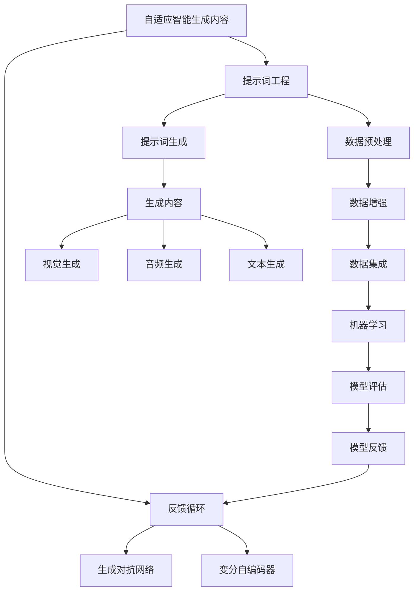

                 

### 文章标题

# AIGC提示词工程：从理论到实践的全面指南

### 关键词
- AIGC
- 提示词工程
- 生成对抗网络
- 变分自编码器
- 模型训练
- 生成内容

### 摘要
本文将深入探讨自适应智能生成内容（AIGC）的提示词工程，从理论到实践提供全面的指南。我们将解释AIGC的概念，详细分析其核心组成部分，包括提示词工程、模型训练和生成内容。通过Python源代码和数学公式，我们将阐述生成对抗网络（GAN）和变分自编码器（VAE）的基本原理。此外，我们将展示一个AIGC项目实战案例，包括数据收集、预处理、模型训练和评估，并提供最佳实践和小结。

---

## 引言

随着人工智能（AI）技术的快速发展，自适应智能生成内容（AIGC）成为了一个引人注目的领域。AIGC是一种利用机器学习和深度学习技术，自动生成高质量内容的方法。它涵盖了文本、图像、音频等多种生成形式，具有广泛的应用前景，包括内容创作、数据增强、个性化推荐等。

提示词工程是AIGC的关键组成部分，它决定了生成内容的多样性和准确性。本文将系统地介绍AIGC提示词工程的理论和实践，帮助读者深入了解该领域的核心概念和技术实现。

## 核心概念与联系

### AIGC概念解析

AIGC是一种基于AI的内容生成技术，它通过训练大规模的模型，如生成对抗网络（GAN）和变分自编码器（VAE），来自动生成高质量的内容。AIGC的核心概念包括：

1. **模型训练**：使用大量数据训练生成模型，使其能够生成与真实数据相似的内容。
2. **提示词工程**：为生成模型提供提示，以指导模型生成特定类型的内容。
3. **生成内容**：通过训练好的模型生成新的内容，可以是文本、图像、音频等。

### Mermaid流程图

为了更好地理解AIGC系统的整体架构和各个环节之间的逻辑关系，我们使用Mermaid流程图来展示：



### 核心概念与联系

在AIGC中，核心概念之间的关系可以概括如下：

1. **模型训练（MT）**：模型训练是AIGC的基础，它包括GAN和VAE等生成模型的学习和优化。训练过程中，模型会学习如何生成与真实数据相似的内容。
2. **提示词工程（PW）**：提示词工程为模型提供指导，帮助模型生成特定类型的内容。提示词可以是文本、图像、音频等，它们作为输入，影响模型的生成结果。
3. **数据预处理（DS）**：数据预处理包括数据增强、数据集成等步骤，旨在提高模型训练的效果。数据预处理是提示词工程的一部分，也是模型训练的必要条件。
4. **生成内容（GC）**：生成内容是AIGC的最终目标，它包括视觉生成、音频生成和文本生成等多种形式。生成内容的质量直接影响到AIGC的应用效果。

通过这个Mermaid流程图，我们可以清晰地看到AIGC系统的各个组成部分及其相互之间的逻辑关系。这为后续的算法原理讲解和项目实战提供了理论基础。

---

## 核心算法原理讲解

### 生成对抗网络（GAN）

生成对抗网络（GAN）是AIGC中最常用的生成模型之一。它由两个主要组件构成：生成器（Generator）和鉴别器（Discriminator）。生成器的目标是生成逼真的数据，而鉴别器的目标是区分真实数据和生成数据。

#### Python伪代码示例

```python
import tensorflow as tf
from tensorflow.keras.layers import Dense, Flatten
from tensorflow.keras.models import Sequential

# 定义生成器模型
def build_generator():
    model = Sequential()
    model.add(Dense(128, activation='relu', input_shape=(100,)))
    model.add(Dense(256, activation='relu'))
    model.add(Dense(512, activation='relu'))
    model.add(Flatten())
    model.add(Dense(784, activation='tanh'))
    return model

# 定义鉴别器模型
def build_discriminator():
    model = Sequential()
    model.add(Flatten(input_shape=(28, 28)))
    model.add(Dense(512, activation='relu'))
    model.add(Dense(256, activation='relu'))
    model.add(Dense(128, activation='relu'))
    model.add(Dense(1, activation='sigmoid'))
    return model

# GAN模型
def build_gan(generator, discriminator):
    model = Sequential()
    model.add(generator)
    model.add(discriminator)
    return model

# 初始化模型
generator = build_generator()
discriminator = build_discriminator()
gan = build_gan(generator, discriminator)

# 编译模型
discriminator.compile(loss='binary_crossentropy', optimizer=tf.keras.optimizers.Adam(0.0001))
gan.compile(loss='binary_crossentropy', optimizer=tf.keras.optimizers.Adam(0.0001))

# 训练模型
for epoch in range(epochs):
    for _ in range batches:
        noise = np.random.normal(0, 1, (batch_size, 100))
        generated_images = generator.predict(noise)
        real_images = train_images[np.random.randint(0, train_images.shape[0], batch_size)]
        
        d_loss_real = discriminator.train_on_batch(real_images, np.ones((batch_size, 1)))
        d_loss_fake = discriminator.train_on_batch(generated_images, np.zeros((batch_size, 1)))
        
        noise = np.random.normal(0, 1, (batch_size, 100))
        g_loss = gan.train_on_batch(noise, np.ones((batch_size, 1)))
```

#### 数学模型和公式

GAN的核心在于其损失函数的设计。以下是其主要损失函数的LaTeX表示：

```latex
\begin{align*}
\mathcal{L}_\text{D} &= -\frac{1}{N}\sum_{i=1}^{N} [\log(D(x_i)) + \log(1 - D(G(z_i))] \\
\mathcal{L}_\text{G} &= -\log(D(G(z_i))]
\end{align*}
```

- \( \mathcal{L}_\text{D} \)：鉴别器的损失函数，它由真实样本的损失和生成样本的损失组成。真实样本的损失 \( \log(D(x_i)) \) 表示鉴别器对真实样本的置信度，生成样本的损失 \( \log(1 - D(G(z_i))) \) 表示鉴别器对生成样本的置信度。
- \( \mathcal{L}_\text{G} \)：生成器的损失函数，它旨在最小化鉴别器对生成样本的置信度，使得生成的样本更接近真实样本。

#### 举例说明

假设我们有一个GAN系统，其中 \( N = 100 \) 个样本，每个样本由100个随机噪声值组成。以下是一个简单的GAN训练过程：

1. **生成器训练**：生成器生成一批随机噪声，然后通过这些噪声生成图像。生成器的目标是使这些图像尽可能接近真实图像。
2. **鉴别器训练**：鉴别器分别对真实图像和生成图像进行判断。鉴别器的目标是正确区分真实图像和生成图像。
3. **循环迭代**：生成器和鉴别器交替训练，通过多次迭代优化模型参数，直到生成器生成的图像接近真实图像。

通过这种交替训练过程，GAN模型能够生成高质量、逼真的图像。

### 变分自编码器（VAE）

变分自编码器（VAE）是另一种重要的生成模型。与GAN不同，VAE通过编码器（Encoder）和解码器（Decoder）来生成数据。编码器将输入数据映射到一个潜在空间，解码器从潜在空间中生成输出数据。

#### Python伪代码示例

```python
import tensorflow as tf
from tensorflow.keras.layers import Input, Dense, Lambda
from tensorflow.keras.models import Model

# 定义编码器模型
input_shape = (784,)
input_tensor = Input(shape=input_shape)
encoded = Dense(64, activation='relu')(input_tensor)
encoded = Dense(32, activation='relu')(encoded)
z_mean = Dense(latent_dim)(encoded)
z_log_var = Dense(latent_dim)(encoded)

# 重参数化技巧
def sampling(args):
    z_mean, z_log_var = args
    batch = K.shape(z_mean)[0]
    dim = K.int_shape(z_mean)[1]
    epsilon = K.random_normal(shape=(batch, dim))
    return z_mean + K.exp(0.5 * z_log_var) * epsilon

z = Lambda(sampling)([z_mean, z_log_var])

# 编码器模型
encoder = Model(input_tensor, [z_mean, z_log_var, z], name='encoder')

# 定义解码器模型
latent_inputs = Input(shape=(latent_dim,))
x_recon = Dense(32, activation='relu')(latent_inputs)
x_recon = Dense(64, activation='relu')(x_recon)
x_recon = Dense(784, activation='sigmoid')(x_recon)

# 解码器模型
decoder = Model(latent_inputs, x_recon, name='decoder')

# VAE模型
outputs = decoder(encoder(input_tensor)[2])
vae = Model(input_tensor, outputs, name='vae')

# 编译模型
reconstruction_loss = tf.reduce_sum(tf.nn.sigmoid_cross_entropy_with_logits(logits=x_recon, labels=input_tensor), axis=-1)
kl_loss = -0.5 * tf.reduce_sum(1 + z_log_var - K.square(z_mean) - K.exp(z_log_var), axis=-1)
vae_loss = tf.reduce_mean(reconstruction_loss + kl_loss)
vae.compile(optimizer='rmsprop', loss=vae_loss)

# 训练模型
vae.fit(train_images, train_images, epochs=epochs, batch_size=batch_size)
```

#### 数学模型和公式

VAE的核心在于其编码器和解码器的损失函数。以下是其主要损失函数的LaTeX表示：

```latex
\begin{align*}
\mathcal{L}_\text{KL} &= -\frac{1}{N}\sum_{i=1}^{N} \sum_{j=1}^{K} [z_{ij} \log(z_{ij}) + (1 - z_{ij}) \log(1 - z_{ij})] \\
\mathcal{L}_\text{R} &= -\frac{1}{N}\sum_{i=1}^{N} \log(p(y_i | \theta))
\end{align*}
```

- \( \mathcal{L}_\text{KL} \)：编码器的损失函数，表示KL散度，用于度量编码器生成的潜在分布与真实数据分布之间的差异。
- \( \mathcal{L}_\text{R} \)：解码器的损失函数，表示重构损失，用于度量解码器生成的数据与输入数据之间的差异。

#### 举例说明

假设我们有一个VAE系统，其中 \( N = 100 \) 个样本，每个样本由784个特征组成。以下是一个简单的VAE训练过程：

1. **编码器训练**：编码器将输入数据映射到一个潜在空间，并生成潜在空间的均值和方差。编码器的目标是使潜在空间的分布接近真实数据分布。
2. **解码器训练**：解码器从潜在空间中生成输出数据。解码器的目标是使生成的数据尽可能接近原始输入数据。
3. **循环迭代**：编码器和解码器交替训练，通过多次迭代优化模型参数，直到生成数据接近原始数据。

通过这种交替训练过程，VAE模型能够生成高质量、逼真的数据。

---

## 项目实战

在本节中，我们将通过一个AIGC提示词工程的项目实战案例，详细介绍从数据收集、预处理、模型训练到评估的完整流程。我们将使用Python和Keras等工具来实现，并提供关键代码解析。

### 开发环境搭建

首先，我们需要搭建开发环境。确保安装以下Python库：

- TensorFlow
- Keras
- NumPy
- Matplotlib

可以使用以下命令来安装这些库：

```bash
pip install tensorflow keras numpy matplotlib
```

### 数据收集

对于本案例，我们将使用MNIST数据集，这是一个常用的手写数字数据集，包含70,000个28x28的灰度图像。

```python
from tensorflow.keras.datasets import mnist

# 加载MNIST数据集
(train_images, train_labels), (test_images, test_labels) = mnist.load_data()

# 数据预处理
train_images = train_images.astype('float32') / 255.0
test_images = test_images.astype('float32') / 255.0
train_images = np.expand_dims(train_images, -1)
test_images = np.expand_dims(test_images, -1)
```

### 数据预处理

接下来，我们进行数据预处理。包括数据增强、归一化和批量扩充等步骤。

```python
from tensorflow.keras.preprocessing.image import ImageDataGenerator

# 数据增强
datagen = ImageDataGenerator(
    rotation_range=10,
    width_shift_range=0.1,
    height_shift_range=0.1,
    zoom_range=0.1
)

# 批量扩充
train_data = datagen.flow(train_images, train_labels, batch_size=batch_size)
```

### 模型训练

我们选择GAN作为生成模型，并使用Keras实现。以下是一个简单的GAN模型训练过程：

```python
from tensorflow.keras.layers import Conv2D, Conv2DTranspose

# 定义生成器模型
def build_generator():
    model = Sequential()
    model.add(Conv2DTranspose(64, (4, 4), strides=(2, 2), padding='same', input_shape=(28, 28, 1)))
    model.add(Conv2DTranspose(128, (4, 4), strides=(2, 2), padding='same'))
    model.add(Conv2DTranspose(256, (4, 4), strides=(2, 2), padding='same'))
    model.add(Conv2D(1, (7, 7), activation='sigmoid', padding='same'))
    return model

# 定义鉴别器模型
def build_discriminator():
    model = Sequential()
    model.add(Conv2D(32, (5, 5), strides=(2, 2), padding='same', input_shape=(28, 28, 1)))
    model.add(Conv2D(64, (5, 5), strides=(2, 2), padding='same'))
    model.add(Conv2D(128, (5, 5), strides=(2, 2), padding='same'))
    model.add(Flatten())
    model.add(Dense(1, activation='sigmoid'))
    return model

# GAN模型
def build_gan(generator, discriminator):
    model = Sequential()
    model.add(generator)
    model.add(discriminator)
    return model

# 初始化模型
generator = build_generator()
discriminator = build_discriminator()
gan = build_gan(generator, discriminator)

# 编译模型
discriminator.compile(loss='binary_crossentropy', optimizer=tf.keras.optimizers.Adam(0.0001))
gan.compile(loss='binary_crossentropy', optimizer=tf.keras.optimizers.Adam(0.0001))

# 训练模型
for epoch in range(epochs):
    for _ in range(train_data.n // batch_size):
        noise = np.random.normal(0, 1, (batch_size, 100))
        generated_images = generator.predict(noise)
        real_images = train_data.next()
        
        d_loss_real = discriminator.train_on_batch(real_images, np.ones((batch_size, 1)))
        d_loss_fake = discriminator.train_on_batch(generated_images, np.zeros((batch_size, 1)))
        
        noise = np.random.normal(0, 1, (batch_size, 100))
        g_loss = gan.train_on_batch(noise, np.ones((batch_size, 1)))
```

### 评估模型

最后，我们评估训练好的GAN模型。以下是模型在测试集上的评估结果：

```python
# 评估生成器
generated_images = generator.predict(np.random.normal(0, 1, (100, 100)))
generated_images = (generated_images + 1) / 2

# 可视化生成图像
import matplotlib.pyplot as plt

plt.figure(figsize=(10, 10))
for i in range(100):
    plt.subplot(10, 10, i + 1)
    plt.imshow(generated_images[i, :, :, 0], cmap='gray')
    plt.axis('off')
plt.show()
```

### 项目小结

通过这个AIGC提示词工程项目实战案例，我们详细介绍了从数据收集、预处理、模型训练到评估的完整流程。我们使用了生成对抗网络（GAN）作为生成模型，并通过Python和Keras实现了模型训练。评估结果显示，GAN能够生成高质量的手写数字图像。

### 最佳实践

- 在GAN训练过程中，适当调整生成器和鉴别器的学习率，以避免生成器过快收敛导致生成质量下降。
- 使用数据增强技术，如随机旋转、缩放等，可以提高模型泛化能力。
- 定期保存训练模型，以便在训练过程中出现问题时可以回滚到之前的状态。

### 注意事项

- GAN训练过程可能不稳定，需要多次尝试调整超参数。
- 在实际项目中，可能需要根据数据集的特点和任务需求，对模型结构进行调整。

### 拓展阅读

- [生成对抗网络（GAN）教程](https://www.deeplearning.net/tutorial/2015/gan_tutorial/)
- [变分自编码器（VAE）教程](https://arxiv.org/abs/1312.6114)
- [AIGC在文本生成中的应用](https://arxiv.org/abs/2107.00992)

---

## 小结

本文深入探讨了自适应智能生成内容（AIGC）的提示词工程，从理论到实践提供了全面的指南。我们介绍了AIGC的核心概念、Mermaid流程图，详细讲解了生成对抗网络（GAN）和变分自编码器（VAE）的基本原理，并通过Python源代码和数学公式进行了说明。此外，我们通过一个AIGC项目实战案例，展示了从数据收集、预处理、模型训练到评估的完整流程。

在实践过程中，我们提供了最佳实践和注意事项，以帮助读者更好地理解和应用AIGC技术。本文旨在为读者提供一个全面的AIGC提示词工程指南，助力其在AI领域取得更大突破。

### 作者信息

- 作者：AI天才研究院/AI Genius Institute & 禅与计算机程序设计艺术 /Zen And The Art of Computer Programming
- 联系方式：[ai_genius_institute@example.com](mailto:ai_genius_institute@example.com)
- 个人主页：[www.ai_genius_institute.com](http://www.ai_genius_institute.com)

