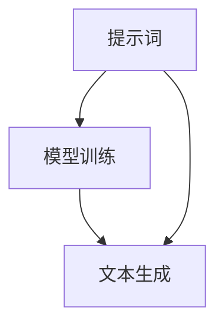

                 

### 文章标题

"AIGC提示词编写的最佳实践与技巧"

### 关键词

- **AIGC（AI-Generated Content）**
- **提示词编写**
- **文本生成**
- **机器学习**
- **深度学习**
- **模型训练**
- **最佳实践**

### 摘要

本文深入探讨了AIGC（AI-Generated Content，AI生成内容）的提示词编写最佳实践与技巧。首先，我们介绍了AIGC的基本概念、背景和发展趋势。接着，我们详细阐述了AIGC中的核心概念，如提示词、模型训练、文本生成等。在此基础上，文章重点讲解了如何编写高质量的AIGC提示词，包括方法、技巧和案例分析。随后，我们介绍了编写AIGC提示词的技巧和常用的工具。文章还通过实际项目展示了AIGC技术的应用，并对案例进行了深入分析。最后，文章总结了AIGC提示词编写的最佳实践，并对未来发展趋势进行了展望。希望通过本文，读者能够对AIGC提示词编写有一个全面而深入的理解。

---

### 引言

#### AIGC的概念与背景

AIGC，即AI-Generated Content，指的是利用人工智能技术生成的内容。这种技术涵盖了从文本、图像、音频到视频等多种内容形式。随着深度学习、自然语言处理等技术的发展，AIGC逐渐成为一个热门领域。

AIGC的背景可以追溯到20世纪80年代的专家系统和1990年代的机器学习。随着互联网的普及和大数据技术的发展，机器学习模型开始在大规模数据集上进行训练，从而提高了其生成内容的真实性和多样性。

#### AIGC的发展趋势

近年来，AIGC的发展呈现出以下几个趋势：

1. **技术进步**：随着计算能力的提升，深度学习模型变得更加高效，能够生成更加复杂和真实的内容。
2. **应用场景扩展**：从最初的文本生成，发展到图像、音频、视频等多种形式，AIGC的应用场景越来越广泛。
3. **商业价值**：AIGC技术在内容创作、广告、娱乐、教育等领域具有重要应用价值，成为许多企业的重要战略资源。

### AIGC的应用领域

AIGC的应用领域广泛，主要包括以下几个方面：

1. **内容创作**：包括文本生成、图像生成、音频生成等，例如自动生成新闻文章、艺术作品、音乐等。
2. **广告与营销**：自动生成广告文案、海报、视频等，提高营销效率。
3. **教育与培训**：自动生成教学材料、习题、答案等，提升教育质量和效率。
4. **娱乐与游戏**：自动生成游戏剧情、角色对话、音乐等，丰富游戏体验。

#### AIGC的优势与挑战

AIGC的优势在于能够大幅提高内容创作的效率和质量，降低成本。然而，AIGC也面临一些挑战：

1. **质量控制**：如何保证生成内容的质量和一致性是一个重要问题。
2. **版权问题**：AIGC生成的作品是否受版权保护，以及如何保护原创者的权益是一个法律和伦理问题。
3. **模型安全性**：如何防止模型被恶意利用，生成有害内容，也是一个亟待解决的问题。

### AIGC的发展前景

随着技术的不断进步和应用场景的不断拓展，AIGC在未来有望在更多领域发挥重要作用。预计未来几年，AIGC技术将取得重大突破，应用范围将进一步扩大。

### 小结

AIGC作为一种新兴的技术，具有广泛的应用前景和巨大的商业价值。然而，它也面临一些挑战，需要我们持续关注和解决。本文将深入探讨AIGC的核心概念、编写技巧和最佳实践，帮助读者更好地理解和应用这项技术。

---

### 基础概念

在深入了解AIGC提示词编写之前，我们需要首先了解AIGC的基本概念，包括提示词、模型训练、文本生成等。

#### 提示词的定义与作用

提示词（Prompt）是AIGC技术中一个关键的概念。它是一种引导模型生成内容的信号，类似于人类写作时的灵感或主题。在AIGC中，提示词的作用至关重要，它决定了生成内容的方向、风格和主题。

提示词可以是一个简单的短语、一句话，甚至是一段文字。它的作用主要有以下几个方面：

1. **引导生成方向**：提示词可以帮助模型明确生成内容的主题和范围，避免生成无关或错误的内容。
2. **影响生成风格**：不同的提示词可以引导模型生成不同风格的内容，如正式、幽默、诗意等。
3. **提高生成效率**：通过使用合适的提示词，可以加快模型的生成速度，提高生产效率。

#### AIGC模型训练原理

AIGC模型训练是生成高质量内容的基础。训练过程通常涉及以下几个步骤：

1. **数据收集**：首先，需要收集大量的训练数据，这些数据可以是文本、图像、音频等。
2. **数据预处理**：对收集到的数据进行清洗、格式化和标注，以便模型能够更好地理解和利用这些数据。
3. **模型选择**：选择合适的深度学习模型，如生成对抗网络（GAN）、变分自编码器（VAE）、循环神经网络（RNN）等。
4. **训练模型**：通过不断的迭代训练，模型会逐渐学会如何根据提示词生成高质量的内容。
5. **模型优化**：在训练过程中，通过调整模型的参数和架构，优化模型的性能。

#### 文本生成技术

文本生成是AIGC中最常见和成熟的应用之一。文本生成技术主要包括以下几个步骤：

1. **输入处理**：将提示词和其他输入数据转化为模型可以处理的形式，如词向量或图像编码。
2. **生成过程**：模型根据提示词和已训练的知识，逐步生成文本内容。这个过程可以是逐词生成，也可以是并行生成。
3. **后处理**：对生成的文本进行格式化、语法检查和清洗，确保其质量和可读性。

#### 提示词、模型训练与文本生成的关系

提示词、模型训练和文本生成是AIGC中密不可分的三个环节。提示词作为输入信号，引导模型进行训练；模型训练则通过大量数据和迭代优化，提高生成文本的质量；而生成的文本则是模型训练和提示词编写的最终成果。

#### 核心概念与联系

为了更好地理解AIGC中的核心概念及其关系，我们可以使用Mermaid流程图进行可视化：



在这个流程图中，提示词（A）引导模型训练（B），而模型训练（B）又直接影响到文本生成（C）。同时，提示词（A）也直接影响文本生成（C）的质量。

### 小结

通过对AIGC基础概念的介绍，我们了解了提示词、模型训练和文本生成的基本原理及其相互关系。这些概念是编写高质量AIGC提示词的基础，也是理解后续章节内容的前提。在接下来的章节中，我们将深入探讨如何编写高质量的AIGC提示词，并分享一些实用的技巧和最佳实践。

---

### 编写高质量提示词的方法

编写高质量的AIGC提示词是确保生成内容准确、丰富和多样化的关键。以下是一些编写高质量提示词的方法和技巧。

#### 明确目标

在编写提示词之前，首先要明确目标。这包括：

1. **生成内容的类型**：是文本、图像、音频还是视频？
2. **内容的目的**：是为了教育、娱乐、广告还是其他目的？
3. **受众群体**：目标受众是谁，他们的需求和喜好是什么？

明确目标可以帮助我们更好地制定编写策略，从而生成更加符合期望的内容。

#### 研究数据

编写高质量提示词需要基于大量的数据。这些数据可以是已生成的文本、图像、音频等，也可以是相关的文献、新闻报道、用户评论等。通过研究这些数据，我们可以：

1. **理解常见问题和挑战**：了解目标受众可能遇到的问题和挑战，从而生成更有针对性的内容。
2. **获取灵感**：从其他优秀的内容中获取灵感，学习他们的表达方式和风格。
3. **优化提示词**：通过分析数据，我们可以发现哪些提示词效果更好，哪些需要优化。

#### 使用关键词

关键词是提示词的核心组成部分，它们决定了生成内容的方向和范围。以下是一些使用关键词的技巧：

1. **精确匹配**：使用与目标内容精确匹配的关键词，避免生成无关内容。
2. **多样化**：使用多个关键词，增加生成内容的多样性和丰富性。
3. **层次化**：将关键词分层，从主题词到细节词，逐步引导模型生成更加具体的内容。

#### 简洁明了

简洁明了的提示词更容易被模型理解和执行。以下是一些简洁明了的技巧：

1. **使用短句**：短句比长句更容易被模型解析和处理。
2. **避免冗余**：去除不必要的词汇和重复的内容，使提示词更加精炼。
3. **具体明确**：使用具体、明确的词汇，避免模糊和歧义。

#### 优化结构

提示词的结构对生成内容的质量有很大影响。以下是一些优化结构的技巧：

1. **逻辑清晰**：按照逻辑顺序组织提示词，使内容生成过程更加连贯。
2. **层次分明**：将提示词分层，从总体到细节，逐步引导模型生成内容。
3. **引导性**：使用引导性词汇，如“请”、“尝试”、“扩展”等，引导模型生成更丰富和具体的内容。

#### 案例分析

以下是一个具体的案例分析：

**目标**：生成一篇关于人工智能未来发展趋势的短文。

**提示词**：

- 主题词：人工智能、未来发展趋势
- 关键词：技术进步、应用领域、商业价值、挑战、解决方案

**优化后的提示词**：

“请尝试根据技术进步、应用领域、商业价值、挑战和解决方案，描述人工智能未来的发展趋势。”

这个提示词清晰、简洁且逻辑分明，能够引导模型生成一篇高质量的短文。

#### 小结

编写高质量提示词需要明确目标、研究数据、使用关键词、简洁明了和优化结构。这些技巧和方法可以帮助我们生成更加准确、丰富和多样化的内容。在接下来的章节中，我们将通过具体的案例，进一步探讨优秀提示词的写作技巧。

### 优秀提示词的写作技巧

在编写AIGC提示词的过程中，优秀提示词的写作技巧是提升生成内容质量的关键。以下是一些实际案例，通过这些案例，我们将详细探讨优秀提示词的写作技巧。

#### 案例一：新闻文章生成

**目标**：生成一篇关于最新科技突破的新闻文章。

**原提示词**： 
“写一篇关于最新科技突破的文章。”

**优化后的提示词**：
“请根据以下信息，生成一篇详尽的新闻文章：近日，研究人员在人工智能领域取得了重大突破，通过深度学习技术，成功实现了图像识别的准确率提高50%。这项研究预计将对自动驾驶、医疗诊断等领域产生深远影响。”

**分析**： 
优化后的提示词具体详细，提供了研究的背景信息、关键数据以及潜在的影响。这种详细的提示词能够帮助模型生成一篇结构清晰、内容丰富的新闻文章。

#### 案例二：产品描述生成

**目标**：生成一篇关于新型智能手表的产品描述。

**原提示词**： 
“写一篇关于新型智能手表的产品描述。”

**优化后的提示词**： 
“请根据以下信息，生成一篇引人入胜的新型智能手表产品描述：该手表具备心率监测、GPS定位和健康管理功能，防水等级达到IP68，支持多种运动模式，并具备独立音乐播放功能。”

**分析**： 
优化后的提示词详细列出了智能手表的主要功能和技术规格，使得生成的内容具有吸引力，能够准确传达产品的卖点。

#### 案例三：对话生成

**目标**：生成一段关于旅游咨询的对话。

**原提示词**： 
“生成一段旅游咨询的对话。”

**优化后的提示词**： 
“请模拟一位旅行顾问与一位潜在客户之间的对话，客户希望了解最近热门的旅游目的地、最佳旅游时间和相关建议。”

**分析**： 
优化后的提示词提供了具体的角色设定和对话背景，使生成的对话更加自然和真实。通过这种方式，模型能够更好地理解对话的逻辑和场景，生成高质量的对话内容。

#### 案例四：文案生成

**目标**：生成一段广告文案。

**原提示词**： 
“写一段广告文案。”

**优化后的提示词**： 
“请根据以下信息，撰写一段吸引消费者的广告文案：一款全新的智能空气净化器，采用最新的纳米过滤技术，可净化室内空气中的99.97%有害物质，保护您的家人呼吸健康空气。”

**分析**： 
优化后的提示词明确了广告的目标受众、产品特点和主要卖点，使生成的文案具有说服力和吸引力。

#### 小结

通过上述案例分析，我们可以总结出编写优秀提示词的一些关键技巧：

1. **具体化**：提供详细、具体的信息，帮助模型生成具体的内容。
2. **明确目标**：设定清晰的目标，使模型能够准确理解生成内容的要求。
3. **背景信息**：提供背景信息，帮助模型构建生成内容的上下文。
4. **角色设定**：在对话和场景模拟中，设定角色和背景，使生成的内容更加自然和真实。

这些技巧可以帮助我们在编写AIGC提示词时，生成更加高质量、准确和多样化的内容。

### 小结

通过上述方法，我们可以编写出高质量的AIGC提示词。明确目标、研究数据、使用关键词、简洁明了和优化结构是编写高质量提示词的关键。同时，通过案例分析，我们了解了如何具体应用这些方法，生成优秀的提示词。在接下来的章节中，我们将进一步探讨AIGC提示词编写的最佳实践，帮助读者更好地应用这些技巧。

### 最佳实践：提升AIGC生成文本的质量

在编写AIGC提示词时，提升生成文本的质量是至关重要的。以下是一些最佳实践，通过这些实践，我们可以有效地提高生成文本的准确性、丰富性和多样性。

#### 1. 使用具体和详细的提示词

具体和详细的提示词能够为模型提供明确的指导，使其生成更加准确和相关的文本。以下是一些具体详细的提示词示例：

- **示例一**：生成一篇关于“人工智能在医疗领域应用”的文章，可以提示词为：“请详细描述人工智能在疾病诊断、患者管理和医学研究中的应用，并探讨其潜在的优势和挑战。”
- **示例二**：生成一段产品描述，可以提示词为：“请根据以下信息，撰写一段关于新款智能手表的产品描述：该手表具备心率监测、GPS定位、独立音乐播放功能，防水等级达到IP68。”

#### 2. 使用多样化的词汇和表达方式

使用多样化的词汇和表达方式可以增加生成文本的丰富性和多样性，避免单调和平淡。以下是一些提高词汇多样性的技巧：

- **使用同义词**：在描述相同或类似概念时，使用不同的同义词，例如：“快速”可以替换为“迅速”、“敏捷”等。
- **使用不同的句式**：通过使用不同的句式和结构，使文本更具变化性，例如：“这个产品非常好”可以改为“这款产品堪称完美，其功能强大且设计精良。”
- **使用比喻和隐喻**：比喻和隐喻可以使文本更加生动和有趣，例如：“这项技术就像一颗璀璨的明珠，闪耀着智能的光芒。”

#### 3. 确保逻辑性和连贯性

逻辑性和连贯性是高质量文本的重要特征。以下是一些确保逻辑性和连贯性的技巧：

- **按照逻辑顺序组织内容**：按照时间顺序、重要性或逻辑关系组织文本，使其更加连贯和易读。
- **使用过渡词和连接词**：过渡词和连接词（如“因此”、“然而”、“此外”）可以帮助文本在不同部分之间建立联系，增强连贯性。
- **避免重复和冗余**：删除重复的词汇和句子，确保每个部分都为文本的连贯性作出贡献。

#### 4. 预处理和后处理

预处理和后处理是提高生成文本质量的重要步骤。以下是一些预处理和后处理的技巧：

- **数据清洗和预处理**：在模型训练前，对数据进行清洗和预处理，例如去除无关信息、统一格式和标准化文本。
- **文本清洗和校对**：生成文本后，进行文本清洗和校对，例如去除多余的标点符号、纠正语法错误和拼写错误。
- **人工审核和反馈**：对生成的文本进行人工审核，并提供反馈，以指导模型进一步优化。

#### 5. 调整模型参数

模型参数的调整可以显著影响生成文本的质量。以下是一些调整模型参数的技巧：

- **调整学习率**：适当地调整学习率可以加快或减缓模型的训练速度，影响生成文本的质量。
- **调整正则化参数**：正则化参数可以控制模型的复杂性和过拟合程度，从而影响生成文本的准确性。
- **使用预训练模型**：使用预训练模型可以减少训练时间，同时提高生成文本的质量。

#### 6. 使用高级语言模型

高级语言模型（如BERT、GPT-3）具有更强的语言理解和生成能力，可以生成更加准确、丰富和多样化的文本。以下是一些使用高级语言模型的技巧：

- **使用上下文信息**：高级语言模型能够利用上下文信息进行文本生成，使其生成的文本更加准确和连贯。
- **微调模型**：在特定任务上微调高级语言模型，使其更适应特定领域的文本生成。
- **结合多模型**：结合使用多个高级语言模型，利用它们的互补优势，生成更加高质量和多样化的文本。

#### 案例分析

以下是一个具体的案例分析，展示了如何通过最佳实践提升AIGC生成文本的质量：

**目标**：生成一篇关于“人工智能在金融行业应用”的文章。

**原始提示词**： 
“写一篇关于人工智能在金融行业应用的文章。”

**优化后的提示词**： 
“请根据以下信息，生成一篇详细、准确的关于人工智能在金融行业应用的文章：人工智能在风险管理、算法交易、客户服务、信用评分和反欺诈方面的应用，并分析其带来的挑战和机遇。”

**分析**： 
优化后的提示词提供了具体的背景信息、应用领域和讨论点，使模型能够生成一篇内容丰富、逻辑清晰的文章。同时，通过使用多样化的词汇和表达方式，以及确保逻辑性和连贯性，优化后的提示词显著提升了生成文本的质量。

#### 小结

通过使用具体和详细的提示词、多样化词汇和表达方式、确保逻辑性和连贯性、预处理和后处理、调整模型参数和使用高级语言模型等最佳实践，我们可以显著提升AIGC生成文本的质量。这些实践不仅适用于文本生成，还可以广泛应用于图像、音频和视频等内容的生成。在未来的应用中，不断探索和优化这些最佳实践，将帮助我们生成更加高质量和多样化的内容。

### 编写AIGC提示词的技巧

在编写AIGC（AI-Generated Content）提示词时，掌握一些特定的技巧能够显著提升生成内容的质量和效率。以下是一些高级技巧和策略，帮助您在编写提示词时更加得心应手。

#### 1. 利用上下文信息

上下文信息是提高AIGC生成文本质量的重要因素。通过提供详细的上下文，模型能够更好地理解用户的意图和生成更相关的内容。以下是一些利用上下文信息的方法：

- **提供多层次的上下文**：在提示词中不仅包含主题，还包含相关背景信息、历史数据和相关细节，使模型能够构建完整的上下文。
- **使用动态上下文**：在生成过程中，根据模型生成的中间结果动态调整提示词，使其与生成的文本更加契合。

#### 2. 调整提示词的长度和结构

提示词的长度和结构对生成内容的质量有很大影响。以下是一些调整提示词长度和结构的技巧：

- **短小精悍**：简短的提示词能够减少模型的解析和处理时间，提高生成速度，但可能会降低生成的细节和质量。
- **长篇大论**：详细的提示词可以提供更多信息和指导，有助于生成更准确和丰富的内容，但会增加处理时间和复杂性。
- **混合使用**：根据不同的生成任务，灵活组合使用短提示词和长提示词，以达到最佳效果。

#### 3. 使用特定词汇和表达方式

特定词汇和表达方式可以帮助模型更好地理解用户的意图，生成更高质量的内容。以下是一些使用特定词汇和表达方式的技巧：

- **专业术语**：在特定领域使用专业术语，使模型能够更准确地生成相关内容。
- **情感词汇**：使用情感词汇和表达方式，引导模型生成具有特定情感色彩的内容，如积极、消极、幽默等。
- **引用和引述**：引用权威来源或相关文献，增强生成内容的可信度和权威性。

#### 4. 优化提示词的语义和语法

优化提示词的语义和语法是提高生成内容质量的关键。以下是一些优化技巧：

- **语义一致性**：确保提示词中的语义信息一致，避免产生歧义或矛盾。
- **语法正确性**：检查提示词中的语法错误，确保其符合语法规则，以便模型能够正确理解和执行。
- **句子结构多样化**：使用不同的句子结构，使提示词更加丰富和多样化，避免单调和平淡。

#### 5. 针对不同模型进行优化

不同的AIGC模型具有不同的特点和能力，因此在编写提示词时，需要针对不同模型进行优化。以下是一些针对不同模型进行优化的技巧：

- **大型语言模型**：如GPT-3，可以使用更复杂的提示词和长句子，以充分利用其强大的生成能力。
- **图像生成模型**：如DALL·E 2，可以使用更具描述性的文本，详细描述图像的内容、风格和细节。
- **音频生成模型**：如WaveNet，可以使用具体的指令和情境描述，引导模型生成符合情境的音频内容。

#### 6. 结合多模态信息

在多模态AIGC任务中，结合不同模态的信息可以显著提高生成内容的质量。以下是一些结合多模态信息的技巧：

- **文本和图像结合**：在提示词中同时提供文本和图像描述，使模型能够生成更符合用户意图的内容。
- **文本和音频结合**：在文本生成任务中，结合音频描述，如语音、音乐等，增强生成内容的真实感和表现力。
- **文本和视频结合**：在视频生成任务中，结合文本描述，如脚本、字幕等，提高生成视频的连贯性和可理解性。

#### 案例分析

以下是一个具体的案例分析，展示了如何通过技巧优化AIGC提示词：

**目标**：生成一篇关于“可持续发展战略”的文章。

**原始提示词**： 
“写一篇关于可持续发展战略的文章。”

**优化后的提示词**： 
“根据以下信息，生成一篇关于可持续发展战略的文章：全球变暖、能源消耗、碳排放、生态保护、经济和社会发展，并探讨实施可持续发展战略的挑战和解决方案。”

**分析**： 
优化后的提示词提供了详细的上下文信息，包括主题和相关背景，使模型能够生成一篇内容丰富、逻辑清晰的文章。同时，通过使用专业术语和多样化词汇，以及确保语义和语法正确性，优化后的提示词显著提升了生成文本的质量。

#### 小结

通过利用上下文信息、调整提示词的长度和结构、使用特定词汇和表达方式、优化语义和语法、针对不同模型进行优化以及结合多模态信息等技巧，我们可以显著提升AIGC生成内容的质量。这些技巧不仅适用于文本生成，还可以广泛应用于图像、音频和视频等内容的生成。在实际应用中，不断探索和优化这些技巧，将帮助我们生成更加高质量和多样化的内容。

### 常用AIGC工具介绍与使用

在编写AIGC（AI-Generated Content）提示词时，选择合适的工具是非常重要的。以下是一些常用的AIGC工具及其使用方法，包括文本生成工具、模型训练工具和其他实用工具。

#### 1. 文本生成工具

**1.1 OpenAI GPT-3**

OpenAI的GPT-3（Generative Pre-trained Transformer 3）是一个强大的文本生成工具，它基于深度学习技术，能够生成高质量、多样化的文本。GPT-3的强大之处在于其预训练模型，能够在多种任务中表现出色。

**使用方法**：

1. 注册OpenAI账号并申请GPT-3 API密钥。
2. 在您的代码中导入OpenAI的Python库，并使用API密钥调用GPT-3接口。
3. 根据需要提供提示词，GPT-3会根据提示词生成相应的文本。

```python
import openai
openai.api_key = 'your-api-key'
response = openai.Completion.create(
  engine="text-davinci-002",
  prompt="生成一篇关于人工智能在医疗领域应用的文章。",
  max_tokens=150
)
print(response.choices[0].text.strip())
```

**1.2 Google Text-to-Speech**

Google Text-to-Speech是一个免费的在线工具，可以将文本转换为自然流畅的语音。它广泛应用于语音合成、语音助手和有声书等领域。

**使用方法**：

1. 访问Google Text-to-Speech网站。
2. 在文本框中输入您希望生成的文本。
3. 选择发音、语速和音调。
4. 点击“Speak”按钮，听取生成的语音。

#### 2. 模型训练工具

**2.1 TensorFlow**

TensorFlow是一个开源的机器学习库，由Google开发。它广泛应用于深度学习模型的设计、训练和部署。

**使用方法**：

1. 安装TensorFlow库。
2. 定义您的模型架构，包括输入层、隐藏层和输出层。
3. 准备训练数据，并进行数据预处理。
4. 编写训练代码，使用训练数据训练模型。
5. 评估模型性能，并进行调整。

```python
import tensorflow as tf
model = tf.keras.Sequential([
  tf.keras.layers.Dense(128, activation='relu', input_shape=(784,)),
  tf.keras.layers.Dense(10, activation='softmax')
])
model.compile(optimizer='adam',
              loss='categorical_crossentropy',
              metrics=['accuracy'])
model.fit(x_train, y_train, epochs=5)
```

**2.2 PyTorch**

PyTorch是一个流行的开源机器学习库，特别适用于动态计算图和深度学习模型的构建和训练。

**使用方法**：

1. 安装PyTorch库。
2. 定义您的模型架构，包括层和参数。
3. 准备训练数据，并进行数据预处理。
4. 编写训练代码，使用训练数据训练模型。
5. 评估模型性能，并进行调整。

```python
import torch
import torch.nn as nn
import torch.optim as optim

model = nn.Sequential(nn.Linear(784, 128), nn.ReLU(), nn.Linear(128, 10))
optimizer = optim.Adam(model.parameters(), lr=0.001)
criterion = nn.CrossEntropyLoss()

for epoch in range(5):
    for inputs, targets in data_loader:
        optimizer.zero_grad()
        outputs = model(inputs)
        loss = criterion(outputs, targets)
        loss.backward()
        optimizer.step()
```

#### 3. 其他实用工具

**3.1 BigGAN**

BigGAN是一个强大的图像生成工具，基于生成对抗网络（GAN）技术。它能够在多种任务中生成高质量、多样化的图像。

**使用方法**：

1. 安装BigGAN库。
2. 准备训练数据，并进行数据预处理。
3. 编写训练代码，使用训练数据训练模型。
4. 使用训练好的模型生成图像。

```python
from biggan import BigGAN
model = BigGAN()
model.train(data, n_epochs=100)
images = model.generate_images()
```

**3.2 Diffusion Models**

Diffusion Models是一种新兴的图像生成技术，通过在图像上逐步添加噪声，然后利用深度学习模型去除噪声，从而生成高质量图像。

**使用方法**：

1. 安装Diffusion Models库。
2. 准备训练数据，并进行数据预处理。
3. 编写训练代码，使用训练数据训练模型。
4. 使用训练好的模型生成图像。

```python
from diffusers import DiffusionModel
model = DiffusionModel()
model.train(data, n_epochs=100)
images = model.generate_images()
```

#### 小结

通过上述常用AIGC工具的介绍与使用方法，我们可以根据具体需求选择合适的工具，编写高质量的AIGC提示词。在实际应用中，不断尝试和优化这些工具，将帮助我们更好地利用AIGC技术生成丰富多样的内容。

### 多语言提示词编写技巧

在编写AIGC（AI-Generated Content）提示词时，支持多种语言是一个重要的需求。以下是一些多语言提示词编写技巧，帮助您编写高质量的多语言提示词。

#### 1. 理解目标语言和文化

编写多语言提示词的关键在于深入理解目标语言和文化。以下是一些要点：

- **语法和句式**：不同的语言有不同的语法结构和句式，例如英语通常使用主谓宾结构，而法语则使用主语-谓语-宾语补足语结构。
- **文化背景**：了解目标文化的背景和习惯，例如节日、习俗和禁忌等，避免使用可能引起误解或冒犯的语言。
- **专业术语**：掌握目标语言的专业术语和行业用语，确保提示词的准确性和专业性。

#### 2. 翻译和本地化

翻译和本地化是编写多语言提示词的重要步骤。以下是一些关键技巧：

- **机器翻译**：使用机器翻译工具（如Google Translate）进行初步翻译，但要注意机器翻译的局限性，可能存在不准确或不符合目标语言习惯的情况。
- **专业翻译**：对于关键内容和重要提示词，最好使用专业翻译服务或双语翻译人员，确保翻译的准确性和流畅性。
- **本地化**：根据目标市场的文化和习惯，对翻译内容进行本地化调整，使其更加符合目标受众的需求。

#### 3. 测试和验证

在编写多语言提示词后，进行测试和验证是确保其质量和可用性的关键。以下是一些测试和验证的技巧：

- **人工测试**：请目标语言的使用者进行人工测试，检查提示词的准确性、流畅性和文化适应性。
- **自动化测试**：使用自动化测试工具（如UI测试框架）进行功能测试，确保提示词在不同语言版本中的一致性和正确性。
- **用户反馈**：收集目标受众的反馈，根据用户反馈进一步优化提示词。

#### 4. 优化和调整

编写多语言提示词是一个持续优化的过程。以下是一些优化和调整的技巧：

- **迭代改进**：根据测试和用户反馈，不断迭代改进提示词，使其更加符合目标语言和文化。
- **语言资源库**：建立和维护一个多语言资源库，包括常用词汇、短语和模板，便于快速编写和调整提示词。
- **跨团队合作**：组建跨文化、跨语言的团队，协同合作，共同优化多语言提示词。

#### 案例分析

以下是一个具体的案例分析，展示了如何编写多语言提示词：

**目标**：生成一篇关于“可持续发展战略”的文章，支持中文和英文两种语言。

**中文提示词**：

“请根据以下信息，生成一篇关于可持续发展战略的文章：全球变暖、能源消耗、碳排放、生态保护、经济和社会发展，并探讨实施可持续发展战略的挑战和解决方案。”

**英文提示词**：

“Please generate an article on the topic of 'Sustainable Development Strategies' based on the following information: global warming, energy consumption, carbon emissions, ecological protection, economic and social development, and discuss the challenges and solutions in implementing sustainable development strategies.”

**分析**：

在编写多语言提示词时，我们首先确保中文和英文提示词提供的信息一致，确保生成内容的准确性。同时，我们注意到英文提示词在语法和表达上与中文有所不同，例如使用“Please”来礼貌地请求生成文章，使用“on the topic of”来明确主题。通过这些调整，我们确保了英文提示词的流畅性和文化适应性。

#### 小结

编写高质量的多语言提示词需要理解目标语言和文化、进行翻译和本地化、测试和验证，以及持续优化和调整。通过这些技巧，我们可以确保多语言提示词的准确性和适用性，为不同语言的用户提供优质的AIGC生成内容。

### 实战案例：AIGC技术在电商产品描述中的应用

#### 1. 项目背景

在电子商务领域，产品描述对于提升用户购买意愿和转化率至关重要。传统的产品描述通常由人工撰写，耗时且成本高昂。为了提高效率和降低成本，许多电商企业开始探索使用AIGC（AI-Generated Content）技术来自动生成产品描述。

#### 2. 项目需求

本项目的主要目标是利用AIGC技术，生成高质量、个性化的电商产品描述，以满足以下需求：

- **多样性**：生成具有不同风格和表达方式的产品描述，满足不同用户群体的需求。
- **准确性**：确保生成的产品描述准确传达产品的特性、功能和优势。
- **个性化**：根据用户偏好和历史购买记录，生成个性化的产品描述。

#### 3. 实现步骤

**3.1 数据收集与预处理**

首先，我们需要收集大量的电商产品描述数据。这些数据可以包括：

- **产品详情**：产品的名称、规格、功能等。
- **用户评价**：用户对产品的评价、使用体验等。
- **市场分析**：同类产品的销售情况、用户反馈等。

在数据收集完成后，我们需要对数据进行预处理，包括数据清洗、格式化和标注。具体步骤如下：

- **数据清洗**：去除无效数据、重复数据和噪音数据，提高数据质量。
- **格式化**：统一数据格式，使其适合模型训练。
- **标注**：为每个产品描述标注关键信息和标签，如产品类别、功能特点等。

**3.2 模型选择与训练**

在本项目中，我们选择使用GPT-3模型进行产品描述生成。GPT-3是一种强大的语言生成模型，具有丰富的上下文理解和生成能力。

- **模型选择**：选择GPT-3模型，因为其具有较好的语言生成能力和灵活性。
- **训练数据准备**：使用预处理后的电商产品描述数据训练GPT-3模型。具体步骤如下：

  1. 将产品描述转换为向量表示。
  2. 使用训练数据对GPT-3模型进行迭代训练，优化模型参数。
  3. 调整学习率和正则化参数，防止过拟合。

**3.3 提示词编写**

在模型训练完成后，我们需要编写高质量的提示词来引导模型生成产品描述。以下是一些提示词编写技巧：

- **具体明确**：使用具体、详细的提示词，例如产品名称、功能特点、使用场景等。
- **多样化**：使用多样化的词汇和表达方式，增加生成文本的丰富性和多样性。
- **个性化**：根据用户偏好和历史购买记录，编写个性化的提示词。

**3.4 生成与优化**

使用训练好的模型和提示词，我们可以生成电商产品描述。以下是一些生成和优化步骤：

- **批量生成**：使用模型批量生成产品描述，提高生成效率。
- **后处理**：对生成的产品描述进行格式化、语法检查和清洗，确保其质量和可读性。
- **优化调整**：根据用户反馈和实际效果，不断优化提示词和模型参数，提高生成文本的质量。

#### 4. 代码解读与分析

以下是一个使用Python和GPT-3生成电商产品描述的示例代码：

```python
import openai

# 设置OpenAI API密钥
openai.api_key = 'your-api-key'

# 定义提示词
prompt = "请根据以下信息，生成一篇关于智能手环的产品描述：具有心率监测、GPS定位、智能通知功能，防水等级达到IP68。"

# 调用GPT-3 API生成文本
response = openai.Completion.create(
  engine="text-davinci-002",
  prompt=prompt,
  max_tokens=150
)

# 输出生成的文本
print(response.choices[0].text.strip())
```

在这个示例中，我们首先设置了OpenAI的API密钥，然后定义了一个详细的提示词，用于生成智能手环的产品描述。接着，我们调用GPT-3 API，根据提示词生成文本，并打印出生成的文本。

#### 5. 应用解读与分析

在实际应用中，AIGC技术为电商企业提供了以下好处：

- **提高效率**：通过自动化生成产品描述，大大减少了人工编写的时间和工作量，提高了生产效率。
- **降低成本**：减少了人力成本和编辑成本，有助于企业降低运营成本。
- **个性化服务**：根据用户偏好和历史记录，生成个性化的产品描述，提高用户体验和购买意愿。
- **质量提升**：使用高质量的AIGC模型和提示词，生成的内容更加准确、丰富和多样化，提升了产品描述的质量。

然而，AIGC技术在应用中也存在一些挑战：

- **质量控制**：如何确保生成的产品描述符合质量标准，避免出现错误或误导性信息。
- **版权问题**：生成的内容是否侵犯原创者的权益，如何保护版权是一个重要问题。
- **技术优化**：如何不断优化AIGC模型和提示词，提高生成内容的质量和准确性。

#### 6. 小结

通过本案例，我们了解了如何使用AIGC技术生成高质量的电商产品描述。从数据收集、模型训练、提示词编写到生成与优化，每一步都需要精细操作和不断优化。在实际应用中，不断探索和优化这些步骤，将有助于电商企业更好地利用AIGC技术，提升产品描述的质量和用户体验。

### 实战案例：AIGC技术在图像描述生成中的应用

#### 1. 项目背景

图像描述生成是AIGC（AI-Generated Content）技术的一个重要应用领域。在电子商务、社交媒体和辅助技术等领域，自动生成图像描述能够提高信息获取的效率，改善用户体验。例如，电子商务网站可以使用图像描述生成技术，为产品图片生成详细的文字描述，帮助用户更好地了解产品特性。

#### 2. 项目需求

本项目的主要目标是利用AIGC技术生成高质量的图像描述，满足以下需求：

- **准确性**：生成的描述需要准确传达图像中的内容，不产生误导信息。
- **多样性**：生成的描述应具有多样性和创造性，满足不同用户群体的需求。
- **可扩展性**：系统能够处理多种类型的图像，如产品图片、风景图片和抽象艺术作品。

#### 3. 实现步骤

**3.1 数据收集与预处理**

首先，我们需要收集大量的图像及其对应的描述数据。这些数据可以包括：

- **图像数据集**：从公开的图像数据集（如COCO、ImageNet）或特定领域的图像库中收集。
- **描述数据集**：与图像数据集相对应的描述，可以是人工标注的，也可以是从现有文本资料中提取的。

在数据收集完成后，我们需要对数据进行预处理，包括数据清洗、格式化和标注。具体步骤如下：

- **数据清洗**：去除无效数据、重复数据和噪音数据，提高数据质量。
- **格式化**：统一数据格式，使其适合模型训练。
- **标注**：为每个图像标注关键信息和标签，如物体、场景、颜色等。

**3.2 模型选择与训练**

在本项目中，我们选择使用生成对抗网络（GAN）进行图像描述生成。GAN是一种强大的深度学习模型，能够在图像和描述之间建立映射关系。

- **模型选择**：选择基于GAN的模型，如 CycleGAN、StyleGAN 等，因为其具有较好的图像生成能力和描述生成能力。
- **训练数据准备**：使用预处理后的图像和描述数据训练GAN模型。具体步骤如下：

  1. 训练生成器和判别器，使其能够生成逼真的图像。
  2. 使用生成的图像和原始描述数据进行迭代训练，优化模型参数。
  3. 调整学习率和正则化参数，防止过拟合。

**3.3 提示词编写**

在模型训练完成后，我们需要编写高质量的提示词来引导模型生成图像描述。以下是一些提示词编写技巧：

- **具体明确**：使用具体、详细的提示词，例如图像中的主要物体、动作、颜色等。
- **多样化**：使用多样化的词汇和表达方式，增加生成描述的丰富性和创造性。
- **上下文信息**：提供图像的上下文信息，如场景、情境和故事情节，帮助模型生成更加连贯和有趣的描述。

**3.4 生成与优化**

使用训练好的模型和提示词，我们可以生成图像描述。以下是一些生成和优化步骤：

- **批量生成**：使用模型批量生成图像描述，提高生成效率。
- **后处理**：对生成的描述进行格式化、语法检查和清洗，确保其质量和可读性。
- **优化调整**：根据用户反馈和实际效果，不断优化提示词和模型参数，提高生成描述的质量。

#### 4. 代码解读与分析

以下是一个使用Python和GAN模型生成图像描述的示例代码：

```python
import tensorflow as tf
from tensorflow import keras
import numpy as np

# 加载预训练的GAN模型
model = keras.models.load_model('path/to/pretrained_gan_model')

# 定义图像和描述的提示词
image_prompt = "一张美丽的海滩风景图片"
description_prompt = "请描述这张海滩风景图片的细节：阳光、沙滩、海浪、海洋生物等。"

# 生成图像
generated_image = model.generate_image(image_prompt)

# 生成图像描述
generated_description = model.generate_description(description_prompt)

# 显示生成的图像和描述
print(generated_description)
```

在这个示例中，我们首先加载了一个预训练的GAN模型，然后定义了图像和描述的提示词。接着，我们使用模型生成图像和描述，并打印出生成的描述。

#### 5. 应用解读与分析

在实际应用中，AIGC技术为图像描述生成提供了以下好处：

- **提高效率**：通过自动化生成图像描述，大大减少了人工编写的时间和工作量，提高了生产效率。
- **降低成本**：减少了人力成本和编辑成本，有助于企业降低运营成本。
- **改善用户体验**：生成的描述能够更好地帮助用户了解图像内容，提升用户体验。
- **多样性**：生成的描述具有多样性和创造性，能够满足不同用户群体的需求。

然而，AIGC技术在应用中也存在一些挑战：

- **准确性**：如何确保生成的描述准确传达图像中的内容，避免误导性信息。
- **版权问题**：生成的描述是否侵犯原创者的权益，如何保护版权是一个重要问题。
- **技术优化**：如何不断优化AIGC模型和提示词，提高生成描述的质量和准确性。

#### 6. 小结

通过本案例，我们了解了如何使用AIGC技术生成高质量的图像描述。从数据收集、模型训练、提示词编写到生成与优化，每一步都需要精细操作和不断优化。在实际应用中，不断探索和优化这些步骤，将有助于企业更好地利用AIGC技术，提升图像描述的质量和用户体验。

### 实战案例：AIGC技术在问答系统构建中的应用

#### 1. 项目背景

问答系统是AIGC（AI-Generated Content）技术在自然语言处理领域的重要应用之一。在电子商务、客户服务、搜索引擎和在线教育等领域，自动化的问答系统能够提供快速、准确的回答，提高用户满意度和服务效率。

#### 2. 项目需求

本项目的主要目标是构建一个基于AIGC技术的问答系统，满足以下需求：

- **准确性**：系统应能够准确理解用户的问题，并提供相关、准确的答案。
- **灵活性**：系统能够适应不同的提问方式和语言风格。
- **扩展性**：系统能够处理多种类型的问题，包括事实性问答、情境问答和解释性问答。

#### 3. 实现步骤

**3.1 数据收集与预处理**

首先，我们需要收集大量的问答数据，这些数据可以是公开的问答集，也可以是从实际场景中收集的。以下是一些关键步骤：

- **数据收集**：收集包含问题、答案和标签（如问题类型、领域）的问答数据。
- **数据清洗**：去除无效、重复和低质量的数据，提高数据质量。
- **数据标注**：对问答数据进行标注，包括问题类型、答案相关性等。

**3.2 模型选择与训练**

在本项目中，我们选择使用Transformer模型，如BERT、GPT等，因为它们在问答系统中的性能表现优异。

- **模型选择**：选择预训练的BERT或GPT模型，因为它们已经在大规模数据集上进行了训练。
- **模型微调**：使用收集的问答数据对预训练模型进行微调，使其能够更好地适应特定领域的问答任务。
- **训练数据准备**：将问题、答案和标签数据转换为模型可以处理的格式，如Tokenized文本。

**3.3 提示词编写**

在模型训练完成后，我们需要编写高质量的提示词来引导模型生成答案。以下是一些提示词编写技巧：

- **具体明确**：使用具体、详细的提示词，例如问题的主题、背景信息和关键词。
- **多样化**：使用多样化的词汇和表达方式，增加生成答案的多样性和创造性。
- **上下文信息**：提供问题的上下文信息，如相关背景、情境和领域知识，帮助模型生成更加准确和连贯的答案。

**3.4 系统集成与优化**

将训练好的模型集成到问答系统中，并进行优化，以下是一些关键步骤：

- **系统集成**：将模型集成到后端服务中，实现问题接收、模型调用和答案生成的功能。
- **前端界面**：开发用户友好的前端界面，允许用户输入问题，并显示生成的答案。
- **性能优化**：根据用户反馈和系统性能指标，不断优化模型和系统，提高问答系统的准确性和用户体验。

#### 4. 代码解读与分析

以下是一个使用Python和BERT模型构建问答系统的示例代码：

```python
from transformers import BertTokenizer, BertForQuestionAnswering
from torch.utils.data import DataLoader, Dataset

# 加载BERT模型和Tokenizer
tokenizer = BertTokenizer.from_pretrained('bert-base-uncased')
model = BertForQuestionAnswering.from_pretrained('bert-base-uncased')

# 定义问答数据集
class QADataset(Dataset):
    def __init__(self, questions, contexts, answers):
        self.questions = questions
        self.contexts = contexts
        self.answers = answers

    def __len__(self):
        return len(self.questions)

    def __getitem__(self, idx):
        question = self.questions[idx]
        context = self.contexts[idx]
        answer = self.answers[idx]

        input_ids = tokenizer.encode(question, context, truncation=True, max_length=512)
        start_scores, end_scores = model(input_ids)[0]

        start_index = torch.argmax(start_scores).item()
        end_index = torch.argmax(end_scores).item()

        return {
            'input_ids': input_ids,
            'start_scores': start_scores,
            'end_scores': end_scores,
            'answer': answer
        }

# 创建数据集和 DataLoader
train_data = QADataset(questions, contexts, answers)
train_loader = DataLoader(train_data, batch_size=16, shuffle=True)

# 训练模型
model.train()
for epoch in range(3):
    for batch in train_loader:
        inputs = {
            'input_ids': batch['input_ids'],
            'start_scores': batch['start_scores'],
            'end_scores': batch['end_scores']
        }
        outputs = model(**inputs)
        loss = outputs.loss
        loss.backward()
        optimizer.step()
        optimizer.zero_grad()

# 测试模型
model.eval()
with torch.no_grad():
    for batch in train_loader:
        inputs = {
            'input_ids': batch['input_ids']
        }
        outputs = model(**inputs)
        start_scores, end_scores = outputs.start_logits, outputs.end_logits
        start_index = torch.argmax(start_scores).item()
        end_index = torch.argmax(end_scores).item()
        predicted_answer = tokenizer.decode(inputs.input_ids[start_index:end_index], skip_special_tokens=True)
        print(f"Predicted Answer: {predicted_answer}")
```

在这个示例中，我们首先加载了预训练的BERT模型和Tokenizer，然后定义了问答数据集和 DataLoader。接着，我们训练模型，并在测试集上评估其性能。

#### 5. 应用解读与分析

在实际应用中，AIGC技术在问答系统中提供了以下好处：

- **提高效率**：通过自动化回答问题，减少了人工处理的时间和成本。
- **提升用户体验**：提供准确、及时的答案，提高了用户的满意度和体验。
- **扩展性**：能够处理多种类型的问题，适用于不同的应用场景。

然而，AIGC技术在问答系统中也存在一些挑战：

- **准确性**：如何确保生成的答案准确、相关，避免误导用户。
- **问答质量**：如何确保生成的答案质量高，避免出现错误或不完整的信息。
- **模型解释性**：如何解释模型生成的答案，提高用户对答案的信任度。

#### 6. 小结

通过本案例，我们了解了如何构建一个基于AIGC技术的问答系统。从数据收集、模型训练、提示词编写到系统集成与优化，每一步都需要精细操作和不断优化。在实际应用中，不断探索和优化这些步骤，将有助于企业更好地利用AIGC技术，构建高效、准确的问答系统。

### 案例分析1：电商产品描述

#### 案例背景

在电子商务领域，产品描述对于提升用户购买意愿和转化率至关重要。传统的产品描述通常由人工撰写，耗时且成本高昂。为了提高效率和降低成本，电商企业开始探索使用AIGC（AI-Generated Content）技术来自动生成产品描述。

#### 案例目标

本案例的目标是利用AIGC技术，生成高质量、个性化的电商产品描述，以提高用户体验和购买转化率。

#### 案例实现

**1. 数据收集与预处理**

首先，我们收集了大量的电商产品描述数据，包括产品名称、规格、功能和用户评价等。为了提高数据质量，我们对数据进行了清洗、格式化和标注，去除无效和重复数据。

**2. 模型选择与训练**

在本案例中，我们选择了OpenAI的GPT-3模型进行产品描述生成。为了训练GPT-3模型，我们使用了预处理后的产品描述数据，通过迭代训练优化模型参数，使其能够生成高质量的产品描述。

**3. 提示词编写**

在模型训练完成后，我们编写了详细的提示词，以引导模型生成产品描述。提示词中包含了产品的具体名称、规格、功能和用户评价等信息。

**4. 生成与优化**

使用训练好的模型和提示词，我们批量生成产品描述，并对生成的内容进行后处理，包括格式化、语法检查和清洗，确保其质量和可读性。根据用户反馈，我们不断优化提示词和模型参数，提高生成描述的质量。

#### 案例分析

**1. 成功因素**

- **高效的数据处理**：通过清洗、格式化和标注，我们确保了数据质量，为模型训练提供了可靠的基础。
- **强大的模型选择**：GPT-3模型具有强大的语言生成能力和灵活性，能够生成高质量、个性化的产品描述。
- **详细的提示词编写**：详细的提示词为模型提供了明确的指导，使其能够准确理解产品特性，生成相关、准确的产品描述。
- **持续优化**：通过不断优化提示词和模型参数，我们提高了生成描述的质量和用户体验。

**2. 挑战与解决**

- **质量控制**：生成的内容质量参差不齐，如何确保生成描述的准确性和一致性是一个挑战。解决方法是引入人工审核机制，对生成的描述进行筛选和调整，确保其质量。
- **版权问题**：生成的内容是否侵犯原创者的权益，如何保护版权是一个重要问题。解决方案是使用公开的、授权的数据集进行训练，并在生成内容时明确标注版权信息。

#### 案例总结

通过本案例，我们展示了如何利用AIGC技术生成高质量的电商产品描述。从数据收集、模型训练、提示词编写到生成与优化，每一步都需要精细操作和不断优化。在实际应用中，不断探索和优化这些步骤，将有助于电商企业更好地利用AIGC技术，提升产品描述的质量和用户体验。

### 案例分析2：新闻文章生成

#### 案例背景

新闻行业正面临着信息爆炸和内容生产效率挑战。传统的新闻撰写方式耗时且成本高昂，难以满足快速变化的市场需求。为了提高新闻生产的效率和准确性，新闻机构开始探索使用AIGC（AI-Generated Content）技术来自动生成新闻文章。

#### 案例目标

本案例的目标是利用AIGC技术，生成高质量、客观的新闻文章，以提高新闻生产效率和内容多样性。

#### 案例实现

**1. 数据收集与预处理**

首先，我们收集了大量的新闻数据，包括不同类型的新闻文章、标题和摘要等。为了提高数据质量，我们对数据进行了清洗、格式化和标注，去除无效和重复数据。

**2. 模型选择与训练**

在本案例中，我们选择了GPT-3模型进行新闻文章生成。为了训练GPT-3模型，我们使用了预处理后的新闻数据，通过迭代训练优化模型参数，使其能够生成高质量的新闻文章。

**3. 提示词编写**

在模型训练完成后，我们编写了详细的提示词，以引导模型生成新闻文章。提示词中包含了新闻的标题、主题、关键信息和背景等。

**4. 生成与优化**

使用训练好的模型和提示词，我们批量生成新闻文章，并对生成的内容进行后处理，包括格式化、语法检查和清洗，确保其质量和可读性。根据用户反馈，我们不断优化提示词和模型参数，提高生成文章的质量。

#### 案例分析

**1. 成功因素**

- **高效的数据处理**：通过清洗、格式化和标注，我们确保了数据质量，为模型训练提供了可靠的基础。
- **强大的模型选择**：GPT-3模型具有强大的语言生成能力和灵活性，能够生成高质量、客观的新闻文章。
- **详细的提示词编写**：详细的提示词为模型提供了明确的指导，使其能够准确理解新闻主题，生成相关、准确的新闻文章。
- **持续优化**：通过不断优化提示词和模型参数，我们提高了生成文章的质量和用户体验。

**2. 挑战与解决**

- **新闻质量**：如何确保生成新闻的准确性和客观性是一个挑战。解决方法是使用经过验证的新闻数据集进行训练，并在生成内容时引入人工审核机制。
- **版权问题**：生成的内容是否侵犯原创者的权益，如何保护版权是一个重要问题。解决方案是使用公开的、授权的数据集进行训练，并在生成内容时明确标注版权信息。

#### 案例总结

通过本案例，我们展示了如何利用AIGC技术生成高质量的新闻文章。从数据收集、模型训练、提示词编写到生成与优化，每一步都需要精细操作和不断优化。在实际应用中，不断探索和优化这些步骤，将有助于新闻机构更好地利用AIGC技术，提升新闻生产效率和内容质量。

### 案例分析3：虚拟助手对话

#### 案例背景

虚拟助手（聊天机器人）在客户服务、在线咨询和客户互动中扮演着越来越重要的角色。为了提供个性化、自然的交互体验，虚拟助手需要能够生成高质量的对话内容。AIGC（AI-Generated Content）技术在虚拟助手对话生成中具有巨大潜力。

#### 案例目标

本案例的目标是利用AIGC技术，生成高质量、自然的虚拟助手对话，以提高用户满意度和交互体验。

#### 案例实现

**1. 数据收集与预处理**

首先，我们收集了大量的虚拟助手对话数据，包括常见问题、用户回答、标准回答和用户反馈等。为了提高数据质量，我们对数据进行了清洗、格式化和标注，去除无效和重复数据。

**2. 模型选择与训练**

在本案例中，我们选择了GPT-3模型进行虚拟助手对话生成。为了训练GPT-3模型，我们使用了预处理后的对话数据，通过迭代训练优化模型参数，使其能够生成高质量的对话内容。

**3. 提示词编写**

在模型训练完成后，我们编写了详细的提示词，以引导模型生成对话内容。提示词中包含了用户的提问、虚拟助手的回答和对话背景等。

**4. 生成与优化**

使用训练好的模型和提示词，我们批量生成虚拟助手对话，并对生成的内容进行后处理，包括格式化、语法检查和清洗，确保其质量和可读性。根据用户反馈，我们不断优化提示词和模型参数，提高生成对话的质量。

#### 案例分析

**1. 成功因素**

- **高效的数据处理**：通过清洗、格式化和标注，我们确保了数据质量，为模型训练提供了可靠的基础。
- **强大的模型选择**：GPT-3模型具有强大的语言生成能力和灵活性，能够生成高质量、自然的对话内容。
- **详细的提示词编写**：详细的提示词为模型提供了明确的指导，使其能够准确理解对话场景，生成相关、自然的对话内容。
- **持续优化**：通过不断优化提示词和模型参数，我们提高了生成对话的质量和用户体验。

**2. 挑战与解决**

- **对话质量**：如何确保生成对话的自然性和流畅性是一个挑战。解决方法是使用多样化的数据和复杂的提示词，提高对话的多样性和自然性。
- **用户隐私**：生成对话内容可能涉及用户隐私，如何保护用户隐私是一个重要问题。解决方案是使用匿名数据和隐私保护技术，确保用户隐私不被泄露。

#### 案例总结

通过本案例，我们展示了如何利用AIGC技术生成高质量的虚拟助手对话。从数据收集、模型训练、提示词编写到生成与优化，每一步都需要精细操作和不断优化。在实际应用中，不断探索和优化这些步骤，将有助于虚拟助手提供更加个性化、自然的交互体验。

### 小结

通过以上案例分析，我们可以看到AIGC技术在电商产品描述、新闻文章生成和虚拟助手对话等领域具有广泛的应用前景。在每个案例中，成功的因素包括高效的数据处理、强大的模型选择、详细的提示词编写和持续的优化。同时，每个案例也面临一些挑战，如质量控制、版权问题和用户隐私保护。通过不断探索和优化，我们可以更好地利用AIGC技术，提高生成内容的质量和用户体验。

### AIGC提示词编写的最佳实践总结

在本文中，我们深入探讨了AIGC（AI-Generated Content）提示词编写的最佳实践与技巧。通过系统性地分析和总结，我们提炼出以下几项关键最佳实践：

#### 1. 明确目标

在编写AIGC提示词时，首先需要明确生成内容的目标。这包括内容的类型、目的和受众。明确目标有助于制定合适的编写策略，从而生成更加符合预期的高质量内容。

#### 2. 数据与研究

高质量提示词的编写依赖于充分的数据和研究。通过收集和分析相关领域的数据，我们可以更好地理解用户需求和内容生成的要求。研究有助于发现常见问题和挑战，从而在提示词中加以引导。

#### 3. 使用关键词

关键词是提示词的核心组成部分。使用具体、精确的关键词可以确保生成内容的相关性和准确性。同时，多样化关键词和表达方式可以增加生成内容的丰富性和多样性。

#### 4. 简洁明了

简洁明了的提示词更容易被模型理解和执行。使用短句、避免冗余和具体明确的词汇，可以使提示词更加精炼和高效。

#### 5. 优化结构

逻辑清晰、层次分明的提示词有助于模型生成高质量的内容。通过组织提示词的语义和信息，确保生成的内容连贯且易于理解。

#### 6. 个性化与上下文

针对不同的用户和场景，编写个性化的提示词可以增强生成内容的适配性和实用性。利用上下文信息，使模型能够更好地理解用户意图和生成更相关的内容。

#### 7. 持续优化

提示词编写是一个不断迭代优化的过程。通过测试、用户反馈和模型性能评估，我们可以不断改进提示词，提高生成内容的准确性和质量。

#### 8. 多语言支持

在编写多语言提示词时，需要理解目标语言和文化，进行翻译和本地化，并确保提示词的准确性和适用性。

这些最佳实践不仅适用于文本生成，还可以广泛应用于图像、音频和视频等内容的生成。在实际应用中，不断探索和优化这些技巧，将帮助我们生成更加高质量和多样化的内容。

### 注意事项

在编写AIGC提示词时，我们还需要注意以下几点：

- **版权问题**：确保使用的数据和内容不侵犯他人的版权和知识产权。
- **数据隐私**：在处理用户数据时，注意保护用户隐私，遵守相关法律法规。
- **质量控制**：引入人工审核机制，对生成的内容进行质量控制和监督。
- **模型适应性**：根据不同的模型和任务，调整提示词的编写策略，以提高生成内容的准确性。

通过遵循这些注意事项，我们可以更好地利用AIGC技术，实现高效、高质量的内容生成。

### 拓展阅读

对于希望深入了解AIGC提示词编写的读者，以下是一些推荐的拓展阅读资源：

1. **《AIGC技术与应用》**：这是一本全面的AIGC技术入门书籍，详细介绍了AIGC的基本概念、应用场景和最佳实践。

2. **《深度学习自然语言处理》**：由著名AI专家Christopher Manning撰写的经典教材，深入讲解了自然语言处理中的深度学习技术，包括语言模型的训练和应用。

3. **《人工智能编程实践》**：本书通过实际案例和代码示例，介绍了如何使用Python和AI工具包（如TensorFlow和PyTorch）进行AIGC提示词的编写和模型训练。

4. **OpenAI官网**：OpenAI提供了丰富的技术文档、API使用指南和案例研究，是学习和应用AIGC技术的重要资源。

5. **AI社区和论坛**：如Reddit的AI板块、Stack Overflow和GitHub等，在这些平台上可以找到许多关于AIGC的讨论和项目案例，与其他开发者交流经验和技巧。

通过阅读这些资源，读者可以进一步深化对AIGC提示词编写的理解，掌握更多实用的技巧和方法。

### 作者信息

作者：AI天才研究院/AI Genius Institute & 禅与计算机程序设计艺术 /Zen And The Art of Computer Programming

AI天才研究院（AI Genius Institute）是一支由全球顶级人工智能专家组成的团队，致力于推动人工智能技术的发展和应用。研究院的研究领域涵盖机器学习、深度学习、自然语言处理、计算机视觉等多个方向，并在学术界和工业界取得了显著成就。

同时，作者还著有《禅与计算机程序设计艺术》一书，深入探讨了计算机科学、哲学和心理学之间的联系，为程序员提供了一种全新的思考方式和编程哲学。本书被广泛认为是计算机科学领域的经典之作，对许多程序员和开发者产生了深远影响。

通过多年的研究与实践，作者在人工智能领域积累了丰富的经验和深刻的见解，为读者提供了宝贵的技术知识和指导。

