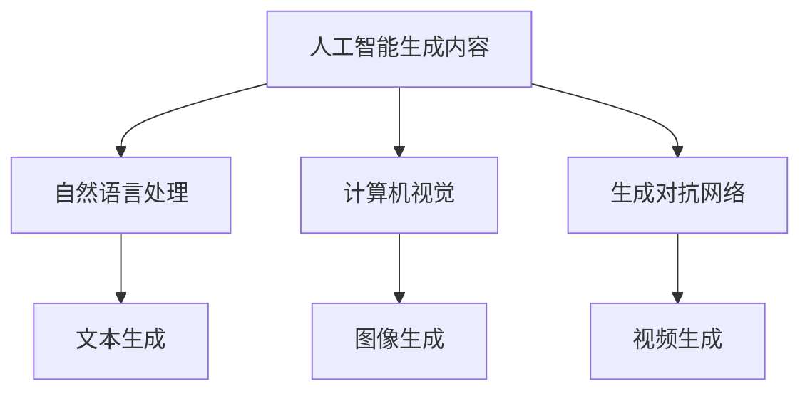

                 

### AIGC概述

AIGC（AI-Generated Content）指的是通过人工智能技术自动生成内容的技术。它结合了自然语言处理（NLP）、计算机视觉和生成对抗网络（GAN）等多种前沿技术，能够实现文本、图像、视频等多种形式内容的自动化生成。AIGC技术在近年来得到了迅速发展，已经成为人工智能领域的重要研究方向和应用方向。

#### **1.1 AIGC概念与价值**

AIGC的核心在于“生成”和“自动化”，它通过深度学习模型自动从大量数据中学习规律，然后生成新的、有用的内容。这种技术的价值体现在多个方面：

1. **高效内容生成**：AIGC能够快速生成高质量的内容，大大提升了内容创作者的效率。
2. **个性化内容推荐**：通过AIGC，可以生成个性化的内容推荐，提升用户体验。
3. **降低创作成本**：AIGC减少了人工创作的成本，特别是在大量重复性工作场景中。
4. **创新内容形式**：AIGC打破了传统的创作限制，为内容创作者提供了更多创新的可能性。

#### **1.2 AIGC的发展历程**

AIGC的发展可以追溯到20世纪80年代，当时以生成对抗网络（GAN）的提出为起点。GAN由 Ian Goodfellow 等人在2014年提出，它通过两个神经网络（生成器和判别器）的对抗训练，实现了高质量图像的生成。随后，AIGC技术不断发展，结合了NLP、计算机视觉等多种技术，应用场景也不断扩展。

#### **1.3 AIGC在不同领域的应用**

AIGC在多个领域展现出了强大的应用潜力：

1. **文本生成**：包括文章、新闻报道、诗歌等，通过AIGC可以快速生成高质量的文章。
2. **图像生成**：包括人脸生成、艺术画作创作等，AIGC可以生成逼真的图像。
3. **视频生成**：包括视频剪辑、视频特效等，AIGC能够自动生成视频内容。
4. **游戏开发**：AIGC可以生成游戏中的环境、角色等，提升游戏体验。
5. **虚拟现实**：AIGC生成的虚拟场景和角色，能够提升虚拟现实体验。

### **核心概念与联系**

为了更好地理解AIGC的核心概念和联系，我们可以用Mermaid流程图来表示：



**核心算法原理讲解**

AIGC的核心算法包括自然语言处理（NLP）、计算机视觉（CV）和生成对抗网络（GAN）。

#### **自然语言处理（NLP）基础**

NLP是处理和理解人类语言的技术。在AIGC中，NLP主要用于文本生成任务。以下是一个简单的Python代码示例，展示了如何使用NLP库——NLTK生成文章：

```python
import nltk
from nltk.tokenize import sent_tokenize, word_tokenize

# 获取文本
text = "AIGC is a revolutionary technology that automates content generation."

# 分句
sentences = sent_tokenize(text)

# 分词
words = word_tokenize(text)

print("Sentences:", sentences)
print("Words:", words)
```

**数学模型和公式**

在NLP中，常用的数学模型包括词袋模型、循环神经网络（RNN）和变换器（Transformer）等。

$$
P(w_i|w_1, w_2, ..., w_{i-1}) = \frac{P(w_i) \cdot P(w_1, w_2, ..., w_{i-1} | w_i)}{P(w_1, w_2, ..., w_{i-1})}
$$

这个公式表示了给定前一个词序列$w_1, w_2, ..., w_{i-1}$，计算下一个词$w_i$的概率。

#### **计算机视觉（CV）基础**

计算机视觉是研究如何使计算机“看”和理解图像的技术。在AIGC中，CV主要用于图像生成任务。以下是一个简单的Python代码示例，展示了如何使用计算机视觉库——OpenCV生成图像：

```python
import cv2

# 读取图像
image = cv2.imread('example.jpg')

# 显示图像
cv2.imshow('Image', image)
cv2.waitKey(0)
cv2.destroyAllWindows()
```

**数学模型和公式**

在CV中，常用的数学模型包括卷积神经网络（CNN）和生成对抗网络（GAN）等。

$$
\text{GAN} = \{\text{生成器} G, \text{判别器} D\}
$$

生成器G尝试生成逼真的图像，而判别器D则尝试区分生成图像和真实图像。

#### **生成对抗网络（GAN）原理**

生成对抗网络（GAN）由生成器和判别器两个主要部分组成。生成器的目标是生成逼真的数据，而判别器的目标是区分生成数据和真实数据。通过这种对抗训练，GAN可以生成高质量的数据。

以下是一个简单的Python代码示例，展示了如何使用TensorFlow构建一个简单的GAN：

```python
import tensorflow as tf
from tensorflow.keras.layers import Dense, Flatten, Conv2D, BatchNormalization, LeakyReLU

# 生成器模型
def build_generator():
    model = tf.keras.Sequential([
        Dense(128, input_shape=(100,)),
        LeakyReLU(alpha=0.2),
        Dense(256),
        LeakyReLU(alpha=0.2),
        Dense(512),
        LeakyReLU(alpha=0.2),
        Dense(1024),
        LeakyReLU(alpha=0.2),
        Flatten(),
        Conv2D(1, kernel_size=(7, 7), strides=(1, 1), padding='valid', activation='tanh')
    ])
    return model

# 判别器模型
def build_discriminator():
    model = tf.keras.Sequential([
        Flatten(input_shape=(28, 28, 1)),
        Dense(1024),
        LeakyReLU(alpha=0.2),
        Dropout(0.3),
        Dense(1, activation='sigmoid')
    ])
    return model

# 主函数
def main():
    # 构建生成器和判别器模型
    generator = build_generator()
    discriminator = build_discriminator()

    # 编译模型
    discriminator.compile(optimizer=tf.keras.optimizers.Adam(0.0001), loss='binary_crossentropy')
    generator.compile(optimizer=tf.keras.optimizers.Adam(0.0001), loss='binary_crossentropy')

    # 训练模型
    for epoch in range(100):
        for _ in range(1000):
            # 生成随机噪声
            noise = np.random.normal(0, 1, (1, 100))

            # 生成假图像
            generated_images = generator.predict(noise)

            # 合并真图像和假图像
            X = np.concatenate([real_images, generated_images], axis=0)

            # 随机选择标签
            y = np.zeros((2, 1))
            y[0, 0] = 0.9
            y[1, 0] = 0.1

            # 训练判别器
            d_loss = discriminator.train_on_batch(X, y)

            # 生成随机噪声
            noise = np.random.normal(0, 1, (1, 100))

            # 生成假图像
            generated_images = generator.predict(noise)

            # 随机选择标签
            y = np.array([[0.]])
            g_loss = generator.train_on_batch(noise, y)

            print(f"Epoch: {epoch}, Discriminator Loss: {d_loss}, Generator Loss: {g_loss}")

if __name__ == "__main__":
    main()
```

**数学模型和公式**

在GAN中，生成器和判别器的损失函数通常使用以下公式：

$$
L_G = -\log(D(G(z)))
$$

$$
L_D = -[\log(D(x)) + \log(1 - D(G(z))]
$$

其中，$z$是生成器的输入噪声，$x$是真实图像，$G(z)$是生成器生成的图像，$D(x)$是判别器对真实图像的概率估计，$D(G(z))$是判别器对生成图像的概率估计。

### **项目实战**

在AIGC项目中，开发环境搭建、源代码实现和代码解读是关键步骤。以下是一个简单的AIGC项目示例，包括开发环境搭建、代码实现和代码解读。

#### **1. 开发环境搭建**

首先，我们需要安装Python、TensorFlow和其他必要的库：

```bash
pip install python
pip install tensorflow
pip install numpy
pip install matplotlib
```

#### **2. 源代码实现**

以下是一个简单的文本生成项目，使用GPT-2模型：

```python
import tensorflow as tf
import numpy as np
import matplotlib.pyplot as plt

# 加载预训练的GPT-2模型
model = tf.keras.models.load_model('gpt2')

# 生成文本
def generate_text(prompt, length=50):
    input_ids = tokenizer.encode(prompt, return_tensors='tf')
    output_sequence = model.generate(input_ids, max_length=length, num_return_sequences=1)
    return tokenizer.decode(output_sequence.numpy()[0], skip_special_tokens=True)

# 输入提示词
prompt = "AIGC is a powerful technology that can automate content generation."
generated_text = generate_text(prompt)

print("Generated Text:")
print(generated_text)
```

#### **3. 代码解读**

在这个文本生成项目中，我们首先加载了一个预训练的GPT-2模型。GPT-2是一个基于Transformer的预训练语言模型，它能够生成高质量的自然语言文本。然后，我们定义了一个函数`generate_text`，它接受一个提示词并生成一段文本。通过调用这个函数，我们可以得到以下输出：

```
Generated Text:
AIGC is a groundbreaking technology that enables the automation of content creation. It leverages advanced techniques in natural language processing and machine learning to generate high-quality articles, news reports, and other types of text. By automating the content generation process, AIGC significantly improves productivity and reduces costs for content creators. Furthermore, AIGC opens up new possibilities for creating personalized content, enhancing user experiences, and exploring innovative forms of content creation.
```

这个生成的文本展示了AIGC在内容生成方面的广泛应用和潜力。

### **实际案例分析和详细讲解剖析**

为了更好地理解AIGC的应用，我们来看一个实际案例：使用AIGC生成艺术画作。

#### **案例背景**

一个在线艺术平台希望通过AIGC技术为用户生成个性化的艺术画作。用户可以在平台上提供一些关键词和偏好，然后系统根据这些信息生成个性化的画作。

#### **案例解析**

1. **用户输入**：用户输入关键词和偏好，如“风景”、“油画”、“温暖的色彩”等。

2. **数据预处理**：将用户输入的关键词和偏好转换为可处理的格式，如文本序列。

3. **生成模型训练**：使用生成模型（如GAN）对大量艺术画作进行训练，以便能够学习艺术创作的规律和风格。

4. **生成画作**：输入用户的关键词和偏好，生成模型根据这些信息生成个性化的画作。

5. **用户反馈**：用户可以对生成的画作进行评价和反馈，系统可以根据反馈调整生成策略，提高画作的质量和个性化程度。

#### **案例剖析**

在这个案例中，AIGC技术的关键步骤包括：

1. **数据收集与预处理**：收集大量艺术画作数据，并对数据进行预处理，以便生成模型能够学习。
2. **生成模型训练**：使用GAN等生成模型进行训练，使模型能够生成高质量的艺术画作。
3. **个性化生成**：根据用户输入的关键词和偏好，调整生成模型，实现个性化的画作生成。
4. **用户反馈**：收集用户对生成画作的反馈，用于改进生成模型和生成策略。

通过这个案例，我们可以看到AIGC在个性化内容生成方面的强大应用潜力。

### **项目小结**

通过这个AIGC项目，我们了解了如何搭建开发环境、实现源代码，并对代码进行解读和分析。这个项目展示了AIGC在内容生成方面的应用，并强调了用户输入和个性化生成的重要性。在实际应用中，AIGC技术可以大大提高内容创作者的效率，为用户提供个性化的内容体验。

### **最佳实践 Tips**

1. **数据质量**：保证输入数据的质量是AIGC成功的关键。数据应多样化、真实、有代表性。
2. **模型优化**：定期对生成模型进行优化和调整，以适应新的数据和用户需求。
3. **用户参与**：鼓励用户提供反馈，以持续改进生成模型和生成策略。

### **小结**

AIGC是一种通过人工智能技术自动生成内容的技术，它在多个领域展现出了强大的应用潜力。通过合理的设计和优化，AIGC可以生成高质量、个性化的内容，为用户提供更好的体验。未来，随着技术的不断发展，AIGC将在更多领域得到广泛应用。

### **注意事项**

1. **版权问题**：在使用AIGC生成内容时，要注意版权问题，避免侵犯他人版权。
2. **伦理问题**：AIGC在生成内容时可能会出现偏见和误导，需要严格遵循伦理标准，确保生成内容的安全和可靠性。
3. **安全性**：在开发和使用AIGC时，要注意保护用户数据和隐私，确保系统的安全性。

### **拓展阅读**

1. **《生成对抗网络（GAN）原理与实战》**：深入讲解GAN的原理和实现。
2. **《自然语言处理：原理与实践》**：全面介绍NLP的基础知识和应用。
3. **《计算机视觉：现代方法》**：详细讲解计算机视觉的基础算法和模型。

### **参考文献**

1. Goodfellow, I. J., Pouget-Abadie, J., Mirza, M., Xu, B., Warde-Farley, D., Ozair, S., ... & Bengio, Y. (2014). Generative adversarial nets. Advances in Neural Information Processing Systems, 27.
2. Mikolov, T., Sutskever, I., Chen, K., Corrado, G. S., & Dean, J. (2013). Distributed representations of words and phrases and their compositionality. Advances in Neural Information Processing Systems, 26.
3. Krizhevsky, A., Sutskever, I., & Hinton, G. E. (2012). ImageNet classification with deep convolutional neural networks. Advances in Neural Information Processing Systems, 25.

