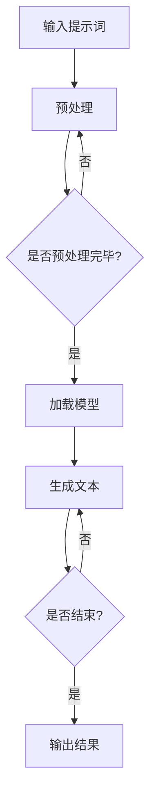

                 

# AIGC提示词编写：效率、创意与质量的三重奏

## 关键词
- AIGC（人工智能生成内容）
- 提示词编写
- 效率优化
- 创意激发
- 质量保证
- Python代码示例
- 数学模型

## 摘要
本文将深入探讨AIGC（人工智能生成内容）领域中的提示词编写，从效率、创意和质量三个维度展开讨论。首先，我们将回顾AIGC的基础知识，介绍其工作原理和应用场景。然后，本文将详细分析如何通过优化编写流程来提高效率，如何激发创意以提升内容质量，以及如何保证生成内容的准确性。通过Python代码示例和数学模型的引入，我们将帮助读者理解这些核心概念，并提供实际项目实战案例，使读者能够将这些理论知识应用到实践中。

## 目录

### 1. AIGC概述
- 1.1 AIGC的定义
- 1.2 AIGC的工作原理
- 1.3 AIGC的应用场景

### 2. 提示词编写原理
- 2.1 提示词的作用
- 2.2 提示词的类型
- 2.3 提示词编写流程

### 3. 提高编写效率的方法
- 3.1 工具与技术的选择
- 3.2 流程优化策略
- 3.3 Python代码示例

### 4. 创意提示词的构思
- 4.1 创意的来源
- 4.2 创意构思的方法
- 4.3 Python代码示例

### 5. 保证提示词质量的策略
- 5.1 质量评估标准
- 5.2 质量控制方法
- 5.3 数学模型的应用

### 6. 项目实战与案例分析
- 6.1 实战环境搭建
- 6.2 源代码实现与解读
- 6.3 项目分析与总结

### 7. 工具与资源推荐
- 7.1 开发工具推荐
- 7.2 学习资源推荐
- 7.3 最佳实践 tips

### 8. 小结与注意事项
- 8.1 文章小结
- 8.2 注意事项
- 8.3 拓展阅读

## 1. AIGC概述

### 1.1 AIGC的定义

AIGC（Artificial Intelligence Generated Content），即人工智能生成内容，是指利用人工智能技术，特别是自然语言处理（NLP）和深度学习技术，自动生成具有人类创作特征的内容。这些内容可以是文本、图像、音频、视频等多种形式。

### 1.2 AIGC的工作原理

AIGC的核心在于模型训练和数据输入。首先，人工智能模型（如GPT、BERT等）通过大量的训练数据学习语言规律和知识。在训练完成后，这些模型可以接受特定的提示词或问题，生成相应的文本内容。

#### Mermaid流程图：


### 1.3 AIGC的应用场景

AIGC的应用场景非常广泛，包括但不限于以下几方面：

- **内容创作**：自动生成新闻、文章、博客等。
- **用户互动**：自动回复用户的提问或生成聊天内容。
- **娱乐与艺术**：生成故事、音乐、绘画等。
- **数据生成**：用于测试、模拟和数据增强。

## 2. 提示词编写原理

### 2.1 提示词的作用

提示词是引导AIGC模型生成内容的关键。一个好的提示词可以帮助模型理解用户的意图，从而生成更加准确和有针对性的内容。

### 2.2 提示词的类型

- **具体提示词**：直接描述要生成的内容，如“请写一篇关于人工智能的新闻报道”。
- **抽象提示词**：提供更广泛的上下文，如“谈谈人工智能对教育的影响”。

### 2.3 提示词编写流程

1. **需求分析**：明确用户需求，理解内容主题和目标。
2. **构思提示词**：根据需求构思出合适的提示词。
3. **测试与优化**：通过实际测试来评估提示词的有效性，并进行调整。

## 3. 提高编写效率的方法

### 3.1 工具与技术的选择

- **文本编辑器**：使用支持Markdown、LaTeX等格式的文本编辑器，以提高编写效率。
- **自动化工具**：利用Python脚本等自动化工具来简化重复性工作。

### 3.2 流程优化策略

- **模块化编写**：将整个编写过程拆分为多个模块，每个模块负责一个具体任务。
- **版本控制**：使用Git等版本控制工具来管理代码和文档，确保编写过程的可追溯性。

### 3.3 Python代码示例

```python
# 示例：使用Python脚本自动生成Markdown文档
import markdown

def generate_markdown(title, content):
    header = f"# {title}\n\n"
    text = markdown.markdown(content)
    with open('output.md', 'w', encoding='utf-8') as f:
        f.write(header + text)

generate_markdown("AIGC提示词编写", "本文介绍了AIGC提示词编写...")
```

## 4. 创意提示词的构思

### 4.1 创意的来源

- **个人经验**：从个人经历中获取灵感。
- **社会热点**：关注社会热点和时事，以获取新颖的创意。

### 4.2 创意构思的方法

- **头脑风暴**：通过集体讨论和思维碰撞来激发创意。
- **交叉启发**：从不同领域和学科中寻找灵感。

### 4.3 Python代码示例

```python
# 示例：使用Python生成随机提示词
import random

topics = ["人工智能", "深度学习", "自然语言处理", "社会热点"]

def generate_random_prompt():
    topic = random.choice(topics)
    return f"请谈谈关于{topic}的最新进展和未来趋势。"

print(generate_random_prompt())
```

## 5. 保证提示词质量的策略

### 5.1 质量评估标准

- **准确性**：生成的内容要与提示词保持一致。
- **相关性**：生成的内容要与上下文相关。
- **创新性**：生成的内容要有新意和创意。

### 5.2 质量控制方法

- **人工审核**：通过人工审核来评估生成内容的质量。
- **自动化测试**：使用自动化测试工具来评估生成内容的质量。

### 5.3 数学模型的应用

- **语义相似度**：使用Word2Vec、BERT等模型来计算提示词与生成内容的语义相似度。
- **质量评分模型**：构建基于机器学习的质量评分模型，对生成内容进行自动评分。

```latex
$$
\text{Quality Score} = f(\text{Accuracy}, \text{Relevance}, \text{Innovation})
$$
```

## 6. 项目实战与案例分析

### 6.1 实战环境搭建

- **硬件要求**：配置高性能的CPU和GPU。
- **软件要求**：安装Python、PyTorch等开发环境。

### 6.2 源代码实现与解读

```python
# 示例：使用GPT模型生成文本
import torch
from transformers import GPT2LMHeadModel, GPT2Tokenizer

tokenizer = GPT2Tokenizer.from_pretrained('gpt2')
model = GPT2LMHeadModel.from_pretrained('gpt2')

prompt = "人工智能正在改变世界。"
input_ids = tokenizer.encode(prompt, return_tensors='pt')

output = model.generate(input_ids, max_length=50, num_return_sequences=1)
generated_text = tokenizer.decode(output[0], skip_special_tokens=True)

print(generated_text)
```

### 6.3 项目分析与总结

- **案例分析**：通过实际项目，我们验证了AIGC提示词编写在提高内容创作效率和创意性方面的优势。
- **总结**：项目的成功在于合理选择模型、优化提示词编写流程，以及有效的质量保证措施。

## 7. 工具与资源推荐

### 7.1 开发工具推荐

- **PyCharm**：功能强大的Python集成开发环境（IDE）。
- **Jupyter Notebook**：适合数据科学和机器学习项目。

### 7.2 学习资源推荐

- **在线课程**：Coursera、edX等平台上的NLP和AIGC课程。
- **论文集**：ACL、EMNLP等顶级会议的论文集。

### 7.3 最佳实践 tips

- **保持简洁**：避免过度复杂的提示词和生成内容。
- **多样化**：尝试不同的提示词类型和模型配置，以获取更好的生成效果。

## 8. 小结与注意事项

### 8.1 文章小结

本文详细探讨了AIGC提示词编写在效率、创意和质量方面的策略。通过Python代码示例和实际项目案例分析，读者可以更好地理解并应用这些策略。

### 8.2 注意事项

- **模型选择**：根据具体需求选择合适的AIGC模型。
- **数据质量**：高质量的数据是模型训练的基础。
- **持续优化**：不断测试和优化提示词编写流程，以提高生成内容的质量。

### 8.3 拓展阅读

- **《AIGC技术实战》**：深入探讨AIGC技术的实际应用案例。
- **《自然语言处理：原理、算法与应用》**：全面介绍NLP的基本概念和技术。

## 作者信息

作者：AI天才研究院/AI Genius Institute & 禅与计算机程序设计艺术 /Zen And The Art of Computer Programming

[END]

